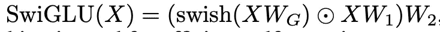

# 理解“你只需缓存一次”

> 原文：[`towardsdatascience.com/understanding-you-only-cache-once-89bf29f21c1d?source=collection_archive---------4-----------------------#2024-06-04`](https://towardsdatascience.com/understanding-you-only-cache-once-89bf29f21c1d?source=collection_archive---------4-----------------------#2024-06-04)

## 本文将详细探讨《你只需缓存一次：面向语言模型的解码器-解码器架构》论文及其发现。

 [Matthew Gunton](https://medium.com/@mgunton7?source=post_page---byline--89bf29f21c1d--------------------------------)

·发表于[数据科学前沿](https://towardsdatascience.com/?source=post_page---byline--89bf29f21c1d--------------------------------) ·阅读时间 9 分钟·2024 年 6 月 4 日

--

作者图片 — 由 Stable Diffusion 生成

随着大语言模型（LLM）领域的逐渐成熟，越来越多的努力致力于提升当前性能并使其更具成本效益。这一目标的实现方式包括为其创建定制硬件（例如 Groq 的语言处理单元），优化它们所交互的低层软件（例如苹果的 MLX 库或 NVIDIA 的 CUDA 库），以及在高层软件的计算过程中更加精细化。

《你只需缓存一次：面向语言模型的解码器-解码器架构》[论文](https://arxiv.org/pdf/2405.05254)提出了一种新的大语言模型架构，通过使用内存高效的架构来提高性能。他们称之为 YOCO。

让我们深入探讨一下！

# 键值（KV）缓存

为了理解这里所做的变化，我们首先需要讨论键值缓存。在变换器（transformer）中，我们有三个对注意力机制至关重要的向量——键（key）、值（value）和查询（query）。从高层次看，注意力机制是我们如何将关于前一个标记的关键信息传递给当前标记，以便它可以预测下一个标记。在单头自注意力的示例中，我们将当前标记的查询向量与前一个标记的键向量相乘，然后对结果矩阵进行归一化（我们称这个结果矩阵为注意力模式）。接着，我们将值向量与注意力模式相乘，以获得对每个标记的更新。然后，这些数据被加到当前标记的嵌入中，从而使其拥有了判断下一个标记所需的上下文。

方程 1 来自[“Attention Is All You Need”](https://arxiv.org/pdf/1706.03762.pdf)

我们为每一个新生成的 token 创建注意力模式，因此虽然查询会变化，键和值是恒定的。因此，当前的架构尝试通过缓存每次生成的键和值向量来减少计算时间。这种缓存称为键值缓存（Key-Value Cache）。

虽然像编码器单一模型和编码器-解码器模型这样的架构已经取得了一定成功，但作者认为上面所示的自回归机制及其带来的速度，是为什么如今解码器单一模型最常用的原因。

# YOCO 架构

要理解 YOCO 架构，我们必须从理解它如何设置其层开始。

在这一层的前半部分，我们使用一种类型的注意力机制来生成填充 KV 缓存所需的向量。一旦进入第二部分，它将分别使用 KV 缓存中的键和值向量，生成输出的 token 嵌入。

图 2[来自论文](https://arxiv.org/pdf/2405.05254)

这种新架构需要两种类型的注意力机制——高效自注意力和交叉注意力。我们将分别介绍这两种机制。

# 高效自注意力和自解码器

高效自注意力（ESA）旨在实现恒定的推理内存。换句话说，我们希望缓存的复杂度不依赖于输入长度，而是依赖于我们模块中的层数。在下面的方程中，作者抽象出了 ESA，但其余的自解码器部分保持一致，如下所示。

方程 1[来自论文](https://arxiv.org/pdf/2405.05254)

让我们一步一步地分析这个方程。X^l 是我们的 token 嵌入，Y^l 是用于生成下一个 token 嵌入 X^l+1 的中间变量。在方程中，ESA 表示高效自注意力，LN 是层归一化函数——这里始终使用的是根均方根归一化（`RMSNorm`），最后是`SwiGLU`。`SwiGLU`定义如下：

SwiGLU 定义[来自论文](https://arxiv.org/pdf/2405.05254)

这里`swish = x*sigmoid (Wg * x)`，其中 Wg 是一个可训练的参数。然后，我们找到这个结果与 X*W1 之间的元素按位乘积（Hadamard 乘积），再将整个乘积与 W2 相乘。`SwiGLU`的目标是获得一个激活函数，它能有条件地传递不同数量的信息，通过层传递到下一个 token。

来自[“Hadamard 乘积（矩阵）”](https://en.wikipedia.org/wiki/Hadamard_product_(matrices))的元素按位乘积（Hadamard 乘积）示例

现在我们了解了自解码器是如何工作的，让我们来看一下作者考虑实现 ESA 的两种方式。

# 门控保持 ESA

首先，他们考虑了所谓的门控保持（Gated Retention）。保持和自注意力的确非常相似，"Retentive Network: A Successor to Transformer for Large Language Models" 论文的作者指出，主要区别在于激活函数——保持移除了 softmax，从而实现了递归公式。他们使用这种递归公式及其并行性来提升内存效率。

深入数学细节：

方程 4 [来自论文](https://arxiv.org/pdf/2405.05254)

我们有典型的 Q、K 和 V 矩阵——每个矩阵都与其相应的可学习权重相乘。然后我们计算加权矩阵与标量 Θ 的 Hadamard 乘积。使用 Θ 的目标是创建指数衰减，然后我们使用 D 矩阵来帮助进行因果掩蔽（防止未来的标记与当前标记交互）和激活。

门控保持与通过 γ 值实现的保持是不同的。在这里，矩阵 Wγ 用来使我们的 ESA 数据驱动。

# 滑动窗口 ESA

滑动窗口 ESA 引入了限制注意力窗口应关注多少标记的概念。在常规自注意力中，所有先前的标记都会以某种方式被关注（即使它们的值为 0），而在滑动窗口 ESA 中，我们选择一个常数值 C 来限制这些矩阵的大小。这意味着在推理时，KV 缓存的复杂度可以保持恒定。

让我们再次深入探讨数学内容：

方程 8 [来自论文](https://arxiv.org/pdf/2405.05254)

我们将矩阵按其相应的权重进行缩放。接下来，我们计算注意力头，类似于多头注意力的计算方式，其中 B 既充当因果映射，又确保只有 C 后面的标记被关注。

无论是使用滑动窗口还是门控保持，层的前半部分目标都是生成 KV 缓存，然后在后半部分使用该缓存来生成输出标记。

现在我们将具体看看全局 KV 缓存如何加速推理过程。

# 交叉注意力和交叉解码器

一旦进入层的后半部分，我们首先创建全局 KV 缓存。该缓存由 K-hat 和 V-hat 组成，我们通过对来自层前半部分的标记进行层归一化处理，然后将其与相应的权重矩阵相乘来创建这些值。

方程 2 [来自论文](https://arxiv.org/pdf/2405.05254)

创建了全局 KV 缓存后，我们利用不同的解码器和注意力来生成下一个标记。接下来让我们深入探讨下面的数学内容：

方程式 3 [来自论文](https://arxiv.org/pdf/2405.05254)

我们通过获取标记嵌入并执行相同的归一化操作，然后进行矩阵乘法，生成查询矩阵，这与之前在 K-hat 和 V-hat 上执行的操作相同，唯一的区别是我们对每个通过的标记都执行此操作，而不仅仅是对来自第一半层末尾的标记。然后我们在三个矩阵上运行交叉注意力，使用之前的归一化和 `SwiGLU` 来确定下一个标记应该是什么。这个 X^l+1 就是接下来被预测的标记。

交叉注意力非常类似于自注意力，区别在于交叉注意力利用来自不同语料库的嵌入。

# 内存优势

让我们从分析 Transformers 和 YOCOs 之间的内存复杂度开始。对于 Transformer，我们必须在内存中保留输入序列的权重（N），以及每一层的权重（L），然后对于每个隐藏维度（D）执行相同的操作。这意味着我们存储的内存量是 L * N * D。

相比之下，YOCO 的拆分特性意味着我们有两种情况需要分析，以找出大 O 内存复杂度。当我们运行到第一半层时，我们正在执行高效的自注意力机制，而我们知道自注意力需要一个常数缓存大小（无论是通过滑动窗口注意力还是门控保持）。这使得它的大 O 依赖于每层的权重（L）和第一半层的隐藏维度数（D）。第二半层使用交叉注意力，它在内存中保持输入序列的权重（N），但随后使用常数全局缓存，因此从大 O 内存分析的角度来看，它不会改变。因此，唯一的其他依赖项是第二半层的隐藏维度数（D），我们可以认为它们是相同的。因此，我们存储的内存量为 L * D + N * D = (N + L) * D

表格 1 [来自论文](https://arxiv.org/pdf/2405.05254)

作者指出，当输入大小显著大于层数时，大 O 计算近似为 O(N)，这也是他们称其模型为“You Only Cache Once”的原因。

# 推理优势

在推理过程中，我们有两个主要阶段：预填充（有时称为初始化）和生成（有时称为解码）。在预填充阶段，我们将提示输入并创建生成第一个输出所需的所有计算。这可以从将模型权重加载到 GPU 内存中开始，然后以第一个标记的输出结束。一旦第一个输出创建完成，Transformer 的自回归特性意味着创建整个响应所需的大部分计算已经完成。

图 3 [来自论文](https://arxiv.org/pdf/2405.05254)

从预填充阶段开始，transformer 和 YOCO 模型将同时加载权重到 GPU 内存中，但在此之后，YOCO 有两个主要优势。首先，由于 YOCO 的自解码器可以并行运行，因此它的运行速度显著快于没有并行化的常规自注意力机制。其次，由于只有前半部分生成全局 KV 缓存，在预填充过程中只有一半的层需要运行，这大大减少了计算量。这两个因素使得 YOCO 的预填充阶段比 transformer 快得多（大约快 30 倍！）

在生成阶段，由于上述原因，我们使用 YOCO 时不需要像使用 transformer 时那样频繁更改 GPU 内存。这是 YOCO 能够实现高吞吐量的一个重要原因。

图 1 的部分[来自论文](https://arxiv.org/pdf/2405.05254)

所有这些指标都表明，单单架构的变化就能为这些模型带来显著的效率提升。

# 结论

随着新架构的出现，难免会面临一些困境。在已经花费数十亿美元训练旧架构的模型之后，公司理所当然地会质疑是否值得再花费数十亿资金来采用可能很快就会过时的新架构。

解决这一困境的一个可能方案是迁移学习。这里的想法是将噪声引入训练过的模型，然后利用给定的输出进行反向传播到新的模型。这里的想法是，你无需担心生成大量新的数据，并且你需要训练的 epoch 次数可能会显著减少。这个想法尚未完善，因此未来它将扮演怎样的角色还有待观察。

尽管如此，随着企业对这些架构的投入不断增加，改善成本的更新架构的潜力也将日益增加。时间会告诉我们，行业采纳这些架构的速度有多快。

对于那些正在构建能够实现模型之间无缝转换的应用程序的开发者，你可以参考 YOCO 在吞吐量和延迟方面所取得的重要进展，并希望你的应用程序面临的主要瓶颈很快会得到解决。

现在是构建的激动人心的时刻。

*特别感谢* [*Christopher Taylor*](https://www.linkedin.com/in/christopher-taylor-1a539a31) *对本文的反馈。*

[1] Sun, Y., et al. [“You Only Cache Once: Decoder-Decoder Architectures for Language Models”](https://arxiv.org/pdf/2405.05254) (2024), arXiv

[2] Sun, Y., et al. [“Retentive Network: A Successor to Transformer for Large Language Models”](https://arxiv.org/pdf/2307.08621) (2023), arXiv

[3] Wikimedia Foundation, et al. [“Hadamard product (matrices)”](https://en.wikipedia.org/wiki/Hadamard_product_(matrices)) (2024), Wikipedia

[4] Sanderson, G. 等人, [“变压器中的注意力机制，视觉化解释 | 第六章，深度学习”](https://youtu.be/eMlx5fFNoYc?feature=shared) (2024), YouTube

[5] A. Vaswani 等人, “[Attention Is All You Need](https://arxiv.org/pdf/1706.03762.pdf)” (2017), arXiv
