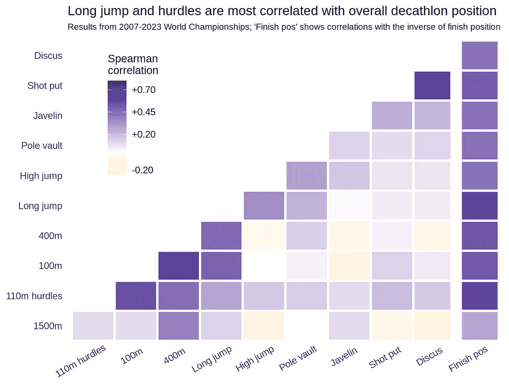

# 多项全能田径比赛中的不均衡得分

> 原文：[`towardsdatascience.com/uneven-scoring-in-multi-event-athletics-81569a491e47?source=collection_archive---------7-----------------------#2024-09-03`](https://towardsdatascience.com/uneven-scoring-in-multi-event-athletics-81569a491e47?source=collection_archive---------7-----------------------#2024-09-03)

## 七项全能和十项全能比赛中的表现和奖励模式

 [David Mulholland](https://medium.com/@davidmulholland17?source=post_page---byline--81569a491e47--------------------------------)

·发布于[Towards Data Science](https://towardsdatascience.com/?source=post_page---byline--81569a491e47--------------------------------) ·阅读时长：11 分钟·2024 年 9 月 3 日

--

图片由作者使用 DALL-E 3 生成

在观看[2024 年奥运会七项全能比赛](https://en.wikipedia.org/wiki/Athletics_at_the_2024_Summer_Olympics_%E2%80%93_Women%27s_heptathlon)时，我想起了七项全能比赛中每个项目的得分总是呈现出一种规律：第一个项目，100 米栏，通常在各项比赛中得分较高，而第三个项目，铅球，通常每名运动员的得分会少几百分。

这促使我思考了两个问题：i) **为什么得分是这样出来的**，以及 ii) 这是否意味着 **某些项目比其他项目更重要**，从而影响七项全能比赛的最终胜负？这些问题同样适用于十项全能比赛，当然，这也是本文讨论的内容。

# 数据

我从[维基百科](https://en.wikipedia.org/wiki/2015_World_Championships_in_Athletics_%E2%80%93_Women's_heptathlon)收集了 2007 年到 2023 年间世界锦标赛七项全能和十项全能比赛的结果。这些是这两项多项赛事的顶尖水平表现，因此从这项分析中获得的见解仅适用于这个高水平的赛事，而不一定适用于一般的七项全能或十项全能比赛。关于计分系统的详细信息来自[SportsCalculators](https://www.sportcalculators.com/heptathlon-scoring)，并由[世界田径](https://worldathletics.org/about-iaaf/documents/technical-information)最初发布。

在下面的分析中，我将使用“得分”一词来指代运动员在每个项目中记录的身体表现成绩（如高度、长度/距离或时间），而“积分”一词则指代基于该成绩获得的七项全能或十项全能积分。

# 结果：七项全能

## 积分分布

表 1：世界锦标赛七项全能各项目的积分。图像来自作者。

**表 1**中七项全能各项目所获得的平均（中位数）积分清晰地显示了我们所讨论的模式：短跑项目（200 米，特别是 100 米栏）平均比投掷项目（标枪和铅球）多出约 200 积分。这似乎令人惊讶，但不一定重要，因为所有运动员都参与所有项目，因此真正重要的是*相互之间的得分差异*。上表中的第三列显示了积分的四分位数范围；即第 25 和第 75 百分位数之间的差异，或者说是“中间一半”运动员的积分范围。这里我们看到，跑步项目的积分分布最为紧凑，而跳高和标枪的积分范围最大。这表明，某些项目中，相较于世界锦标赛水平的竞争者，表现较差与表现较好之间的差距在积分上更加重要。

## 计分系统

这一效应的原因在于计分系统。七项全能和十项全能的计分系统自 1984 年以来一直保持现有形式，并且为每个项目使用类似于以下形式的公式：

*积分 = a * (成绩与参考成绩 b 之间的差距) ^ c*

其中“^”表示“幂运算”。因此，每个项目都需要定义三个系数，*a*、*b* 和 *c*。这些系数的值在项目之间无法单独比较，但三个系数的组合会为每个项目创建一条积分曲线，如下所示在**图 1**中所示。[世界田径关于计分系统的文件](https://worldathletics.org/download/download?filename=c651eeb3-0f9d-47c0-9314-a3bd001e0960.pdf&urlslug=IAAF+Scoring+Tables+for+Combined+Events)解释了系数选择的一个因素是每个项目的世界纪录：期望每个项目中的世界纪录表现应产生相同数量的积分。他们指出，实际上，这意味着*“每个单独项目中创下的最佳成绩会有很大的差异”*，但更重要的是*“同一项目中不同运动员之间的得分差异大致与他们的表现差异成比例”*。

图 1：七项全能各项目的得分分布（黑色线条，10 至 90 百分位数以绿色显示），所获积分（蓝色线条，y 轴），以及世界纪录（红色虚线）。图像来自作者。

**图 1**中的蓝色线条显示了每个项目中得分与点数之间的关系。线条几乎是直线，特别是在绿色阴影得分区域内，这是得分的 80%所包含的区域，意味着**评分系统实际上可以视为一个线性系统**。（某些曲线有轻微的向上弯曲，尤其是在跳远和 800 米的高分段，这意味着优秀表现的奖励略高于真正的线性系统，但这些差异很小，不是本分析的关键点。）

更有趣的是**每个项目实际上可获得的得分范围**。这通过垂直箭头表示，箭头展示了从 10 百分位数的得分（绿色区域的左边缘）到 90 百分位数的得分（绿色区域的右边缘）所增加的得分。10 次表现中有 8 次落在这些范围内，低于或高于这些范围则在该项目中比较罕见。这个得分范围的大小（箭头的高度）在某些项目中明显较大，最显著的是标枪，而在其他项目中，如 100 米栏，则明显较小。这几乎与之前所见的四分位数范围数字相同。

每个项目的世界纪录位置（红色虚线）展示了为什么投掷项目的平均得分较低：**普通七项全能运动员的投掷距离仅为世界纪录的约 60%**（最佳专业运动员，单项运动员）**，无论是铅球还是标枪**，但同一运动员在 100 米栏和 200 米项目中的成绩可达到**世界纪录的 85%到 90%之间**（从时间转换而来）。

造成这种情况的原因可能有多个，但一个重要的后续点似乎是合理的假设：在某个项目的表现远低于世界纪录时，这个项目比那些表现已经接近极限的项目更有潜力改善。换句话说，大多数七项全能运动员与这些项目的专业运动员相比，表现相对较好（包括 800 米），但在标枪项目中，他们的表现通常与该项目的潜力相比存在较大的差距。然而重要的是，正如标枪得分的广泛分布所示，***一些*七项全能运动员可以相当擅长投掷标枪**。

为了更清楚地说明，接下来我将使用每个项目中的得分分布来衡量运动员在某项目中将表现从 50 百分位（比一半对手表现更好）提升到 60 百分位（比 10 个对手中有 6 个更好）时所获得的点数增益。使用这个度量的目的是，这种提升在每个项目中可能同样困难或同样可实现，因为它是根据其他七项全能运动员的成绩来衡量的。在确定百分位时，为避免跳高项目得分离散性问题（只有每 3 厘米的跳跃是可能的），将每个项目的原始得分建模为分布（大多数情况下为正态分布，跳高、100 米跨栏和 800 米为对数正态分布），并从这些分布中计算百分位。

图 2：各百分位 50 和 60 之间的得分差异，按七项全能项目分列。跑步、跳跃和投掷项目通过颜色区分。图像由作者提供。

结果（**图 2**）证实了**相对于同龄人提升同样的成绩能在田赛项目中获得更多的点数，而不是在跑步项目中**。在标枪项目中，相对于竞争对手提高 10%将是最有益的表现提升，能为七项全能运动员带来 28 个点数。稍后我们将讨论，是否在投掷项目上提升 10%的成绩真的像在跑步项目中提升 10%的成绩一样容易。

# 结果：十项全能

表 2：在世界锦标赛十项全能中的各项目得分。图像由作者提供。

十项全能中的情况大致与七项全能中的描述相似。在**表 2**中，我们发现，标枪再次表现出最大的四分位差异，接下来是 1500 米（它排在比女性最相似项目 800 米更高的位置）和撑杆跳。相反，短跑项目（100 米、110 米跨栏和 400 米）表现出较小的得分差异。顶级项目与底级项目之间的差异不像七项全能中那样明显。

图 3：按十项全能项目分布的得分（黑线，10–90 百分位绿色区域）、获得的点数（蓝线，纵轴）和世界纪录（红色虚线）。图像由作者提供。

得分分布和点数曲线（**图 3**）通过箭头的长度显示了典型得分范围（绿色区域的宽度）产生最大得分差异的项目：标枪、撑杆跳，紧随其后的是铁饼和 1500 米。再次，短跑跨栏显示了较小的得分差异：最差的跨栏选手与最好的跨栏选手相比，差距并不大。

1500 米在所有项目中得分最低，第 10 百分位的表现仅值约 600 分。这是因为蓝线的陡峭度决定了运动员每增加一秒远离世界纪录时，所受到的惩罚。蓝线不一定是这样的，但由于选择了系数 *a, b,* 和 *c*，它的形状正是如此。好的一面是，蓝线的陡峭度在 1500 米的不同得分之间创造了相对较大的得分差异，如下所示。

图 4：十项全能各项目在第 50 百分位和第 60 百分位之间的得分差异。跑步、跳跃和投掷项目按颜色区分。图片由作者提供。

使用之前相同的技术，将各项目得分建模为分布（1500 米、110 米栏和标枪为对数正态分布，其余为正态分布），并计算百分位，**图 4**显示了与七项全能项目相同的模式：相同百分比的得分提升在标枪中获得最多积分，在短跑项目中获得最少积分。

# 项目相关性

上述结果表明，最具技术性的几个项目应该是运动员最容易获得积分的项目。然而，**专注于一个项目的训练自然也会促进其他项目的进步**（并可能导致其他项目表现的下降），因此不能简单地把每个项目孤立考虑。投入到一个项目的努力的价值将取决于**该项目中可能获得的积分** *以及* **在其他相似项目中获得的互补效益**。

图 5：七项全能各项目得分之间的等级相关性，以及各项目得分与比赛中最终名次的逆相关性。图片由作者提供。

**图 5**的相关性图显示了七项全能各项目得分之间的相关性。相关性最高的是 200 米、100 米栏和跳远。这并不令人惊讶，因为一个优秀的短跑选手很可能在所有这些项目中表现良好。尽管相关性较小，但跳远与跳高之间、铅球与标枪之间也存在一定的相关性。

值得注意的是，**标枪与其他项目的整体相关性最小**。这与标枪作为一个需要特定技术的项目相一致，七项全能选手在通过提高其他项目成绩时，自然不会在标枪上取得很大进步，除非是（在某种程度上）铅球。标枪甚至与 200 米和 800 米跑之间表现出轻微的负相关性：在七项全能中，标枪投得更好的选手通常是跑得较差的选手。

图 6：十项全能各项目得分之间的等级相关性，以及各项目得分与比赛中最终名次的逆相关性。图片由作者提供。

在十项全能（**图 6**）中，短跑项目彼此之间有相关性，铅球和铁饼也有相关性，而撑竿跳高、标枪和 1500 米几乎与其他所有项目的相关性都很弱。

这改变了前一部分的结论。虽然在标枪、撑竿跳高或中长跑项目上相对于其他项目的提升应该能带来每单位提升最大的得分增益，但这种提升的好处可能会因为其他项目表现的下降而被削弱。另一方面，**在短跑类项目中提升技能往往会同时在相似的项目中带来增益**，这也许使得这种方法在整体比赛中更加高效。

最后，每个相关性表格（图 5 和图 6）中的最右列似乎证实了这一点。该列显示了每个项目的得分与七项全能或十项全能比赛最终名次之间的相关性（乘以-1，使得高排名变为最大值）。**与名次的最大相关性**——也就是运动员的得分最能决定他们在整体比赛中的名次——**出现在七项全能和十项全能中的跳远项目**，其次是七项全能中的跨栏和跳高，十项全能中的跨栏和 400 米。跳远的重要性可能源于它在比赛中的‘中心性’：它与其他几个项目的相关性相对较高。相反，**在十项全能中 1500 米的表现与最终名次的相关性最小**。这可能是因为最好的 1500 米选手通常在其他项目上没有显著优势，因此在总成绩中常常排在较低的位置。**十项全能通常由强力短跑选手赢得**，因为该运动员在 100 米、跨栏、400 米和跳远等项目中多次因为这一技能而获得积分。

# 结论

关于如何最好地应对七项全能和十项全能的见解，与我在分析开始时的预期有所不同。虽然似乎提升标枪得分是增加总得分的最有效方式，但表现最好的运动员通常在标枪项目上并不会特别突出。这可能是因为标枪所需的技能，以及在较小程度上撑竿跳高、铁饼和跳高所需的技能，不能很好地转移到其他项目上，因此这种努力的好处仅限于该项目的得分回报。

可以推测，这些是最具技术要求的项目，其中运动员可能通过小幅调整技术来‘解锁’较大的表现提升，尽管这很困难；而其他一些项目更多受力量或体能的控制，其中只有渐进的进步是可行的。可能正是技术改进的难度，加上普遍的体能提高所带来的共同效益，使得在短跑相关项目中提升分数成为更具吸引力的选择。

然而，这种平衡是由评分系统控制的。图 1 和图 3 中的每一条蓝色线条都在某一点上由世界纪录作为锚点，但线条的梯度似乎是一个可以选择的参数，可能本来可以做出不同的选择。梯度越大，越强调该项目中最佳和最差运动员之间的分数差异。事实上，**标枪和其他项目的较大梯度可能是必要的，以平衡这些较为孤立的项目与短跑项目改进所带来的共同效益**。如果图 2 和图 4 中的积分条在所有项目中都相等，那么就会减少人们在技术性项目上投入更多精力的动机，相比之下，短跑项目之间的相关性较高。

目前在近期内，多个赛事的评分系统发生变化的可能性几乎为零。我建议**图 5 和图 6 最右侧的列显示了这些系统当前运作良好**，因为没有任何赛事与最终名次完全不相关（这意味着这些赛事的表现对总体结果没有影响）。如果要对系统进行调整，可能可以考虑在这一列中实现更均衡的相关性，这意味着特别要提高 800 米和 1500 米的积分梯度，以增加在这些项目中表现良好的优势，代价是减少目前对最终排名影响较大的跳远和跨栏项目的权重。
