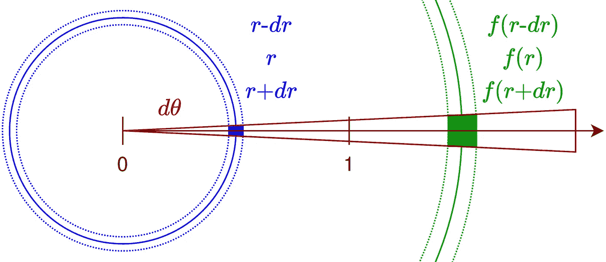
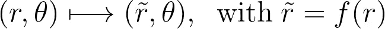
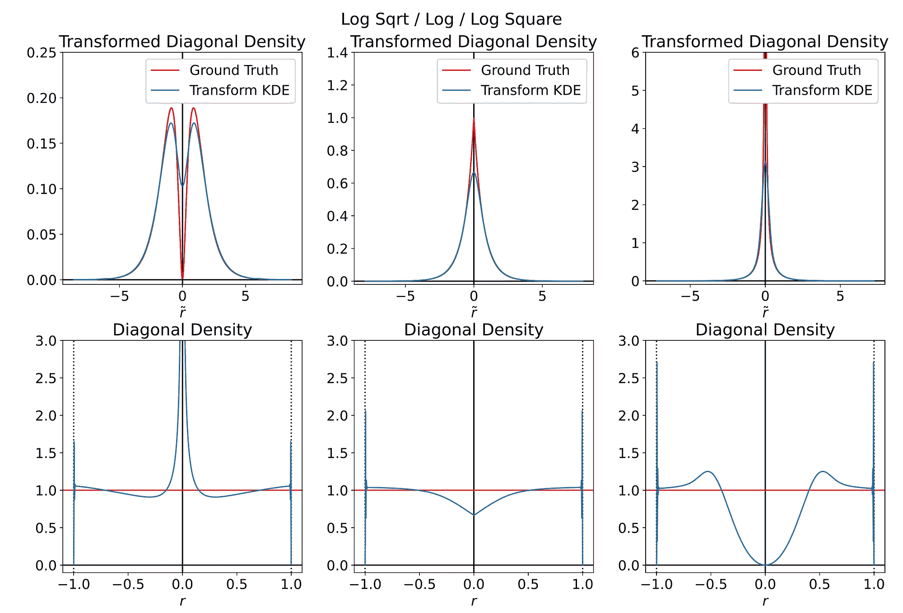

# 单位圆盘与 2D 有界核密度估计

> 原文：[`towardsdatascience.com/unit-disk-and-2d-bounded-kde-2cb5c3544f1c?source=collection_archive---------8-----------------------#2024-07-25`](https://towardsdatascience.com/unit-disk-and-2d-bounded-kde-2cb5c3544f1c?source=collection_archive---------8-----------------------#2024-07-25)

## 如何将有界核密度估计扩展到二维情况？让我们探索如何修正单位圆盘周围的边界偏差。

 [Thomas Rouch](https://medium.com/@thom01.rouch?source=post_page---byline--2cb5c3544f1c--------------------------------)

·发表于[Towards Data Science](https://towardsdatascience.com/?source=post_page---byline--2cb5c3544f1c--------------------------------) ·12 分钟阅读·2024 年 7 月 25 日

--

图片由[Leo_Visions](https://unsplash.com/@leo_visions_?utm_source=medium&utm_medium=referral)提供，来自[Unsplash](https://unsplash.com/?utm_source=medium&utm_medium=referral)

# 0. 引言

## 蒙特卡洛积分

当积分的闭式解不可用时，数值方法变得至关重要。虽然传统的数值积分技术如梯形积分对于低维和平滑积分非常有效，但随着被积函数维度的增加，它们的效率迅速下降，变得明显不可行。

与传统技术不同，蒙特卡洛方法通过利用随机性来评估积分，其收敛速度不依赖于被积函数的维度。它仅依赖于抽取的随机样本数量。

## 采样

如下方公式所示，蒙特卡洛通过加权平均被积函数在从给定分布中抽取的样本点上的值来估计积分。

因此，蒙特卡洛积分要求能够在任意维度上从任意分布中进行采样。

使用`n`个样本时，这些方法以`O(1/sqrt(n))`的速率收敛到正确结果。为了将误差减半，您需要四倍的样本量。因此，优化采样过程以最大化每个样本的效用至关重要。

均匀采样有助于确保被积函数的所有区域都有相同的概率被采样，从而避免提供少量附加信息的紧密间隔样本的冗余。

其他技术，如重要性采样，旨在通过优先采样被积函数的更重要区域来减少方差。

## 可视化 2D 磁盘采样

书籍 [*PBRT（基于物理的渲染：从理论到实现）*](https://pbrt.org/) 很好地解释了如何从不同几何体（如磁盘、三角形或半球）中进行采样，以计算描述光散射的积分方程的解。

我对发现的多种磁盘采样方法感到兴奋，并对它们的基本原理充满兴趣。为了更好地理解并直观比较这些 2D 分布，我决定为每种方法绘制一个密度图。

然而，在对磁盘进行核密度估计（KDE）时，会发生边界偏差，因为核函数扩展到磁盘的边界之外，导致边缘附近的密度被低估。

本文旨在提供一种可视化 2D 单位磁盘无偏密度图的方法。

## 文章大纲

基于我之前的文章 [*有界核密度估计*](https://medium.com/towards-data-science/bounded-kernel-density-estimation-2082dff3f47f)，在文章中我探讨了在 1D 上解决边界偏差的各种方法，我们将测试以下方法：

+   *反射*：相对于圆的边缘反射点

+   *变换*：将有界磁盘映射到无界空间，以执行 KDE

+   *加权*：裁剪并归一化超出磁盘的核心扩展

图片由 [Nathan Shipps](https://unsplash.com/@nateshipps?utm_source=medium&utm_medium=referral) 提供，来源于 [Unsplash](https://unsplash.com/?utm_source=medium&utm_medium=referral)

# 1. 磁盘周围的边界偏差

## 边界偏差

正如在引言中讨论的那样，传统的核密度估计（KDE）在处理具有紧凑支持的分布时表现不佳，例如磁盘内的点。

确实，如下图所示，在一个正方形领域中，核的扩展往往会超出边界，人工降低了边缘附近的密度。

核心泄漏超出正方形边界 — 图自作者

## 传统高斯 KDE

以下代码在单位正方形上按规律间隔采样网格点，仅保留位于磁盘内部的点，然后将其输入到传统高斯 KDE 中。KDE 评估后，磁盘外的预测密度被设为零，以保持边界约束。

最后，通过将密度乘以磁盘面积（π）来归一化密度，确保磁盘内部的预期密度为 1.0。

> 实际上，输入点并非位于规则的网格上，因此我们需要以显示分辨率对网格进行采样，以评估估计的 KDE。

以下左图是通过运行上述代码得到的。可以观察到圆盘边缘附近的密度明显下降。为了更好地展示边缘附近的下降，我还提取了沿对角线的密度分布图，理想情况下它应该是一个完美的阶跃函数。

左图：基于在单位圆盘内均匀抽取样本的 KDE。右图：对应的 1D 密度分布图沿密度图的对角线方向 — 作者提供的图。

照片由[Михаил Секацкий](https://unsplash.com/@sekatsky?utm_source=medium&utm_medium=referral)提供，来源于[Unsplash](https://unsplash.com/?utm_source=medium&utm_medium=referral)

# 2. 反射技巧

## 反射

在 1D 中，这个技巧的核心是通过将样本反射到左右边界外来增加样本集。这有助于弥补边界另一侧邻居的缺失。这相当于将局部核函数的尾部反射回来，保持它们在有界区域内。下面的公式用于反射正的 1D 值。

> 注意，当密度导数在边界处为零时，这种方法效果最佳。

然而，在 2D 中，并没有通用的反射公式；它取决于边界的形状。直观上，反射应该与边界法线对齐。因此，对于圆盘来说，将点沿径向反射是有意义的，这意味着反射只会修改半径。

> 注意，处理单位正方形的边界反射比处理圆盘要更具挑战性，因为正方形在角落处的边界线不可微。

## 直观的圆盘反射

直观上，我们可以通过将点对称地反射到边界外来模拟 1D 的情况。一个半径为`r`的点离边缘的距离为`1-r`。通过在边界外增加这个距离，我们得到`2-r`。下面的方程和图示演示了如何利用这种对称性将点反射到单位圆盘的边界外。

使用 f(r)=2-r 公式对单位圆盘边缘对称反射的彩色点。半径 r=1 和 r=2 的圆圈。 — 作者提供的图。

然而，当这种方法应用于校正密度图时，尽管它相较于标准 KDE 有了显著改善，但在边缘附近仍然可以看到轻微的下降。

左图：在单位圆盘内均匀抽取样本的反射 KDE。右图：对应的 1D 密度分布图沿密度图的对角线方向 — 作者提供的图。

## 优化的圆盘反射

让我们看看如何改进这个反射函数，以更好地适应圆盘边界。与一维情况不同，`f(r)=2-r` 的反射会扭曲空间，将面积为π的单位圆盘映射到一个面积为 3π的更大圆环上。

理想情况下，我们希望圆盘内每个微分面在反射映射过程中保持不变。如下面的图所示，我们考虑在半径 r 处的点周围的微分变化 dr 和 dθ。

反射前后的微分面（r, dr, dθ） — 图由作者提供

面积守恒导致了反射函数必须满足的微分方程。请注意，负号的出现是因为由于反射性质，函数 f 必然是递减的。

给定边界条件`f(1)=1`，该微分方程`-x=yy'`有唯一解。

我们只需要用新的反射公式更新我们的代码。现在，反射点被限制在半径为 1 和√2 之间的圆环内。如我们所见，反射点没有被过度扭曲，并保持相似的局部密度。

使用`f(r)=sqrt(2-r²)`反射穿过单位圆盘边缘的彩色点。半径为 r=1、r=sqrt(2)和 r=2 的圆圈。 — 图由作者提供

这次，得到的密度估计看起来几乎完美！

左：在单位圆盘内均匀抽样的优化反射 KDE。右：沿密度图对角线的相应一维密度分布 — 图由作者提供

照片来自[SpaceX](https://unsplash.com/@spacex?utm_source=medium&utm_medium=referral)提供，图片来源于[Unsplash](https://unsplash.com/?utm_source=medium&utm_medium=referral)

# 3\. 变换技巧

## 转换空间中的 KDE

变换技巧将有界数据映射到无界空间，在那里可以安全地应用普通的 KDE。这意味着每个输入样本将使用不同的核函数。

> 然而，正如在上一篇文章[*有界核密度估计*](https://medium.com/towards-data-science/bounded-kernel-density-estimation-2082dff3f47f)中所看到的，当密度在边界处非零且不趋向于无穷大时，往往会导致不想要的伪影。

## 变换

基于我们上一节的方法，我们将再次使用中心对称性，并选择一个仅改变半径的变换`f`。变换后的变量将用波浪符号`~`表示。

然而，与反射情况不同，在那里我们保持单位圆盘并仅使用变换来添加新点，在这里我们直接变换并使用单位圆盘内的点。

因此，边界条件是不同的，强制要求保持原点不变并将圆盘膨胀到无穷大。

## 密度变换

当对多维随机变量 U 应用变换 T 时，得到的密度是通过除以 T 的雅可比矩阵行列式的绝对值来计算的。

例如，极坐标变换给我们带来了以下密度。

基于之前的两个性质，我们可以推导出变换前后密度之间的关系。这将使我们能够从变换后的点估算的密度中恢复真实的密度。

## 该选择哪种变换？对数变换，还是反向变换？

有许多从零开始并在接近 1 时增加到无穷大的函数。没有一种通用的答案。

下图展示了使用对数和反向变换创建的潜在候选函数，用于在 `r=-1` 和 `r=1` 处引入奇异性。

下面是一些在原点为零并在接近 +/-1 时趋向于无穷大的函数示例 —— 图由作者提供

基于描述变换后的密度的方程，我们旨在找到一个变换，将均匀分布映射到一个通过普通 KDE 易于估算的形式。如果我们有一个均匀分布 `p(x,y)`，那么在变换后的空间中的密度与下方函数 `g` 成正比。

对数和反向变换候选给出了以下 `g` 函数。

当 `r` 接近零时，它们是等价的，只有当 α 等于一时，它们才会收敛到有意义的值。

下图展示了三种情况，每列对应具有 0.5、1 和 2 的 alpha 值的对数变换。

第一行显示了变换后的空间，比较了沿对角线的密度，蓝色表示在变换后的点上通过 KDE 估算的密度，红色表示原始空间中均匀分布对应的预期密度曲线。第二行显示了这些相同的曲线，但它们已映射回原始空间。

> 请记住，变换和 KDE 仍然在圆盘上的 2D 空间中执行。下面显示的一维曲线是从 2D 结果中提取的。

变换后和原始域内沿对角线的密度（第一行和第二行）。列对应于具有 alpha 值为 0.5 / 1 / 2 的对数变换 —— 图由作者提供

**α<1**和**α>1**在原点附近引入了奇点，完全破坏了内部密度估计。而对于**α=1**，变换空间中的预期密度在原点处是高度不可微的，呈现出尖顶形状，这种形状无法使用高斯核进行拟合。

此外，尾部密度对噪声非常敏感，可能会在边界附近产生高频伪影。在我看来，这个问题比我们试图解决的原始偏差更具挑战性。

## 尝试使用另一个核？

为了在**α=1**时实现更精确的拟合预期的尖形，我使用三角核而非高斯核来估计密度，如下面的代码所示。

尽管拟合稍有改善，但它在原点处仍然高度偏斜。此外，由于需要低带宽来拟合原点处非常陡峭的尖形，边界变得完全不稳定，并在高频率下振荡。

在变换后和原始域中的对角线上的密度（第一行和第二行），使用基于对数的变换和α等于 1 的三角滤波器 — 图由作者提供

## 尝试使用切线函数？

切线函数也被证明是一个合适的候选者，可以在`r=1`处引入奇点。

切线函数经过修改，趋向于无穷大，随着半径接近+/-1 — 图由作者提供

幸运的是，它对应的`g`函数在原点处是可微的，这应该使得拟合变得更容易。

> 为了保持可读性并避免冗余，我将不包括导致这些结果的数学细节。

然而，正如下面的图所示，我们仍然受到边界附近相同的不稳定性的影响。

在变换后和原始域中的对角线上的密度（第一行和第二行），使用基于切线的变换 — 图由作者提供

## 结论

该变换方法似乎不适用于我们在二维圆盘内的均匀分布。它在边界附近引入了过多的方差，并显著干扰了原本已经完全无偏的内部。

尽管性能较差，我还是生成了使用对数和切线变换的 Transform KDE 得到的结果 2D 密度图。

左：在单位圆盘内均匀抽样的对数变换 KDE。右：沿密度图对角线的相应一维密度轮廓 — 图由作者提供

左：在单位圆盘内均匀抽样的切线变换 KDE。右：沿密度图对角线的相应一维密度轮廓 — 图由作者提供

[Piret Ilver](https://unsplash.com/@saltsup?utm_source=medium&utm_medium=referral)拍摄的照片，来自[Unsplash](https://unsplash.com/?utm_source=medium&utm_medium=referral)

# 4. 切割与归一化技巧

## 加权

由于边界周围的密度由于缺乏邻居而人为降低，我们可以计算出我们局部核在边界外丧失的部分，并利用它来修正偏差。

在一维中，这涉及到计算高斯在某个区间上的积分。这是直接的，因为它可以通过估计区间两端的累积分布函数并相减来完成。

然而，在二维中，这需要计算一个二维高斯在圆盘上的积分。由于没有解析解，必须进行数值近似，从而使计算开销更大。

## 数值近似

对每个单独预测的密度执行数值积分将会非常昂贵。因为我们本质上是在计算一个二进制圆盘与高斯核之间的卷积，我建议对单位正方形进行离散化，以执行数值卷积。

在下面的代码中，我们假设一个各向同性的高斯分布，并获取核的标准差。随后，我们使用 OpenCV 对二进制圆盘掩码进行卷积，得到下图所示的数组。请注意，它与有偏 vanilla KDE 的接近程度。

对单位圆盘的二进制图像应用高斯模糊。半径为 1 的圆——图示由作者提供

## 结果

一旦修正的权重图被计算出来，我们可以将其应用于有偏的预测密度。修正后的密度图几乎是完美的。

左侧：在单位圆盘内均匀抽样的切割与归一化 KDE。右侧：对应的沿密度图对角线的 1D 密度轮廓——图示由作者提供

[Florian Schmetz](https://unsplash.com/@floschmaezz?utm_source=medium&utm_medium=referral)拍摄的照片，来自[Unsplash](https://unsplash.com/?utm_source=medium&utm_medium=referral)

# 结论

## 性能

**反射**和**切割与归一化**方法非常容易使用，并有效减轻了边界偏差。相比之下，**变换**方法在均匀的二维圆盘上表现不佳，尽管我们测试了多种特殊函数和核类型。

## 速度

**反射**方法转换了 KDE 的输入，而**切割与归一化**方法转换了其输出。

由于高斯 KDE 的时间复杂度是样本数量的平方，即 O(n²)，**反射**比**切割与归一化**慢大约四倍，因为它需要两倍于样本数。

因此，**Cut-and-Normalize**方法似乎是补偿二维均匀圆盘分布边界偏差的最简单和最快捷的方式。

## 可视化二维圆盘采样

现在我们可以模拟不同的圆盘采样策略，并基于它们的密度图进行比较，而无需担心边界偏差。

希望你喜欢阅读这篇文章，并且它为你提供了更多关于如何在二维情况下执行有界核密度估计的见解。
