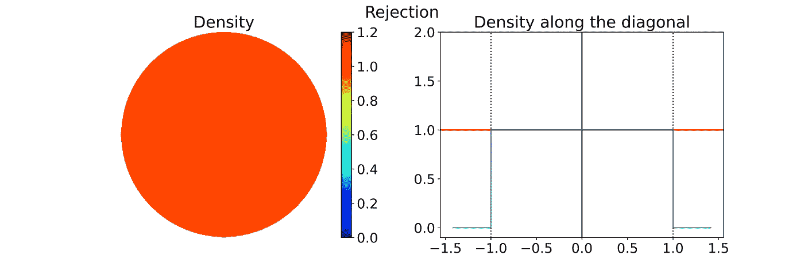
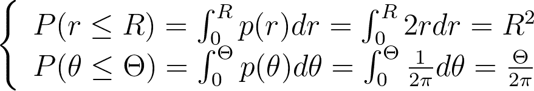
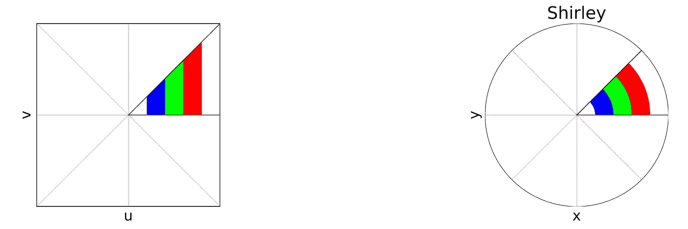
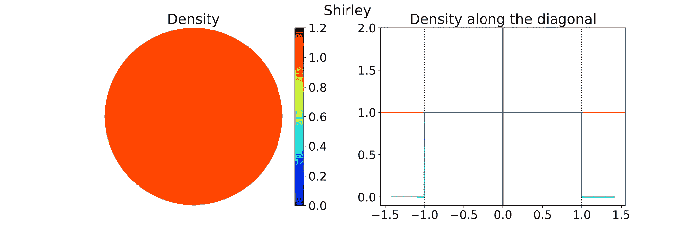

# 单位圆盘均匀采样

> 原文：[`towardsdatascience.com/unit-disk-uniform-sampling-91880f3740fa?source=collection_archive---------11-----------------------#2024-09-16`](https://towardsdatascience.com/unit-disk-uniform-sampling-91880f3740fa?source=collection_archive---------11-----------------------#2024-09-16)

## 发现适用于标准[0,1]均匀随机生成器的最佳变换，以均匀采样二维圆盘

 [Thomas Rouch](https://medium.com/@thom01.rouch?source=post_page---byline--91880f3740fa--------------------------------)

·发布于[Towards Data Science](https://towardsdatascience.com/?source=post_page---byline--91880f3740fa--------------------------------) ·13 分钟阅读·2024 年 9 月 16 日

--

图片来源：[Vitolda Klein](https://unsplash.com/@little_klein?utm_source=medium&utm_medium=referral) 通过[Unsplash](https://unsplash.com/?utm_source=medium&utm_medium=referral)

# 0\. 引言

在我之前的文章*单位圆盘和二维有界 KDE*中，我讨论了能够采样任意分布的重要性。这对于像蒙特卡罗积分这样的应用尤为重要，蒙特卡罗积分用于解决复杂的积分问题，例如在[*物理基础渲染* (PBRT)](https://pbrt.org/)中计算光散射。

与一维采样相比，二维采样引入了新的挑战。本文重点讨论如何均匀地采样二维单位圆盘，并可视化标准[0,1]均匀随机生成器应用变换后所产生的不同分布。

我们还将探讨这些变换虽然产生相同的分布，但如何通过引入畸变影响蒙特卡罗积分，导致方差增加。

# 1\. 如何均匀采样一个圆盘？

## 引言

随机数生成器通常提供许多预定义的采样分布。然而，对于高度特定的分布，你可能需要创建自己的分布。这涉及到组合和变换基本分布，以实现所需的结果。

例如，要均匀采样`a`和`b`之间的区间，可以对标准[0,1]均匀采样应用一个仿射变换。

在本文中，我们将探讨如何通过基于基本的[0,1]均匀采样来均匀地在二维单位圆盘内采样点。

> 为了提高可读性，我故意在本文中使用了“单位”一词的两种不同语境。“单位方形”指的是[0,1]²区域，反映了基础随机生成器的范围。相对地，“单位圆盘”则是在[-1,1]²内描述的，方便使用极坐标。在实践中，我们可以通过仿射变换轻松地在这两者之间映射。我们将`*u*`和`*v*`表示为从标准[0,1]或[-1,1]均匀分布中抽取的样本。

## 拒绝采样

使用[0,1]区间的均匀采样两次，可以均匀地采样单位方形区域[0,1]²。

一种非常简单的方法称为“拒绝采样”，其原理是在单位方形区域内进行采样，并拒绝所有落在圆盘外的样本。

单位方形内的圆盘拒绝采样。有效样本（绿色）和无效样本（红色）——图由作者提供

这导致了在单位方形内的圆盘区域内，点遵循均匀的二维分布，如下图所示。

> 本文中的密度图是通过从指定分布中采样多个点，并应用核密度估计器生成的。解决密度边界偏差的方法详细介绍在上一篇文章[**“单位圆盘和二维有界 KDE”**](https://medium.com/towards-data-science/unit-disk-and-2d-bounded-kde-2cb5c3544f1c)**中**。

左：通过核密度估计对 10000 个样本估算的二维圆盘拒绝采样密度。右：对应的沿密度图对角线的 1D 密度轮廓——图由作者提供

一个主要的缺点是，拒绝采样可能需要大量的点才能获得所需数量的有效样本，并且没有总数的上限，导致低效和更高的计算成本。

## 直观的极坐标采样

一种直观的方法是使用极坐标进行均匀采样：在[0,1]范围内画出半径，并在[0, 2π]范围内画出角度。

半径和角度都是均匀分布的，可能出什么问题呢？然而，这种方法会导致原点处的密度奇点无限大，如下图所示的经验密度图所示。

> 为了确保线性色图保持可读性，密度图的值被限制在一个任意的最大值 10。没有这个限制，地图将只在蓝色圆盘的中心显示一个红点。

左：通过核密度估计对 10000 个样本估算的二维圆盘极坐标采样密度。右：对应的沿密度图对角线的 1D 密度轮廓——图由作者提供

下图使用颜色展示了如何将采样点(u,v)的单位方形映射到使用上述极坐标变换定义的单位圆盘(x,y)。方形中的有色区域是相等的，但一旦映射到圆盘后，这种相等性就不再成立。这直观地展示了密度图：大半径的密度显著较低，因为它们分布在离原点更远的更宽的环形区域。

左：带有彩色列的单位方形。右：对应的极坐标映射到单位圆盘 — 图由作者提供

让我们来探索数学细节。当对一个多维随机变量 A 应用变换 T 时，得到的密度是通过除以 T 的雅可比矩阵行列式的绝对值来计算的。

极坐标变换由以下方程给出。

我们可以计算它的雅可比矩阵行列式。

因此，极坐标变换导致密度与半径成反比，从而解释了观察到的奇异性。

> 上面显示的沿对角线的 1D 密度曲线对应于逆函数的绝对值，之后在区间[-1, 1]之外被设为零。乍一看，这似乎有些反直觉，因为 1D 逆函数在[-1, 1]上并不可积！然而，重要的是要记住，积分是在二维空间中使用极坐标进行的，而不是在一维空间中。

## 均匀极坐标采样 — 微分方程

有两种方法可以找到正确的极坐标变换，从而得到均匀分布。可以通过解微分方程或使用反演方法来实现。让我们来探索这两种方法。

为了解决半径的异质性，我们引入一个函数`f`来进行调整：`r=f(u)`。然而，由于圆盘的对称性，角度保持一致。然后，我们可以解这个微分方程，确保相应雅可比矩阵的行列式保持常数，以保持相同的密度。

我们得到`ff'=c`，在边界条件`f(0)=0`和`f(1)=1`下，这有唯一解。最终我们得到了以下变换。

## 均匀极坐标采样 — 反演方法

在离散情况下，反演方法更容易理解。考虑三个可能的值 A、B 和 C，它们的概率分别为 60%、10%和 30%。如下面的图所示，我们可以将这些概率叠加起来，得到总高度为 100%。通过在 0%到 100%之间均匀地抽取一个百分比 U，并将其映射到堆叠中的对应值 A、B 或 C，我们可以将均匀采样转化为离散的非均匀分布。

离散情况下的反演法。左图：直方图。右图：累积分布函数——图源：作者

在连续情况下，这非常类似。反演法通过对 1D 变量`X`的概率分布函数（PDF）`p`进行积分，得到累积分布函数（CDF）`P(X<x)`，该函数从 0 增加到 1。然后，通过从[0,1]区间抽取一个均匀变量`U`并将其代入反 CDF，我们可以得到一个符合所需分布`p`的样本`x`。

假设一个均匀圆盘分布 p(x,y)，我们可以推导出相应的极坐标分布 p(r,θ)。

事实证明，该密度 p(r,θ)是可分离的，我们可以使用反演法独立地从它们各自的期望 1D 边缘密度中抽取 r 和θ。

> 当联合密度不可分时，我们首先从其边缘密度中抽取一个变量，然后根据第一个变量的条件密度抽取第二个变量。

我们将这些边缘密度整合为 CDF。

在[0,1]区间内均匀采样(u,v)，并应用反 CDF，可以得到以下变换，这与上面使用微分方程得到的结果相同。

结果分布有效地是均匀的，如下所示的经验密度图所确认。

左图：通过核密度估计在 10000 个样本上估算的 2D 圆盘正确极坐标采样的密度。右图：对应的沿密度图对角线的 1D 密度曲线——图源：作者

平方根函数有效地调整了彩色柱，以在映射到圆盘时保持它们的相对面积。

左图：带有彩色柱的单位正方形。右图：单位圆盘的极坐标映射和均匀极坐标映射——图源：作者

图片由[Tim Johnson](https://unsplash.com/@mangofantasy?utm_source=medium&utm_medium=referral)提供，来源于[Unsplash](https://unsplash.com/?utm_source=medium&utm_medium=referral)

# 2\. 如何均匀地采样一个圆盘，但减少畸变？

## 介绍

在诸如基于物理的渲染（参见[*PBRT (基于物理的渲染：从理论到实现)*](https://pbrt.org/)）等应用中，描述光散射的积分方程通过蒙特卡罗积分（MC）方法进行数值求解。

蒙特卡罗（MC）积分通过对样本所评估的算子值进行加权平均来估算积分。对于`n`个样本，它以`O(1/sqrt(n))`的速率收敛到正确的结果。为了将误差减半，需要四倍的样本。因此，优化采样过程，使每个样本的利用最大化是至关重要的。

像分层抽样（stratified sampling）这样的技术有助于确保被积函数的所有区域都有相同的采样概率，从而避免了紧密间隔的样本冗余，这些样本几乎不会提供额外的信息。

## 失真

我们之前讨论的映射是有效的，因为它均匀地对单位圆盘进行了采样。然而，它会在圆盘的某些区域造成失真，特别是在圆盘的外缘附近。单位方形的方形区域可能会映射到圆盘上非常细长和拉伸的区域。

左：带有彩色单元的单位方形。右：对应的均匀极坐标映射到单位圆盘 — 图示由作者提供

这种失真是有问题的，因为在方形上的采样失去了均匀分布的特性。靠近的(u,v)样本可能会导致圆盘上点的间距过大，从而导致方差增加。因此，在蒙特卡罗积分中需要更多样本来抵消这种方差。

在本节中，我们将介绍另一种均匀采样技术，它可以减少失真，从而防止方差不必要的增加。

## Shirley 的同心映射

1997 年，彼得·谢尔利（Peter Shirley）发表了[“*圆盘与方形之间的低失真映射*”](https://www.semanticscholar.org/paper/A-Low-Distortion-Map-Between-Disk-and-Square-Shirley-Chiu/43226a3916a85025acbb3a58c17f6dc0756b35ac)一文。他没有像我们通过半径和角度那样将均匀的单位方形视为一个没有空间含义的简单参数空间，而是建议将单位方形略微失真成单位圆盘。

这个方法的思想是将单位方形内的同心方形映射到单位圆盘内的同心圆，就像将方形的角拉紧，变圆一样。在下面的图中，与均匀极坐标采样相比，这种方法看起来更自然。

左：带有彩色同心方形的单位方形。右：对应的均匀极坐标和 Shirley 映射到单位圆盘 — 图示由作者提供

单位方形被分为八个三角形，对其中一个三角形定义映射，其他三角形则通过对称性推导出来。

左：单位方形中的参考三角形，带有彩色同心方形。右：对应的 Shirley 映射到单位圆盘 — 图示由作者提供

> 正如文章开头所提到的，切换[0,1]²和[-1,1]²单位方形的定义比在方程中使用繁琐的仿射变换更为方便。因此，我们将使用[-1,1]²单位方形来与[-1,1]²单位圆盘的定义对齐。

如上图所示，参考三角形由以下内容定义：

将同心正方形的垂直边映射到同心弧段意味着，每个给定横坐标 `u` 的点都会映射到半径 `r=u`。接下来，我们需要确定角度映射 `f`，以使单位圆盘内的分布均匀。

我们可以推导出相应雅可比矩阵的行列式。

对于均匀的圆盘分布，圆盘的第八扇区（对应参考三角形）内的密度如下所示。

另一方面，我们有：

通过将前三个方程与 `r=u` 结合，我们得到：

将之前的方程与零常数积分，以满足当 v=0 时 θ=0，得到角度映射。最终，我们得到以下映射。

其余七个三角形通过对称性推导得到。最终的分布实际上是均匀的，这一点可以通过下面显示的经验密度图得到验证。

左图：通过核密度估计在 10000 个样本上估计的 2D 圆盘 Shirley 采样密度。右图：对应的沿密度图对角线的 1D 密度轮廓 — 作者图

正如预期的那样，应用于彩色网格的 Shirley 映射与极坐标映射相比，显著减少了单元格的拉伸和畸变。

左图：带有彩色单元格的单位正方形。右图：对应的均匀极坐标和 Shirley 映射到单位圆盘 — 作者图

## Shirley 映射的变种

Shirley 方法中的 θ 映射并不直观。因此，正如下图所示，直觉上我们会认为它仅仅是 `y` 仅依赖于 `v` 这一更自然约束的结果，从而确保水平线保持水平。

左图：带有彩色单元格的单位正方形参考三角形。右图：对应的 Shirley 映射到单位圆盘 — 作者图

然而，这一直觉是错误的，因为水平线实际上是稍微弯曲的。上面展示的 Shirley 映射，即唯一符合 `r=u` 限制的均匀映射，强制执行了以下 y 值，随着 u 的变化而微妙地变化。

尽管我们知道它不会导致均匀分布，但为了实验目的，让我们探索一个变种，它使用 y 和 v 之间的线性映射。

> 这里展示的 Shirley 变种仅用于教学目的，旨在说明 Shirley 映射如何通过弯曲水平线进行改变。

我们通过将`v`按半对角线的长度进行缩放，获得`y`，这将正方形的右上角映射到磁盘的边缘。然后，可以通过使用半径约束`r=u`，从`y`推导出`x`的值。

下面的图显示了原始 Shirley 映射与其变体的并排对比。虽然这两幅图几乎相同，但值得注意的是，变体保持了线条的水平性。

左图：单位正方形中的参考三角形，带有彩色单元格。右图：映射到单位磁盘的 Shirley 和 Shirley 变体 —— 图由作者提供

正如预期的那样，经验密度图显示出明显的偏离均匀性，在 0.8 到 1.1 之间波动，而不是维持恒定值 1.0。

> 请记住，下面显示的密度取决于角度，因此，如果从不同的方向提取，1D 密度轮廓会有所不同。

左图：通过核密度估计法在 10000 个样本上估算的 2D 磁盘 Shirley 变体采样密度。右图：沿密度图对角线的对应 1D 密度轮廓 —— 图由作者提供

摄影作品来自[Antenna](https://unsplash.com/@antenna?utm_source=medium&utm_medium=referral)，发布于[Unsplash](https://unsplash.com/?utm_source=medium&utm_medium=referral)

# 3. 采样方法的视觉对比

## 在图像上应用映射

在本文的第二部分，展示正方形图像如何映射到磁盘有助于理解映射所导致的扭曲。

为了实现这一点，我们可以天真地将每个彩色像素从正方形投影到其对应的磁盘位置。然而，这种方法有缺陷，因为它不能确保磁盘上的每个像素都会被分配颜色。此外，某些磁盘像素可能会接收到多个颜色，从而导致颜色覆盖并产生不准确的结果。

正确的方法是反向操作：遍历磁盘像素，应用逆映射找到正方形中对应的浮动点像素，然后通过插值估算其颜色。这可以通过 OpenCV 的`cv2.remap`函数完成。

因此，当前的映射公式仅允许我们将磁盘转换为正方形图像。要从正方形映射到磁盘，我们需要反转这些公式。

> 为了简洁起见，这里不详细讨论逆公式。

以下每个子章节将使用特定的模式图像，展示正方形到磁盘和磁盘到正方形的映射。尽情探索吧！

## 彩色棋盘格

上图：带有彩色棋盘格的单位正方形。下图：映射到单位磁盘 —— 图由作者提供

顶部：带有彩色棋盘格的单位圆盘。底部：映射到单位正方形 — 图示作者

## 部分彩色棋盘格

顶部：带有部分彩色棋盘格的单位正方形。底部：映射到单位圆盘 — 图示作者

顶部：带有部分彩色棋盘格的单位圆盘。底部：映射到单位正方形 — 图示作者

## 同心正方形

顶部：带有同心正方形的单位正方形。底部：映射到单位圆盘 — 图示作者

顶部：带有同心正方形的单位圆盘。底部：映射到单位正方形 — 图示作者

## 列

顶部：带有彩色列的单位正方形。底部：映射到单位圆盘 — 图示作者

顶部：带有彩色列的单位圆盘。底部：映射到单位正方形 — 图示作者

## 同心圆

顶部：带有同心圆的单位正方形。底部：映射到单位圆盘 — 图示作者

顶部：带有同心圆的单位圆盘。底部：映射到单位正方形 — 图示作者

## 象限

顶部：带有象限的单位正方形。底部：映射到单位圆盘 — 图示作者

顶部：带有象限的单位圆盘。底部：映射到单位正方形 — 图示作者

## 面

顶部：带有作者头像的单位正方形。底部：映射到单位圆盘 — 图示作者

顶部：带有作者头像的单位圆盘。底部：映射到单位正方形 — 图示作者

图片来源：[and machines](https://unsplash.com/@and_machines?utm_source=medium&utm_medium=referral) 由 [Unsplash](https://unsplash.com/?utm_source=medium&utm_medium=referral) 提供

# 结论

## 均匀采样

使用均匀极坐标的简单圆盘采样方法是一个很好的示例，帮助理解变量变换如何影响其分布。

通过使用反演方法，你现在可以通过使用其逆累积分布函数（CDF），将[0,1]上的均匀采样转换为任何一维分布。

要对任何二维分布进行采样，我们首先从其边际密度中采样一个变量，然后根据第一个变量的条件密度绘制第二个变量。

## 变形与方差

根据你的使用场景，你可能希望确保附近的 (u,v) 样本在映射到圆盘时保持接近。在这种情况下，Shirley 变换比均匀极坐标采样更为可取，因为它引入的方差更小。
