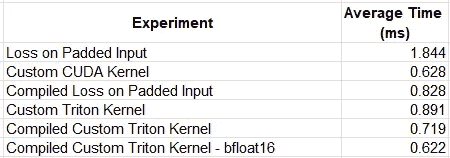

# 释放 Triton 的力量：掌握 Python 中的 GPU 核心优化

> 原文：[`towardsdatascience.com/unleashing-the-power-of-triton-mastering-gpu-kernel-optimization-in-python-160a3f52701e?source=collection_archive---------7-----------------------#2024-08-13`](https://towardsdatascience.com/unleashing-the-power-of-triton-mastering-gpu-kernel-optimization-in-python-160a3f52701e?source=collection_archive---------7-----------------------#2024-08-13)

## 加速 AI/ML 模型训练与自定义运算符——第二部分

[](https://chaimrand.medium.com/?source=post_page---byline--160a3f52701e--------------------------------)[](https://towardsdatascience.com/?source=post_page---byline--160a3f52701e--------------------------------) [Chaim Rand](https://chaimrand.medium.com/?source=post_page---byline--160a3f52701e--------------------------------)

·发表于 [Towards Data Science](https://towardsdatascience.com/?source=post_page---byline--160a3f52701e--------------------------------) ·10 分钟阅读·2024 年 8 月 13 日

--


图片来源：[Jas Rolyn](https://unsplash.com/@jasrolyn?utm_source=medium&utm_medium=referral) 在 [Unsplash](https://unsplash.com/?utm_source=medium&utm_medium=referral)

根据希腊神话，海神 Triton 通过吹响他的海螺来控制海水的潮汐和波浪，使海面平静或激起波涛。特别是在一个故事中，Triton 被描述为利用他的力量引导 [阿尔戈英雄](https://en.wikipedia.org/wiki/Argonauts)穿越极其危险的海域。在这篇文章中，我们同样召唤 Triton 来帮助我们导航复杂的旅程，虽然这次我们提到的是 [Triton 语言](https://github.com/triton-lang/triton) 和编译器，用于编写深度学习（DL）核心代码，并且探索我们在 AI/ML 开发领域的历程。

这是关于通过自定义运算符加速 AI/ML 应用的[上一篇文章](https://chaimrand.medium.com/accelerating-ai-ml-model-training-with-custom-operators-163ef2a04b12)的续集，在这篇文章中我们展示了通过开发自定义 CUDA 内核实现性能优化的潜力。我们的一个意图是强调自定义内核开发的可访问性以及它为非专业 CUDA 开发者提供的机会。然而，CUDA 开发存在一些挑战，可能对某些人来说难以克服。首先，尽管许多现代 AI/ML 开发者对 Python 非常熟悉，但他们可能不太愿意在 C++ 中开发。此外，要充分利用 GPU 的能力来调整一个 CUDA 内核，需要深入了解底层硬件架构，并且可能需要相当大的工作量。特别是如果你希望你的内核能够在多种 GPU 架构上运行得最佳，这一点尤为重要。复杂性很大程度上源于 CUDA 的“基于线程”的开发模型，在这种模型中，开发者需要负责设计和优化所有 GPU 内核线程的元素，包括与 GPU 内存使用、线程并发、TensorCore 调度等相关的所有细节。

## Triton 的力量

Triton 库旨在通过两种主要方式使 GPU 内核开发民主化并简化开发。首先，它提供了一个用于在*Python*中构建自定义运算符的 API（而不是 C++）。其次，它使得在*块*级别（而不是线程级别）进行内核开发成为可能，从而抽象化并自动化了与优化 CUDA 线程块内性能相关的所有问题。与其花费大量精力编写线程调用的详细信息，包括与内存管理、片上加速引擎调度、线程同步等相关的复杂性，内核开发者可以依赖 Triton 为他们完成这一切。Triton 编程模型的高层 API 抽象化的一个重要副产品是，它减少了需要为多种不同 GPU 类型和架构调整内核的负担。

当然，正如在提升 API 时通常会遇到的情况一样，Triton 编程模型确实存在一些缺点。有些内核可能会从 CUDA 提供的线程级控制中受益（例如，它们可能会从我们[上一篇文章](https://chaimrand.medium.com/accelerating-ai-ml-model-training-with-custom-operators-163ef2a04b12)中讨论的条件执行流程中受益）。其他内核可能需要非常专业和精细的处理才能达到最佳性能，并可能受到 Triton 编译器自动生成结果的影响。但即使在这种情况下，当最终可能需要开发一个 CUDA 内核时，能够快速轻松地创建一个临时的 Triton 内核也能极大地促进开发并提高生产力。

若想了解更多关于 Triton 背后的动机以及其编程模型的细节，请参见[Triton 公告](https://openai.com/index/triton/)、官方[Triton 文档](https://triton-lang.org/main/programming-guide/chapter-1/introduction.html#motivations)和原始[Triton 白皮书](https://www.eecs.harvard.edu/~htk/publication/2019-mapl-tillet-kung-cox.pdf)。

## 免责声明

类似于我们[之前的帖子](https://chaimrand.medium.com/accelerating-ai-ml-model-training-with-custom-operators-163ef2a04b12)，我们的目的是提供一个简单的示范，展示 Triton 所提供的机会。请不要将这篇文章视为官方[Triton 文档](https://triton-lang.org/main/index.html)或其[相关教程](https://triton-lang.org/main/getting-started/tutorials/index.html)的替代。我们将使用与我们[之前的帖子](https://chaimrand.medium.com/accelerating-ai-ml-model-training-with-custom-operators-163ef2a04b12)相同的面部检测模型作为演示的基础，并在相同的 Google Cloud 环境中进行实验——一台[g2-standard-16](https://cloud.google.com/compute/docs/gpus#l4-gpus)虚拟机（配备单个 L4 GPU），使用专用[深度学习虚拟机镜像](https://cloud.google.com/deep-learning-vm/docs/release-notes)和 PyTorch 2.4.0。像之前一样，我们并未优化我们的示例和/或验证其稳定性、持久性或准确性。需要注意的是，虽然我们将在 PyTorch 模型和 NVIDIA GPU 上执行实验，但 Triton 内核开发得到了额外框架和底层硬件的支持。

# Triton 作为 Torch 编译的组成部分

在之前的帖子中（例如，这里），我们展示了[PyTorch 编译](https://pytorch.org/tutorials/intermediate/torch_compile_tutorial.html)的使用以及它对运行时性能的潜在影响。[torch.compiler](https://pytorch.org/docs/stable/torch.compiler.html#torch-compiler)使用的默认编译器是[TorchInductor](https://dev-discuss.pytorch.org/t/torchinductor-a-pytorch-native-compiler-with-define-by-run-ir-and-symbolic-shapes/747)，它在 GPU 加速中严重依赖 Triton 内核。因此，似乎非常合适，我们通过评估[torch.compile](https://pytorch.org/docs/stable/generated/torch.compile.html)提供的自动 Triton 优化来开始我们的 Triton 探索。下面的代码块包括我们在之前的帖子中介绍的面部检测模型的相同前向传递，以及编译后的 GIOU 损失函数。为了简洁起见，我们省略了一些支持代码。有关完整实现，请参见我们的[之前帖子](https://chaimrand.medium.com/accelerating-ai-ml-model-training-with-custom-operators-163ef2a04b12)。

```py
 def loss_with_padding(pred, targets):
    mask = (targets[...,3] > 0).to(pred.dtype)
    total_boxes = mask.sum()
    loss = generalized_box_iou(targets, pred)
    masked_loss = loss*mask
    loss_sum = masked_loss.sum()
    return loss_sum/torch.clamp(total_boxes, 1)

device = torch.device("cuda:0")
model = torch.compile(Net()).to(device).train()
loss_fn = torch.compile(loss_with_padding)

# forward portion of training loop wrapped with profiler object
with torch.profiler.profile(
   schedule=torch.profiler.schedule(wait=5, warmup=5, active=10, repeat=1)
) as prof:
    for step, data in enumerate(train_loader):

        with torch.profiler.record_function('copy data'):
            images, boxes = data_to_device(data, device)
            torch.cuda.synchronize(device)

        with torch.profiler.record_function('forward'):
            with torch.autocast(device_type='cuda', dtype=torch.bfloat16):
                outputs = model(images)
            torch.cuda.synchronize(device)

        with torch.profiler.record_function('calc loss'):
            loss = loss_fn(outputs, boxes)
            torch.cuda.synchronize(device)
        prof.step()
        if step > 30:
            break

    # filter and print profiler results
    event_list = prof.key_averages()
    for i in range(len(event_list) - 1, -1, -1):
        if event_list[i].key not in ['forward', 'calc loss', 'copy data']:
            del event_list[i]
    print(event_list.table())
```

以下是经过多次运行平均后的性能结果：

```py
-------------  ------------  ------------
         Name     CPU total  CPU time avg
-------------  ------------  ------------
    copy data      56.868ms       5.687ms
      forward        1.329s     132.878ms
    calc loss       8.282ms     828.159us
-------------  ------------  ------------
```

记得原始损失函数（在填充输入上的）平均时间为 1.844 毫秒。因此，torch 编译带来的性能提升超过了 2 倍（!!）。

torch.compile 自动生成的 Triton 内核实际上可以通过设置 `TORCH_LOGS` 环境变量查看，正如[这个 PyTorch 教程](https://pytorch.org/tutorials/recipes/torch_logs.html)中所解释的那样。事实上，有人提议将这些内核作为 Triton 开发的起点（例如，见[这里](https://discuss.pytorch.org/t/choice-of-torch-compile-vs-triton/195604)）。然而，根据我们的经验，这些内核可能有些难以解读。

在下一节中，我们将尝试通过实现一个 GIOU Triton 内核，进一步改进 PyTorch 编译的结果。

# 创建自定义 Triton 内核

开始你 Triton 开发之旅的一个好地方是[官方 Triton 教程](https://triton-lang.org/main/getting-started/tutorials/index.html)。这些教程按复杂度递增的顺序介绍，每一篇都扩展了 Triton 独特特性中的一个或多个。我们的 GIOU Triton 内核最接近最基本的[向量加法](https://triton-lang.org/main/getting-started/tutorials/01-vector-add.html#sphx-glr-getting-started-tutorials-01-vector-add-py)示例。与我们的[CUDA 实现](https://chaimrand.medium.com/accelerating-ai-ml-model-training-with-custom-operators-163ef2a04b12)类似，我们将一个块分配给输入批次中的每个样本，并编程使其操作样本中的所有边界框。注意使用了[tl.load](https://chaimrand.medium.com/accelerating-ai-ml-model-training-with-custom-operators-163ef2a04b12)和[tl.store](https://triton-lang.org/main/python-api/generated/triton.language.store.html)从内存读取和写入数据，以及块程序使用的向量化算术。

```py
import triton
import triton.language as tl

@triton.jit
def giou_kernel(preds_ptr,
                targets_ptr,
                output_ptr,
                valid_ptr,
                BLOCK_SIZE: tl.constexpr):
    pid = tl.program_id(axis=0)
    box_id = tl.arange(0, BLOCK_SIZE)

    box_offsets = pid * BLOCK_SIZE + box_id

    preds_left = tl.load(preds_ptr + 0 + 4 * box_offsets)
    preds_top = tl.load(preds_ptr + 1 + 4 * box_offsets)
    preds_right = tl.load(preds_ptr + 2 + 4 * box_offsets)
    preds_bottom = tl.load(preds_ptr + 3 + 4 * box_offsets)

    gt_left = tl.load(targets_ptr + 0 + 4 * box_offsets)
    gt_top = tl.load(targets_ptr + 1 + 4 * box_offsets)
    gt_right = tl.load(targets_ptr + 2 + 4 * box_offsets)
    gt_bottom = tl.load(targets_ptr + 3 + 4 * box_offsets)

    epsilon = 1e-5

    # Compute the area of each box
    area1 = (preds_right - preds_left) * (preds_bottom - preds_top)
    area2 = (gt_right - gt_left) * (gt_bottom - gt_top)

    # Compute the intersection
    left = tl.maximum(preds_left, gt_left)
    top = tl.maximum(preds_top, gt_top)
    right = tl.minimum(preds_right, gt_right)
    bottom = tl.minimum(preds_bottom, gt_bottom)

    inter_w = tl.maximum(right - left, 0)
    inter_h = tl.maximum(bottom - top, 0)
    inter_area = inter_w * inter_h

    union_area = area1 + area2 - inter_area

    iou_val = inter_area / tl.maximum(union_area, epsilon)

    # Compute the smallest enclosing box
    enclose_left = tl.minimum(preds_left, gt_left)
    enclose_top = tl.minimum(preds_top, gt_top)
    enclose_right = tl.maximum(preds_right, gt_right)
    enclose_bottom = tl.maximum(preds_bottom, gt_bottom)

    enclose_w = tl.maximum(enclose_right - enclose_left, 0)
    enclose_h = tl.maximum(enclose_bottom - enclose_top, 0)
    enclose_area = enclose_w * enclose_h

    # Compute GIOU
    delta_area = (enclose_area - union_area)
    enclose_area = tl.maximum(enclose_area, epsilon)
    giou = iou_val - delta_area / enclose_area

    # Store results
    tl.store(output_ptr + (box_offsets),
             tl.where(gt_bottom > 0, giou, 0))
    tl.store(valid_ptr + (box_offsets), gt_bottom > 0)

def loss_with_triton(pred, targets):
    batch_size = pred.shape[0]
    n_boxes = pred.shape[1]

    # convert to float32 (remove to keep original dtypes)
    pred = pred.to(torch.float32)
    targets = targets.to(torch.float32)

    # allocate output tensors
    output = torch.empty_strided(pred.shape[0:2], 
                                 stride=(n_boxes,1),
                                 dtype = pred.dtype,
                                 device = pred.device)
    valid = torch.empty_strided(pred.shape[0:2],
                                stride=(n_boxes,1),
                                dtype = torch.bool,
                                device = pred.device)

    # call Triton kernel
    giou_kernel(batch_size,)

    total_valid = valid.sum()
    loss_sum = output.sum()
    return loss_sum/total_valid.clamp(1)
```

使用我们的 Triton 内核运行的结果如下所示。虽然比我们之前的实验稍差，但这可能是由于 torch.compile 执行了额外的优化。

```py
-------------  ------------  ------------
         Name     CPU total  CPU time avg
-------------  ------------  ------------
    copy data      57.089ms       5.709ms
      forward        1.338s     133.771ms
    calc loss       8.908ms     890.772us
-------------  ------------  ------------
```

根据 PyTorch 文档中关于[使用 Triton 内核](https://pytorch.org/tutorials/recipes/torch_compile_user_defined_triton_kernel_tutorial.html)的建议，我们进一步评估了我们的内核性能，这次结合了[PyTorch 编译](https://pytorch.org/tutorials/intermediate/torch_compile_tutorial.html)。结果（多次运行的平均值）略好于我们第一次实验中的自动编译损失。

```py
-------------  ------------  ------------
         Name     CPU total  CPU time avg
-------------  ------------  ------------
    copy data      57.008ms       5.701ms
      forward        1.330s     132.951ms
    calc loss       7.189ms     718.869us
-------------  ------------  ------------
```

在开发我们自定义的 GIOU CUDA 内核时，我们注意到将输入张量转换为 float32 的开销，并且需要增强我们的内核，以支持各种输入类型，避免这种转换。在我们的 Triton 内核中，这可以通过简单地去除转换操作来轻松完成。自定义内核将使用原始类型自动生成（JIT 编译）。

```py
-------------  ------------  ------------
         Name     CPU total  CPU time avg
-------------  ------------  ------------
    copy data      57.034ms       5.703ms
      forward        1.325s     132.456ms
    calc loss       6.219ms     621.950us
-------------  ------------  ------------
```

我们的最终结果与我们在[上一篇文章](https://chaimrand.medium.com/accelerating-ai-ml-model-training-with-custom-operators-163ef2a04b12)中看到的 CUDA 内核结果相当。

# 结果

下表总结了我们的实验结果。由于观察到一些变化，结果是多次运行的平均值。我们还包括了我们自定义 CUDA 内核的结果，参见我们的[上一篇文章](https://chaimrand.medium.com/accelerating-ai-ml-model-training-with-custom-operators-163ef2a04b12)，供参考。请记住，比较结果很可能会根据内核的细节和运行时环境有很大差异。



平均损失运行时摘要（按作者分类）

尽管我们第一次的 Triton 内核实验在性能上较自定义 CUDA 操作符有所下降，但通过应用编译并去除数据类型转换，我们成功地达到了相同的速度。

这些发现与人们对 Triton 的预期一致：一方面，它的高级 API 抽象意味着对低级流程的某种控制丧失，这可能导致运行时性能下降。另一方面，其 API 的（相对）简单性和强大功能使得用户可以通过更容易的实现来弥补性能差距，远比在 CUDA 中实现功能更加轻松。

有人可能会强烈认为我们选择评估的 Triton 内核是[文档](https://openai.com/index/triton/)中所称的“明显并行”，即由逐元素操作组成，因此，作为展示 Triton 价值的示范内核，这是一个糟糕的选择。事实上，可能需要一个更复杂的程序，涉及更复杂的内存管理、调度、同步等，才能展示 Triton 的全部潜力。

# 下一步

为了完成我们的任务，还需要几个额外步骤。这些步骤包括调优我们自定义的内核并实现反向传播函数。

## 1. 内核优化

尽管 Triton 抽象化了许多低级内核优化，但仍然存在许多控制项，这些控制项可能极大地影响运行时性能。这些包括每个块的大小、使用的线程束数（如[softmax 教程](https://triton-lang.org/main/getting-started/tutorials/02-fused-softmax.html#sphx-glr-getting-started-tutorials-02-fused-softmax-py)中所示），以及如何访问 L2 内存（有关 *swizzling* 的示例，参见[矩阵乘法教程](https://triton-lang.org/main/getting-started/tutorials/03-matrix-multiplication.html)）。Triton 包括一个[自动调优](https://triton-lang.org/main/python-api/generated/triton.autotune.html)功能，用于优化超参数的选择（如[矩阵乘法教程](https://triton-lang.org/main/getting-started/tutorials/03-matrix-multiplication.html)和[PyTorch Triton 示例](https://pytorch.org/tutorials/recipes/torch_compile_user_defined_triton_kernel_tutorial.html#advanced-usage)中所示）。尽管我们在示例中省略了自动调优，但它是 Triton 内核开发的一个关键步骤。

## 2\. 反向传播实现

我们将示例限制为仅包含 GIOU 损失函数的前向传播。完整的解决方案还需要为反向传播创建一个内核（如[层归一化](https://triton-lang.org/main/getting-started/tutorials/05-layer-norm.html)教程中所示）。这通常比前向传播要复杂一些。有人可能会想，为什么 Triton 所暴露的高级内核开发 API 没有通过支持自动微分来解决这个挑战。事实证明，出于超出本文讨论范围的原因（例如，见[这里](https://jax.readthedocs.io/en/latest/pallas/design.html#grad-of-pallas-call)），自定义内核的自动微分实现非常困难。尽管如此，如果 Triton 能支持这一功能，毫无疑问将会是其一个绝对杀手级的特性，我们只能希望它在未来的某个时候得到支持。

# 摘要

Triton 无疑是近年来最重要且最具影响力的 AI/ML 库之一。虽然很难评估它在 AI 领域所带来的创新和进展，但它的足迹无处不在——从 PyTorch 2 的核心实现及其依赖关系，到在日渐渗透到我们日常生活中的高级 LLM 模型中的[专门注意力层](https://triton-lang.org/main/getting-started/tutorials/06-fused-attention.html#sphx-glr-getting-started-tutorials-06-fused-attention-py)。

Triton 的流行归功于其创新的内核开发编程模型。曾经仅限于 CUDA 专家的领域，Triton 使每个 Python 开发者都能够轻松创建定制的深度学习原语。

在这篇文章中，我们仅仅触及了 Triton 及其功能的表面。务必查看 Triton 的在线[文档](https://triton-lang.org/main/index.html)和其他[资源](https://github.com/triton-lang/triton)以了解更多。
