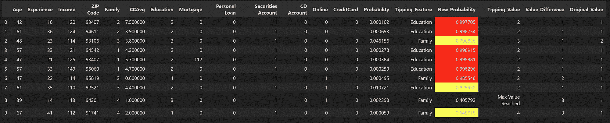

# 解锁隐藏的潜力：探索第二轮购买者

> 原文：[`towardsdatascience.com/unlocking-hidden-potential-exploring-second-round-purchasers-d47958c4d61c?source=collection_archive---------4-----------------------#2024-12-09`](https://towardsdatascience.com/unlocking-hidden-potential-exploring-second-round-purchasers-d47958c4d61c?source=collection_archive---------4-----------------------#2024-12-09)

## 使用 LLM 嵌入和机器学习模型寻找客户细分，以实现最佳再营销

[](https://medium.com/@iqbal.hamdi?source=post_page---byline--d47958c4d61c--------------------------------)[](https://towardsdatascience.com/?source=post_page---byline--d47958c4d61c--------------------------------) [Iqbal Hamdi](https://medium.com/@iqbal.hamdi?source=post_page---byline--d47958c4d61c--------------------------------)

·发表于 [Towards Data Science](https://towardsdatascience.com/?source=post_page---byline--d47958c4d61c--------------------------------) ·阅读时间 14 分钟·2024 年 12 月 9 日

--

## 引言

在本文中，我们讨论了一种方法，用于在二分类数据集中找到具有最大潜力转向目标类别的客户细分。这种方法可以应用于不同的用例，比如在促销活动的第二轮中选择性地定向客户，或者寻找网络中体验较差、但具有最大潜力转向理想类别的节点。

本质上，该方法提供了一种优先选择数据集中特定片段的方式，这些片段能够提供最大价值。


## 背景

在这个案例中，我们正在研究一个银行数据集。该银行正在通过开展营销活动，积极向潜在客户销售贷款产品。这个数据集是公开的，提供在 Kaggle 上：

[](https://www.kaggle.com/datasets/itsmesunil/bank-loan-modelling?source=post_page-----d47958c4d61c--------------------------------) [## Bank_Loan_modelling

### 个人贷款分类问题

www.kaggle.com](https://www.kaggle.com/datasets/itsmesunil/bank-loan-modelling?source=post_page-----d47958c4d61c--------------------------------)

上述问题的描述如下：

“Thera-Bank 的大多数客户都是存款客户。既是借款人（资产客户）的客户数量相对较少，银行希望迅速扩大这一客户群，以便做更多的贷款业务，同时通过贷款利息赚取更多收入。特别是，管理层希望寻找将负债客户转化为零售贷款客户的方式，同时保持他们作为存款客户。去年银行为存款客户开展的一项活动，成功的转化率超过了 9.6%。这促使零售营销部门制定更具目标性的营销活动，以更少的预算提高成功率。”

上述问题涉及到客户分类，并帮助优先考虑新客户。但是，如果我们能够利用第一轮收集的数据，针对那些第一轮没有购买贷款但在第二轮最有可能购买的客户（前提是他们的至少一个属性或特征发生了变化）呢？理想情况下，这个变化的特征应该是通过人工干预容易改变的，或者是随着时间的推移自然会发生变化的（例如，收入通常会随着时间的推移而增加，或者家庭规模、受教育程度等）。

# 解决方案

下面是该问题在本示例中的处理概述：


高级流程图

## 第 1 步-a：加载机器学习模型

在 Kaggle/Github 上有大量的笔记本提供了使用上述数据集进行模型调优的解决方案。我们将从假设模型已经调优并从我们的 MLFlow 库中加载它开始讨论。这是一个 F1 得分为 0.99 且 AUC 为 0.99 的 XGBoost 模型。此时的因变量（y_label）是‘Personal Loan’列。

```py
mlflow server --host 127.0.0.1 --port 8080
```

```py
import mlflow

mlflow.set_tracking_uri(uri="http://127.0.0.1:8080")

def get_best_model(experiment_name, scoring_metric):
  """
  Retrieves the model from MLflow logged models in a given experiment 
  with the best scoring metric.

  Args:
      experiment_name (str): Name of the experiment to search.
      scoring_metric (str): f1_score is used in this example

  Returns:
      model_uri: The model path with the best F1 score, 
                                  or None if no model or F1 score is found.
      artifcat_uri: The path for the artifacts for the best model
  """
  experiment = mlflow.get_experiment_by_name(experiment_name)

  # Extract the experiment ID
  if experiment:
      experiment_id = experiment.experiment_id
      print(f"Experiment ID for '{experiment_name}': {experiment_id}")
  else:
      print(f"Experiment '{experiment_name}' not found.")

  client = mlflow.tracking.MlflowClient()

  # Find runs in the specified experiment
  runs = client.search_runs(experiment_ids=experiment_id)

  # Initialize variables for tracking
  best_run = None
  best_score = -float("inf")  # Negative infinity for initial comparison

  for run in runs:
      try:
          run_score = float(run.data.metrics.get(scoring_metric, 0))  # Get F1 score from params
          if run_score > best_score:
              best_run = run
              best_score = run_score
              Model_Path = best_run.data.tags.get("Model_Type")

      except (KeyError):  # Skip if score not found or error occurs
          pass

  # Return the model version from the run with the best F1 score (if found)
  if best_run:

      model_uri = f"runs:/{best_run.info.run_id}/{Model_Path}"
      artifact_uri = f"mlflow-artifacts:/{experiment_id}/{best_run.info.run_id}/artifacts"
      print(f"Best Score found for {scoring_metric} for experiment: {experiment_name} is {best_score}")
      print(f"Best Model found for {scoring_metric} for experiment: {experiment_name} is {Model_Path}")
      return model_uri, artifact_uri

  else:
      print(f"No model found with logged {scoring_metric} for experiment: {experiment_name}")
      return None

Experiment_Name = 'Imbalanced_Bank_Dataset'
best_model_uri, best_artifact_uri = get_best_model(Experiment_Name, "f1_score")

if best_model_uri:
  loaded_model = mlflow.sklearn.load_model(best_model_uri)
```

## 第 1 步-b：加载数据

接下来，我们将加载数据集。这是用于训练模型的数据集，这意味着所有缺失数据的行或被认为是异常值的行已经从数据集中删除。我们还将计算每个客户购买贷款的概率（由‘Personal Loan’列给出）。然后我们会过滤出那些概率大于 0.5，但没有购买贷款的客户（‘Personal Loan’ = 0）。这些客户应按照预测模型购买贷款，但他们在第一轮没有购买，原因是数据集中的特征未能捕捉到的因素。这些也是模型错误预测的案例，导致准确率和 F1 得分低于 1。


混淆矩阵

在我们开始第二轮活动时，这些客户将成为定向营销方法的基础。

```py
import numpy as np
import pandas as pd
import os

y_label_column = "Personal Loan"

def y_label_encoding (label):

    try:

        if label == 1:
            return 1
        elif label == 0:
            return 0
        elif label == 'Yes':
            return 1
        elif label == 'No':
            return 0
        else:
            print(f"Invalid label: {label}. Only 'Yes/1' or 'No/0' are allowed.")
    except:
        print('Exception Raised')

def df_splitting(df):

    prediction_columns = ['Age', 'Experience', 'Income', 'ZIP Code', 'Family', 'CCAvg',\
                          'Education', 'Mortgage', 'Personal Loan', 'Securities Account',\
                          'CD Account', 'Online', 'CreditCard']
    y_test = df[y_label_column].apply(y_label_encoding)
    X_test = df[prediction_columns].drop(columns=y_label_column)

    return X_test, y_test

"""

load_prediction_data function should refer to the final dataset used for training. The function is not provided here

"""

df_pred = load_prediction_data (best_artifact_uri) ##loads dataset into a dataframe
df_pred['Probability'] = [x[1] for x in loaded_model.predict_proba(df_splitting(df_pred)[0])]
df_pred = df_pred.sort_values(by='Probability', ascending=False)
df_potential_cust = df_pred[(df_pred[y_label_column]==0) & (df_pred['Probability']> 0.5)]
print(f'Total customers: {df_pred.shape[0]}')
df_pred = df_pred[~((df_pred[y_label_column]==0) & (df_pred['Probability']> 0.5))]
print(f'Remaining customers: {df_pred.shape[0]}')
df_potential_cust
```

我们看到只有 4 个这样的案例被添加到潜在客户表中，并从主数据集中删除。


## 步骤-2：生成 SHAP 值

我们现在将生成 Shapley 值，以确定特征的局部重要性，并提取关键特征，即能够将客户从不希望的类别（‘个人贷款’ = 0）移动到希望的类别（‘个人贷款’ = 1）的特征。关于 Shapley 值的详细信息可以在此找到：

[](https://shap.readthedocs.io/en/latest/example_notebooks/overviews/An%20introduction%20to%20explainable%20AI%20with%20Shapley%20values.html?source=post_page-----d47958c4d61c--------------------------------) [## 介绍使用 Shapley 值的可解释 AI - SHAP 最新文档]

### 这是一个介绍如何通过 Shapley 值解释机器学习模型的内容。Shapley 值是一种广泛使用的……

shap.readthedocs.io](https://shap.readthedocs.io/en/latest/example_notebooks/overviews/An%20introduction%20to%20explainable%20AI%20with%20Shapley%20values.html?source=post_page-----d47958c4d61c--------------------------------)

我们还将查看一些重要特征，以了解它们与因变量（‘个人贷款’）的相关性。我们为此目的挑选的三个特征是‘收入’，‘家庭’（家庭规模）和‘教育’。正如我们稍后将看到的，这些是我们希望集中关注的特征，以便改变概率。

```py
import shap

explainer = shap.Explainer(loaded_model, df_pred)
Shap_explainer = explainer(df_pred)
shap.plots.scatter(Shap_explainer[:, "Income"], color=Shap_explainer[:, "Personal Loan"])
```


个人贷款购买量随收入增加

```py
shap.plots.scatter(Shap_explainer[:, "Family"], color=Shap_explainer[:,'Personal Loan'])
```


个人贷款购买量随家庭规模增加

```py
shap.plots.scatter(Shap_explainer[:, "Education"], color=Shap_explainer[:,'Personal Loan'])
```


个人贷款购买量随教育水平增加

我们可以看到，对于所有 3 个特征，当特征值增加时，个人贷款的购买量也随之增加，Shap 值随着特征值的增加而大于 0，表明这些特征对购买倾向有正面影响。

我们现在将为每个客户存储 shap 值到一个数据框中，这样我们就可以在后续处理中访问最重要的局部特征。

```py
X_test = df_splitting(df_pred)[0] ## Keeping only the columns used for prediction
explainer = shap.Explainer(loaded_model.predict, X_test) 
Shap_explainer = explainer(X_test)
df_Shap_values = pd.DataFrame(Shap_explainer.values, columns=X_test.columns)
df_Shap_values.to_csv('Credit_Card_Fraud_Shap_Values.csv', index=False)
```

## 步骤-3：创建向量嵌入：

下一步，我们将使用 LLM 模型为数据集创建向量嵌入。这样做的主要目的是能够进行向量相似度搜索。我们打算在数据集中找到那些没有购买贷款的客户，并找出与那些购买了贷款的客户最相似的客户。然后我们将选择最相似的客户，查看在改变这些客户最重要特征的值后，概率如何变化。

创建 LLM 向量嵌入的过程涉及多个步骤，本文中没有详细描述。如果想更好地理解这些过程，我建议阅读 Damian Gill 撰写的以下文章：

[](/mastering-customer-segmentation-with-llm-3d9008235f41?source=post_page-----d47958c4d61c--------------------------------) ## 精通客户细分与 LLM

### 使用大型语言模型（LLM）解锁先进的客户细分技术，并通过先进的技术改善您的聚类模型…

towardsdatascience.com

在我们的案例中，我们使用的是 Hugging Face 上可用的句子变换器 SBERT 模型。以下是该模型的详细信息：

[](https://huggingface.co/sentence-transformers?source=post_page-----d47958c4d61c--------------------------------) [## sentence-transformers（句子变换器）

### 以下是经过调整的用于句子/文本嵌入生成的模型。它们可以与…

huggingface.co](https://huggingface.co/sentence-transformers?source=post_page-----d47958c4d61c--------------------------------)

为了获得更好的向量嵌入，我们希望尽可能多地提供关于数据的文字描述。对于银行数据集，关于每一列的详细描述已在 Excel 文件‘Bank_Personal_Loan_Modelling.xlsx’的‘Description’表中提供。我们使用此描述作为列名。此外，我们将数值转换为稍微更具描述性的内容，而不仅仅是数字。例如，我们将列名**‘Family’**替换为**‘客户的家庭规模’**，并将该列中的值从整数（如**2**）转换为字符串（如**‘2 人’**）。以下是进行这些转换后的数据集示例：

```py
def Get_Highest_SHAP_Values (row, no_of_values = 1):

    if row.sum() < 0:
        top_values = row.nsmallest(no_of_values)
    else:
        top_values = row.nlargest(no_of_values)
    return [f"{col}: {val}" for col, val in zip(top_values.index, top_values)]

def read_orig_data_categorized(categorized_filename, shap_filename = ''):

    df = pd.read_csv(categorized_filename)
    if shap_filename!= '':
        df_shap = pd.read_csv(shap_filename)
        df['Most Important Features'] = df_shap.apply(lambda row: Get_Highest_SHAP_Values(row, no_of_values = 1), axis=1)

    return df

def Column_name_changes (column_description, df):

    df_description = pd.read_excel(column_description, sheet_name='Description',skiprows=6, usecols=[1,2])
    df_description.replace('#','No of ', inplace=True, regex=True)
    df_description.replace('\(\$000\)','', inplace=True, regex=True)
    df_description.loc[df_description['Unnamed: 1']=='Education','Unnamed: 2'] = 'Education Level'
    mapping_dict = dict(zip(df_description['Unnamed: 1'], df_description['Unnamed: 2']))
    df = df.rename(columns=mapping_dict)

    return df

Original_Categorized_Dataset = r'Bank_Personal_Loan_Modelling_Semantic.csv' ## Dataset with more description of the values  sorted in the same way as df_pred and df_Shap_values
Shap_values_Dataset = r'Credit_Card_Fraud_Shap_Values.csv' ## Shap values dataset 
column_description = r'Bank_Personal_Loan_Modelling.xlsx' ## Original Bank Loan dataset with the Description Sheet

df_main = read_orig_data_categorized(Original_Categorized_Dataset, Shap_values_Dataset)
df_main = df_main.drop(columns=['ID','ZIP Code'])
df_main = Column_name_changes(column_description, df_main)
df_main.sample(5)
```


我们将创建两个独立的数据集——一个是购买了贷款的客户，另一个是没有购买的客户。

```py
y_label_column = 'Did this customer accept the personal loan offered in the last campaign?'
df_main_true_cases = df_main[df_main[y_label_column]=="Yes"].reset_index(drop=True)
df_main_false_cases = df_main[df_main[y_label_column]=="No"].reset_index(drop=True)
```

我们将为这两种情况创建向量嵌入。在将数据集传递给句子变换器之前，以下是银行客户数据集每一行的样子：


一个客户输入示例，用于句子变换器

```py
from sentence_transformers import SentenceTransformer

def df_to_text(row):

    text = ''
    for col in row.index:
        text += f"""{col}: {row[col]},"""
    return text

def generating_embeddings(df):

    sentences = df.apply(lambda row: df_to_text(row), axis=1).tolist()
    model = SentenceTransformer(r"sentence-transformers/paraphrase-MiniLM-L6-v2")
    output = model.encode(sentences=sentences,
            show_progress_bar=True,
            normalize_embeddings=True)
    df_embeddings = pd.DataFrame(output)

    return df_embeddings

df_embedding_all = generating_embeddings(df_main)
df_embedding_false_cases = generating_embeddings(df_main_false_cases)
df_embedding_true_cases = generating_embeddings(df_main_true_cases)
```

## 第 4 步+5 步：进行向量搜索

接下来，我们将使用欧几里得距离 L2 进行近似最近邻相似性搜索，并使用 Facebook AI 相似性搜索（FAISS），为这些向量数据集创建 FAISS 索引。我们的目标是寻找‘Personal Loan = 0’数据集中与‘Personal Loan = 1’数据集中最相似的客户。基本上，我们在寻找那些没有购买贷款但与购买贷款的客户最相似的客户。在这种情况下，我们通过设置 k=1（一个近似最近邻）为每个‘true’客户搜索一个‘false’客户，并根据距离对结果进行排序。

有关 FAISS 相似性搜索的详细信息，请参见此处：

[](https://github.com/facebookresearch/faiss?source=post_page-----d47958c4d61c--------------------------------) [## GitHub - facebookresearch/faiss：一个用于高效相似性搜索和稠密向量聚类的库…

### 一个用于高效相似性搜索和稠密向量聚类的库。 - facebookresearch/faiss

github.com](https://github.com/facebookresearch/faiss?source=post_page-----d47958c4d61c--------------------------------)

这里有另一篇文章解释了如何使用 L2 与 FAISS：

[](https://medium.com/loopio-tech/how-to-use-faiss-to-build-your-first-similarity-search-bf0f708aa772?source=post_page-----d47958c4d61c--------------------------------) [## 如何使用 FAISS 构建您的第一个相似性搜索

### 在 Loopio，我们使用 Facebook AI 相似性搜索（FAISS）高效地搜索相似文本。找到与…

medium.com](https://medium.com/loopio-tech/how-to-use-faiss-to-build-your-first-similarity-search-bf0f708aa772?source=post_page-----d47958c4d61c--------------------------------)

```py
import faiss

def generating_index(df_embeddings):

    vector_dimension = df_embeddings.shape[1]
    index = faiss.IndexFlatL2(vector_dimension)
    faiss.normalize_L2(df_embeddings.values)
    index.add(df_embeddings.values)

    return index

def vector_search(index, df_search, df_original, k=1):

    sentences = df_search.apply(lambda row: df_to_text(row), axis=1).tolist()
    model = SentenceTransformer(r"sentence-transformers/paraphrase-MiniLM-L6-v2")
    output = model.encode(sentences=sentences,
            show_progress_bar=False,
            normalize_embeddings=True)
    search_vector = output
    faiss.normalize_L2(search_vector)
    distances, ann = index.search(search_vector, k=k)
    results = pd.DataFrame({'distances': distances[0], 'ann': ann[0]})
    df_results = pd.merge(results, df_original, left_on='ann', right_index= True)

    return df_results

def cluster_search(index, df_search, df_original, k=1):

    df_temp = pd.DataFrame()
    for i in range(0,len(df_search)):
        df_row_search = df_search.iloc[i:i+1].values
        df_temp = pd.concat([df_temp,vector_search_with_embeddings(df_row_search, df_original, index, k=k)])
    df_temp = df_temp.sort_values(by='distances')
    return df_temp

def vector_search_with_embeddings(search_vector, df_original, index, k=1):

    faiss.normalize_L2(search_vector)
    distances, ann = index.search(search_vector, k=k)
    results = pd.DataFrame({'distances': distances[0], 'ann': ann[0]})
    df_results = pd.merge(results, df_original, left_on='ann', right_index= True)

    return df_results

index_all = generating_index(df_embedding_all)
index_false_cases = generating_index(df_embedding_false_cases)
index_true_cases = generating_index(df_embedding_true_cases)

df_results = cluster_search(index_false_cases, df_embedding_true_cases, df_main_false_cases, k=1)
df_results['Most Important Features'] = [x[0] for x in df_results['Most Important Features'].values]
df_results ['Tipping_Feature'] = [x[0] for x in df_results['Most Important Features'].str.split(':')]
df_results = df_results.drop_duplicates(subset=['ann'])
df_results.head(10)
```

这将给我们列出与已购买贷款的客户最相似且最有可能在第二轮购买的客户，前提是阻碍他们第一次购买的最重要特征稍微发生变化。现在可以优先处理这份客户名单。


## Step-6：与其他方法的比较

在这一点上，我们希望评估上述方法是否值得花费时间，以及是否存在另一种更高效的方式来提取相同的信息？例如，我们可以考虑将‘False’客户中具有最高概率的客户视为最有可能进行第二轮购买的客户。将这样一份名单与上述名单进行比较，可以帮助我们判断是否有更快速的方式来得出结论。

为此，我们只需加载我们之前创建的概率数据集，然后选择概率最高的前 10 个‘False’客户。

```py
df_trial_customers = df_pred[df_pred['Personal Loan']==0].iloc[0:10]
df_trial_customers
```


这个名单与我们第一个名单相比有多有效？我们如何衡量这一点？为此，我们希望将名单的有效性定义为能够将客户轻微调整后转为目标类别的百分比，方法是通过对最重要特征进行轻微变化后重新计算概率值。对于我们的分析，我们将仅关注教育和家庭这两个特征——这些特征更有可能随着时间的推移发生变化。尽管收入也可以纳入此类别，但为了简化分析，我们暂时不考虑收入。我们将从两个名单中筛选出前 10 个客户，这些客户将作为 Tipping_Feature。

这将给我们提供以下两份名单：

+   List_A：这是我们使用相似性搜索方法得到的名单

+   List_B：这是我们通过按概率对 False 案例进行排序得到的名单

```py
features_list = ['Education', 'Family']
features_list = ('|').join(features_list)
df_list_A_Sim_Search = df_results[df_results['Tipping_Feature'].str.contains(features_list, case=False)].head(10)
df_list_A_Sim_Search
```


我们将把 A 列表转换回原始格式，然后可以被 ML 模型用来计算概率。这需要参考原始的 df_pred 数据集，下面是可以用来实现这一目的的函数。

```py
def main_index_search(results_df, df_given_embeddings, df_original, search_index):

    df_temp = pd.DataFrame()
    for i in range(0,len(results_df)):
        index_number = results_df['ann'].iloc[i]
        df_row_search = df_given_embeddings.iloc[index_number:index_number+1].values
        df_temp = pd.concat([df_temp,vector_search_with_embeddings(df_row_search, df_original, search_index, k=1)])

    return df_temp

df_list_A_Sim_Search_pred = pd.concat([(main_index_search(df_list_A_Sim_Search, df_embedding_false_cases, df_pred, index_all).drop(columns=['distances','ann'])),\
                    df_list_A_Sim_Search ['Tipping_Feature']], axis=1).reset_index(drop=True)
df_list_A_Sim_Search_pred
```


潜在候选者 A 列表：通过相似度搜索方法提取

以下是通过在原始 df_pred 数据框中应用所需过滤器来获取 B 列表的方法。

```py
df_list_B_Probabilities = df_pred.copy().reset_index(drop=True)
df_list_B_Probabilities['Tipping_Feature'] = df_Shap_values.apply(lambda row: Get_Highest_SHAP_Values(row, no_of_values = 1), axis=1)
df_list_B_Probabilities['Tipping_Feature'] = [x[0] for x in df_list_B_Probabilities['Tipping_Feature'].values]
df_list_B_Probabilities ['Tipping_Feature'] = [x[0] for x in df_list_B_Probabilities['Tipping_Feature'].str.split(':')]
df_list_B_Probabilities = df_list_B_Probabilities[(df_list_B_Probabilities['Personal Loan']==0) & \
    (df_list_B_Probabilities['Tipping_Feature'].str.contains(features_list, case=False))].head(10)
df_list_B_Probabilities
```


潜在候选者 B 列表：通过对第一次计算贷款购买概率进行排序提取

为了进行评估，我创建了一个函数，根据该客户的 Tipping_Feature 对 Family 或 Education 的值进行网格搜索，从最小值（即当前值）到最大值（即在整个数据集中该特征的最大值），直到概率超过 0.5。

```py
def finding_max(df):
    all_max_values = pd.DataFrame(df.max()).T

    return all_max_values

def finding_min(df):
    all_min_values = pd.DataFrame(df.min()).T

    return all_min_values

def grid_search(row, min_value, max_value, increment, tipping_feature):

    row[tipping_feature] = min_value
    row['New_Probability'] = [x[1] for x in loaded_model.predict_proba(row_splitting(row).convert_dtypes())][0]

    while (row['New_Probability']) < 0.5:

        if row[tipping_feature] == max_value:
            row['Tipping_Value'] = 'Max Value Reached'
            break

        else:
            row[tipping_feature] = row[tipping_feature] + increment
            row['Tipping_Value'] = row[tipping_feature]
            row['New_Probability'] = [x[1] for x in loaded_model.predict_proba(row_splitting(row).convert_dtypes())][0]

    return row

def row_splitting(row):
    prediction_columns = ['Age', 'Experience', 'Income', 'ZIP Code', 'Family', 'CCAvg',\
                          'Education', 'Mortgage', 'Personal Loan', 'Securities Account',\
                          'CD Account', 'Online', 'CreditCard']
    X_test = row.to_frame().transpose()
    X_test = X_test[prediction_columns].reset_index(drop=True)
    X_test = X_test.drop(columns=y_label_column)

    return X_test

def tipping_value(row, all_max_values, all_min_values):

    tipping_feature = row['Tipping_Feature']
    min_value = row[tipping_feature]
    max_value = all_max_values[tipping_feature].values[0]
    if tipping_feature == 'CCAvg':
        increment = 0.2
    else:
        increment = 1
    row = grid_search(row, min_value, max_value, increment, tipping_feature)
    row ['Value_Difference'] = row[tipping_feature] - min_value
    row ['Original_Value'] = min_value

    return row

min_values = finding_min(df_pred)
max_values = finding_max(df_pred)

df_new_prob = df_list_B_Probabilities.apply(lambda row: tipping_value(row, max_values, min_values), axis=1)
df_new_prob
```


改变 Tipping_Feature 值后 B 列表的概率

我们看到，在使用概率得到的 B 列表中，有一个候选者在改变 Tipping_Feature 值后无法进入期望的类别。与此同时，有 4 个候选者（以红色突出显示）在改变 Tipping_Feature 后显示出非常高的贷款购买概率。

我们再次对 A 列表中的候选者执行相同的操作。

```py
df_new_prob = df_list_A_Sim_Search_pred.apply(lambda row: tipping_value(row, max_values, min_values), axis=1)
df_new_prob
```



改变 Tipping_Feature 值后 A 列表的概率

对于 A 列表，我们看到虽然有一个候选者未能进入期望的类别，但有 6 个候选者（以红色突出显示），在改变 Tipping_Feature 值后显示出非常高的购买贷款概率。我们还可以看到，这些候选者原本的贷款购买概率非常低，如果没有使用相似度搜索，这些潜在的候选者将会被忽略。

## 结论

尽管可以采用其他方法来搜索潜在候选者，但使用 LLM 向量嵌入进行的相似度搜索可以突出那些否则很可能不会被优先考虑的候选者。这种方法可以有多种用途，在本案例中，它与使用 XGBoost 模型计算出的概率结合使用。

*除非另有说明，所有图片均来自作者。*
