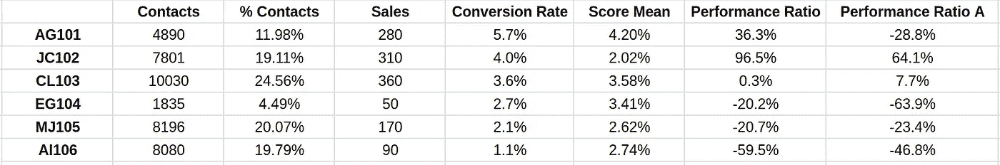

# 解锁销售表现指标

> 原文：[`towardsdatascience.com/unlocking-sales-performance-metrics-59e808ff47e5?source=collection_archive---------12-----------------------#2024-06-25`](https://towardsdatascience.com/unlocking-sales-performance-metrics-59e808ff47e5?source=collection_archive---------12-----------------------#2024-06-25)

## 如何正确衡量销售表现，并找出提升销售策略的机会

 [Gonzalo Espinosa Duelo](https://medium.com/@gonzaloespinosaduelo?source=post_page---byline--59e808ff47e5--------------------------------)

·发布于 [Towards Data Science](https://towardsdatascience.com/?source=post_page---byline--59e808ff47e5--------------------------------) ·阅读时长：7 分钟·2024 年 6 月 25 日

--

图片由 DALL-E 生成

在我的职业生涯中，我曾与许多公司合作，这些公司认为他们清楚地知道**哪些销售代理是他们的顶尖表现者**，而哪些则表现不佳。

然而，我可以明确说**10 个公司中有 9 个是错的**。

他们多年来一直被误导，原因很简单：他们错误地衡量了销售表现。

我还可以保证，100%的公司在学会了正确的销售表现衡量方法之后，完全改变了他们的方式，并且**再也没有以相同的方式衡量过销售表现**。

此外，一些人**甚至根据这种新的销售表现计算方法修改了他们的奖金补偿**。

但是，他们到底错在哪里？

让我们通过一个清晰的例子来看看：

表格展示了一家 B2C 公司每个销售代理人每年的潜在客户处理情况、销售情况和转化率，该公司销售单一产品。

面对这些结果，我通常遇到两种解读方式：

1.  **那些认为最佳销售代理是“CL103”的人**。这种解读基于销售或收入的绝对数字（360 笔总销售）。尽管通过收入估算销售表现是直觉告诉我们的方式，但这种衡量方式是有偏见的。问题在于，这个代理处理了更多的潜在客户。因此，由于接触了更多的潜在客户并且工作时间更长，他显然比其他人有更多的机会，因此他转化的数量更多是正常的。

1.  **那些认为最优秀的销售员是“AG101”的人**，这种解读是基于转化率（5.7%）。在这种情况下，之前的偏差被标准化。转化率比较的是销售员产生销售的能力，而不考虑每个销售员接收到的潜在客户数量。换句话说，它评估的是潜在客户转化为销售的能力，而不关心最初潜在客户的绝对数量，从而提供了一个更公平的销售员表现视角。然而，如我们所见，销售员“AG101”提供的绝对销售额较少。有时，接收较少潜在客户的销售员可以集中精力转化它们，提供更好的服务，但在这种情况下，AG101 的销售量大约和 MJ105 或 IG105 相同，且表现远超它们。

如果我告诉你，**这两个标准都不是最优的**，你会怎么想？是不是可能忽略了某些东西？

答案是肯定的。它们忽略了一个非常重要的因素：**接收到的潜在客户质量**。

# 💎 潜在客户质量

是否公平将一个接收到**高兴趣**产品的销售人员，与一个接收到**低兴趣**产品的销售人员放在一起评估？

显然，不会。

潜在客户质量指的就是这种精确的**兴趣水平**。

处理高度合格的、愿意购买的潜在客户的销售员，自然会在销售和转化方面取得更好的成绩，而那些接收到需要更多努力和时间才能转化的潜在客户的销售员，结果则相对较差。

如果我们在分析中不考虑潜在客户的质量，那我们就是用一种有限的方式在评估销售员。

## 潜在客户质量 = 转化为客户的可能性

兴趣水平听起来可能有些抽象，但它实际上是可以衡量的。

从定量分析的角度来看，兴趣度高的潜在客户是那些转化为实际销售或承诺的可能性较大的客户。

考虑到转化的高概率相较于低概率的任务更容易，因此在分析中必须考虑潜在客户的质量，以便对销售员的表现进行更公平、更准确的评估。这种方法**对工作的难度进行评分**。

因此，**绩效指标应该根据每个销售员所需的** **努力水平**进行调整。

## 平均概率 = 预期转化率

对于上述案例，我实现了一个由**byRatings**提供支持的**潜在客户评分系统**，该系统通过机器学习模型衡量潜在客户生成时的质量。

潜在客户评分模型提供了每个潜在客户转化为销售的可能性。因此，**销售员的平均潜在客户评分代表了该销售员的预期转化率**。

让我们通过添加“平均评分”或每个销售员接收到的潜在客户的平均转化概率来看看结果。

正如我们所见，线索的质量是决定转化率的一个关键因素。像**“AG101”这样的代理，我们看到它的转化率最高，也收到了质量最高的线索**。

然后，平均分数证明了它是一个相关因素，必须考虑它才能公平地比较线索分配。

那么，我们该如何衡量销售效率呢？

# 📈 性能比率——终极销售业绩指标

如上所述，为了公平且准确地评估销售代理的表现，**必须考虑代理的转化率和线索的质量**。

计算的一个好方法是使用以下公式：

这个公式计算性能比率，衡量转化率与平均分数之间的差异，相对于平均分数，以百分比形式表示。

> **正比率表示代理的表现好于预期转化率，而负比率表示表现不佳。**

让我们再次查看包括性能比率在内的结果：

**销售负责人“JC102”** **拥有最高的性能比率（96.5%）**，这表明它显著超越了收到的平均线索质量。尽管平均分数为 2.02%，但它的转化率达到 4.00%，显示出在将低质量线索转化为销售方面的卓越效率。

另一方面，销售负责人“AI106”的比率为-59.5%，这表明即使收到预期转化率为 2.74%的线索，它的表现仍低于预期。

# 🥇 奖励环节

总之，**性能比率是衡量销售业绩最公平的方式**，它定义了销售代理在相对于线索平均质量的转化表现如何。

但是……让我们争取更高的荣誉。

> 拥有一个提供线索质量评分模型，**我们是否可以通过重新分配来提高整体转化率？**

几年来，我有以下假设：

> **通过** **将最好的线索提供给表现最好的代理，整体转化率将提高**。

这非常有道理，因为很可能由于将优质线索分配给不够合格或表现较差的代理，导致一些机会的流失。

我一直在重复自己认为这是最好的方法，但最近我意识到我也忽略了某些东西。

我的假设是基于**最优秀的代理能够转化最优质的线索**。但这是真的吗？

让我们来验证一下。

一种有效的方法是通过计算最佳线索的性能比率来实现。假设**最佳线索是前 30%评分最高的线索**，在这个用例中它们的**转化提升**为**3.5 倍于平均值**，让我们计算这个特定细分市场的性能比率。

公式如下：

将此计算添加到表格中，结果如下：

再次强调，JC102 是转化所有潜在客户表现最好的代理（96.5%转化率），同时也证明是转化最佳潜在客户的最佳代理（64.1%的最佳潜在客户转化率），这正如我们在假设中所假定的。

这确认了，在这个特定的案例中，表现最好的代理是转化最佳潜在客户的最佳代理。

然而，请注意，这一假设**并非所有代理之间都有线性相关性**。

尽管“AG101”表现出强劲的整体表现比率（36.3%），但其在最佳潜在客户上的负表现比率（-28.8%）表明，AG101 可能没有像预期的那样有效地利用最佳潜在客户。这可能表明，AG101 可能专注于某些类型的潜在客户，而不一定是最佳潜在客户。

事实上，CL103 的最佳潜在客户表现比 AG101（-28.8%）还要好，尽管其整体表现（0.3%）低于 AG101（36.3%）。

> 不是每个优秀的代理都能与最佳潜在客户表现良好。

对于销售策略的专家们，我希望你们考虑一种更好的分配优化方法，即对每个潜在客户进行单独评估，并将其分配给转化可能性最大的代理。

然而，正如上表所示，通常情况下，表现最好的代理能比表现最差的代理更好地处理最佳潜在客户，因此这是一个良好的起点。

## 还有更多帖子吗？

总结来说，**将最佳潜在客户分配给表现最好的代理可以作为优化潜在客户分配的良好基准**。

此外，采用特定的代理分配算法将是最大化转化率的最有效策略。

这可以作为另一个重要话题的引入：**“如何为潜在客户分配开发终极优化算法”**。

在这种算法下，每个潜在客户都会分配给能够从中获得最大绩效的代理，即能够实现相对于潜在客户预期转化率（概率）的最高转化边际的代理。

在未来的帖子中，我将详细讨论如何优化潜在客户分配以最大化转化率。

如果你觉得这篇文章很有启发性，请继续关注更多相关内容。
