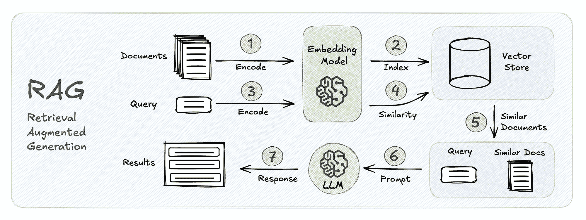

# 解锁检索增强生成（RAG）流程的未开发潜力

> 原文：[`towardsdatascience.com/unlocking-the-untapped-potential-of-retrieval-augmented-generation-rag-pipelines-d73b3505f0c5?source=collection_archive---------1-----------------------#2024-12-27`](https://towardsdatascience.com/unlocking-the-untapped-potential-of-retrieval-augmented-generation-rag-pipelines-d73b3505f0c5?source=collection_archive---------1-----------------------#2024-12-27)

## 提升检索、生成以及端到端流程性能的关键指标和方法

 [Saleh Alkhalifa](https://alkhalifas.medium.com/?source=post_page---byline--d73b3505f0c5--------------------------------)

·发表于[Towards Data Science](https://towardsdatascience.com/?source=post_page---byline--d73b3505f0c5--------------------------------) ·6 分钟阅读·2024 年 12 月 27 日

--

## 引言

当我们想到生成式人工智能的一些常见应用时，检索增强生成（RAG）无疑已经成为这个领域中最常讨论的话题之一。与传统搜索引擎依靠优化检索机制，通过关键词搜索来查找与特定查询相关的信息不同，RAG 进一步发展，使用检索到的内容为给定问题生成一个全面的回答。

下图展示了 RAG 的图示，其中感兴趣的文档通过嵌入模型进行编码，然后在向量存储中索引和存储。当提交查询时，通常会以类似的方式进行嵌入，接着有两个步骤：（1）检索步骤，搜索相似的文档，然后（2）生成步骤，使用检索到的内容来合成回应。

图片由作者提供。

虽然 RAG 已被证明是一种快速回答问题的有前景的方法，但其过程确实存在一些局限性。首先，生成的回答常常…
