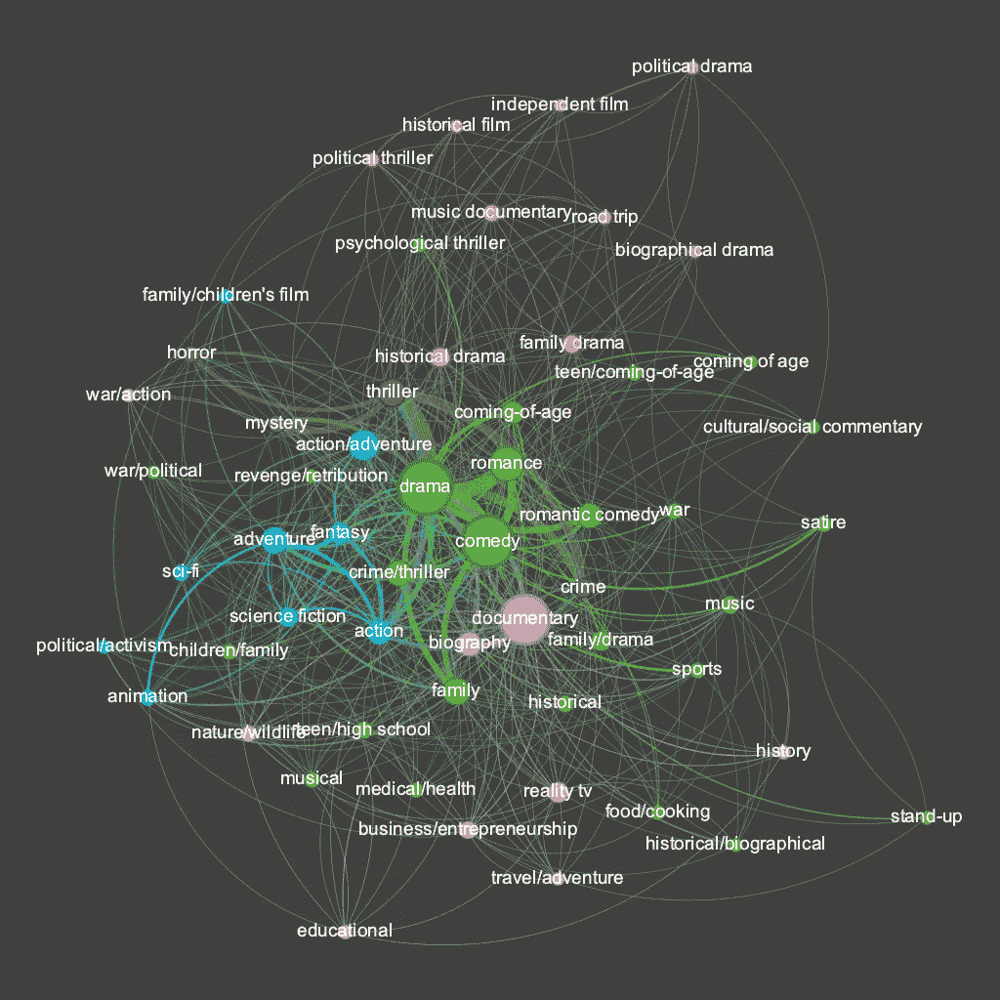
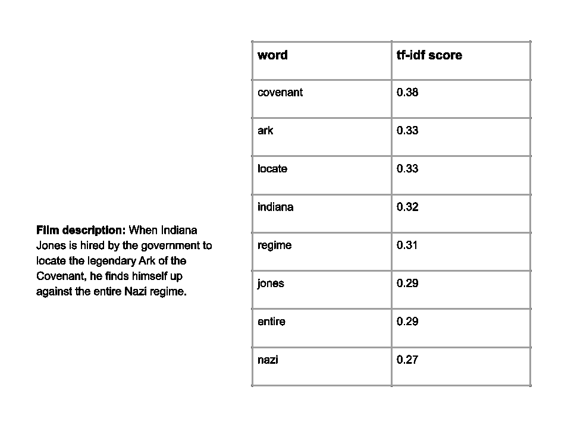
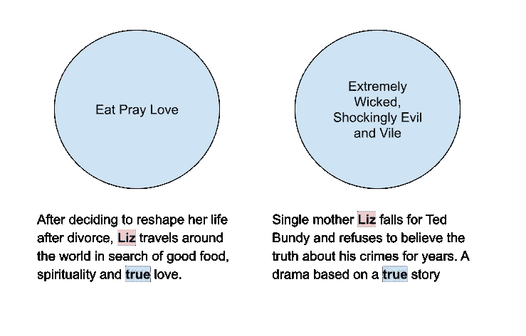
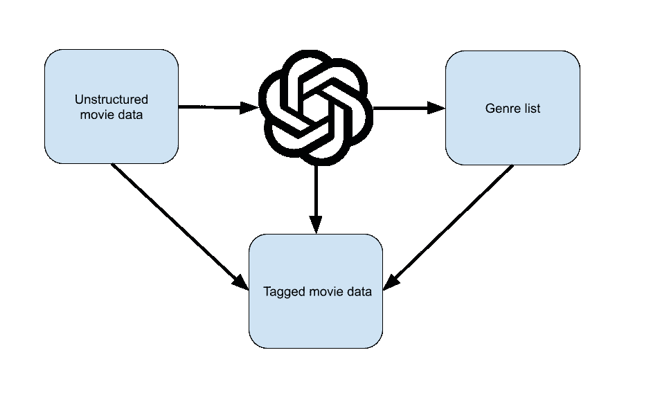
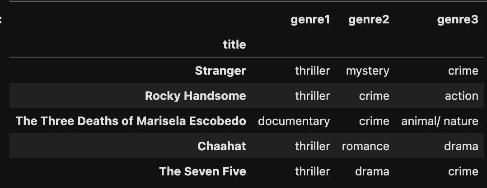
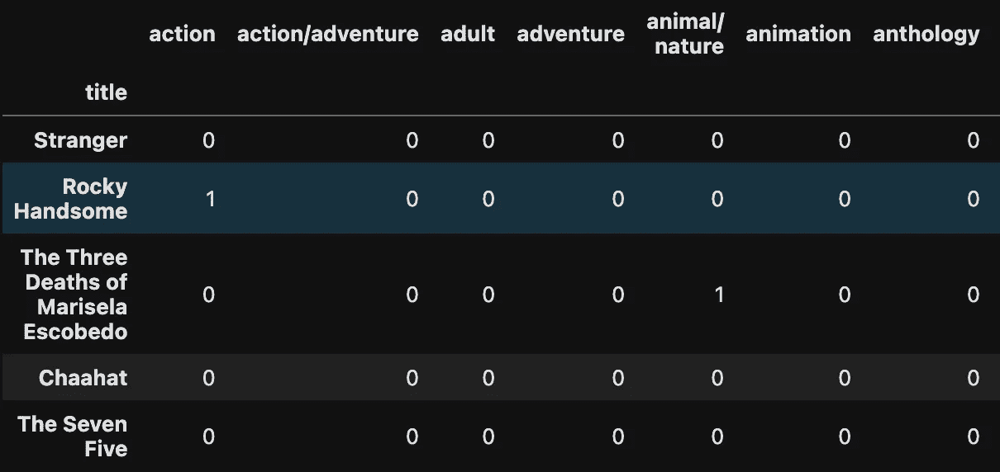
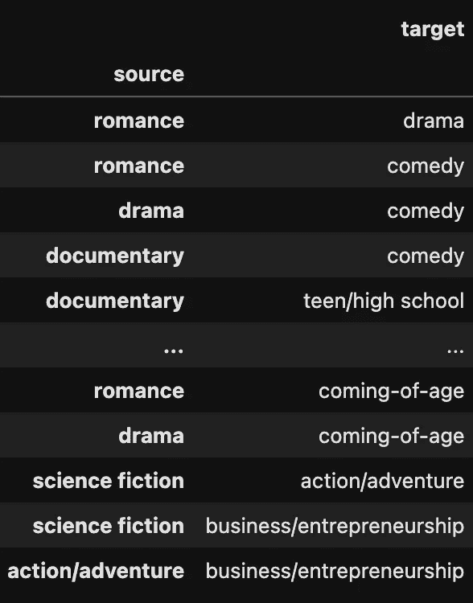

# 解开无结构的电影数据

> 原文：[`towardsdatascience.com/unraveling-unstructured-movie-data-04d5ff787600?source=collection_archive---------8-----------------------#2024-02-09`](https://towardsdatascience.com/unraveling-unstructured-movie-data-04d5ff787600?source=collection_archive---------8-----------------------#2024-02-09)



## 如何使用 LLMs 和受控词汇来增强相似度模型

[](https://stevehedden.medium.com/?source=post_page---byline--04d5ff787600--------------------------------)[](https://towardsdatascience.com/?source=post_page---byline--04d5ff787600--------------------------------) [Steve Hedden](https://stevehedden.medium.com/?source=post_page---byline--04d5ff787600--------------------------------)

·发表于 [Towards Data Science](https://towardsdatascience.com/?source=post_page---byline--04d5ff787600--------------------------------) ·阅读时长 16 分钟·2024 年 2 月 9 日

--

*本教程的配套代码* [*在这里。*](https://github.com/SteveHedden/kg_llm)

[推荐系统](https://en.wikipedia.org/wiki/Recommender_system)是我们找到大部分内容和产品的方式，可能也包括这篇文章。推荐系统是：

> “一种信息过滤系统的子类，为特定用户提供最相关的项目建议。”——维基百科

我们日常互动的推荐系统的一些例子包括 Netflix、Spotify、Amazon 和社交媒体。所有这些推荐系统都在尝试回答同一个问题：根据用户的历史行为，哪些其他产品或内容最有可能受到他们的喜爱？这些系统为公司带来了大量的收入 —— [麦肯锡 2013 年的一项研究](https://www.mckinsey.com/industries/retail/our-insights/how-retailers-can-keep-up-with-consumers)发现，“35% 的亚马逊购物和 75% 的 Netflix 观看内容来自于产品推荐。”Netflix 在 2006 年著名地启动了一个公开竞赛，向任何能够显著改善其推荐系统的人提供 [100 万美元奖金](https://en.wikipedia.org/wiki/Netflix_Prize)。有关推荐系统的更多信息，请参阅[这篇](https://towardsdatascience.com/unraveling-unstructured-movie-data-04d5ff787600?source=collection_archive---------8-----------------------#2024-02-09)文章。

通常，有三种类型的推荐系统：基于内容的推荐、协同过滤推荐和基于内容与协同过滤的混合推荐。协同过滤推荐系统侧重于用户的行为和偏好，依据其他相似用户的喜好来预测用户可能喜欢什么。基于内容的过滤系统则侧重于产品本身的相似性，而不是用户之间的相似性。有关这些系统的更多信息，请参见[这篇 Nvidia 文章](https://www.nvidia.com/en-us/glossary/recommendation-system/#:~:text=A%20recommendation%20system%20is%20an,demographic%20information%2C%20and%20other%20factors)

在结构化数据集中，计算产品之间的相似性相对简单。我们可以确定我们认为最重要的产品属性，并根据这些属性的差异来衡量任意两个产品之间的“距离”。但是，如果我们想在唯一的数据是非结构化文本的情况下比较项目怎么办？例如，给定一个电影和电视节目描述的数据集，我们该如何计算哪些描述最相似？

在本教程中，我将：

1.  展示一个基本的相似性模型（没有受控词汇表），使用自然语言处理（NLP）技术对非结构化文本进行处理

1.  使用 LLM 创建一个类型列表

1.  使用类型列表为电影打上类型标签

1.  使用类型标签构建相似性模型

1.  使用类型标签创建网络可视化

对我来说，写这篇文章的目标是学习两件事：一是受控词汇表（taxonomy）是否显著改善了非结构化数据相似性模型的效果，二是 LLM 是否能显著改善构建受控词汇表所需的质量和/或时间。

如果你不想阅读全部内容，这里是我主要的发现：

+   基本的 NLP 模型（没有受控词汇表）确实存在一些问题——它有时会使用与识别相似电影无关的词汇（例如，主角的名字或地点）。

+   使用受控词汇表确实显著改善了相似性模型的效果，至少基于我用来测试模型的一些示例来看是这样的。

+   使用 LLM 构建一个简单、基本的类型列表很容易——但构建一个有用和/或详细的类型词汇表很困难，也就是说，这需要更多的迭代或更具描述性的提示。我最终构建了一个大约 200 个类型的快速粗略列表，没有定义，足够用于做简单的相似性计算。

+   然而，即使是这个非常基本的使用 LLM 构建的类型列表，也存在一些问题。例如，有些类型有轻微的拼写差异，导致重复。

+   使用 LLM 为电影和电视节目打标签花费了很长时间。这个问题可能只是我在构建代码时的方式导致的。

+   可能并不令人惊讶的是，分类的深度和广度很重要。就像我上面说的，构建一个详细的电影类型分类是困难的，而且需要比我愿意为这个教程所做的更多的工作。但根据使用场景，可能不需要那么详细。我最初构建了一个包含成千上万种类型、同义词和定义的分类体系，但这也有缺点——标注变得更加困难，相似度计算也常常不如预期。因为我只看了几千部电影，所以有成千上万种类型的列表使得每部电影都变得独特，几乎没有什么相似之处。

+   将电影和类型可视化为图形总是非常棒。

# 使用 NLP 技术的非结构化文本基本相似度模型

我们可以使用自然语言处理（NLP）来提取文本中的关键词，识别这些词的重要性，然后在其他描述中找到匹配的词。[这里](https://medium.com/mlearning-ai/basic-content-based-recommendation-system-with-python-code-be920b412067)有一个关于如何在 Python 中实现的教程。我不会在这里重新创建整个教程，但这里有一个简要的概述：

首先，我们从电影情节描述中提取关键词。例如，下面是电影《印第安纳·琼斯与失落的方舟》的描述。

> “当印第安纳·琼斯被政府雇佣去寻找传说中的‘约柜’时，他发现自己正面对整个纳粹政权。”

然后我们使用 sklearn 的现成库来提取关键词并对其‘重要性’进行排名。为了计算重要性，我们使用了词频-逆文档频率（tf-idf）。其思想是平衡单个电影描述中词语的频率与在我们数据集中所有电影描述中该词的普遍性。例如，‘finds’这个词在这个描述中出现，但它是一个常见词，出现在许多其他电影描述中，因此它的权重比‘covenant’低。



作者提供的图片

这个模型实际上对于那些有着独特可识别主角的电影效果非常好。如果我们对这部电影运行相似度模型，最相似的电影是：《印第安纳·琼斯与夺宝圣地》、《印第安纳·琼斯与最后的十字军》以及《印第安纳·琼斯与水晶骷髅王国》。这是因为这些电影的描述中都包含了“Indiana”和“Jones”这两个词。

但这里也有问题。我们如何知道提取的词汇在相似度模型中是否相关呢？例如，如果我使用这个模型来查找与《比维斯与巴特海德：美国行》相似的电影或电视节目，排名第一的结果是《僵尸军团》。如果你不是像我一样的电影和电视迷，你可能不太熟悉动画剧集《[比维斯与巴特海德](https://en.wikipedia.org/wiki/Beavis_and_Butt-Head)》，该剧讲述的是“两个愚笨的少年[他们]花时间看电视，喝不健康的饮料，吃东西，进行一些平凡的、肮脏的冒险，通常包括破坏行为、虐待、暴力或虐待动物。”他们的电影《比维斯与巴特海德：美国行》的描述是：“在发现他们的电视丢失后，比维斯和巴特海德踏上了一场从拉斯维加斯到美国首都的探险。”而《僵尸军团》则是扎克·斯奈德导演的[末日后僵尸劫匪片](https://en.wikipedia.org/wiki/Army_of_the_Dead)。那么，为什么《僵尸军团》被认为是相似的呢？因为它的故事发生在拉斯维加斯——两部电影的描述中都包含了“拉斯维加斯”这个词。

另一个此模型失败的例子是，如果我想找到与《吃、祷、爱》相似的电影或电视节目，排名第一的结果是《极端邪恶、震惊恶心》。《吃、祷、爱》是一部浪漫喜剧，朱莉娅·罗伯茨饰演莉兹·吉尔伯特，一个刚离婚的女人，正在世界各地旅行，进行自我发现的旅程。而《极端邪恶、震惊恶心》是一部讲述连环杀手特德·邦迪的真实犯罪剧情片。这两部电影有什么共同之处呢？特德·邦迪的恋人也叫莉兹。



图片由作者提供

这些当然是精心挑选的示例，展示了该模型不起作用的情况。事实上，也有很多例子表明，从文本中提取关键字可以是找到相似产品的有效方式。如上所示，包含唯一可识别名称的文本，如《特摄队员》、《印第安纳·琼斯》或《詹姆斯·邦德》，可以用来找到在描述中包含相同名称的其他标题。同样，如果描述中包含标题的类型信息，如“惊悚片”或“悬疑片”，那么这些词可以将电影与同类型的其他电影关联起来。然而，这种方法也有局限性。有些电影可能在描述中使用了“戏剧性”一词，但根据这种方法，我们无法将这些电影与包含“剧情”一词的电影描述匹配，因为我们没有考虑同义词。我们真正需要做的是仅使用相关的词汇及其同义词。

我们如何确保提取的词汇是相关的呢？这就是分类法可以提供帮助的地方。什么是分类法？

# 使用大语言模型创建一个类型分类

> “分类法（或分类学分类）是一种分类方案，尤其是层级分类方案，其中事物被组织成不同的组或类型。” — [维基百科](https://en.wikipedia.org/wiki/Taxonomy)

也许最著名的分类法例子是用于生物学中对所有生物体进行分类的分类法——还记得领域、界、门、纲、目、科、属和种吗？所有生物都可以按照这一层级分类法进行归类。

***术语说明：*** *本体论与分类法相似，但有所不同。正如* [*这篇*](https://www.forbes.com/sites/cognitiveworld/2019/03/24/taxonomies-vs-ontologies/?sh=35eb9c327d53) *文章所解释的，分类法用于分类，而本体论则用于指定。“本体论是描述数据结构的类和关系的系统，是制定新类别或实体创建规则、定义属性的规则，以及建立约束的规则。”因为我们专注于对电影进行分类，所以我们将构建一个分类法。然而，出于本教程的目的，我只需要一个非常基础的类型列表，这甚至不能算是一个分类法。一个类型列表仅仅是一个标签集，或者说是一个受控词汇表。*

本教程中，我们将只关注电影类型。我们需要的是一个可以用来“标记”每部电影的类型列表。试想，如果不是把电影《吃，祷，爱》标记为‘Liz’和‘true’，而是标记为‘浪漫喜剧’，‘剧情’和‘旅行/冒险’，那么我们就可以使用这些类型来找到其他与《吃，祷，爱》相似的电影，即使主角不叫 Liz。下面是我们所做工作的图示。我们使用一部分非结构化的电影数据，并结合 GPT 3.5，创建类型列表。然后我们使用类型列表和 GPT 3.5 对非结构化的电影数据进行标记。一旦我们的数据被标记，我们就可以使用这些标签作为输入，运行相似度模型。



作者提供的图片

我在线上没有找到任何免费的电影类型分类法，所以我使用一个大型语言模型（LLM）构建了自己的分类法。我从[这个](https://medium.com/@elias_69893/an-llm-agent-that-builds-and-maintains-a-job-title-taxonomy-77d02c4c6100)教程开始，教程中使用了一个 LLM 代理来构建工作职称分类法。这个 LLM 代理从职位描述中提取职位名称，为每个职位名称创建定义和职责，并列出同义词。我使用这个教程创建了一个电影类型分类法，但这有些过度——我们并不需要为本教程做这么复杂的工作。我们只需要一个非常基础的类型列表，用于标记电影。以下是我用来创建该类型列表的代码。

我使用了 Netflix 的电影和电视节目描述数据，这些数据可以在[此处](https://www.kaggle.com/datasets/shivamb/netflix-shows?resource=download)获得（许可证 [CC0: 公共领域](https://creativecommons.org/publicdomain/zero/1.0/)）。

导入所需的包并加载英语语言的 NLP 模型。

```py
import openai
import os
import re
import pandas as pd
import spacy
from ipywidgets import FloatProgress
from tqdm import tqdm

# Load English tokenizer, tagger, parser and NER
nlp = spacy.load("en_core_web_sm")
```

然后，我们需要设置与 OpenAI（或你想使用的任何 LLM）的连接。

```py
os.environ["OPENAI_API_KEY"] = "XXXXXX"  # replace with yours
```

读取 Netflix 电影数据：

```py
movies = pd.read_csv("netflix_titles.csv")
movies = movies.sample(n=1000) #I just used 1000 rows of data to reduce the runtime
```

创建一个函数，根据电影简介预测类型：

```py
def predict_genres(movie_description):
    prompt = f"Predict the top three genres (only genres, not descriptions) for a movie with the following description: {movie_description}"
    response = openai.completions.create(
      model="gpt-3.5-turbo-instruct",  # You can use the GPT-3 model for this task
      prompt=prompt,
      max_tokens=50,
      n=1,
      stop=None,
      temperature=0.2
    )
    predicted_genres = response.choices[0].text.strip()
    return predicted_genres
```

现在，我们遍历电影描述的 DataFrame，使用上述函数预测与电影相关的类型，然后将它们添加到我们已建立的唯一类型列表中。

```py
# Create an empty list to store the predicted genres
all_predicted_genres = []

# Create an empty set to store unique genres
unique_genres_set = set()

# Iterate through the movie descriptions
for index, row in tqdm(movies.iterrows(), total=movies.shape[0]):

        # Get the movie description
        movie_description = row['description']

        # Predict the genres for the movie description
        predicted_genres = predict_genres(movie_description)

        # Extract genres from the text
        predicted_genres_tokens = nlp(predicted_genres)
        predicted_genres_tokens = predicted_genres_tokens.text

        # Use regular expression to extract genres
        genres_with_numbers = re.findall(r'\d+\.\s*([^\n]+)', predicted_genres_tokens)

        # Remove leading/trailing whitespaces from each genre
        predicted_genres = [genre.strip().lower() for genre in genres_with_numbers]

        # Update the set of unique genres
        unique_genres_set.update(predicted_genres)

# Convert the set of unique genres back to a list
all_unique_genres = list(unique_genres_set)
```

现在将这个列表转换为 DataFrame 并保存为 CSV 文件：

```py
all_unique_genres = pd.DataFrame(all_unique_genres,columns=['genre'])
all_unique_genres.to_csv("genres_taxonomy_quick.csv")
```

就像我说的，这是生成类型列表的一种快速简便的方法。

# 使用类型列表给电影打上类型标签

既然我们已经有了类型列表，我们需要给数据集中的每部电影和电视节目（超过 8,000 部）打上标签。为了能够使用这些标签计算两个实体之间的相似度，我们需要给每部电影和电视节目打上多个类型标签。如果我们只使用一个类型标签，那么所有动作片将被认为是完全相似的，尽管有些可能更侧重于体育，另一些则可能更偏向恐怖片。

首先，我们读取我们的类型列表和电影数据集：

```py
#Read in our genre list
genres = pd.read_csv('genres_taxonomy_quick.csv')  # Replace 'genres_taxonomy_quick.csv' with the actual file name
genres = genres['genre']

#Read in our movie data
movies = pd.read_csv("netflix_titles.csv")
movies = movies.sample(n=1000) #This takes a while to run so I didn't do it for the entire dataset at once
```

我们已经有了一个预测类型的函数。现在我们需要再定义两个函数：一个用于过滤预测结果，确保预测的类型在我们已建立的类型列表中，另一个用于将这些过滤后的预测添加到电影 DataFrame 中。

```py
#Function to filter predicted genres
def filter_predicted_genres(predicted_genres, predefined_genres):
    # Use word embeddings to calculate semantic similarity between predicted and predefined genres
    predicted_genres_tokens = nlp(predicted_genres)
    predicted_genres_tokens = predicted_genres_tokens.text
    # Use regular expression to extract genres
    genres_with_numbers = re.findall(r'\d+\.\s*([^\n]+)', predicted_genres_tokens)
    # Remove leading/trailing whitespaces from each genre
    predicted_genres = [genre.strip().lower() for genre in genres_with_numbers]

    filtered_genres = []
    similarity_scores = []

    for predicted_genre in predicted_genres:
        max_similarity = 0
        best_match = None
        for predefined_genre in predefined_genres:
            similarity_score = nlp(predicted_genre).similarity(nlp(predefined_genre))
            if similarity_score > max_similarity:  # Adjust the threshold as needed
                max_similarity = similarity_score
                best_match = predefined_genre
        filtered_genres.append(best_match)
        similarity_scores.append(max_similarity)

    # Sort the filtered genres based on the similarity scores
    filtered_genres = [x for _, x in sorted(zip(similarity_scores, filtered_genres), reverse=True)]

    return filtered_genres

#Function to add filtered predictions to DataFrame
def add_predicted_genres_to_df(df, predefined_genres):   
    # Iterate through the dataframe
    for index, row in tqdm(df.iterrows(), total=df.shape[0]):
        # Apply the predict_genres function to the movie description
        predicted_genres = predict_genres(row['description'])
        # Prioritize the predicted genres
        filtered_genres = filter_predicted_genres(predicted_genres, predefined_genres)
        # Add the prioritized genres to the dataframe
        df.at[index, 'predicted_genres'] = filtered_genres
```

一旦我们定义了这些函数，就可以在我们的电影数据集上运行它们：

```py
add_predicted_genres_to_df(movies, genres)
```

现在我们进行一些数据清理：

```py
# Split the lists into separate columns with specific names
movies[['genre1', 'genre2', 'genre3']] = movies['predicted_genres'].apply(lambda x: pd.Series((x + [None, None, None])[:3]))

#Keep only the columns we need for similarity
movies = movies[['title','genre1','genre2','genre3']]

#Drop duplicates
movies = movies.drop_duplicates()

#Set the 'title' column as our index
movies = movies.set_index('title')
```

如果我们打印 DataFrame 的头部，它应该是这样：



图片由作者提供

# 使用类型标签构建相似度模型

现在，我们将类型列转换为虚拟变量——每个类型变成一列，如果电影或电视节目被标记为该类型，那么该列的值为 1，否则为 0。

```py
# Combine genre columns into a single column
movies['all_genres'] = movies[['genre1', 'genre2', 'genre3']].astype(str).agg(','.join, axis=1)

# Split the genres and create dummy variables for each genre
genres = movies['all_genres'].str.get_dummies(sep=',')

# Concatenate the dummy variables with the original DataFrame
movies = pd.concat([movies, genres], axis=1)

# Drop unnecessary columns
movies.drop(['all_genres', 'genre1', 'genre2', 'genre3'], axis=1, inplace=True)
```

如果我们打印这个 DataFrame 的头部，它看起来像这样：



图片由作者提供

我们需要使用这些虚拟变量来构建矩阵，并在所有电影对之间运行相似度模型：

```py
# If there are duplicate columns due to the one-hot encoding, you can sum them up
movie_genre_matrix = movies.groupby(level=0, axis=1).sum()

# Calculate cosine similarity 
similarity_matrix = cosine_similarity(movie_genre_matrix, movie_genre_matrix)
```

现在我们可以定义一个计算与给定标题最相似的电影的函数：

```py
def find_similar_movies(movie_name, movie_genre_matrix, num_similar_movies=3):
    # Calculate cosine similarity
    similarity_matrix = cosine_similarity(movie_genre_matrix, movie_genre_matrix)

    # Find the index of the given movie
    movie_index = movie_genre_matrix.index.get_loc(movie_name)

    # Sort and get indices of most similar movies (excluding the movie itself)
    most_similar_indices = np.argsort(similarity_matrix[movie_index])[:-num_similar_movies-1:-1]

    # Return the most similar movies
    return movie_genre_matrix.index[most_similar_indices].tolist()
```

让我们看看这个模型是否比之前的模型找到更多类似《美味祈祷爱》的电影：

```py
# Example usage
similar_movies = find_similar_movies("Eat Pray Love", movie_genre_matrix, num_similar_movies=4)
print(similar_movies)
```

这次查询的输出对我来说是“完美的一天”、“Love Dot Com: 社会实验”和“50 次初恋”。所有这些电影都被标记为浪漫喜剧和剧情片，就像《美味祈祷爱》一样。


图片由作者提供

《极度邪恶、震惊邪恶且肮脏》的电影讲述了一位爱上泰德·邦迪的女人，标签为浪漫、剧情和犯罪。最相似的电影有《耐心男人的愤怒》、《深爱》和《爱你》，它们也都标注了浪漫、剧情和犯罪。电影《比佛斯与巴特赫德：去美国》标注了喜剧、冒险和公路旅行这几个类型。最相似的电影有《比维的伟大假期》、《羊羊大电影：农场末日》和《宠物的秘密生活 2》。这些电影也都标注了冒险和喜剧类型——在这个数据集中（至少是我标注的部分），没有其他电影符合比佛斯与巴特赫德的三个标签类型。

# 使用类型标签创建网络可视化

你不能在不构建酷炫网络可视化的情况下将数据连接起来。有几种方法可以将这些数据转化为图形——我们可以看看电影是如何通过类型连接的，类型又是如何通过电影连接的，或者两者的结合。因为这个数据集中的电影非常多，所以我只用了类型作为节点，电影作为边，制作了一个图形。

这是我将数据转换为节点和边的代码：

```py
# Melt the dataframe to unpivot genre columns
melted_df = pd.melt(movies, id_vars=['title'], value_vars=['genre1', 'genre2', 'genre3'], var_name='Genre', value_name='GenreValue')

genre_links = pd.crosstab(index=melted_df['title'], columns=melted_df['GenreValue'])

# Create combinations of genres for each title
combinations_list = []

for title, group in melted_df.groupby('title')['GenreValue']:
    genre_combinations = list(combinations(group, 2))
    combinations_list.extend([(title, combo[0], combo[1]) for combo in genre_combinations])

# Create a new dataframe from the combinations list
combinations_df = pd.DataFrame(combinations_list, columns=['title', 'Genre1', 'Genre2'])

combinations_df = combinations_df[['Genre1','Genre2']]

combinations_df = combinations_df.rename(columns={"Genre1": "source", "Genre2": "target"}, errors="raise")

combinations_df = combinations_df.set_index('source')

combinations_df.to_csv("genreCombos.csv")
```

这将生成一个如下所示的 DataFrame：



图片来源：作者

这个 DataFrame 中的每一行代表一部被标注为这两种类型的电影。我们没有去除重复项，所以应该会有很多行像上面第 1 行一样——有很多电影同时被标注为浪漫和剧情。

我使用了[Gephi](https://gephi.org/)来构建了如下所示的可视化：


图片来源：作者

这里节点的大小表示被标注为该类型的电影数量。节点的颜色是基于社区检测算法的结果——在同一群体内比与外部节点的连接更紧密的群体会使用相同的颜色。

这对我来说非常吸引人。戏剧、喜剧和纪录片是三个最大的类别节点，意味着更多的电影被标记为这些类型，而不是其他类型。这些类型自然形成了直观的集群。与“纪录片”最相关的类型被标记为粉红色，主要是某种纪录片子类型：自然/野生动物、真人秀、旅行/冒险、历史、教育、传记等。有一个核心集群是绿色的：戏剧、喜剧、浪漫、成长故事、家庭等。这里有一个问题是，“成长故事”类型的拼写有多种版本——这是我在未来版本中会解决的问题。还有一个蓝色的集群，包括动作/冒险、幻想、科幻和动画。再次强调，这里有重复和重叠的类型，这是一个问题。还有一个小的棕色类型，包括惊悚片、悬疑片和恐怖片——这些通常出现在同一部电影中。某些类型之间缺乏连接也是很有趣的——例如，没有电影同时标记为“单口喜剧”和“恐怖片”。

# 结论

这个项目让我意识到，即使是最基本的受控词汇在构建基于内容的推荐系统时也非常有用，甚至可能是必需的。仅凭一份类型列表，我们就能够标记电影，并以比仅使用自然语言处理更具可解释性的方法找到其他相似的电影。显然，通过更详细的描述性类型分类法，这一过程可以得到极大的改进，同时也可以通过包括演员和工作人员、拍摄地点等其他分类法来增强。

正如使用大型语言模型（LLM）时常见的情况一样，刚开始我对它在完成这一任务时的表现印象深刻，但在查看并尝试改进结果时，我感到失望。构建分类法、本体论或任何受控词汇都需要人工参与——必须有人工介入，以确保词汇合理且能满足特定的使用需求。

LLM 和知识图谱（KGs）自然是相辅相成的。它们可以一起使用的一种方式是，LLM 可以帮助促进知识图谱的创建。LLM 本身无法构建知识图谱，但它们肯定能帮助你创建一个。
