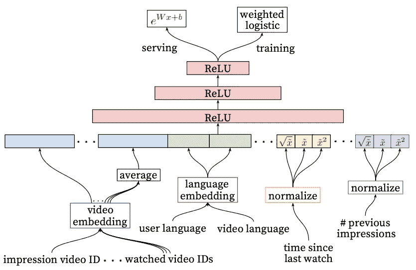

# 用户行为序列建模：从注意力机制到变换器及其发展

> 原文：[`towardsdatascience.com/user-action-sequence-modeling-from-attention-to-transformers-and-beyond-5f280268b399?source=collection_archive---------5-----------------------#2024-07-15`](https://towardsdatascience.com/user-action-sequence-modeling-from-attention-to-transformers-and-beyond-5f280268b399?source=collection_archive---------5-----------------------#2024-07-15)

## 将推荐系统转变为类似 LLM 的系统的探索

 [Samuel Flender](https://medium.com/@samuel.flender?source=post_page---byline--5f280268b399--------------------------------)

·发表于 [Towards Data Science](https://towardsdatascience.com/?source=post_page---byline--5f280268b399--------------------------------) ·11 分钟阅读·2024 年 7 月 15 日

--

使用 ChatGPT 生成的图片

用户行为序列是推荐系统中最强大的输入之一：你下一次点击、阅读、观看、播放或购买，很可能与几分钟前、几小时、几天、几个月甚至几年前你所点击、阅读、观看、播放或购买的内容至少有某种程度的关联。

历史上，用于建模这类用户互动序列的传统方法是池化：例如，2016 年一篇经典的 YouTube [论文](https://storage.googleapis.com/gweb-research2023-media/pubtools/pdf/45530.pdf)描述了一个系统，该系统将最近观看的 50 个视频，收集它们在嵌入表中的表示，并通过求和池化将这些表示合并成一个单一的特征向量。为了节省内存，这些序列视频的嵌入表与候选视频的嵌入表共享。

YouTube 的推荐系统通过对用户观看的视频序列进行求和池化处理。[Covinton et al 2016](https://storage.googleapis.com/gweb-research2023-media/pubtools/pdf/45530.pdf)

这种简单的方法大致对应于自然语言处理领域的词袋模型：它能工作，但远非理想。池化方法没有考虑输入的顺序性，也没有考虑用户历史中项目与我们需要排序的候选项目的相关性，也没有考虑任何时间信息：一个……
