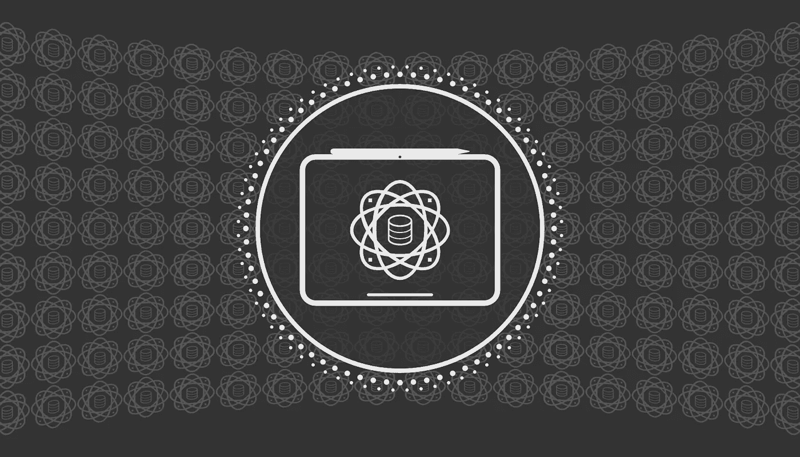

# 2024 年使用 iPad 进行数据科学工作

> 原文：[`towardsdatascience.com/using-an-ipad-for-data-science-in-2024-97bd9ef484b8?source=collection_archive---------2-----------------------#2024-09-01`](https://towardsdatascience.com/using-an-ipad-for-data-science-in-2024-97bd9ef484b8?source=collection_archive---------2-----------------------#2024-09-01)

## 探讨使用苹果流行平板进行数据科学工作的利与弊

 [David Hundley](https://dkhundley.medium.com/?source=post_page---byline--97bd9ef484b8--------------------------------)

·发表于[Towards Data Science](https://towardsdatascience.com/?source=post_page---byline--97bd9ef484b8--------------------------------) ·10 分钟阅读·2024 年 9 月 1 日

--

由作者制作的标题卡片

几年前（2021 年），我发布了一篇博客，介绍了我如何将 iPad 用于我的数据科学工作，所以我想分享一个后续更新，因为，是的，我至今仍然在使用 iPad 进行自己的工作，时间已经到了 2024 年 9 月。我在 2021 年的文章结尾写下了以下注解：

> 于是我们终于来到了大家一直在等待的问题，那就是，我们是否终于可以完全依赖 iPad 来进行数据科学工作了？不幸的答案最终是否定的。因为 iPadOS 并不是一个传统的操作系统，很多事情我无法做，特别是我依赖命令行工具、Docker 镜像等。我很想看看苹果是否能克服这些障碍，但不幸的是，2021 年 1 月时这些问题依然存在。

到最后，这仍然是不幸的事实。苹果的 iPadOS 操作系统仍然限制了 iPad 的多功能性，使其无法像使用其他操作系统（如 Windows、macOS 或 Linux）的电脑那样灵活。

尽管如此，自从我最初发布文章以来，iPad 经历了许多更新，包括 iPadOS 本身以及其他可以在 iPad 上支持的软件服务。有趣的是，很多内容与那时的…
