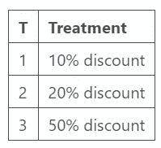

# 使用双重机器学习和线性规划优化治疗策略

> 原文：[`towardsdatascience.com/using-double-machine-learning-and-linear-programming-to-optimise-treatment-strategies-920c20a29553?source=collection_archive---------2-----------------------#2024-04-26`](https://towardsdatascience.com/using-double-machine-learning-and-linear-programming-to-optimise-treatment-strategies-920c20a29553?source=collection_archive---------2-----------------------#2024-04-26)

## 因果 AI，探讨将因果推理融入机器学习

[](https://medium.com/@raz1470?source=post_page---byline--920c20a29553--------------------------------)[](https://towardsdatascience.com/?source=post_page---byline--920c20a29553--------------------------------) [Ryan O'Sullivan](https://medium.com/@raz1470?source=post_page---byline--920c20a29553--------------------------------)

·发表于 [Towards Data Science](https://towardsdatascience.com/?source=post_page---byline--920c20a29553--------------------------------) ·阅读时间：11 分钟·2024 年 4 月 26 日

--


图片由 [Jordan McDonald](https://unsplash.com/@jordanmcdonald?utm_source=medium&utm_medium=referral) 提供，来源：[Unsplash](https://unsplash.com/?utm_source=medium&utm_medium=referral)

# 本系列文章的主题是什么？

欢迎来到我的因果 AI 系列文章，我们将探讨因果推理如何融入机器学习模型。预计我们将深入探索在不同商业场景中的多种实际应用。

在上一篇文章中，我们探讨了*使用双重机器学习消除治疗效应偏差*。这次，我们将进一步深入探讨双重机器学习的潜力，重点是*使用双重机器学习和线性规划优化治疗策略*。

如果你错过了上一篇关于双重机器学习的文章，可以在这里查看：

[](/de-biasing-treatment-effects-with-double-machine-learning-63b16fcb3e97?source=post_page-----920c20a29553--------------------------------) ## 使用双重机器学习消除治疗效应偏差

### 因果 AI，探讨将因果推理融入机器学习

towardsdatascience.com

# 介绍

本文将展示如何使用双重机器学习和线性规划来优化治疗策略：

**预计你将广泛了解以下内容：**

+   为什么企业需要优化治疗策略。

+   条件平均治疗效应（CATE）如何帮助个性化治疗策略（也叫做提升建模）。

+   线性规划如何在预算约束下优化治疗分配。

+   一个 Python 案例研究，演示了我们如何使用双重机器学习估计 CATE，以及如何使用线性规划优化治疗策略。

完整的笔记本可以在这里找到：

[](https://github.com/raz1470/causal_ai/blob/main/notebooks/estimating%20average%20treatment%20effects%20with%20double%20machine%20learning.ipynb?source=post_page-----920c20a29553--------------------------------) [## causal_ai/notebooks/estimating average treatment effects with double machine learning.ipynb at main…

### 这个项目介绍了因果 AI 及其如何推动商业价值。- causal_ai/notebooks/estimating average…

[github.com](https://github.com/raz1470/causal_ai/blob/main/notebooks/estimating%20average%20treatment%20effects%20with%20double%20machine%20learning.ipynb?source=post_page-----920c20a29553--------------------------------)

# 优化治疗策略

在大多数企业中，常常会有一个问题：“为了最大化未来销售并最小化成本，如何为客户提供最佳治疗？”。

让我们通过一个简单的例子来分解这个想法。

你的业务在线销售袜子。你销售的不是必需品，所以你需要鼓励现有客户重复购买。你用来实现这一目标的主要手段是发送折扣。因此，在这种情况下，治疗策略就是发送折扣：

+   10% 折扣

+   20% 折扣

+   50% 折扣

每个折扣的投资回报率不同。如果你回想一下上一篇关于平均治疗效应的文章，你可能会看到我们如何为每个折扣计算 ATE，然后选择回报率最高的一个。

然而，如果我们有异质性治疗效应怎么办——治疗效应在不同子群体之间有所不同。

这时我们需要开始考虑条件平均治疗效应（CATE）！

# 条件平均治疗效应（CATE）

## CATE

CATE 是治疗或干预对不同子群体的平均影响。ATE 主要关注“这种治疗有效吗？”，而 CATE 让我们能够将问题转变为“我们应该治疗谁？”。

我们“根据”控制特征来调整治疗效应，以便治疗效应根据客户特征变化。

回想一下我们发送折扣的例子。如果之前下单量较多的客户对折扣的反应更好，我们可以根据这一客户特征来调整治疗策略。

值得指出的是，在营销领域，估计 CATE 通常被称为提升建模（Uplift Modelling）。

## 使用双重机器学习估计 CATE

我们在上一篇文章中已经介绍了 DML，但如果你需要复习一下：

“第一阶段：

+   ***处理模型（去偏差）：*** 用于估计处理分配概率的机器学习模型（通常称为倾向得分）。然后计算处理模型的残差。

+   ***结果模型（去噪）：*** 用于仅通过控制特征估计结果的机器学习模型。然后计算结果模型的残差。

第二阶段：

+   处理模型的残差用于预测结果模型的残差。

我们可以使用双重机器学习，通过将控制特征（X）与第二阶段模型中的处理效应交互来估计 CATE。


用户生成的图像

这可能非常强大，因为我们现在能够获得客户级的处理效应！

# 线性规划

## 它是什么？

线性规划是一种优化方法，可用于在给定一些约束条件的情况下，找到线性函数的最优解。它通常用于解决运输、调度和资源分配问题。你可能会看到的一个更通用的术语是运筹学。

让我们通过一个简单的例子来分解线性规划：

+   ***决策变量：*** 这些是我们希望估计其最优值的未知量——社交媒体、电视和付费搜索的营销支出。

+   ***目标函数：*** 我们试图最小化或最大化的线性方程——营销投资回报率（ROI）。

+   ***约束条件：*** 对决策变量的一些限制，通常通过线性不等式表示——总营销支出介于£100,000 和£500,000 之间。

所有约束条件的交集形成了一个可行区域，这是满足给定约束条件的所有可能解的集合。线性规划的目标是找到可行区域内的点，以优化目标函数。

## 分配问题

分配问题是线性规划问题的一种特定类型，目标是将一组“任务”分配给一组“代理”。让我们通过一个例子来生动展示：

你进行了一项实验，将不同的折扣发送给 4 个随机分配的现有客户组（其中第 4 组实际上没有收到任何折扣）。你建立了 2 个 CATE 模型——（1）估计优惠价值如何影响订单金额，（2）估计优惠价值如何影响成本。

+   代理：你的现有客户群体

+   任务：是否向他们发送 10%、20%或 50%的折扣

+   决策变量：二元决策变量

+   目标函数：总订单金额减去成本

+   约束条件 1：每个代理最多被分配 1 个任务

+   约束条件 2：成本 ≥ £10,000

+   约束条件 3：成本 ≤ £100,000


用户生成的图像

我们基本上想要在给定的整体成本约束下，找出每个客户的最优处理方式。线性规划可以帮助我们做到这一点！

值得注意的是，这个问题是“NP 难”的，属于一类问题，这类问题至少和 NP（非确定性多项式时间）中最难的问题一样难。

线性规划是一个非常棘手但富有回报的话题。我已尝试介绍基本概念以帮助我们入门——如果你想了解更多，推荐这个资源：

[](https://realpython.com/linear-programming-python/?source=post_page-----920c20a29553--------------------------------) [## Python 实战线性规划：优化与 Python - Real Python

### 在本教程中，你将学习如何使用线性规划库在 Python 中实现优化。线性…

realpython.com](https://realpython.com/linear-programming-python/?source=post_page-----920c20a29553--------------------------------)

## OR Tools

OR-Tools 是 Google 开发的一个开源包，可以解决一系列线性规划问题，包括任务分配问题。我们将在文章后续演示其应用。

[](https://developers.google.com/optimization?source=post_page-----920c20a29553--------------------------------) [## OR-Tools | Google 开发者

### OR-Tools 套件提供了运筹学软件库和用于约束优化、线性…的 API。

developers.google.com](https://developers.google.com/optimization?source=post_page-----920c20a29553--------------------------------)

# 市场营销案例研究

## 背景

我们将继续使用任务分配问题的示例，并说明如何在 Python 中解决此问题。

## 数据生成过程

我们设置了一个具有以下特征的数据生成过程：

+   困难的干扰参数 (b)

+   治疗效应异质性（tau）

X 特征是治疗前获取的客户特征：


用户生成的图像

T 是一个二进制标志，表示客户是否接受了优惠。我们创建了三种不同的处理交互，以便模拟不同的治疗效果。


用户生成的图像

```py
def data_generator(tau_weight, interaction_num):

    # Set number of observations
    n=10000

    # Set number of features
    p=10

    # Create features
    X = np.random.uniform(size=n * p).reshape((n, -1))

    # Nuisance parameters
    b = (
        np.sin(np.pi * X[:, 0] * X[:, 1])
        + 2 * (X[:, 2] - 0.5) ** 2
        + X[:, 3]
        + 0.5 * X[:, 4]
        + X[:, 5] * X[:, 6]
        + X[:, 7] ** 3
        + np.sin(np.pi * X[:, 8] * X[:, 9])
    )

    # Create binary treatment
    T = np.random.binomial(1, expit(b))

    # treatment interactions
    interaction_1 = X[:, 0] * X[:, 1] + X[:, 2]
    interaction_2 = X[:, 3] * X[:, 4] + X[:, 5]
    interaction_3 = X[:, 6] * X[:, 7] + X[:, 9]

    # Set treatment effect
    if interaction_num==1:
        tau = tau_weight * interaction_1
    elif interaction_num==2:
        tau = tau_weight * interaction_2
    elif interaction_num==3:
        tau = tau_weight * interaction_3

    # Calculate outcome
    y = b + T * tau + np.random.normal(size=n)

    return X, T, tau, y
```

我们可以使用数据生成器来模拟三种不同的治疗，每种治疗都有不同的治疗效果。



用户生成的图像

```py
np.random.seed(123)

# Generate samples for 3 different treatments
X1, T1, tau1, y1 = data_generator(0.75, 1)
X2, T2, tau2, y2 = data_generator(0.50, 2)
X3, T3, tau3, y3 = data_generator(0.90, 3)
```

与上一篇文章一样，数据生成过程的 Python 代码基于 Uber Causal ML 包中的合成数据创建器：

[## causalml/causalml/dataset/regression.py 在主分支 · uber/causalml

### 使用机器学习算法进行提升建模和因果推断 - causalml/causalml/dataset/regression.py 在…

github.com](https://github.com/uber/causalml/blob/master/causalml/dataset/regression.py?source=post_page-----920c20a29553--------------------------------)

## 使用 DML 估计 CATE

我们接着使用 LightGBM 训练了三种 DML 模型作为灵活的第一阶段模型。这应该能帮助我们捕捉困难的干扰参数，同时正确计算治疗效果。

注意我们是如何通过 X 而不是 W 传递 X 特征的（与上一篇文章中通过 W 传递 X 特征不同）。通过 X 传递的特征将在第一阶段和第二阶段模型中都使用——在第二阶段模型中，这些特征用来与治疗残差创建交互项。

```py
np.random.seed(123)

# Train DML model using flexible stage 1 models
dml1 = LinearDML(model_y=LGBMRegressor(), model_t=LGBMClassifier(), discrete_treatment=True)
dml1.fit(y1, T=T1, X=X1, W=None)

# Train DML model using flexible stage 1 models
dml2 = LinearDML(model_y=LGBMRegressor(), model_t=LGBMClassifier(), discrete_treatment=True)
dml2.fit(y2, T=T2, X=X2, W=None)

# Train DML model using flexible stage 1 models
dml3 = LinearDML(model_y=LGBMRegressor(), model_t=LGBMClassifier(), discrete_treatment=True)
dml3.fit(y3, T=T3, X=X3, W=None)
```

当我们绘制实际值与估计 CATE 时，可以看到模型表现得相当不错。

```py
# Create a figure and subplots
fig, axes = plt.subplots(1, 3, figsize=(15, 5))

# Plot scatter plots on each subplot
sns.scatterplot(x=dml1.effect(X1), y=tau1, ax=axes[0])
axes[0].set_title('Treatment 1')
axes[0].set_xlabel('Estimated CATE')
axes[0].set_ylabel('Actual CATE')

sns.scatterplot(x=dml2.effect(X2), y=tau2, ax=axes[1])
axes[1].set_title('Treatment 2')
axes[1].set_xlabel('Estimated CATE')
axes[1].set_ylabel('Actual CATE')

sns.scatterplot(x=dml3.effect(X3), y=tau3, ax=axes[2])
axes[2].set_title('Treatment 3')
axes[2].set_xlabel('Estimated CATE')
axes[2].set_ylabel('Actual CATE')

# Add labels to the entire figure
fig.suptitle('Actual vs Estimated')

# Show plots
plt.show()
```


用户生成的图片

## 朴素优化

我们将首先将其作为优化问题进行探索。我们有三种治疗方法可以提供给客户。下面我们为每个治疗的成本创建一个映射，并设定一个总体成本约束。

```py
# Create mapping for cost of each treatment
cost_dict = {'T1': 0.1, 'T2': 0.2, 'T3': 0.3}

# Set constraints
max_cost = 3000
```

我们可以估计每个客户的 CATE，然后初步选择每个客户的最佳治疗方法。然而，选择最佳治疗方法并不能使我们保持在最大成本约束内。因此，我们将选择 CATE 最高的客户，直到达到最大成本约束。

```py
# Concatenate features
X = np.concatenate((X1, X2, X3), axis=0)

# Estimate CATE for each treatment using DML models
Treatment_1 = dml1.effect(X)
Treatment_2 = dml2.effect(X)
Treatment_3 = dml3.effect(X)
cate = pd.DataFrame({"T1": Treatment_1, "T2": Treatment_2, "T3": Treatment_3})

# Select the best treatment for each customer
best_treatment = cate.idxmax(axis=1)
best_value = cate.max(axis=1)

# Map cost for each treatment
best_cost = pd.Series([cost_dict[value] for value in best_treatment])

# Create dataframe with each customers best treatment and associated cost
best_df = pd.concat([best_value, best_cost], axis=1)
best_df.columns = ["value", "cost"]
best_df = best_df.sort_values(by=['value'], ascending=False).reset_index(drop=True)

# Naive optimisation
best_df_cum = best_df.cumsum()
opt_index = best_df_cum['cost'].searchsorted(max_cost)
naive_order_value = round(best_df_cum.iloc[opt_index]['value'], 0)
naive_cost_check = round(best_df_cum.iloc[opt_index]['cost'], 0)

print(f'The total order value from the naive treatment strategy is {naive_order_value} with a cost of {naive_cost_check}')
```


用户生成的图片

## 使用线性规划优化治疗策略

我们首先创建一个数据框，包含每个客户每个治疗的成本。

```py
# Cost mapping for all treatments
cost_mapping = {'T1': [cost_dict["T1"]] * 30000,
                'T2': [cost_dict["T2"]] * 30000,
                'T3': [cost_dict["T3"]] * 30000}

# Create DataFrame
df_costs = pd.DataFrame(cost_mapping)
```

现在是时候使用 OR 工具包来解决这个分配问题了！代码接受以下输入：

+   成本约束

+   包含每个客户每个治疗的成本的数组

+   包含每个客户每个治疗的估计订单价值的数组

代码输出一个数据框，包含每个客户的潜在治疗方案，并有一列指示哪一个是最优分配。

```py
solver = pywraplp.Solver.CreateSolver('SCIP')

# Set constraints
max_cost = 3000
min_cost = 3000

# Create input arrays
costs = df_costs.to_numpy()
order_value = cate.to_numpy()

num_custs = len(costs)
num_treatments = len(costs[0])

# x[i, j] is an array of 0-1 variables, which will be 1 if customer i is assigned to treatment j.
x = {}
for i in range(num_custs):
    for j in range(num_treatments):
        x[i, j] = solver.IntVar(0, 1, '')

# Each customer is assigned to at most 1 treatment.
for i in range(num_custs):
    solver.Add(solver.Sum([x[i, j] for j in range(num_treatments)]) <= 1)

# Cost constraints
solver.Add(sum([costs[i][j] * x[i, j] for j in range(num_treatments) for i in range(num_custs)]) <= max_cost)
solver.Add(sum([costs[i][j] * x[i, j] for j in range(num_treatments) for i in range(num_custs)]) >= min_cost)

# Objective
objective_terms = []
for i in range(num_custs):
    for j in range(num_treatments):
        objective_terms.append((order_value[i][j] * x[i, j] - costs[i][j] * x[i, j] ))
solver.Maximize(solver.Sum(objective_terms))

# Solve
status = solver.Solve()

assignments = []
values = []

if status == pywraplp.Solver.OPTIMAL or status == pywraplp.Solver.FEASIBLE:
    for i in range(num_custs):
        for j in range(num_treatments):
            # Test if x[i,j] is 1 (with tolerance for floating point arithmetic).
            if x[i, j].solution_value() > -0.5:
                assignments.append([i, j])
                values.append([x[i, j].solution_value(), costs[i][j] * x[i, j].solution_value(), order_value[i][j]])

# Create a DataFrame from the collected data
df = pd.DataFrame(assignments, columns=['customer', 'treatment'])
df['assigned'] = [x[0] for x in values]
df['cost'] = [x[1] for x in values]
df['order_value'] = [x[2] for x in values]

df
```


用户生成的图片

在保持£3k 成本约束的同时，我们可以使用优化后的治疗策略产生£18k 的订单价值。这比朴素方法高出 36%！

```py
opt_order_value = round(df['order_value'][df['assigned'] == 1].sum(), 0)
opt_cost_check = round(df['cost'][df['assigned'] == 1].sum(), 0)

print(f'The total order value from the optimised treatment strategy is {opt_order_value} with a cost of {opt_cost_check}')
```


用户生成的图片

# 最后的想法

今天我们介绍了使用双重机器学习和线性规划来优化治疗策略。以下是一些总结想法：

+   我们已经介绍了线性双重机器学习（Linear DML），你可能还想探索其他方法，这些方法更适合处理第二阶段模型中复杂的交互效应：

[](https://github.com/py-why/EconML/blob/main/notebooks/Double%20Machine%20Learning%20Examples.ipynb?source=post_page-----920c20a29553--------------------------------) [## EconML/notebooks/Double Machine Learning Examples.ipynb at main · py-why/EconML

### ALICE（自动化学习与因果关系与经济学智能）是微软研究院的一个项目，旨在……

[github.com](https://github.com/py-why/EconML/blob/main/notebooks/Double%20Machine%20Learning%20Examples.ipynb?source=post_page-----920c20a29553--------------------------------)

+   但也要记住，你不一定非得使用双重机器学习（DML），像 T-Learner 或 DR-Learner 这样的其他方法也可以使用。

+   为了让这篇文章简洁易读，我没有调整超参数 — 随着问题和方法复杂性的增加，我们需要更加关注这一部分。

+   线性规划/分配问题是 NP 难题，因此如果你有大量的客户群和/或多个处理方案，这部分代码可能需要很长时间才能运行。

+   将线性规划/分配问题应用到日常工作流中可能具有挑战性 — 一种替代方法是定期运行优化，并根据结果学习最优策略，从而创建一个细分，用于日常工作流。

如果你想继续探索因果 AI，**请关注我** — 在下一篇文章中，我们将探讨如何在定价和营销优化问题中估计非线性处理效应。
