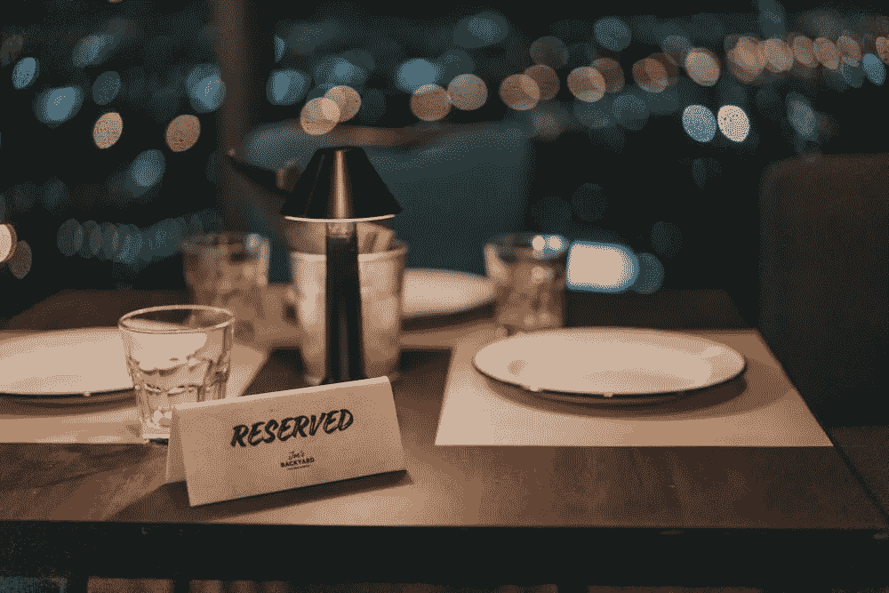

# 使用生成性 AI 来策划约会推荐

> 原文：[`towardsdatascience.com/using-generative-ai-to-curate-date-recommendations-cf12e3e26422?source=collection_archive---------9-----------------------#2024-03-21`](https://towardsdatascience.com/using-generative-ai-to-curate-date-recommendations-cf12e3e26422?source=collection_archive---------9-----------------------#2024-03-21)

## 利用 Amazon Bedrock、Google Places、LangChain 和 Streamlit

 [Ram Vegiraju](https://ram-vegiraju.medium.com/?source=post_page---byline--cf12e3e26422--------------------------------)

·发表于 [Towards Data Science](https://towardsdatascience.com/?source=post_page---byline--cf12e3e26422--------------------------------) ·阅读时长 9 分钟·2024 年 3 月 21 日

--

图片来自 [Unsplash](https://unsplash.com/photos/white-ceramic-plate-on-brown-wooden-table-5JwBbnyZzfc)，由 [Hitesh Dewasi](https://unsplash.com/@iamhiteshdewasi) 提供

生成性 AI 的真正力量体现在它帮助人们简化或自动化日常活动和任务时。一些这些任务的例子包括：电子邮件/消息摘要、简历生成器等。具体来说，上周我正在为我和女朋友策划一个有趣的约会之夜，我意识到没有一种固定的工具可以根据我们的兴趣提供完整的约会创意。

我当然可以使用 Google 然后拼凑出一些不同的地方，但这样需要花费时间和大量的研究（我总是最终跑到 Reddit 上去，哈哈）。另外，我也尝试过直接使用类似 ChatGPT 的工具，但意识到很多建议涉及的地方都比较过时，实际上并未包含最新最好的建议，因为模型是在较早的时间进行训练的。

在我之前的文章中，我们讨论了如何利用 [LangChain Agents](https://python.langchain.com/docs/modules/agents/) 配合 [Spotify API](https://developer.spotify.com/documentation/web-api) 生成音乐推荐。今天，我们将采用一种不同的 API，并且采用一种稍微不同于我们在音乐推荐解决方案中使用的基于 Agent 的方法来策划约会之夜创意。
