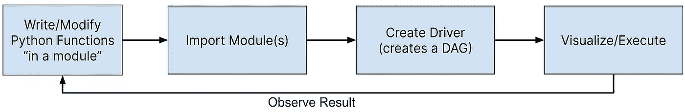
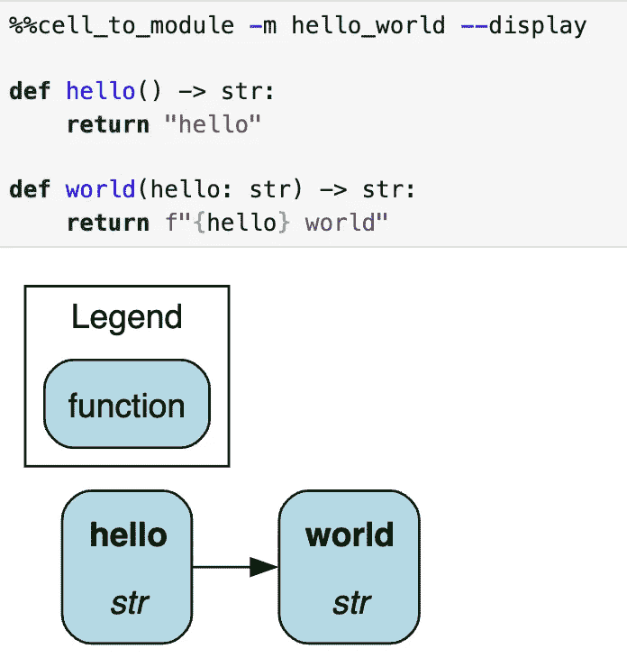
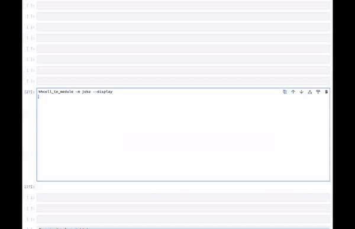

# 使用 IPython Jupyter 魔法命令改善笔记本体验

> 原文：[`towardsdatascience.com/using-ipython-jupyter-magic-commands-to-improve-the-notebook-experience-f2c870cab356?source=collection_archive---------2-----------------------#2024-02-19`](https://towardsdatascience.com/using-ipython-jupyter-magic-commands-to-improve-the-notebook-experience-f2c870cab356?source=collection_archive---------2-----------------------#2024-02-19)

## 创建自定义 IPython Jupyter 魔法命令的帖子

[](https://medium.com/@stefan.krawczyk?source=post_page---byline--f2c870cab356--------------------------------)[](https://towardsdatascience.com/?source=post_page---byline--f2c870cab356--------------------------------) [Stefan Krawczyk](https://medium.com/@stefan.krawczyk?source=post_page---byline--f2c870cab356--------------------------------)

·发表于 [Towards Data Science](https://towardsdatascience.com/?source=post_page---byline--f2c870cab356--------------------------------) ·12 分钟阅读·2024 年 2 月 19 日

--


学会在你的笔记本中施展一些魔法。图像由作者使用 DALL-E-3 创建。此帖的一个版本最初发布在[这里](https://blog.dagworks.io/p/using-ipython-jupyter-magic-commands)。

# 介绍

Jupyter 笔记本在数据科学中已经很常见。它们允许在一个地方混合“读取、评估、打印、[循环]”（REPL）代码编写和文档编写。它们通常用于分析和头脑风暴目的，但也有一些人更倾向于使用笔记本而非脚本来运行生产代码（不过我们在这里不讨论这个话题）。

不可避免地，笔记本中编写的代码在某些方面会有重复，比如设置数据库连接、显示输出、保存结果、与内部平台工具交互等。最好将这些代码存储为函数和/或模块，以便它们可重用且更易于管理。

然而，进行这项操作并不总是能改善笔记本的体验。例如，你仍然需要在整个笔记本中导入并调用这些函数，这样并不会显著改变笔记本的体验。那么，如何增强笔记本开发体验呢？[IPython Jupyter 魔法命令](https://ipython.readthedocs.io/en/stable/interactive/magics.html)。

IPython Jupyter 魔法命令（例如，笔记本单元中以`%`或`%%`开头的行）可以修饰笔记本单元或行，以修改其行为。许多魔法命令是默认提供的，包括`%timeit`用于测量单元的执行时间，`%bash`用于执行 Shell 命令，还有一些命令由扩展提供，[例如](https://pypi.org/project/ipython-sql/) `%sql` [可以直接在笔记本单元中编写 SQL 查询](https://pypi.org/project/ipython-sql/)。

在本文中，我们将展示如何让你的团队将任何实用函数转化为可重用的 IPython Jupyter 魔法，以提供更好的笔记本体验。作为示例，我们将使用我们创建的开源库[Hamilton](https://github.com/dagworks-inc/hamilton)，来促使我们创建一个魔法，帮助改进开发中的使用体验。你不需要了解 Hamilton 是什么，就能理解本文的内容。

> *注意：如今，有许多种类的笔记本（如[*Jupyter*](https://jupyter.org/)、[*VSCode*](https://code.visualstudio.com/docs/datascience/jupyter-notebooks)、[*Databricks*](https://docs.databricks.com/en/notebooks/index.html)等），但它们都是建立在 IPython 之上的。因此，开发的 Magics 应该可以跨环境重用。*

# 理解 IPython Jupyter Magics

IPython Jupyter Magics（我们简称为 Magics）是可以动态加载到笔记本中的代码片段。它们有两种类型，单行魔法和单元魔法。

***单行魔法***，顾名思义，作用于单独的一行。也就是说，它只处理该行上指定的输入。它们通过命令前的单个`%`表示。

```py
# will only time the first line
%time print("hello")
print("world")
```

***单元魔法***，顾名思义，作用于整个单元的内容。它们通过命令前的双``%%``表示。

```py
# will time the entire cell
%%timeit
print("hello")
print("world")
```

Jupyter 自带[一些内置魔法命令](https://ipython.readthedocs.io/en/stable/interactive/magics.html)。你可以将它们看作是“命令行”工具，可以访问整个笔记本的上下文。这使得它们不仅能够与笔记本的输出进行交互（例如，打印结果、显示 PNG、渲染 HTML），还可以修改现有变量的状态，并写入其他代码和 Markdown 单元！

这对于开发内部工具非常有用，因为它可以抽象并隐藏不必要的复杂性，给用户带来“神奇”的体验。这是开发你自己“平台工作”的强大工具，特别适用于 MLOps 和 LLMOps 目的，因为你可以将集成的内容隐藏，不需要在笔记本中暴露。因此，这也意味着如果这些抽象代码在幕后发生变化，笔记本不需要更新，因为所有内容都可以隐藏在 Python 依赖项的升级中。

# 工作流示例

魔法命令有可能让你的工作流程变得更简单、更快捷。例如，如果你更倾向于先在笔记本中开发，然后再将代码转移到 Python 模块中，这可能涉及容易出错的剪切和粘贴。为此，魔法命令`%%writefile my_module.py`将直接创建一个文件，并将你的单元格内容复制到其中。

另一方面，你可能更喜欢在 IDE 中开发 `my_module.py`，然后将其加载到笔记本中以测试你的函数。这通常需要重启笔记本内核来刷新模块导入，这可能会很麻烦。在这种情况下，`%autoreload` 将在每次单元格执行之前自动重新加载所有模块导入，从而消除这个摩擦点！

# 自定义魔法命令的需求

在文章 [数据代码应该有多结构化？](https://blog.dagworks.io/p/how-well-structured-should-your-data) 中，提到标准化/集中化/“平台”工作应当改善“快速推进与打造持久系统”之间的取舍曲线。改变这一取舍的一个具体策略是实现更好的工具支持。更好的工具应该使曾经复杂的事情变得更简单并且易于访问。这正是通过自定义魔法命令可以实现的目标，它意味着你可以减少需要做出的取舍。

# 一个 Hamilton 魔法命令

*对于那些不熟悉 Hamilton 的读者，我们建议阅读许多相关的 TDS 文章（例如* *起源故事**，* *生产提示工程**，* [*简化 Airflow DAG 创建与维护*](https://medium.com/towards-data-science/simplify-airflow-dag-creation-and-maintenance-with-hamilton-in-8-minutes-e6e48c9c2cb0)，[*整洁的生产 Pandas*](https://medium.com/towards-data-science/tidy-production-pandas-with-hamilton-3b759a2bf562)，*等等。）以及* [*https://www.tryhamilton.dev/*](https://www.tryhamilton.dev/)*。*

[Hamilton](https://github.com/dagworks-inc/hamilton) 是我们在 2019 年在 Stitch Fix 创建的一个开源工具。Hamilton 帮助数据科学家和工程师定义可测试、模块化、自文档化的数据流，并对其进行血统追踪和元数据编码。Hamilton 通过要求 Python 函数被整理成模块来实现这些特性。

然而，典型的 Jupyter 笔记本使用模式会导致代码只存在于笔记本中，无法在其他地方访问，这给开发者带来了人机工程学挑战：

> ***我们如何使人们能够轻松快捷地从笔记本创建 Python 模块，同时改善开发体验？***

Hamilton 开发循环如下所示：



Hamilton 开发循环。图像来自作者。

花点时间阅读这个循环。该循环显示了每次代码更改时，用户不仅需要重新导入 Python 模块，还需要重新创建驱动程序对象。由于笔记本允许按任意顺序执行单元格，这可能会让用户很难跟踪每个模块的版本以及驱动程序中当前加载的内容。这项负担由用户承担，并可能需要重启内核，这会丢失其他计算结果（幸运的是，Hamilton 可以设置为执行复杂的数据流并从上次停止的地方继续……），这并不是理想的情况。

这是我们如何使用魔法命令来改进这个循环：

1.  从单元格中定义的函数创建一个“临时”Python 模块，并直接在笔记本中导入这个新模块。

1.  自动可视化函数定义的有向无环图（DAG），减少可视化样板代码。

1.  重新构建笔记本中所有的 Hamilton 驱动程序，并更新模块，节省用户记得手动重新创建驱动程序来接收变更的时间。

# 我们将要实现的功能

我们希望命令看起来像这样：

```py
%%cell_to_module -m my_module --display --rebuild-drivers

def my_func(some_input: str) -> str:
  """Some logic"""
  return ...
```

运行单元格后，产生以下行为：

+   在笔记本中创建名为 my_module 的模块。

+   显示由单元格内的函数构建的有向无环图（DAG）。

+   重新构建任何使用了 my_module 的下游驱动程序，*避免用户需要重新运行这些单元格*。

如你所见，这是一个非平凡的魔法命令，因为我们正在调整单元格的输出和笔记本的状态。

# 构建自定义魔法命令

在这里，我们一步步地说明如何创建魔法命令。为了避免只展示一个平凡的“hello world”例子，我们还将解释如何构建 Hamilton 的 `%%cell_to_module` 魔法命令。

# 步骤 1：设置你的代码

创建一个新的 Python 模块，在其中编写魔法命令代码，并创建一个 Jupyter Notebook 来进行尝试。这个模块（即 `.py` 文件）的名称将是你需要加载的扩展名。

如果安装了 Jupyter Notebook，你已经具备了所有必需的 Python 依赖项。然后，添加你需要的库，在我们的案例中是 Hamilton（``pip install sf-hamilton[visualization]``）。

# 步骤 2：定义你的魔法命令

要定义一个简单的魔法命令，你可以使用函数或对象（[查看这些文档](https://ipython.readthedocs.io/en/stable/config/custommagics.html)）。对于需要状态的复杂魔法命令，你将需要使用类方法。在这里我们将使用基于类的方法。首先，我们需要导入 IPython 模块/函数，然后定义一个继承自 `magic.Magics` 的类。每个使用 `@cell_magic` 或 `@line_magic` 装饰器的方法都定义了一个新的魔法命令，类可以包含任意数量的这些方法。

首先，你的代码在高层次上应该是这样的：

```py
# my_magic.py

from IPython.core import magic
from IPython.core.magic_arguments import argument, magic_arguments, parse_argstring
@magic.magics_class
class MyMagic(magic.Magics):
   """Custom class you write"""
   @magic_arguments() # needs to be on top to enable parsing
   @argument(...)   
   @magic.cell_magic
   def a_cell_magic_command(self, line, cell):
      ...
   @magic_arguments() # needs to be on top to enable parsing
   @argument(...)   
   @magic.line_magic
   def a_line_magic_command(self, line):
     ...
```

对于有状态的魔法命令，添加 `__init__()` 方法（即构造函数）可能很有用。但在我们的情况下并不需要。

通过继承自`magic.Magics`，此类可以访问多个重要字段，包括 self.shell，这是支撑笔记本的[IPython InteractiveShell](https://ipython.readthedocs.io/en/stable/api/generated/IPython.core.interactiveshell.html#IPython.core.interactiveshell.InteractiveShell)。使用它可以让你提取并检查当前 Jupyter 笔记本中加载的变量。

我们的 Hamilton Magic 命令将首先如下所示：

```py
from IPython.core import magic
from IPython.core.magic_arguments import argument, magic_arguments, parse_argstring

@magic.magics_class
class HamiltonMagics(magic.Magics):
    """Magics to facilitate Hamilton development in Jupyter notebooks"""
  @magic_arguments()  # needed on top to enable parsing
  @arguments(...)
  @magics.cell_magic
  def cell_to_module(self, line, cell):
    ...
```

# 步骤 3：解析输入参数

接下来，我们指定将传递哪些参数以及如何解析它们。对于每个参数，添加`@argument`，并在顶部添加`@magic_arguments()`装饰器。如果你熟悉[argparse](https://docs.python.org/3/library/argparse.html)参数，它们遵循类似的模式，但功能不完全一样。在函数内部，你需要调用*parse_argstring()*函数。它接收函数本身以读取来自装饰器的指令，以及`*line*`（包含`%`或`%%`）其中包含参数值。

我们的命令将开始看起来像这样：

```py
@magic_arguments() # needs to be on top to enable parsing
# flag, long form, default value, help string.
@argument("-a", "--argument", default="some_value", help="Some optional line argument")   
@magic.cell_magic
def a_cell_magic_command(self, line, cell):
   args = parse_argstring(self.a_cell_magic_command, line)
   if args.argument:
      # do stuff -- place your utility functions here
```

注意，对于必需的参数，*magic_arguments()*中没有为此提供设施，因此你需要在函数体内手动检查正确性等。

继续解析 Hamilton Magic 示例，类中的方法现在看起来如下；我们使用了许多可选参数：

```py
@magic_arguments()  # needed on top to enable parsing
@argument(
    "-m", "--module_name", help="Module name to provide. Default is jupyter_module."
)  # keyword / optional arg
@argument(
    "-c", "--config", help="JSON config, or variable name containing config to use."
)  # keyword / optional arg
@argument(
    "-r", "--rebuild-drivers", action="store_true", help="Flag to rebuild drivers"
)  # Flag / optional arg
@argument(
    "-d", "--display", action="store_true", help="Flag to visualize dataflow."
)  # Flag / optional arg
@argument(
    "-v", "--verbosity", type=int, default=1, help="0 to hide. 1 is normal, default"
)  # keyword / optional arg
@magics.cell_magic
def cell_to_module(self, line, cell):
    """Execute the cell and dynamically create a Python module from its content.

     A Hamilton Driver is automatically instantiated with that module for variable `{MODULE_NAME}_dr`.
        > %%cell_to_module -m MODULE_NAME --display --rebuild-drivers
    Type in ?%%cell_to_module to see the arugments to this magic.
    """
    # specify how to parse by passing 
    args = parse_argstring(self.cell_to_module, line)  
    # now use args for logic ...
```

注意，额外的`@argument`参数对于当有人使用`?`查询 Magic 的功能时非常有用。例如，`?%%cell_to_module`将显示文档。

# 步骤 4：实现命令的逻辑

现在我们已经解析了参数，可以实现 Magic 命令的逻辑。这里没有特别的限制，你可以编写任何 Python 代码。跳过一个通用的示例（你已经有足够的内容可以从前一步开始），让我们深入探讨 Hamilton Magic 示例。对于它，我们希望使用参数来决定命令的期望行为：

1.  创建 Python 模块，命名为*module_name*。

1.  如果*— rebuild-driver*，重建驱动程序，并传递详细信息。

1.  如果*— config*存在，准备好它。

1.  如果*— display*，显示 DAG。

请参阅代码中的注释以获取解释：

```py
# we're in the bowels of def cell_to_module(self, line, cell):
# and we remove an indentation for readability
...
# specify how to parse by passing this method to the function 
args = parse_argstring(self.cell_to_module, line)
# we set a default value, else use the passed in value 
# for the module name.
if args.module_name is None:
    module_name = "jupyter_module"
else:
    module_name = args.module_name
# we determine whether the configuration is a variable
# in the notebook environment
# or if it's a JSON string that needs to be parsed.
display_config = {}
if args.config:
    if args.config in self.shell.user_ns:
        display_config = self.shell.user_ns[args.config]
else:
    if args.config.startswith("'") or args.config.startswith('"'):
        # strip quotes if present
        args.config = args.config[1:-1]
    try:
        display_config = json.loads(args.config)
    except json.JSONDecodeError:
        print("Failed to parse config as JSON. "
              "Please ensure it's a valid JSON string:")
        print(args.config)
# we create the python module (using a custom function)
module_object = create_module(cell, module_name)
# shell.push() assign a variable in the notebook. 
# The dictionary keys are the variable name
self.shell.push({module_name: module_object})
# Note: self.shell.user_ns is a dict of all variables in the notebook
# -- we pass that down via self.shell.
if args.rebuild_drivers:
    # rebuild drivers that use this module (custom function)
    rebuilt_drivers = rebuild_drivers(
        self.shell, module_name, module_object, 
        verbosity=args.verbosity
    )
    self.shell.user_ns.update(rebuilt_drivers)
# create a driver to display things for every cell with %%cell_to_module
dr = (
    driver.Builder()
    .with_modules(module_object)
    .with_config(display_config)
    .build()
)
self.shell.push({f"{module_name}_dr": dr})
if args.display:
    # return will go to the output cell. 
    # To display multiple elements, use IPython.display.display(
    # print("hello"), dr.display_all_functions(), ... )
    return dr.display_all_functions()
```

注意我们是如何使用`self.shell`的。这允许我们更新并注入变量到笔记本中。函数返回的值将作为“单元输出”使用（即你看到打印值的地方）。

# 步骤 5：注册你的 Magic 命令

最后，我们需要告知 IPython 和笔记本关于 Magic 命令的信息。我们定义 Magic 的模块必须具备以下功能来注册 Magic 类，并能够加载我们的扩展。如果涉及任何有状态的操作，应该在这里实例化它。

请注意，这里`ipython`参数与我们定义的类方法中`self.shell`所提供的 InteractiveShell 是相同的。

```py
def load_ipython_extension(ipython: InteractiveShell):
  """
  Any module file that define a function named `load_ipython_extension`
  can be loaded via `%load_ext module.path` or be configured to be
  autoloaded by IPython at startup time.
  """
  ipython.register_magics(MyMagic)
  ipython.register_magics(HamiltonMagics)
```

请参阅完整的[Hamilton Magic 命令](https://github.com/DAGWorks-Inc/hamilton/blob/main/hamilton/plugins/jupyter_magic.py)。

# 尝试一下

要在笔记本中加载你的魔法命令，请尝试以下命令：

`%load_ext my_magic`

对于我们的 Hamilton 魔法命令，我们可以通过以下方式加载：

`%load_ext hamilton.plugins.jupyter_magic`

在开发过程中，使用此命令重新加载你更新后的魔法命令，而无需重启笔记本内核。

`%reload_ext my_magic`

然后，你可以在每一行或单元格的基础上调用定义的魔法命令。因此，对于 Hamilton，我们现在可以执行：

`%%?cell_to_module`

这是一个使用示例，展示了它如何注入可视化内容：



展示魔法命令实际应用的示例。



动画 GIF，展示如何添加函数并按回车刷新图像。

# 你接下来会做什么

在实际使用案例中，你最有可能将你的魔法命令版本化并打包到一个库中，然后在 Python 环境中根据需要轻松管理。对于 Hamilton 魔法命令，它被打包进了 Hamilton 库，因此只需安装 sf-hamilton，加载魔法命令后即可在笔记本中访问。

# 要关闭

在这篇文章中，我们向你展示了创建和加载你自己的 IPython Jupyter 魔法命令所需的步骤。希望你现在已经开始思考在笔记本中常做的单元格/任务/操作，这些操作可以通过添加简单的魔法命令来增强/简化/甚至去除！

为了展示一个现实中的例子，我们动机并展示了一个 Hamilton 魔法命令的内部工作原理，目的是展示一个为了提高 Jupyter Notebook 中开发者体验而设计的命令，通过增强输出并改变内部状态。

我们希望这篇文章能帮助你克服难关，为你和你的团队的 Jupyter Notebook 体验创建更符合人体工程学的工具。

# 其他资源

+   [内建魔法命令 — IPython 8.21.0 文档](https://ipython.readthedocs.io/en/stable/interactive/magics.html)

+   [定义自定义魔法命令 — IPython 8.21.0 文档](https://ipython.readthedocs.io/en/stable/config/custommagics.html)

+   [1.4\. 创建一个带有自定义魔法命令的 IPython 扩展](https://ipython-books.github.io/14-creating-an-ipython-extension-with-custom-magic-commands/)
