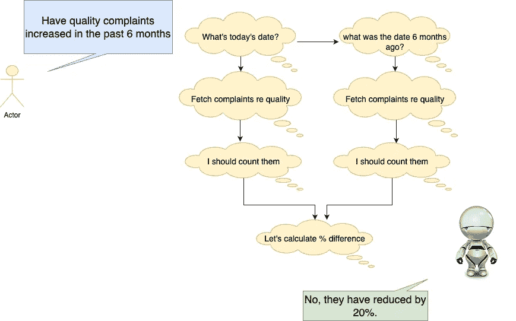
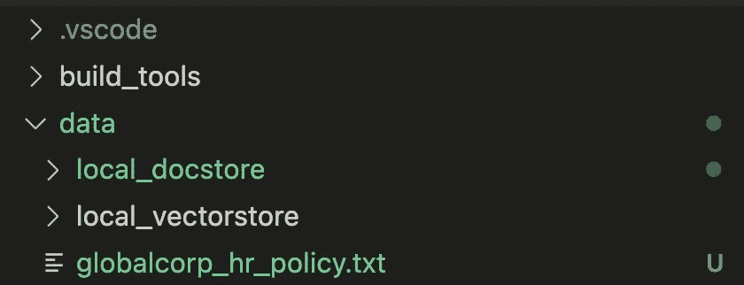
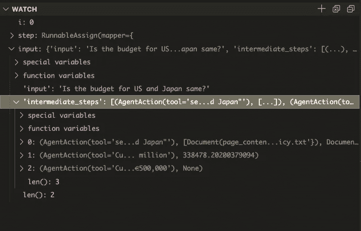
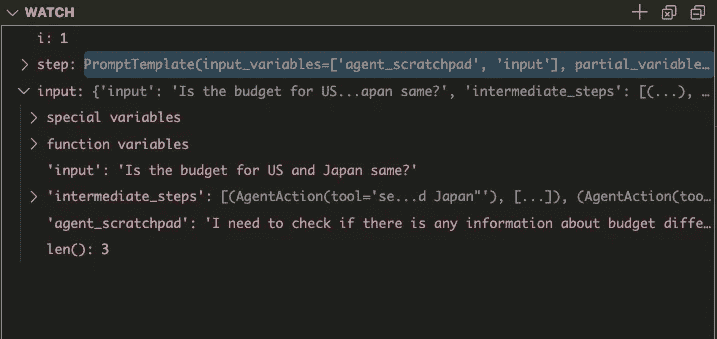
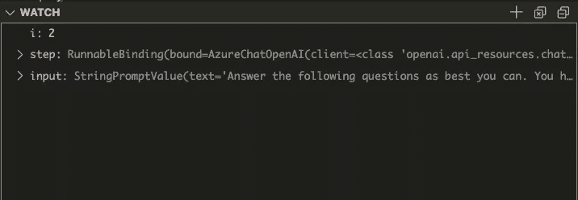
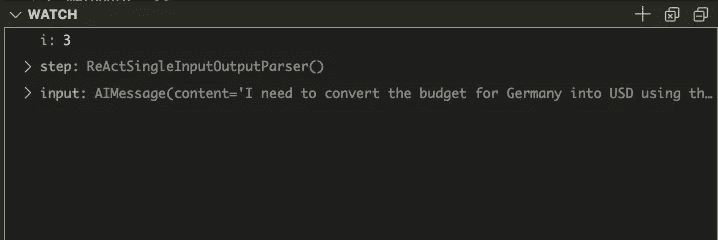
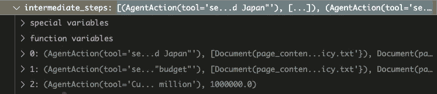
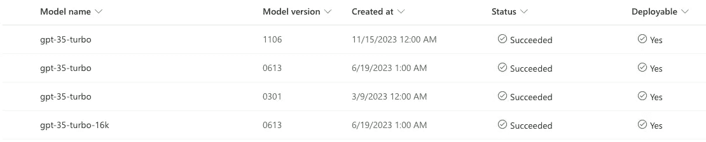

# 使用 LangChain ReAct 代理回答 RAG 系统中的多跳问题

> 原文：[`towardsdatascience.com/using-langchain-react-agents-for-answering-multi-hop-questions-in-rag-systems-893208c1847e?source=collection_archive---------0-----------------------#2024-02-15`](https://towardsdatascience.com/using-langchain-react-agents-for-answering-multi-hop-questions-in-rag-systems-893208c1847e?source=collection_archive---------0-----------------------#2024-02-15)

## #LLM 初学者指南

## 在使用 ReAct 和 Open AI Tools 代理逐步回答复杂查询时非常有用，特别是在处理内部文档时。

[](https://varshitasher.medium.com/?source=post_page---byline--893208c1847e--------------------------------)[](https://towardsdatascience.com/?source=post_page---byline--893208c1847e--------------------------------) [Dr. Varshita Sher](https://varshitasher.medium.com/?source=post_page---byline--893208c1847e--------------------------------)

·发布于[Towards Data Science](https://towardsdatascience.com/?source=post_page---byline--893208c1847e--------------------------------) ·阅读时长 43 分钟·2024 年 2 月 15 日

--


图片由作者生成（提示工程学贡献：Fabian Nitka）

# 动机

我过去使用标准的 LangChain 组件（如 vectorstore、retrievers 等）构建的基本 RAG 聊天机器人效果很好。根据我提供的内部数据集，它们能够处理一些简单的问题，比如“印度的产假政策是什么”（源数据集：HR 政策文档）、“我们产品的口味主要有哪些问题”（源数据集：社交媒体/Twitter）、“莫奈画作中的主题是什么”（源数据集：艺术期刊）等。最近，输入的查询复杂度增加了，例如，“过去 1 个月内，关于口味的关注是否有所增加”。除非内部文档中有专门讨论比较的部分，否则聊天机器人很难给出正确答案。原因是——正确的答案需要以下步骤被有序地规划和执行：

+   第一步：根据“过去 1 个月”和今天的日期计算*开始*日期和*结束*日期

+   第二步：获取提到口味问题的*开始*日期的查询

+   第三步：计数第二步中的查询

+   第四步：获取提到口味问题的*结束*日期的查询

+   第五步：计数第四步中的查询

+   第六步：使用第三步和第五步中的计数计算百分比的增减。

幸运的是，大型语言模型在这种*规划*方面非常擅长！而 Langchain 代理则是为我们协调这些规划的工具。

> 代理的核心思想是使用语言模型选择一系列要执行的操作。在代理中，语言模型作为推理引擎，决定采取哪些行动以及以什么顺序执行。[[来源](https://python.langchain.com/docs/modules/agents)]



代理以逐步方式回答多跳问题。（图像由作者提供）

代理通常需要在实例化时指定一组工具。例如，要解决上述的多跳问题，我们应该定义四个工具：

+   `Tool_Date`：一个 Python 函数，输入一个相对时间框架（如*过去 6 个月*），并通过从今天的日期中减去该时间框架来计算开始日期（用于步骤#1）

+   `Tool_Search`：一个搜索引擎，输入搜索词并返回相关文档列表（用于步骤#2 和步骤#4）

+   `Tool_Length`：一个 Python 函数，输入一个列表并返回该列表的长度（用于步骤#3 和步骤#5）

+   `Tool_PercCalculator`：一个 Python 函数，输入两个数字并返回百分比变化计算结果（用于步骤#6）

一般来说——请注意你为代理提供的工具选择，因为这些是代理在回答每一个中间步骤时会使用的*唯一*工具。如果它找到相关工具——太好了，它将使用该工具来获得答案。如果没有，它通常会迭代几次（即尝试使用其他可用工具或其自身的逻辑推理），最终返回一个次优的答案。

让我们直接进入代码，如果你想跟着一起操作，以下是 [GitHub 仓库](https://github.com/V-Sher/LangChain_ReAct_Demo)。

## 数据集

虽然我很想使用那个非常流行的 `[state_of_the_union.txt](https://github.com/hwchase17/chat-your-data/blob/master/state_of_the_union.txt)` 来做这个演示，但我没能想出可以对该文档提问的复杂问题。因此，我创建了一个虚构公司 GlobalCorp 的虚拟 HR 文档（使用 ChatGPT）。你可以在 [这里](https://github.com/V-Sher/LangChain_ReAct_Demo/blob/main/data/globalcorp_hr_policy.txt) 查看 `globalcorp_hr_policy.txt` 文件。该文件的主要亮点包括：（a）国家特定的年度预算（b）不同货币的预算，以及（c）国家特定的假期政策。

## LLM 和嵌入模型

我们将在本教程中使用 Azure Open AI 模型（`gpt3.5 turbo`、`gpt-4-turbo` 和 `ada-embeddings`）。

```py
OPENAI_API_KEY = os.getenv("OPENAI_API_KEY")
OPENAI_DEPLOYMENT_NAME = "gpt-35-turbo-16k"
OPENAI_DEPLOYMENT_ENDPOINT = "https://<???>.openai.azure.com/"
OPENAI_DEPLOYMENT_VERSION = "2023-12-01-preview"
OPENAI_MODEL_NAME = "gpt-35-turbo-16k"

OPENAI_ADA_EMBEDDING_DEPLOYMENT_NAME = "text-embedding-ada"
OPENAI_ADA_EMBEDDING_MODEL_NAME = "text-embedding-ada-002"

llm = AzureChatOpenAI(
    deployment_name=OPENAI_DEPLOYMENT_NAME,
    model_name=OPENAI_MODEL_NAME,
    openai_api_base=OPENAI_DEPLOYMENT_ENDPOINT,
    openai_api_version=OPENAI_DEPLOYMENT_VERSION,
    openai_api_key=OPENAI_API_KEY,
    openai_api_type="azure",
    temperature=0.1,
)

embeddings = OpenAIEmbeddings(
    deployment=OPENAI_ADA_EMBEDDING_DEPLOYMENT_NAME,
    model=OPENAI_ADA_EMBEDDING_MODEL_NAME,
    openai_api_base=OPENAI_DEPLOYMENT_ENDPOINT,
    openai_api_type="azure",
    chunk_size=1,
    openai_api_key=OPENAI_API_KEY,
    openai_api_version=OPENAI_DEPLOYMENT_VERSION,
)
```

*免责声明 — 我将交替使用“RAG 工具”、“Q&A 系统”和“QnA 工具”这几个术语。在本教程中，它们都指的是一个能够查找一堆文档以回答特定用户查询的工具，但它* ***没有*** *任何对话记忆，即你不能以类似聊天的方式提问后续问题。不过，这可以在 LangChain 中轻松实现，可能会在未来的某篇文章中讨论。这里的重点仅仅是让多跳问题能够正常工作。*

## 基于 RAG 的 QnA

让我们继续使用这些数据构建一个标准的问答系统。

我们将使用`TextLoader`加载虚拟 HR 文档。

```py
# Loading the document
from langchain.document_loaders import TextLoader

loader = TextLoader("../data/globalcorp_hr_policy.txt")
documents = loader.load()
```

`Chroma`作为向量存储（用于存储文档嵌入），

```py
persist_directory = "local_vectorstore"
collection_name = "hrpolicy"
PROJECT_ROOT = "...." #insert your project root directory name here

vectorstore = Chroma(
    persist_directory=os.path.join(PROJECT_ROOT, "data", persist_directory),
    collection_name=collection_name,
    embedding_function=embeddings,
)
```

`LocalFileStore`作为文档存储（用于存储父文档），

```py
from langchain.storage._lc_store import create_kv_docstore

# The storage layer for the parent documents
local_store = "local_docstore"
local_store = LocalFileStore(os.path.join(PROJECT_ROOT, "data", local_store))
docstore = create_kv_docstore(local_store)
```

PDR（`parentdocumentretriever`）作为`retriever`（用于从索引中检索相关数据）。

```py
# This text splitter is used to create the child documents
parent_splitter = RecursiveCharacterTextSplitter(chunk_size=1000, chunk_overlap=20)
child_splitter = RecursiveCharacterTextSplitter(chunk_size=200, chunk_overlap=20)

retriever = ParentDocumentRetriever(
    vectorstore=vectorstore,
    docstore=docstore,
    child_splitter=child_splitter,
    parent_splitter=parent_splitter,
)
```

完成所有设置后，我们准备使用`add_documents()`命令将文档添加到检索器中。此外，我还建议使用`.persist()`命令持久化向量存储（即将向量存储的内容保存到磁盘，这样你在终止当前会话后就不必重新计算嵌入了）。

```py
# run only once
# vectorstore.persist()
# retriever.add_documents(documents, ids=None)
```

一旦运行这些命令，你应该会看到在工作会话中创建了两个文件夹 — `local_docstore`和`local_vectorstore`。可以随意检查每个文件夹的内容。



快速检查`retriever`是否设置正确：

```py
retriever.get_relevant_documents("communication initiatives?")

## OUTPUT ##
[Document(page_content='**Health and Safety:**\nWorkplace safety is a shared responsibility. Emergency procedures are clearly posted throughout our office buildings, and an annual budget of $10,000, €5,000, and ¥1 million is allocated for safety drills and equipment maintenance in the U.S., Germany, and Japan, respectively.\n\n**Communication:**\nImportant updates are conveyed through company-wide emails and team meetings. An annual budget of $500,000, €250,000, and ¥25 million is allocated for communication initiatives, including employee engagement events in the U.S., Germany, and Japan, respectively.\n\nThis policy undergoes an annual review to ensure relevance and compliance. Welcome to GlobalCorp, where our commitment to a diverse, inclusive, and respectful workplace is the foundation of our success.\n\n1.\tRecruitment and Selection\n1.\tIntroduction', metadata={'source': '../data/globalcorp_hr_policy.txt'}),
 Document(page_content='•\ttwo satisfactory references;\n•\tconfirmation of the right to work in this country (if appropriate)\n•\tCriminal Records Disclosure (if appropriate).\n6.\tProbationary Period\n\t\n6.1\tAll appointments into the Company will be made subject to a probationary period of six calendar months. After three months a review meeting will take place between the post holder and their line manager to discuss progress. At the end of the probationary period, and subject to a satisfactory report by the appropriate head of section or line manager, employees will be notified in writing that they have successfully completed their probationary period. The probationary period can be extended by a further 3 months should the individuals line manager consider this appropriate.\n7.\tRecruitment Monitoring', metadata={'source': '../data/globalcorp_hr_policy.txt'})]
```

最后，我们将构建`RetrievalQA`链，通过之前提到的所有组件进行问答。

```py
from langchain.chains import RetrievalQA

qa = RetrievalQA.from_chain_type(
    llm=llm,
    chain_type="stuff",
    retriever=retriever,
    return_source_documents=True,
)
```

## 提问标准问题

```py
qa({"query": "What is the allocated budget for communication initiatives?"})

## OUTPUT ##
{'query': 'What is the allocated budget for communication initiatives?',
 'result': 'The allocated budget for communication initiatives is $500,000 in the United States, €250,000 in Germany, and ¥25 million in Japan.',
 'source_documents': [Document(page_content='**Health and Safety:**\nWorkplace safety is a shared responsibility. Emergency procedures are clearly posted throughout our office buildings, and an annual budget of $10,000, €5,000, and ¥1 million is allocated for safety drills and equipment maintenance in the U.S., Germany, and Japan, respectively.\n\n**Communication:**\nImportant updates are conveyed through company-wide emails and team meetings. An annual budget of $500,000, €250,000, and ¥25 million is allocated for communication initiatives, including employee engagement events in the U.S., Germany, and Japan, respectively.\n\nThis policy undergoes an annual review to ensure relevance and compliance. Welcome to GlobalCorp, where our commitment to a diverse, inclusive, and respectful workplace is the foundation of our success.\n\n1.\tRecruitment and Selection\n1.\tIntroduction', metadata={'source': '../data/globalcorp_hr_policy.txt'}),
  Document(page_content='**Grievance and Disciplinary Procedures:**\nOur grievance and disciplinary procedures are outlined on the company intranet. Termination conditions may include gross misconduct or repeated policy violations. In such cases, a disciplinary process will be followed, including a three-strike system, before termination. Employees leaving GlobalCorp should follow the exit process detailed in the employee handbook.\n\n**Confidentiality and Data Security:**\nEmployees are expected to maintain confidentiality, and strict data security measures are in place. An annual budget of $1 million is allocated for cybersecurity training and awareness programs in the U.S., while budgets for Germany and Japan are €500,000 and ¥50 million, respectively.', metadata={'source': '../data/globalcorp_hr_policy.txt'}),
  Document(page_content='**Compensation and Benefits - United States:**\nIn the United States, employees enjoy health insurance, dental coverage, and a 401(k) retirement plan. An annual budget of $1 million is allocated for employee benefits.\n\n**Compensation and Benefits - Germany:**\nIn Germany, benefits include health insurance, a pension plan, and an additional 5 days of vacation annually. An annual budget of €500,000 is allocated for employee benefits.\n\n**Compensation and Benefits - Japan:**\nIn Japan, employees receive health insurance, a commuting allowance, and wellness benefits. An annual budget of ¥50 million is allocated for employee benefits.\n\n**Leave Policies - United States:**\nIn the United States, employees have 15 days of paid vacation and 10 days of paid sick leave annually. An annual budget of $500,000 is allocated for leave-related expenses.', metadata={'source': '../data/globalcorp_hr_policy.txt'})]}
```

```py
qa({"query": "What is the probationary period?"})

## OUTPUT ##
{'query': 'What is the probationary period?',
 'result': "The probationary period is a period of six calendar months during which an employee's performance and suitability for the job are assessed. At the end of the probationary period, if the employee's performance is satisfactory, they will be notified in writing that they have successfully completed their probationary period. The probationary period can be extended by a further 3 months if the employee's line manager deems it necessary.",
 'source_documents': [Document(page_content='•\ttwo satisfactory references;\n•\tconfirmation of the right to work in this country (if appropriate)\n•\tCriminal Records Disclosure (if appropriate).\n6.\tProbationary Period\n\t\n6.1\tAll appointments into the Company will be made subject to a probationary period of six calendar months. After three months a review meeting will take place between the post holder and their line manager to discuss progress. At the end of the probationary period, and subject to a satisfactory report by the appropriate head of section or line manager, employees will be notified in writing that they have successfully completed their probationary period. The probationary period can be extended by a further 3 months should the individuals line manager consider this appropriate.\n7.\tRecruitment Monitoring', metadata={'source': '../data/globalcorp_hr_policy.txt'})]}
```

```py
qa({"query": "What is the difference in the number of work hours in Germany vs. United States?"})

## OUTPUT ##
{'query': 'What is the difference in the number of work hours in Germany vs. United States?',
 'result': 'In Germany, the standard workweek is 38 hours (Monday to Friday, 8 AM to 5 PM), while in the United States, employees adhere to a standard 40-hour workweek (Monday to Friday, 9 AM to 5 PM). So, the difference in the number of work hours between Germany and the United States is 2 hours per week.',
 'source_documents': [Document(page_content='**GlobalCorp Human Resources Policy**\n\nWelcome to GlobalCorp, where our Human Resources Policy is designed to provide a comprehensive framework for employees across our offices in the United States, Germany, and Japan. We operate under an at-will employment relationship, and any contractual agreements should be documented in writing.\n\nAt the core of our culture is a commitment to professionalism and ethical conduct. Clear and respectful communication is highly valued, and a business casual dress code is encouraged.\n\n**Work Hours:**\nEmployees in the United States adhere to a standard 40-hour workweek (Monday to Friday, 9 AM to 5 PM). In Germany, the standard workweek is 38 hours (Monday to Friday, 8 AM to 5 PM), and in Japan, employees work 40 hours per week (Monday to Friday, 9 AM to 6 PM). Punctuality is paramount, and employees are expected to arrive on time. Time-off requests follow country-specific guidelines.', metadata={'source': '../data/globalcorp_hr_policy.txt'}),
  Document(page_content='**Leave Policies - Germany:**\nIn Germany, generous leave policies offer 30 days of paid vacation and 20 days of paid sick leave annually. An annual budget of €1 million is allocated for leave-related expenses.\n\n**Leave Policies - Japan:**\nIn Japan, employees enjoy 20 days of paid vacation and 15 days of paid sick leave per year. An annual budget of ¥100 million is allocated for leave-related expenses.\n\n**Performance Management:**\nPerformance reviews are conducted annually, with regular feedback provided to support professional development. GlobalCorp encourages continuous learning and allocates an annual budget of $5,000 per employee for training and development opportunities.', metadata={'source': '../data/globalcorp_hr_policy.txt'}),
  Document(page_content='**Compensation and Benefits - United States:**\nIn the United States, employees enjoy health insurance, dental coverage, and a 401(k) retirement plan. An annual budget of $1 million is allocated for employee benefits.\n\n**Compensation and Benefits - Germany:**\nIn Germany, benefits include health insurance, a pension plan, and an additional 5 days of vacation annually. An annual budget of €500,000 is allocated for employee benefits.\n\n**Compensation and Benefits - Japan:**\nIn Japan, employees receive health insurance, a commuting allowance, and wellness benefits. An annual budget of ¥50 million is allocated for employee benefits.\n\n**Leave Policies - United States:**\nIn the United States, employees have 15 days of paid vacation and 10 days of paid sick leave annually. An annual budget of $500,000 is allocated for leave-related expenses.', metadata={'source': '../data/globalcorp_hr_policy.txt'})]}
```

在手动审核过政策文档后，可以放心地说，答案是有意义的。

## 提问复杂/多跳问题

```py
# incorrect as the currency conversion used is wrong. We need to fix this!
qa({"query": "What is the percentage difference in the annual budget for Japan and US?"})

## OUTPUT ##
{'query': 'What is the percentage difference in the annual budget for Japan and US?',
 'result': 'The annual budget for Japan is ¥50 million, and the annual budget for the United States is $500,000\. To calculate the percentage difference, we need to convert the budgets to the same currency. Assuming an exchange rate of 1 USD = 100 JPY, the converted budget for Japan is ¥50 million = $500,000\. \n\nThe percentage difference can be calculated as follows:\n\nPercentage Difference = ((Budget for Japan - Budget for US) / Budget for US) * 100\n\n= (($500,000 - $500,000) / $500,000) * 100\n\n= (0 / $500,000) * 100\n\n= 0%\n\nTherefore, the percentage difference in the annual budget for Japan and the United States is 0%.',
 'source_documents': [Document(page_content='**Grievance and Disciplinary Procedures:**\nOur grievance and disciplinary procedures are outlined on the company intranet. Termination conditions may include gross misconduct or repeated policy violations. In such cases, a disciplinary process will be followed, including a three-strike system, before termination. Employees leaving GlobalCorp should follow the exit process detailed in the employee handbook.\n\n**Confidentiality and Data Security:**\nEmployees are expected to maintain confidentiality, and strict data security measures are in place. An annual budget of $1 million is allocated for cybersecurity training and awareness programs in the U.S., while budgets for Germany and Japan are €500,000 and ¥50 million, respectively.', metadata={'source': '../data/globalcorp_hr_policy.txt'}),
  Document(page_content='**Compensation and Benefits - United States:**\nIn the United States, employees enjoy health insurance, dental coverage, and a 401(k) retirement plan. An annual budget of $1 million is allocated for employee benefits.\n\n**Compensation and Benefits - Germany:**\nIn Germany, benefits include health insurance, a pension plan, and an additional 5 days of vacation annually. An annual budget of €500,000 is allocated for employee benefits.\n\n**Compensation and Benefits - Japan:**\nIn Japan, employees receive health insurance, a commuting allowance, and wellness benefits. An annual budget of ¥50 million is allocated for employee benefits.\n\n**Leave Policies - United States:**\nIn the United States, employees have 15 days of paid vacation and 10 days of paid sick leave annually. An annual budget of $500,000 is allocated for leave-related expenses.', metadata={'source': '../data/globalcorp_hr_policy.txt'}),
  Document(page_content='**Leave Policies - Germany:**\nIn Germany, generous leave policies offer 30 days of paid vacation and 20 days of paid sick leave annually. An annual budget of €1 million is allocated for leave-related expenses.\n\n**Leave Policies - Japan:**\nIn Japan, employees enjoy 20 days of paid vacation and 15 days of paid sick leave per year. An annual budget of ¥100 million is allocated for leave-related expenses.\n\n**Performance Management:**\nPerformance reviews are conducted annually, with regular feedback provided to support professional development. GlobalCorp encourages continuous learning and allocates an annual budget of $5,000 per employee for training and development opportunities.', metadata={'source': '../data/globalcorp_hr_policy.txt'})]}
```

从数学上讲，响应并不是 100%正确。虽然它使用的逻辑是正确的（即将金额从¥转换为$），但所使用的汇率已过时。

让我们尝试通过在查询中提供汇率信息（1 美元 = 147.72 日元）来帮助它。

```py
# Results are still slightly off!
qa({"query": "What is the percentage difference in the annual budget for Japan and US if 1 USD = 147.72 JPY?"})

## OUTPUT ##
{'query': 'What is the percentage difference in the annual budget for Japan and US if 1 USD = 147.72 JPY?',
 'result': 'To calculate the percentage difference in the annual budget for Japan and the United States, we need to convert the budgets from their respective currencies to a common currency, such as USD. \n\nGiven that 1 USD = 147.72 JPY, we can convert the annual budget for Japan from JPY to USD by dividing it by the exchange rate:\n\nAnnual budget for Japan in USD = ¥50,000,000 / 147.72 = $338,164.25\n\nNow we can calculate the percentage difference between the annual budgets for Japan and the United States:\n\nPercentage difference = ((Annual budget for Japan - Annual budget for the United States) / Annual budget for the United States) * 100\n\nPercentage difference = (($338,164.25 - $1,000,000) / $1,000,000) * 100\n\nPercentage difference = (-$661,835.75 / $1,000,000) * 100\n\nPercentage difference = -66.18%\n\nTherefore, the percentage difference in the annual budget for Japan and the United States is approximately -66.18%.',
 'source_documents': [Document(page_content='**Grievance and Disciplinary Procedures:**\nOur grievance and disciplinary procedures are outlined on the company intranet. Termination conditions may include gross misconduct or repeated policy violations. In such cases, a disciplinary process will be followed, including a three-strike system, before termination. Employees leaving GlobalCorp should follow the exit process detailed in the employee handbook.\n\n**Confidentiality and Data Security:**\nEmployees are expected to maintain confidentiality, and strict data security measures are in place. An annual budget of $1 million is allocated for cybersecurity training and awareness programs in the U.S., while budgets for Germany and Japan are €500,000 and ¥50 million, respectively.', metadata={'source': '../data/globalcorp_hr_policy.txt'}),
  Document(page_content='**Compensation and Benefits - United States:**\nIn the United States, employees enjoy health insurance, dental coverage, and a 401(k) retirement plan. An annual budget of $1 million is allocated for employee benefits.\n\n**Compensation and Benefits - Germany:**\nIn Germany, benefits include health insurance, a pension plan, and an additional 5 days of vacation annually. An annual budget of €500,000 is allocated for employee benefits.\n\n**Compensation and Benefits - Japan:**\nIn Japan, employees receive health insurance, a commuting allowance, and wellness benefits. An annual budget of ¥50 million is allocated for employee benefits.\n\n**Leave Policies - United States:**\nIn the United States, employees have 15 days of paid vacation and 10 days of paid sick leave annually. An annual budget of $500,000 is allocated for leave-related expenses.', metadata={'source': '../data/globalcorp_hr_policy.txt'}),
  Document(page_content='**Leave Policies - Germany:**\nIn Germany, generous leave policies offer 30 days of paid vacation and 20 days of paid sick leave annually. An annual budget of €1 million is allocated for leave-related expenses.\n\n**Leave Policies - Japan:**\nIn Japan, employees enjoy 20 days of paid vacation and 15 days of paid sick leave per year. An annual budget of ¥100 million is allocated for leave-related expenses.\n\n**Performance Management:**\nPerformance reviews are conducted annually, with regular feedback provided to support professional development. GlobalCorp encourages continuous learning and allocates an annual budget of $5,000 per employee for training and development opportunities.', metadata={'source': '../data/globalcorp_hr_policy.txt'})]}
```

有趣的是，LLM 能够将汇率作为计算的一部分，并且它给出的答案（即$338,164.25）非常接近实际答案（即 338,478.20）。不过，还是有改进的空间。

让我们尝试另一个问题，这次是一个比较问题：

```py
# incorrect as technically US has higher budget after conversion
qa({"query": "Which country has the highest budget?"})

## OUTPUT ##
{'query': 'Which country has the highest budget?',
 'result': 'Japan has the highest budget for employee benefits, with an annual allocation of ¥50 million.',
 'source_documents': [Document(page_content='**Grievance and Disciplinary Procedures:**\nOur grievance and disciplinary procedures are outlined on the company intranet. Termination conditions may include gross misconduct or repeated policy violations. In such cases, a disciplinary process will be followed, including a three-strike system, before termination. Employees leaving GlobalCorp should follow the exit process detailed in the employee handbook.\n\n**Confidentiality and Data Security:**\nEmployees are expected to maintain confidentiality, and strict data security measures are in place. An annual budget of $1 million is allocated for cybersecurity training and awareness programs in the U.S., while budgets for Germany and Japan are €500,000 and ¥50 million, respectively.', metadata={'source': '../data/globalcorp_hr_policy.txt'}),
  Document(page_content='**Compensation and Benefits - United States:**\nIn the United States, employees enjoy health insurance, dental coverage, and a 401(k) retirement plan. An annual budget of $1 million is allocated for employee benefits.\n\n**Compensation and Benefits - Germany:**\nIn Germany, benefits include health insurance, a pension plan, and an additional 5 days of vacation annually. An annual budget of €500,000 is allocated for employee benefits.\n\n**Compensation and Benefits - Japan:**\nIn Japan, employees receive health insurance, a commuting allowance, and wellness benefits. An annual budget of ¥50 million is allocated for employee benefits.\n\n**Leave Policies - United States:**\nIn the United States, employees have 15 days of paid vacation and 10 days of paid sick leave annually. An annual budget of $500,000 is allocated for leave-related expenses.', metadata={'source': '../data/globalcorp_hr_policy.txt'})]}
```

由于在与其他国家（如美国、德国等）比较预算时没有进行货币兑换，因此该响应不正确。

*观察*：如果我们有一种系统化的方式来规划中间步骤，而不是直接跳到最终答案，那么上述所有问题都可以可靠地回答。为此，让我们引入`agents`。

## ReAct Agent

在本教程中，我们将使用 LangChain 实现的 ReAct（Reason + Act）代理，最早在[这篇](https://arxiv.org/abs/2210.03629)论文中介绍。论文的关键要点是，如果我们提示 LLM 按步骤生成推理过程和任务特定的行动，其在任务上的表现会有所提升。换句话说，我们明确要求它进行多个思考-行动-观察步骤来解决任务实例，而不是一步到位地得出最终答案（这最终会减少幻觉的发生）。

除了 ReAct，LangChain 还支持其他代理，例如`Open AI tools`、`XML`、`StructuredChat`、`Self Ask with Search`等，我强烈建议你阅读[这里](https://python.langchain.com/docs/modules/agents/agent_types/)的相关内容。这里需要注意的一点是，ReAct 代理只能支持那些只接受一个输入参数的工具（例如，在上述描述的工具中，它可以支持`Tool_Length`、`Tool_Date`和`Tool_Search`）。如果你想使用需要多个输入的工具（例如`Tool_PercCalculator`），你最好使用`Open AI Tools`代理或`Open AI Functions`代理。

> 注意：“OpenAI 将调用单一功能的能力称为`functions`，而调用一个或多个功能的能力称为`tools`。根据官网信息，`functions`现在被视为一个遗留选项，已被`tools`取代。因此，如果你在使用 OpenAI 模型创建代理，应该使用这个`OpenAI Tools`代理，而不是`OpenAI functions`代理。”[[来源](https://python.langchain.com/docs/modules/agents/agent_types/openai_tools)]

## 为代理定义工具

如上所述，我们首先需要定义这个代理将访问的工具。首先，我们只定义一个工具：`tool_search`。

`tool_search`：给定一个搜索查询，我们需要一个工具来返回相关的 HR 文档片段。但是等等，这不正是我们 PDR 检索器所做的吗？事实上，我们可以使用`create_retriever_tool()`轻松地将我们的检索器转换成一个工具。

```py
from langchain.tools.retriever import create_retriever_tool

tool_search = create_retriever_tool(
    retriever=retriever,
    name="search_hr_policy",
    description="Searches and returns excerpts from the HR policy.",
)
```

一些提示：

+   该工具的`name`和`description`将在 API 调用中传递给 LLM，因此请确保它尽可能清晰，以便代理能够理解。在我们的例子中，我们已明确指定该工具返回 HR 政策中的摘录（即片段）。

+   在底层，这个工具使用了`retriever`的`get_relevant_documents()`函数。你可以通过`.func`来检查它：

```py
tool_search.func

## Output ##
<bound method BaseRetriever.get_relevant_documents of ParentDocumentRetriever(vectorstore=<langchain_community.vectorstores.chroma.Chroma object at 0x11f0c5f10>, docstore=<langchain.storage.encoder_backed.EncoderBackedStore object at 0x11f0c5f40>, child_splitter=<langchain.text_splitter.RecursiveCharacterTextSplitter object at 0x11f0c5430>)>
```

+   你甚至可以通过`.schema()`来检查这个工具的架构。它有助于验证调用该工具所需的`required`参数。

```py
tool.args_schema.schema()

## Output ##
{'title': 'RetrieverInput',
 'description': 'Input to the retriever.',
 'type': 'object',
 'properties': {'query': {'title': 'Query',
   'description': 'query to look up in retriever',
   'type': 'string'}},
 'required': ['query']}
```

*专业提示：你可以使用*`*tool.invoke({"inp_param_name": inp_param_value})*`*快速测试自定义工具是否已正确设置。例如：*`*tool_search.invoke({“query”: “在这里输入查询”})*`

最后，让我们使用一个强调多步骤思考-行动-观察的提示来设置 ReAct 代理。幸运的是，这个提示已经在 LangChain hub 上提供（你也可以通过定义自己的提示来覆盖它）。该提示模板需要三个输入变量，即 `tools`、`input` 和 `agent_scratchpad`。

```py
from langchain import hub
prompt = hub.pull("hwchase17/react")
print(prompt.template)

## OUTPUT ##
Answer the following questions as best you can. You have access to the following tools:

{tools}

Use the following format:

Question: the input question you must answer
Thought: you should always think about what to do
Action: the action to take, should be one of [{tool_names}]
Action Input: the input to the action
Observation: the result of the action
... (this Thought/Action/Action Input/Observation can repeat N times)
Thought: I now know the final answer
Final Answer: the final answer to the original input question

Begin!

Question: {input}
Thought:{agent_scratchpad}
```

*注意 1：虽然这个提示在 10 次中有 8 次可以正常工作，但我强烈建议根据你的使用场景进行修改——特别是当代理在执行思考或行动的顺序时感到困惑时。例如，在一个以比较为基础的问题的项目中（如“比较过去一年中国和美国的销售增长”），这是我更新 react 提示的方式（并引入了一个新的输入变量 `*{today_date}*`）：*

```py
Use the context given to you to answer the question.
When you come across time based questions like Has there been increase in sales from April last year and August last year,
use today's date as {today_date} for fetching exact start and end dates. Then your first action should be to fetch the sales data with metadata time between April 1st to April 30th.
That will be your answer 1\. Your next action will be to fetch the sales data with metadata time between August 1st to
August 31st, this will be your answer 2\. Now analyse and understand each of answer 1 and answer 2, calculate the
percentange change, compare them and answer the question.

You have access to the following tools:

{tools}
Use the following format:

Question: the input question you must answer
Thought: you should always think about what to do
Action: the action to take, should be one of [{tool_names}]
Action Input: the input to the action
Observation: the result of the action
... (this Thought/Action/Action Input/Observation can repeat N times)
Thought: I now know the final answer
Final Answer: the final answer to the original input question

Begin!

Question: {input}
Thought:{agent_scratchpad}
```

*注意 2：进行上述操作（即更详细/更长的提示）可能会指数级增加你的用例的 token 数量。我的建议是，如果你提前知道行动/思考的执行顺序，那么切换到 LLM 的链式调用会更有效* ***如果*** *(且这是一个很大的前提条件)*。例如：如果你知道你的系统需要回答的唯一类型问题是像我上面提到的比较问题，那么创建一个 LLM 的顺序链条（一个输出作为另一个输入）会更有意义。我在之前的* *文章** 中讲解了如何在 LangChain 中实现这一技术。*

## 创建 ReAct 代理

```py
# only creates the logical steps for us
react_agent = create_react_agent(llm, [tool_search], prompt)
```

我们还需要实例化 `AgentExecutor`，它将执行 `react_agent` 生成的逻辑步骤。

```py
# executes the logical steps we created
agent_executor = AgentExecutor(
agent=react_agent, 
tools=[tool],
verbose=True,
handle_parsing_errors=True,
max_iterations = 5 # useful when agent is stuck in a loop
)
```

## 测试 ReAct 代理

最后，是时候在与之前相同的示例查询上进行测试了。

*注意：虽然我很想为这篇文章挑选一些例子，但展示这些代理有时不可靠是很重要的，很多测试需要进行以确认它们的能力和局限性。*

```py
query = "Which country has the highest budget?"
agent_executor.invoke({"input": query}) 

# if you are using the updated prompt with today's date passed to it
# agent_executor.invoke({"input": query, "today_date": date.today()})

## OUTPUT ##
> Entering new AgentExecutor chain...
I don't have access to information about country budgets. I should try searching for this information.
Action: search_hr_policy
Action Input: "highest country budget"[Document(page_content='**Grievance and Disciplinary Procedures:**\nOur grievance and disciplinary procedures are outlined on the company intranet. Termination conditions may include gross misconduct or repeated policy violations. In such cases, a disciplinary process will be followed, including a three-strike system, before termination. Employees leaving GlobalCorp should follow the exit process detailed in the employee handbook.\n\n**Confidentiality and Data Security:**\nEmployees are expected to maintain confidentiality, and strict data security measures are in place. An annual budget of $1 million is allocated for cybersecurity training and awareness programs in the U.S., while budgets for Germany and Japan are €500,000 and ¥50 million, respectively.', metadata={'source': '../data/globalcorp_hr_policy.txt'}), Document(page_content='**Health and Safety:**\nWorkplace safety is a shared responsibility. Emergency procedures are clearly posted throughout our office buildings, and an annual budget of $10,000, €5,000, and ¥1 million is allocated for safety drills and equipment maintenance in the U.S., Germany, and Japan, respectively.\n\n**Communication:**\nImportant updates are conveyed through company-wide emails and team meetings. An annual budget of $500,000, €250,000, and ¥25 million is allocated for communication initiatives, including employee engagement events in the U.S., Germany, and Japan, respectively.\n\nThis policy undergoes an annual review to ensure relevance and compliance. Welcome to GlobalCorp, where our commitment to a diverse, inclusive, and respectful workplace is the foundation of our success.\n\n1.\tRecruitment and Selection\n1.\tIntroduction', metadata={'source': '../data/globalcorp_hr_policy.txt'}), Document(page_content='**Compensation and Benefits - United States:**\nIn the United States, employees enjoy health insurance, dental coverage, and a 401(k) retirement plan. An annual budget of $1 million is allocated for employee benefits.\n\n**Compensation and Benefits - Germany:**\nIn Germany, benefits include health insurance, a pension plan, and an additional 5 days of vacation annually. An annual budget of €500,000 is allocated for employee benefits.\n\n**Compensation and Benefits - Japan:**\nIn Japan, employees receive health insurance, a commuting allowance, and wellness benefits. An annual budget of ¥50 million is allocated for employee benefits.\n\n**Leave Policies - United States:**\nIn the United States, employees have 15 days of paid vacation and 10 days of paid sick leave annually. An annual budget of $500,000 is allocated for leave-related expenses.', metadata={'source': '../data/globalcorp_hr_policy.txt'})]I found information about budgets in the HR policy, but it seems to be related to cybersecurity training, safety drills, and communication initiatives. It doesn't provide information about country budgets. I need to search for information about country budgets elsewhere.
Action: search_hr_policy
Action Input: "country budgets"[Document(page_content='**Grievance and Disciplinary Procedures:**\nOur grievance and disciplinary procedures are outlined on the company intranet. Termination conditions may include gross misconduct or repeated policy violations. In such cases, a disciplinary process will be followed, including a three-strike system, before termination. Employees leaving GlobalCorp should follow the exit process detailed in the employee handbook.\n\n**Confidentiality and Data Security:**\nEmployees are expected to maintain confidentiality, and strict data security measures are in place. An annual budget of $1 million is allocated for cybersecurity training and awareness programs in the U.S., while budgets for Germany and Japan are €500,000 and ¥50 million, respectively.', metadata={'source': '../data/globalcorp_hr_policy.txt'}), Document(page_content='**GlobalCorp Human Resources Policy**\n\nWelcome to GlobalCorp, where our Human Resources Policy is designed to provide a comprehensive framework for employees across our offices in the United States, Germany, and Japan. We operate under an at-will employment relationship, and any contractual agreements should be documented in writing.\n\nAt the core of our culture is a commitment to professionalism and ethical conduct. Clear and respectful communication is highly valued, and a business casual dress code is encouraged.\n\n**Work Hours:**\nEmployees in the United States adhere to a standard 40-hour workweek (Monday to Friday, 9 AM to 5 PM). In Germany, the standard workweek is 38 hours (Monday to Friday, 8 AM to 5 PM), and in Japan, employees work 40 hours per week (Monday to Friday, 9 AM to 6 PM). Punctuality is paramount, and employees are expected to arrive on time. Time-off requests follow country-specific guidelines.', metadata={'source': '../data/globalcorp_hr_policy.txt'}), Document(page_content='**Compensation and Benefits - United States:**\nIn the United States, employees enjoy health insurance, dental coverage, and a 401(k) retirement plan. An annual budget of $1 million is allocated for employee benefits.\n\n**Compensation and Benefits - Germany:**\nIn Germany, benefits include health insurance, a pension plan, and an additional 5 days of vacation annually. An annual budget of €500,000 is allocated for employee benefits.\n\n**Compensation and Benefits - Japan:**\nIn Japan, employees receive health insurance, a commuting allowance, and wellness benefits. An annual budget of ¥50 million is allocated for employee benefits.\n\n**Leave Policies - United States:**\nIn the United States, employees have 15 days of paid vacation and 10 days of paid sick leave annually. An annual budget of $500,000 is allocated for leave-related expenses.', metadata={'source': '../data/globalcorp_hr_policy.txt'})]I still couldn't find information about country budgets in the HR policy. I should try searching for this information using a different tool or source.
Action: search_external_source
Action Input: "highest country budget"search_external_source is not a valid tool, try one of [search_hr_policy].I couldn't find information about country budgets in the HR policy or using the available tools. I need to consult a different source or resource to find the answer to this question.
Final Answer: I don't have access to information about which country has the highest budget.
```

需要考虑的几点：

+   注意第一个 `Action` 的 `Action Input`（即“最高国家预算”）。这是将传递给 PDR `retriever` 的 `get_relevant_function()` 的搜索查询（而不是实际的输入查询，即“哪个国家的预算最高？”）。这意味着，如果底层文档中有讨论最高国家预算的部分，我们就可以顺利找到答案！可惜，情况并非如此。

+   `Observation`（即运行 `action`（工具与 `action inputs`）后的结果）会在 `Action Input` 后立即打印。在我们的例子中，它是检索到的文档（`[Document(page_content=’**申诉和纪律程序：**\n 我们的申诉和纪律程序是...）`），并包含回答查询所需的信息。尽管如此，最终的回答仍然不正确。[P.S. 根据我的测试，这种情况主要出现在 gpt3.5 中。]

+   (为了使其与 gpt-3.5 兼容) 我尝试将搜索查询更新为`"Which of the two countries has the highest budget — Japan or Unites States?"`，希望代理能够识别国家名称，并连续进行两次检索调用以获取相关信息。不幸的是，最终的答案与之前相同。

+   最终，经过轻微的措辞调整，我们有了一个有效的查询（与 gpt3.5 兼容）。

    主要要点：(1) 即使是看起来相似的提示，响应也可能有很大差异。(2) GPT4 比 GPT3.5 更适合实现 ReAct 代理。

```py
query = "Is the budget for Japan different than United States?"
agent_executor.invoke({"input": query})

## OUTPUT ## 
> Entering new AgentExecutor chain...
I should check the HR policy to see if there is any information about budget differences between Japan and the United States.
Action: search_hr_policy
Action Input: "budget differences between Japan and United States"[Document(page_content='**Grievance and Disciplinary Procedures:**\nOur grievance and disciplinary procedures are outlined on the company intranet. Termination conditions may include gross misconduct or repeated policy violations. In such cases, a disciplinary process will be followed, including a three-strike system, before termination. Employees leaving GlobalCorp should follow the exit process detailed in the employee handbook.\n\n**Confidentiality and Data Security:**\nEmployees are expected to maintain confidentiality, and strict data security measures are in place. An annual budget of $1 million is allocated for cybersecurity training and awareness programs in the U.S., while budgets for Germany and Japan are €500,000 and ¥50 million, respectively.', metadata={'source': '../data/globalcorp_hr_policy.txt'}), Document(page_content='**Compensation and Benefits - United States:**\nIn the United States, employees enjoy health insurance, dental coverage, and a 401(k) retirement plan. An annual budget of $1 million is allocated for employee benefits.\n\n**Compensation and Benefits - Germany:**\nIn Germany, benefits include health insurance, a pension plan, and an additional 5 days of vacation annually. An annual budget of €500,000 is allocated for employee benefits.\n\n**Compensation and Benefits - Japan:**\nIn Japan, employees receive health insurance, a commuting allowance, and wellness benefits. An annual budget of ¥50 million is allocated for employee benefits.\n\n**Leave Policies - United States:**\nIn the United States, employees have 15 days of paid vacation and 10 days of paid sick leave annually. An annual budget of $500,000 is allocated for leave-related expenses.', metadata={'source': '../data/globalcorp_hr_policy.txt'}), Document(page_content='**Leave Policies - Germany:**\nIn Germany, generous leave policies offer 30 days of paid vacation and 20 days of paid sick leave annually. An annual budget of €1 million is allocated for leave-related expenses.\n\n**Leave Policies - Japan:**\nIn Japan, employees enjoy 20 days of paid vacation and 15 days of paid sick leave per year. An annual budget of ¥100 million is allocated for leave-related expenses.\n\n**Performance Management:**\nPerformance reviews are conducted annually, with regular feedback provided to support professional development. GlobalCorp encourages continuous learning and allocates an annual budget of $5,000 per employee for training and development opportunities.', metadata={'source': '../data/globalcorp_hr_policy.txt'})]I have found information about budget differences between Japan and the United States in the HR policy.
Action: search_hr_policy
Action Input: "budget differences between Japan and United States"[Document(page_content='**Grievance and Disciplinary Procedures:**\nOur grievance and disciplinary procedures are outlined on the company intranet. Termination conditions may include gross misconduct or repeated policy violations. In such cases, a disciplinary process will be followed, including a three-strike system, before termination. Employees leaving GlobalCorp should follow the exit process detailed in the employee handbook.\n\n**Confidentiality and Data Security:**\nEmployees are expected to maintain confidentiality, and strict data security measures are in place. An annual budget of $1 million is allocated for cybersecurity training and awareness programs in the U.S., while budgets for Germany and Japan are €500,000 and ¥50 million, respectively.', metadata={'source': '../data/globalcorp_hr_policy.txt'}), Document(page_content='**Compensation and Benefits - United States:**\nIn the United States, employees enjoy health insurance, dental coverage, and a 401(k) retirement plan. An annual budget of $1 million is allocated for employee benefits.\n\n**Compensation and Benefits - Germany:**\nIn Germany, benefits include health insurance, a pension plan, and an additional 5 days of vacation annually. An annual budget of €500,000 is allocated for employee benefits.\n\n**Compensation and Benefits - Japan:**\nIn Japan, employees receive health insurance, a commuting allowance, and wellness benefits. An annual budget of ¥50 million is allocated for employee benefits.\n\n**Leave Policies - United States:**\nIn the United States, employees have 15 days of paid vacation and 10 days of paid sick leave annually. An annual budget of $500,000 is allocated for leave-related expenses.', metadata={'source': '../data/globalcorp_hr_policy.txt'}), Document(page_content='**Leave Policies - Germany:**\nIn Germany, generous leave policies offer 30 days of paid vacation and 20 days of paid sick leave annually. An annual budget of €1 million is allocated for leave-related expenses.\n\n**Leave Policies - Japan:**\nIn Japan, employees enjoy 20 days of paid vacation and 15 days of paid sick leave per year. An annual budget of ¥100 million is allocated for leave-related expenses.\n\n**Performance Management:**\nPerformance reviews are conducted annually, with regular feedback provided to support professional development. GlobalCorp encourages continuous learning and allocates an annual budget of $5,000 per employee for training and development opportunities.', metadata={'source': '../data/globalcorp_hr_policy.txt'})]I have found information about budget differences between Japan and the United States in the HR policy.
Action: search_hr_policy
Action Input: "budget differences between Japan and United States"[Document(page_content='**Grievance and Disciplinary Procedures:**\nOur grievance and disciplinary procedures are outlined on the company intranet. Termination conditions may include gross misconduct or repeated policy violations. In such cases, a disciplinary process will be followed, including a three-strike system, before termination. Employees leaving GlobalCorp should follow the exit process detailed in the employee handbook.\n\n**Confidentiality and Data Security:**\nEmployees are expected to maintain confidentiality, and strict data security measures are in place. An annual budget of $1 million is allocated for cybersecurity training and awareness programs in the U.S., while budgets for Germany and Japan are €500,000 and ¥50 million, respectively.', metadata={'source': '../data/globalcorp_hr_policy.txt'}), Document(page_content='**Compensation and Benefits - United States:**\nIn the United States, employees enjoy health insurance, dental coverage, and a 401(k) retirement plan. An annual budget of $1 million is allocated for employee benefits.\n\n**Compensation and Benefits - Germany:**\nIn Germany, benefits include health insurance, a pension plan, and an additional 5 days of vacation annually. An annual budget of €500,000 is allocated for employee benefits.\n\n**Compensation and Benefits - Japan:**\nIn Japan, employees receive health insurance, a commuting allowance, and wellness benefits. An annual budget of ¥50 million is allocated for employee benefits.\n\n**Leave Policies - United States:**\nIn the United States, employees have 15 days of paid vacation and 10 days of paid sick leave annually. An annual budget of $500,000 is allocated for leave-related expenses.', metadata={'source': '../data/globalcorp_hr_policy.txt'}), Document(page_content='**Leave Policies - Germany:**\nIn Germany, generous leave policies offer 30 days of paid vacation and 20 days of paid sick leave annually. An annual budget of €1 million is allocated for leave-related expenses.\n\n**Leave Policies - Japan:**\nIn Japan, employees enjoy 20 days of paid vacation and 15 days of paid sick leave per year. An annual budget of ¥100 million is allocated for leave-related expenses.\n\n**Performance Management:**\nPerformance reviews are conducted annually, with regular feedback provided to support professional development. GlobalCorp encourages continuous learning and allocates an annual budget of $5,000 per employee for training and development opportunities.', metadata={'source': '../data/globalcorp_hr_policy.txt'})]I have found information about budget differences between Japan and the United States in the HR policy.
Action: search_hr_policy
Action Input: "budget differences between Japan and United States"[Document(page_content='**Grievance and Disciplinary Procedures:**\nOur grievance and disciplinary procedures are outlined on the company intranet. Termination conditions may include gross misconduct or repeated policy violations. In such cases, a disciplinary process will be followed, including a three-strike system, before termination. Employees leaving GlobalCorp should follow the exit process detailed in the employee handbook.\n\n**Confidentiality and Data Security:**\nEmployees are expected to maintain confidentiality, and strict data security measures are in place. An annual budget of $1 million is allocated for cybersecurity training and awareness programs in the U.S., while budgets for Germany and Japan are €500,000 and ¥50 million, respectively.', metadata={'source': '../data/globalcorp_hr_policy.txt'}), Document(page_content='**Compensation and Benefits - United States:**\nIn the United States, employees enjoy health insurance, dental coverage, and a 401(k) retirement plan. An annual budget of $1 million is allocated for employee benefits.\n\n**Compensation and Benefits - Germany:**\nIn Germany, benefits include health insurance, a pension plan, and an additional 5 days of vacation annually. An annual budget of €500,000 is allocated for employee benefits.\n\n**Compensation and Benefits - Japan:**\nIn Japan, employees receive health insurance, a commuting allowance, and wellness benefits. An annual budget of ¥50 million is allocated for employee benefits.\n\n**Leave Policies - United States:**\nIn the United States, employees have 15 days of paid vacation and 10 days of paid sick leave annually. An annual budget of $500,000 is allocated for leave-related expenses.', metadata={'source': '../data/globalcorp_hr_policy.txt'}), Document(page_content='**Leave Policies - Germany:**\nIn Germany, generous leave policies offer 30 days of paid vacation and 20 days of paid sick leave annually. An annual budget of €1 million is allocated for leave-related expenses.\n\n**Leave Policies - Japan:**\nIn Japan, employees enjoy 20 days of paid vacation and 15 days of paid sick leave per year. An annual budget of ¥100 million is allocated for leave-related expenses.\n\n**Performance Management:**\nPerformance reviews are conducted annually, with regular feedback provided to support professional development. GlobalCorp encourages continuous learning and allocates an annual budget of $5,000 per employee for training and development opportunities.', metadata={'source': '../data/globalcorp_hr_policy.txt'})]I have found information about budget differences between Japan and the United States in the HR policy.
Final Answer: According to the HR policy, the annual budget for employee benefits in the United States is $1 million, while the budget for Japan is ¥50 million.

> Finished chain.
```

*P.S. 尽管在第一次迭代中就揭示了相关答案，但我对不必要的行动-行动输入循环并不满意。这是我当前正在调试的部分。*

## 理解代理的实现

*LangChain 库刚开始可能有点令人生畏，如果你想调试与 react 代理相关的底层工作原理，这里有一些有用的* *调试器中的断点设置**。*

I. [ReAct 代理的设置](https://github.com/langchain-ai/langchain/blob/master/libs/langchain/langchain/agents/react/agent.py#L113-L120)：在这里你将看到代理在每次迭代时所采取的四个主要步骤（通过`|`符号连接）。(*我还包含了片段，展示了每个步骤的输入/输出。)

P.S. 如果你是第一次看到这个管道符号* `*|*` *在 LangChain 中，我建议先阅读* [*这个*](https://python.langchain.com/docs/expression_language/why) *和* [*这个*](https://python.langchain.com/docs/expression_language/cookbook/prompt_llm_parser) *。简单来说，`*|*`*符号将第一个步骤的输出作为输入传递给链中的下一步。*

(a) `Runnable.assign()`：使用观察结果更新`agent_scratchpad`，即所有先前的思考-行动-观察，并创建一个字典，可以将其作为输入传递给下一步，即`PromptTemplate`。

尽管我在下面的片段中使用了虚拟数据，但典型的`agent_scratchpad`应该如下所示：

`` `I need to check if there is any information in the HR policy regarding budget allocation for different countries.\nAction: search_hr_policy\nAction Input: “budget allocation for different countries”\nObservation: [Document(page_content=\’**Griev....]metadata={\’source\’: \’../data/globalcorp_hr_policy.txt\’})]\nThought: ``

```py
# Testing Runnable in isolation

from langchain_core.agents import AgentAction
from langchain_core.runnables import Runnable, RunnablePassthrough

agent_1 = RunnablePassthrough.assign(
    agent_scratchpad=lambda x: format_log_to_str(x["intermediate_steps"])
)
input = {
    "input": "I love programming",
    "intermediate_steps": [
        (AgentAction(tool="DummyTool", tool_input="Foo", log="Some log here"), "Result of the tool")
    ],
}
output_1 = agent_1.invoke(input)

## OUTPUT ## 
{'input': 'I love programming',
 'intermediate_steps': [(AgentAction(tool='DummyTool', tool_input='Foo', log='Some log here'),
   'Result of the tool')],
 'agent_scratchpad': 'Some log here\nObservation: Result of the tool\nThought: '}
```

(b) `PromptTemplate`：基于更新后的`agent_scratchpad`框架最终的 react 提示，以便调用 LLM，并创建一个`StringPromptValue`。

(注意：根据 react 提示模板，我们还需要另一个名为`tools`的`input_variables`，它已经通过`prompt.partial`在[这里](https://github.com/langchain-ai/langchain/blob/master/libs/langchain/langchain/agents/react/agent.py#L99-L102)附加了。)

```py
# Testing PromptTemplate in isolation

agent_2 = prompt
output_2 = agent_2.invoke(output_1)

## OUTPUT ##
StringPromptValue(text='Answer the following questions as best you can. You have access to the following tools:\n\nsearch_hr_policy: Searches and returns excerpts from the HR policy.\n\nUse the following format:\n\nQuestion: the input question you must answer\nThought: you should always think about what to do\nAction: the action to take, should be one of [search_hr_policy]\nAction Input: the input to the action\nObservation: the result of the action\n... (this Thought/Action/Action Input/Observation can repeat N times)\nThought: I now know the final answer\nFinal Answer: the final answer to the original input question\n\nBegin!\n\nQuestion: I love programming\nThought:Some log here\nObservation: Result of the tool\nThought: ')
```

(c) `AzureChatOpenAI`：将提示传递给`llm`进行生成步骤并获取响应，即`AIMessage`。

```py
# Testing llm in isolation

from langchain_core.prompt_values import StringPromptValue
inp = StringPromptValue(text='Repeat everything I say - "Parrot is a bird')

llm_with_stop = llm.bind(stop=["bird"])
agent_3 = llm_with_stop

agent_3.invoke(inp)

## OUTPUT ##
AIMessage(content='Parrot is a ')
```

(d) `ReActSingleInputOutputParser():` 解析`llm`返回的输出（即`AIMessage`）。

```py
from langchain_core.messages.ai import AIMessage
content = AIMessage(content="I found information about the budget differences between US and Japan in the HR policy. I need to use the currency conversion tool to compare the budgets in USD.\nAction: Currency conversion\nAction Input: ¥50 million")

agent = ReActSingleInputOutputParser()
agent.invoke(content)

## OUTPUT ##
AgentAction(tool='Currency conversion', tool_input='¥50 million', log='I found information about the budget differences between US and Japan in the HR policy. I need to use the currency conversion tool to compare the budgets in USD.\nAction: Currency conversion\nAction Input: ¥50 million')
```

II. [工作中的代理](https://github.com/langchain-ai/langchain/blob/ac970c9497e2aca1f6396c3f6954b4f6cd0ac879/libs/core/langchain_core/runnables/base.py#L2052)：这里可以看到用于遍历之前四个步骤的`for`循环。可以自由设置观察变量并检查中间结果。在完成所有四个步骤后，最终的响应类型要么是`AgentAction`（是否调用另一个工具），要么是`AgentFinish`（结束循环）。下面是我在四个步骤中的调试器快照：



代理的中间输出

III. 深入探讨[parse()](https://github.com/langchain-ai/langchain/blob/master/libs/langchain/langchain/agents/output_parsers/react_single_input.py#L51) [函数](https://github.com/langchain-ai/langchain/blob/master/libs/langchain/langchain/agents/output_parsers/react_single_input.py#L51) [的实现](https://github.com/langchain-ai/langchain/blob/master/libs/langchain/langchain/agents/output_parsers/react_single_input.py#L51)：如果你想了解如何决定`AIMessage`应该导致`AgentAction`还是`AgentFinish`。

IV. [使用自定义工具](https://github.com/langchain-ai/langchain/blob/ac970c9497e2aca1f6396c3f6954b4f6cd0ac879/libs/langchain/langchain/agents/agent.py#L1204)：这里可以看到代理使用自定义工具的过程（如果返回了`AgentAction`）。

V. `[while](https://github.com/langchain-ai/langchain/blob/ac970c9497e2aca1f6396c3f6954b4f6cd0ac879/libs/langchain/langchain/agents/agent.py#L1390)` [循环](https://github.com/langchain-ai/langchain/blob/ac970c9497e2aca1f6396c3f6954b4f6cd0ac879/libs/langchain/langchain/agents/agent.py#L1390)，它使代理持续循环（除非遇到`AgentFinish`或发生超时）并在每次迭代后[更新中间步骤](https://github.com/langchain-ai/langchain/blob/ac970c9497e2aca1f6396c3f6954b4f6cd0ac879/libs/langchain/langchain/agents/agent.py#L1403)。

*注意：中间步骤是观测结果的集合，而这些观测通常是工具的输出。所以在检索工具的情况下，它将是文档的列表，在货币转换的情况下，它将是一个数字，等等。*



中间步骤示例

最后的思考：如果预期的问答系统问题本质上是基本的，意味着它们可以通过标准的基于检索的问答机制来充分处理，而不需要多跳推理，那么最好避免使用代理。特别是当唯一需要的工具是一个“检索器变成的工具”时，在这种情况下引入代理会无谓地增加复杂性。此外，如果你使用检索器作为工具，它的`get_relevant_function()`的输入会被代理修改（正如你上面看到的），它会按需修改，你将不再控制它。这在某些情况下可能是个问题（尽管解决这个问题的简单方法是更新工具的描述，例如`tool_search.description = “搜索并返回人力资源政策中的摘录。输入应是一个完整的问题”`）。

当我们向代理提供复杂的问题和更多的工具时，代理的真正潜力才会被释放，正如我们接下来将看到的那样。

## 引入更多工具

让我们引入另一个工具：`currency_conversion`，并运行与上面相同的查询。

```py
currency_conversion = Tool(
    name="Currency conversion",
    func=convert_currency_to_usd,
    description="useful for converting currency into USD. Input should be an amount.",
)
```

这是该工具需要的一些辅助函数：

```py
def value_to_float(x):
    if type(x) == float or type(x) == int:
        return x
    x = x.upper()
    if "MILLION" in x:
        if len(x) > 1:
            return float(x.replace("MILLION", "")) * 1000000
        return 1000000.0
    if "BILLION" in x:
        return float(x.replace("BILLION", "")) * 1000000000
    return 0.0

def convert_currency_to_usd(amount: str) -> int:
    "Converts currency into USD"

    if "¥" in amount:
        exclude_symbol = amount.replace("¥", "")
        amount_in_numbers = value_to_float(exclude_symbol)
        return amount_in_numbers / 147.72 #harcoded the exchange rate here for simplicity
    if "$" in amount:
        exclude_symbol = amount.replace("$", "")
        return value_to_float(exclude_symbol)
```

让我们重新运行之前的查询：

```py
tools = [tool_search, currency_conversion] 

react_agent = create_react_agent(llm, tools, prompt)
agent_executor = AgentExecutor(
    agent=react_agent, tools=tools, verbose=True, handle_parsing_errors=True
)

query = "Is the budget for Japan different than United States?"
agent_executor.invoke({"input": query})

## OUTPUT ##
> Entering new AgentExecutor chain...
I should check the HR policy to see if there is any information about budget differences between Japan and the United States.
Action: search_hr_policy
Action Input: "budget differences Japan United States"[Document(page_content='**Grievance and Disciplinary Procedures:**\nOur grievance and disciplinary procedures are outlined on the company intranet. Termination conditions may include gross misconduct or repeated policy violations. In such cases, a disciplinary process will be followed, including a three-strike system, before termination. Employees leaving GlobalCorp should follow the exit process detailed in the employee handbook.\n\n**Confidentiality and Data Security:**\nEmployees are expected to maintain confidentiality, and strict data security measures are in place. An annual budget of $1 million is allocated for cybersecurity training and awareness programs in the U.S., while budgets for Germany and Japan are €500,000 and ¥50 million, respectively.', metadata={'source': '../data/globalcorp_hr_policy.txt'}), Document(page_content='**Compensation and Benefits - United States:**\nIn the United States, employees enjoy health insurance, dental coverage, and a 401(k) retirement plan. An annual budget of $1 million is allocated for employee benefits.\n\n**Compensation and Benefits - Germany:**\nIn Germany, benefits include health insurance, a pension plan, and an additional 5 days of vacation annually. An annual budget of €500,000 is allocated for employee benefits.\n\n**Compensation and Benefits - Japan:**\nIn Japan, employees receive health insurance, a commuting allowance, and wellness benefits. An annual budget of ¥50 million is allocated for employee benefits.\n\n**Leave Policies - United States:**\nIn the United States, employees have 15 days of paid vacation and 10 days of paid sick leave annually. An annual budget of $500,000 is allocated for leave-related expenses.', metadata={'source': '../data/globalcorp_hr_policy.txt'}), Document(page_content='**Health and Safety:**\nWorkplace safety is a shared responsibility. Emergency procedures are clearly posted throughout our office buildings, and an annual budget of $10,000, €5,000, and ¥1 million is allocated for safety drills and equipment maintenance in the U.S., Germany, and Japan, respectively.\n\n**Communication:**\nImportant updates are conveyed through company-wide emails and team meetings. An annual budget of $500,000, €250,000, and ¥25 million is allocated for communication initiatives, including employee engagement events in the U.S., Germany, and Japan, respectively.\n\nThis policy undergoes an annual review to ensure relevance and compliance. Welcome to GlobalCorp, where our commitment to a diverse, inclusive, and respectful workplace is the foundation of our success.\n\n1.\tRecruitment and Selection\n1.\tIntroduction', metadata={'source': '../data/globalcorp_hr_policy.txt'})]I found information about budget differences between Japan and the United States in the HR policy.
Action: Currency conversion
Action Input: ¥50 million338478.20200379094The budget for Japan is equivalent to $338,478.20 USD.
Final Answer: The budget for Japan is different than the United States.

> Finished chain.

{'input': 'Is the budget for Japan different than United States?',
 'output': 'The budget for Japan is different than the United States.'}
```

你可能会想，这个答案有什么大不了的。即使没有这个工具，我们之前得到的答案也是正确的。然而，值得注意的是，它能够在得出预算确实不同的最终结论之前，先将货币转换为美元。这有助于建立对回答的信任。如果没有这个工具，我敢打赌，如果人力资源政策上显示日本和美国的预算分别为 7.41 亿日元和 500 万美元，LLM 会回应说它们的预算不同，尽管按今天的汇率转换后，应该是相同的。

一些观察：

+   由于工具及其描述会附加到提示中，模型会知道如果需要，可以使用这些工具。我认为这有助于它们在回答问题时，尽可能多地利用这些工具。因此，决定在第二个动作中使用货币转换工具。

让我们更新查询，获得实际的数字差异。

```py
query = "Calculate the difference in company budget for Japan and United States?"
agent_executor.invoke({"input": query})

## OUTPUT ## 
> Entering new AgentExecutor chain...
I need to find the company budget for Japan and the United States and then calculate the difference.
Action: search_hr_policy
Action Input: "company budget Japan"[Document(page_content='**Compensation and Benefits - United States:**\nIn the United States, employees enjoy health insurance, dental coverage, and a 401(k) retirement plan. An annual budget of $1 million is allocated for employee benefits.\n\n**Compensation and Benefits - Germany:**\nIn Germany, benefits include health insurance, a pension plan, and an additional 5 days of vacation annually. An annual budget of €500,000 is allocated for employee benefits.\n\n**Compensation and Benefits - Japan:**\nIn Japan, employees receive health insurance, a commuting allowance, and wellness benefits. An annual budget of ¥50 million is allocated for employee benefits.\n\n**Leave Policies - United States:**\nIn the United States, employees have 15 days of paid vacation and 10 days of paid sick leave annually. An annual budget of $500,000 is allocated for leave-related expenses.', metadata={'source': '../data/globalcorp_hr_policy.txt'}), Document(page_content='**Grievance and Disciplinary Procedures:**\nOur grievance and disciplinary procedures are outlined on the company intranet. Termination conditions may include gross misconduct or repeated policy violations. In such cases, a disciplinary process will be followed, including a three-strike system, before termination. Employees leaving GlobalCorp should follow the exit process detailed in the employee handbook.\n\n**Confidentiality and Data Security:**\nEmployees are expected to maintain confidentiality, and strict data security measures are in place. An annual budget of $1 million is allocated for cybersecurity training and awareness programs in the U.S., while budgets for Germany and Japan are €500,000 and ¥50 million, respectively.', metadata={'source': '../data/globalcorp_hr_policy.txt'}), Document(page_content='**Leave Policies - Germany:**\nIn Germany, generous leave policies offer 30 days of paid vacation and 20 days of paid sick leave annually. An annual budget of €1 million is allocated for leave-related expenses.\n\n**Leave Policies - Japan:**\nIn Japan, employees enjoy 20 days of paid vacation and 15 days of paid sick leave per year. An annual budget of ¥100 million is allocated for leave-related expenses.\n\n**Performance Management:**\nPerformance reviews are conducted annually, with regular feedback provided to support professional development. GlobalCorp encourages continuous learning and allocates an annual budget of $5,000 per employee for training and development opportunities.', metadata={'source': '../data/globalcorp_hr_policy.txt'}), Document(page_content='**Health and Safety:**\nWorkplace safety is a shared responsibility. Emergency procedures are clearly posted throughout our office buildings, and an annual budget of $10,000, €5,000, and ¥1 million is allocated for safety drills and equipment maintenance in the U.S., Germany, and Japan, respectively.\n\n**Communication:**\nImportant updates are conveyed through company-wide emails and team meetings. An annual budget of $500,000, €250,000, and ¥25 million is allocated for communication initiatives, including employee engagement events in the U.S., Germany, and Japan, respectively.\n\nThis policy undergoes an annual review to ensure relevance and compliance. Welcome to GlobalCorp, where our commitment to a diverse, inclusive, and respectful workplace is the foundation of our success.\n\n1.\tRecruitment and Selection\n1.\tIntroduction', metadata={'source': '../data/globalcorp_hr_policy.txt'})]I need to find the company budget for Japan and the United States and then calculate the difference.
Action: search_hr_policy
Action Input: "company budget United States"[Document(page_content='**Grievance and Disciplinary Procedures:**\nOur grievance and disciplinary procedures are outlined on the company intranet. Termination conditions may include gross misconduct or repeated policy violations. In such cases, a disciplinary process will be followed, including a three-strike system, before termination. Employees leaving GlobalCorp should follow the exit process detailed in the employee handbook.\n\n**Confidentiality and Data Security:**\nEmployees are expected to maintain confidentiality, and strict data security measures are in place. An annual budget of $1 million is allocated for cybersecurity training and awareness programs in the U.S., while budgets for Germany and Japan are €500,000 and ¥50 million, respectively.', metadata={'source': '../data/globalcorp_hr_policy.txt'}), Document(page_content='**Compensation and Benefits - United States:**\nIn the United States, employees enjoy health insurance, dental coverage, and a 401(k) retirement plan. An annual budget of $1 million is allocated for employee benefits.\n\n**Compensation and Benefits - Germany:**\nIn Germany, benefits include health insurance, a pension plan, and an additional 5 days of vacation annually. An annual budget of €500,000 is allocated for employee benefits.\n\n**Compensation and Benefits - Japan:**\nIn Japan, employees receive health insurance, a commuting allowance, and wellness benefits. An annual budget of ¥50 million is allocated for employee benefits.\n\n**Leave Policies - United States:**\nIn the United States, employees have 15 days of paid vacation and 10 days of paid sick leave annually. An annual budget of $500,000 is allocated for leave-related expenses.', metadata={'source': '../data/globalcorp_hr_policy.txt'}), Document(page_content='**Health and Safety:**\nWorkplace safety is a shared responsibility. Emergency procedures are clearly posted throughout our office buildings, and an annual budget of $10,000, €5,000, and ¥1 million is allocated for safety drills and equipment maintenance in the U.S., Germany, and Japan, respectively.\n\n**Communication:**\nImportant updates are conveyed through company-wide emails and team meetings. An annual budget of $500,000, €250,000, and ¥25 million is allocated for communication initiatives, including employee engagement events in the U.S., Germany, and Japan, respectively.\n\nThis policy undergoes an annual review to ensure relevance and compliance. Welcome to GlobalCorp, where our commitment to a diverse, inclusive, and respectful workplace is the foundation of our success.\n\n1.\tRecruitment and Selection\n1.\tIntroduction', metadata={'source': '../data/globalcorp_hr_policy.txt'})]I have found the company budget for Japan and the United States. Now I can calculate the difference.
Action: Currency conversion
Action Input: ¥50 million338478.20200379094I have converted the budget for Japan into USD.
Action: Currency conversion
Action Input: $1 million1000000.0I have converted the budget for the United States into USD.
Thought: I have the budgets for Japan and the United States in USD. Now I can calculate the difference.
Final Answer: The difference in company budget for Japan and the United States is $661,521.80.

> Finished chain.

{'input': 'Calculate the difference in company budget for Japan and United States?',
 'output': 'The difference in company budget for Japan and the United States is $661,521.80.'}
```

LLM 在处理减法时做得很好（尽管我仍然谨慎依赖 LLM 进行任何类型的计算）。如果我们想让它更加健壮，我们可以添加另一个工具，比如`calculator_subtract`来计算两个数字之间的差异。如我之前提到的，ReAct 代理无法处理多输入工具，做这件事会引发错误。这就是 Open AI 工具代理的用武之地。

## Open AI 工具代理

让我们创建一个新工具——`perc_diff()`，它接受两个数字作为输入，并计算这两个数字之间的百分比差异。

```py
class Metrics(BaseModel):
    num1: float = Field(description="Value 1")
    num2: float = Field(description="Value 2")

@tool(args_schema=Metrics)
def perc_diff(num1: float, num2: float) -> float:
    """Calculates the percentage difference between two numbers"""
    return (np.abs(num1 - num2) / ((num1+num2)/2)) * 100
```

*注意：初始化相同工具的另一种方式（提供更多的控制权来进行设置）*

```py
from langchain.tools import BaseTool, StructuredTool

class Metrics(BaseModel):
    num1: float = Field(description="Value 1")
    num2: float = Field(description="Value 2")

def perc_diff(num1: float, num2: float) -> float:
    """Calculates the percentage difference between two numbers"""
    return (np.abs(num1 - num2) / ((num1+num2)/2)) * 100

percentage_difference = StructuredTool.from_function(
    func=perc_diff,
    name="PercentageDifference", # make sure there are no spaces as OAI Tools agent will throw an error
    description="calculates percentage difference between 2 numbers",
    args_schema=Metrics,
    return_direct=False,
)
```

最后，所有部分就绪，让我们使用`create_openai_tools_agent`

```py
tools = [tool_search, currency_conversion, perc_diff]
prompt_oai_tools = hub.pull("hwchase17/openai-tools-agent")
oaitools_agent = create_openai_tools_agent(llm, tools, prompt_oai_tools)
oaitools_agent_executor = AgentExecutor(
    agent=oaitools_agent, tools=tools, verbose=True, handle_parsing_errors=True
)

query = "As per the HR policy, compare the budgets for Japan and US."
oaitools_agent_executor.invoke({"input": query})

## OUTPUT ##
> Entering new AgentExecutor chain...

Invoking: `search_hr_policy` with `{'query': 'employee benefits budget Japan'}`
[Document(page_content='**Compensation and Benefits - Japan:**\nIn Japan,....]

Invoking: `search_hr_policy` with `{'query': 'employee benefits budget US'}`
[Document(page_content='**Compensation and Benefits - United States:**\nIn the United States,....]

Invoking: `Currency_conversion` with `JPY 50000000`
338478.20200379094

Invoking: `Currency_conversion` with `USD 1000000`
USD 1000000

Invoking: `percentage_difference` with `{'metric1': 338478.20200379094, 'metric2': 1000000}`
98.85The percentage difference in budgets for employee benefits between Japan and the US is approximately 98.85%, with the US budget being higher.

> Finished chain.

{'input': 'As per the HR policy, what is the percentage difference in budgets for employee benefits in Japan vs US.',
 'output': 'The percentage difference in budgets for employee benefits between Japan and the US is approximately 98.85%, with the US budget being higher.'}
```

*注意：运行这行代码时，您可能会遇到类似* [*这个*](https://github.com/Azure/azure-sdk-for-java/issues/38115) *的错误，即*`*Unrecognized request argument supplied: tools*`*。这意味着在 API 调用到* `*llm*`*时，系统无法识别* `*tools*` *参数。鉴于只有新版 API 能识别该参数，这就意味着您正在使用旧版模型。您可以通过以下方式修复这个问题：*

+   *如果你使用的是 Azure Open AI 服务 — 请部署新版模型（见下图），并在你的代码库中更新* `*deployment_name*` *，即* `*llm=AzureChatOpenAI(deployment_name=..., )*`



*Azure Open AI 上的可用模型*

+   *如果你直接使用 Open AI 的 API — 请检查模型是否为* [*这个*](https://platform.openai.com/docs/models/gpt-3-5-turbo) *列表中的新版。*

*为了测试这个是否解决了问题，这里有一个版本更新前后的比较（完整代码片段可以在* [*这里*](https://github.com/gkamradt/langchain-tutorials/blob/main/data_generation/Exploring%20ChatGPT%20Function%20Calling.ipynb)*找到）：*

```py
# Before
# Model name: gpt-35-turbo
# Model version: 0301
response = llm(messages=[message], tools=tools)

## OUTPUT ## 
openai.error.InvalidRequestError: Unrecognized request argument supplied: tools
```

```py
# After
# Model name: gpt-35-turbo
# Model version: 0613
response = llm(messages=[message], tools=tools)

## OUTPUT ##
content='' additional_kwargs={'tool_calls': [<OpenAIObject id=call_8lvikb3ZqflGrr2xGgPGWXoJ at 0x10aa67270> JSON: {
  "id": "call_8lvikb3ZqflGrr2xGgPGWXoJ",
  "type": "function",
  "function": {
    "name": "get_current_weather",
    "arguments": "{\n  \"location\": \"San Francisco\"\n}"
  }
}]}
```

## 结论

在深入研究 ReAct 代理的内部工作原理后，我希望你在实施此代理到你的项目时能更加自信。本文只是略有涉及，实际上还有很多内容需要探讨。例如，如何为这些问答系统添加记忆，以便你可以以聊天的方式使用它们。

一如既往，如果有更简单的方式来做/解释本文中提到的一些内容，请告知我。一般来说，避免发表未经请求的破坏性/无意义/敌意评论！

下次再见 ✨

[](/a-gentle-intro-to-chaining-llms-agents-and-utils-via-langchain-16cd385fca81?source=post_page-----893208c1847e--------------------------------) ## 通过 LangChain 轻松了解 LLM、代理和工具的串联

### 了解代理、工具和提示的基本概念，以及在此过程中获得的一些学习经验

[towardsdatascience.com [](https://medium.com/illumination/3-apps-to-make-you-the-smartest-person-in-the-room-1cc2d927971d?source=post_page-----893208c1847e--------------------------------) [## 让你成为房间里最聪明的人的 3 个应用

### 最少的每日时间投入

[medium.com](https://medium.com/illumination/3-apps-to-make-you-the-smartest-person-in-the-room-1cc2d927971d?source=post_page-----893208c1847e--------------------------------) [](/is-googles-notebooklm-going-to-disrupt-the-podcasting-industry-ea8e1ec7f431?source=post_page-----893208c1847e--------------------------------) ## 谷歌的 NotebookLM 会颠覆播客行业吗？

### 尤其是如果只需要点击 1 次就能将任何内容转成播客

[towardsdatascience.com
