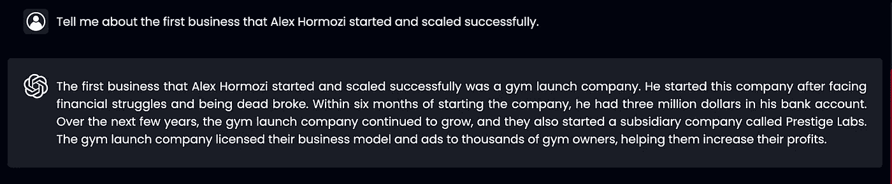

# 使用 LLMs 从 YouTube 学习

> 原文：[`towardsdatascience.com/using-llms-to-learn-from-youtube-4454934ff3e0?source=collection_archive---------1-----------------------#2024-05-21`](https://towardsdatascience.com/using-llms-to-learn-from-youtube-4454934ff3e0?source=collection_archive---------1-----------------------#2024-05-21)


图片由作者使用 Midjourney 制作

## 一个使用 LangChain、Pinecone、Flask、React 和 AWS 构建的对话式问答工具

[](https://medium.com/@suresha?source=post_page---byline--4454934ff3e0--------------------------------)[](https://towardsdatascience.com/?source=post_page---byline--4454934ff3e0--------------------------------) [Alok Suresh](https://medium.com/@suresha?source=post_page---byline--4454934ff3e0--------------------------------)

·发表于[Towards Data Science](https://towardsdatascience.com/?source=post_page---byline--4454934ff3e0--------------------------------) ·阅读时间 17 分钟·2024 年 5 月 21 日

--

# 介绍

你是否曾遇到过想要观看的播客或视频，但因其长度而难以找到时间？你是否希望能有一种简单的方法来回顾该内容的特定部分？

这是我在处理像《CEO 日记》这样的流行播客的 YouTube 视频时经常遇到的问题。实际上，这类播客中涵盖的很多信息，通过快速的 Google 搜索就能轻松找到。但听作者谈论他们对某些话题的看法，或者听一位成功企业家从他们的视角讲述自己的经历，往往能提供更多的见解和清晰度。

受这一问题以及希望自我教育有关 LLM 驱动应用及其开发的愿望的驱动，我决定构建一个聊天机器人，允许用户使用 RAG（检索增强生成）框架询问有关 YouTube 视频内容的问题。在本文的其余部分，我将介绍我使用 LangChain、Pinecone、Flask、React 开发此应用程序，并使用 AWS 进行部署的经验：


> 我将代码片段限制为我认为最有用的那些。对于有兴趣的人，应用程序的完整代码库可以在[这里](https://github.com/suresha97/ChatYTT/tree/main)找到。

# 后端

我们将使用 YouTube 视频的转录文本作为源，从中生成 LLM 对用户定义问题的答案。为了实现这一点，后端需要一种方法来实时检索并适当存储这些文本，以便用于生成答案。同时，我们还需要一种存储聊天历史记录的方法，以便用户能够在后续时间查看。现在，看看如何开发后端以满足所有这些需求。

## 回应生成

由于这是一个对话式问答工具，应用程序必须能够在考虑到相关上下文*和*聊天历史的情况下生成问题的答案。可以通过使用带有对话记忆的检索增强生成（RAG）方法来实现这一点，如下所示：


为了清晰起见，涉及的步骤如下：

1.  **问题总结**：当前问题和聊天历史将通过适当的提示缩减为一个独立的问题，要求 LLM 执行这一操作。

1.  **语义搜索**：接下来，必须检索与简化问题最相关的 YouTube 转录文本块。转录文本本身被存储为嵌入，嵌入是单词和短语的数值表示，由嵌入模型学习，这个模型捕捉它们的内容和语义。在语义搜索过程中，每个转录文本的组件，其嵌入与简化问题的嵌入最为相似，会被检索出来。

1.  **上下文感知生成**：这些检索到的转录文本块随后作为上下文出现在另一个向 LLM 发送的提示中，要求它回答简化后的问题。使用简化问题可以确保生成的答案不仅与当前问题相关，还与用户在对话中先前提出的问题相关。

## 数据管道

在继续实施上述过程之前，让我们先回顾一下 YouTube 视频的转录文本。正如前面讨论的，这些文本必须以嵌入的形式存储，以便在 RAG 过程的语义搜索阶段高效检索和使用它们。现在，让我们一起了解这些转录文本的来源、检索方法和存储方法。

1.  **来源**：YouTube 通过其数据 API 提供视频 ID 等元数据，并提供自动生成的转录文本。首先，我选择了[这个](https://www.youtube.com/watch?v=vOvLFT4v4LQ&list=PL22egh3ok4cOaKRqIt6LwBRXcyiVcS5k2)来自《CEO 日记》播客的播放列表，其中多位财经专家和企业家讨论个人财务、投资以及如何建立成功的企业。

1.  **检索：** 我使用一个类，通过直接与 YouTube 数据 API 交互来[检索 YouTube 视频的元数据](https://github.com/suresha97/ChatYTT/blob/main/chatytt/youtube_data/playlist_data_loader.py)，例如视频 ID；另外一个类则使用 [youtube-transcript-API](https://pypi.org/project/youtube-transcript-api/) Python 包来[获取视频的字幕](https://github.com/suresha97/ChatYTT/blob/main/chatytt/youtube_data/transcript_fetcher.py)。这些字幕随后以原始形式存储为 JSON 文件在 S3 存储桶中。

1.  **存储：** 接下来，字幕需要转换为嵌入并存储到向量数据库中。然而，这一步的前提是将其拆分成若干段，以便在检索时能获取到与每个问题最相关的文本片段，同时尽量减少 LLM 提示本身的长度。为了满足这一要求，我定义了一个自定义的 S3JsonFileLoader 类 [在这里](https://github.com/suresha97/ChatYTT/blob/main/chatytt/embeddings/s3_json_document_loader.py)（由于 LangChain 自带版本存在一些问题），并利用 [文本拆分器对象](https://python.langchain.com/docs/modules/data_connection/document_transformers/recursive_text_splitter) 在加载时拆分字幕。然后，我利用 LangChain 与 Pinecone 向量存储（我选择的高效存储、搜索和检索字幕嵌入的向量存储）接口，将字幕片段作为 OpenAI 的 gpt-3.5-turbo 模型所期望的嵌入进行存储：

```py
import os

import pinecone
from langchain.text_splitter import RecursiveCharacterTextSplitter
from langchain.vectorstores import Pinecone
from langchain.chat_models import ChatOpenAI
from langchain.embeddings.openai import OpenAIEmbeddings

from chatytt.embeddings.s3_json_document_loader import S3JsonFileLoader

# Define the splitter with which to split the transcripts into chunks
text_splitter = RecursiveCharacterTextSplitter(
    chunk_size=pre_processing_conf["recursive_character_splitting"]["chunk_size"],
    chunk_overlap=pre_processing_conf["recursive_character_splitting"][
        "chunk_overlap"
    ],
)

# Load and split the transcript
loader = S3JsonFileLoader(
    bucket="s3_bucket_name",
    key="transcript_file_name",
    text_splitter=text_splitter,
)
transcript_chunks = loader.load(split_doc=True)

# Connect to the relevant Pinecone vectorstore
pinecone.init(
    api_key=os.environ.get("PINECONE_API_KEY"), environment="gcp-starter"
)
pinecone_index = pinecone.Index(os.environ.get("INDEX_NAME"), pool_threads=4)

# Store the transcrpt chunks as embeddings in Pinecone
vector_store = Pinecone(
    index=pinecone_index,
    embedding=OpenAIEmbeddings(),
    text_key="text",
)
vector_store.add_documents(documents=transcript_chunks)
```

我们还可以利用一些 AWS 服务，通过配置定期运行的工作流来自动化这些步骤。我通过将上述提到的三个步骤分别实现为 AWS Lambda 函数（这是一种无服务器计算方式，根据需要在运行时调配和利用资源），并使用 AWS Step Functions（无服务器编排工具）定义它们的执行顺序来实现这一点。然后，使用我设置为每周运行一次的 Amazon EventBridge 调度来执行该工作流，以便自动获取并处理任何新添加到播放列表中的视频：


> 请注意，我已经获得了《CEO 日记》频道的许可，使用上述播放列表中视频的字幕。任何希望以这种方式使用第三方内容的人，都应首先获得原始所有者的许可。

## 实现 RAG

现在，我们的播放列表转录本正在定期被检索、转换为嵌入并存储，我们可以继续实现应用程序的核心后端功能，即使用 RAG 生成用户定义问题的答案的过程。幸运的是，LangChain 提供了一个内置的 ConversationalRetrievalChain 来完成这一任务！所需做的仅仅是将查询、聊天历史、一个可以用来检索转录本片段的向量存储对象以及一个选择的 LLM 传递到这个链中，如下所示：

```py
import pinecone
from langchain.vectorstores import Pinecone
from langchain.chat_models import ChatOpenAI
from langchain.embeddings.openai import OpenAIEmbeddings

# Define the vector store with which to perform a semantic search against
# the Pinecone vector database
pinecone.init(
    api_key=os.environ.get("PINECONE_API_KEY"), environment="gcp-starter"
)
pinecone_index = pinecone.Index(os.environ.get("INDEX_NAME"), pool_threads=4)
vector_store = Pinecone(
    index=pinecone_index,
    embedding=OpenAIEmbeddings(),
    text_key="text",
)

# Define the retrieval chain that will perform the steps in RAG
# with conversation memory as outlined above.
chain = ConversationalRetrievalChain.from_llm(
    llm=ChatOpenAI(), retriever=vector_store.as_retriever()
)

# Call the chain passing in the current question and the chat history
response = chain({"question": query, "chat_history": chat_history})["answer"]
```

> 我还从头实现了这个链的功能，正如 LangChain 的教程中所描述的那样，使用了 LangChain 表达式语言 [这里](https://github.com/suresha97/ChatYTT/blob/main/chatytt/chains/custom/conversational_qa_lcel_chain.py) 和 SequentialChain [这里](https://github.com/suresha97/ChatYTT/blob/main/chatytt/chains/custom/conversational_qa_sequential_chain.py) 。这些可能会提供更多关于在上面的链中发生的所有操作的洞察。

## 保存聊天历史

后端现在可以生成问题的答案，但最好也能存储和检索聊天历史，以便用户可以参考旧的聊天记录。由于这是一个不同用户访问同一项数据的已知访问模式，我决定使用 DynamoDB，这是一个以处理这种形式的非结构化数据的速度和成本效率著称的 NoSQL 数据库。此外，boto3 SDK 简化了与数据库的交互，只需要几个函数来存储和检索数据：

```py
import os
import time
from typing import List, Any

import boto3

table = boto3.resource("dynamodb").Table(os.environ.get("CHAT_HISTORY_TABLE_NAME")

def fetch_chat_history(user_id: str) -> str:
    response = table.get_item(Key={"UserId": user_id})
    return response["Item"]

def update_chat_history(user_id: str, chat_history: List[dict[str, Any]]):
    chat_history_update_data = {
        "UpdatedTimestamp": {"Value": int(time.time()), "Action": "PUT"},
        "ChatHistory": {"Value": chat_history, "Action": "PUT"},
    }
    table.update_item(
        Key={"UserId": user_id}, AttributeUpdates=chat_history_update_data
    )

def is_new_user(user_id: str) -> bool:
    response = table.get_item(Key={"UserId": user_id})
    return response.get("Item") is None

def create_chat_history(user_id: str, chat_history: List[dict[str, Any]]):
    item = {
        "UserId": user_id,
        "CreatedTimestamp": int(time.time()),
        "UpdatedTimestamp": None,
        "ChatHistory": chat_history,
    }
    table.put_item(Item=item)
```

## 通过 API 暴露逻辑

我们现在已经涵盖了所有核心功能，但用户与之交互的应用程序客户端需要某种方式来触发并利用这些过程。为了便于此，每个三大逻辑部分（生成答案、保存聊天历史、检索聊天历史）都通过 Flask API 内部的单独端点暴露，前端将调用这些端点：

```py
from dotenv import load_dotenv
from flask import Flask, request, jsonify
from flask_cors import CORS

from chatytt.chains.standard import ConversationalQAChain
from chatytt.vector_store.pinecone_db import PineconeDB
from server.utils.chat import parse_chat_history
from server.utils.dynamodb import (
    is_new_user,
    fetch_chat_history,
    create_chat_history,
    update_chat_history,
)

load_dotenv()
app = Flask(__name__)

# Enable Cross Origin Resource Sharing since the server and client
# will be hosted seperately
CORS(app)

pinecone_db = PineconeDB(index_name="youtube-transcripts", embedding_source="open-ai")
chain = ConversationalQAChain(vector_store=pinecone_db.vector_store)

@app.route("/get-query-response/", methods=["POST"])
def get_query_response():
    data = request.get_json()
    query = data["query"]

    raw_chat_history = data["chatHistory"]
    chat_history = parse_chat_history(raw_chat_history)
    response = chain.get_response(query=query, chat_history=chat_history)

    return jsonify({"response": response})

@app.route("/get-chat-history/", methods=["GET"])
def get_chat_history():
    user_id = request.args.get("userId")

    if is_new_user(user_id):
        response = {"chatHistory": []}
        return jsonify({"response": response})

    response = {"chatHistory": fetch_chat_history(user_id=user_id)["ChatHistory"]}

    return jsonify({"response": response})

@app.route("/save-chat-history/", methods=["PUT"])
def save_chat_history():
    data = request.get_json()
    user_id = data["userId"]

    if is_new_user(user_id):
        create_chat_history(user_id=user_id, chat_history=data["chatHistory"])
    else:
        update_chat_history(user_id=user_id, chat_history=data["chatHistory"])

    return jsonify({"response": "chat saved"})

if __name__ == "__main__":
    app.run(debug=True, port=8080)
```

最后，我使用 AWS Lambda 将三个端点包装成一个 [单一函数](https://github.com/suresha97/ChatYTT/blob/main/server/lambda_handler.py)，然后通过 API Gateway 资源触发该函数，API Gateway 会根据需要构造适当的负载，将请求路由到正确的端点。这种设置的流程如下所示：


# 前端

在完成应用程序的后端后，我将简要介绍 React 中用户界面的实现，特别关注与包含上述 API 的服务器组件的交互。

我为应用程序的每个部分使用了专用的功能组件，涵盖了在聊天机器人应用程序中可能期望的所有典型需求：

+   一个用于用户输入的容器，并带有发送聊天按钮。

+   一个聊天流，其中显示用户输入和答案。

+   包含聊天历史、一个新聊天按钮和一个保存聊天按钮的侧边栏。

这些组件之间的交互以及数据流的过程如下图所示：


对每个端点的 API 调用及相关变量在客户端状态的变化，都在独立的功能组件中定义：

1.  检索每个问题生成答案的逻辑：

```py
import React from "react";
import {chatItem} from "./LiveChatFeed";

interface Props {
    setCurrentChat: React.SetStateAction<any>
    userInput: string
    currentChat: Array<chatItem>
    setUserInput: React.SetStateAction<any>
}

function getCurrentChat({setCurrentChat, userInput, currentChat, setUserInput}: Props){
    // The current chat is displayed in the live chat feed. Since we don't want
    // to wait for the LLM response before displaying the users question in
    // the chat feed, copy it to a seperate variable and pass it to the current
    // chat before pining the API for the answer.
    const userInputText = userInput
    setUserInput("")
    setCurrentChat([
        ...currentChat,
        {
            "text": userInputText,
            isBot: false
        }
    ])

    // Create API payload for the post request
    const options = {
        method: 'POST',
        headers: {
            "Content-Type": 'application/json',
            'Accept': 'application/json'
        },
        body: JSON.stringify({
            query: userInputText,
            chatHistory: currentChat
        })
    }

    // Ping the endpoint, wait for the response, and add it to the current chat
    // so that it appears in the live chat feed.
    fetch(`${import.meta.env.VITE_ENDPOINT}get-query-response/`, options).then(
        (response) => response.json()
    ).then(
        (data) => {
            setCurrentChat([
                ...currentChat,
                {
                    "text": userInputText,
                    "isBot": false
                },
                {
                    "text": data.response,
                    "isBot": true
                }
            ])
        }
    )
}

export default getCurrentChat
```

2\. 当用户点击保存聊天按钮时，保存聊天历史：

```py
import React, {useState} from "react";
import {chatItem} from "./LiveChatFeed";
import saveIcon from "../assets/saveicon.png"
import tickIcon from "../assets/tickicon.png"

interface Props {
    userId: String
    previousChats: Array<Array<chatItem>>
}

function SaveChatHistoryButton({userId, previousChats}: Props){
    // Define a state to determine if the current chat has been saved or not.
    const [isChatSaved, setIsChatSaved] = useState(false)

    // Construct the payload for the PUT request to save chat history.
    const saveChatHistory = () => {
        const options = {
            method: 'PUT',
            headers: {
                "Content-Type": 'application/json',
                'Accept': 'application/json'
            },
            body: JSON.stringify({
                "userId": userId,
                "chatHistory": previousChats
            })
        }

        // Ping the API with the chat history, and set the state of
        // isChatSaved to true if successful
        fetch(`${import.meta.env.VITE_ENDPOINT}save-chat-history/`, options).then(
            (response) => response.json()
        ).then(
            (data) => {
                setIsChatSaved(true)
            }
        )
    }

    // Display text on the save chat button dynamically depending on the value
    // of the isChatSaved state.
    return (
        <button
            className="save-chat-history-button"
            onClick={() => {saveChatHistory()}}
        > 
        {isChatSaved?"Chats Saved":"Save Chat History"}
        </button>
    )
}

export default SaveChatHistoryButton
```

3\. 当应用程序首次加载时，检索聊天历史：

```py
import React from "react";
import {chatItem} from "./LiveChatFeed";

interface Props {
    userId: String
    previousChats: Array<Array<chatItem>>
    setPreviousChats: React.SetStateAction<any>
}

function getUserChatHistory({userId, previousChats, setPreviousChats}: Props){
    // Create the payload for the GET request
    const options = {
            method: 'GET',
            headers: {
                "Content-Type": 'application/json',
                'Accept': 'application/json'
            }
        }

        // Since this is a GET request pass in the user id as a query parameter
        // Set the previousChats state to the chat history returned by the API.
        fetch(`${import.meta.env.VITE_ENDPOINT}get-chat-history/?userId=${userId}`, options).then(
            (response) => response.json()
        ).then(
            (data) => {
            if (data.response.chatHistory.length > 0) {
                setPreviousChats(
                        [
                            ...previousChats,
                            ...data.response.chatHistory
                        ]
                    )
                }
            }
        )
}

export default getUserChatHistory
```

对于用户界面，我选择了一个与 ChatGPT 界面非常相似的设计，中央是一个聊天流组件，旁边是一个包含聊天历史等支持内容的侧边栏。为了提升用户体验，一些功能包括自动滚动到最近创建的聊天项，以及在登录时加载之前的聊天记录（这些内容我没有在文章中包含，但你可以在相关的功能组件中找到其实现[在这里](https://github.com/suresha97/ChatYTT/tree/main/client/src/components)）。最终的用户界面如下所示：


现在我们已经拥有了一个功能完全的用户界面，剩下的就是将它部署到在线使用，我选择使用 AWS Amplify 来托管。除了其他功能外，Amplify 是一个完全托管的 web 托管服务，它负责资源配置和 web 应用程序的托管。应用程序的用户身份验证由 Amazon Cognito 管理，允许用户注册和登录，同时处理凭证存储和管理：


# 与 ChatGPT 回复的对比

现在我们已经讨论了应用程序构建的过程，让我们深入分析一些问题的回复，并将这些回复与 ChatGPT* 中提出的相同问题进行比较。

请注意，这种类型的比较本质上是不公平的，因为我们应用程序中使用的 LLM 的底层提示将包含额外的上下文（以相关的转录片段形式），这些片段是通过语义搜索步骤获取的。然而，它将帮助我们定性地评估使用 RAG 创建的提示与由相同底层 LLM 生成的回复之间的差异有多大。

**所有 ChatGPT 的回复均来自 gpt-3.5，因为这是应用程序中使用的模型。**

## 示例 1：

你可以通过观看[这个视频](https://www.youtube.com/watch?v=vOvLFT4v4LQ&list=PL22egh3ok4cOaKRqIt6LwBRXcyiVcS5k2&index=1)来了解内容，视频中 Steven Bartlett 与财经作家及投资者 Morgan Housel 进行对话。从视频的标题来看，似乎他反对买房——但假设你没有时间观看完整的视频来找出原因。以下是我在应用程序中询问该问题时得到的对话片段：


你还可以在这里看到对话记忆的实际应用，在后续的问题中，我没有明确提到 Morgan Housel，甚至没有提到“房子”或“购买”这两个词。由于总结的查询会考虑到先前的聊天记录，LLM 的回答反映了之前的问题及其答案。Housel 提到上述观点的部分大约在播客开始一个半小时后，可以在[1:33:00–1:41:00 时间戳](https://youtu.be/vOvLFT4v4LQ?list=PL22egh3ok4cOaKRqIt6LwBRXcyiVcS5k2&t=5586)找到。

我问了 ChatGPT 同样的问题，正如预期的那样，得到了一个非常通用的回答，并没有针对 Housel 的观点进行具体阐述。


可以说，由于该视频是在模型的最后一次“知识更新”之后发布的，因此比较结果可能有偏差，但 Housel 的观点在他 2020 年出版的《金钱心理学》一书中也有详细记录。无论如何，这些对知识更新的依赖进一步突显了基于上下文的答案生成相比独立模型的优势。

## 示例 2

以下是与 Alex Hormozi 的[这次讨论](https://www.youtube.com/watch?v=x3e73Qn6NOo&list=PL22egh3ok4cOaKRqIt6LwBRXcyiVcS5k2&index=4)中的一些片段，Alex Hormozi 是一位货币化和收购专家。从视频标题来看，他似乎对如何成功扩展企业有一定的了解，因此我向他询问了更多的细节：



这个回答看起来合情合理，但让我们看看是否能从同样的问题中提取更多信息。


请注意，LLM 能够从 YouTube 文字记录中提取的细节水平。上述内容可以在视频的 15 到 20 分钟部分找到，大约在[17:00–35:00 时间戳](https://www.youtube.com/watch?v=x3e73Qn6NOo&t=2106s)。

再次，向 ChatGPT 提出相同的问题得到了关于企业家的通用回答，但缺乏视频文字记录中的背景信息细节。


# 部署

最后，我们将讨论在 AWS 上部署每个组件的过程。数据管道、后端和前端分别包含在各自的 CloudFormation 堆栈中（AWS 资源集合）。像这样允许它们独立部署，确保在开发过程中不会不必要地重新部署整个应用。我使用 AWS SAM（无服务器应用模型）将每个组件的基础设施作为代码进行部署，利用 SAM 模板规范和 CLI：

+   SAM 模板规范 — 一种简写语法，作为 AWS CloudFormation 的扩展，用于定义和配置 AWS 资源集合、它们如何交互以及所需的权限。

+   SAM CLI — 一个命令行工具，除了用于构建和部署按照 SAM 模板定义的资源外，还处理应用程序代码和依赖项的打包、将 SAM 模板转换为 CloudFormation 语法，并将模板部署为 CloudFormation 上的单独堆栈。

我不会包含每个组件的完整模板（资源定义），而是将突出每个我们在文章中讨论的服务的具体关注点。

**将敏感环境变量传递给 AWS 资源：**

外部组件，如 Youtube 数据 API、OpenAI API 和 Pinecone API，在整个应用程序中被广泛依赖。虽然可以将这些值硬编码到 CloudFormation 模板中并作为“参数”传递，但更安全的方法是为每个组件在 AWS SecretsManager 中创建密钥，并像这样在模板中引用这些密钥：

```py
Parameters:
  YoutubeDataAPIKey:
    Type: String
    Default: '{{resolve:secretsmanager:youtube-data-api-key:SecretString:youtube-data-api-key}}'
  PineconeAPIKey:
    Type: String
    Default: '{{resolve:secretsmanager:pinecone-api-key:SecretString:pinecone-api-key}}'
  OpenaiAPIKey:
    Type: String
    Default: '{{resolve:secretsmanager:openai-api-key:SecretString:openai-api-key}}'
```

**定义 Lambda 函数：**

这些无服务器代码单元构成了数据管道的骨干，并作为 Web 应用程序后端的入口点。使用 SAM 部署这些代码只需简单地定义当调用函数时应该运行的代码路径，以及任何所需的权限和环境变量。以下是数据管道中使用的一个函数示例：

```py
FetchLatestVideoIDsFunction:
    Type: AWS::Serverless::Function
    Properties:
      CodeUri: ../code_uri/.
      Handler: chatytt.youtube_data.lambda_handlers.fetch_latest_video_ids.lambda_handler
      Policies:
        - AmazonS3FullAccess
      Environment:
        Variables:
          PLAYLIST_NAME:
            Ref: PlaylistName
          YOUTUBE_DATA_API_KEY:
            Ref: YoutubeDataAPIKey
```

**检索数据管道在 Amazon States Language 中的定义：**

为了使用 Step Functions 作为数据管道中各个 Lambda 函数的协调器，我们需要定义每个函数执行的顺序，以及诸如最大重试次数等配置项。一个简单的方法是使用 Step Functions 控制台中的 [工作流工作室](https://docs.aws.amazon.com/step-functions/latest/dg/workflow-studio.html)以图形化方式创建工作流，然后将自动生成的 ASL 工作流定义作为起点进行适当修改。然后可以在 CloudFormation 模板中链接它，而不是在模板中直接定义：

```py
EmbeddingRetrieverStateMachine:
  Type: AWS::Serverless::StateMachine
  Properties:
    DefinitionUri: statemachine/embedding_retriever.asl.json
    DefinitionSubstitutions:
      FetchLatestVideoIDsFunctionArn: !GetAtt FetchLatestVideoIDsFunction.Arn
      FetchLatestVideoTranscriptsArn: !GetAtt FetchLatestVideoTranscripts.Arn
      FetchLatestTranscriptEmbeddingsArn: !GetAtt FetchLatestTranscriptEmbeddings.Arn
    Events:
      WeeklySchedule:
        Type: Schedule
        Properties:
          Description: Schedule to run the workflow once per week on a Monday.
          Enabled: true
          Schedule: cron(0 3 ? * 1 *)
    Policies:
    - LambdaInvokePolicy:
        FunctionName: !Ref FetchLatestVideoIDsFunction
    - LambdaInvokePolicy:
        FunctionName: !Ref FetchLatestVideoTranscripts
    - LambdaInvokePolicy:
        FunctionName: !Ref FetchLatestTranscriptEmbeddings
```

查看 [此处](https://github.com/suresha97/ChatYTT/blob/main/deploy/chatytt-workflows/statemachine/embedding_retriever.asl.json) 查阅本文章中讨论的数据管道使用的 ASL 定义。

**定义 API 资源：**

由于 Web 应用程序的 API 将与前端分开托管，因此在定义 API 资源时，我们必须启用 CORS（跨源资源共享）支持：

```py
ChatYTTApi:
    Type: AWS::Serverless::Api
    Properties:
      StageName: Prod
      Cors:
        AllowMethods: "'*'"
        AllowHeaders: "'*'"
        AllowOrigin: "'*'"
```

这将允许这两个资源相互自由通信。通过 Lambda 函数使得可访问的各种端点可以这样定义：

```py
ChatResponseFunction:
    Type: AWS::Serverless::Function
    Properties:
      Runtime: python3.9
      Timeout: 120
      CodeUri: ../code_uri/.
      Handler: server.lambda_handler.lambda_handler
      Policies:
        - AmazonDynamoDBFullAccess
      MemorySize: 512
      Architectures:
        - x86_64
      Environment:
        Variables:
          PINECONE_API_KEY:
            Ref: PineconeAPIKey
          OPENAI_API_KEY:
            Ref: OpenaiAPIKey
      Events:
        GetQueryResponse:
          Type: Api
          Properties:
            RestApiId: !Ref ChatYTTApi
            Path: /get-query-response/
            Method: post
        GetChatHistory:
          Type: Api
          Properties:
            RestApiId: !Ref ChatYTTApi
            Path: /get-chat-history/
            Method: get
        UpdateChatHistory:
          Type: Api
          Properties:
            RestApiId: !Ref ChatYTTApi
            Path: /save-chat-history/
            Method: put
```

**定义 React 应用资源：**

AWS Amplify 可以使用对相关 Github 仓库的引用和适当的访问令牌来构建和部署应用程序：

```py
AmplifyApp:
    Type: AWS::Amplify::App
    Properties:
      Name: amplify-chatytt-client
      Repository: <https://github.com/suresha97/ChatYTT>
      AccessToken: '{{resolve:secretsmanager:github-token:SecretString:github-token}}'
      IAMServiceRole: !GetAtt AmplifyRole.Arn
      EnvironmentVariables:
        - Name: ENDPOINT
          Value: !ImportValue 'chatytt-api-ChatYTTAPIURL'
```

一旦仓库本身可访问，Amplify 将查找一个包含构建和部署应用程序指令的配置文件：

```py
version: 1
frontend:
  phases:
    preBuild:
      commands:
        - cd client
        - npm ci
    build:
      commands:
        - echo "VITE_ENDPOINT=$ENDPOINT" >> .env
        - npm run build
  artifacts:
    baseDirectory: ./client/dist
    files:
      - "**/*"
  cache:
    paths:
      - node_modules/**/*
```

作为一个附加功能，还可以通过定义一个分支资源来自动化持续部署过程，这个资源会被监控，并在进一步提交时自动重新部署应用：

```py
AmplifyBranch:
    Type: AWS::Amplify::Branch
    Properties:
      BranchName: main
      AppId: !GetAtt AmplifyApp.AppId
      EnableAutoBuild: true
```

通过这种方式完成部署后，任何拥有 AWS Amplify 控制台提供的链接的人都可以访问它。可以在[这里](https://github.com/suresha97/ChatYTT/blob/main/docs/Screen-2023-12-21-180035.mp4)找到一个应用被访问的演示录制：

# 结论

从高层次看，我们已经涵盖了以下步骤：

+   构建一个用于收集和存储内容作为嵌入的 数据管道。

+   开发一个后台服务器组件，执行带有对话记忆的检索增强生成。

+   设计一个用户界面，用于展示生成的答案和聊天历史。

+   这些组件如何连接并部署以创建一个能够提供价值并节省时间的解决方案。

我们已经看到，像这样的应用程序如何被用来简化并在某些方面“优化”像 YouTube 视频这样的内容在学习和发展中的消费。但这些方法同样可以轻松地应用于工作场所的内部使用或增强面向客户的解决方案。这也是为什么大语言模型（LLM）及特别是 RAG 技术在许多组织中获得如此多关注的原因。

我希望这篇文章能够为如何将这些相对较新的技术与更多传统的工具和框架结合使用，在开发面向用户的应用程序中提供一些见解。

# 致谢

我要感谢《CEO 日记》团队，感谢他们允许在本项目中使用来自这个[播放列表](https://www.youtube.com/playlist?list=PL22egh3ok4cOaKRqIt6LwBRXcyiVcS5k2)的视频转录内容，并为撰写本文提供支持。

所有图片，除非另有注明，均由作者提供。
