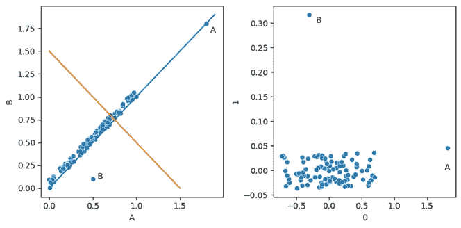
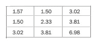
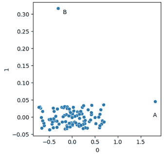

# 使用 PCA 进行异常值检测简介

> 原文：[`towardsdatascience.com/using-pca-for-outlier-detection-afecab4d2b78?source=collection_archive---------1-----------------------#2024-10-22`](https://towardsdatascience.com/using-pca-for-outlier-detection-afecab4d2b78?source=collection_archive---------1-----------------------#2024-10-22)

## 一种出乎意料的有效方法，用于识别数值数据中的异常值

[](https://medium.com/@wkennedy934?source=post_page---byline--afecab4d2b78--------------------------------)[](https://towardsdatascience.com/?source=post_page---byline--afecab4d2b78--------------------------------) [W·布雷特·肯尼迪](https://medium.com/@wkennedy934?source=post_page---byline--afecab4d2b78--------------------------------)

·发表于[Towards Data Science](https://towardsdatascience.com/?source=post_page---byline--afecab4d2b78--------------------------------) ·14 分钟阅读·2024 年 10 月 22 日

--

PCA（主成分分析）在数据科学中广泛应用，通常用于降维（并且经常用于可视化），但实际上它对于异常值检测也非常有用，我将在本文中描述这一点。

本文是我关于异常值检测系列的继续，系列中还包括关于 FPOF、计数异常值检测器、距离度量学习、共享最近邻和掺杂的相关文章。此外，还包括我书中的另一个摘录——《Python 中的异常值检测》[Outlier Detection in Python](https://www.manning.com/books/outlier-detection-in-python)。

PCA 背后的思想是，大多数数据集在某些列中具有比其他列更大的方差，并且特征之间通常存在相关性。由此可得的一个含义是：为了表示数据，我们通常不需要使用所有的特征；我们可以使用更少的特征来很好地近似数据——有时甚至是远远少于原始特征数量。举个例子，假设我们有一张包含 100 个特征的数值数据表，我们可能能够用 30 或 40 个特征（甚至更少）来合理地表示这些数据，可能会远远少于原特征数量。

为了实现这一点，PCA 将数据转换到一个不同的坐标系统中，其中的维度被称为*主成分*。

鉴于我们常常面临由于维度灾难导致的异常值检测问题，处理更少的特征可能非常有利。如在[共享最近邻](https://example.org/shared-nearest-neighbors-a-more-robust-distance-metric-064d7f99ffb7)和[距离度量学习用于异常值检测](https://example.org/distance-metric-learning-for-outlier-detection-5b4840d01246)中所述，处理大量特征会使得异常值检测变得不可靠；高维数据的一个问题是，它会导致点与点之间的距离计算不准确（许多异常值检测器依赖此计算）。PCA 可以减轻这些影响。

同时，令人惊讶的是，使用 PCA 通常会创造出一个异常值更容易被检测的情况。PCA 转换往往会重新塑造数据，使得任何异常点更容易被识别。

这里展示了一个示例。

```py
import numpy as np
import pandas as pd
from sklearn.decomposition import PCA

# Create two arrays of 100 random values, with high correlation between them
x_data = np.random.random(100) 
y_data = np.random.random(100) / 10.0

# Create a dataframe with this data plus two additional points
data = pd.DataFrame({'A': x_data, 'B': x_data + y_data}) 
data= pd.concat([data, 
   pd.DataFrame([[1.8, 1.8], [0.5, 0.1]], columns=['A', 'B'])])

# Use PCA to transform the data to another 2D space
pca = PCA(n_components=2) 
pca.fit(data)
print(pca.explained_variance_ratio_)

# Create a dataframe with the PCA-transformed data
new_data = pd.DataFrame(pca.transform(data), columns=['0', '1'])
```

这首先创建了原始数据，如左侧窗格所示。然后，它使用 PCA 进行转换。一旦完成，我们就得到了新的数据空间，如右侧窗格所示。



这里我创建了一个简单的合成数据集，数据高度相关。数据中有两个异常值，一个遵循一般模式，但极端（点 A），另一个在每个维度上有典型值，但不遵循一般模式（点 B）。

然后，我们使用 scikit-learn 的 PCA 类来转换数据。其输出被放入另一个 pandas 数据框中，之后可以进行绘图（如所示），或者检查异常值。

查看原始数据时，数据倾向于沿对角线分布。从左下角到右上角画一条线（图中的蓝线），我们可以创建一个新的单一维度，很好地表示数据。事实上，执行 PCA 时，这将是第一个主成分，与其正交的线（橙色线，也显示在左侧窗格中）则是第二个主成分，表示剩余的方差。

对于更现实的数据，我们通常不会有如此强的线性关系，但几乎总会有一些特征之间的关联——特征完全独立是很少见的。鉴于此，PCA 通常是减少数据集维度的有效方法。也就是说，虽然通常需要使用所有主成分来完全描述每个项目，但仅使用一部分主成分通常就能充分描述每条记录（或几乎每条记录）。

右侧窗格显示了 PCA 转换后新空间中的数据，第一个主成分（捕捉了大部分方差）位于 x 轴上，第二个主成分（捕捉剩余方差）位于 y 轴上。在二维数据的情况下，PCA 转换将只是旋转并拉伸数据。对于更高维度的数据，转换较难可视化，但工作原理类似。

打印解释方差（上面的代码中包括一个打印语句来显示这一点）表明组件 0 包含了 0.99 的方差，而组件 1 包含了 0.01，这与图表非常匹配。

通常会逐个检查每个组件（例如作为直方图），但在这个例子中，我们使用散点图，这样可以一次查看两个组件，节省空间。异常值在这两个组件中作为极端值明显突出。

更仔细地看一下 PCA 的工作细节，它首先找到一条最能描述数据的直线。这是所有点到该直线的平方距离最小的直线。这就是第一个组件。然后，过程会找到一条与这条直线正交的直线，最好地捕捉剩余的方差。这个数据集只有两个维度，因此第二个组件的方向只有一个选择，即与第一个组件垂直。

当原始数据中有更多维度时，这个过程将继续若干额外的步骤：直到数据中的所有方差被捕捉为止，这将创建与原始数据维度数量相同的组件。鉴于此，PCA 具有三个特性：

+   所有组件都是不相关的。

+   第一个组件具有最多的变异性，第二个组件次之，依此类推。

+   组件的总方差等于原始特征的方差。

PCA 还有一些有助于异常值检测的良好特性。正如我们在图中看到的，异常值在组件内被很好地分离开来，这使得简单的测试可以识别它们。

我们还可以看到 PCA 转换的另一个有趣结果：符合一般模式的点往往会落在早期的组件上，但可能在这些组件中表现为极端值（如点 A），而不符合数据一般模式的点则往往不会落在主要组件上，而是在后续组件中成为极端值（如点 B）。

使用 PCA 识别异常值有两种常见方法：

+   我们可以使用 PCA 转换数据，然后使用一组测试（方便的是，这些测试通常非常简单）对每个组件进行评分，逐行评估。这非常简单，容易编码实现。

+   我们可以查看重建误差。在图中，我们可以看到仅使用第一个主成分就能很好地描述大多数数据。第二个主成分对于完整描述所有数据是必要的，但通过仅将数据投影到第一个主成分上，我们可以合理地描述大部分数据的位置。例外的是点 B；它在第一个主成分上的位置并不能很好地描述它的完整位置，若仅使用单一主成分来描述该点，会出现较大的重建误差，尽管其他点没有这个问题。一般来说，需要更多主成分来描述一个点的位置较好（或者在固定数量主成分的情况下，误差较大），则该点是一个离群点的可能性越强。

另一种方法是逐行删除数据，找出哪些行对最终 PCA 计算影响最大。虽然这种方法效果不错，但通常较慢，且不常使用。我可能会在未来的文章中讨论这个方法，但本文将关注重建误差，下一篇文章将讨论如何对 PCA 主成分进行简单测试。

重建误差是离群点检测中常见的一种通用方法示例。我们以某种方式对数据进行建模，以捕捉数据中的主要模式（例如，使用频繁项集、聚类、创建预测模型来预测各列的值等）。这些模型通常能很好地拟合大多数数据，但往往无法很好地拟合离群点。离群点通常是那些无法很好地融入模型的记录。它们可能是没有被频繁项集很好表示的记录，无法融入任何一个聚类，或是无法通过其他列的值很好地预测的记录。在这种情况下，离群点是那些没有被主要（第一个）PCA 主成分很好表示的记录。

# PCA 在离群点检测中的假设

PCA 假设特征之间存在相关性。上述数据可以通过转换，使得第一主成分比第二主成分捕捉到更多的方差，因为数据是相关的。对于特征之间没有关联的离群点检测，PCA 提供的价值较小，但考虑到大多数数据集之间具有显著的相关性，PCA 通常适用。基于此，我们通常可以找到一个合理的小数量的主成分，捕捉数据集中大部分的方差。

与其他常见的离群点检测技术相似，包括椭圆包络方法、高斯混合模型和马氏距离计算，PCA 通过创建一个协方差矩阵来工作，该矩阵表示数据的一般形状，然后用于转换空间。事实上，椭圆包络方法、马氏距离和 PCA 之间有很强的对应关系。

协方差矩阵是一个 d x d 的矩阵（其中 d 是数据中特征或维度的数量），它存储了每对特征之间的协方差，每个特征的方差存储在主对角线上（即每个特征与自身的协方差）。协方差矩阵与数据中心一起，提供了数据的简明描述——也就是说，每个特征的方差以及特征之间的协方差，通常是数据的一个非常好的描述。

一个具有三个特征的数据集的协方差矩阵可能如下所示：



三个特征的数据集的示例协方差矩阵

这里显示的是三个特征的方差，位于主对角线：1.57、2.33 和 6.98。我们还可以看到每个特征之间的协方差。例如，第 1 个和第 2 个特征之间的协方差是 1.50。矩阵在主对角线对称，因为第 1 个和第 2 个特征之间的协方差与第 2 个和第 1 个特征之间的协方差相同，依此类推。

Scikit-learn（以及其他包）提供了可以计算任意给定数值数据集的协方差矩阵的工具，但使用本文及下一篇文章中描述的技术，直接计算协方差矩阵并不是必须的。在本文中，我们将查看一个名为[PyOD](https://github.com/yzhao062/pyod)的流行异常值检测包所提供的工具（它可能是目前 Python 中最完整、最常用的表格数据异常值检测工具）。这些工具为我们处理了 PCA 变换以及异常值检测。

# PCA 在异常值检测中的局限性

PCA 的一个局限性是，它对异常值敏感。PCA 基于最小化点到主成分的平方距离，因此会受到异常值的强烈影响（远离点的平方距离可能非常大）。为了解决这个问题，*稳健 PCA*通常会被使用，在执行变换之前，会先移除每个维度中的极值。下面的示例包括了这一点。

PCA 的另一个局限性（以及马哈拉诺比斯距离和类似方法）是，如果相关性仅存在于数据的某些区域，当数据呈簇状分布时，这种情况往往会发生。在数据聚类良好的情况下，可能需要先对数据进行聚类（或分段），然后再对每个数据子集执行 PCA。

# 基于 PCA 的异常值检测测试

现在我们已经了解了 PCA 的工作原理，并大致了解了它如何应用于异常值检测，我们可以看看 PyOD 提供的检测器。

PyOD 实际上提供了三种基于 PCA 的类：PyODKernelPCA、PCA 和 KPCA。我们将逐一了解这些类。

## PyODKernelPCA

PyOD 提供了一个名为 PyODKernelPCA 的类，它实际上是 scikit-learn 的 KernelPCA 类的封装。在不同情况下，使用这两者中的任何一个都可能更方便。它本身并不是一个离群点检测器，仅提供 PCA 变换（及其逆变换），类似于在前面示例中使用的 scikit-learn 的 PCA 类。

KernelPCA 类与 PCA 类不同，KernelPCA 允许对数据进行非线性转换，并且可以更好地建模一些更复杂的关系。在这种情况下，核函数的作用与 SVM 模型中的作用相似：它们以一种非常高效的方式变换空间，使得离群点能够更容易地被分离。

Scikit-learn 提供了几种核函数。虽然这些超出了本文的范围，但在特征之间存在复杂的非线性关系时，它们可以改进 PCA 过程。如果使用这些核函数，离群点检测将有效，否则，与使用 PCA 类时相同。也就是说，我们可以直接在变换后的空间上运行离群点检测测试，或者测量重建误差。

前一种方法，在变换后的空间上进行测试，是相当直接且有效的。我们将在下一篇文章中更详细地讨论这一点。后一种方法，检查重建误差，则稍显复杂。它并不是完全无法处理，但我们接下来要讨论的 PyOD 提供的两个检测器可以为我们处理大部分工作。

## PCA 检测器

PyOD 提供了两种基于 PCA 的离群点检测器：PCA 类和 KPCA。后者与 PyODKernelPCA 类似，允许核函数处理更复杂的数据。PyOD 推荐在数据包含线性关系时使用 PCA 类，而在数据包含非线性关系时使用 KPCA。

这两个类使用数据的重建误差，利用点到超平面的欧几里得距离，这个超平面是用前 k 个组件构建的。这个想法再次是，前 k 个组件能够很好地捕捉数据的主要模式，而任何没有被这些组件很好建模的点就是离群点。

在上面的图中，这种方法不能捕捉到 A 点，但可以捕捉到 B 点。如果我们将 k 设置为 1，我们只会使用一个组件（第一个组件），并且会测量每个点从其实际位置到该组件上位置的距离。B 点的距离会很大，因此可以标记为离群点。

与一般的 PCA 一样，最好在拟合数据之前去除任何明显的离群点。在下面的例子中，我们使用了 PyOD 提供的另一种检测器，叫做 ECOD（经验累积分布函数）。ECOD 是一个你可能不太熟悉的检测器，但它是一个非常强大的工具。事实上，PyOD 建议在为项目选择检测器时，从 Isolation Forest 和 ECOD 开始。

ECOD 超出了本文的范围，相关内容可以在[《Python 中的异常值检测》](https://www.manning.com/books/outlier-detection-in-python)一书中找到，PyOD 也提供了原始期刊论文的链接。不过，简单概括：ECOD 基于经验累积分布，旨在找到数值列中的极端（非常小和非常大）值。它不会检查值的稀有组合，只检测极端值。因此，它无法找到所有的异常值，但它速度较快，并且非常擅长找到这种类型的异常值。在此案例中，我们在拟合 PCA 检测器之前，移除了 ECOD 标识的前 1%行。

一般来说，在执行异常值检测时（不仅仅是使用 PCA 时），最好先清理数据，在异常值检测的上下文中，通常指的是移除任何强异常值。这可以让异常值检测器在更典型的数据上进行训练，从而更好地捕捉数据中的强模式（这样它就能更好地识别这些强模式的例外情况）。在这个案例中，清理数据允许在更典型的数据上进行 PCA 计算，从而更好地捕捉数据的主要分布。

在执行之前，必须安装 PyOD，可以使用以下命令进行安装：

```py
pip install pyod
```

这里的代码使用了来自 OpenML 的[speech](https://www.openml.org/search?type=data&sort=version&status=any&order=asc&exact_name=Speech&id=40910)数据集（公共许可），该数据集包含 400 个数值特征。任何数值数据集都可以使用（任何类别列需要进行编码）。此外，一般来说，所有数值特征都需要进行缩放，以便它们处于相同的量纲下（此处为了简洁省略了，因为所有特征使用了相同的编码）。

```py
import pandas as pd
from pyod.models.pca import PCA
from pyod.models.ecod import ECOD
from sklearn.datasets import fetch_openml

#A Collects the data
data = fetch_openml("speech", version=1, parser='auto') 
df = pd.DataFrame(data.data, columns=data.feature_names)
scores_df = df.copy()

# Creates an ECOD detector to clean the data
clf = ECOD(contamination=0.01) 
clf.fit(df)
scores_df['ECOD Scores'] = clf.predict(df)

# Creates a clean version of the data, removing the top 
# outliers found by ECOD
clean_df = df[scores_df['ECOD Scores'] == 0] 

# Fits a PCA detector to the clean data
clf = PCA(contamination=0.02) 
clf.fit(clean_df)

# Predicts on the full data
pred = clf.predict(df) 
```

执行此操作后，pred 变量将包含数据中每条记录的异常值得分。

## KPCA 检测器

KPCA 检测器的工作方式与 PCA 检测器非常相似，不同之处在于对数据应用了指定的核。这可以显著地改变数据。两个检测器可能标记非常不同的记录，而且由于两者的可解释性较差，可能很难确定原因。像异常值检测一样，可能需要一些实验来确定哪个检测器和参数最适合你的数据。由于两者都是强大的检测器，使用两者结合可能也会很有用。最好的检测器和参数（以及如何使用它们）可能可以通过[《Doping：一种测试异常值检测器的技术》](https://medium.com/towards-data-science/doping-a-technique-to-test-outlier-detectors-3f6b847ab8d4)中的方法来确定。

要创建一个使用线性核的 KPCA 检测器，我们可以使用如下代码：

```py
det = KPCA(kernel='linear')
```

KPCA 还支持多项式、径向基函数、Sigmoid 和余弦核。

# 结论

在本文中，我们讨论了 PCA 背后的理念以及它如何帮助异常值检测，特别是查看 PCA 转换数据上的标准异常值检测测试和重构误差。我们还查看了 PyOD 提供的两个基于 PCA 的异常值检测器（都使用重构误差），PCA 和 KPCA，并提供了使用前者的示例。

基于 PCA 的异常值检测可以非常有效，但确实存在可解释性差的问题。PCA 和 KPCA 检测器产生的异常值非常难以理解。

实际上，即使使用可解释的异常值检测器（例如计数异常值检测器，或者基于 z-score 或四分位距的检测方法），在 PCA 转换后的数据上（正如我们将在下一篇文章中看到的那样），异常值也可能难以理解，因为 PCA 转换本身（以及它生成的主成分）几乎是无法解释的。不幸的是，这是异常值检测中的一个常见主题。用于异常值检测的其他主要工具，包括隔离森林、局部异常因子（LOF）、k 近邻（KNN）等，基本上也是黑箱（它们的算法容易理解——但给每个记录分配的具体分数可能很难理解）。

在上面的二维示例中，当查看 PCA 转换后的空间时，可以很容易看出点 A 和点 B 是异常值，但很难理解作为坐标轴的两个主成分。



在需要可解释性的情况下，可能无法使用基于 PCA 的方法。然而，在不需要可解释性的情况下，基于 PCA 的方法可以非常有效。而且，PCA 的可解释性并不低于大多数异常值检测器；不幸的是，只有少数异常值检测器提供了较高的可解释性。

在下一篇文章中，我们将进一步探讨如何在 PCA 转换后的空间上进行测试。这包括简单的单变量测试，以及其他标准的异常值检测器，考虑到所需的时间（包括 PCA 转换、模型拟合和预测）以及准确性。使用 PCA 通常可以提高异常值检测的速度、内存使用效率和准确性。

所有图片均由作者提供
