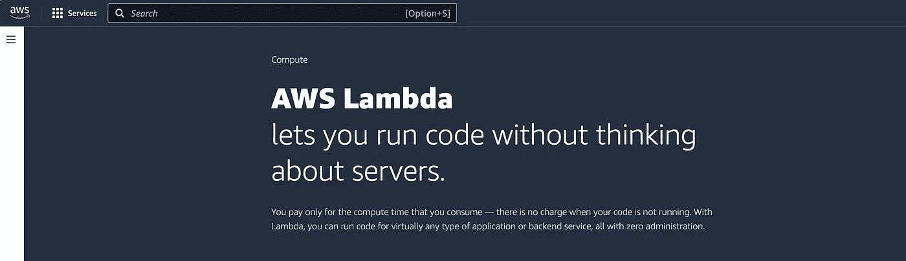
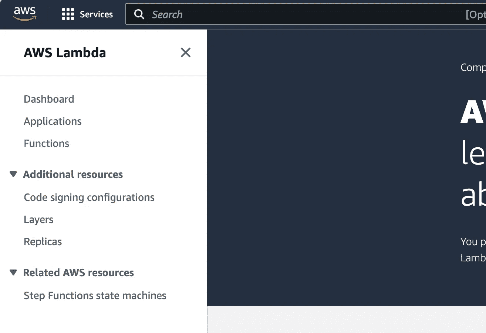
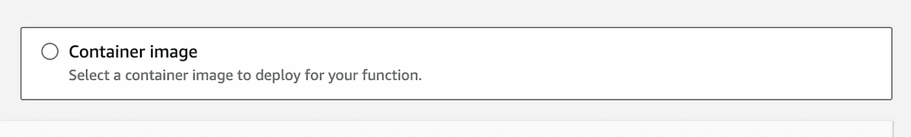
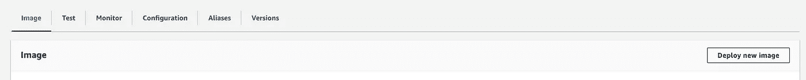
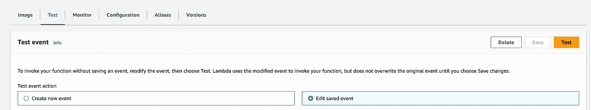

# 使用 Poetry 和 Docker 将你的模型打包为 AWS Lambda 适用格式

> 原文：[`towardsdatascience.com/using-poetry-and-docker-to-package-your-model-for-aws-lambda-cd6d448eb88f?source=collection_archive---------1-----------------------#2024-01-29`](https://towardsdatascience.com/using-poetry-and-docker-to-package-your-model-for-aws-lambda-cd6d448eb88f?source=collection_archive---------1-----------------------#2024-01-29)

## 这是一个可访问的教程，介绍了一种将模型投入生产的方法，特别关注过程中可能遇到的故障排除和问题。

[](https://medium.com/@s.kirmer?source=post_page---byline--cd6d448eb88f--------------------------------)[](https://towardsdatascience.com/?source=post_page---byline--cd6d448eb88f--------------------------------) [Stephanie Kirmer](https://medium.com/@s.kirmer?source=post_page---byline--cd6d448eb88f--------------------------------)

·发表于 [Towards Data Science](https://towardsdatascience.com/?source=post_page---byline--cd6d448eb88f--------------------------------) ·阅读时间 10 分钟·2024 年 1 月 29 日

--


我喜欢把模型看作是小小的生物。照片由 [Jiawei Zhao](https://unsplash.com/@jiaweizhao?utm_source=medium&utm_medium=referral) 提供，来源于 [Unsplash](https://unsplash.com/?utm_source=medium&utm_medium=referral)

正如承诺的，这一周我将带来一个更为技术性的主题，稍微休息一下之前讨论的商业话题。我最近有机会使用 AWS Lambda 部署一个新模型，并且在将我常用的开发工具（Poetry）与 Lambda 基础设施结合时学到了一些东西。（特别感谢我的队友 Aaron 教我新知识！）我将逐步讲解如何将一个本地训练的模型成功部署到 Lambda，尤其是那些不太明显的步骤。

> 对于那些对模型开发的细节不感兴趣的常读者，不用担心，下次我会回到关于社会问题和机器学习的讨论！

# 设置你的模型架构

如果你还没有选择偏好的 Python 包管理器/环境管理器工具，那么让我推荐一下 Poetry。我花了一些时间才入门并掌握它，但现在已经使用了几年，成了它的忠实粉丝。有些人偏好 venv 或其他更简洁的工具，这也是可以的，但我认为 Poetry 有一些很不错的附加功能，值得一试。（如果你对 Poetry 没有任何经验，请访问官方文档 [`python-poetry.org/`](https://python-poetry.org/)，它们可以帮助你进行设置。）

我想强调的一个卖点是，Poetry 使得将项目打包变得非常容易，这样你创建的内部模块就可以不需要太多麻烦地被调用。这意味着你不需要再和“Python 说那个模块不存在”的问题作斗争，我敢肯定我们许多人都对这种情况感到熟悉。

这里嵌入的示例仅仅是一个类似于这个项目的`pyproject.toml`文件的头部——请注意那行以`packages`开头的内容，它告诉这个环境包含我正在创建的包并将其导入。这使得我可以在项目内部的任何地方调用类似`from new_package.tools import stuff`的内容，即使这些内容不在直接的父目录中或其他地方。

```py
[tool.poetry]
name = "new_package"
version = "0.1.0"
description = "What this package is gonna do"
authors = [
    "Stephanie Kirmer <stephanie@stephaniekirmer.com>",
]

packages = [{ include = "new_package"}]
include = [{ path = "tests", format = "sdist" }]

[build-system]
requires = ["poetry-core>=1.0.0"]
build-backend = "poetry.core.masonry.api"

# Requirements
[tool.poetry.dependencies]
python = ">=3.9, <4.0"
```

假设你已经被 Poetry 说服，那么你可以用它来定义你的环境并管理所有的依赖项，你将在这个项目内部开发模型及其管道。去吧，构建并训练你的模型，等那部分完成后再回来。我等你。

好的，欢迎回来！因为你知道你将通过 Docker 在 Lambda 中部署这个模型，这决定了你的推理管道应该如何构建。

你需要构建一个“处理器”。这究竟是什么？它只是一个接受传递给 Lambda 的 JSON 对象的函数，并返回你模型的结果，仍然是一个 JSON 负载。因此，你的推理管道将要做的所有事情都需要在这个函数内部调用。

对于我的项目，我有一个完整的特征工程函数代码库：包括语义嵌入、大量聚合、正则表达式等等。我已经将它们整合到了一个`FeatureEngineering`类中，这个类有许多私有方法，但只有一个公共方法，`feature_eng`。因此，从传递给模型的 JSON 开始，这个方法可以运行所有步骤，将数据从“原始”转换为“特征”。我喜欢以这种方式设置，因为它将很多复杂性从处理函数本身抽象了出来。我实际上可以这样调用：

```py
fe = FeatureEngineering(input=json_object)
processed_features = fe.feature_eng()
```

然后，我就开始工作了，我的特征数据整洁且准备好使用。

> 请注意：我已经对这个类的所有内部实现编写了详尽的单元测试，因为虽然以这种方式编写代码很整洁，但我仍然需要非常小心任何可能在后台发生的变化。编写单元测试！如果你做了一个小小的改变，你可能无法立即发现你破坏了管道中的某些内容，直到它已经开始引发问题。

后半部分是推理工作，在我的情况下这是一个单独的类。我采用了一个非常类似的方法，它只需要几个参数。

```py
ps = PredictionStage(features=processed_features)
predictions = ps.predict(
    feature_file="feature_set.json",
    model_file="classifier",
)
```

类初始化接受特征工程类方法的结果，从而清晰地定义了握手过程。接着，预测方法接受两个参数：特征集（一个列出所有特征名称的 JSON 文件）和模型对象，在我的案例中是我已经训练并保存的 CatBoost 分类器。我使用的是原生的 CatBoost 保存方法，但无论你使用什么方法和模型算法都可以。关键是这个方法抽象了大量底层操作，整洁地返回了`predictions`对象，这就是我的 Lambda 在运行时会返回给你的内容。

总结一下，我的“处理函数”基本上就是这样：

```py
def lambda_handler(json_object, _context):

  fe = FeatureEngineering(input=json_object)
  processed_features = fe.feature_eng()

  ps = PredictionStage(features=processed_features)
  predictions = ps.predict(
      feature_file="feature_set.json",
      model_file="classifier",
  )

  return predictions.to_dict("records")
```

就这么简单！你可能需要为格式错误的输入添加一些控制措施，以防你的 Lambda 收到空 JSON、列表或其他奇怪的数据，但这不是必需的。然而，确保输出是 JSON 或类似格式的（在这里我返回的是一个字典）。

# 构建你的 Docker 镜像

一切都很棒，我们有一个带有完全定义的环境和所有依赖项的 Poetry 项目，还能够加载我们创建的模块等。很不错。但现在我们需要将其转换成一个 Docker 镜像，以便可以放到 AWS 上。

在这里，我展示了适用于此情况的 dockerfile 框架。首先，我们从 AWS 拉取正确的 Lambda 基础镜像。接着，我们需要设置 Docker 镜像内部将使用的文件结构。这可能与您在 Poetry 项目中的结构完全相同——但我这里的结构并不完全一样，因为我这里有一些额外的无关代码，包括我的训练代码。我只需要将推理相关的内容放入该镜像即可。

*dockerfile 的开始部分*

```py
FROM public.ecr.aws/lambda/python:3.9

ARG YOUR_ENV
ENV NLTK_DATA=/tmp
ENV HF_HOME=/tmp 
```

在这个项目中，任何你复制过来的内容都会存放在 `/tmp` 文件夹中，因此如果你的项目中有包会在任何时刻尝试保存数据，你需要确保它们保存到正确的位置。

你还需要确保 Poetry 在你的 Docker 镜像中正确安装——这将使你精心挑选的所有依赖项正常工作。在这里，我设置了版本并告诉 `pip` 在继续之前安装 Poetry。

```py
ENV YOUR_ENV=${YOUR_ENV} \
  POETRY_VERSION=1.7.1
ENV SKIP_HACK=true

RUN pip install "poetry==$POETRY_VERSION" 
```

接下来的问题是确保你的项目在本地使用的所有文件和文件夹都被正确地添加到这个新镜像中——Docker 的复制操作有时会将目录扁平化，所以如果你构建完成后遇到“找不到模块”的问题，检查一下是否发生了这种情况。提示：在所有内容复制到镜像后，可以在 dockerfile 中添加 `RUN ls -R` 来查看目录结构。你可以在 Docker 中查看这些日志，可能会揭示任何问题。

另外，确保你复制了所有需要的文件！这包括 Lambda 文件、Poetry 文件、特征列表文件和模型。除非你将这些文件存储在其他地方，比如 S3，并让 Lambda 动态下载它们，否则这些都是必需的。（这对于开发像这样的东西来说是完全合理的策略，但不是我们今天要做的事情。）

```py
WORKDIR ${LAMBDA_TASK_ROOT}

COPY /poetry.lock ${LAMBDA_TASK_ROOT}
COPY /pyproject.toml ${LAMBDA_TASK_ROOT}
COPY /new_package/lambda_dir/lambda_function.py ${LAMBDA_TASK_ROOT}
COPY /new_package/preprocessing ${LAMBDA_TASK_ROOT}/new_package/preprocessing
COPY /new_package/tools ${LAMBDA_TASK_ROOT}/new_package/tools
COPY /new_package/modeling/feature_set.json ${LAMBDA_TASK_ROOT}/new_package
COPY /data/models/classifier ${LAMBDA_TASK_ROOT}/new_package
```

我们快完成了！最后你需要做的就是安装你的 Poetry 环境，然后设置处理程序以便运行。这里有几个重要的标志，包括`--no-dev`，它告诉 Poetry 不要添加你环境中的任何开发者工具，比如 pytest 或 black。

*dockerfile 的结尾*

```py
RUN poetry config virtualenvs.create false
RUN poetry install --no-dev

CMD [ "lambda_function.lambda_handler" ]
```

就这样，你已经有了 dockerfile！现在是时候构建它了。

1.  确保 Docker 已安装并在你的电脑上运行。这可能需要一些时间，但不会太难。

1.  进入你的 dockerfile 所在的目录，这应该是你项目的顶层目录，然后运行`docker build .`让 Docker 进行构建，完成后它会停止返回信息。你可以在 Docker 应用的控制台中查看构建是否成功。

1.  返回终端并运行`docker image ls`，你会看到刚刚构建的新镜像，并且会附带一个 ID 号。

1.  再次从终端运行`docker run -p 9000:8080 IMAGE ID NUMBER`，并填入第 3 步中的 ID 号。现在你的 Docker 镜像将开始运行！

1.  打开一个新的终端（Docker 已经连接到你原来的窗口，保持在那里），你可以向正在通过 Docker 运行的 Lambda 传递数据。我个人喜欢将输入数据放在一个 JSON 文件中，比如`lambda_cases.json`，然后像这样运行：

```py
curl -d @lambda_cases.json http://localhost:9000/2015-03-31/functions/function/invocations
```

如果终端的结果是模型的预测结果，那么你已经准备好开始了。如果不是，检查错误并看看可能出了什么问题。很可能你需要调试一下，解决一些小问题，才能让一切顺利运行，但这只是过程的一部分。

# 部署到 AWS 并进行测试

下一阶段将很大程度上取决于你所在组织的设置，而我并不是一个 devops 专家，所以我只能稍微模糊一点描述。我们的系统使用 AWS 弹性容器注册表（ECR）来存储构建好的 Docker 镜像，Lambda 从那里访问它。

当你完全满意上一步的 Docker 镜像时，你需要再构建一次，使用以下格式。第一个标志指示你为 Lambda 使用的平台。（先记住它，稍后还会再次提到。）-t 标志后的项目是你 AWS ECR 镜像的路径——填入你的正确账户编号、区域和项目名称。

```py
docker build . --platform=linux/arm64 -t accountnumber.dkr.ecr.us-east-1.amazonaws.com/your_lambda_project:latest
```

之后，你应该在终端认证到一个 Amazon ECR 注册表，可能需要使用命令`aws ecr get-login-password`并使用适当的标志。

最后，你可以将新的 Docker 镜像推送到 ECR：

```py
docker push accountnumber.dkr.ecr.us-east-1.amazonaws.com/your_lambda_project:latest
```

如果你已经正确认证，这应该只需要片刻。

还有一步，你就准备好出发了，那就是在 AWS 用户界面中设置 Lambda。登录到你的 AWS 账户，找到“Lambda”产品。



这是标题的展示效果，大致如此。

打开左侧菜单，找到“功能”。



这里是你可以找到特定项目的地方。如果你还没有设置 Lambda，点击“创建功能”并根据指示创建一个基于容器镜像的新功能。



如果你已经创建了一个功能，去找到它。从那里，你只需要点击“部署新镜像”。无论是全新的功能还是仅仅是新镜像，确保你选择与 Docker 构建时所用平台相匹配的选项！（记得那个钉子吗？）



最后一个任务，也是我一直解释到这个阶段的原因，就是在实际的 Lambda 环境中测试你的图像。这可能会暴露你在本地测试时没有遇到的错误！切换到测试标签页，通过输入一个 JSON 请求体，模拟模型在生产环境中的输入。运行测试，并确保你的模型按预期工作。



如果一切顺利，那就说明你成功了！你已经成功部署了模型。恭喜！

# 故障排除

然而，可能会有一些问题出现在这里。但不要慌张，如果出现错误！总是有解决办法的。

+   如果你的 Lambda 内存不足，进入配置标签页并增加内存。

+   如果图像无法显示是因为文件过大（最大为 10GB），请返回到 Docker 构建阶段并尝试减少内容的大小。如果模型可以不依赖于某些文件，就不要将极大文件打包。最坏的情况下，你可能需要将模型保存到 S3 并让函数加载它。

+   如果你在 AWS 上导航时遇到困难，你不是第一个。请咨询你的 IT 或 DevOps 团队以获得帮助。不要犯让公司损失大量资金的错误！

+   如果你遇到其他未提及的问题，请留言，我会尽力提供建议。

祝你好运，建模愉快！

即将举行的演讲：我将于美国中部时间 4 月 12 日星期五下午 1 点，通过远程方式为[海外华人高等教育研究协会（OCAIR）](https://ocair.org/)讲解数据科学职业发展路径。如果你有兴趣收听，可以向 OCAIR 查询如何参与。

（本文中除标题图片外的所有图片均由作者创建。）

查看我的更多作品，请访问 [www.stephaniekirmer.com](http://www.stephaniekirmer.com/)。
