# 使用 Power BI 进行规划（仓库）与库存值

> 原文：[`towardsdatascience.com/using-power-bi-for-planning-warehouse-with-stock-values-0c7219845d48?source=collection_archive---------3-----------------------#2024-06-18`](https://towardsdatascience.com/using-power-bi-for-planning-warehouse-with-stock-values-0c7219845d48?source=collection_archive---------3-----------------------#2024-06-18)

## *Stock Measures 在 Power BI 中并不新鲜。但我们如何利用 Power BI 利用这些度量来规划未来呢？在这里，我将设计一个场景，并解释我如何解决它。*

[](https://medium.com/@salvatorecagliari?source=post_page---byline--0c7219845d48--------------------------------)[](https://towardsdatascience.com/?source=post_page---byline--0c7219845d48--------------------------------) [Salvatore Cagliari](https://medium.com/@salvatorecagliari?source=post_page---byline--0c7219845d48--------------------------------)

·发布于 [Towards Data Science](https://towardsdatascience.com/?source=post_page---byline--0c7219845d48--------------------------------) ·9 分钟阅读·2024 年 6 月 18 日

--


照片由 [Annie Williams](https://unsplash.com/@annietheby?utm_source=medium&utm_medium=referral) 提供，来源于 [Unsplash](https://unsplash.com/?utm_source=medium&utm_medium=referral)

# 场景

让我们从这个场景开始：

我的公司，Contoso Ltd，旨在将产品库存的仓库合并为区域仓库，限制当地商店的仓库空间，从而增加销售区域。

对于规划，我需要每个产品的数量，并将其分为五个类别：

+   非常小

+   小型

+   中型

+   大型

+   未知（对于没有尺寸信息的产品）

我可以添加更多的类别，例如，使用面积并加入高度。然而，我决定使用这种方法来简化操作。

我的公司每周在数据库中存储库存数据，这是我为 Power BI 提供的数据源。

我创建规划数据的方法是计算每个月的库存量，使用特定区域内所有商店的最大库存量。

有了这个数字，我可以规划新仓库的大小，并为每个大小类别分配空间。

因此，我需要每个月和总体的库存数量。

同样，为了简化操作，我决定使用现有的各州数据，因为我没有为中央仓库创建地理区域。

实际上，我会要求业务部门基于计划商店的位置创建自定义地理区域。会有更多的细节或其他产品分组会对我有兴趣。但请容忍我简化本文中的故事。

这里是巴伐利亚（德国）两个月的按体积分组的感兴趣值：

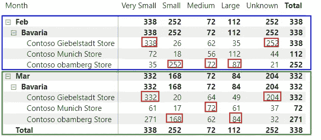

图 1 — 巴伐利亚按体积类别分组的两个月感兴趣值（作者绘制）

如你所见，最高的库存量分布没有任何规则，并且每月可能发生变化。

我需要知道每个月和每个州每个尺寸类别的最大单位数量。

每个商店的详细信息对我的分析没有意义。

也不是每周单位的数量。

当我从上面的截图中取出巴伐利亚的示例，并查看三月时，三月的结果应该是：

+   332 个超小尺寸单元

+   168 个小尺寸单元

+   72 个中等尺寸单元

+   84 个大尺寸单元

+   204 个没有尺寸信息的单元

这些数字将作为计划的起点，应该出现在巴伐利亚的结果中。

# 设计解决方案

如果你是第一次接触在 Power BI 中计算库存度量，或者我们所说的“半加性度量”，请查看下方的参考部分，找到关于这个主题的另外两篇文章。

为了设计解决方案，我必须首先了解我的数据。

数据模型如下所示：

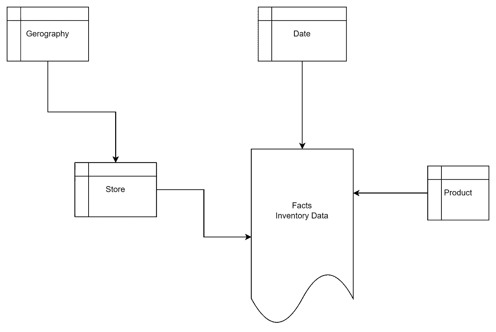

图 2 — 基本数据模型（作者绘制）

如前所述，库存数据是每周为每个商店的每个产品在库存数据事实表中收集的。

我需要哪些信息来进行分析：

+   日历

+   产品体积类别（列体积范围）

+   每个商店的州，可能还包括国家

+   库存

我需要一张包含这些列的表来计算结果。

我有两种可能的方法来解决这个具有此类表格的挑战：

1.  创建一个 DAX 度量，它构建一个中介表并实时执行计算。

1.  创建一个包含必要列的计算 DAX 表。

第一个方法可能是实用的；我不需要在数据模型或内存中存储额外的数据。

然而，这可能会导致性能和内存消耗的问题。

因为我必须重用表的结果，所以我可以多次复制中介表的逻辑，或者即使我创建了基本度量并重复使用它，也可能被迫多次实时计算该表。

基于这些需求和可能的副作用，我将使用 DAX 表进行我的计算。

添加此表后，我的数据模型将如下所示：

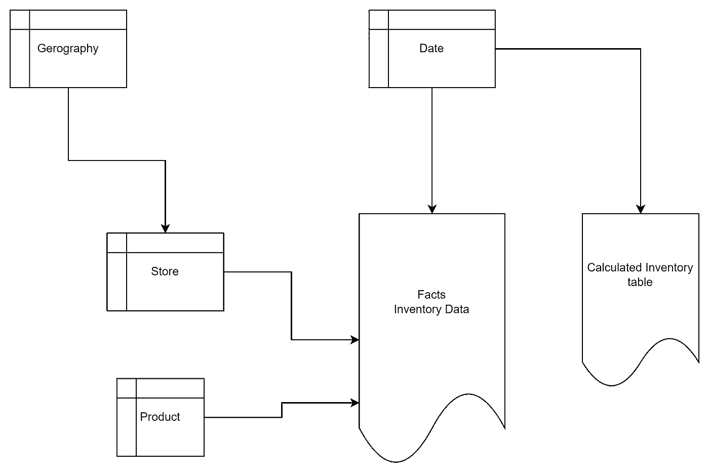

图 3 — 展开数据模型与计算表（作者绘制）

如你所见，计算表将只与日期表相关联。由于粒度与原始库存表不同，它将是自包含的。

# 创建解决方案

为了创建该表，我使用以下 DAX 查询：

```py
EVALUATE
    SUMMARIZECOLUMNS('Inventory'[DateKey]
                    ,'Inventory'[DateLastDayOfMonth]
                    ,'Geography'[State Province]
                    ,'Product'[Volume Range]
                    ,'Product'[Volume Range Sort]
                    ,"Inventory", [Max Stock Volume]
                    )
```

度量值[最大库存量]从库存表中获取最大值，在此案例中，针对每个月以及每个州的所有商店。

查询的结果如下：

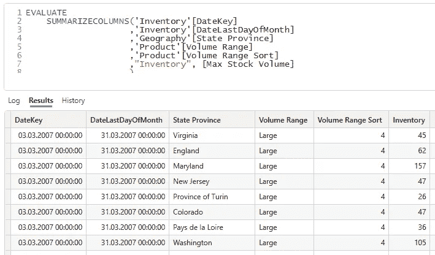

图 4 — 计算表的 DAX 查询结果（作者绘制的图）

如前所述，度量值[最大库存量]包含一个简单的表达式：

```py
Max Stock Volume = MAX('Inventory'[OnHandQuantity])
```

我报告中用于计算库存量的现有度量值包含获取最新库存量的逻辑。这是一个使用[LASTNONBLANKVALUE()](https://dax.guide/lastnonblankvalue/)函数的标准度量值。

我不需要此逻辑，因为我在计算表中不会按时间汇总库存量。

接下来，我使用 New table 函数，通过上述查询中的[SUMMARIZECOLUMN()](https://dax.guide/summarizecolumns/)函数创建计算表：

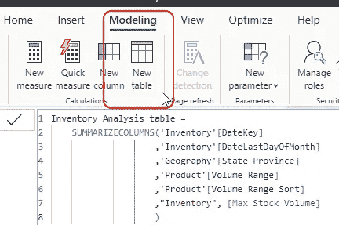

图 5 — 使用上述查询创建计算表（作者绘制的图）

另一种方法是通过 Power Query 创建此表。这将导致数据的更高效压缩。

在我的案例中，结果表只有 57’005 行。因此，我避免执行此操作，因为这将涉及多个合并操作，而没有太大的好处。但如果表格包含数十万行甚至数百万行，我会采用这种方式。

我使用列`DateLastDayOfMonth`来创建与日期表的关系：

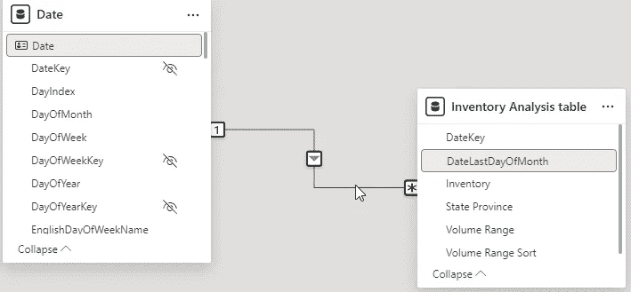

图 6 — 将新关系添加到日期表（作者绘制的图）

接下来，我计算每个州、每个库存量范围和当前月份的最高库存量。

为了实现这一点，我向计算表中添加了一个计算列。

这个计算列获取当前月份（DateLastDayOfMonth）、州和库存量范围。

然后，我获取最大库存量。

该列的 DAX 代码如下：

```py
Highmark Stock Volume = 
    VAR CurrentMonth = 'Inventory Analysis table'[DateLastDayOfMonth]
    VAR CurrentState = 'Inventory Analysis table'[State Province]
    VAR CurrentVolumeRange = 'Inventory Analysis table'[Volume Range]

RETURN
    CALCULATE(
            MAX('Inventory Analysis table'[Inventory])
            ,REMOVEFILTERS('Inventory Analysis table')
            ,'Inventory Analysis table'[DateLastDayOfMonth] = CurrentMonth
            ,'Inventory Analysis table'[State Province] = CurrentState
            ,'Inventory Analysis table'[Volume Range] = CurrentVolumeRange
            )
```

巴伐利亚的结果如下所示：

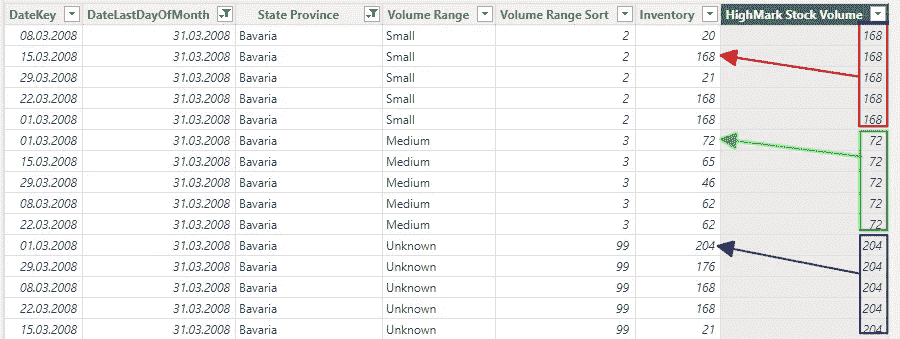

图 7 — 具有多行的计算列结果（作者绘制的图）

尽管这个结果是正确的，并且与开头显示的数据相符，但它的实际使用价值没有达到最大化。

我可以使用一个度量值，该度量值只考虑最新的值，但由于我需要在月报中展示结果，这使得这种方法变得复杂。

因此，我在此列的计算中应用了额外的逻辑，仅返回最新日期的值：

```py
Highmark Stock Volume = 
    VAR CurrentMonth = 'Inventory Analysis table'[DateLastDayOfMonth]
    VAR CurrentState = 'Inventory Analysis table'[State Province]
    VAR CurrentVolumeRange = 'Inventory Analysis table'[Volume Range]

    VAR ResultPerMonth = 
        CALCULATE(
                MAX('Inventory Analysis table'[Inventory])
                ,REMOVEFILTERS('Inventory Analysis table')
                ,'Inventory Analysis table'[DateLastDayOfMonth] = CurrentMonth
                ,'Inventory Analysis table'[State Province] = CurrentState
                ,'Inventory Analysis table'[Volume Range] = CurrentVolumeRange
                )

    VAR LastDatePerMonth = 
        CALCULATE(
                MAX('Inventory Analysis table'[DateKey])
                ,REMOVEFILTERS('Inventory Analysis table')
                ,'Inventory Analysis table'[DateLastDayOfMonth] = CurrentMonth
                ,'Inventory Analysis table'[State Province] = CurrentState
                ,'Inventory Analysis table'[Volume Range] = CurrentVolumeRange
                )

RETURN
    IF( 'Inventory Analysis table'[DateKey] = LastDatePerMonth, ResultPerMonth)
```

这是该计算的结果：

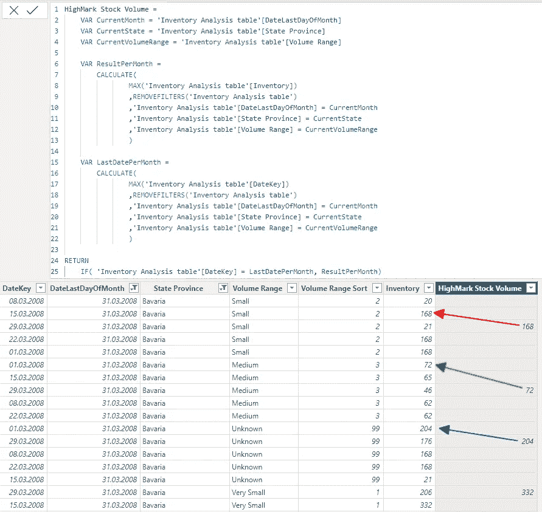

图 8 — 高标列的修正结果（作者绘制的图）

现在，我可以通过对该列进行简单的 SUM 运算来添加一个度量值，得到所需的结果：

```py
Stock for Highmark = SUM('Inventory Analysis table'[HighMark Stock Volume])
```

当按月显示结果时，我得到了所需的结果：

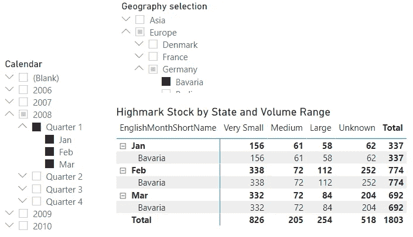

图 9 — 2008 年第一季度各州及体积范围的结果（图由作者提供）

如你所见，结果与最开始显示的截图相同。

如果需要添加“国家”和“大陆”，我可以选择：

+   为州列添加地理表的关系。

+   将“国家”和“大陆”列添加到计算表中。

两种变体得到了相同的结果。

然而，在我当前的配置中，由于存在循环依赖，我无法添加关系，这可能是由现有的“州”列或已实现的计算列和度量值引起的。

因此，将这两列添加到计算表中更为简单：

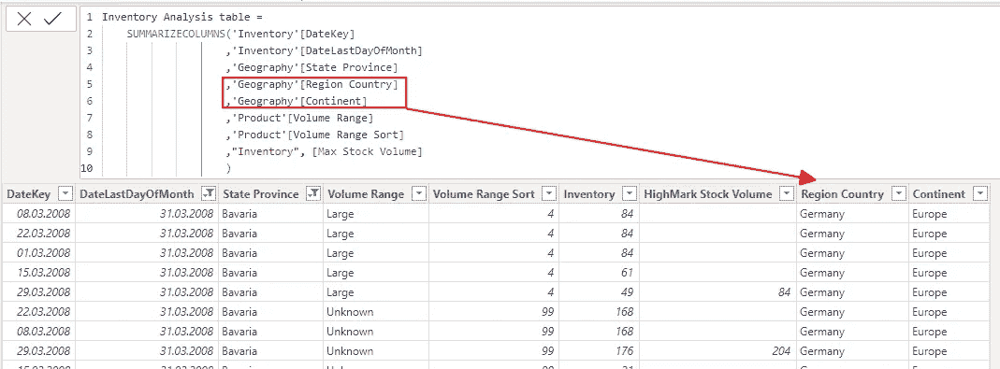

图 10 — 新添加的“国家”和“大陆”列的计算表（图由作者提供）

我仍然可以使用带有新层次结构的结果，因为我不会对结果进行时间上的汇总。

跨多个月份的聚合是错误的，这也是为什么这样的度量值被称为“半加性度量”。

因此，我应当从矩阵视觉对象中删除“行总计”以避免显示错误信息。

# 接下来做什么？

现在，我可以展开表格以启用其他分析，例如按产品类别进行分析，从而增加更多分析的可能性。

但请注意。

当添加一个新列时，列[HighMark Stock Volume]将产生重复值，因为它不会考虑新列的加入。

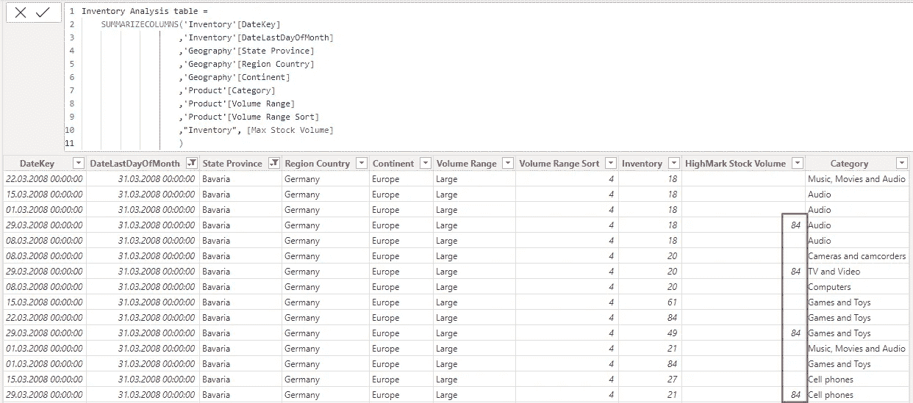

图 11 — 包含已添加产品类别和重复值的计算表（图由作者提供）

为了纠正这一点，我必须为类别添加检查，确保值保持唯一：

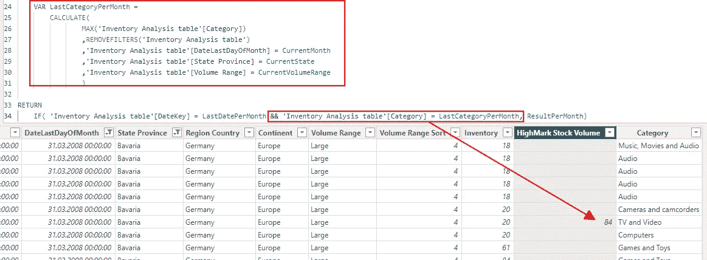

图 12 — 检查添加的类别列（图由作者提供）

到某个时候，选择以下之一会更有意义：

+   更改度量值中的逻辑，以忽略重复项，或

+   为特定分析需求添加一个新的计算表。

第一种方法可能会比较复杂，而第二种方法会为每个分析扩展数据模型。

因此，两者都有利有弊。

# 结论

这种方法可以得到所需的结果，但它也有一些缺点：

1.  计算表是自包含的，除了日期外，与其他表没有关系。

a. 这意味着我不能使用地理表中的列来基于该表和库存表过滤视觉效果。

2. 这意味着数据在数据模型中被重复了。

3. 添加更多分析方面可能会导致计算中的复杂效果。

4. 我必须始终在任何分析中添加月份，因为没有它，结果可能会产生误导。

但这是一个相对简单的解决方案。

这种规划分析通常不会定期进行，并且在规划过程完成后可能会被丢弃。

这解决了上述提到的许多缺点。

我的一个客户需要进行这种分析以支持持续的规划，他很乐意接受这些缺点并找到解决方法。

因此，我不需要构建一个更复杂的解决方案。

这是本文的一个关键教训：寻找一个足够好的解决方案，而不是花费数天或数周时间寻找完美的解决方案。

完美的解决方案可能会过于复杂，且没有任何附加的好处。


图片由[CHUTTERSNAP](https://unsplash.com/@chuttersnap?utm_source=medium&utm_medium=referral)提供，来源于[Unsplash](https://unsplash.com/?utm_source=medium&utm_medium=referral)

# 参考文献

这里有一些关于如何使用库存度量的过去文章：

[](/going-the-next-step-with-stock-measures-in-dax-cb49d4e21c13?source=post_page-----0c7219845d48--------------------------------) ## 在 DAX 中进一步深入使用库存度量

### 在 Power BI 中使用库存度量时可能会出现一些奇怪的效果。我们来看看这种情况是如何出现的以及…

[towardsdatascience.com [](/refinement-of-semi-additive-measures-in-dax-4e148fa83f56?source=post_page-----0c7219845d48--------------------------------) ## 在 DAX 中细化半加法度量

### 在之前的文章中，我解释了一些关于半加法度量（Semi-Additive Measures）的细节。这里有更多关于这个话题的提示。

[towardsdatascience.com

我之前写过一篇关于更改数据粒度的文章，这是一个类似的问题。

这是它的链接：

[](/changing-granularity-of-data-in-power-bi-3a2b81356990?source=post_page-----0c7219845d48--------------------------------) ## 在 Power BI 中更改数据粒度

### 有时候你需要以不同于数据原有粒度的方式创建报告。让我们来探索如何…

[towardsdatascience.com

我使用的是 Contoso 示例数据集，就像我之前的文章中一样。你可以从 Microsoft [这里](https://www.microsoft.com/en-us/download/details.aspx?id=18279)免费下载 ContosoRetailDW 数据集。

Contoso 数据可以在 MIT 许可证下自由使用，具体描述请见[这里](https://github.com/microsoft/Power-BI-Embedded-Contoso-Sales-Demo)。

[](https://medium.com/@salvatorecagliari/subscribe?source=post_page-----0c7219845d48--------------------------------) [## 每当 Salvatore Cagliari 发布新内容时，订阅电子邮件通知

### 每当 Salvatore Cagliari 发布新内容时，你将收到电子邮件通知。通过注册，如果你还没有 Medium 账户，将会创建一个账户…

[medium.com](https://medium.com/@salvatorecagliari/subscribe?source=post_page-----0c7219845d48--------------------------------)

尽管 Medium 有付费墙，我还是让我的文章对所有人可访问。这使我可以从每位读者那里赚取一些收入，但我关闭了付费墙，因此你可以免费阅读我的文章。

你可以通过以下方式支持我的工作，这些工作是在我的空闲时间里进行的。

[`buymeacoffee.com/salvatorecagliari`](https://buymeacoffee.com/salvatorecagliari)

或者扫描这个二维码：


任何支持都非常感激，并帮助我争取更多时间为你创作更多内容。

非常感谢。
