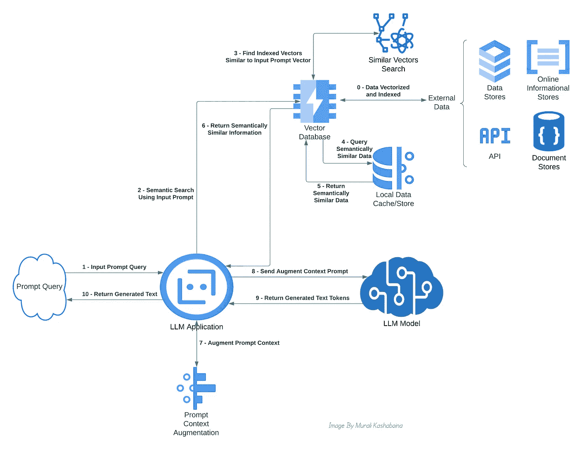
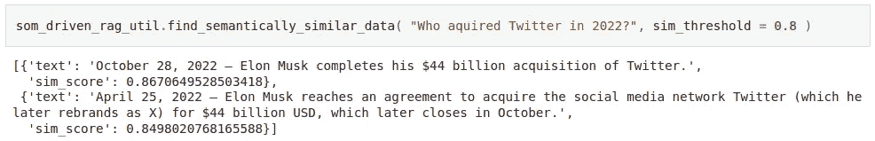
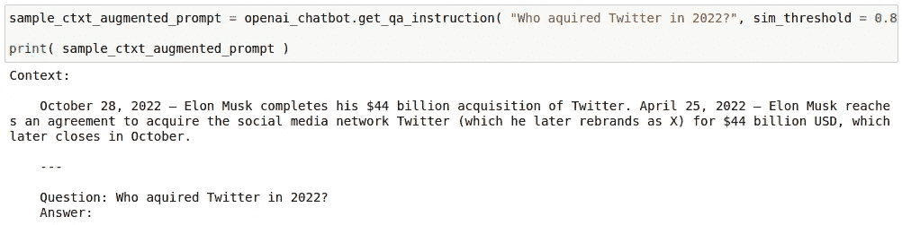
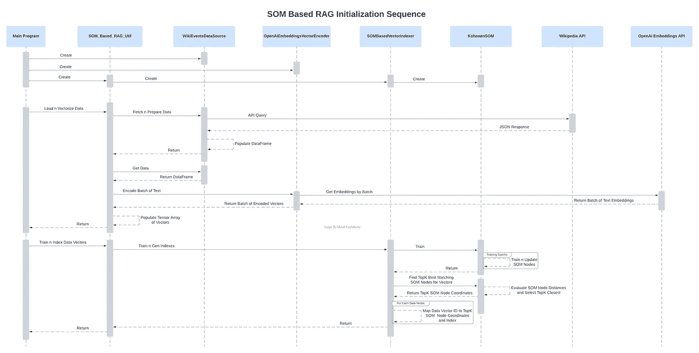
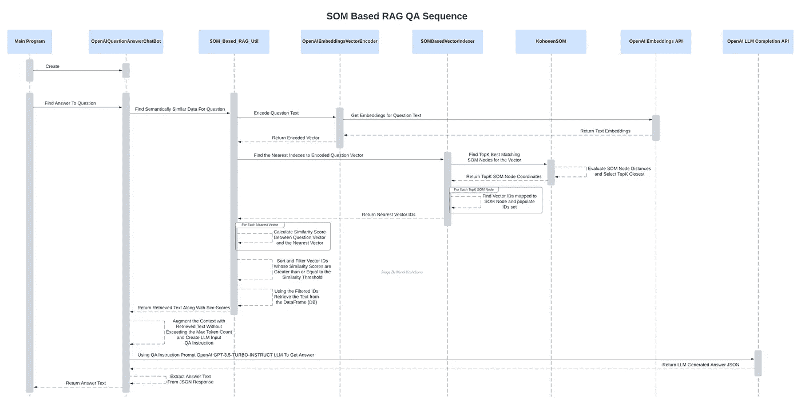
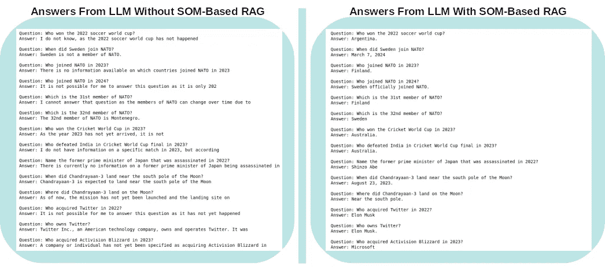

# 使用自组织映射增强大型语言模型中的检索增强生成

> 原文：[`towardsdatascience.com/using-self-organizing-map-to-bolster-retrieval-augmented-generation-in-large-language-models-5d739ce21e9c?source=collection_archive---------3-----------------------#2024-03-16`](https://towardsdatascience.com/using-self-organizing-map-to-bolster-retrieval-augmented-generation-in-large-language-models-5d739ce21e9c?source=collection_archive---------3-----------------------#2024-03-16)

## *SOM 被提议用来增强 LLM 上下文的高效检索，以支持 RAG……*

[](https://murali-kashaboina.medium.com/?source=post_page---byline--5d739ce21e9c--------------------------------)[](https://towardsdatascience.com/?source=post_page---byline--5d739ce21e9c--------------------------------) [Murali Kashaboina](https://murali-kashaboina.medium.com/?source=post_page---byline--5d739ce21e9c--------------------------------)

·发布于[Towards Data Science](https://towardsdatascience.com/?source=post_page---byline--5d739ce21e9c--------------------------------) ·17 分钟阅读·2024 年 3 月 16 日

--


图片来源：[Werclive 👹](https://unsplash.com/@werclive?utm_source=medium&utm_medium=referral)来自[Unsplash](https://unsplash.com/?utm_source=medium&utm_medium=referral)

## 背景

大量数据被用于训练大型语言模型（LLM），这些模型包含数百万、数十亿个参数，目的是进行文本生成，如文本补全、文本摘要、语言翻译和问题回答。虽然 LLM 从训练数据中自然而然地建立了一个知识库，但训练数据有一个截止日期，截止日期之后，LLM 将无法了解任何新生成的数据。例如，OpenAI 的 GPT-3.5-turbo-instruct LLM 的训练截止日期是 2021 年 9 月（参考：[`platform.openai.com/docs/models/gpt-3-5-turbo`](https://platform.openai.com/docs/models/gpt-3-5-turbo)），因此，GPT-3.5-turbo-instruct LLM 可能无法准确回答 2022 年、2023 年或 2024 年的事件。这类不属于 LLM 原始训练数据的数据称为外部数据。检索增强生成（RAG）是一种技术，旨在通过从授权的外部来源检索与输入提示相关的适当信息，并增强输入，以便 LLM 能够生成准确且相关的响应。实际上，RAG 构成了 LLM 与外部数据之间的桥梁。这种增强避免了重新训练或进一步微调 LLM 模型的需要。

## LLM 的典型操作模式

LLM 是自回归的，根据输入提示将 token 化的序列生成一个新的 token。下一个最佳 token 的生成是基于概率的，可以表达为以下形式：

```py
P( Yn ∣ X0, X1, ... Xn-1, θ )
```

本质上，新生成的第 n 个 token Yn 的概率是基于 n-1 个前序 tokens X 以及学习到的模型参数θ的概率。这里需要注意的是，token 化的输入序列 X 在生成下一个 token 时起着至关重要的作用。此外，自注意力机制有效地补充了自回归，在这种机制下，序列中的每个输入 token 通过关注并加权序列中其他 token 的重要性来计算其表示。这种 token 之间复杂的关系和依赖性使得 LLM 能够解码出与输入序列中的 tokens“契合”的下一个最佳 token。LLM 将新生成的 token 附加到之前的 tokens 上，形成新的输入序列，并重复自回归过程，直到满足结束条件，例如达到最大 token 数量。

这种自注意力驱动的自回归模型意味着，LLM 主要依赖于输入序列来生成下一个最佳的 token。只要输入序列通过自注意力帮助确定下一个最佳 token，LLM 就会继续在一个“良性”循环中生成连贯、易理解且相关的输出。相反，如果提示输入无法帮助确定下一个最佳 token，LLM 将开始依赖模型参数。在这种情况下，如果模型已经经过足够的训练，能够包含与输入提示相关的‘知识’，它可能成功生成下一个最佳 token。相反，如果提示输入涉及 LLM 从未训练过的‘外部数据’，模型可能会进入一个‘恶性’循环，生成不连贯、难以理解且可能无关的输出。

有多种技术来应对这个问题。提示工程就是其中之一，其目标是通过调整提示来解决‘缺失的上下文’，以增强上下文，使得 LLM 可以生成相关的输出。RAG 是另一种技术，其目标是通过从外部数据源自动检索与输入提示相关的最合适信息，并增强提示，专门解决由于‘外部数据’缺失的上下文。

## RAG 的挑战

RAG 的主要职责是从外部数据源（如信息数据库、API 和其他文档库，如维基百科）中搜索并检索与输入提示相关的上下文数据。简单的关键词搜索是不够的，而是需要进行语义搜索。为了促进语义搜索，从外部源检索的文本信息会被转化为数值表示或向量，通常称为文本嵌入，并存储在向量数据库中。存在多种模型或算法用于从文本中创建这些嵌入。首先将提示转化为其向量表示，以便搜索和检索最接近的外部数据向量。然后计算提示向量与先前存储的外部数据向量之间的向量相似度（或向量距离）。根据相似度排序并使用阈值过滤最相似或最近的向量，最终检索相应的文本信息以增强提示的上下文。以下概念图展示了启用 RAG 时不同组件之间的典型交互：



启用 RAG 的主要系统组件交互的概念视图 — 作者提供的图片

RAG 面临的挑战是，进行基于向量的语义搜索并非简单任务，且需要大量计算资源，因为它涉及到对可能是庞大数据库中大量向量进行相似度或距离计算。对于每一个输入提示，从庞大的向量数据库中计算每个存储向量的相似度或距离将变得不可行。而且，语义匹配质量越低，LLM 的生成输出质量也越低。因此，找到一种高效进行语义搜索的方法变得至关重要。

## 解决方案

为了进行高效的语义搜索，采用了几种算法解决方案。这些算法的典型方法是将外部数据向量按最近邻进行分组或聚类，并通过映射到这些聚类来进行索引。大多数向量数据库提供了这种内建的索引功能。在语义搜索过程中，首先会评估输入提示向量与匹配到的聚类。对于每个评估过的聚类，选择相应的索引向量。然后计算输入提示向量与所选向量之间的相似度。此处的预期是，通过找到“最近邻”作为一个中间步骤，显著减少了相似度计算的次数。最后，依据阈值过滤，通过相似度最高或最近的向量来检索相应的文本信息。像 k-最近邻、半径球体 R、局部敏感哈希、DBSCAN 聚类、树状层次结构和图状层次结构等算法，通常由向量数据库实现，用以促进语义搜索。

没有一种适用于所有情况的解决方案，因为不同类型的算法在内存效率、计算效率、延迟、准确性、向量维度、数据集大小等方面有不同的权衡。例如，聚类方法通过缩小语义搜索的向量空间来提高速度，而类似树形或图形的方法则为低维向量数据提供更高的准确性。

## 自组织映射

自组织映射（SOM）是一种基于神经网络的降维算法，由 Teuvo Kohonen 在 1980 年代开发。它通常用于将高维特征向量降至低维（通常是二维）特征向量。SOM 的核心思想是将高维数据向量表示为低维空间中的特定节点，同时保留向量在原始空间中的拓扑结构。低维空间中的节点数量（SOM 节点）是固定的（超参数）。SOM 节点的精确位置通过多个训练周期来评估。迭代训练的目标是调整 SOM 节点在低维空间中的位置，使其映射到高维特征空间中最邻近的向量。换句话说，目标是将高维空间中最近邻的向量映射到低维空间中也为最近邻的 SOM 节点。

## SOM 用于 RAG

在这篇文章中，我想分享我在实验中对 SOM 的笔记和发现，作为一种推动 RAG 语义搜索的可能算法。SOM 相比其他算法可能理想的三个关键原因是：

1.  向量的高维度可能成为大多数其他算法的瓶颈，例如树和图——这就是所谓的维度灾难。相反，SOM 是为降维而设计的，因此它可以在高维和低维场景中有效应用。

1.  SOM 对可能渗入原始高维向量空间的随机变化不太敏感，从而避免了噪音的影响。其他算法可能对这些噪音敏感，从而影响它们将高维向量聚类或分组为最近邻的方式。由于 SOM 在低维向量空间中使用中间的 SOM 节点，这些节点被评估为映射自高维空间向量的局部平均值，因此它有效地减少了噪音。

1.  外部数据集的庞大规模可能会限制其他算法在创建语义向量空间时的表现，这可能会影响语义匹配的延迟和准确性。另一方面，SOM 能够处理大规模数据集，因为低维空间中的 SOM 节点数量可以通过与底层数据集大小成比例的超参数来精细调整。尽管使用大数据集训练 SOM 可能需要更长的时间，但训练完成后，查询映射仍然会更快。

我展示了一个简单的示例，使用 SOM 来进行 RAG 的语义搜索，以增强基于 OpenAI GPT-3.5-turbo-instruct LLM 的问答上下文。使用 OpenAI GPT-3.5-turbo-instruct LLM 的主要原因是因为 OpenAI GPT-3.5-turbo-instruct LLM 的训练截止日期为 2021 年 9 月（参考：[`platform.openai.com/docs/models/gpt-3-5-turbo`](https://platform.openai.com/docs/models/gpt-3-5-turbo)），因此，GPT-3.5-turbo-instruct LLM 可能无法准确回答 2022 年、2023 年或 2024 年的事件问题。因此，关于 2022 年、2023 年或 2024 年的事件信息可能成为 OpenAI GPT-3.5-turbo-instruct LLM 的“外部数据”。我使用了 Wikipedia API 作为这种“外部数据”的来源，来获取事件信息。以下是我用来开发和训练示例的步骤，以及示例代码。

## 第一步：基于 PyTorch 的 Kohonen SOM 实现

我使用了 PyTorch 张量来表示向量，并使用 PyTorch 实现了 Kohonen 的 SOM。该算法使用一个二维格子，其大小成为一个超参数。算法的数学方面来源于以下文章中的清晰解释：

[](http://www.ai-junkie.com/ann/som/som1.html?source=post_page-----5d739ce21e9c--------------------------------) [## SOM 教程第一部分

### 神经网络教程（通俗易懂）

www.ai-junkie.com](http://www.ai-junkie.com/ann/som/som1.html?source=post_page-----5d739ce21e9c--------------------------------)

以下代码片段展示了 Kohonen SOM 的 Python 类。完整代码可在[这个 GitHub 链接](https://github.com/kbmurali/som-driven-qa-rag/blob/main/kohonen_som.py)找到。值得注意的是，这个实现是独立的，因此可以在 RAG 示例之外使用。

```py
class KohonenSOM():
    """
    The code is developed based on the following article:
    http://www.ai-junkie.com/ann/som/som1.html

    The vector and matrix operations are developed using PyTorch Tensors.
    """
    def __init__( ... )
    ...
    def find_topk_best_matching_units( self, data_points : torch.Tensor, topk : int = 1 ) -> List[ List[ int ] ] :
        if len( data_points.size() ) == 1:
            #batching 
            data_points = data_points.view( 1, data_points.shape[0] )

        topk = int( topk )

        distances = self.dist_evaluator( data_points, self.lattice_node_weights )

        topk_best_matching_unit_indexes = torch.topk( distances, topk, dim=1, largest=False ).indices
        topk_best_matching_units = []

        for i in range( data_points.shape[0] ):
            best_matching_unit_indexes = topk_best_matching_unit_indexes[i]
            best_matching_units = [ self.lattice_coordinates[ bmu_index.item() ].tolist() for bmu_index in best_matching_unit_indexes ]
            topk_best_matching_units.append( best_matching_units )

        return topk_best_matching_units
```

## 第二步：基于 SOM 的向量索引器实现

向量索引器是一个工具，利用 Kohonen 的 SOM 来训练 SOM 节点，使用来自外部数据集的数据向量。其主要目的是将每个数据向量映射到最接近的 top-k SOM 节点，从而实现高效的数据向量索引。以下代码片段展示了向量索引器 Python 类的训练和索引功能。其完整代码可在[这个 GitHub 链接](https://github.com/kbmurali/som-driven-qa-rag/blob/main/vector_indexer.py)找到。尽管其实现目前仅限于示例的需求，但可以扩展以满足其他需求。

```py
class SOMBasedVectorIndexer():
    ...

    def train_n_gen_indexes( 
                                self, input_vectors : torch.Tensor, 
                                train_epochs : int = 100 
                           ):
        if self.generated_indexes:
            print( "WARNING: Indexes were already generated. Ignoring the request..." )
            return

        self.som.train( input_vectors, train_epochs )

        topk_bmu_indexes = self.som.find_topk_best_matching_units( input_vectors, topk = self.topk_bmu_for_indexing )

        for idx in tqdm( range( len( topk_bmu_indexes ) ), desc="SOM-Based Indexed Vectors"  ):
            bmu_indexes = topk_bmu_indexes[ idx ]

            for bmu_index in bmu_indexes:
                bmu_index_key = tuple( bmu_index )
                idx_set = self.som_node_idx_map.get( bmu_index_key, set() )
                idx_set.add( idx )
                self.som_node_idx_map[ bmu_index_key ] = idx_set

        self.generated_indexes = True
```

## 第三步：基于 OpenAI 嵌入的文本到向量编码器

编码器的主要功能是使用 OpenAI 的文本嵌入 API 将文本转换为向量表示。值得注意的是，使用嵌入 API 需要一个 OpenAI 帐户和 API 密钥。在首次开通账户时，OpenAI 会提供免费的信用额度，足以用于 API 测试。以下是展示 OpenAI 编码器 Python 类的批量编码功能的代码片段，完整代码可在[这个 GitHub 位置](https://github.com/kbmurali/som-driven-qa-rag/blob/main/openai_vector_encoder.py)找到。

```py
import openai
from openai.embeddings_utils import get_embedding
...
from vector_encoder_parent import VectorEncoder
...

class OpenAIEmbeddingsVectorEncoder( VectorEncoder ):
    def __init__( ... )
    ...
    def encode_batch( self, list_of_text : List[ str ] ) -> torch.Tensor :
        if list_of_text == None or len( list_of_text ) == 0:
            raise ValueError( "ERROR: Required list_of_text is None or empty" )

        list_of_text = [ str( text ) for text in list_of_text ]

        openai.api_key = self.openai_key
        response = openai.Embedding.create(
                                            input = list_of_text,
                                            engine = self.vector_encoder_id
                                          )

        embeddings = [ data["embedding"] for data in response["data"] ] 
        vectors = torch.tensor( embeddings, dtype=torch.float )
        return vectors
```

请注意，OpenAI 向量编码器类扩展了一个通用的父类‘VectorEncoder’，该父类定义了抽象的编码函数，需通过继承来实现。可以通过继承该父类实现其他类型的向量编码器，从而实现其他编码方案的插件化。父向量编码器类的完整代码可以在[这个 GitHub 位置](https://github.com/kbmurali/som-driven-qa-rag/blob/main/vector_encoder_parent.py)找到。

## 步骤 4：基于 Wikipedia API 的数据源实现

这个工具类旨在封装与 Wikipedia API 集成的数据检索逻辑。它的主要功能是获取指定日历年份范围内的事件，格式化检索到的事件，并将它们加载到 Pandas 数据框中。以下代码片段展示了该工具类的主要功能，完整代码可以在[这个 GitHub 位置](https://github.com/kbmurali/som-driven-qa-rag/blob/main/wiki_datasource.py)找到。

```py
import requests
import pandas as pd
from dateutil.parser import parse
...
class WikiEventsDataSource():
    ...
    def fetch_n_prepare_data( self ):
        if self.fetched:
            print( "WARNING: Wiki events for the specified years already fetched. Ignoring the request..." )
            return

        main_df = pd.DataFrame()

        for year in self.event_years_to_fetch:
            wiki_api_params = {
                                "action": "query", 
                                "prop": "extracts",
                                "exlimit": 1,
                                "titles": year,
                                "explaintext": 1,
                                "formatversion": 2,
                                "format": "json"
                              }

            response = requests.get( "https://en.wikipedia.org/w/api.php", params=wiki_api_params )
            response_dict = response.json()

            df = pd.DataFrame()
            df[ "text" ] = response_dict["query"]["pages"][0]["extract"].split("\n")
            df = self.__clean_df__( df, year )

            main_df = pd.concat( [ main_df, df ] )

        self.df = main_df.reset_index(drop=True)
        self.fetched = True
```

## 步骤 5：基于 SOM 的 RAG 工具实现

基于 SOM 的 RAG 工具是示例实现中的一个关键元素。它利用向量编码器、索引器和数据源实现底层语义搜索的核心逻辑。基于 SOM 的 RAG 工具的完整代码可以在[这个 GitHub 位置](https://github.com/kbmurali/som-driven-qa-rag/blob/main/som_based_rag.py)找到。

该工具实现了三个主要功能。第一个功能是从外部数据源加载数据并将其编码为向量，如下面的代码片段所示。

```py
...
from vector_encoder_parent import VectorEncoder
from vector_indexer import SOMBasedVectorIndexer

class SOM_Based_RAG_Util():
    ...
    def load_n_vectorize_data( self, data_source ):
        if self.data_loaded_n_vectorized:
            print( "WARNING: Data already loaded and vectorized. Ignoring the request..." )
            return

        data_source.fetch_n_prepare_data()
        self.df = data_source.get_data()

        vectors = None

        for i in tqdm( range(0, len(self.df), self.vectorize_batch_size ), desc="Vectorized Data Batch" ):
            list_of_text = self.df.iloc[ i:i+self.vectorize_batch_size ]["text"].tolist()
            batch_encoded_vectors = self.vector_encoder.encode_batch( list_of_text )

            if vectors == None:
                vectors = batch_encoded_vectors
            else:
                vectors = torch.cat( [ vectors, batch_encoded_vectors], dim=0 )

        self.vectors = vectors.to( self.device )
        self.data_loaded_n_vectorized = True
```

第二个功能是训练基于 SOM 的索引器，构建 Kohonen 的 SOM 节点，然后对数据向量进行索引，如下面的代码片段所示。

```py
def train_n_index_data_vectors( self, train_epochs : int = 100  ):
        if not self.data_loaded_n_vectorized:
            raise ValueError( "ERROR: Data not loaded and vectorized." )

        if self.data_vectors_indexed:
            print( "WARNING: Data vectors already indexed. Ignoring the request..." )
            return

        self.vector_indexer.train_n_gen_indexes( self.vectors, train_epochs )
        self.data_vectors_indexed = True
```

第三个功能是基于查询文本从先前存储的外部数据集找到相似的信息。该功能使用编码器将查询文本转换为向量，然后通过基于 SOM 的索引器搜索最可能的匹配项。接着，使用余弦相似度或其他指定的相似度评估器计算查询向量与发现的数据向量之间的相似度。最后，该功能筛选出与指定相似度阈值大于或等于的相似度的数据向量。下面的代码片段展示了该功能的实现。

```py
def find_semantically_similar_data( self, query: str, sim_evaluator = None, sim_threshold : float = 0.8  ):
        if not self.data_vectors_indexed:
            raise ValueError( "ERROR: Data vectors not indexed." )

        if query == None or len( query.strip() ) == 0:
            raise ValueError( "ERROR: Required query text is not specified." )

        sim_threshold = float( sim_threshold )

        if sim_evaluator == None:
            sim_evaluator = nn.CosineSimilarity(dim=0, eps=1e-6)

        query_vector = self.vector_encoder.encode( query )
        query_vector = query_vector.view( self.vector_encoder.get_encoded_vector_dimensions() )
        query_vector = query_vector.to( self.device )

        nearest_indexes = self.vector_indexer.find_nearest_indexes( query_vector )
        nearest_indexes = nearest_indexes[0]

        sim_scores = []

        for idx in nearest_indexes:
            data_vector = self.vectors[ idx ]
            data_vector = data_vector.view( self.vector_encoder.get_encoded_vector_dimensions() )

            sim_score = sim_evaluator( query_vector, data_vector )

            if sim_score >= sim_threshold:
                sim_score_tuple = (idx, sim_score.item() )
                sim_scores.append( sim_score_tuple )

        sim_scores.sort( key = lambda x: x[1], reverse=True )

        semantically_similar_data = [ 
                                        { 
                                            'text': self.df[ 'text' ][ idx ],
                                            'sim_score' : sim_score
                                        } for idx, sim_score in sim_scores
                                    ]

        return semantically_similar_data
```

以下是通过基于 SOM 的 RAG 实用函数进行语义搜索的示例输出：



一个示例的语义搜索输出——作者提供的图像

## 第 6 步：抽象问题/回答聊天机器人及其基于 OpenAI 的实现

一个抽象的‘QuestionAnswerChatBot’ Python 类被开发出来，以便于类似聊天机器人的实现。它通过使用标准的指令模板，并用从 RAG 实用工具中检索到的语境相似信息填充它，来增强问题提示。

指定的最大新标记数限制了上下文增强的文本大小，而标记计数则推迟到底层实现。在 LLM 经济学中，标记就像货币一样。模型处理的每一个标记都需要计算资源——内存、处理能力和时间。因此，LLM 需要处理的标记越多，计算成本就越高。

最后，一旦问答指令被填充，该类会将 LLM 模型的提示工作委托给底层实现。以下代码片段展示了主要功能；完整代码可以在[这个 GitHub 位置](https://github.com/kbmurali/som-driven-qa-rag/blob/main/qa_chatbot.py)找到。

```py
from abc import ABC, abstractmethod
import torch
import math

class QuestionAnswerChatBot( ABC ):
    ...
    def find_answer_to_question( self, question : str, sim_threshold = 0.68, max_new_tokens : int = 5 ):
        if question == None or len( question.strip() ) == 0:
            raise ValueError( "ERROR: Required question is not specified" )

        sim_threshold = float( sim_threshold )
        max_new_tokens = int( max_new_tokens )

        qa_instruction = self.get_qa_instruction( question, sim_threshold = sim_threshold )

        answer_text = self.__get_answer_text__( qa_instruction, max_new_tokens = max_new_tokens )
        answer_text = self.__clean_answer_text__( qa_instruction, answer_text )

        return answer_text
    ...
    def __qa_template__( self ):
        qa_template = """Context: 

    {}

    ---

    Question: {}
    Answer:"""
        return qa_template
```

Python 类‘OpenAIQuestionAnswerChatBot’扩展了抽象类‘QuestionAnswerChatBot’，并使用 OpenAI LLM API 实现了聊天机器人功能。以下代码片段展示了该类的主要功能。完整代码可以在[这个 GitHub 位置](https://github.com/kbmurali/som-driven-qa-rag/blob/main/openai_qa_chatbot.py)找到。

```py
import openai
import tiktoken
from qa_chatbot import QuestionAnswerChatBot

class OpenAIQuestionAnswerChatBot( QuestionAnswerChatBot ):
    ...
    def __get_answer_text__( self, qa_instruction : str, max_new_tokens : int = 5 ) -> str :
        openai.api_key = self.openai_key

        basic_answer = openai.Completion.create(
                                                    model = self.openai_model_name,
                                                    prompt = qa_instruction, 

                                               )

        answer_text = basic_answer[ "choices" ][0][ "text" ]
        return answer_text

    def __token_count__( self, text : str ):    
        return len( self.tokenizer.encode( text ) )
```

以下是如何通过语义搜索检索到的类似信息来增强问题提示的示例：



一个示例的上下文增强问题提示——作者提供的图像

## 第 7 步：用于测试的示例问题

以下是用于测试 RAG 的示例问题，使用的是 OpenAI 的 GPT-3.5-turbo-instruct LLM。这些问题是为了确保它们的答案与 2022 年、2023 年和 2024 年发生的事件相关。

```py
sample_questions = [
                        "Who won the 2022 soccer world cup?",
                        "When did Sweden join NATO?",
                        "Who joined NATO in 2023?",
                        "Who joined NATO in 2024?",
                        "Which is the 31st member of NATO?",
                        "Which is the 32nd member of NATO?",
                        "Who won the Cricket World Cup in 2023?",
                        "Who defeated India in Cricket World Cup final in 2023?",
                        "Name the former prime minister of Japan that was assassinated in 2022?",
                        "When did Chandrayaan-3 land near the south pole of the Moon?",
                        "Where did Chandrayaan-3 land on the Moon?",
                        "Who acquired Twitter in 2022?",
                        "Who owns Twitter?",
                        "Who acquired Activision Blizzard in 2023?"
                   ]
```

## 第 8 步：将所有内容整合在一起

整合所有组件的完整 Jupyter 笔记本可以在[这个 GitHub 位置](https://github.com/kbmurali/som-driven-qa-rag/blob/main/OpenAI_Based_SOM_GPT2_Bot.ipynb)找到。以下代码片段展示了基于 OpenAI 的主要问答聊天机器人的初始化过程。请注意，OpenAI 的文本嵌入算法“text-embedding-ada-002”用于向量编码。同样，聊天机器人使用 OpenAI 的分词器“cl100k_base”来计算标记数，以限制上下文文本，并通过利用 TikToken Python 库的内置函数增强问题提示。

```py
openai_vector_encoder_id = "text-embedding-ada-002"
openai_encoded_vector_dimensions = 1536
openai_tokenizer_name = "cl100k_base" 
openai_model_name = "gpt-3.5-turbo-instruct"

vector_encoder = OpenAIEmbeddingsVectorEncoder( openai_encoded_vector_dimensions, openai_vector_encoder_id, openai_key )

event_years_to_fetch = [ 2022, 2023, 2024 ]
data_source = WikiEventsDataSource( event_years_to_fetch  )
...
som_driven_rag_util = SOM_Based_RAG_Util( 
                                            vector_encoder = vector_encoder,
                                            som_lattice_height = 20,
                                            som_lattice_width = 30,
                                            learning_rate = 0.3,
                                            topk_bmu_for_indexing = 10,
                                            device = device
                                        )
...
openai_chatbot = OpenAIQuestionAnswerChatBot( 
                                                vector_db_util = som_driven_rag_util,
                                                openai_tokenizer_name = openai_tokenizer_name,
                                                openai_model_name = openai_model_name,
                                                openai_key = openai_key,
                                                question_input_max_token_count = 100,
                                                context_trim_percent = 0.1,
                                                device = device
                                            )
```

以下序列图有助于可视化初始化和实际问答阶段中所有组件的交互。



初始化过程中的各组件交互——作者提供的图像



问答过程中各个组件的交互 —— 图片由作者提供

## 研究发现

以下图像展示了在有无上下文增强的情况下，OpenAI 的 GPT-3.5-turbo-instruct LLM 的问答。



OpenAI 的 GPT-3.5-turbo-instruct LLM 的有无上下文增强回答 —— 图片由作者提供

可以理解的是，LLM 发现回答 2021 年 9 月之后发生的事件相关问题时存在困难。在大多数情况下，它明确回应说这些问题相对于其训练截止日期而言来自未来。相反，当通过从维基百科中检索到的 2022、2023 和 2024 年的相关信息增强问题上下文时，同一 LLM 能够准确无误地回答所有问题。真正的功劳在于为 RAG 的语义搜索提供基础的 SOM，它使得能够通过检索并增强问题的上下文，提供相关信息。

## 建议的下一步

虽然上述示例作为概念验证，评估了自组织映射（Self-Organizing Map，SOM）是否适合用于使 LLM 通过检索增强生成（RAG）文本，但建议进行更全面的基准测试，以评估其与其他算法的性能对比，使用更大规模的外部数据集，在此过程中，性能将通过 LLM 输出的质量来衡量（类似困惑度+准确度）。此外，由于当前示例启用了可插拔框架，建议使用其他开源且免费的 QA LLM 进行此类基准测试，以减少 LLM 的使用费用。

为了帮助在本地环境中运行示例，我附上了‘requirements.txt’文件，其中包含我在环境中用于运行和测试上述示例的各种版本的 Python 库。该文件可在[此 GitHub 位置](https://github.com/kbmurali/som-driven-qa-rag/blob/main/requirements.txt)找到。

我最后承诺，如果我进行任何此类基准测试，将会在单独的文章中分享我的发现。请继续关注！！

## 参考文献

[](http://www.ai-junkie.com/ann/som/som1.html?source=post_page-----5d739ce21e9c--------------------------------) [## SOM 教程第一部分

### 神经网络教程（简明英语版）

[www.ai-junkie.com](http://www.ai-junkie.com/ann/som/som1.html?source=post_page-----5d739ce21e9c--------------------------------) [](/understanding-self-organising-map-neural-network-with-python-code-7a77f501e985?source=post_page-----5d739ce21e9c--------------------------------) ## 通过 Python 代码理解自组织映射神经网络

### 通过竞争、合作和适应进行的脑启发式无监督机器学习

[towardsdatascience.com [](https://arxiv.org/abs/2005.11401?source=post_page-----5d739ce21e9c--------------------------------) [## 面向知识密集型自然语言处理任务的检索增强生成

### 大型预训练语言模型已被证明能够在其参数中存储事实知识，并实现…

arxiv.org](https://arxiv.org/abs/2005.11401?source=post_page-----5d739ce21e9c--------------------------------) [](https://blogs.nvidia.com/blog/what-is-retrieval-augmented-generation/?source=post_page-----5d739ce21e9c--------------------------------) [## 什么是检索增强生成（RAG）？

### 检索增强生成（RAG）是一种增强生成型人工智能模型准确性和可靠性的技术…

blogs.nvidia.com](https://blogs.nvidia.com/blog/what-is-retrieval-augmented-generation/?source=post_page-----5d739ce21e9c--------------------------------)

[`www.sciencedirect.com/topics/engineering/self-organizing-map`](https://www.sciencedirect.com/topics/engineering/self-organizing-map)

[`platform.openai.com/docs/models/gpt-3-5-turbo`](https://platform.openai.com/docs/models/gpt-3-5-turbo)

[`platform.openai.com/docs/guides/text-generation/chat-completions-api`](https://platform.openai.com/docs/guides/text-generation/chat-completions-api)
