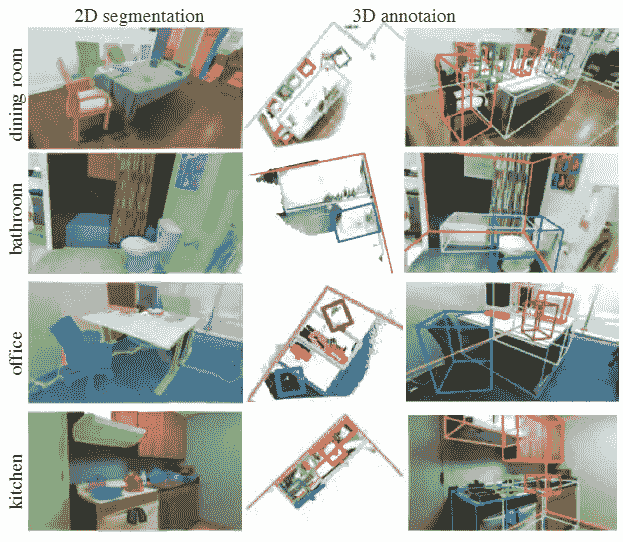
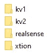
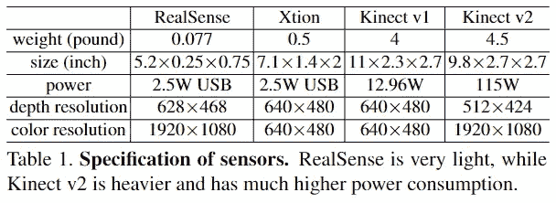
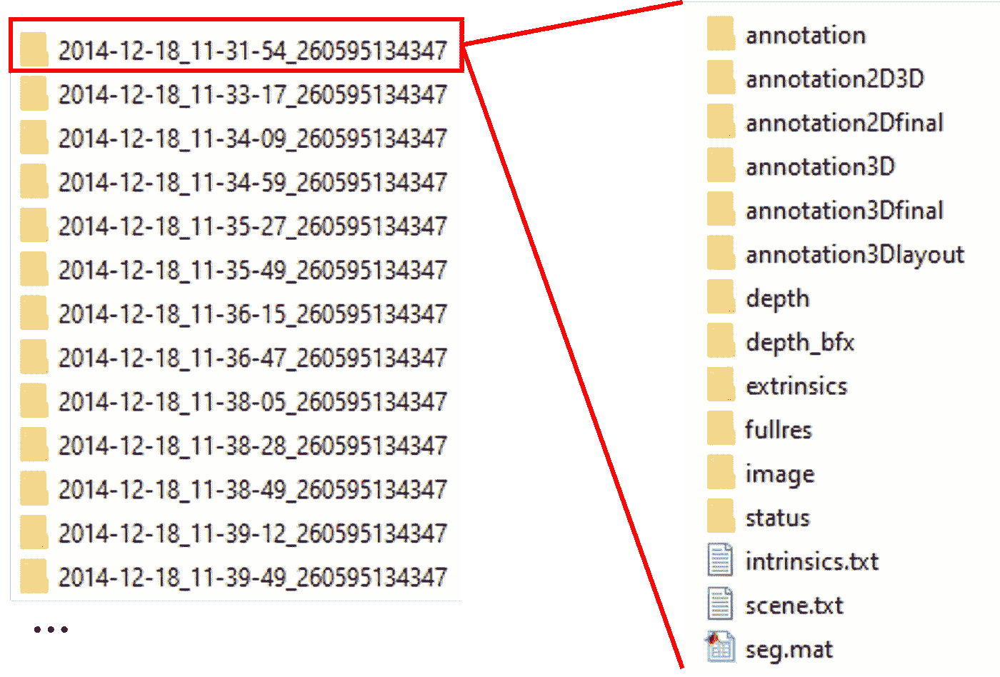
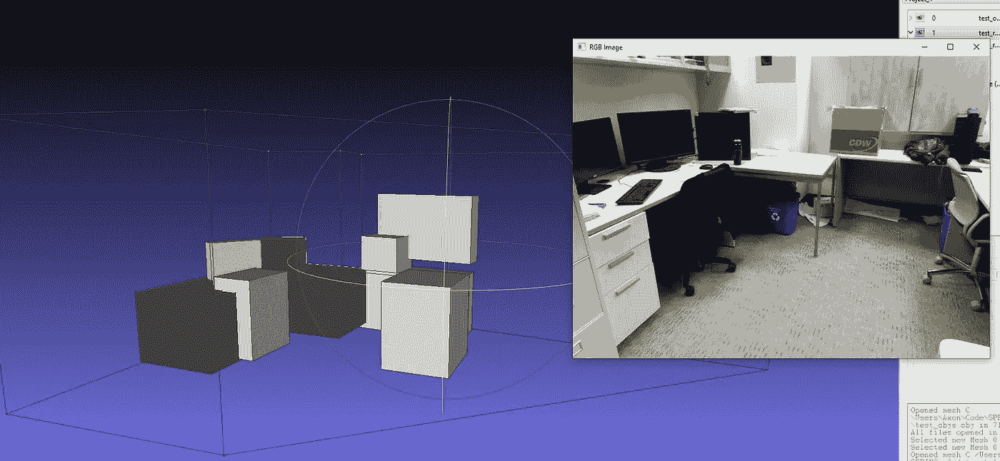

# 使用 Sun RGB-D：带有 2D 和 3D 注释的室内场景数据集

> 原文：[`towardsdatascience.com/using-sun-rgb-d-indoor-scene-dataset-with-2d-3d-annotations-387b9af5c89e?source=collection_archive---------9-----------------------#2024-03-09`](https://towardsdatascience.com/using-sun-rgb-d-indoor-scene-dataset-with-2d-3d-annotations-387b9af5c89e?source=collection_archive---------9-----------------------#2024-03-09)

## 访问 Sun RGB-D 及类似数据集的简单 Python 代码

 [Maxwell .J. Jacobson](https://medium.com/@mjacobson130?source=post_page---byline--387b9af5c89e--------------------------------)

·发表于 [Towards Data Science](https://towardsdatascience.com/?source=post_page---byline--387b9af5c89e--------------------------------) ·阅读时长 9 分钟·2024 年 3 月 9 日

--

从 2D 图像进行 3D 理解是进入更广阔世界的第一步。

随着计算机视觉中的许多基础任务接近解决状态——现在已经有相对完善的、准通用的解决方案可用于图像[分割](https://segment-anything.com/)和[基于文本的生成](https://en.wikipedia.org/wiki/Stable_Diffusion)，对于视觉问答、深度估计和一般物体检测的通用解答也已经取得了显著进展——我和我的许多同事一直在寻找将计算机视觉应用于更大任务的机会。当人类看一个场景时，我们看到的不仅仅是平面的轮廓。我们理解的也不仅是一个个标签。我们能够在 3D 空间中感知和想象。我们看到一个场景，并能以非常完整的方式理解它。这种能力应该是当今计算机视觉系统触手可及的…如果我们能拥有正确的数据的话。

[Sun RGB-D](https://rgbd.cs.princeton.edu/)是一个有趣的图像数据集，创建于 2015 年，满足了对全面场景理解的多种数据需求。该数据集主要收集了室内场景，通过数码相机和四种不同的 3D 扫描仪进行拍摄。相关出版物详细介绍了该数据集的收集方法及其内容。最重要的是，这个数据集包含了大量的数据，其中包括 2D 和 3D 注释。

来源：[*SUN RGB-D：一个 RGB-D 场景理解基准套件*](https://rgbd.cs.princeton.edu/paper.pdf)

使用这个数据集，计算机视觉（CV）和机器学习（ML）算法可以从 2D 图像中学习更深层次的（开个玩笑）特征。更重要的是，使用这样的数据可以为将 3D 推理应用于 2D 图像打开机会。但那是另一个话题。本文章将简单提供访问 Sun RGB-D 数据的基本 Python 代码，供读者在自己的项目中使用这一宝贵资源。

# 数据集布局

从[这里](https://rgbd.cs.princeton.edu/data/SUNRGBD.zip)下载数据集后，你将得到一个类似于下面的目录结构。

这些文件根据收集数据所用的扫描仪类型进行分类。具体来说，Intel RealSense 3D 摄像头用于平板电脑，Asus Xtion LIVE PRO 用于笔记本电脑，而 Microsoft Kinect 1 和 2 则用于桌面电脑。

来源：[*SUN RGB-D: 一个 RGB-D 场景理解基准套件*](https://rgbd.cs.princeton.edu/paper.pdf)

进入“kv2”目录，我们可以看到两个子目录：align_kv2 和 kinect2data。这是 Sun RGB-D 数据集的一个问题……它的目录结构对于每种传感器类型并不一致。在“realsense”中，有四个包含数据的目录：lg、sa、sh 和 shr。而在“xtion”中，目录结构则更为复杂。更糟糕的是，我在数据集的论文、补充材料或网站上找不到清晰的描述，说明这些子目录有什么不同。**如果有人知道答案，请告诉我！**

目前，让我们跳到数据集的一致部分：数据记录。对于 align_kv2，我们有以下内容：

对于所有传感器类型的所有数据记录，这部分在很大程度上是一致的。以下是一些需要关注的重要文件：

+   *annotation2Dfinal*包含最新的 2D 注释，包括多边形物体分割和物体标签。这些注释存储在一个单一的 JSON 文件中，其中包含每个分割中每个点的 x 和 y 2D 坐标，以及物体标签的列表。

+   *annotation3Dfinal*用于 3D 注释。这些注释以边界形状的形式存在——是沿 y 轴（上下方向）对齐的多面体。这些注释也可以在目录中的单一 JSON 文件中找到。

+   *depth*包含传感器收集的原始深度图像。*depth_bfx*包含已清理的副本，解决了传感器的一些限制。

+   原始图像可以在图像目录中找到。完整分辨率、未裁剪的版本也可以在 fullres 文件夹中找到。

+   传感器的外参和内参以类似 numpy 数组的文本文件形式保存。*intrinsics.txt*文件包含内参，而外参则存储在 extrinsics 文件夹中的单一文本文件内。

+   最后，场景类型（如办公室、厨房、卧室等）可以在*scene.txt*文件中找到，文件内容为字符串。

# 设置

首先，我们需要从几种格式的文件中读取数据，主要是 JSON 和 txt 格式。从这些文本文件中，我们需要提取出传感器的外参和内参的 numpy 数组。这里也有很多文件似乎没有遵循严格的命名规范，但它们在同一目录中通常是唯一的，所以`get_first_file_path`函数在这里会很有用。

我还希望这段代码能够输出我们在数据集中找到的房间的简单 3D 模型。这可以为我们提供简单的数据可视化，并帮助我们提取出场景的基本空间特征。为了实现这一目标，我们将使用 OBJ 文件格式，它是表示 3D 几何图形的标准格式。一个 OBJ 文件主要由顶点列表（3D 空间中的点）构成，并且包含这些顶点如何连接以形成面（3D 物体的表面）的信息。OBJ 文件的布局非常简单，首先是顶点，每个顶点以以‘v’开头的行表示，后面跟着顶点的 x、y 和 z 坐标。面通过以‘f’开头的行来定义，列出构成每个面的角落的顶点索引，从而构建 3D 表面。

在我们的上下文中，定义场景空间特征的边界形状是多面体，即具有平面面的 3D 形状。由于 y 维度是轴对齐的——意味着它在所有点中始终代表上下方向——我们可以简化多面体的表示，只使用 x 和 z 坐标来定义顶点，同时使用适用于所有点的全局最小值（min_y）和最大值（max_y）y 值。这种方法假设顶点是成对出现的，其中 x 和 z 坐标保持不变，而 y 坐标在 min_y 和 max_y 之间交替，从而有效地创建了垂直的线段。

`write_obj`函数封装了这一逻辑，用来构建我们的 3D 模型。它首先遍历数据集中的每个边界形状，将顶点及其 x、y 和 z 坐标添加到 OBJ 文件中。对于每一对点（偶数索引表示 min_y，奇数索引表示 max_y，其中 x 和 z 保持不变），该函数写入面定义来连接这些点，形成围绕每个片段的垂直面（例如，围绕顶点 0、1、2、3，然后是 2、3、4、5，依此类推）。如果边界形状有超过两对顶点，则添加一个闭合面，将最后一对顶点连接回第一对顶点，确保多面体正确封闭。最后，函数通过连接所有 min_y 顶点和所有 max_y 顶点，分别为多面体的顶部和底部添加面，从而完成空间特征的 3D 表示。

最后，让我们构建数据集的基本结构，创建一个表示数据集的类（一个包含子目录的目录，每个子目录包含一个数据记录），以及数据记录本身。这个第一个对象有一个非常简单的功能：它会为 ds_dir 中的每个子目录创建一个新的记录对象。

# 访问 2D 分割

访问 2D 分割注释相对简单。我们必须确保加载 annotation2Dfinal 中的 json 文件。一旦它作为 python 字典加载后，我们可以提取场景中每个物体的分割多边形。这些多边形通过它们的 x 和 y 坐标来定义，表示多边形在 2D 图像空间中的顶点。

我们还通过存储每个边界形状包含的物体 ID 来提取物体标签，然后与“objects”列表进行交叉引用。标签和分割都由`get_segments_2d`返回。

注意，转置操作应用于坐标数组，以将数据从一种将所有 x 坐标分组在一起并将所有 y 坐标分组在一起的形状，转换为一种将每对 x 和 y 坐标作为单独的点组合在一起的形状。

# 访问 3D 边界形状

访问 3D 边界形状稍微困难一些。如前所述，它们以 y 轴对齐的多面体形式存储（x 是左右，z 是前后，y 是上下）。在 JSON 中，这被存储为一个具有 min_y 和 max_y 的多边形。可以通过提取每个 2D 点的多边形，并添加两个带有 min_y 和 max_y 的新 3D 点，将其转换为多面体。

JSON 还提供了一个有用的字段，说明边界形状是否是矩形。我已将其保留在我们的代码中，并提供了函数来获取每个物体的类型（沙发、椅子、桌子等）以及场景中可见物体的总数。

# 访问房间布局

最后，房间布局有一个独立的多面体，包围了所有其他物体。算法可以使用这个多面体来理解房间的整体拓扑，包括墙壁、天花板和地板。它的访问方式与其他边界形状类似。

# 完整代码

以下是完整的代码以及一个简短的测试部分。除了可视化来自数据记录之一的 2D 注释外，我们还为场景中每个识别出的物体保存 3D .obj 文件。你可以使用类似[meshlab](https://www.meshlab.net/)这样的程序来可视化输出。传感器的内参和外参也已经在此提取。内参是指影响成像过程的相机内部参数（如焦距、光学中心和镜头畸变），而外参描述的是相机在世界坐标系中的位置和方向。它们对于从 2D 图像准确映射和解释 3D 场景非常重要。

代码也可以在这里找到：[`github.com/arcosin/Sun-RGDB-Data-Extractor`](https://github.com/arcosin/Sun-RGDB-Data-Extractor)。

这个仓库未来可能会更新，也可能不会。我很想添加一些功能，比如将其作为 PyTorch 数据集访问，并支持小批量数据等。如果有人有简单的更新，欢迎提交 PR。

左图：在 meshlab 中展示的简单 3D 场景表示。请注意透明的房间边界形状以及许多以框表示的物体。右图：原始图像。

# 结论

我希望这篇指南能帮助你了解如何使用 Sun RGB-D 数据集。更重要的是，我希望它让你窥见了编写快速简易代码访问数据集的更广泛技能。准备好工具很重要，但了解这些工具的工作原理并熟悉数据集的结构，在大多数情况下能给你带来更多帮助。

# 附加说明

本文介绍了一些易于修改的 Python 代码，用于从 Sun RGB-D 数据集中提取数据。请注意，已经存在[一个官方 MATLAB 工具箱](https://rgbd.cs.princeton.edu/data/SUNRGBDtoolbox.zip)用于该数据集。但由于我不使用 MATLAB，因此没有查看过它。如果你是 MATLAB 用户（MATLABer？MATLABster？MATLABradour？哦……）那么这个工具箱可能更为全面。

我还发现了[**这个**](https://github.com/luiszeni/SUNRGBDtoolbox_python)适用于 Python 的工具。它是一个提取仅包含 2D 特征的好例子。我借用了其中的一些代码，如果你觉得不错，给它点个星吧。

# **参考文献**

本文使用了受[CC-BY-SA](https://paperswithcode.com/dataset/sun-rgb-d)许可的 Sun RGB-D 数据集[1]。该数据集还引用了之前的工作[2, 3, 4]。感谢他们为此做出的杰出贡献。

[1] S. Song, S. Lichtenberg, 和 J. Xiao, “SUN RGB-D：一个 RGB-D 场景理解基准套件”，第 28 届 IEEE 计算机视觉与模式识别会议（CVPR2015）论文集，口头报告。

[2] N. Silberman, D. Hoiem, P. Kohli, R. Fergus, “从 RGBD 图像中进行室内分割和支撑推断”，ECCV，2012 年。

[3] A. Janoch, S. Karayev, Y. Jia, J. T. Barron, M. Fritz, K. Saenko, T. Darrell, “一个类别级别的 3D 物体数据集：将 Kinect 投入实际应用”，ICCV 工作坊：计算机视觉中的消费深度摄像头，2011 年。

[4] J. Xiao, A. Owens, A. Torralba, “SUN3D：一个基于 SfM 和物体标签重建的大空间数据库”，ICCV，2013 年。
