# 时间序列的 VAE

> 原文：[`towardsdatascience.com/vae-for-time-series-1dc0fef4bffa?source=collection_archive---------0-----------------------#2024-08-14`](https://towardsdatascience.com/vae-for-time-series-1dc0fef4bffa?source=collection_archive---------0-----------------------#2024-08-14)

## 使用这个易于训练的模型生成逼真的序列数据

[](https://medium.com/@david.kyle_13073?source=post_page---byline--1dc0fef4bffa--------------------------------)[](https://towardsdatascience.com/?source=post_page---byline--1dc0fef4bffa--------------------------------) [David Kyle](https://medium.com/@david.kyle_13073?source=post_page---byline--1dc0fef4bffa--------------------------------)

·发表于 [Towards Data Science](https://towardsdatascience.com/?source=post_page---byline--1dc0fef4bffa--------------------------------) ·10 分钟阅读·2024 年 8 月 14 日

--


图片来源：[Joe Cook](https://unsplash.com/@joecook?utm_source=medium&utm_medium=referral) 在 [Unsplash](https://unsplash.com/?utm_source=medium&utm_medium=referral)

变分自编码器（VAEs）是一种生成性人工智能，因其能够创建逼真的图像而引起了广泛关注，但它们同样可以生成引人入胜的时间序列数据。标准的 VAE 可以调整以捕捉时间序列数据的周期性和顺序模式，然后用于生成合理的模拟数据。我所建立的模型使用**1-D 卷积层**、**步幅的战略选择**、**灵活的时间维度**以及**季节性相关的先验**来模拟温度数据。

# 目标

我基于来自美国亚利桑那州凤凰城的 50 年[每小时 ERA5 温度数据](https://cds.climate.copernicus.eu/cdsapp#!/dataset/reanalysis-era5-single-levels?tab=overview)训练了一个模型[1]。为了生成有用的数据，模型必须捕捉到原始数据的一些特征：

1.  **季节性概况** — 夏季应该比冬季温暖

1.  **昼夜变化概况** — 白天应该比夜晚温暖

1.  **自相关** — 数据应该平滑，连续的几天应该有相似的温度

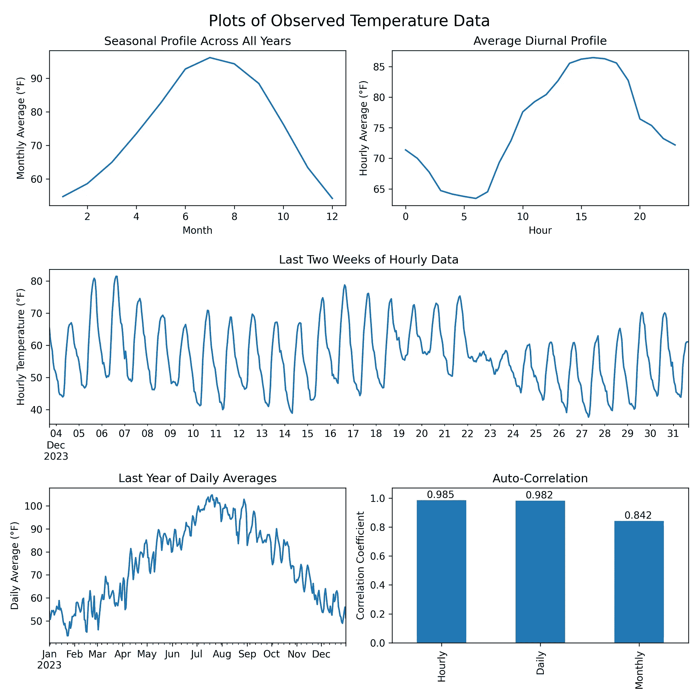

包含修改后的哥白尼气候变化服务信息 [2024]

## 气候变化的影响

如果训练数据是平稳的，没有长期趋势，模型的表现最佳。然而，由于气候变化，温度每十年大约上升 0.7°F——这一数值是从观察数据中得出的，且与[已发布的地图](https://www.climate.gov/news-features/understanding-climate/climate-change-global-temperature)一致，显示了按区域划分的近期升温趋势[2]。为了考虑到温度的上升，我对原始观测数据应用了每十年-0.7°F 的线性变换，以消除向上的趋势。这个调整后的数据集代表了如果假设 2024 年的气候条件，历史温度可能的样貌。对生成数据的解释应考虑这一点。

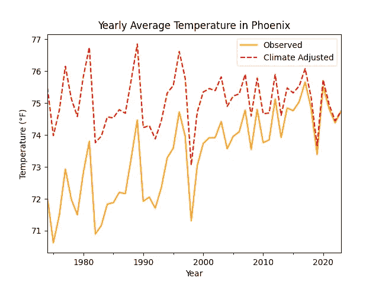

包含修改后的哥白尼气候变化服务信息 [2024]

# 什么是 VAE？

变分自编码器将输入数据的维度减少到一个较小的子空间。VAE 定义了一个编码器，将观察到的输入转换为称为潜变量的压缩形式。然后，一个独立的、镜像的解码器尝试重建原始数据。编码器和解码器共同优化，以便生成一个尽可能少丢失信息的编码。

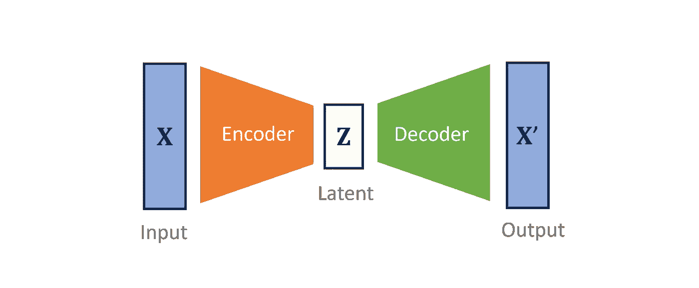

训练中使用的完整损失函数包括：

+   一个 **重建损失**：衡量往返变换的数据与原始输入的匹配程度

+   一个 **正则化项**：衡量潜变量的编码分布与先验分布的匹配程度。

这两个损失项是通过变分推理得出的，试图最大化观察数据的证据下界（ELBO）。查看[这个视频](https://www.youtube.com/watch?v=IXsA5Rpp25w)以获取数学推导 [3]。

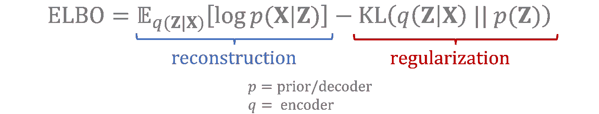

直观上，VAE 在训练数据上进行特征提取，使得由潜变量表示的最重要特征符合定义的先验分布。新数据是通过从潜在分布中采样并解码为原始输入的形式生成的。

查看 Joseph Rocca 的文章，理解变分自编码器，以获取关于 VAE 工作原理的更深入解释 [4]。

## 1-D 卷积层

在建模凤凰城温度数据时，我将我的编码器设计为一个具有一维卷积层的神经网络。每个卷积层将一个核——一个权重矩阵——应用于输入的平移区间。由于整个输入中使用的是相同的核，卷积层被认为是平移不变的，非常适合处理具有重复序列模式的时间序列数据。

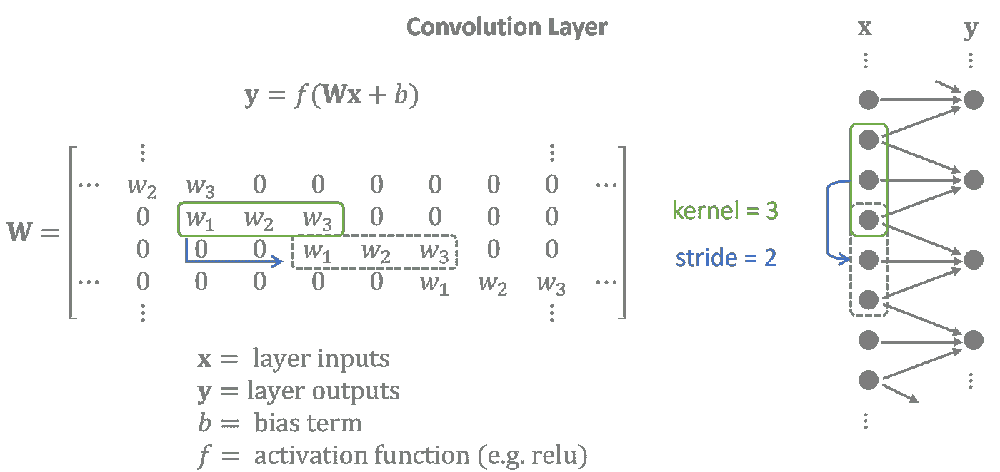

左：卷积层作为矩阵操作 | 右：图形表示 | 通常，输入和输出具有多个特征变量。为了简化，矩阵操作显示了仅包含一个特征的输入和输出之间的卷积。

解码器执行与编码器相反的任务，使用转置的 1 维卷积层，也称为反卷积层。潜在特征被投射到重叠的序列中，以创建一个与输入紧密匹配的输出时间序列。

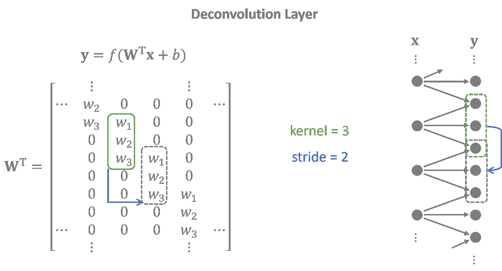

反卷积层的权重矩阵是卷积矩阵的转置。

完整的模型将多个卷积层和反卷积层堆叠在一起。每一层中间的隐藏层扩展了潜在变量的范围，使模型能够捕捉数据中的长远效应。

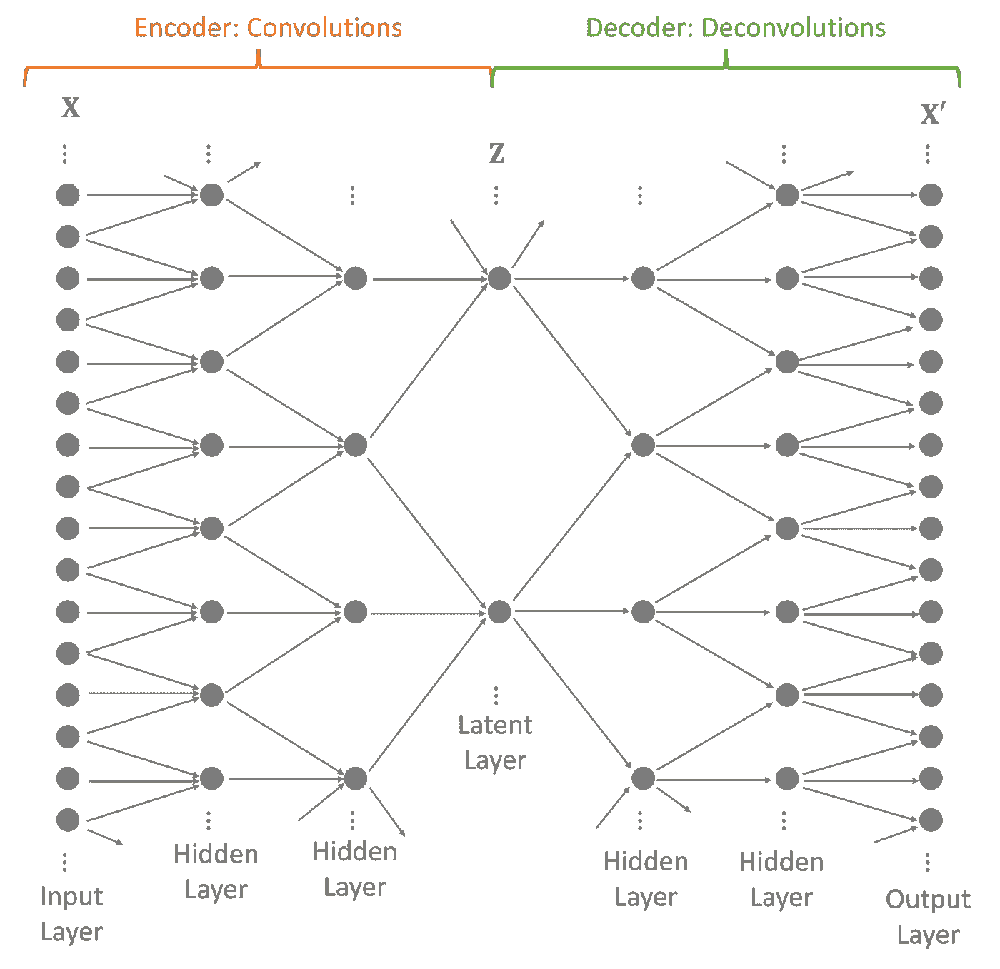

## 战略性步幅

步幅——即位移之间的跳跃——决定了下一层的大小。卷积层使用步幅来缩小输入，反卷积层使用步幅将潜在变量扩展回输入大小。然而，它们还有一个辅助功能——捕捉时间序列中的周期性趋势。

> 你可以战略性地选择卷积层的步幅，以复制数据中的周期性模式。

卷积周期性地应用内核，重复相同的权重，周期等于其步幅。这使得训练过程能够根据输入在周期中的位置自定义权重。

将多个层堆叠在一起，会形成一个由嵌套子卷积组成的更大有效周期。

考虑一个卷积网络，它将每小时的时间序列数据提炼成一个特征空间，每天有四个变量，分别表示早晨、下午、傍晚和夜晚。步幅为 4 的层会为一天中的每个时间点分配独特的权重，这些权重捕捉了隐藏层中的昼夜模式。在训练过程中，编码器和解码器学习到的权重能够复制数据中的每日周期。

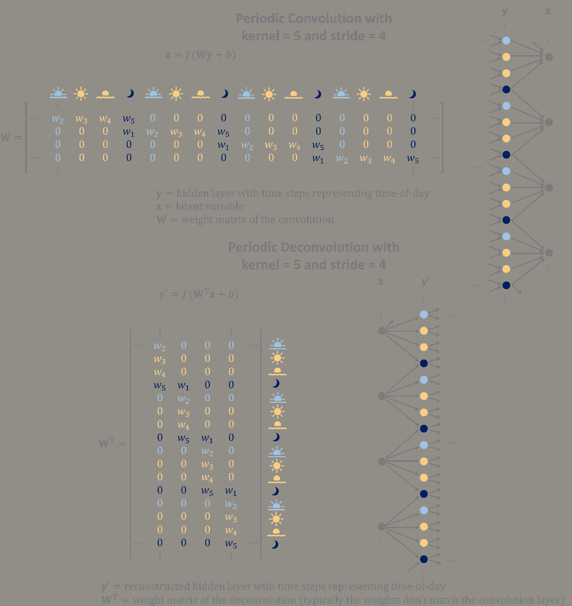

卷积利用输入的周期性特性来构建更好的潜在特征。反卷积将潜在特征转换为重叠、重复的序列，以生成具有周期性模式的数据。

## 灵活的时间维度

图像生成变分自编码器（VAE）通常会预处理成千上万张图像，使其具有固定的宽度和高度。生成的图像将匹配训练数据的宽度和高度。

对于凤凰数据集，我只有一个 50 年的时间序列。为了提高训练效果，我将数据分割成多个序列，最终决定将每个 96 小时的周期分配一个潜在变量。然而，我可能希望生成比 4 天更长的时间序列，并且理想情况下，输出应当是平滑的，而不是在模拟中具有离散的 96 小时块。

幸运的是，Tensorflow 允许你在神经网络中指定不受约束的维度。就像神经网络可以处理任何批次大小一样，你也可以构建模型来处理任意数量的时间步。因此，我的潜在变量也包括一个可以变化的时间维度。在我的模型中，对于输入中的每 96 小时，就会有一个时间步在潜在空间中。

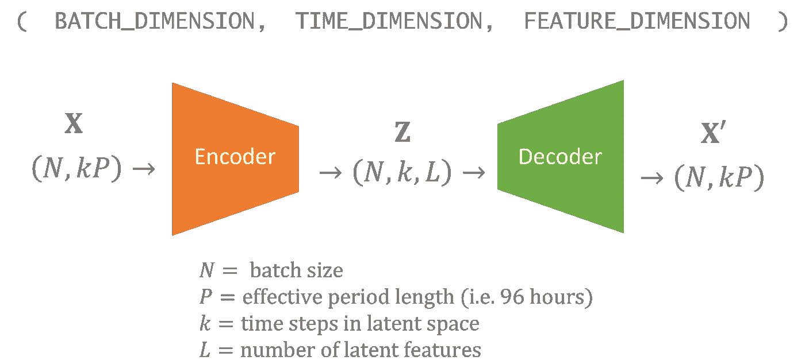

生成新数据就像从先验中采样潜在变量一样简单，你只需选择你希望在时间维度中包含的步数。

> 具有不受约束时间维度的 VAE 可以生成任意长度的数据。

模拟的输出将在你采样的每个时间步上有 4 天，结果会显得平滑，因为卷积层允许输入层溢出到相邻的时间段。

## 季节性依赖先验

在大多数 VAE 中，潜在变量的每个组件假定遵循标准正态分布。这个分布，有时称为先验，经过采样后解码，以生成新数据。在这种情况下，我选择了一个稍微复杂一点的先验，它依赖于年份的时间。

> 从季节性先验中采样的潜在变量将生成具有随年份时间变化特征的数据。

在这个先验下，生成的 1 月数据与 7 月数据看起来非常不同，而来自同一个月的数据会共享许多相同的特征。

我将年份的时间表示为一个角度，*θ*，其中 0°代表 1 月 1 日，180°代表 7 月初，360°则回到 1 月。先验是一个正态分布，其均值和对数方差是*θ*的三次三角多项式，其中多项式的系数是在训练过程中与编码器和解码器共同学习的参数。

先验分布参数是*θ*的周期函数，且良好的周期函数可以通过足够高阶的三角多项式逼近到任意精度。[5]

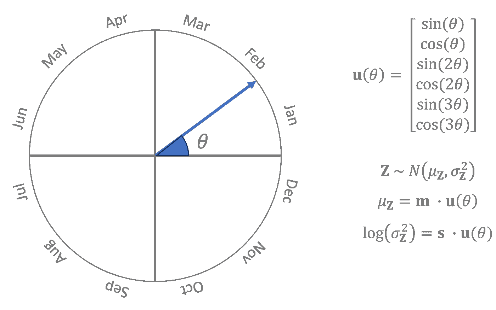

left: *θ*的可视化 | right: Z 的先验分布，表示为参数 m 和 s

季节性数据仅用于先验分布，并不影响编码器或解码器。完整的概率依赖关系在这里以图形方式展示。

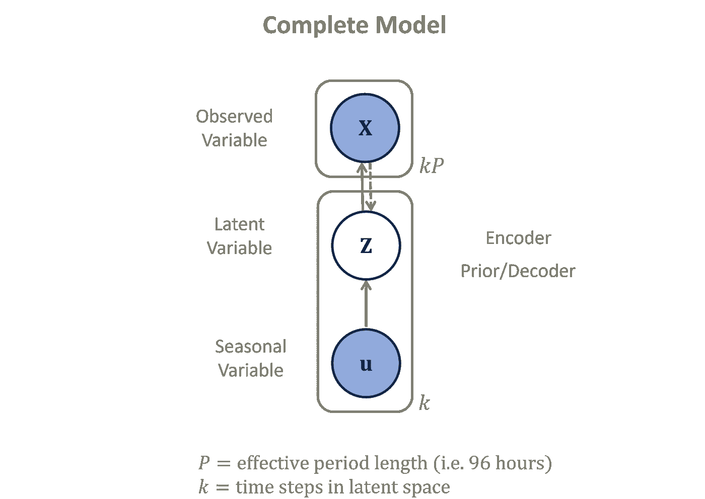

包括先验的概率图模型

# 实现

我使用 Python 中的 Tensorflow 训练了这个模型。

```py
from tensorflow.keras import layers, models
```

## 编码器

输入定义了一个灵活的时间维度。在 Keras 中，你可以使用`None`来指定一个不受约束的维度。

使用`'same'`填充会将零附加到输入层，以便输出大小与输入大小除以步幅后的大小相匹配。

```py
inputs = layers.Input(shape=(None,)) # (N, 96*k)
x = layers.Reshape((-1, 1))(inputs)  # (N, 96*k, 1)

# Conv1D parameters: filters, kernel_size, strides, padding
x = layers.Conv1D(40, 5, 3, 'same', activation='relu')(x) # (N, 32*k, 40)
x = layers.Conv1D(40, 3, 2, 'same', activation='relu')(x) # (N, 16*k, 40)
x = layers.Conv1D(40, 3, 2, 'same', activation='relu')(x) # (N, 8*k, 40)
x = layers.Conv1D(40, 3, 2, 'same', activation='relu')(x) # (N, 4*k, 40)
x = layers.Conv1D(40, 3, 2, 'same', activation='relu')(x) # (N, 2*k, 40)
x = layers.Conv1D(20, 3, 2, 'same')(x) # (N, k, 20)

z_mean = x[: ,:, :10]   # (N, k, 10)
z_log_var = x[:, :, 10:] # (N, k, 10)
z = Sampling()([z_mean, z_log_var]) # custom layer sampling from gaussian

encoder = models.Model(inputs, [z_mean, z_log_var, z], name='encoder')
```

`Sampling()`是一个自定义层，用于从给定的均值和对数方差的正态分布中采样数据。

## 解码器

反卷积通过`Conv1DTranspose`进行。

```py
# input shape: (batch_size, time_length/96, latent_features)
inputs = layers.Input(shape=(None, 10)) # (N, k, 10)

# Conv1DTranspose parameters: filters, kernel_size, strides, padding
x = layers.Conv1DTranspose(40, 3, 2, 'same', activation='relu')(inputs) # (N, 2*k, 40)
x = layers.Conv1DTranspose(40, 3, 2, 'same', activation='relu')(x) # (N, 4*k, 40)
x = layers.Conv1DTranspose(40, 3, 2, 'same', activation='relu')(x) # (N, 8*k, 40)
x = layers.Conv1DTranspose(40, 3, 2, 'same', activation='relu')(x) # (N, 16*k, 40)
x = layers.Conv1DTranspose(40, 3, 2, 'same', activation='relu')(x) # (N, 32*k, 40)
x = layers.Conv1DTranspose(1,  5, 3, 'same')(x) # (N, 96*k, 1)

outputs = layers.Reshape((-1,))(x) # (N, 96*k)

decoder = models.Model(inputs, outputs, name='decoder')
```

## 先验

先验期望输入已经是[sin(*θ*), cos(*θ*), sin(2*θ*), cos(2*θ*), sin(3*θ*), cos(3*θ*)]的形式。

`Dense` 层没有偏置项，这是为了防止先验分布偏离零过远，或其整体方差过高或过小。

```py
# seasonal inputs shape: (N, k, 6)
inputs = layers.Input(shape=(None, 2*3)) 

x = layers.Dense(20, use_bias=False)(inputs) # (N, k, 20)
z_mean = x[:, :, :10]  # (N, k, 10)
z_log_var = x[:, :, 10:] # (N, k, 10)
z = Sampling()([z_mean, z_log_var]) # (N, k, 10)

prior = models.Model(inputs, [z_mean, z_log_var, z], name='seasonal_prior')
```

## 完整模型

损失函数包含重建项和潜在正则化项。

函数`log_lik_normal_sum`是一个自定义函数，用于计算在给定重建输出的情况下，观察数据的正态对数似然值。计算对数似然需要围绕解码输出的噪声分布，假设其为正态分布，且对数方差由`self.noise_log_var`表示，在训练过程中学习得到。

对于正则化项，`kl_divergence_sum`计算两个高斯分布之间的 Kullback–Leibler 散度——在这种情况下，是潜在编码分布与先验分布之间的散度。

```py
class VAE(models.Model):
    def __init__(self, encoder, decoder, prior, **kwargs):
        super(VAE, self).__init__(**kwargs)
        self.encoder = encoder
        self.decoder = decoder
        self.prior = prior
        self.noise_log_var = self.add_weight(name='var', shape=(1,), initializer='zeros', trainable=True)

    @tf.function
    def vae_loss(self, data):
        values, seasonal = data
        z_mean, z_log_var, z = self.encoder(values)
        reconstructed = self.decoder(z)
        reconstruction_loss = -log_lik_normal_sum(values, reconstructed, self.noise_log_var)/INPUT_SIZE
        seasonal_z_mean, seasonal_z_log_var, _ = self.prior(seasonal)
        kl_loss_z = kl_divergence_sum(z_mean, z_log_var, seasonal_z_mean, seasonal_z_log_var)/INPUT_SIZE
        return reconstruction_loss, kl_loss_z

    def train_step(self, data):
        with tf.GradientTape() as tape:
            reconstruction_loss, kl_loss_z = self.vae_loss(data)
            total_loss = reconstruction_loss + kl_loss_z

        gradients = tape.gradient(total_loss, self.trainable_variables)
        self.optimizer.apply_gradients(zip(gradients, self.trainable_variables))

        return {'loss': total_loss}
```

要查看完整实现，请访问我的[Github 仓库](https://github.com/davidthemathman/vae_for_time_series)。

# 结果

在训练模型后，生成的数据与原始温度数据的季节性/日变化轮廓以及自相关性匹配。

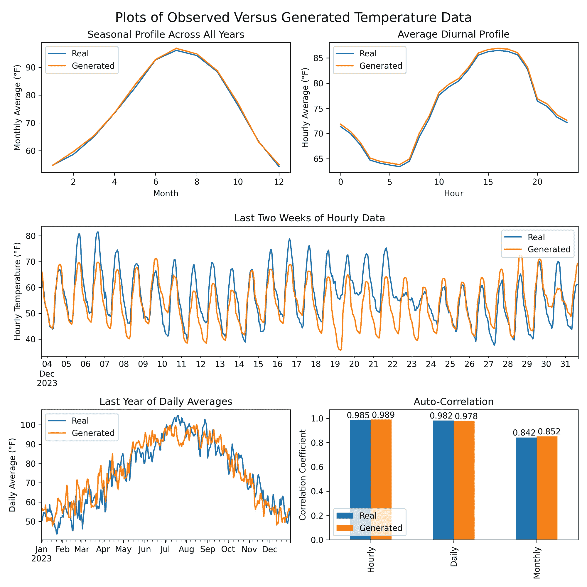

包含修改后的哥白尼气候变化服务信息[2024]

# 结论

构建生成时间序列建模技术是一个关键领域，其应用不仅仅限于数据模拟。我分享的方法可以适应于数据插补、异常检测和预测等应用。

通过使用 1 维卷积层、战略性步幅、灵活的时间输入和季节性先验，你可以构建一个 VAE，复制时间序列中的复杂模式。让我们共同努力，优化时间序列建模的最佳实践。

在评论中分享你在使用 VAE 和/或生成 AI 进行时间序列建模方面的经验、问题或见解。

所有图像均由作者创作，除非另有说明。

[1] Hersbach, H., Bell, B., Berrisford, P., Biavati, G., Horányi, A., Muñoz Sabater, J., Nicolas, J., Peubey, C., Radu, R., Rozum, I., Schepers, D., Simmons, A., Soci, C., Dee, D., Thépaut, J-N. (2023): ERA5 每小时数据（单一层级，从 1940 年至今）。哥白尼气候变化服务（C3S）气候数据存储（CDS），DOI：[10.24381/cds.adbb2d47](https://cds.climate.copernicus.eu/cdsapp#!/dataset/10.24381/cds.adbb2d47?tab=overview)（访问日期：2024 年 8 月 1 日）

[2] Lindsey, R., & Dahlman, L. (2024 年 1 月 18 日). *气候变化：全球气温*. Climate.gov. [`www.climate.gov/news-features/understanding-climate/climate-change-global-temperature`](https://www.climate.gov/news-features/understanding-climate/climate-change-global-temperature)

[3] Sachdeva, K. (2021 年 1 月 26 日). *证据下界（ELBO）——清晰解释！* [视频]. YouTube. [`www.youtube.com/watch?v=IXsA5Rpp25w`](https://www.youtube.com/watch?v=IXsA5Rpp25w)

[4] Rocca, J. (2019 年 9 月 23 日). *理解变分自编码器 (VAEs)*. Towards Data Science. `towardsdatascience.com/understanding-variational-autoencoders-vaes-f70510919f73`

[5] Baidoo, F. A. (2015 年 8 月 28 日). *傅里叶级数的统一收敛性* (REU 报告). 芝加哥大学. [`math.uchicago.edu/~may/REU2015/REUPapers/Baidoo.pdf`](https://math.uchicago.edu/~may/REU2015/REUPapers/Baidoo.pdf)
