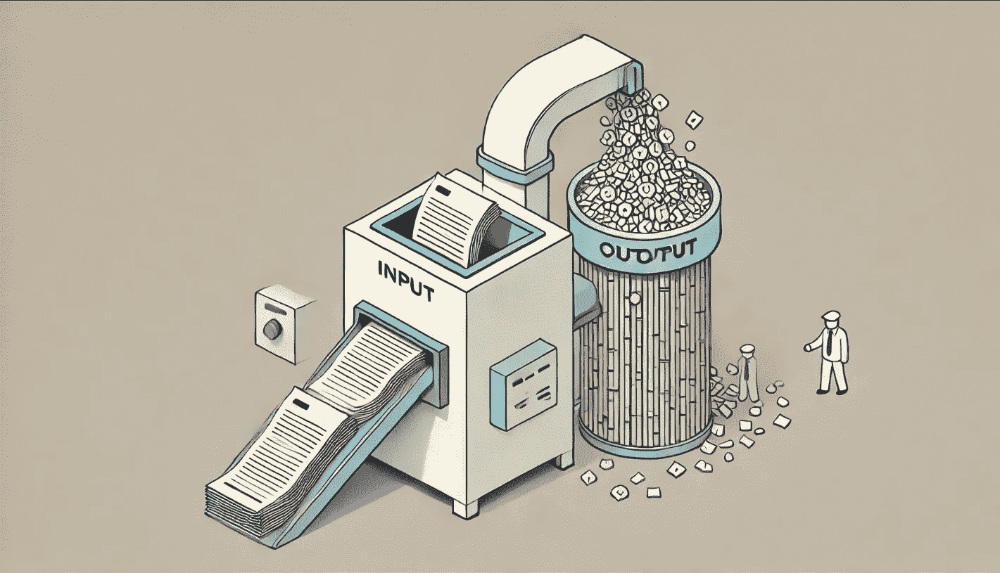

# 向量嵌入是有损的。我们该怎么办？

> 原文：[`towardsdatascience.com/vector-embeddings-are-lossy-heres-what-to-do-about-it-4f9a8ee58bb7?source=collection_archive---------0-----------------------#2024-09-28`](https://towardsdatascience.com/vector-embeddings-are-lossy-heres-what-to-do-about-it-4f9a8ee58bb7?source=collection_archive---------0-----------------------#2024-09-28)

## AI 系统并不完美（哎呀！），这就是其中的一些原因。

[](https://medium.com/@briangodsey?source=post_page---byline--4f9a8ee58bb7--------------------------------)[](https://towardsdatascience.com/?source=post_page---byline--4f9a8ee58bb7--------------------------------) [Brian Godsey](https://medium.com/@briangodsey?source=post_page---byline--4f9a8ee58bb7--------------------------------)

·发表于 [Towards Data Science](https://towardsdatascience.com/?source=post_page---byline--4f9a8ee58bb7--------------------------------) ·阅读时间 17 分钟·2024 年 9 月 28 日

--



由作者使用 DALL-E 创建。过程中有一些信息丢失。

当我们将企业级 AI 系统投入生产时，我们不应期望它们像搜索引擎那样工作，也不像精确的词汇和短语数据库一样工作。是的，AI 系统通常看起来具有与（非向量）文档存储或搜索引擎相同的搜索能力，但在背后，它们的工作原理却完全不同。如果我们试图将 AI 系统——主要由向量存储和大型语言模型（LLM）构成——当作数据是结构化的，查询结果是精确的来使用，那么我们可能会得到一些出乎意料且令人失望的结果。

AI 系统通常不会“记住”数据本身。即使是 RAG 系统，它们保留了主要文档集的完整文本，也使用向量搜索进行检索，这一过程强大但不完美且不精确。在几乎所有的 AI 系统中，都会有一定量的信息被“丢失”。

当然，这就引出了一个问题：我们应该如何处理这种信息丢失？简短的回答是：我们应该识别那些受益于保留某些类型信息的使用案例，并在可能的情况下有意识地保留这些信息。通常，这意味着将确定性、结构化、非 AI 的软件流程整合到我们的系统中，目的是在需要时保留结构性和精确性。

在本文中，我们讨论了这个问题的细微差别以及一些潜在的解决方案。针对特定问题有许多可能的解决方法，例如实施知识图谱来构建主题和概念的结构，结合向量存储使用关键词搜索功能，或根据您的具体用例定制数据处理、分块和加载方式。除此之外，正如我们下面所讨论的，一种最具通用性和易于实施的方法是通过使用文档元数据，以结构化的方式来导航知识库，从而为非结构化的文档向量存储添加结构。文档链接和标签的向量图可以是一种强大、轻量、高效且易于实施的方式，将有用的结构重新引入到您的非结构化数据中。

# AI 系统大多数是非结构化的、不精确的，并且模糊不清。

在围绕大量非结构化数据构建的系统中，信息丢失是不可避免的。诊断这种信息丢失发生的原因、方式和位置，可以帮助我们改进系统，打造更好的应用。

关于 AI 系统中的信息保留与丢失，三个最需要注意的要点是：

1.  向量嵌入无法保留原文中的 100%的信息。

1.  LLM 是非确定性的，这意味着文本生成过程中会包含一定的随机性。

1.  很难预测哪些信息会丢失，哪些会被保留。

第一个意味着在文档进入向量存储的过程中，一些信息会丢失；第二个意味着在通过 LLM 进行检索时，部分信息会变得随机且不准确；第三个意味着我们可能不知道何时会出现问题，也不知道问题有多严重。

下面，我们将深入探讨上述第一点：向量嵌入本身是有损的。我们将讨论有损嵌入通常是不可避免的，它如何影响我们的应用程序，以及——与其在 LLM 框架内尝试恢复或防止丢失——更有价值的是，我们应当保持对信息丧失过程的意识，并在我们的 AI 系统中添加适合我们特定用例的结构化信息层，依托现有的向量嵌入驱动的 AI 系统的能力。

接下来，让我们更深入地探讨信息丢失在向量嵌入中的工作原理。

# 向量嵌入是有损的。

文本的向量表示——LLM 使用的嵌入——包含大量的信息，但这些信息必然是近似的。当然，也可以构建一个确定性 LLM，其向量代表精确的文本，可以在给定相同的初始向量时一字不差地反复生成。但是，这样的 LLM 将会是有限的，并且并不是很有用。为了使 LLM 及其向量嵌入在我们今天的工作方式中发挥作用，嵌入过程需要更多地捕捉语言的微妙概念，而非精确的单词本身。我们希望 LLM“理解”两句话虽然使用了不同的词语，但本质上表达的是相同的概念。例如，“我喜欢人工智能”和“AI 很棒”基本上告诉我们相同的信息，而向量和嵌入的主要作用是捕捉这些信息，而不是记住具体的单词。

向量嵌入具有高维度且精确，能够在广阔的概念空间内封装复杂的思想。这些维度可能达到数百或甚至数千，每个维度都在微妙地编码语言的各个方面——从语法和语义到语用学和情感。这种高维度使得模型能够在广泛的思想谱系中进行导航和表示，从而使其能够理解文本中嵌入的复杂和抽象概念。

尽管这些嵌入的精度很高，但从给定向量生成文本仍然是一个非确定性的过程。这主要是由于生成文本的模型具有概率性质。当一个大语言模型（LLM）生成文本时，它会基于向量中包含的信息，计算接下来可能出现的每个单词的概率。这个过程融入了随机性和上下文推理，这意味着即使使用相同的起始向量，每次生成的文本输出也可能不同。这种变异性对于生成自然流畅的语言至关重要，使其能够适应不同的语境，但也意味着文本的精确重现并非总是可能的。

虽然向量捕捉了文本意义的精髓，但在向量嵌入过程中，特定的单词和信息往往会丢失。这种丢失发生是因为嵌入被设计为从文本中进行概括，捕捉其整体意义，而非精确的措辞。因此，文本中的一些细节或不那么突出的主题可能在向量空间中没有得到充分表示。这一特性可能会导致在尝试从大量语料中检索特定事实或确切术语时遇到挑战，因为系统可能会优先考虑整体语义相似性，而不是精确的单词匹配。

我们可能会遇到信息丢失的两种最常见方式是：

1.  文本中的旁支细节在文本整体的语义意义中“丢失”了。

1.  在嵌入过程将特定关键字或短语转化为语义空间时，它们的意义被“丢失”了。

这两个案例中的第一个涉及文档（或片段）中实际细节的“丢失”，因为嵌入过程未能很好地捕捉到这些细节。第二个案例主要涉及信息的特定措辞的丢失，而不一定是实际细节的丢失。当然，这两种类型的丢失在各自的方式中都可能具有重要性并且会引发问题。

最近的文章 嵌入有点浅（同样出现在本出版物中）提供了很多有趣的例子，展示了嵌入如何丢失或错过细节，方法是通过测试在几个流行嵌入算法中相对较小的文本块之间的搜索和检索结果。

接下来，让我们通过代码和数据来看一些活生生的例子，演示这两种丢失类型如何发生。

# 案例研究：AI 产品页面

对于这个案例研究，我创建了一个虚构公司 **Phrase AI** 网站的产品页面数据集。Phrase AI 构建 LLM，并将其作为服务提供。其前三个产品是 **Phrase Flow**、**Phrase Forge** 和 **Phrase Factory**。Phrase Flow 是公司的旗舰 LLM，适用于一般用例，但在创意内容方面特别出色。其他两个产品是专业的 LLM，各自有自己的优缺点。

该 HTML 文档数据集由一个 `phrase.ai`（虚构）的主页、每个 LLM 的一个产品页面（共三个）以及网站上的四个页面组成：**公司目标**、**进行中的工作**、**入门指南** 和 **使用案例**。非产品页面主要集中在旗舰产品 Phrase Flow，而每个产品页面则专注于相应的 LLM。大多数文本是标准的网页文案，由 ChatGPT 生成，但文档中有一些特征对我们在此的目的非常重要。

最重要的是，**每个产品页面都包含有关旗舰产品 Phrase Flow 的重要信息**。具体来说，两个专业 LLM 的产品页面上都包含警告，提示不要将 Phrase Flow 模型用于特定目的。Phrase Forge 产品页面的底部包含以下文字：

```py
Special Strengths: Phrase Forge is exceptionally good at creating a 
complete Table of Contents, a task that general models like Phrase 
Flow do not excel at. Do not use Phrase Flow for Tables of Contents.
```

而且，Phrase Factory 产品页面的底部包含以下文字：

```py
Special Strengths: Phrase Factory is great for fact-checking and 
preventing hallucinations, far better than more creative models like 
Phrase Flow. Do not use Phrase Flow for documents that need to be factual.
```

当然，很容易说 Phrase AI 应该在他们的 Phrase Flow 页面上，而不仅仅是在其他两个产品的页面上放置这些警告。但我认为我们都见过关键信息出现在网站或文档中“错误”的地方，而即便一些信息不在文档集的最佳位置时，我们仍然希望我们的 RAG 系统能够很好地工作。

虽然这个数据集是虚构的，并且非常小，但我们已经设计它来清晰地说明在现实案例中可能非常常见的问题，这些问题在较大的数据集上可能很难诊断。接下来，让我们更仔细地研究这些问题。

# 旁枝末节的细节可能会被埋藏在语义空间中

如我前面所述，向量嵌入是有损的，预测哪些信息会以这种方式丢失是很困难的。所有信息都面临丢失的风险，但有些信息丢失的可能性更大。与文档的主要主题直接相关的细节通常更可能被捕捉到嵌入中，而偏离主要主题的细节则更可能丢失或通过向量检索难以找到。

在上述案例研究中，我们突出展示了关于 Phrase Flow 产品的两条信息，这些信息出现在其他两个型号的产品页面上。这两条警告措辞非常强烈，使用了“不要将 Phrase Flow 用于……”的字眼，可能对于回答有关 Phrase Flow 模型功能的查询至关重要。但它们出现在并非主要关于 Phrase Flow 的文档中，因此，对于这些文档来说，它们是“旁枝末节”的细节。

为了测试一个典型的 RAG 系统如何处理这些文档，我们使用 LangChain 的`GraphVectorStore`和 OpenAI 的 API 构建了一个 RAG 管道。代码可以在[这个 Colab 笔记本](https://drive.google.com/file/d/1n01w3hZ6VJN0zmQybeJ9UkgAffqMNgPX/view?usp=sharing)中找到。

我们可以查询系统关于 Phrase Flow 的弱点，并得到以下结果：

```py
Question:
What are some weaknesses of Phrase Flow?

Retrieved documents:
['https://phrase.ai/products/phraseflow',
'https://phrase.ai/usecases',
'https://phrase.ai/ongoingwork',
'https://phrase.ai/purpose']

LLM response:
The provided context does not mention any specific weaknesses of
Phrase Flow.
```

请注意，我们将检索器设置为获取排名前四的文档——即八个文档中的一半。包含有关 Phrase Flow 警告的两个产品页面并未出现在这些结果中，因此 LLM 的响应中没有关于 Phrase Flow 弱点的上下文。我们对于其他措辞以及询问 Phrase Flow 的“问题”或“缺陷”的其他查询也得到了类似的结果。更多示例请见笔记本。

如果我们不将检索限制为四个文档，我们将得到以下结果，包括所有八个文档的检索排名：

```py
Question:
What are some weaknesses of Phrase Flow?

Retrieved documents:
['https://phrase.ai/products/phraseflow',
'https://phrase.ai/usecases',
'https://phrase.ai/ongoingwork',
'https://phrase.ai/purpose',
'https://phrase.ai/gettingstarted',
'https://phrase.ai/products/phraseforge',
'https://phrase.ai/products/phrasefactory',
'https://phrase.ai']

LLM response:
Phrase Flow is not ideal for creating Tables of Contents or for
documents that need to be factual. It may not excel in generating
detailed, structured writing for technical guides, reports, or
research papers, as these tasks are better suited for Phrase Forge.
Additionally, Phrase Flow might not be the best choice for answering
questions quickly or retrieving information in real-time, as Phrase
Factory is specifically designed for those needs.
```

值得注意的是，包含有关 Phrase Flow 警告的 Phrase Forge 和 Phrase Factory 这两个产品页面，在检索结果中分别排名第 6 和第 7。大致来说，这两条警告的可发现性较低，因为它们被“埋藏”在主要捕捉与每个页面主题相关的信息的向量嵌入中：即 Phrase Forge 或 Phrase Factory。

然而，如果我们将查询重新表述为与警告措辞“不要将 Phrase Flow 用于……”更为一致的语义，我们就能得到我们想要并且预期的结果：

```py
Question:
When should I not use Phrase Flow?

Retrieved documents:
['https://phrase.ai/products/phraseflow',
'https://phrase.ai/products/phraseforge',
'https://phrase.ai/products/phrasefactory',
'https://phrase.ai/usecases']

LLM response:
You should not use Phrase Flow for creating documents that need to be
factual, such as technical guides, research papers, white papers, or
any text that requires precise language and detailed structure. For
these types of documents, Phrase Forge would be more appropriate.
Additionally, Phrase Flow is not ideal for creating Tables of
Contents.
```

在这里，检索似乎对查询的特定措辞非常敏感，“不要使用 Phrase Flow”这一短语将我们引向了在语义向量空间中更接近我们需要的文档。但我们事先并不会知道这一点。我们并不清楚自己究竟在寻找什么，完全依赖我们的 RAG 堆栈来帮助我们找到它。

在下面，我们讨论一些可能的解决方案，旨在解决这种由于语义向量丢失导致的埋藏信息问题。但首先，让我们看看另一种方式，丢失的向量如何在 RAG 系统中引发反直觉行为。

# 向量检索不是搜索引擎或关键词搜索

许多用户往往期望 AI 和 RAG 系统能够精确匹配名称、关键词和短语。我们习惯了传统的搜索引擎，而且我们有着明确的感觉，AI 强大得多，那它为什么不能找到我们想要的精确匹配呢？

如前所述，向量搜索在本质上与搜索引擎、文本搜索以及其他传统的非 AI 数据查询方法有着根本的不同——这些方法依赖搜索算法进行精确匹配，且支持的模糊搜索操作有限。虽然向量搜索确实常常能找到特定的单词和短语，但无法保证完全准确，因为向量存在于语义空间中，而将文本嵌入向量是一个有损的过程。

最有可能遭遇某种信息丢失的单词和短语，是那些语义含义不明确或模糊的词汇。我们在案例研究的数据集中包含了此类例子。具体来说，以下文本出现在我们虚构公司 Phrase AI 的“正在进行的工作”页面的末尾：

```py
COMING SOON: Our newest specialized models Flow Factory, Flow Forge, 
and Factory Forge are in beta and will be released soon!
```

这是数据集中唯一提到这些即将发布模型的地方。 “Flow Factory”、 “Flow Forge”和“Factory Forge”不仅是产品线中其他名称的混淆版，它们也是字典单词的简单组合。例如，“Flow Factory”具有超越产品名称的语义含义，包含了“flow”和“factory”两个词分别所包含的一些广为人知的含义。与此相比，一个像“FloFaktoree”这样的专有拼写几乎没有什么固有的语义含义，AI 系统可能会以完全不同的方式对待它——并且更可能作为一个与其他任何事物都不相关的术语，更容易被发现。

如果我们专门询问“Flow Forge”或“Factory Forge”，我们会得到如下结果：

```py
Question:
What is Flow Forge?

Retrieved documents:
['https://phrase.ai/products/phraseforge',
'https://phrase.ai/usecases',
'https://phrase.ai/ongoingwork',
'https://phrase.ai/products/phraseflow']

LLM response:
Flow Forge is a new specialized model that is currently in beta and
will be released soon.
```

因此，系统成功检索到了一个文档——关于“正在进行的工作”页面，它包含了“Flow Forge”的引用，但它是排名第三的检索文档。在语义空间中，另外两个文档看起来更相关，尽管它们根本没有提到“Flow Forge”。在大型数据集上，很容易想象名称、术语、关键词和短语会在语义空间中被埋没或“丢失”，这种现象很难诊断。

# 如何处理有损向量？

我们一直在讨论有损向量，仿佛它们是需要解决的问题。当然，有些问题确实源于向量的“有损”特性，但向量搜索和 AI 系统依赖使用向量嵌入将文档从文本转换到语义空间，这一过程必然会丧失一些文本信息，但也带来了语义搜索的强大能力。所以，“有损”向量是一种特性，而非缺陷。即使有损向量不是缺陷，我们仍然需要理解它们的优点、缺点和限制，才能知道它们能够做什么，以及在何时它们可能以意想不到的方式给我们带来惊讶。

如果你发现以上描述的问题出现在你的 AI 系统中，根本原因很可能不是向量搜索表现不佳。你可以尝试寻找更适合的嵌入方法，但这是一个复杂且不透明的过程，通常有更简单的解决方案。

上述问题的根本原因在于，我们常常试图让向量搜索执行它并未设计的任务。因此，解决方案是将功能构建到你的技术栈中，添加你在特定使用场景下所需的能力，同时与向量搜索一起使用。

## 交替分块和嵌入方法

在处理文档加载和嵌入方法时，有许多选择。我们可以通过选择与我们的数据集和使用场景高度契合的方法来防止在嵌入过程中丢失一些信息。以下是几种这样的替代方案：

**优化分块策略 —** 分块策略决定了文本如何被分割成块以供处理和检索。优化分块不仅仅是考虑大小或边界问题；它还包括以与内容中的主题元素或逻辑划分一致的方式对文本进行分割。这种方法确保每个分块代表一个完整的思想或主题，有助于生成更具连贯性的嵌入，并提高 RAG 系统的检索准确性。

**多向量嵌入技术** — 标准嵌入方法通常将段落简化为一个单一的向量表示，这可能无法捕捉到段落的多维特性。多向量嵌入技术通过使用模型从一个段落生成多个嵌入来解决这个限制，每个嵌入对应段落可能回答的不同解释或问题。这种策略增强了数据表示的维度丰富性，从而使得在不同查询类型下的检索更加精确。

**ColBERT：基于标记的嵌入** — [ColBERT (BERT 上的上下文化晚期交互)](https://arxiv.org/abs/2004.12832)是一种嵌入实践，在这种方法中，段落中的每个标记都有自己的嵌入。这种细粒度的方法使得每个单独的标记——特别是重要或独特的关键词——能够对检索过程产生更大的影响，类似于关键词搜索的精确性，同时利用现代 BERT 模型的上下文理解。尽管 ColBERT 对计算资源的要求较高，但它通过在嵌入中保留关键术语的重要性，可以提供更优的检索性能。

**多头 RAG 方法** —— 基于变换器架构的能力，[多头 RAG](https://arxiv.org/abs/2406.05085)利用变换器的多个注意力头为每个查询或段落生成多个嵌入。每个头可以强调文本的不同特征或方面，从而生成一个多样化的嵌入集合，捕捉信息的各个维度。这种方法通过提供更丰富的语义线索来增强系统处理复杂查询的能力，这些线索可以在生成响应时为模型提供帮助。

## 在你的 AI 堆栈中构建结构

向量搜索和 AI 系统非常适合处理非结构化知识和数据，但大多数使用场景都能从 AI 堆栈中的一些结构中受益。

一个非常明确的例子是：如果你的使用场景和用户依赖于关键词搜索和精确文本匹配，那么将文档存储与文本搜索功能集成可能是个不错的主意。通常情况下，集成经典的文本搜索比让向量存储成为一个高度可靠的文本搜索工具要便宜、更加稳健，而且更容易。

知识图谱也是将结构引入 AI 堆栈的另一种有效方式。如果你已经拥有或能够构建一个适合你使用场景的高质量图谱，那么构建一些图谱功能，[例如**图谱 RAG**](https://www.datastax.com/guides/graph-rag)，可以提升你 AI 系统的整体效用。

在许多情况下，**我们的原始数据集可能具有固有的结构**，但我们在向量搜索中并没有充分利用它。几乎所有文档结构在数据准备过程中，都会在加载到向量存储之前被剥离。HTML、PDF、Markdown 和大多数其他文档类型都包含可以被利用的结构元素，从而使我们的 AI 系统变得更好、更可靠。在下一部分，我们将看看这如何发挥作用。

# 通过文档链接和标签添加一层结构

回到我们上面的案例研究，我们可以利用 HTML 文档的结构来使我们的向量搜索和 RAG 系统变得更好、更可靠。特别是，我们可以利用 HTML 文档中的超链接来连接相关的实体和概念，确保我们通过向量存储中的所有相关文档获得全貌。请参阅这篇文章了解图谱 RAG 中文档链接的介绍。

值得注意的是，在我们的文档集中，所有产品名称都链接到产品页面。每当页面上提到三个产品中的任何一个时，产品名称文本都会超链接到相应的产品页面。而且所有产品页面之间都会相互链接。

我们可以利用这种链接结构，通过向量图遍历和[`GraphVectorStore`在 LangChain 中的实现](https://api.python.langchain.com/en/latest/community_api_reference.html#module-langchain_community.graph_vectorstores)。

这个实现使我们能够轻松地构建基于文档之间超链接的知识图谱，然后遍历这个图谱，以拉取与给定文档直接相关的文档。在实际操作中（以及背后的机制），我们首先通过向量搜索执行标准的文档检索，然后遍历检索到的文档中的链接，从而拉取更多相关文档，无论这些文档是否在向量搜索中显示为“相关”。通过这种实现，检索不仅获取与查询最语义相关的一组文档，还包括那些直接链接的文档，这些文档可能为回答查询提供有价值的辅助信息。

将检索从我们的使用场景重新配置为通过从每个文档出发的单步链接遍历图（`depth=1`），我们可以从原始查询中得到以下结果：

```py
Question:
What are some weaknesses of Phrase Flow?

Retrieved documents:
['https://phrase.ai/products/phraseflow',
'https://phrase.ai/ongoingwork',
'https://phrase.ai/usecases',
'https://phrase.ai/purpose',
'https://phrase.ai/products/phrasefactory',
'https://phrase.ai/products/phraseforge']

LLM response:
Phrase Flow is not ideal for documents that need to be factual or for
creating a complete Table of Contents. Additionally, it might not be
the best choice for tasks that require a lot of thought or structure,
as it is more focused on making the language engaging and fluid rather
than detailed and organized.
```

我们可以在这个输出中看到，尽管我们仍然将初始检索设置为从向量搜索中返回`k=4`个文档，但由于这些文档是从原始文档集直接链接过来的，因此额外检索到了两篇文档。这两篇文档恰好包含了原始查询结果中缺失的关键信息，当时我们只使用了向量搜索而没有图。加入这两篇文档后，关于短语流的两个警告出现在检索到的文档集中，LLM 可以提供恰当的信息响应。

在这个基于向量图的 RAG 系统中，向量可能是有损的，但超链接以及由此产生的图边缘则不是。它们提供了文档之间稳固且有意义的连接，可以用来以可靠和确定的方式丰富检索到的文档集，这是应对 AI 系统有损和无结构特性的解药。而且，随着 AI 继续革新我们处理无结构数据的方式，我们的软件和数据堆栈也在不断受益于尽可能利用结构，尤其是当结构与当前的使用场景相匹配时。

# 结论

我们知道，向量嵌入是有损的，以多种方式存在。选择与数据集和使用场景相契合的嵌入方案可以改善结果，并减少有损嵌入的负面影响，但还有其他有用的选择。

向量图可以直接利用文档数据集中固有的结构。从某种意义上说，这就像让数据构建一个固有的知识图谱，通过超链接和其他在文档中存在的引用，将相关的文本块互相连接——例如，利用文档中的超链接和其他引用来发现与之相关并可能有用的其他文档。

你可以尝试使用本文中引用的[这个 Colab 笔记本](https://drive.google.com/file/d/1n01w3hZ6VJN0zmQybeJ9UkgAffqMNgPX/view?usp=sharing)中的代码自己进行链接和矢量图形生成。或者，想要了解并尝试文档链接，请查看我之前的文章，或了解更深入的技术细节，[关于通过消除边缘来扩展知识图谱](https://www.datastax.com/blog/scaling-knowledge-graphs-by-eliminating-edges?utm_medium=byline&utm_source=tds&utm_campaign=graphlossy&utm_content=lossy)。

*作者：Brian Godsey 博士 (*[*LinkedIn*](https://bit.ly/4enqFRa)*) — 数学家、数据科学家和工程师 // 在* [*DataStax*](https://www.datastax.com/) *从事 AI 产品工作 // 编写了《*数据科学家思维方式*》一书* [*Think Like a Data Scientist*](https://manning.com/books/think-like-a-data-scientist?a_aid=thinklikeadatascientist&a_bid=eb49dc22)

附言：仅供娱乐，这里是一些其他尝试生成的封面图像。😎


由作者使用 DALL-E 生成。


由作者使用 DALL-E 生成。
