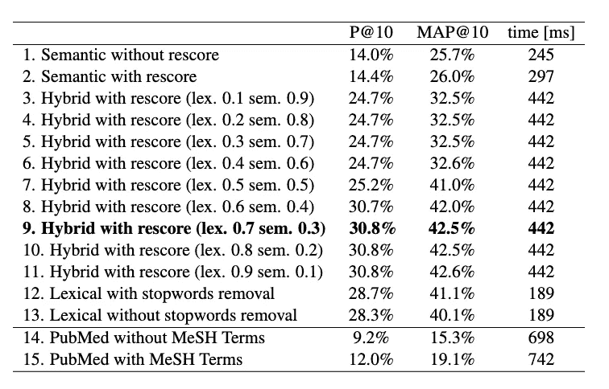
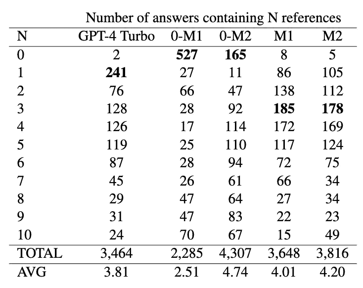
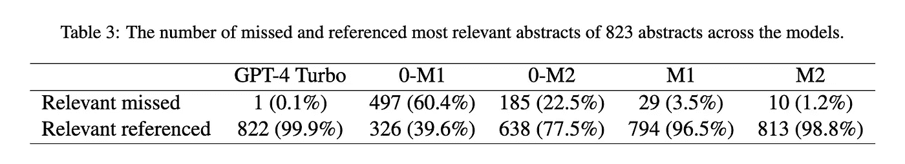
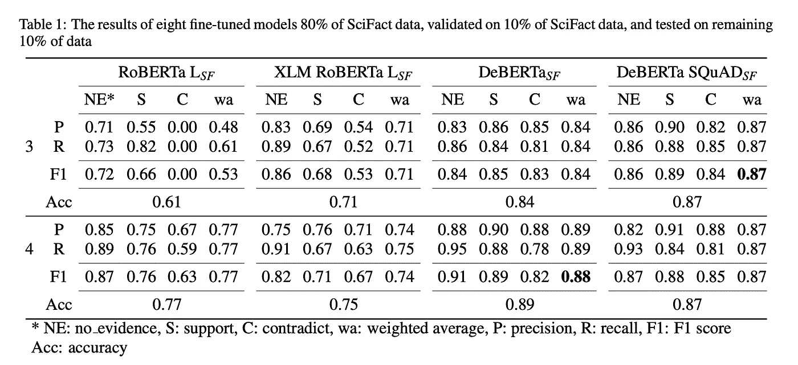
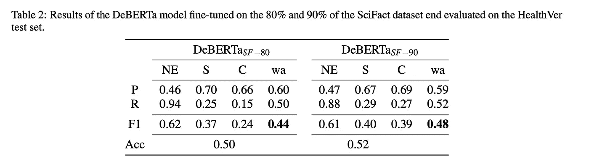
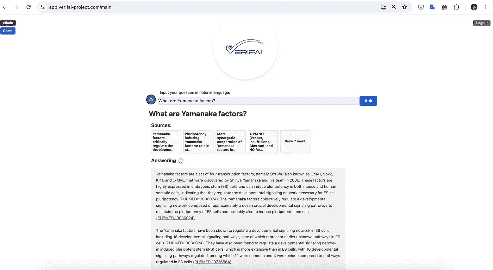
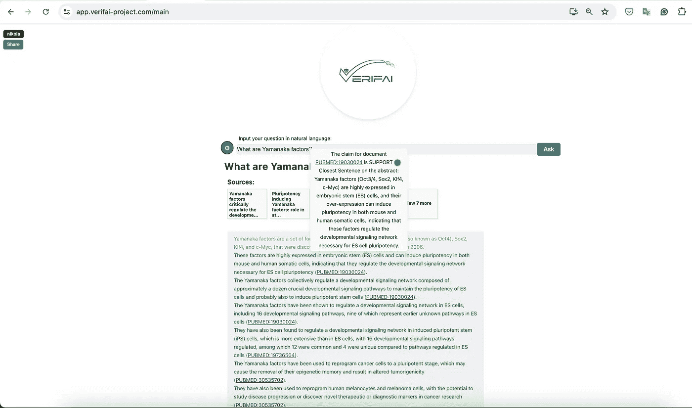
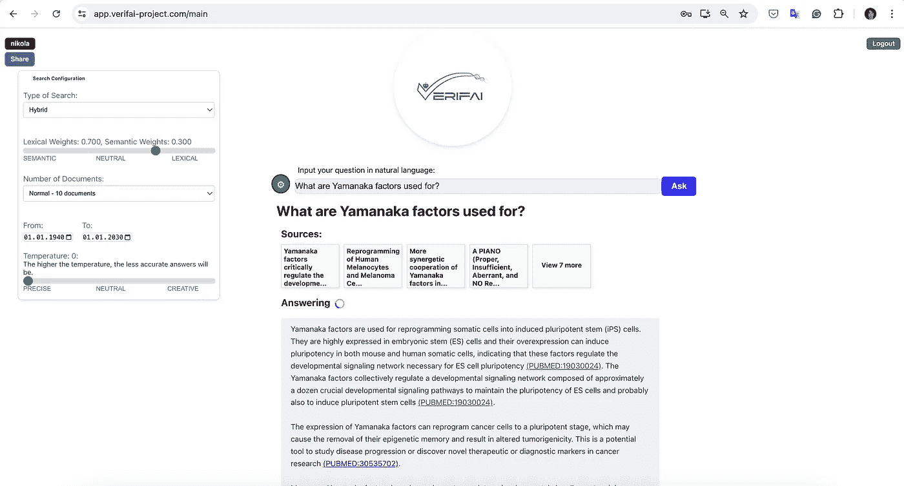
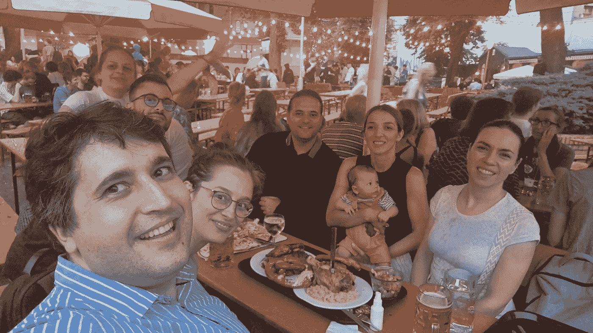

# VerifAI 项目：开源生物医学问答系统，提供经过验证的答案

> 原文：[`towardsdatascience.com/verifai-project-open-source-biomedical-question-answering-with-verified-answers-5417cd9003e0?source=collection_archive---------4-----------------------#2024-07-15`](https://towardsdatascience.com/verifai-project-open-source-biomedical-question-answering-with-verified-answers-5417cd9003e0?source=collection_archive---------4-----------------------#2024-07-15)

## 基于 LLM（Mistral 7B）的生物医学问答系统，构建在 Qdrant 和 OpenSearch 索引之上，并结合幻觉检测方法的经验。

 [Nikola Milosevic (Data Warrior)](https://datawarrior.medium.com/?source=post_page---byline--5417cd9003e0--------------------------------)

·发表于[Towards Data Science](https://towardsdatascience.com/?source=post_page---byline--5417cd9003e0--------------------------------) ·阅读时间：12 分钟·2024 年 7 月 15 日

--

去年 9 月（2023 年），我们开始了[VerifAI 项目](https://verifai-project.com/)，该项目在获得[NGI Search](https://www.ngisearch.eu/view/Main/)计划的资助后启动，该计划隶属于欧盟地平线计划。

项目的想法是创建一个面向生物医学领域的生成搜索引擎，基于经过验证的文献（因此我们使用了一个名为[PubMed](https://pubmed.ncbi.nlm.nih.gov/)的生物医学期刊文章库），并添加一个模型，通过比较参考文章和生成的声明来验证生成的答案。在生物医学领域，甚至在科学领域，幻觉（错误信息）的容忍度非常低。

尽管像 Elicit 或 Perplexity 这样的项目和产品确实进行了一部分 RAG（检索增强生成），能够回答生物医学问题并引用相关文档，但有几个因素使我们的项目与众不同。首先，我们目前专注于生物医学文档。其次，作为一个由欧盟资助的项目，我们承诺将所有创建的内容（包括源代码、模型、模型适配器、数据集等）开源。第三，目前没有其他产品能够对生成的答案进行事后验证，它们通常只是依赖相对简单的 RAG，这可以减少幻觉现象，但无法完全消除它们。该项目的主要目标之一是解决所谓的幻觉问题。大语言模型（LLM）中的幻觉是指模型生成的文本看起来合理，但实际上是事实错误、误导性或无意义的。在这方面，该项目为实时系统增添了独特的价值。

该项目已根据[AGPLv3 许可证](https://www.gnu.org/licenses/agpl-3.0.en.html)共享。

# 整体方法

我们应用的整体方法可以从下图中看到。

系统的整体架构（作者提供的图像）

当用户提出问题时，用户查询会被转换成查询，信息检索引擎会根据给定的问题向 PubMed 索引中检索最相关的生物医学摘要。为了获取最相关的文档，我们创建了一个基于[OpenSearch](https://opensearch.org/)的词汇索引和一个基于[Qdrant](https://qdrant.tech/)的向量/语义搜索。具体来说，词汇搜索非常适合检索包含查询中确切术语的相关文档，而语义搜索帮助我们在语义空间中搜索，并检索那些意思相同但措辞不同的文档。检索得分会被归一化，然后从这两个索引中结合提取文档（混合搜索）。来自混合搜索的顶级文档和问题会传递给模型的上下文进行答案生成。在我们的案例中，我们使用 QLoRA 微调了 Mistral 7B-instruct 模型，因为这样我们可以在一个相对便宜的云实例上托管一个表现良好的小型模型（该实例包含 NVidia Tesla T4 GPU 和 16GB 的 GPU 内存）。答案生成后，答案会被解析成句子，并引用支持这些句子的文献，然后传递给一个独立的模型，检查生成的声明是否得到引用摘要内容的支持。该模型将声明分类为支持、无证据和矛盾三类。最后，答案和可能未被摘要完全支持的声明将被呈现给用户。

因此，系统有三个组件——信息检索、答案生成和答案验证。在接下来的部分，我们将更详细地描述这些组件。

# 信息检索

从项目开始，我们的目标是构建一个混合搜索，结合语义搜索和词汇搜索。最初的想法是使用单一软件来实现，然而，这并不是那么容易，特别是对于 PubMed 的索引大小来说。PubMed 包含大约 3500 万篇文献，但并非所有文献都包含完整的摘要。有些较旧的文献，来自 1940 年代和 1950 年代，可能没有摘要，还有一些指南文档等，仅包含标题。我们只对包含完整摘要的文献进行了索引，最终得到了约 2500 万篇文献。解压后的 PubMed 大约为 120GB 大小。

在 OpenSearch 中创建一个高效的词汇搜索索引并不难。这几乎可以开箱即用。我们对标题、摘要文本进行了索引，并添加了一些用于过滤的元数据，如出版年份、作者和期刊。OpenSearch 支持[FAISS](https://engineering.fb.com/2017/03/29/data-infrastructure/faiss-a-library-for-efficient-similarity-search/)作为向量存储。因此，我们尝试使用 FAISS 来索引我们的数据，但由于索引太大，且内存不足（我们为索引配置了 64GB 的云实例），这一尝试未能成功。索引是使用基于 DistilBERT 的 MSMarco 微调模型进行的（[sentence-transformers/msmarco-distilbert-base-tas-b](https://huggingface.co/sentence-transformers/msmarco-distilbert-base-tas-b)）。由于我们了解到 FAISS 仅支持内存中的索引，因此我们需要找到一种解决方案，可以将部分索引存储在硬盘上。这个解决方案找到了——Qdrant 数据库，它支持内存[映射和部分索引的磁盘存储](https://qdrant.tech/documentation/concepts/storage/#configuring-memmap-storage)。

在创建索引时，出现的另一个问题是，一旦我们进行了内存映射并创建了整个 PubMed 索引，查询的执行时间会非常长（几乎 30 秒）。问题出在，使用 32 位精度计算点积时，对于包含 2500 万篇文献的索引来说，耗时较长（并且可能从硬盘加载索引部分）。因此，我们使用了仅采用 8 位精度的搜索方法，将所需时间从约 30 秒减少到了不到半秒。

词汇索引包含完整的摘要，而语义索引则需要对文献进行拆分，因为我们用来构建语义索引的变换器模型最多能处理 512 个 tokens。因此，文献在第 512 个 token 之前会根据句号进行拆分，每当达到下一个 512 个 tokens 时，都会进行相同的操作。

为了创建语义搜索和词汇搜索的结合，我们对查询的输出进行了规范化，将 Qdrant 或 OpenSearch 返回的所有分数除以给定文档库中返回的最高分。这样，我们得到了两个数值，一个代表语义搜索，另一个代表词汇搜索，范围在 0 到 1 之间。然后，我们使用[BioASQ 数据集](https://link.springer.com/content/pdf/10.1186/s12859-015-0564-6.pdf)测试了在检索的最相关文档中的精度。结果可以在下表中看到。

信息检索的结果，评估语义和词汇搜索的权重。如图所示，最佳结果出现在词汇搜索权重为 0.7，语义搜索权重为 0.3 时。图像来自我们已在 BioNLP 上接受的论文，预印本可在[`arxiv.org/abs/2407.05015v1`](https://arxiv.org/abs/2407.05015v1)查看。

我们进行了一些使用全精度的重新排序实验，因此可以在论文中看到更多细节。但这在最终的应用中没有使用。总体结论是，词汇搜索表现得相当不错，语义搜索也有一定的贡献，在词汇搜索权重为 0.7，语义搜索权重为 0.3 时获得了最佳性能。

最后，我们构建了一个查询处理系统，对于词汇查询，查询中排除了停用词，并在词汇索引中进行了搜索，同时计算语义索引的相似度。来自语义和词汇索引的文档值都进行了规范化并求和，然后检索到前 10 个文档。

# 参考答案生成

一旦检索到前 10 个文档，我们可以将这些文档传递给生成模型来生成参考答案。我们已经测试了几种模型。使用 GPT4-Turbo 模型可以很好地完成这项工作，大多数商业平台也会使用 GPT4 或 Claude 模型。然而，我们希望创建一个开源版本，避免依赖商业模型，同时使用更小、更高效的模型，并且其性能接近商业模型。因此，我们在零-shot 模式下，使用 4bit QLora 进行微调，测试了 Mistral 7B instruct 模型。

为了微调 Mistral，我们需要创建一个使用 PubMed 的参考问答数据集。我们通过随机选择 PubMedQA 数据集中的问题来创建数据集，然后检索前 10 个相关文档，并使用 GPT-4 Turbo 生成参考答案。我们将这个数据集称为[PQAref 数据集，并已发布在 HuggingFace 上](https://huggingface.co/datasets/BojanaBas/PQAref)。该数据集中的每个样本包含一个问题、一组 10 个文档和一个生成的答案，答案基于 10 个传入上下文的参考文档。

使用这个数据集，我们为 Mistral-7B-instruct 创建了一个 QLoRA 适配器。该适配器在[塞尔维亚国家 AI 平台](https://www.ai.gov.rs/)的塞尔维亚国家数据中心进行训练，使用了 Nvidia A100 GPU，训练时长大约为 32 小时。

我们进行了一项评估，比较了 Mistral 7B instruct v1 与 Mistral 7B instruct v2，在有无 QLoRA 微调的情况下（没有 QLoRA 微调时为零-shot，仅基于指令，使用 QLoRA 时我们可以节省一些 token，因为提示中不再需要指令，微调后的模型会根据需求执行任务），并且将其与 GPT-4 Turbo 进行了比较（提示：“使用相关摘要回答问题，最多 300 字。参考所提供的 abstract_id 并将其放在陈述旁边的括号中。”）。我们进行了多项评估，关于引用文献的数量以及这些引用文献是否相关。以下表格展示了这些结果。

各种模型中包含 N 个引用文献的答案数量。图片来自我们在 BioNLP 接受的论文，预印本可见于[`arxiv.org/abs/2407.05015v1`](https://arxiv.org/abs/2407.05015v1)

从这张表格可以得出结论，Mistral，特别是零-shot 的第一版本（0-M1），即使提示中要求引用上下文文献，它也并不经常引用文献。另一方面，第二个版本表现出了更好的性能，但仍然远不及 GPT4-Turbo 或微调后的 Mistral 7B。微调后的 Mistral 往往会引用更多文献，即使答案可以从某一文献中找到，而且比 GPT4-Turbo 多出一些额外信息。

各种模型中引用的相关文献数量。图片来自我们在 BioNLP 接受的论文，预印本可见于[`arxiv.org/abs/2407.05015v1`](https://arxiv.org/abs/2407.05015v1)

从第二个表格可以看出，GPT4-Turbo 在整个测试集中只错过了一次相关引用，而 Mistral 7B-instruct v2 微调后错过的相关引用稍多，但考虑到其模型规模更小，表现仍然相当。

我们还手动查看了多个答案，以确保答案是合理的。最终，在应用中，我们使用的是 Mistral 7B instruct v2，并配合微调的 QLoRA 适配器。

# 答案验证

系统的最终部分是答案验证。对于答案验证，我们开发了多个功能，但主要的是一个系统，它验证生成的声明是否基于所引用的摘要。我们在[Allen Institute for AI](https://allenai.org/data/scifact)的[SciFact 数据集](https://allenai.org/data/scifact)上对多个基于 BERT 和 Roberta 的模型进行了微调。

为了处理模型输入，我们解析了答案以找到句子和相关参考文献。我们发现系统中的第一句和最后一句通常是引言或结论句，可能没有引用。所有其他句子都应该有引用。如果一个句子包含引用，它是基于该 PubMed 文档的。如果句子没有引用，但前后句有引用，我们计算该句子与 2 个摘要中的句子的嵌入点积。点积最大的摘要被认为是该句子的来源摘要。

一旦答案被解析，并且我们找到了所有与理赔相关的摘要，我们将其传递给微调后的模型。输入模型的方式如下所示：

对于 deBERT-a 模型：

> [CLS]claim[SEP]evidence[SEP]

对于基于 Roberta 的模型：

> <s>claim</s></s>evidence</s>

在这里，claim 是生成组件生成的理赔，evidence 是来自 PubMed 文献中引用的标题和摘要拼接文本。

我们评估了微调模型的性能，并得到了以下结果：

在 SciFact 数据集上训练和测试的模型评估。图片由作者提供，论文已提交至第 16 届国际知识管理与信息系统会议。

通常，当模型在与测试数据集相同的数据集上进行微调时，结果表现良好。因此，我们希望在域外数据上进行测试。所以我们选择了[HealthVer 数据集](https://github.com/sarrouti/HealthVer)，它也属于医疗健康领域，主要用于理赔验证。测试结果如下：

在 HealthVer 数据集上的测试结果。图片由作者提供，论文已提交至第 16 届国际知识管理与信息系统会议。

我们还使用 GPT-4 模型评估了 SciFact 标签预测任务（提示语为：“批判性地评估该声明是否得到支持、被反驳，或者在给定摘要中没有证据支持该声明。如果声明得到摘要的支持，请输出 SUPPORT；如果声明与摘要矛盾，请输出 CONTRADICT；如果摘要中没有支持该声明的证据，请输出 NO EVIDENCE。”），得出了精确度为 0.81、召回率为 0.80、F-1 分数为 0.79 的结果。因此，我们的模型表现更好，且由于参数数量显著更少，效率也更高。

在使用该模型进行验证的基础上，我们还通过点积相似度计算了摘要中与生成句子最接近的句子（使用与语义搜索相同的 MSMarco 模型）。我们通过在用户界面上悬停句子来可视化与生成句子最接近的句子。

# 用户界面

我们开发了一个用户界面，用户可以在其中注册、登录并提问，系统将提供参考答案、链接到 PubMed 以及通过描述的后验模型进行验证。以下是该用户界面的几个截图：

用户界面正在生成答案时的截图。截图由作者提供

输出结果，包括验证。截图由作者提供

生成不同答案并打开配置窗口的截图。截图由作者提供

# 结论

VerifAI 项目 logo。Logo 由作者提供

我们在这里分享构建 VerifAI 项目的经验，这是一个生物医学生成式问答引擎，能够提供可验证的答案。我们将开源整个代码和模型，并且暂时（具体时间取决于预算及是否能找到可持续的托管方案）开放应用程序。在下一部分中，您可以找到应用程序、网站、代码和模型的链接。

该应用程序是多个人（请参见团队部分）和近一年研究与开发工作的成果。我们很高兴并自豪地将其呈现给更广泛的公众，并希望大家会喜欢它，同时也能为其做出贡献，推动它在未来变得更加可持续和更好。

# 引用我们的论文

如果您在论文的背景部分使用了任何方法论、模型、数据集，或者提到了这个项目，请引用以下部分论文：

+   [Adela Ljajić, Miloš Košprdić, Bojana Bašaragin, Darija Medvecki, Lorenzo Cassano, Nikola Milošević, “Scientific QA System with Verifiable Answers”, The 6th International Open Search Symposium 2024](https://arxiv.org/pdf/2407.11485)

+   [Košprdić, M., Ljajić, A., Bašaragin, B., Medvecki, D., & Milošević, N. “Verif. ai: Towards an Open-Source Scientific Generative Question-Answering System with Referenced and Verifiable Answers.” The Sixteenth International Conference on Evolving Internet INTERNET 2024 (2024).](https://arxiv.org/pdf/2402.18589.pdf)

+   [Bojana Bašaragin, Adela Ljajić, Darija Medvecki, Lorenzo Cassano, Miloš Košprdić, Nikola Milošević “How do you know that? Teaching Generative Language Models to Reference Answers to Biomedical Questions”, The 23rd BioNLP Workshop 2024, Colocated with ACL 2024](https://arxiv.org/abs/2407.05015)

# 可用性

该应用程序可以通过 [`verifai-project.com/`](https://verifai-project.com/) 或 [`app.verifai-project.com/`](https://app.verifai-project.com/) 访问和尝试。用户可以在此注册并提问，尝试我们的平台。

项目的代码可以在 GitHub 上找到，链接为[`github.com/nikolamilosevic86/verif.ai`](https://github.com/nikolamilosevic86/verif.ai)。Mistra 7B instruct 的 QLoRA 适配器可以在 HuggingFace 上找到，链接为[`huggingface.co/BojanaBas/Mistral-7B-Instruct-v0.2-pqa-10`](https://huggingface.co/BojanaBas/Mistral-7B-Instruct-v0.2-pqa-10) 和 [`huggingface.co/BojanaBas/Mistral-7B-Instruct-v0.1-pqa-10`](https://huggingface.co/BojanaBas/Mistral-7B-Instruct-v0.1-pqa-10)。用于微调生成组件的生成数据集也可以在 HuggingFace 上找到，链接为[`huggingface.co/datasets/BojanaBas/PQAref`](https://huggingface.co/datasets/BojanaBas/PQAref)。一个用于答案验证的模型可以在[`huggingface.co/MilosKosRad/TextualEntailment_DeBERTa_preprocessedSciFACT`](https://huggingface.co/MilosKosRad/TextualEntailment_DeBERTa_preprocessedSciFACT)找到。

# 团队

VerifAI 项目是由拜耳制药研发部和塞尔维亚人工智能研究与发展研究所合作开发的，项目资金由 NGI Search 项目提供，资助协议号为 101069364。参与人员包括[Nikola Milosevic](https://www.linkedin.com/in/nikolamilosevic1986/)、[Lorenzo Cassano](https://www.linkedin.com/in/lorenzo-cassano-360b631b1/)、[Bojana Bašaragin](https://www.linkedin.com/in/bojana-basaragin/)、[Miloš Košprdić](https://www.linkedin.com/in/milo%C5%A1-ko%C5%A1prdi%C4%87/)、[Adela Ljajić](https://www.linkedin.com/in/adelacrnisanin/) 和 [Darija Medvecki](https://www.linkedin.com/in/darija-medvecki-b27468ab/)。

如果你想看到团队成员的面孔 — 团队（以及一些家人）在柏林普拉特啤酒花园的合影（作者提供，2024 年 7 月 10 日）
