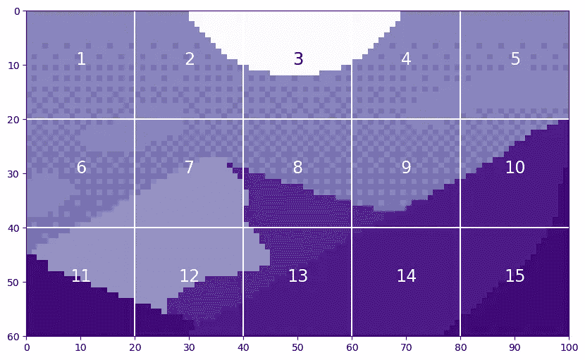

# Vision Transformers 解析

> 原文：[`towardsdatascience.com/vision-transformers-explained-a9d07147e4c8?source=collection_archive---------1-----------------------#2024-02-27`](https://towardsdatascience.com/vision-transformers-explained-a9d07147e4c8?source=collection_archive---------1-----------------------#2024-02-27)

## Vision Transformer 解析系列

## 完整的*Vision Transformers in PyTorch*演示

[](https://medium.com/@sjcallis?source=post_page---byline--a9d07147e4c8--------------------------------)[](https://towardsdatascience.com/?source=post_page---byline--a9d07147e4c8--------------------------------) [Skylar Jean Callis](https://medium.com/@sjcallis?source=post_page---byline--a9d07147e4c8--------------------------------)

·发表于[Towards Data Science](https://towardsdatascience.com/?source=post_page---byline--a9d07147e4c8--------------------------------) ·18 分钟阅读·2024 年 2 月 27 日

--

*自从 2017 年随着《Attention is All You Need》*¹的推出，transformer 模型已成为自然语言处理（NLP）领域的最先进技术。2021 年，*An Image is Worth 16x16 Words*²成功将 transformer 模型应用于计算机视觉任务。从那时起，许多基于 transformer 的架构已被提出，用于计算机视觉。*

**本文详细介绍了《An Image is Worth 16x16 Words*²》中的 Vision Transformer（ViT）。它包括 ViT 的开源代码，以及对各个组件的概念性解释。所有代码均使用 PyTorch Python 包。**


图片来自[Sahand Babali](https://unsplash.com/@sahandbabali?utm_source=medium&utm_medium=referral)拍摄，[Unsplash](https://unsplash.com/?utm_source=medium&utm_medium=referral)

本文是系列文章的一部分，深入探讨了 Vision Transformer 的内部工作原理。这些文章也可以作为 Jupyter Notebook 下载并运行。该系列的其他文章包括：

+   **Vision Transformers 解析**→ [Jupyter Notebook](https://github.com/lanl/vision_transformers_explained/blob/main/notebooks/VisionTransformersExplained.ipynb)

+   Vision Transformer 解析中的 Attention 部分

    → [Jupyter Notebook](https://github.com/lanl/vision_transformers_explained/blob/main/notebooks/AttentionExplained.ipynb)

+   Vision Transformers 位置嵌入解析

    → [Jupyter Notebook](https://github.com/lanl/vision_transformers_explained/blob/main/notebooks/PositionEmbeddingExplained.ipynb)

+   Tokens-to-Token 视觉变换器解析

    → [Jupyter Notebook](https://github.com/lanl/vision_transformers_explained/blob/main/notebooks/TokensToTokenViTExplained.ipynb)

+   [视觉变换器系列的 GitHub 代码库](https://github.com/lanl/vision_transformers_explained)

## 目录

+   什么是视觉变换器？

+   模型演示

    — 图像 Token 化

    — Token 处理

    — 编码模块

    — 神经网络模块

    — 预测处理

+   完整代码

+   结论

    — 进一步阅读

    — 引用

# 什么是视觉变换器？

正如*《Attention is All You Need》*¹中介绍的，变换器是一种利用注意力机制作为主要学习方式的机器学习模型。变换器迅速成为处理序列到序列任务（如语言翻译）的最先进模型。

*《一张图片等于 16x16 个词》*²成功地修改了[1]中的变换器，以解决图像分类任务，从而创建了**视觉**变换器（ViT）。ViT 基于与[1]中的变换器相同的注意力机制。然而，虽然 NLP 任务的变换器包含一个编码器注意力分支和一个解码器注意力分支，ViT 仅使用一个编码器。编码器的输出随后传递给一个神经网络“头部”，进行预测。

[2]中实现的 ViT 的缺点是，其最佳性能需要在大型数据集上进行预训练。最佳的模型是在专有的 JFT-300M 数据集上进行预训练的。在较小的、开源的 ImageNet-21k 数据集上进行预训练的模型，其表现与最先进的卷积 ResNet 模型不相上下。

*Tokens-to-Token ViT：从头开始在 ImageNet 上训练视觉变换器*³试图通过引入一种新的预处理方法来消除预训练的需求， 将输入图像转换成一系列 Token。有关此方法的更多信息，请参见这里。本文将重点介绍[2]中实现的 ViT。

# 模型演示

本文遵循了*《一张图片等于 16x16 个词》*²中概述的模型结构。然而，本文中所用的代码并未公开。更近期的*Tokens-to-Token ViT*³的代码已在 GitHub 上公开。Tokens-to-Token ViT（T2T-ViT）模型在普通的 ViT 主干网络前添加了一个 Tokens-to-Token（T2T）模块。本文中的代码基于*Tokens-to-Token ViT*³ GitHub 代码中的 ViT 组件。本文所做的修改包括但不限于，修改以支持非方形输入图像，并移除 dropout 层。

下图展示了 ViT 模型。


ViT 模型图（图片来源：作者）

## 图像标记化

ViT 的第一步是从输入图像创建标记（tokens）。Transformer 处理的是*标记*的*序列*；在自然语言处理（NLP）中，这通常是一个*单词*的*句子*。对于计算机视觉而言，如何将输入分割成标记并不那么明确。

ViT 将图像转换为标记，每个标记表示图像的一个局部区域——或称*补丁*。它们描述了如何将高度为*H*、宽度为*W*、通道数为*C*的图像重塑为*N*个补丁大小为*P*的标记：

每个标记的长度为*P²∗C*。

让我们看看在这幅由 Luis Zuno 创作的像素艺术*《黄昏中的山脉》*（[@ansimuz](http://twitter.com/ansimuz)）⁴上进行的补丁标记化示例。原始艺术作品已被裁剪并转换为单通道图像。这意味着每个像素的值在 0 和 1 之间。单通道图像通常以灰度显示；然而，我们将使用紫色配色方案进行展示，因为这样更容易看清。

请注意，补丁标记化并未包含在与[3]相关的代码中。本节中的所有代码均为作者原创。

```py
mountains = np.load(os.path.join(figure_path, 'mountains.npy'))

H = mountains.shape[0]
W = mountains.shape[1]
print('Mountain at Dusk is H =', H, 'and W =', W, 'pixels.')
print('\n')

fig = plt.figure(figsize=(10,6))
plt.imshow(mountains, cmap='Purples_r')
plt.xticks(np.arange(-0.5, W+1, 10), labels=np.arange(0, W+1, 10))
plt.yticks(np.arange(-0.5, H+1, 10), labels=np.arange(0, H+1, 10))
plt.clim([0,1])
cbar_ax = fig.add_axes([0.95, .11, 0.05, 0.77])
plt.clim([0, 1])
plt.colorbar(cax=cbar_ax);
#plt.savefig(os.path.join(figure_path, 'mountains.png'))
```

```py
Mountain at Dusk is H = 60 and W = 100 pixels.
```


代码输出（图片来源：作者）

这幅图像的*H=60*和*W=100*。我们将设置*P=20*，因为它可以均匀地划分*H*和*W*。

```py
P = 20
N = int((H*W)/(P**2))
print('There will be', N, 'patches, each', P, 'by', str(P)+'.')
print('\n')

fig = plt.figure(figsize=(10,6))
plt.imshow(mountains, cmap='Purples_r')
plt.hlines(np.arange(P, H, P)-0.5, -0.5, W-0.5, color='w')
plt.vlines(np.arange(P, W, P)-0.5, -0.5, H-0.5, color='w')
plt.xticks(np.arange(-0.5, W+1, 10), labels=np.arange(0, W+1, 10))
plt.yticks(np.arange(-0.5, H+1, 10), labels=np.arange(0, H+1, 10))
x_text = np.tile(np.arange(9.5, W, P), 3)
y_text = np.repeat(np.arange(9.5, H, P), 5)
for i in range(1, N+1):
    plt.text(x_text[i-1], y_text[i-1], str(i), color='w', fontsize='xx-large', ha='center')
plt.text(x_text[2], y_text[2], str(3), color='k', fontsize='xx-large', ha='center');
#plt.savefig(os.path.join(figure_path, 'mountain_patches.png'), bbox_inches='tight'
```

```py
There will be 15 patches, each 20 by 20.
```



代码输出（图片来源：作者）

通过展开这些补丁，我们可以看到生成的标记。以补丁 12 为例，因为它包含四种不同的阴影。

```py
print('Each patch will make a token of length', str(P**2)+'.')
print('\n')

patch12 = mountains[40:60, 20:40]
token12 = patch12.reshape(1, P**2)

fig = plt.figure(figsize=(10,1))
plt.imshow(token12, aspect=10, cmap='Purples_r')
plt.clim([0,1])
plt.xticks(np.arange(-0.5, 401, 50), labels=np.arange(0, 401, 50))
plt.yticks([]);
#plt.savefig(os.path.join(figure_path, 'mountain_token12.png'), bbox_inches='tight')
```

```py
Each patch will make a token of length 400.
```


代码输出（图片来源：作者）

从图像中提取标记后，通常会使用线性投影来改变标记的长度。这通常是通过一个可学习的线性层来实现的。标记的新长度被称为*潜在维度²*、*通道维度³*或*标记长度*。经过投影后，标记不再能被直观地识别为原始图像中的补丁。

现在我们理解了这个概念，可以看看如何在代码中实现补丁标记化（patch tokenization）。

```py
class Patch_Tokenization(nn.Module):
    def __init__(self,
                img_size: tuple[int, int, int]=(1, 1, 60, 100),
                patch_size: int=50,
                token_len: int=768):

        """ Patch Tokenization Module
            Args:
                img_size (tuple[int, int, int]): size of input (channels, height, width)
                patch_size (int): the side length of a square patch
                token_len (int): desired length of an output token
        """
        super().__init__()

        ## Defining Parameters
        self.img_size = img_size
        C, H, W = self.img_size
        self.patch_size = patch_size
        self.token_len = token_len
        assert H % self.patch_size == 0, 'Height of image must be evenly divisible by patch size.'
        assert W % self.patch_size == 0, 'Width of image must be evenly divisible by patch size.'
        self.num_tokens = (H / self.patch_size) * (W / self.patch_size)

        ## Defining Layers
        self.split = nn.Unfold(kernel_size=self.patch_size, stride=self.patch_size, padding=0)
        self.project = nn.Linear((self.patch_size**2)*C, token_len)

    def forward(self, x):
        x = self.split(x).transpose(1,0)
        x = self.project(x)
        return x
```

请注意，两个`assert`语句确保图像尺寸能被补丁大小整除。实际的补丁拆分是通过`torch.nn.Unfold`⁵层来实现的。

我们将使用裁剪后的单通道*《黄昏中的山脉》*⁴版本运行此代码示例。我们应该能看到与之前相同的标记数和初始标记大小。我们将使用*token_len=768*作为投影后的长度，这是 ViT²基础版本的大小。

以下代码块的第一行将*《黄昏中的山脉》*⁴的数据类型从 NumPy 数组更改为 Torch 张量。我们还需要对张量进行`unsqueeze`⁶操作，以创建通道维度和批次大小维度。如上所述，我们有一个通道。由于只有一张图片，*batchsize=1*。

```py
x = torch.from_numpy(mountains).unsqueeze(0).unsqueeze(0).to(torch.float32)
token_len = 768
print('Input dimensions are\n\tbatchsize:', x.shape[0], '\n\tnumber of input channels:', x.shape[1], '\n\timage size:', (x.shape[2], x.shape[3]))

# Define the Module
patch_tokens = Patch_Tokenization(img_size=(x.shape[1], x.shape[2], x.shape[3]),
                                    patch_size = P,
                                    token_len = token_len)
```

```py
Input dimensions are
   batchsize: 1 
   number of input channels: 1 
   image size: (60, 100)
```

现在，我们将把图像拆分成标记（tokens）。

```py
x = patch_tokens.split(x).transpose(2,1)
print('After patch tokenization, dimensions are\n\tbatchsize:', x.shape[0], '\n\tnumber of tokens:', x.shape[1], '\n\ttoken length:', x.shape[2])
```

```py
After patch tokenization, dimensions are
   batchsize: 1 
   number of tokens: 15 
   token length: 400
```

正如我们在示例中看到的，每个长度为 400 的 *N=15* 个 token。最后，我们将 token 投影为 *token_len*。

```py
x = patch_tokens.project(x)
print('After projection, dimensions are\n\tbatchsize:', x.shape[0], '\n\tnumber of tokens:', x.shape[1], '\n\ttoken length:', x.shape[2])
```

```py
After projection, dimensions are
   batchsize: 1 
   number of tokens: 15 
   token length: 768
```

现在我们已经有了 token，准备继续处理 ViT。

## Token 处理

我们将 ViT 的接下来的两个步骤，在编码块之前，称为“token 处理”。ViT 图中的 token 处理组件如下所示。


ViT 图中的 Token 处理组件（图片由作者提供）

第一步是向图像 token 前添加一个空白 token，称为 *预测 Token*。这个 token 将在编码块的输出中用于进行预测。它最初是空白的——相当于零——这样它可以从其他图像 token 中获取信息。

我们将从 175 个 token 开始。每个 token 的长度为 768，这是 ViT² 基本变种的大小。我们将使用批量大小为 13，因为它是质数，不会与其他参数混淆。

```py
# Define an Input
num_tokens = 175
token_len = 768
batch = 13
x = torch.rand(batch, num_tokens, token_len)
print('Input dimensions are\n\tbatchsize:', x.shape[0], '\n\tnumber of tokens:', x.shape[1], '\n\ttoken length:', x.shape[2])

# Append a Prediction Token
pred_token = torch.zeros(1, 1, token_len).expand(batch, -1, -1)
print('Prediction Token dimensions are\n\tbatchsize:', pred_token.shape[0], '\n\tnumber of tokens:', pred_token.shape[1], '\n\ttoken length:', pred_token.shape[2])

x = torch.cat((pred_token, x), dim=1)
print('Dimensions with Prediction Token are\n\tbatchsize:', x.shape[0], '\n\tnumber of tokens:', x.shape[1], '\n\ttoken length:', x.shape[2])
```

```py
Input dimensions are
   batchsize: 13 
   number of tokens: 175 
   token length: 768
Prediction Token dimensions are
   batchsize: 13 
   number of tokens: 1 
   token length: 768
Dimensions with Prediction Token are
   batchsize: 13 
   number of tokens: 176 
   token length: 768
```

现在，我们为我们的 token 添加一个位置嵌入。位置嵌入使 Transformer 能够理解图像 token 的顺序。请注意，这是一种加法操作，而不是拼接。位置嵌入的具体细节是一个偏题，最好留待另一个时间讨论。

```py
def get_sinusoid_encoding(num_tokens, token_len):
    """ Make Sinusoid Encoding Table

        Args:
            num_tokens (int): number of tokens
            token_len (int): length of a token

        Returns:
            (torch.FloatTensor) sinusoidal position encoding table
    """

    def get_position_angle_vec(i):
        return [i / np.power(10000, 2 * (j // 2) / token_len) for j in range(token_len)]

    sinusoid_table = np.array([get_position_angle_vec(i) for i in range(num_tokens)])
    sinusoid_table[:, 0::2] = np.sin(sinusoid_table[:, 0::2])
    sinusoid_table[:, 1::2] = np.cos(sinusoid_table[:, 1::2]) 

    return torch.FloatTensor(sinusoid_table).unsqueeze(0)

PE = get_sinusoid_encoding(num_tokens+1, token_len)
print('Position embedding dimensions are\n\tnumber of tokens:', PE.shape[1], '\n\ttoken length:', PE.shape[2])

x = x + PE
print('Dimensions with Position Embedding are\n\tbatchsize:', x.shape[0], '\n\tnumber of tokens:', x.shape[1], '\n\ttoken length:', x.shape[2])
```

```py
Position embedding dimensions are
   number of tokens: 176 
   token length: 768
Dimensions with Position Embedding are
   batchsize: 13 
   number of tokens: 176 
   token length: 768
```

现在，我们的 token 准备好进入编码块了。

## 编码块

编码块是模型实际从图像 token 中学习的地方。编码块的数量是由用户设置的超参数。编码块的图示如下。


编码块（图片由作者提供）

编码块的代码如下。

```py
class Encoding(nn.Module):

    def __init__(self,
       dim: int,
       num_heads: int=1,
       hidden_chan_mul: float=4.,
       qkv_bias: bool=False,
       qk_scale: NoneFloat=None,
       act_layer=nn.GELU, 
       norm_layer=nn.LayerNorm):

        """ Encoding Block

            Args:
                dim (int): size of a single token
                num_heads(int): number of attention heads in MSA
                hidden_chan_mul (float): multiplier to determine the number of hidden channels (features) in the NeuralNet component
                qkv_bias (bool): determines if the qkv layer learns an addative bias
                qk_scale (NoneFloat): value to scale the queries and keys by; 
                                    if None, queries and keys are scaled by ``head_dim ** -0.5``
                act_layer(nn.modules.activation): torch neural network layer class to use as activation
                norm_layer(nn.modules.normalization): torch neural network layer class to use as normalization
        """

        super().__init__()

        ## Define Layers
        self.norm1 = norm_layer(dim)
        self.attn = Attention(dim=dim,
                            chan=dim,
                            num_heads=num_heads,
                            qkv_bias=qkv_bias,
                            qk_scale=qk_scale)
        self.norm2 = norm_layer(dim)
        self.neuralnet = NeuralNet(in_chan=dim,
                                hidden_chan=int(dim*hidden_chan_mul),
                                out_chan=dim,
                                act_layer=act_layer)

    def forward(self, x):
        x = x + self.attn(self.norm1(x))
        x = x + self.neuralnet(self.norm2(x))
        return x
```

*num_heads, qkv_bias,* 和 *qk_scale* 参数定义了 *注意力* 模块的组件。关于视觉 Transformer 中的注意力机制的深入讨论留待另一个时间。

*hidden_chan_mul* 和 *act_layer* 参数定义了 *神经网络* 模块的组件。激活层可以是任何 `torch.nn.modules.activation`⁷ 层。我们稍后会更详细地介绍 *神经网络* 模块更多内容。

*norm_layer* 可以从任何 `torch.nn.modules.normalization`⁸ 层中选择。

现在，我们将逐步解析图中的每个蓝色块及其伴随的代码。我们将使用 176 个长度为 768 的 token。我们将使用批量大小为 13，因为它是质数，不会与其他参数混淆。我们将使用 4 个注意力头，因为它能均匀分配 token 长度；然而，在编码块中，你不会看到注意力头维度。

```py
# Define an Input
num_tokens = 176
token_len = 768
batch = 13
heads = 4
x = torch.rand(batch, num_tokens, token_len)
print('Input dimensions are\n\tbatchsize:', x.shape[0], '\n\tnumber of tokens:', x.shape[1], '\n\ttoken length:', x.shape[2])

# Define the Module
E = Encoding(dim=token_len, num_heads=heads, hidden_chan_mul=1.5, qkv_bias=False, qk_scale=None, act_layer=nn.GELU, norm_layer=nn.LayerNorm)
E.eval();
```

```py
Input dimensions are
   batchsize: 13 
   number of tokens: 176 
   token length: 768
```

现在，我们将通过一个归一化层和一个 *注意力* 模块。编码块中的 *注意力* 模块进行了参数化，以确保不会改变 token 长度。在 *注意力* 模块之后，我们实现第一个分割连接。

```py
y = E.norm1(x)
print('After norm, dimensions are\n\tbatchsize:', y.shape[0], '\n\tnumber of tokens:', y.shape[1], '\n\ttoken size:', y.shape[2])
y = E.attn(y)
print('After attention, dimensions are\n\tbatchsize:', y.shape[0], '\n\tnumber of tokens:', y.shape[1], '\n\ttoken size:', y.shape[2])
y = y + x
print('After split connection, dimensions are\n\tbatchsize:', y.shape[0], '\n\tnumber of tokens:', y.shape[1], '\n\ttoken size:', y.shape[2])
```

```py
After norm, dimensions are
   batchsize: 13 
   number of tokens: 176 
   token size: 768
After attention, dimensions are
   batchsize: 13 
   number of tokens: 176 
   token size: 768
After split connection, dimensions are
   batchsize: 13 
   number of tokens: 176 
   token size: 768
```

接下来，我们通过另一个归一化层，然后是 *神经网络* 模块。最后，我们完成第二个分割连接。

```py
z = E.norm2(y)
print('After norm, dimensions are\n\tbatchsize:', z.shape[0], '\n\tnumber of tokens:', z.shape[1], '\n\ttoken size:', z.shape[2])
z = E.neuralnet(z)
print('After neural net, dimensions are\n\tbatchsize:', z.shape[0], '\n\tnumber of tokens:', z.shape[1], '\n\ttoken size:', z.shape[2])
z = z + y
print('After split connection, dimensions are\n\tbatchsize:', z.shape[0], '\n\tnumber of tokens:', z.shape[1], '\n\ttoken size:', z.shape[2])
```

```py
After norm, dimensions are
   batchsize: 13 
   number of tokens: 176 
   token size: 768
After neural net, dimensions are
   batchsize: 13 
   number of tokens: 176 
   token size: 768
After split connection, dimensions are
   batchsize: 13 
   number of tokens: 176 
   token size: 768
```

这就是单个编码块的全部内容！由于最终的维度与初始维度相同，模型可以轻松地通过多个编码块传递标记，这由*深度*超参数设置。

## 神经网络模块

*神经网络*（NN）模块是编码块的一个子组件。NN 模块非常简单，由一个全连接层、一个激活层和另一个全连接层组成。激活层可以是任何`torch.nn.modules.activation`⁷层，并作为输入传递给模块。NN 模块可以配置为改变输入的形状，或保持相同形状。我们不会逐步讲解这段代码，因为神经网络在机器学习中很常见，并不是本文的重点。然而，NN 模块的代码如下所示。

```py
class NeuralNet(nn.Module):
    def __init__(self,
       in_chan: int,
       hidden_chan: NoneFloat=None,
       out_chan: NoneFloat=None,
       act_layer = nn.GELU):
        """ Neural Network Module

            Args:
                in_chan (int): number of channels (features) at input
                hidden_chan (NoneFloat): number of channels (features) in the hidden layer;
                                        if None, number of channels in hidden layer is the same as the number of input channels
                out_chan (NoneFloat): number of channels (features) at output;
                                        if None, number of output channels is same as the number of input channels
                act_layer(nn.modules.activation): torch neural network layer class to use as activation
        """

        super().__init__()

        ## Define Number of Channels
        hidden_chan = hidden_chan or in_chan
        out_chan = out_chan or in_chan

        ## Define Layers
        self.fc1 = nn.Linear(in_chan, hidden_chan)
        self.act = act_layer()
        self.fc2 = nn.Linear(hidden_chan, out_chan)

    def forward(self, x):
        x = self.fc1(x)
        x = self.act(x)
        x = self.fc2(x)
        return x
```

## 预测处理

通过编码块后，模型必须做的最后一件事就是进行预测。ViT 图示中的“预测处理”组件如下所示。


ViT 图示中的预测处理组件（图片由作者提供）

我们将逐步分析这个过程的每个步骤。我们将继续使用 176 个长度为 768 的标记。为了演示如何进行单次预测，我们将使用批量大小为 1。批量大小大于 1 会并行计算此预测。

```py
# Define an Input
num_tokens = 176
token_len = 768
batch = 1
x = torch.rand(batch, num_tokens, token_len)
print('Input dimensions are\n\tbatchsize:', x.shape[0], '\n\tnumber of tokens:', x.shape[1], '\n\ttoken length:', x.shape[2])
```

```py
Input dimensions are
   batchsize: 1 
   number of tokens: 176 
   token length: 768
```

首先，所有标记都会通过一个标准化层。

```py
norm = nn.LayerNorm(token_len)
x = norm(x)
print('After norm, dimensions are\n\tbatchsize:', x.shape[0], '\n\tnumber of tokens:', x.shape[1], '\n\ttoken size:', x.shape[2])
```

```py
After norm, dimensions are
   batchsize: 1 
   number of tokens: 1001 
   token size: 768
```

接下来，我们将预测标记从其余标记中分离出来。在整个编码块中，预测标记变为非零，并且获得了关于输入图像的信息。我们将仅使用这个预测标记来进行最终的预测。

```py
pred_token = x[:, 0]
print('Length of prediction token:', pred_token.shape[-1])
```

```py
Length of prediction token: 768
```

最后，预测标记通过*头部*进行预测。*头部*，通常是某种类型的神经网络，根据模型的不同而有所变化。在《*An Image is Worth 16x16 Words*²》中，他们在预训练时使用一个带有隐藏层的 MLP（[多层感知器](https://en.wikipedia.org/wiki/Multilayer_perceptron)），在微调时使用一个线性层。在《*Tokens-to-Token ViT³*》中，他们使用一个线性层作为头部。这个例子将使用单个线性层。

请注意，头部的输出形状是根据学习问题的参数设置的。对于分类，通常是一个长度为*类别数*的向量，采用[独热编码](https://en.wikipedia.org/wiki/One-hot#Machine_learning_and_statistics)。对于回归，它将是任何整数数量的预测参数。这个例子将使用一个输出形状为 1 来表示一个单一的回归估计值。

```py
head = nn.Linear(token_len, 1)
pred = head(pred_token)
print('Length of prediction:', (pred.shape[0], pred.shape[1]))
print('Prediction:', float(pred))
```

```py
Length of prediction: (1, 1)
Prediction: -0.5474240779876709
```

就这样！模型已经做出了预测！

# 完整代码

为了创建完整的 ViT 模块，我们使用上面定义的*补丁标记化*模块和*ViT 主干*模块。*ViT 主干*定义如下，并包含*标记处理*、*编码块*和[*预测处理*](http://d3ad)组件。

```py
class ViT_Backbone(nn.Module):
    def __init__(self,
                preds: int=1,
                token_len: int=768,
                num_heads: int=1,
                Encoding_hidden_chan_mul: float=4.,
                depth: int=12,
                qkv_bias=False,
                qk_scale=None,
                act_layer=nn.GELU,
                norm_layer=nn.LayerNorm):

        """ VisTransformer Backbone
            Args:
                preds (int): number of predictions to output
                token_len (int): length of a token
                num_heads(int): number of attention heads in MSA
                Encoding_hidden_chan_mul (float): multiplier to determine the number of hidden channels (features) in the NeuralNet component of the Encoding Module
                depth (int): number of encoding blocks in the model
                qkv_bias (bool): determines if the qkv layer learns an addative bias
                qk_scale (NoneFloat): value to scale the queries and keys by; 
                 if None, queries and keys are scaled by ``head_dim ** -0.5``
                act_layer(nn.modules.activation): torch neural network layer class to use as activation
                norm_layer(nn.modules.normalization): torch neural network layer class to use as normalization
        """

        super().__init__()

        ## Defining Parameters
        self.num_heads = num_heads
        self.Encoding_hidden_chan_mul = Encoding_hidden_chan_mul
        self.depth = depth

        ## Defining Token Processing Components
        self.cls_token = nn.Parameter(torch.zeros(1, 1, self.token_len))
        self.pos_embed = nn.Parameter(data=get_sinusoid_encoding(num_tokens=self.num_tokens+1, token_len=self.token_len), requires_grad=False)

        ## Defining Encoding blocks
        self.blocks = nn.ModuleList([Encoding(dim = self.token_len, 
                                               num_heads = self.num_heads,
                                               hidden_chan_mul = self.Encoding_hidden_chan_mul,
                                               qkv_bias = qkv_bias,
                                               qk_scale = qk_scale,
                                               act_layer = act_layer,
                                               norm_layer = norm_layer)
             for i in range(self.depth)])

        ## Defining Prediction Processing
        self.norm = norm_layer(self.token_len)
        self.head = nn.Linear(self.token_len, preds)

        ## Make the class token sampled from a truncated normal distrobution 
        timm.layers.trunc_normal_(self.cls_token, std=.02)

    def forward(self, x):
        ## Assumes x is already tokenized

        ## Get Batch Size
        B = x.shape[0]
        ## Concatenate Class Token
        x = torch.cat((self.cls_token.expand(B, -1, -1), x), dim=1)
        ## Add Positional Embedding
        x = x + self.pos_embed
        ## Run Through Encoding Blocks
        for blk in self.blocks:
            x = blk(x)
        ## Take Norm
        x = self.norm(x)
        ## Make Prediction on Class Token
        x = self.head(x[:, 0])
        return x
```

从*ViT Backbone*模块，我们可以定义完整的 ViT 模型。

```py
class ViT_Model(nn.Module):
 def __init__(self,
    img_size: tuple[int, int, int]=(1, 400, 100),
    patch_size: int=50,
    token_len: int=768,
    preds: int=1,
    num_heads: int=1,
    Encoding_hidden_chan_mul: float=4.,
    depth: int=12,
    qkv_bias=False,
    qk_scale=None,
    act_layer=nn.GELU,
    norm_layer=nn.LayerNorm):

  """ VisTransformer Model

   Args:
    img_size (tuple[int, int, int]): size of input (channels, height, width)
    patch_size (int): the side length of a square patch
    token_len (int): desired length of an output token
    preds (int): number of predictions to output
    num_heads(int): number of attention heads in MSA
    Encoding_hidden_chan_mul (float): multiplier to determine the number of hidden channels (features) in the NeuralNet component of the Encoding Module
    depth (int): number of encoding blocks in the model
    qkv_bias (bool): determines if the qkv layer learns an addative bias
    qk_scale (NoneFloat): value to scale the queries and keys by; 
         if None, queries and keys are scaled by ``head_dim ** -0.5``
    act_layer(nn.modules.activation): torch neural network layer class to use as activation
    norm_layer(nn.modules.normalization): torch neural network layer class to use as normalization
  """
  super().__init__()

  ## Defining Parameters
  self.img_size = img_size
  C, H, W = self.img_size
  self.patch_size = patch_size
  self.token_len = token_len
  self.num_heads = num_heads
  self.Encoding_hidden_chan_mul = Encoding_hidden_chan_mul
  self.depth = depth

  ## Defining Patch Embedding Module
  self.patch_tokens = Patch_Tokenization(img_size,
           patch_size,
           token_len)

  ## Defining ViT Backbone
  self.backbone = ViT_Backbone(preds,
         self.token_len,
         self.num_heads,
         self.Encoding_hidden_chan_mul,
         self.depth,
         qkv_bias,
         qk_scale,
         act_layer,
         norm_layer)
  ## Initialize the Weights
  self.apply(self._init_weights)

 def _init_weights(self, m):
  """ Initialize the weights of the linear layers & the layernorms
  """
  ## For Linear Layers
  if isinstance(m, nn.Linear):
   ## Weights are initialized from a truncated normal distrobution
   timm.layers.trunc_normal_(m.weight, std=.02)
   if isinstance(m, nn.Linear) and m.bias is not None:
    ## If bias is present, bias is initialized at zero
    nn.init.constant_(m.bias, 0)
  ## For Layernorm Layers
  elif isinstance(m, nn.LayerNorm):
   ## Weights are initialized at one
   nn.init.constant_(m.weight, 1.0)
   ## Bias is initialized at zero
   nn.init.constant_(m.bias, 0)

 @torch.jit.ignore ##Tell pytorch to not compile as TorchScript
 def no_weight_decay(self):
  """ Used in Optimizer to ignore weight decay in the class token
  """
  return {'cls_token'}

 def forward(self, x):
  x = self.patch_tokens(x)
  x = self.backbone(x)
  return x
```

在*ViT 模型*中，*img_size*、*patch_size*和*token_len*定义了*Patch Tokenization*模块。

*num_heads*、*Encoding_hidden_channel_mul*、*qkv_bias*、*qk_scale*和*act_layer*参数定义了*Encoding Block*模块。*act_layer*可以是任何`torch.nn.modules.activation`⁷层。*depth*参数决定了模型中编码块的数量。

*norm_layer*参数设置了*Encoding Block*模块内外的规范化层。可以从任何`torch.nn.modules.normalization`⁸层中选择。

*\_init_weights*方法来源于 T2T-ViT³代码。此方法可以删除，以随机初始化所有学习的权重和偏差。按实现方式，线性层的权重初始化为截断的正态分布；线性层的偏差初始化为零；归一化层的权重初始化为一；归一化层的偏差初始化为零。

# 结论

现在，您可以带着对 ViT 模型机制的深刻理解，去训练 ViT 模型了！下面是可以下载 ViT 模型代码的地方列表，其中一些比其他的允许更多的模型修改。祝您转换愉快！

+   [GitHub 仓库](https://github.com/lanl/vision_transformers_explained)用于本系列文章

+   [GitHub 仓库](https://github.com/google-research/vision_transformer)用于*An Image is Worth 16x16 Words*²

    → 包含预训练模型和微调代码；不包含模型定义

+   ViT 在[PyTorch Image Models](https://github.com/huggingface/pytorch-image-models)（`timm`）中的实现⁹

    `timm.create_model('vit_base_patch16_224', pretrained=True)`

+   Phil Wang 的`vit-pytorch` [包](https://github.com/lucidrains/vit-pytorch)

本文已由洛斯阿拉莫斯国家实验室批准发布，批准编号为 LA-UR-23–33876。相关代码已获得 BSD-3 开源许可证，批准编号为 O#4693。

## 进一步阅读

要了解更多关于 NLP 上下文中 transformer 的信息，请参见

+   Transformers 视觉化解析第一部分：功能概述：`towardsdatascience.com/transformers-explained-visually-part-1-overview-of-functionality-95a6dd460452`

+   Transformers 视觉化解析第二部分：如何一步步工作：`towardsdatascience.com/transformers-explained-visually-part-2-how-it-works-step-by-step-b49fa4a64f34`

有关 Vision Transformers 的广泛视频讲座，请参见

+   Vision Transformer 及其应用：[`youtu.be/hPb6A92LROc?si=GaGYiZoyDg0PcdSP`](https://youtu.be/hPb6A92LROc?si=GaGYiZoyDg0PcdSP)

## 引用

[1] Vaswani 等（2017）。*Attention Is All You Need.* [`doi.org/10.48550/arXiv.1706.03762`](https://doi.org/10.48550/arXiv.1706.03762)

[2] Dosovitskiy 等人（2020）。*一张图片值 16x16 个词：用于大规模图像识别的 Transformer。* [`doi.org/10.48550/arXiv.2010.11929`](https://doi.org/10.48550/arXiv.2010.11929)

[3] Yuan 等人（2021）。*Tokens-to-Token ViT：从零开始在 ImageNet 上训练视觉 Transformer。* [`doi.org/10.48550/arXiv.2101.11986`](https://doi.org/10.48550/arXiv.2101.11986)

→ GitHub 代码: [`github.com/yitu-opensource/T2T-ViT`](https://github.com/yitu-opensource/T2T-ViT)

[4] Luis Zuno ([@ansimuz](http://twitter.com/ansimuz)). *黄昏山脉背景图。* 许可 CC0: [`opengameart.org/content/mountain-at-dusk-background`](https://opengameart.org/content/mountain-at-dusk-background)

[5] PyTorch. *展开操作（Unfold）。* [`pytorch.org/docs/stable/generated/torch.nn.Unfold.html#torch.nn.Unfold`](https://pytorch.org/docs/stable/generated/torch.nn.Unfold.html#torch.nn.Unfold)

[6] PyTorch. *扩展维度（Unsqueeze）。* [`pytorch.org/docs/stable/generated/torch.unsqueeze.html#torch.unsqueeze`](https://pytorch.org/docs/stable/generated/torch.unsqueeze.html#torch.unsqueeze)

[7] PyTorch. *非线性激活（加权和，非线性）。* [`pytorch.org/docs/stable/nn.html#non-linear-activations-weighted-sum-nonlinearity`](https://pytorch.org/docs/stable/nn.html#non-linear-activations-weighted-sum-nonlinearity)

[8] PyTorch. *归一化层（Normalization Layers）。* [`pytorch.org/docs/stable/nn.html#normalization-layers`](https://pytorch.org/docs/stable/nn.html#normalization-layers)

[9] Ross Wightman. *PyTorch 图像模型。* [`github.com/huggingface/pytorch-image-models`](https://github.com/huggingface/pytorch-image-models)
