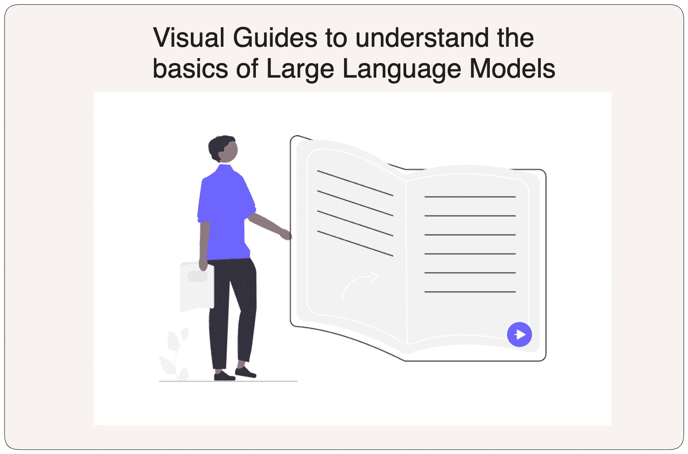

# 视觉指南：理解大型语言模型的基础

> 原文：[`towardsdatascience.com/visual-guides-to-understand-the-basics-of-large-language-models-0715701bdd20?source=collection_archive---------5-----------------------#2024-01-06`](https://towardsdatascience.com/visual-guides-to-understand-the-basics-of-large-language-models-0715701bdd20?source=collection_archive---------5-----------------------#2024-01-06)

## 一系列直观地分解复杂 AI 概念的工具和文章

 [Parul Pandey](https://pandeyparul.medium.com/?source=post_page---byline--0715701bdd20--------------------------------)

· 发表在 [Towards Data Science](https://towardsdatascience.com/?source=post_page---byline--0715701bdd20--------------------------------) ·阅读时间：7 分钟·2024 年 1 月 6 日

--

图片由作者使用 [unDraw.co](https://undraw.co/) 提供的免费插图制作

> 这是一篇动态文档，将不断更新。
> 
> 最后更新：2024 年 8 月 10 日，新增 Transformer 解释器

今天，世界充满了关于 LLM（大型语言模型）的讨论。几乎每天都有新的语言模型发布，令人工智能领域的从业者感到错过了什么。然而，许多人仍然难以理解 LLM 的基本概念，这使得他们难以跟上技术的进步。本文旨在帮助那些希望深入了解这些 AI 模型内部运作的人，帮助他们牢牢把握该主题。为此，我将介绍一些工具和文章，帮助加深对 LLM 概念的理解，并使其更加易于掌握。

# 目录

· 1\. Jay Alammar 的插图版 Transformer

· 2\. Jay Alammar 的插图版 GPT-2

· 3\. Transformer 解释器：文本生成模型的互动学习

· 4\. Brendan Bycroft 的 LLM 可视化

· 5\. 生成式 AI 存在是因为 Transformer — 《金融时报》

· 6\. OpenAI 的分词器工具

· 7\. Simon 的 GPT 分词器解析…
