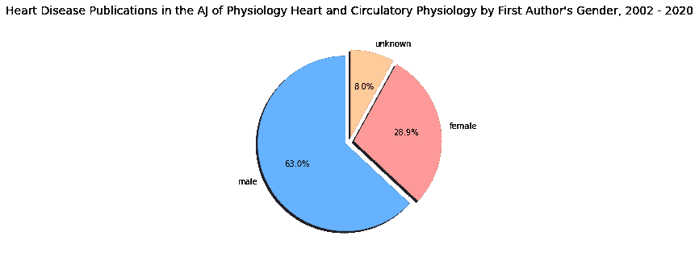

# 使用 Matplotlib 绘制数据的饼图

> 原文：[`towardsdatascience.com/visualization-of-data-with-pie-charts-in-matplotlib-024ed64edca1?source=collection_archive---------6-----------------------#2024-10-16`](https://towardsdatascience.com/visualization-of-data-with-pie-charts-in-matplotlib-024ed64edca1?source=collection_archive---------6-----------------------#2024-10-16)

## 如何在 Jupyter Notebook 中使用 Pandas，结合 Matplotlib 创建不同类型的饼图，以可视化数据库分析结果的示例

 [Diana Rozenshteyn](https://dianarozenshteyn.medium.com/?source=post_page---byline--024ed64edca1--------------------------------)

·发表于[Towards Data Science](https://towardsdatascience.com/?source=post_page---byline--024ed64edca1--------------------------------) ·阅读时间：5 分钟·2024 年 10 月 16 日

--

图片由[Niko Nieminen](https://unsplash.com/@n1en1k?utm_source=medium&utm_medium=referral)提供，来源于[Unsplash](https://unsplash.com/?utm_source=medium&utm_medium=referral)

# 挑战

在我撰写硕士论文《与 NIH 资助的心脏病研究中具有影响力的科学出版物相关的因素》时，我使用了不同类型的饼图来展示从数据库分析中得出的一些关键发现。

当数据集包含有限数量的类别，且这些类别代表整体的部分时，饼图可能是数据可视化的有效选择。它特别适合用来显示类别数据，重点比较每个类别的相对比例。

在本文中，我将展示如何使用相同的数据集创建四种不同类型的饼图，以提供更全面的视觉呈现，并深入洞察数据。为此，我将使用 Python 的绘图库 Matplotlib 来展示存储在数据框中的统计数据的饼图可视化。如果你对 Matplotlib 库不熟悉，一个很好的起点是 Jake VanderPlas 的《Python 数据科学手册》，特别是关于[使用 Matplotlib 进行可视化](https://www.oreilly.com/library/view/python-data-science/9781491912126/ch04.html)的章节，以及[matplotlib.org](https://matplotlib.org/stable/api/_as_gen/matplotlib.pyplot.pie.html)。

## 首先，让我们导入所有必要的库和扩展：

## 接下来，我们将准备 CSV 文件进行处理：

本文使用的小型数据集突出了 2002 年至 2020 年间心脏病研究领域排名前十的期刊，是用于硕士论文研究的大型数据库的一部分。列“Female”（女性）、“Male”（男性）和“Unknown”（未知）表示已发表文章的第一作者的性别，而“Total”（总数）列则反映了每本期刊所发表的心脏病研究文章的总数。

图片由作者提供，表示上面`Pie_Chart_Artcile_2.py`示例代码的输出结果。

对于类别较少的小型数据集，带有爆炸切片（exploding slices）的饼图可以有效地通过稍微突出一个关键类别来引起注意。这种视觉效果能使特定类别从整体中脱颖而出。每一片代表总体的一部分，大小与其所代表的数据成比例。可以为每一片添加标签以指示类别，并附上百分比以展示其占总体的比例。这种视觉技巧使得爆炸的切片突出显示，而不会丧失完整数据表示的上下文。

图片由作者提供，表示上面`Pie_Chart_Artcile_3.py`示例代码的输出结果。

同样的爆炸切片技巧也可以应用于示例数据集中的所有其他条目，并且生成的图表可以显示在同一图形中。这种可视化类型有助于突出数据集中某一类别的过度或不足表示。在提供的示例中，将所有 10 个图表呈现在同一图形中，揭示了心脏病研究领域排名前十的期刊中，没有一本期刊发表的女性作者文章多于男性，从而强调了性别差异。

2002 至 2020 年间心脏病研究领域排名前十期刊的性别分布。图片由作者提供，表示上面`Pie_Chart_Artcile_4.py`示例代码的输出结果。

饼图的一种变体，称为甜甜圈图（donut chart），也可以用来可视化数据。甜甜圈图与饼图类似，都显示构成整体的各个类别的比例，但甜甜圈图的中心部分也可以用来呈现额外的数据。这种格式在视觉上更为简洁，相较于标准饼图，它使得比较各部分相对大小变得更加容易。在本文使用的示例中，甜甜圈图突出了在心脏病研究领域排名前十的期刊中，《美国生理学杂志·心脏与循环生理学》发表了最多的文章，占比 21.8%。

图片由作者提供，表示上面`Pie_Chart_Artcile_5.py`示例代码的输出结果。

我们可以通过在先前的甜甜圈图的基础上构建嵌套版本，来增强从示例数据集中获取附加信息的可视化效果。Matplotlib 的 figure 模块中的 [add_artist()](https://matplotlib.org/stable/api/_as_gen/matplotlib.figure.Figure.add_artist.html) 方法用于将任何额外的艺术元素（如图形或对象）融入到基础图形中。与早期的甜甜圈图类似，这个变体展示了心脏病研究领域前 10 本期刊的出版物分布。然而，它还包括了一个额外的层级，显示了每本期刊的第一作者的性别分布。这个可视化突出了第一作者中男性的比例较大。

由作者提供的图像，展示了上面提到的 `Pie_Chart_Artcile_6.py` 示例代码的输出。

总结来说，饼图非常有效地用于可视化具有有限类别数量的数据，因为它使观众能够一眼快速理解最重要的类别或占主导地位的比例。在这个具体的示例中，使用四种不同类型的饼图清晰地展示了基于 2002 至 2020 年小型数据集的心脏病研究领域前 10 期刊第一作者的性别分布。显而易见，大多数出版物的第一作者是男性，并且在研究期间，心脏病研究的前 10 期刊中，没有一本期刊的女性第一作者数量超过男性。

本文使用的 Jupyter Notebook 和数据集可以在 [GitHub](https://github.com/drozenshteyn/Visualisation-of-Data-with-Pie-Charts-in-Matplotlib) 上找到。

感谢阅读，

Diana

注意：我使用了 GitHub 嵌入功能来发布这篇文章。
