# 通过数据序列化可视化业务流程

> 原文：[`towardsdatascience.com/visualize-a-business-process-through-data-serialization-772cd9510c31?source=collection_archive---------4-----------------------#2024-03-15`](https://towardsdatascience.com/visualize-a-business-process-through-data-serialization-772cd9510c31?source=collection_archive---------4-----------------------#2024-03-15)

## *有时，我们希望在 Power BI 中可视化一个业务流程。根据所需的可视化效果以及我们通常方式建模数据时，这可能是一个挑战。让我们通过改变建模方式来看如何实现这一目标。*

[](https://medium.com/@salvatorecagliari?source=post_page---byline--772cd9510c31--------------------------------)[](https://towardsdatascience.com/?source=post_page---byline--772cd9510c31--------------------------------) [Salvatore Cagliari](https://medium.com/@salvatorecagliari?source=post_page---byline--772cd9510c31--------------------------------)

·发表于 [Towards Data Science](https://towardsdatascience.com/?source=post_page---byline--772cd9510c31--------------------------------) ·阅读时长 11 分钟·2024 年 3 月 15 日

--


图片由 [Lukas Blazek](https://unsplash.com/@goumbik?utm_source=medium&utm_medium=referral) 提供，来自 [Unsplash](https://unsplash.com/?utm_source=medium&utm_medium=referral)

# 介绍

我们的业务由多个流程组成。有些流程很明显，比如生产流程，而有些则更具虚拟性。

例如，当我想计算利润时，实际上是有一个“过程”来实现的。

以非常简单的方式来说，当我把收入减去开支时，剩下的就是我的利润。

我目前的目标是通过图表可视化这一过程。

该图表应该显示利润的构成过程。为此，我喜欢将销售金额到利润的值显示为瀑布图。

这是我在 Excel 中创建的一个类似的模型：

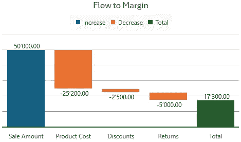

图 1 — 我的利润构成的目标可视化（图由作者提供）

我从销售金额开始，逐步扣除所有费用，直到得到利润。

在 Power BI 中实现这一点有一些挑战。

首先，我必须更改我的数据模型。然后，我可以编写一些度量值。最后，我可以创建可视化图表。

最终，我将收集有关数据模型及其性能的信息，以评估我的方法的质量。

让我们逐步了解这些步骤。

# 数据挑战

首先，标准的瀑布图不允许添加多个度量来构建这个图表。

至少有一个自定义可视化可以做到这一点，但它是收费的可视化，我想使用标准的瀑布图。我的大多数客户不愿意购买自定义可视化。

所以，我需要改变数据存储方式以完成这项工作。

通常，我们将数据按每列一个数值的方式存储。

类似这样的：

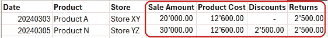

图 2 — 标准的事实建模方式（交易）（图由作者提供）

我创建了不同的 DAX 度量来聚合列，以获得所需结果。

最终，我可以通过从销售额中扣除支出来计算利润率。

然而，这种方法并没有解决我的问题。因此，我需要使用不同的数据建模方法来绘制瀑布图。

我只能将一个度量添加到可视化中。对于瀑布图中的各个部分，我必须添加一列用于数据的分类/分段。

为了实现这一点，我必须取消透视数据，将单个度量值垂直存储在一个数值列中。度量名称存储在一个单独的列中，用来包含分类信息。

类似这样的：

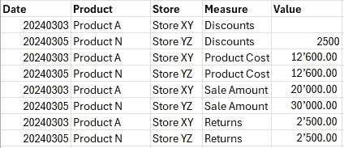

图 3 — 取消透视后的（序列化的）数据（图由作者提供）

这种建模技术被称为“序列化”，因为数据是垂直序列化的，而不是水平序列化的。

仍然有一个问题：所有的值都是正数。然而，我必须将其中一些值转换为负数，在瀑布图中显示时，用来从销售额中扣除它们。

此外，度量的顺序必须正确，以确保它们不会按字母顺序显示。

为了实现这一点，我创建一个包含度量的表，如下所示：

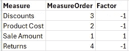

图 4 — 度量列表表（图由作者提供）

如果你的数据源是关系型数据库，我建议在数据库中创建这个表并进行数据转换。

由于在不同平台和数据建模类型之间，数据库中的具体操作方式可能不同，我将在这里不展示这一部分。请联系你的数据库开发人员来处理这个问题。

在这篇文章中，我将向你展示如何在 Power Query 和 DAX 中做到这一点。

# Power Query 中的数据重新建模

在 Power Query 中，第一步是直接的：

我使用取消透视转换将数据从列导向转为行导向，并得到如上所示的结果。

我选择所有包含值的列（度量列），然后点击“取消透视”按钮。在这里，我选择“仅取消透视选定的列”：

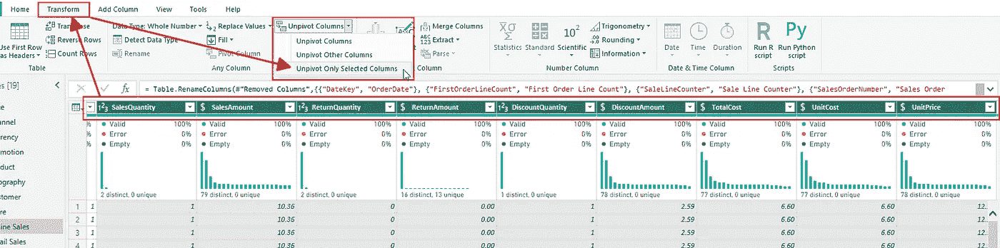

图 5 — 取消透视所有度量列（图由作者提供）

一段时间后（取决于数据量和来源），度量列会被替换为两个新列：属性和数值。

我修改了 M 代码，将“属性”列重命名为“度量”：

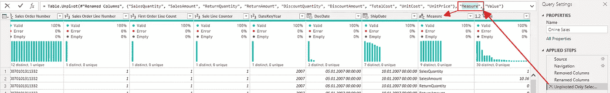

图 6 — 更改属性列的名称（图由作者提供）

要在 Power Query 中查看公式栏，必须启用以下选项：

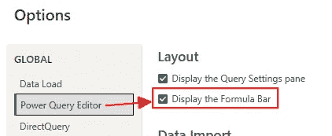

图 7 — 在 Power Query 中启用公式栏（图由作者提供）

由于我的模型包含了 Contoso 演示数据，其中有两个事实表（在线销售和零售销售），我对另一个表执行相同的步骤。

接下来，我创建包含所有 Measure 的列表的表格。

我右键点击在线销售表格，点击“引用”。我创建了一个引用，因为它重用了已经从数据源读取的数据。“重复”操作会重新从源读取完整的表格，这是不必要的。

一个新表已添加到 Power Query。

我将此表重命名为“MeasureList”。

我只需要 Measure 列。因此，我右键点击 Measure 列并点击“删除其他列”：

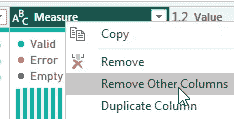

图 8 — 从引用表中删除所有列（图由作者提供）

我对零售销售表执行相同的步骤。不过这次，我将表格重命名为“零售度量”。

这个表将被附加到 MeasureList 表格。所以，我关闭了该表的加载功能：

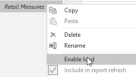

图 9 — 禁用第二个引用表的 Power BI 加载（图由作者提供）

现在，我将第二个引用表附加到“MeasureList”表：

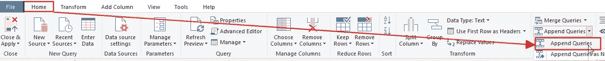

图 10 — 将第二张表附加到“MeasureList”表（图由作者提供）

我在以下对话框中选择了第二个表，“零售度量”。

这里的最后一步是从结果表中删除重复项：

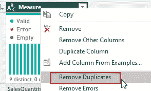

图 11 — 从“MeasureList”表中删除重复项（图由作者提供）

结果是两个表中的所有 Measure 的组合列表：

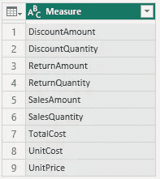

图 12 — 结果的“MeasureList”表格（图由作者提供）

现在，我必须添加一个条件列来添加 MeasureSort 列：

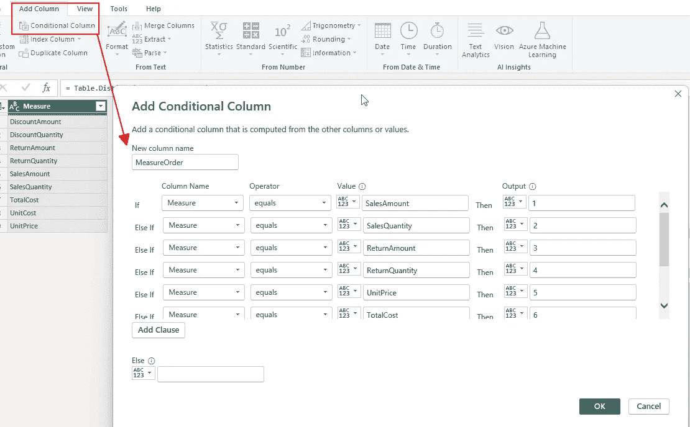

图 13 — 添加条件列以创建 MeasureOrder（图由作者提供）

所有 Measure 的顺序如下：

+   “SalesAmount”: 1

+   “SalesQuantity”: 2

+   “ReturnAmount”: 3

+   “ReturnQuantity”: 4

+   “UnitPrice”: 5

+   “TotalCost”: 6

+   “UnitCost”: 7

+   “DiscountAmount”: 8

+   “DiscountQuantity”: 9

在我的案例中，Power Query 需要大量时间来获取所有数据。

原因是，我从操作中得到了两个巨大的表格。

让我们做一些数学计算：

在线销售表格有 1200 万行，再乘以九个 Measure 列，结果是超过 1.08 亿行。

零售销售表有将近 350 万行，再乘以九，我得到了 3150 万行。

当我们查看该模型的统计信息和性能时，我稍后会回到这些数字。

因此，我使用 DAX 计算 Factor 列来节省时间。

我本来会在 Power Query 中添加一个带有逻辑的条件列来设置正确的值，但为了节省时间，我没有这样做。

# 在 DAX 中添加计算列

我将 Factor 列作为计算列添加到新的 MeasureList 表中，使用 Power BI 进行计算。

由于我只有两个可能的值，所以我使用 [IF()](https://dax.guide/if/) 来计算结果：

```py
Factor = IF('MeasureList'[Measure] IN {"SalesAmount", "SalesQuantity", "UnitPrice"}, 1, -1)
```

隐藏 MeasureOrder 列后，MeasureList 表现在看起来是这样的：

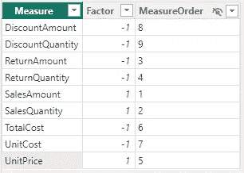

图 14 — 完成的“MeasureList”表（图表由作者提供）

现在，我必须将 Measure 列的“Sort by Column”设置为 MeasureOrder 列：

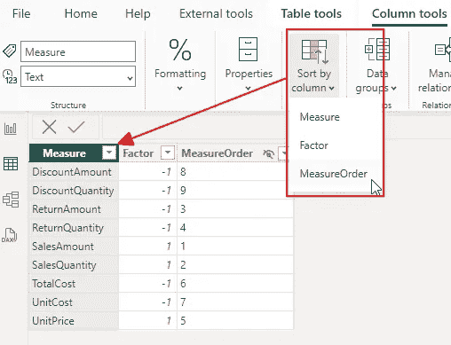

图 15 — 通过 MeasureOrder 列设置顺序（图表由作者提供）

接下来，我从“MeasureList”表添加关系到“Online Sales”和“Retail Sales”表。

我从两个事实表中隐藏了 Measure 列。

我添加了两个基础 Measure 来汇总两个事实表中的值列：

```py
Sum Online Value = SUM('Online Sales'[Value])
```

我必须将所有访问单独 Measure 列的 Measure 更改为过滤 Measure 的 Measure。

类似这样的：

```py
Online Sales = CALCULATE([Sum Online Value])
                        ,'MeasureList'[Measure] = "SalesAmount"
                        )
```

但是，要计算瀑布图的正确值，我需要在最终的 Measure 中包含按 Measure 计算的因子：

```py
Value with Factor =
  VAR Factor = SELECTEDVALUE('MeasureList'[Factor])
RETURN
  [Sum Online Value] * Factor
```

现在我们可以创建瀑布图可视化。

# 可视化

我将瀑布图添加到一个新的报告页面。

我为 Y 轴设置了 Measure [Value with Factor]，并将 MeasureList 表中的 Measure 列设置为分类：

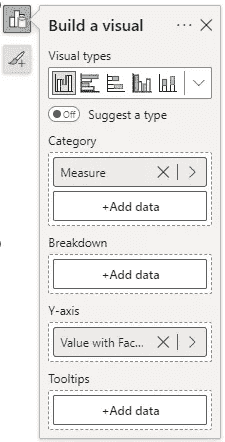

图 16 — 设置瀑布图（图表由作者提供）

但现在，我们看到了“MeasureList”表中的所有 Measure。

由于我只想查看它们的子集，所以我使用筛选面板来缩小到所需的 Measure：

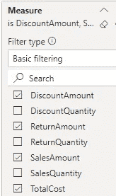

图 17 — 为瀑布图设置筛选器（图表由作者提供）

在添加了一个筛选器（Slicer），用于筛选 2008 年的日历年，并按 Measure 名称对图表进行排序后，我得到了我想要的结果（启用了数据标签并移除了轴标签等）：

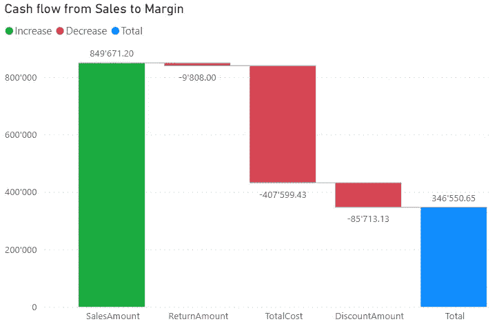

图 18 — 完成的瀑布图（图表由作者提供）

这几乎是我预期的结果。

不幸的是，无法将 Total 列重命名为“Margin”（例如）。

我试图在“Total”字样上方添加一个文本框，里面写着“Margin”。但首先，这是一个繁琐的任务（我必须匹配字体、字体大小和颜色，并且还得将其放置在正确的位置）。其次，当用户点击瀑布图时，它会自动切换到前面，遮住文本框。

另外，我写了一个好的标题，确保用户能理解他们看到的内容。

# 让我们来谈谈统计数据

在我们大声喊出“是的，这解决了我所有的问题，从今以后我只会这样做！”之前，让我们看看一些统计数据和性能指标。

我使用 Vertipaq Analyzer 分析原始和修改后的数据模型中的统计数据。

首先，保存的 pbix 文件大小差异并不大：

+   原始模型为 290 MB

+   修改后的模型为 340 MB

但是，当我查看来自 Vertipaq 分析的内存大小时，我得到不同的数字：

+   原始模型为 350 MB

+   修改后的模型为 950 MB

内存使用量几乎增加了三倍。

这表明数据无法像之前那样很好地压缩。

然后，当我们查看表格统计信息时，我们看到发生了什么：

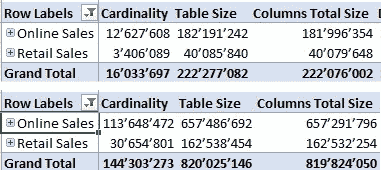

图 19 — 两个模型的表格统计信息（图由作者提供）

在图片的顶部，你看到的是原始模型的统计数据，而下面是修改后的模型。

如前所示，行数是乘以度量列数的结果。

但是表格的大小几乎大了四倍。

当我更深入地分析数据时，我发现值列使用了更多的内存，但在线销售表的销售订单号、销售订单号和产品键列占用了整个数据库的 42.5%。在更改数据建模之前，这一比例要低得多。

我可以尝试更改表的顺序。然而，Power BI 通常会在分析数据并决定按照哪个列对数据进行排序以实现最佳压缩后做出较好的决策。

重新加载这两张表几乎需要一个小时，所以我现在不做了。

我可能会在未来做，并将结果发布在这里。

但是首先，让我们做一些性能测量。

我使用 [DAX Studio](https://www.sqlbi.com/tools/dax-studio/) 和这里描述的方法来获取性能数据：

[](/how-to-get-performance-data-from-power-bi-with-dax-studio-b7f11b9dd9f9?source=post_page-----772cd9510c31--------------------------------) ## 如何使用 DAX Studio 获取 Power BI 的性能数据

### 有时我们会遇到报告变慢的情况，我们需要找出原因。我们将看到如何收集性能数据以及……

towardsdatascience.com

第一个测试是比较在线销售金额：

我从一个显示按年份和月份销售金额的可视化中获取查询。

原始数据模型的执行统计信息如下：

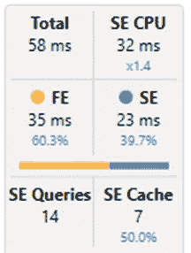

图 20 — 简单的销售金额计算（原始）（图由作者提供）

以下是修改后的数据模型的执行统计信息：

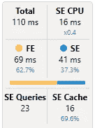

图 21 — 简单的销售金额计算（修改后的数据模型）（图由作者提供）

如你所见，总时间明显更高。当我们查看 SE 数字时，我们发现并行性比之前低得多，这表明该模型效率较低。

现在，我添加更多的度量。例如，利润率、去年、同比变化等等：

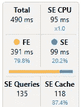

图 22 — 多度量计算（原始）（图由作者提供）

这是修改后的数据模型：

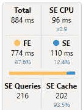

图 23 — 多度量计算（修改后的数据模型）（作者提供的图示）

正如你所看到的，两个数据模型之间的性能差异再次非常大。

而且这些只是非常简单的计算。

当我查看更复杂的计算时，差异会更大。我观察到性能差异为原来的 3 到 4 倍。

# 结论

虽然这种方法打开了多种可能性，但我只推荐在某些特定场景下使用它。

我建议仅在标准模型无法满足需求时使用这种方法。

性能下降的风险是显而易见的，不能忽视。

不要被这种思维误导：“我只有几千行数据。”

根据我的经验，Power BI 中的数据量并不重要。

更重要的是数据中的不同值的数量，也就是所谓的“基数”。

我们来看一下“订单编号”这一列。

每个订单都有不同的订单编号。因此，这一列的基数非常高，无法有效压缩。

然后，即便是几千行数据，复杂的计算也可能导致性能差。

因此，每种情况都不同，必须根据情况进行相应的测试。

无论如何，这条路径在某些时候是必须的，以允许像我案例中请求的图表。

我的一个客户有一份数据，他希望根据这些数据创建两个类似上面展示的瀑布图。

然而，他的业务案例中涉及的两张表有 25 个度量列，这意味着数据行数将增加 25 倍。

在这种情况下，他需要为八个度量创建两个瀑布图。我将保留原始表，并仅复制所需的数据来创建请求的图表。

因此，所有“正常”的计算将在能够满足其要求的同时，保持正常的性能。

另外一个采用这种方式的积极原因是，我可以将事实表（在 Power Query 中追加）合并成一张表。在这种情况下，我会在合并之前添加一个包含来源的列，例如“在线销售”和“零售销售”。这样可以简化数据模型。

但正如我们现在所知道的，我们需要进行测试，重复测试，并进行其他场景的测试，直到我们了解这种建模方法的后果。


由[Jan Kopřiva](https://unsplash.com/@jxk?utm_source=medium&utm_medium=referral)拍摄，图片来源于[Unsplash](https://unsplash.com/?utm_source=medium&utm_medium=referral)

# 参考文献

我使用的是 Contoso 示例数据集，正如我在之前的文章中所做的那样。你可以从微软[这里](https://www.microsoft.com/en-us/download/details.aspx?id=18279)免费下载 ContosoRetailDW 数据集。

Contoso 数据可以在 MIT 许可证下自由使用，具体描述请见[这里](https://github.com/microsoft/Power-BI-Embedded-Contoso-Sales-Demo)。

[](https://medium.com/subscribe/@salvatorecagliari?source=post_page-----772cd9510c31--------------------------------) [## 每当 Salvatore Cagliari 发布文章时，获取电子邮件通知。

### 每当 Salvatore Cagliari 发布文章时，都会收到电子邮件通知。通过注册，如果你还没有 Medium 账户，你将会创建一个账户…

medium.com](https://medium.com/subscribe/@salvatorecagliari?source=post_page-----772cd9510c31--------------------------------)

尽管 Medium 有付费墙，我还是让我的文章对每个人都可访问。这让我可以从每个读者那里赚取一些收入，但我将其关闭，以便你可以免费阅读我的文章。

你可以通过以下方式支持我的工作，这是我在空闲时间进行的工作，

[`buymeacoffee.com/salvatorecagliari`](https://buymeacoffee.com/salvatorecagliari)

或者扫描这个二维码：


任何支持都将不胜感激，并帮助我找到更多时间为你创造更多内容。

非常感谢。
