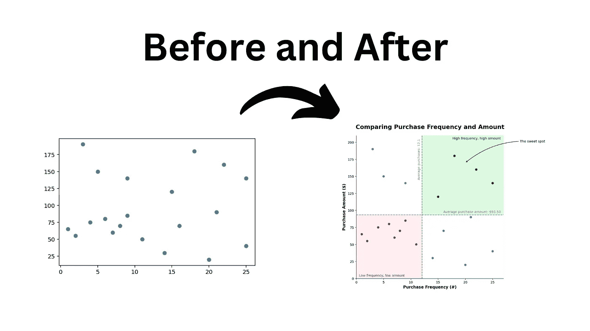

# 像专业人士一样可视化：为 Matplotlib 图表添加注释，讲述引人入胜的数据故事

> 原文：[`towardsdatascience.com/visualize-like-a-pro-annotate-matplotlib-graphs-for-stunning-data-stories-9a58a5816a07?source=collection_archive---------4-----------------------#2024-05-28`](https://towardsdatascience.com/visualize-like-a-pro-annotate-matplotlib-graphs-for-stunning-data-stories-9a58a5816a07?source=collection_archive---------4-----------------------#2024-05-28)

## 理解并使用 Matplotlib 中的注释

 [Nik Piepenbreier](https://medium.com/@nik.piepenbreier?source=post_page---byline--9a58a5816a07--------------------------------)

·发布于 [Towards Data Science](https://towardsdatascience.com/?source=post_page---byline--9a58a5816a07--------------------------------) ·10 分钟阅读·2024 年 5 月 28 日

--

照片由 [Lukas Blazek](https://unsplash.com/@goumbik?utm_source=medium&utm_medium=referral) 提供，来源于 [Unsplash](https://unsplash.com/?utm_source=medium&utm_medium=referral)

Matplotlib 是 Python 中最重要的数据可视化库之一。它具有显著的灵活性和可定制性。这意味着你可以创建令人惊叹的可视化效果——但前提是你需要了解其内部工作原理。

**在本教程中，我将指导你如何使用 Matplotlib 向你的可视化图表添加不同的注释**。这将帮助读者更好地理解你的数据含义。

快来看看下面的预览，了解你在本教程中能创建的内容！

> *注意*: 所有图片均由作者创作，除非另有注明。

我们的完整转型

# 加载示例数据集

在本教程中，我们将使用一个示例 Pandas 数据集，该数据集生成虚拟客户数据。每个数据点将包括：

1.  该客户的交易次数，和

1.  每次交易的金额。
