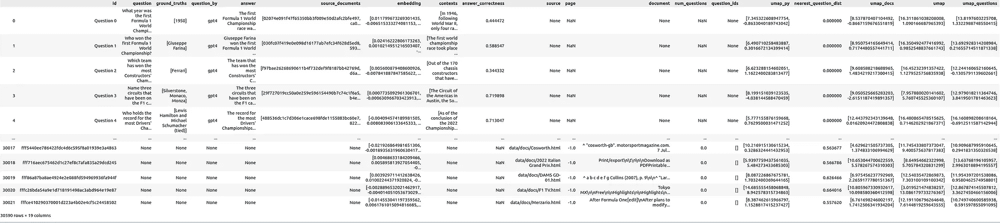

# 可视化你的 RAG 数据——使用 Ragas 评估你的检索增强生成系统

> 原文：[`towardsdatascience.com/visualize-your-rag-data-evaluate-your-retrieval-augmented-generation-system-with-ragas-fc2486308557?source=collection_archive---------0-----------------------#2024-03-03`](https://towardsdatascience.com/visualize-your-rag-data-evaluate-your-retrieval-augmented-generation-system-with-ragas-fc2486308557?source=collection_archive---------0-----------------------#2024-03-03)

## 如何使用 UMAP 降维技术展示嵌入的多个评估问题及其与源文档的关系，使用 Ragas、OpenAI、Langchain 和 ChromaDB

[](https://medium.com/@markus.stoll?source=post_page---byline--fc2486308557--------------------------------)[](https://towardsdatascience.com/?source=post_page---byline--fc2486308557--------------------------------) [Markus Stoll](https://medium.com/@markus.stoll?source=post_page---byline--fc2486308557--------------------------------)

·发表于[Towards Data Science](https://towardsdatascience.com/?source=post_page---byline--fc2486308557--------------------------------) ·13 分钟阅读·2024 年 3 月 3 日

--

检索增强生成（RAG）在大语言模型（LLM）的工作流程中增加了一个检索步骤，使其能够在回答问题时，从额外的来源（如私人文档）查询相关数据[1]。这一工作流程不需要对 LLM 进行昂贵的训练或微调来适应额外的文档。文档被拆分成片段，然后进行索引，通常使用紧凑的机器学习生成的向量表示（嵌入）。具有相似内容的片段会在这个嵌入空间中彼此接近。

RAG 应用将用户提供的问题投影到嵌入空间中，以根据其与问题的距离检索相关的文档片段。LLM 可以使用检索到的信息来回答查询，并通过展示片段作为参考来证明其结论。


通过 UMAP[3]降维对维基百科 F1 公式文章的嵌入空间进行迭代动画展示，并对聚类进行人工标注——由作者创建。

评估 RAG 应用程序是一个挑战[2]。存在不同的方法：一方面，有些方法需要开发者提供作为真实答案的基础；另一方面，答案（和问题）也可以由另一个 LLM 生成。支持 LLM 回答的最大开源系统之一是 Ragas[4]（检索增强生成评估），它提供

+   基于文档生成测试数据的方法

+   基于不同的评估指标，逐步评估检索和生成步骤，以及端到端评估。

在本文中，你将学到

+   如何简要构建一个用于一级方程式的 RAG 系统（详细描述请参见上一篇文章[可视化您的 RAG 数据——检索增强生成的 EDA](https://medium.com/itnext/visualize-your-rag-data-eda-for-retrieval-augmented-generation-0701ee98768f)）

+   生成问题和答案

+   使用[Ragas](https://github.com/explodinggradients/ragas)评估 RAG 系统

+   最重要的是，如何使用[Renumics Spotlight](https://github.com/Renumics/spotlight)可视化结果并解释结果。

> *该* [*代码可在 Github 上获取*](https://github.com/Renumics/renumics-rag/blob/main/notebooks/visualize_rag_tutorial_qs.ipynb)

# 准备好你的环境

启动一个笔记本并安装所需的 Python 包

```py
!pip install langchain langchain-openai chromadb renumics-spotlight
%env OPENAI_API_KEY=<your-api-key>
```

本教程使用以下 Python 包：

+   [**Langchain**](https://github.com/langchain-ai/langchain)：一个集成语言模型和 RAG 组件的框架，使得设置过程更加顺畅。

+   [**Renumics-Spotlight**](https://github.com/Renumics/spotlight)：一个用于交互式探索非结构化机器学习数据集的可视化工具。

+   [**Ragas**](https://github.com/explodinggradients/ragas)：一个帮助你评估 RAG 管道的框架

*免责声明：本文的作者也是 Spotlight 的开发者之一。*

# 为数据集准备文档和嵌入

你可以使用你自己的 RAG 应用程序，跳到下一部分学习如何评估、提取和可视化。

或者，你可以使用[上一篇文章](https://medium.com/itnext/visualize-your-rag-data-eda-for-retrieval-augmented-generation-0701ee98768f)中的 RAG 应用程序，并使用[我们准备的所有一级方程式维基百科文章的数据集](https://spotlightpublic.blob.core.windows.net/docs-data/rag_demo/docs.zip)。在这里，你还可以将自己的文档插入到‘docs/’子文件夹中。

> 本数据集基于[维基百科](https://www.wikipedia.org/)的文章，并遵循创作共用署名-相同方式共享许可证。原始文章及作者列表可在相应的维基百科页面找到。

现在，你可以使用 Langchain 的`DirectoryLoader`加载所有来自 docs 子目录的文件，并使用`RecursiveCharacterTextSpliter`将文档分割为片段。使用`OpenAIEmbeddings`你可以创建嵌入并将其存储在`ChromaDB`作为向量存储。对于链本身，你可以使用 LangChain 的`ChatOpenAI`和`ChatPromptTemplate`。

本文的[链接代码](https://github.com/Renumics/rag-demo/blob/main/notebooks/visualize_rag_tutorial_qs.ipynb)包含了所有必要的步骤，你可以在[上一篇文章](https://medium.com/itnext/visualize-your-rag-data-eda-for-retrieval-augmented-generation-0701ee98768f)中找到对所有步骤的详细描述。

一个重要的点是，你应该使用哈希函数为`ChromaDB`中的片段创建 ID。这使得如果你只有包含其内容和元数据的文档时，仍然能够在数据库中找到嵌入。这使得可以跳过那些已经存在于数据库中的文档。

```py
import hashlib
import json
from langchain_core.documents import Document

def stable_hash_meta(doc: Document) -> str:
    """
    Stable hash document based on its metadata.
    """
    return hashlib.sha1(json.dumps(doc.metadata, sort_keys=True).encode()).hexdigest()

...
splits = text_splitter.split_documents(docs)
splits_ids = [
    {"doc": split, "id": stable_hash_meta(split.metadata)} for split in splits
]

existing_ids = docs_vectorstore.get()["ids"]
new_splits_ids = [split for split in splits_ids if split["id"] not in existing_ids]

docs_vectorstore.add_documents(
    documents=[split["doc"] for split in new_splits_ids],
    ids=[split["id"] for split in new_splits_ids],
)
docs_vectorstore.persist()
```

# 评估问题

对于像一级方程式这样的常见话题，你也可以直接使用 ChatGPT 生成一般性问题。在本文中，使用了四种问题生成方法：

+   **GPT4**：使用以下提示“写 30 个关于一级方程式的问题”，通过 ChatGPT 4 生成了 30 个问题。

    – 随机示例：“哪支一级方程式车队以其跃马标志而闻名？”

+   **GPT3.5**：使用以下提示“写 100 个关于一级方程式的问题”，并重复“谢谢，请再写 100 个”通过 ChatGPT 3.5 生成了另外 199 个问题。

    – 示例：“1950 年，哪位车手赢得了首届一级方程式世界锦标赛？”

+   **Ragas_GPT4**：使用 Ragas 生成了 113 个问题。Ragas 再次利用文档和其自己的嵌入模型构建一个向量数据库，然后用 GPT4 生成问题。

    – 示例：“你能告诉我更多关于 1998 年世界锦标赛中，乔丹 198 一级方程式赛车表现的信息吗？”

+   **Rags_GPT3.5**：使用 Ragas 生成了 226 个额外的问题——这里我们使用 GPT3.5。

    – 示例：“2014 年比利时大奖赛中发生了什么事件，导致汉密尔顿退赛？”

```py
from ragas.testset import TestsetGenerator

generator = TestsetGenerator.from_default(
    openai_generator_llm="gpt-3.5-turbo-16k", 
    openai_filter_llm="gpt-3.5-turbo-16k"
)

testset_ragas_gpt35 = generator.generate(docs, 100)
```

问题和答案没有经过任何审查或修改。所有问题都被合并到一个单一的数据框中，包含`id`、`question`、`ground_truth`、`question_by`和`answer`列。


接下来，问题将被提问给 RAG 系统。对于超过 500 个问题，这可能需要一些时间并产生费用。如果你按行提问，你可以暂停并继续处理，或者在崩溃后恢复，而不会丢失迄今为止的结果：

```py
for i, row in df_questions_answers.iterrows():
    if row["answer"] is None or pd.isnull(row["answer"]):
        response = rag_chain.invoke(row["question"])

        df_questions_answers.loc[df_questions_answers.index[i], "answer"] = response[
            "answer"
        ]
        df_questions_answers.loc[df_questions_answers.index[i], "source_documents"] = [
            stable_hash_meta(source_document.metadata)
            for source_document in response["source_documents"]
        ] 
```

不仅答案会被存储，还会存储检索到的文档片段的源 ID，以及它们的文本内容作为上下文：


此外，所有问题的嵌入也会生成并存储在数据框中。这使得可以将其与文档一起可视化。

# 使用 Ragas 进行评估

[Ragas](https://github.com/explodinggradients/ragas)提供了用于单独评估 RAG 管道中每个组件的指标，以及用于整体性能的端到端指标：

1.  **上下文精准度：** 使用`问题`和检索到的`上下文`，衡量信噪比。

1.  **上下文相关性：** 衡量检索到的上下文与问题的相关性，通过`问题`和`上下文`计算。

1.  **上下文召回：** 基于`真实情况`和`上下文`，检查是否检索到了所有相关的答案信息。

1.  **忠实度：** 利用`上下文`和`答案`，衡量生成的答案在事实上的准确性。

1.  **答案相关性：** 使用`问题`和`答案`计算，以评估生成的答案与问题的相关性（不考虑事实性）。

1.  **答案语义相似度：** 使用`真实情况`和`答案`评估生成答案与正确答案之间的语义相似性。

1.  **答案正确性：** 依赖于`真实情况`和`答案`，衡量生成的答案与正确答案的准确性和一致性。

1.  **方面评价：** 分析`答案`，根据预定义或自定义方面（如正确性或有害性）评估提交。

目前，我们关注的是答案正确性的端到端指标。数据框中的列名和内容已被复制并调整，以符合 Ragas API 的命名和格式要求：

```py
# prepare the dataframe for evaluation
df_qa_eval = df_questions_answers.copy()

# adapt the ground truth to the ragas naming and format
df_qa_eval.rename(columns={"ground_truth": "ground_truths"}, inplace=True)
df_qa_eval["ground_truths"] = [
    [gt] if not isinstance(gt, list) else gt for gt in df_qa_eval["ground_truths"]
]
```

这可能需要一些时间，甚至比仅仅查询你的 RAG 系统还要花费更多的金钱。让我们按行应用评估，以便在崩溃后能够恢复，而不丢失迄今为止的结果：

```py
# evaluate the answer correctness if not already done
fields = ["question", "answer", "contexts", "ground_truths"]
for i, row in df_qa_eval.iterrows():
    if row["answer_correctness"] is None or pd.isnull(row["answer_correctness"]):
        evaluation_result = evaluate(
            Dataset.from_pandas(df_qa_eval.iloc[i : i + 1][fields]),
            [answer_correctness],
        )
        df_qa_eval.loc[i, "answer_correctness"] = evaluation_result[
            "answer_correctness"
        ] 
```

之后，你可以将结果存储到`df_questions_answer`数据框中：

```py
df_questions_answers["answer_correctness"] = df_qa_eval["answer_correctness"]
```

# 准备可视化

为了在可视化中包含文档片段，我们将文档中的引用添加到使用该文档作为来源的问题中。此外，还会存储引用某文档的问题的数量：

```py
# Explode 'source_documents' so each document ID is in its own row alongside the question ID
df_questions_exploded = df_qa_eval.explode("source_documents")

# Group by exploded 'source_documents' (document IDs) and aggregate
agg = (
    df_questions_exploded.groupby("source_documents")
    .agg(
        num_questions=("id", "count"),  # Count of questions referencing the document
        question_ids=(
            "id",
            lambda x: list(x),
        ),  # List of question IDs referencing the document
    )
    .reset_index()
    .rename(columns={"source_documents": "id"})
)

# Merge the aggregated information back into df_documents
df_documents_agg = pd.merge(df_docs, agg, on="id", how="left")

# Use apply to replace NaN values with empty lists for 'question_ids'
df_documents_agg["question_ids"] = df_documents_agg["question_ids"].apply(
    lambda x: x if isinstance(x, list) else []
)
# Replace NaN values in 'num_questions' with 0
df_documents_agg["num_questions"] = df_documents_agg["num_questions"].fillna(0)
```

现在将问题的数据框与文档的数据框进行连接

```py
df = pd.concat([df_qa_eval, df_documents_agg], axis=0)
```

此外，让我们准备一些不同的 UMAP [3] 映射。你也可以稍后在 Spotlight GUI 中做同样的事情，但事先做这一步可以节省时间。

+   umap_all: 对所有文档和问题嵌入应用了拟合和变换的 UMAP

+   umap_questions: 仅对问题嵌入应用了拟合的 UMAP，并对两者应用了变换

+   umap_docs: 仅对文档嵌入应用了拟合的 UMAP，并对两者应用了变换

我们准备每个 UMAP 变换的方式如下：

```py
 umap = UMAP(n_neighbors=20, min_dist=0.15, metric="cosine", random_state=42).fit
umap_all = umap.transform(df["embedding"].values.tolist())
df["umap"] = umap_all.tolist() 
```

对于每个文档片段，另一个有趣的指标是它的嵌入与最近问题的嵌入之间的距离

```py
question_embeddings = np.array(df[df["question"].notna()]["embedding"].tolist())
df["nearest_question_dist"] = [  # brute force, could be optimized using ChromaDB
    np.min([np.linalg.norm(np.array(doc_emb) - question_embeddings)])
    for doc_emb in df["embedding"].values
]
```

这个指标对于找到未被问题引用的文档很有帮助。



# 可视化结果

如果你跳过了前面的步骤，你可以下载数据框并使用以下命令加载它：

```py
import pandas as pd
df = pd.read_parquet("df_f1_rag_docs_and_questions.parquet")
```

并启动[Renumics Spotlight](https://github.com/Renumics/spotlight)进行可视化：

```py
from renumics import spotlight

spotlight.show(df)
spotlight.show(
    df,
    layout="/home/markus/Downloads/layout_rag_1.json",
    dtype={x: Embedding for x in df.keys() if "umap" in x},
)
```

它将打开一个新的浏览器窗口：


公式一文档与评估问题的统计与相似性图 — 由作者使用[Renumics Spotlight](https://github.com/Renumics/spotlight)创建

在左上方，您可以看到一个**所有问题和所有文档**片段的表格。您可以使用“可见列”按钮来控制数据表中显示哪些列。直接创建一个筛选器，选择仅显示问题，从而在可视化中能够打开和关闭问题：选择所有问题，然后使用“从选定行创建筛选器”按钮来创建筛选器。

在表格的右侧，`answer correctness` **以指标形式**显示在所有问题中。下面有两个**直方图**；左边的显示了按不同问题生成方法划分的`answer correctness`分布。右边的显示了问题生成方法的分布。在此，如果需要，可以使用筛选按钮为问题创建筛选器，仅显示选定的行（即问题）。

右侧有**两个相似性图**。第一个使用`umap_questions`列，并显示基于仅应用于问题的转换（`umap_questions`）的问题和文档。它有助于独立于关联文档查看问题的分布，因为这种方法允许分析人员识别问题本身中的模式或聚类。

第二个相似性图显示了基于仅应用于文档的转换（`umap_docs`）的问题和文档。这有助于在文档的上下文中查看问题。当问题数量较多时，同时转换问题和文档的相似性图显示效果较差，因为问题会聚集在一起或分离开，往往与文档分开。因此，这里省略了这种表示方式。


公式一评估问题统计与相似性图 — 由作者使用[Renumics Spotlight](https://github.com/Renumics/spotlight)创建

## 文档嵌入相似性图：观察

在相似性图`umap_docs`中，您可以识别出文档嵌入空间中没有邻近问题的区域。当选择`nearest_question_dist`进行着色时，这一点会更加明显。


公式一文档与问题的相似性图（高亮显示）— 由作者使用[Renumics Spotlight](https://github.com/Renumics/spotlight)创建

可以识别出一些集群，其中包含仅包含标题的片段或包含仅有数字的表格数据，逐页拆分后其意义丧失。此外，许多特定于维基百科的文本添加，如指向其他语言的链接或编辑注释，形成了没有相邻问题的集群。

使用 Wikipedia API 删除维基百科相关文本中的噪音非常简单。可能并不是特别必要，因为它主要占用了一些空间——并不预期会显著恶化 RAG 的结果。然而，RAG 系统很难捕捉到包含在大型表格中的数据，因此使用高级预处理方法进行表格提取并将其连接到 RAG 系统可能是有益的。

在`umap_docs`相似性图中，另一个可以观察到的点是来自不同来源的问题的分布情况。


左：由 ChatGPT 生成的问题（GPT-3.5 和 GPT-4），右：通过 ragas 生成的问题，使用 GPT-3.5 和 GPT-4 — 由作者使用[Renumics Spotlight](https://github.com/Renumics/spotlight)创建

直接由 ChatGPT 生成（GPT-3.5，GPT-4）的问题位于中心的一个更局限的区域，而基于文档通过 ragas 生成的问题则覆盖了更大的区域。

## 答案正确性直方图

直方图可以作为起点，帮助初步了解数据的全局统计信息。总体而言，所有问题的`答案正确性`为 0.45。对于没有使用 ragas 生成的问题，答案正确性为 0.36，而使用 ragas 生成的问题则为 0.52。预计系统在使用 ragas 生成的问题上的表现会更好，因为这些问题是基于可用数据生成的，而直接由 ChatGPT 生成的问题可能来自 ChatGPT 训练时所使用的所有数据。


按问题来源着色的答案正确性直方图 - 由作者创建

对一些问题/答案及其真实答案的快速随机人工审查显示，在`答案正确性`为 0.3 到 0.4 的区间内，大多数问题仍然根据真实答案被正确回答。在 0.2 到 0.3 的区间内，出现了许多错误答案。在 0.1 到 0.2 的区间内，大多数答案是错误的。值得注意的是，几乎所有该范围内的问题都来自 GPT-3.5。虽然这两个由 GPT-4 生成的问题的`答案正确性`低于 0.2，但它们仍然被正确回答。

## 问题嵌入相似性图：观察结果

问题嵌入相似性图可以帮助通过检查可能导致相似问题的相似问题集群，深入挖掘`答案正确性`。

+   **聚类“车手/过程/汽车的术语：”** 平均`回答正确率`0.23：答案往往不够精确。例如，底盘调校与底盘弯曲，或刹车调校与刹车偏向调节。是否这些类型的问题适合用来评估系统尚存疑问，因为似乎很难判断这些答案的正确性。

+   **聚类“燃料策略的术语：”** 平均`回答正确率`0.44，类似于全局`回答正确率`。

+   **聚类“赛道名称：”** 平均`回答正确率`0.49，类似于全局`回答正确率`。

+   **聚类“谁保持记录…”**：平均`回答正确率`0.44，类似于全局`回答正确率`。

+   **聚类“赢得冠军的…”**：平均`回答正确率`0.26 —— 看起来具有挑战性。带有多个条件的问题，例如：“唯一获胜的车手是谁，他拥有英国赛车执照，驾驶意大利车队的赛车，搭载美国发动机。” 类似多查询的扩展 RAG 方法可能有助于改进这一点。

+   **聚类“唯一获胜的车手是…并且车上挂有号码<number>”**：平均`回答正确率`0.23 —— 看起来 GPT-3.5 在这里有些懒惰，尽管大多数真实答案是错误的，但它反复使用相同的问题并更改数字！


公式一问题的相似性图（高亮部分）与文档 —— 作者制作

# 结论

总结而言，利用基于 UMAP 的可视化方法提供了一种有趣的方式，能够深入挖掘，远超单纯的全局度量分析。文档嵌入相似性图提供了一个良好的概览，展示了相似文档的聚类及其与评估问题的关系。问题相似性图揭示了模式，允许通过质量度量区分和分析问题，从而生成洞察。请参阅“可视化结果”部分，将可视化应用于你的评估策略——你将发现什么洞察？

*我是一位专业人士，专注于为非结构化数据的互动探索创建先进的软件解决方案。我撰写关于非结构化数据的文章，并使用强大的可视化工具进行分析，以便做出明智的决策。*

# 参考文献

[1] Yunfan Gao, Yun Xiong, Xinyu Gao, Kangxiang Jia, Jinliu Pan, Yuxi Bi, Yi Dai, Jiawei Sun, Qianyu Guo, Meng Wang, Haofen Wang: [Retrieval-Augmented Generation for Large Language Models: A Survey](https://arxiv.org/abs/2312.10997) (2024), arxiv

[2] Yixuan Tang, Yi Yang: [MultiHop-RAG: Benchmarking Retrieval-Augmented Generation for Multi-Hop Queries](https://arxiv.org/abs/2401.15391) (2021), arXiv

[3] Leland McInnes, John Healy, James Melville: [UMAP: Uniform Manifold Approximation and Projection for Dimension Reduction](https://arxiv.org/abs/1802.03426) (2018), arXiv

[4] Shahul Es, Jithin James, Luis Espinosa-Anke, Steven Schockaert: [RAGAS: 检索增强生成的自动评估](https://arxiv.org/abs/2309.15217) (2023), arXiv
