# 用 LLMs 可视化和整合复杂想法，第一部分：Napkin AI

> 原文：[`towardsdatascience.com/visualizing-and-integrating-complex-ideas-with-llms-part-1-napkin-ai-0d6ced98c6dc?source=collection_archive---------2-----------------------#2024-07-16`](https://towardsdatascience.com/visualizing-and-integrating-complex-ideas-with-llms-part-1-napkin-ai-0d6ced98c6dc?source=collection_archive---------2-----------------------#2024-07-16)

## 发现 AI 工具如何将复杂的概念转化为清晰、实用的框架和图表

 [Kunal Kambo Puri](https://medium.com/@kunalkpuri?source=post_page---byline--0d6ced98c6dc--------------------------------)

·发表于 [Towards Data Science](https://towardsdatascience.com/?source=post_page---byline--0d6ced98c6dc--------------------------------) ·4 分钟阅读·2024 年 7 月 16 日

--

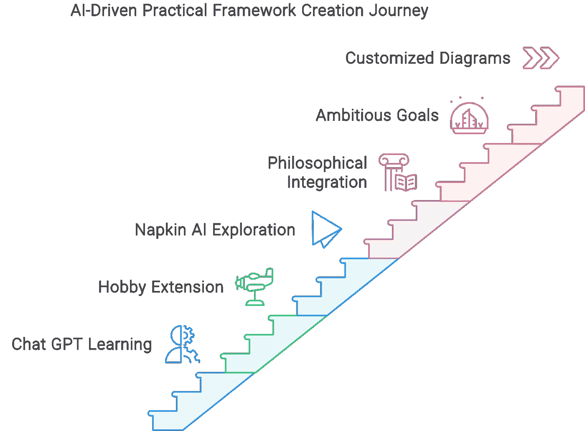

*图片由作者提供，使用 Napkin AI 制作*

# 介绍

像 Chat GPT 这样的 AI 工具正在改变我们处理复杂想法的方式。我喜欢用它做的一件事是整合来自不同思想家的视角和想法，并区分它们，以更好地理解它们的细微差别。这无疑是我最喜欢的 AI 应用之一。

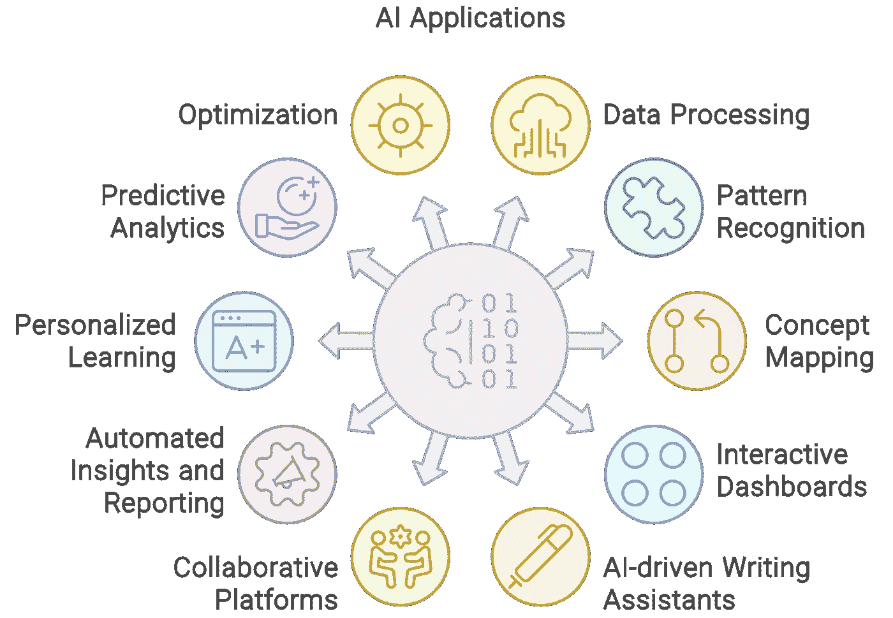

*图片由作者提供，使用 Napkin AI 制作*

# 动机

Napkin AI 吸引了我的注意，因为它可以根据文本输入自动生成有趣的图表，使其高度灵活且易于使用。我一直在寻找好的概念图和知识图谱软件，而这个工具看起来是一个不错的起点。

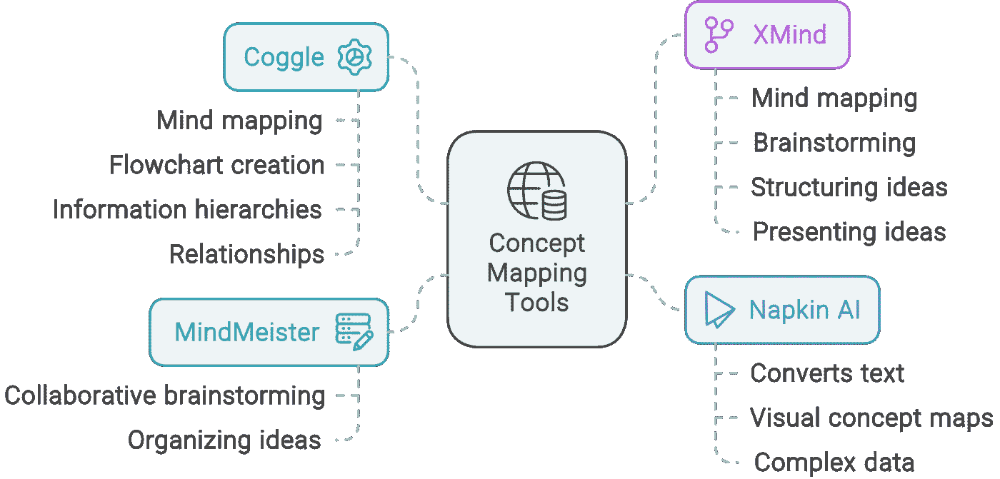

*图片由作者提供，使用 Napkin AI 制作*

# 目标

这篇文章是我将探索不同方法来检查、整合和可视化复杂思想和视角的系列文章中的第一篇。虽然我现在已经开始创建自己的工具，但实验使用 Napkin AI 是一个重要的第一步。在这个系列中，我将记录这段旅程，探索一些现有工具，制作新的工具易于使用，并分享我的经验。

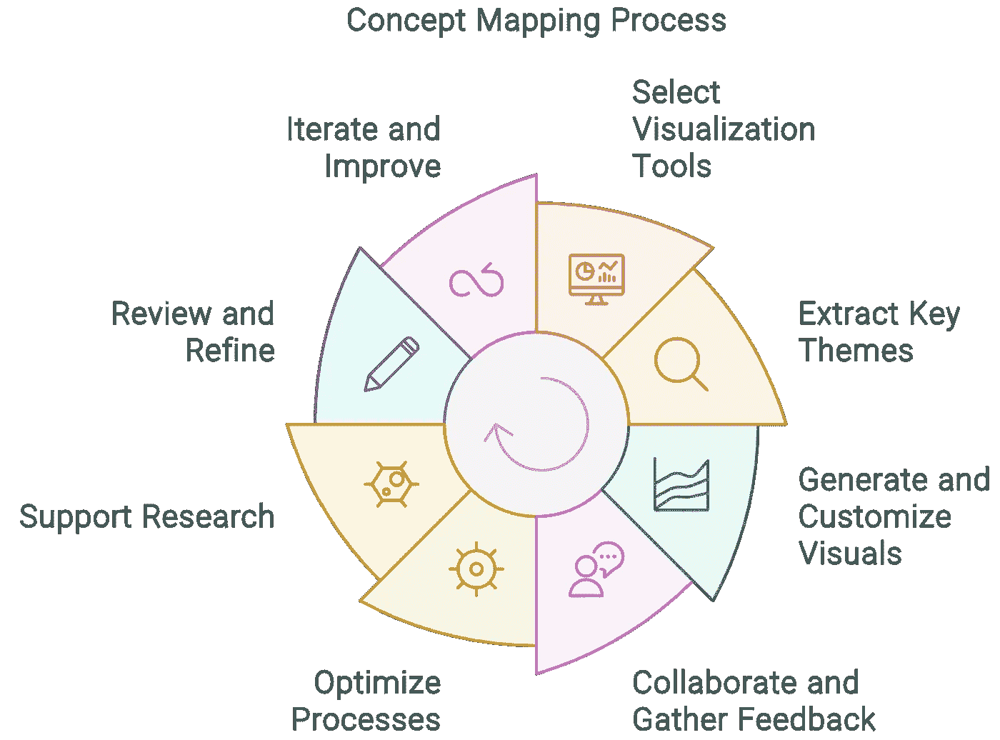

*图片由作者提供，使用 Napkin AI 制作*

# 过程

## 1\. 设置提示词

在进行一些基本设置后，Napkin AI 要求我提供一个提示词。我从当时我正好在探索的内容开始：

> “艾伦·瓦茨的最独特见解”

它生成了一些基本信息，可能和 Chat GPT-4 差不多强大。我预览了一些图表后，决定进一步挑战它：

> “艾伦·瓦茨（Alan Watts）、罗伯特·M·皮尔西格（Robert M. Pirsig）、斯宾诺莎（Spinoza）和马库斯·奥勒留（Marcus Aurelius）的独特洞察，强调它们彼此的重叠，以及它们在哲学、科学和心理学中非常具体的思想基础，整理成实际的框架，并朝着这些框架的逻辑进展。”

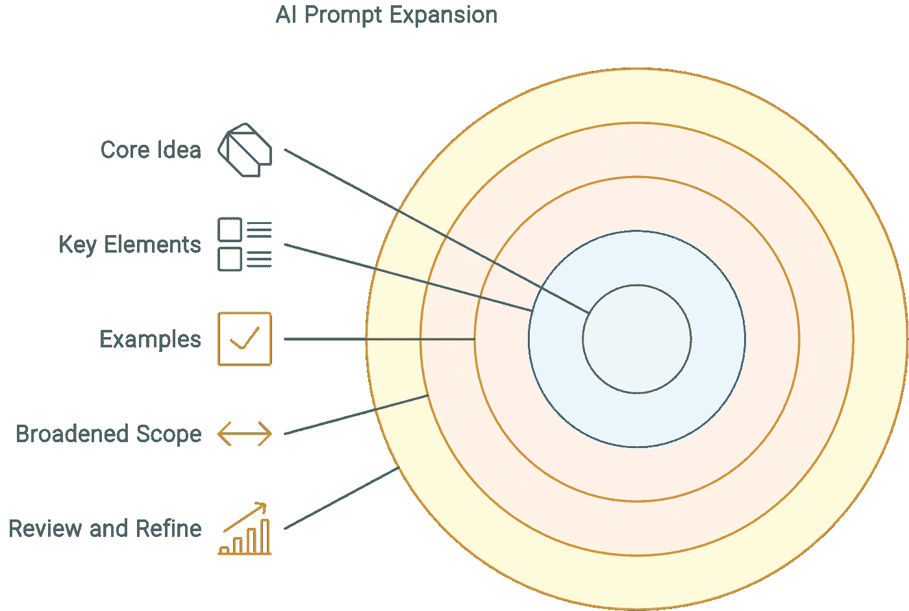

*图片由作者提供，使用 Napkin AI 制作*

结果更多是面向创建框架的过程，从广义上讲这很好，但我希望它能更进一步。启动一个新的 Napkin 并更改一些提示词，以便更多地聚焦于构建我想要的内容，其实非常简单：

> …整理成**一个单一的、按步骤迭代的实际框架**。

## 2\. 创建和定制视觉效果

有许多模板可供选择，还有几种风格。每个选择的内容略有不同，有时会进入不同的细节层次，反映出图表的格式。

我选择了我认为最适合每个部分的图表模板。我倾向于选择几个最适合这个项目的模板，但我还是选择了在一致性和多样性之间找到平衡。以下是一些示例：

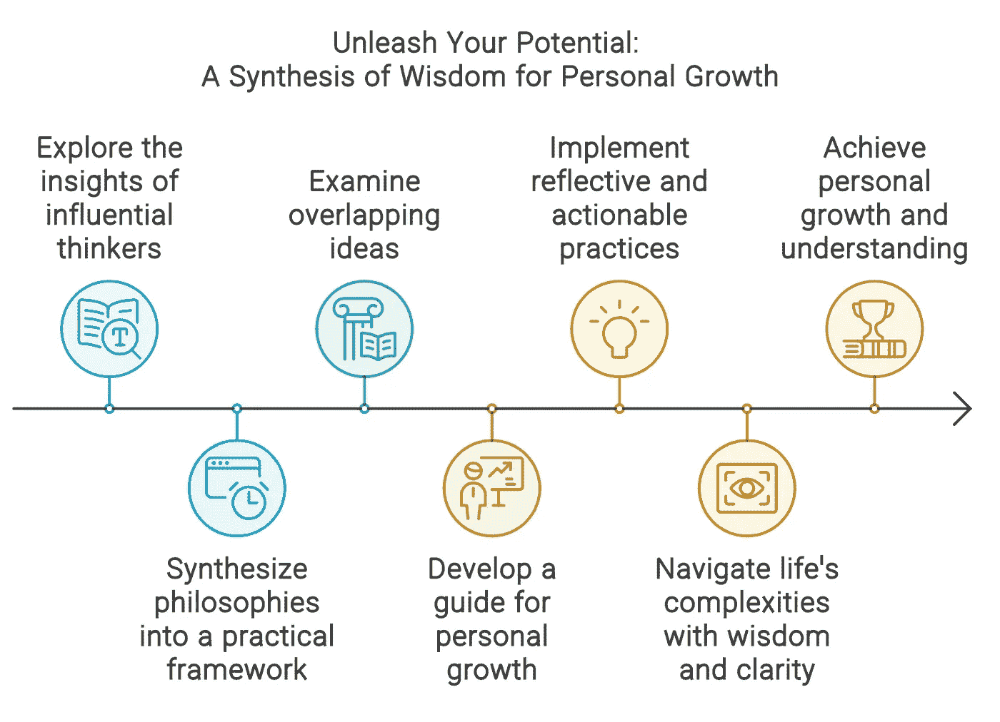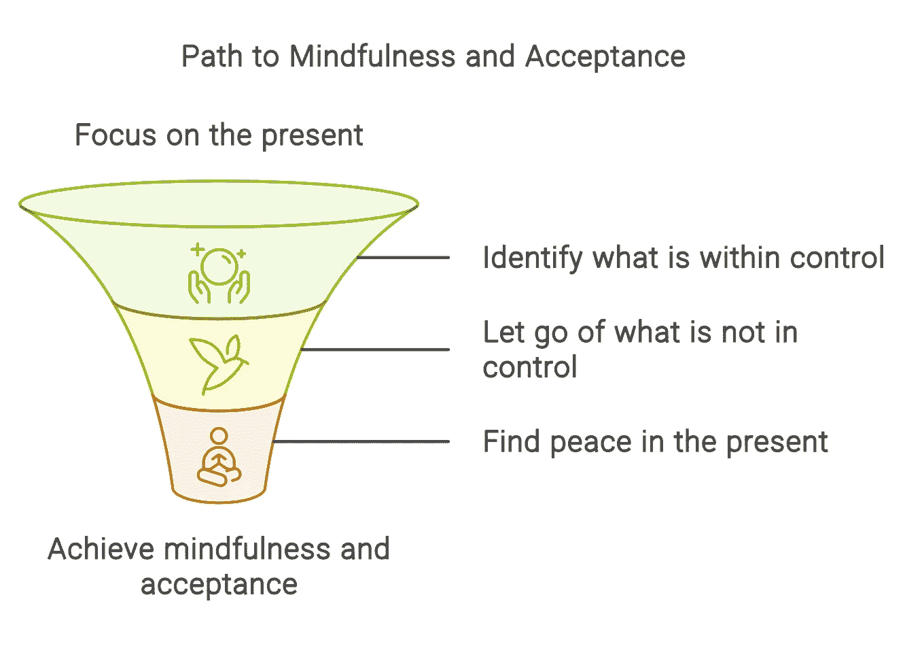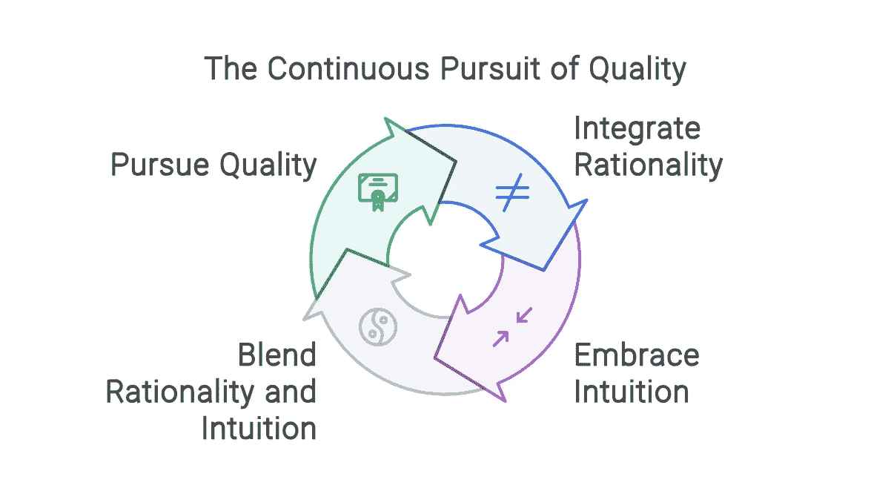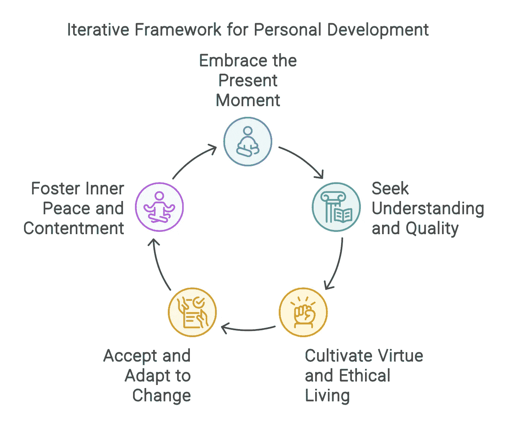

*图片由作者提供，使用 Napkin AI 制作*

## 3\. 发布输出

完成每个文档后，我将它们导出为 PDF 格式。可以在[这里](https://github.com/kunalkpuri/concept-maps-and-diagrams/tree/main/napkin-ai)找到它们。

# 反思与应用

我确实很高兴我决定使用这个工具。我所创建的并不是我最初想要的概念图，但它确实帮助我可视化了复杂的主题。通过其“AI 草图”选项，它甚至帮助我将这些主题整合成实际的框架，尽管你也可以开始一个空白文档并提供自己的文本。如果你想编辑文档或添加自己的图片，那也很容易。

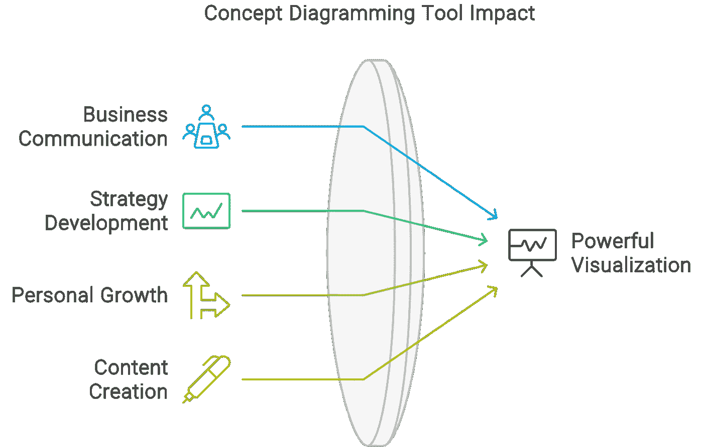

*图片由作者提供，使用 Napkin AI 制作*

我认为这个工具可以在多种呈现场合中使用，包括商业、教育、个人成长和内容创作。它使个人创作者能够将复杂的想法转化为实际的框架，支持创新和成长。最重要的是，它创造了强大的图表，对于商业沟通和战略发展非常有用。

# 下一步

这是一个很好的开始，但我还有更多内容要分享。除了使用其他工具进行图表绘制外，我正在开发一个定制工具，旨在更好地集成和可视化复杂的想法，包括其各个组件之间的详细关系。本系列将涵盖这些过程，敬请关注！

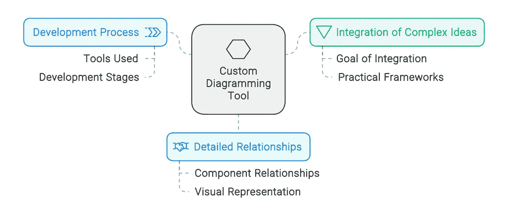

图片来源：作者，由 Napkin AI 制作

# 资源

+   [Napkin AI](https://napkin.ai)

+   [概念图和图表 | GitHub 仓库](https://github.com/kunalkpuri/concept-maps-and-diagrams)

*所有图片由作者在 Napkin AI 中制作*
