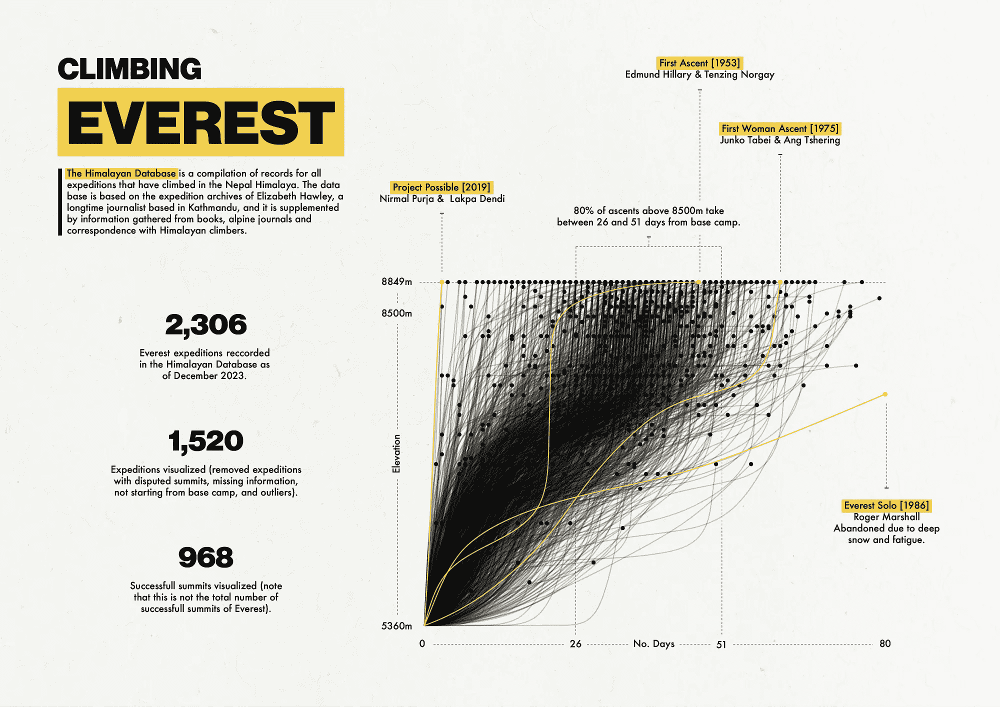

# 可视化珠穆朗玛峰探险

> 原文：[`towardsdatascience.com/visualizing-everest-expeditions-43b1ee922a34?source=collection_archive---------6-----------------------#2024-01-10`](https://towardsdatascience.com/visualizing-everest-expeditions-43b1ee922a34?source=collection_archive---------6-----------------------#2024-01-10)

## 一项端到端的数据可视化项目

 [Karla Hernández](https://medium.com/@karlahrnndz?source=post_page---byline--43b1ee922a34--------------------------------)

·发表于[《Towards Data Science》](https://towardsdatascience.com/?source=post_page---byline--43b1ee922a34--------------------------------) ·18 分钟阅读·2024 年 1 月 10 日

--

[图片由作者提供](https://www.karlahernandez.com/art-w-code/climbing-everest)

我喜欢欣赏其他人的数据可视化作品，尤其是当他们也注重设计时，像是[Giorgia Lupi](https://medium.com/u/2b468a91df0f?source=post_page---user_mention--43b1ee922a34--------------------------------)、[Nadieh Bremer](https://medium.com/u/2c47aca9abda?source=post_page---user_mention--43b1ee922a34--------------------------------)（我尤其喜欢 Nadieh 的[《拼接王国》](https://www.visualcinnamon.com/art/patchwork-kingdoms/)），以及[Shirley Wu](https://medium.com/u/4607b4069d83?source=post_page---user_mention--43b1ee922a34--------------------------------)。Nadieh 和 Shirley 是《Data Sketches》一书的作者，我非常欣赏这本书中的一个特点，那就是 Nadieh 和 Shirley 详细解释了每个可视化背后的过程，从初始构想到最终可视化，突出技术细节和遇到的问题。我很感激他们如何解开这一过程的神秘感，并且本着解谜的精神，我也在此分享上述数据可视化背后的过程。

# 获取数据

在寻找与登山相关的数据集时，我偶然发现了[喜马拉雅数据库](http://himalayandatabase.com)：

> 这是一本包含所有曾在尼泊尔喜马拉雅山脉攀登过的探险记录的汇编。该数据库基于长期驻扎在加德满都的记者伊丽莎白·霍利的探险档案，并补充了来自书籍、高山期刊以及与喜马拉雅登山者的通信信息。

获取数据有两种主要方式：

1.  [下载带有嵌入数据的应用程序](https://www.himalayandatabase.com/downloads.html)（在 Mac 上执行此操作需要安装兼容性…）
