# 可视化 Torch 中的梯度下降参数

> 原文：[`towardsdatascience.com/visualizing-gradient-descent-parameters-in-torch-332a63d1e5c5?source=collection_archive---------0-----------------------#2024-02-26`](https://towardsdatascience.com/visualizing-gradient-descent-parameters-in-torch-332a63d1e5c5?source=collection_archive---------0-----------------------#2024-02-26)

## 探索界面背后，查看 SGD 参数对模型训练的影响

[](https://thepgb.medium.com/?source=post_page---byline--332a63d1e5c5--------------------------------)[](https://towardsdatascience.com/?source=post_page---byline--332a63d1e5c5--------------------------------) [P.G. Baumstarck](https://thepgb.medium.com/?source=post_page---byline--332a63d1e5c5--------------------------------)

·发表于 [Towards Data Science](https://towardsdatascience.com/?source=post_page---byline--332a63d1e5c5--------------------------------) ·阅读时长 7 分钟·2024 年 2 月 26 日

--

现代机器学习框架的简单界面背后隐藏着大量的复杂性。由于有许多参数和控件暴露给我们，如果我们不了解其背后的原理，就很容易陷入盲目编程的误区。考虑一下 Torch 的 [随机梯度下降（SGD）优化器](https://pytorch.org/docs/stable/generated/torch.optim.SGD.html)的众多参数：

```py
def torch.optim.SGD(
  params, lr=0.001, momentum=0, dampening=0,
  weight_decay=0, nesterov=False, *, maximize=False,
  foreach=None, differentiable=False):
  # Implements stochastic gradient descent (optionally with momentum).
  # ...
```

除了熟悉的学习率 `lr` 和 `momentum` 参数，还有一些其他参数对神经网络训练有着显著的影响。在本文中，我们将可视化这些参数对一个简单机器学习目标的影响，并使用各种损失函数。

# 玩具问题

首先，我们构造了一个简单的玩具问题，即在一组点上执行线性回归。为了增加趣味性，我们使用了一个二次函数加噪声，这样神经网络就必须做出权衡——同时我们也能观察到更多损失函数的影响：

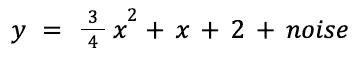

我们首先仅使用 `numpy` 和 `matplotlib` 来可视化数据——此时还不需要 `torch`：

```py
import numpy as np
import matplotlib.pyplot as plt

np.random.seed(20240215)
n = 50
x = np.array(np.random.randn(n), dtype=np.float32)
y = np.array(
  0.75 * x**2 + 1.0 * x + 2.0 + 0.3 * np.random.randn(n),
  dtype=np.float32)

plt.scatter(x, y, facecolors='none', edgecolors='b')
plt.scatter(x, y, c='r')
plt.show()
```

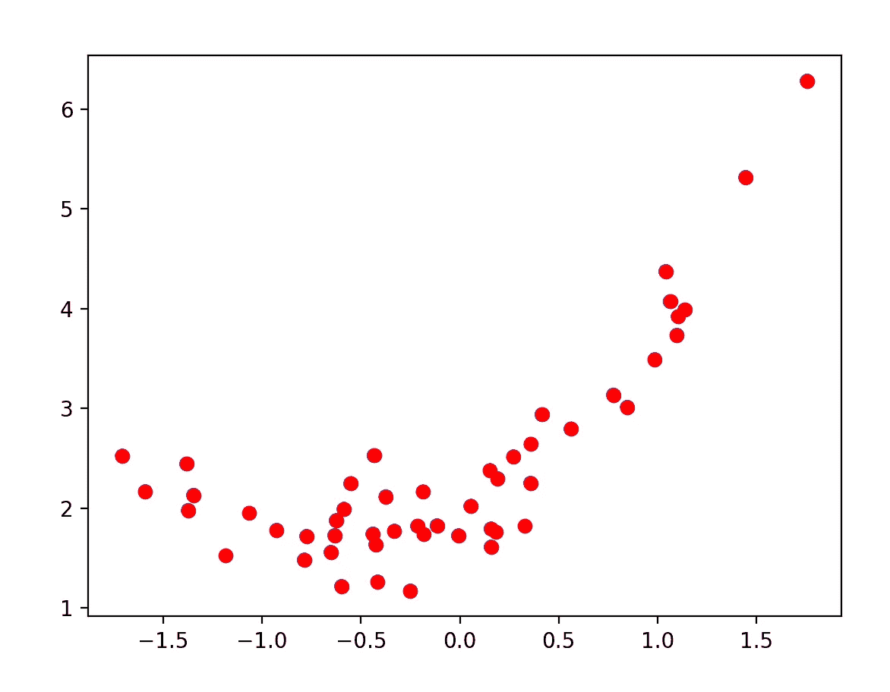

图 1\. 玩具问题集的点。

接下来，我们将引入 `torch` 并介绍一个简单的训练循环，训练一个单神经元网络。为了在我们变化损失函数时得到一致的结果，我们每次都从相同的参数集开始训练，并将神经元的第一个“猜测”设定为方程 `y = 6*x — 3`（我们通过神经元的 `weight` 和 `bias` 参数实现这个目标）：

```py
import torch

model = torch.nn.Linear(1, 1)
model.weight.data.fill_(6.0)
model.bias.data.fill_(-3.0)

loss_fn = torch.nn.MSELoss()
learning_rate = 0.1
epochs = 100
optimizer = torch.optim.SGD(model.parameters(), lr=learning_rate)

for epoch in range(epochs):
  inputs = torch.from_numpy(x).requires_grad_().reshape(-1, 1)
  labels = torch.from_numpy(y).reshape(-1, 1)

  optimizer.zero_grad()
  outputs = model(inputs)
  loss = loss_fn(outputs, labels)
  loss.backward()
  optimizer.step()
  print('epoch {}, loss {}'.format(epoch, loss.item()))
```

运行这个过程会输出文本，显示损失值正在减少，最终达到预期的最小值：

```py
epoch 0, loss 53.078269958496094
epoch 1, loss 34.7295036315918
epoch 2, loss 22.891206741333008
epoch 3, loss 15.226042747497559
epoch 4, loss 10.242652893066406
epoch 5, loss 6.987757682800293
epoch 6, loss 4.85075569152832
epoch 7, loss 3.4395809173583984
epoch 8, loss 2.501774787902832
epoch 9, loss 1.8742430210113525
...
epoch 97, loss 0.4994412660598755
epoch 98, loss 0.4994412362575531
epoch 99, loss 0.4994412660598755
```

为了可视化我们的拟合，我们从神经元中取出学习到的偏差和权重，并将拟合结果与数据点进行比较：

```py
weight = model.weight.item()
bias = model.bias.item()
plt.scatter(x, y, facecolors='none', edgecolors='b')
plt.plot(
  [x.min(), x.max()],
  [weight * x.min() + bias, weight * x.max() + bias],
  c='r')
plt.show()
```

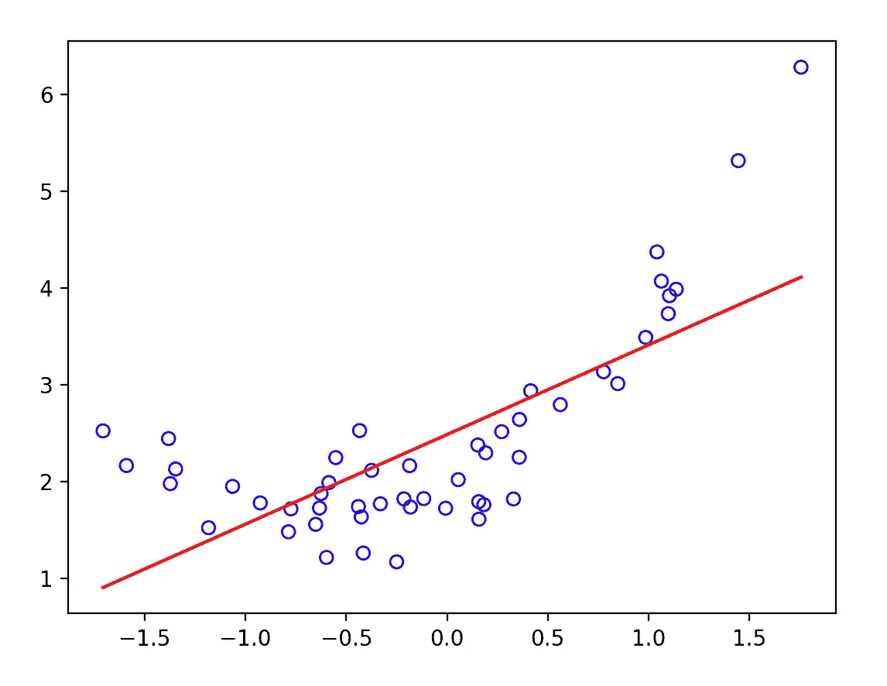

图 2\. 在玩具问题上 L2 学习到的线性边界。

# 可视化损失函数

上述结果看起来是合理的，但到目前为止，一切都是通过高层次的 Torch 函数处理的，如`optimizer.zero_grad()`、`loss.backward()`和`optimizer.step()`。为了理解接下来的步骤，我们需要可视化模型在损失函数中的变化过程。为了可视化损失，我们将在 101×101 的网格中对其进行采样，然后使用`imshow`进行绘制：

```py
def get_loss_map(loss_fn, x, y):
  """Maps the loss function on a 100-by-100 grid between (-5, -5) and (8, 8)."""
  losses = [[0.0] * 101 for _ in range(101)]
  x = torch.from_numpy(x)
  y = torch.from_numpy(y)
  for wi in range(101):
    for wb in range(101):
      w = -5.0 + 13.0 * wi / 100.0
      b = -5.0 + 13.0 * wb / 100.0
      ywb = x * w + b
      losses[wi][wb] = loss_fn(ywb, y).item()

  return list(reversed(losses))  # Because y will be reversed.

import pylab

loss_fn = torch.nn.MSELoss()
losses = get_loss_map(loss_fn, x, y)
cm = pylab.get_cmap('terrain')

fig, ax = plt.subplots()
plt.xlabel('Bias')
plt.ylabel('Weight')
i = ax.imshow(losses, cmap=cm, interpolation='nearest', extent=[-5, 8, -5, 8])
fig.colorbar(i)
plt.show()
```

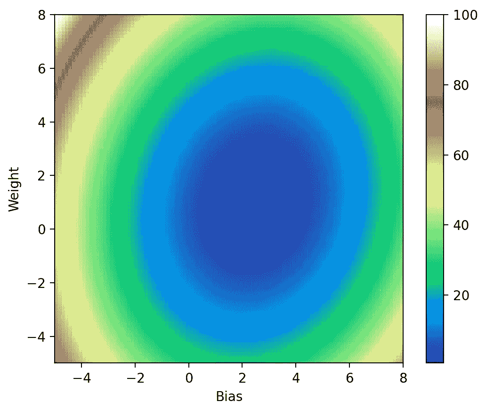

图 3\. 在玩具问题上的 L2 损失函数。

现在我们可以在运行梯度下降时捕捉模型参数，以展示优化器的表现：

```py
model = torch.nn.Linear(1, 1)
...
models = [[model.weight.item(), model.bias.item()]]
for epoch in range(epochs):
  ...
  print('epoch {}, loss {}'.format(epoch, loss.item()))
  models.append([model.weight.item(), model.bias.item()])

# Plot model parameters against the loss map.
cm = pylab.get_cmap('terrain')
fig, ax = plt.subplots()
plt.xlabel('Bias')
plt.ylabel('Weight')
i = ax.imshow(losses, cmap=cm, interpolation='nearest', extent=[-5, 8, -5, 8])

model_weights, model_biases = zip(*models)
ax.scatter(model_biases, model_weights, c='r', marker='+')
ax.plot(model_biases, model_weights, c='r')

fig.colorbar(i)
plt.show()
```

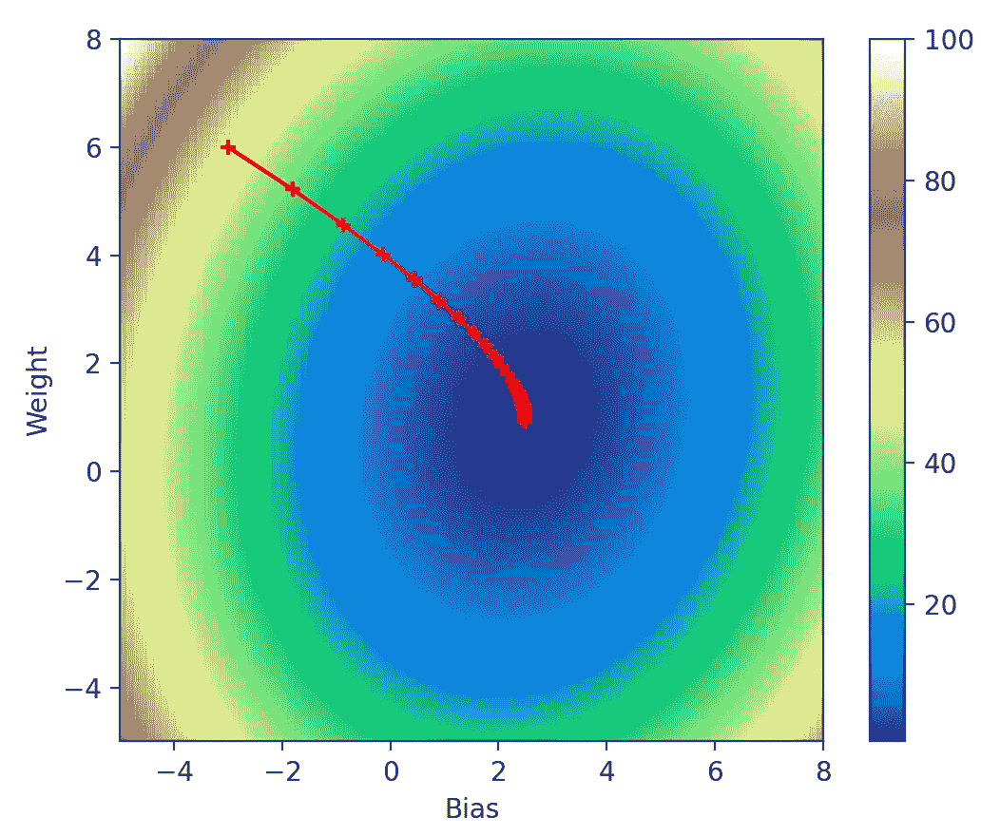

图 4\. 可视化梯度下降在损失函数下的变化。

从检查中可以看出，这正是应该发生的：模型从我们强制初始化的参数`(-3, 6)`开始，逐步朝梯度方向采取更小的步骤，最终在全局最小值处停住。

# 可视化其他参数

## 损失函数

现在我们将开始检查其他参数对梯度下降的影响。首先是损失函数，我们使用的是标准的 L2 损失：

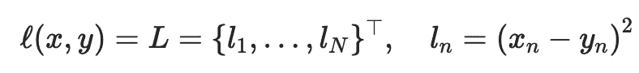

L2 损失（`torch.nn.MSELoss`）累积平方误差。来源：[link](https://pytorch.org/docs/stable/generated/torch.nn.MSELoss.html)。作者截图。

但是，我们还可以使用其他几种损失函数：

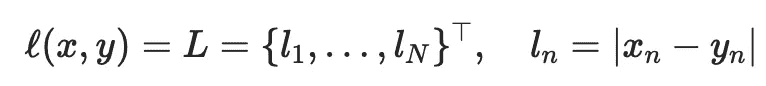

L1 损失（`torch.nn.L1Loss`）`累积绝对`误差。`来源：[link](https://pytorch.org/docs/stable/generated/torch.nn.L1Loss.html)。作者截图。`

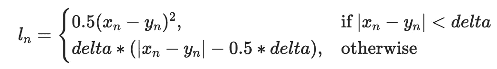

Huber 损失（`torch.nn.HuberLoss`）对小误差使用 L2，对大误差使用 L1。`来源：[link](https://pytorch.org/docs/stable/generated/torch.nn.HuberLoss.html)。作者截图。`

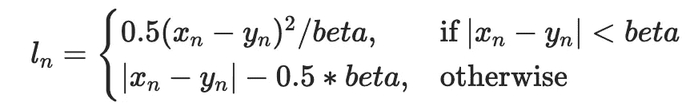

平滑 L1 损失（`torch.nn.SmoothL1Loss`）大致相当于 Huber 损失，但有一个额外的 beta 参数。`来源：[link](https://pytorch.org/docs/stable/generated/torch.nn.SmoothL1Loss.html)。作者截图。`

我们将到目前为止所做的工作包装在一个循环中，尝试所有损失函数并一起绘制它们：

```py
def multi_plot(lr=0.1, epochs=100, momentum=0, weight_decay=0, dampening=0, nesterov=False):
  fig, ((ax1, ax2), (ax3, ax4)) = plt.subplots(2, 2)
  for loss_fn, title, ax in [
    (torch.nn.MSELoss(), 'MSELoss', ax1),
    (torch.nn.L1Loss(), 'L1Loss', ax2),
    (torch.nn.HuberLoss(), 'HuberLoss', ax3),
    (torch.nn.SmoothL1Loss(), 'SmoothL1Loss', ax4),
  ]:
    losses = get_loss_map(loss_fn, x, y)
    model, models = learn(
      loss_fn, x, y, lr=lr, epochs=epochs, momentum=momentum,
      weight_decay=weight_decay, dampening=dampening, nesterov=nesterov)

    cm = pylab.get_cmap('terrain')
    i = ax.imshow(losses, cmap=cm, interpolation='nearest', extent=[-5, 8, -5, 8])
    ax.title.set_text(title)
    loss_w, loss_b = zip(*models)
    ax.scatter(loss_b, loss_w, c='r', marker='+')
    ax.plot(loss_b, loss_w, c='r')

  plt.show()

multi_plot(lr=0.1, epochs=100)
```

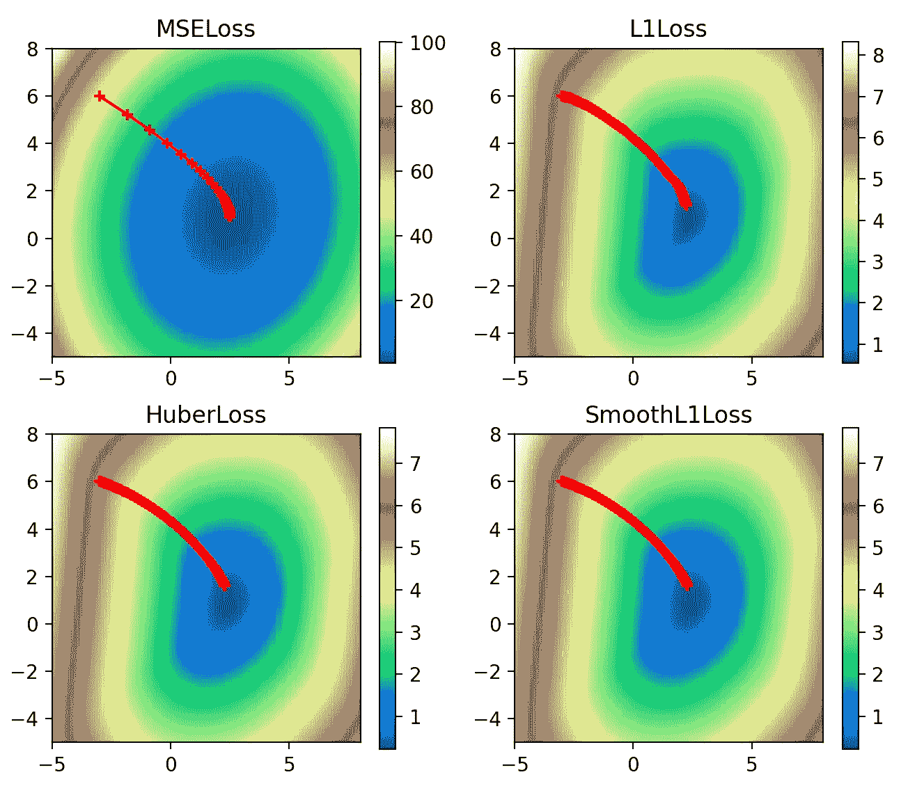

图 5\. 可视化梯度下降在所有损失函数下的变化。

在这里，我们可以看到非 L2 损失函数的有趣轮廓。L2 损失函数平滑且值较大，最大可达 100，而其他损失函数的值较小，因为它们仅反映了绝对误差。但 L2 损失的陡峭梯度意味着优化器更快接近全局最小值，正如其初期点之间较大的间距所示。与此同时，L1 损失函数则表现出更为缓慢的接近最小值的过程。

## 动量

接下来最有趣的参数是动量，它决定了多少上一步的梯度将被加入到当前梯度更新中。通常非常小的动量值就足够了，但为了可视化的目的，我们将其设置为 0.9 的极端值——孩子们，请勿在家尝试：

```py
multi_plot(lr=0.1, epochs=100, momentum=0.9)
```

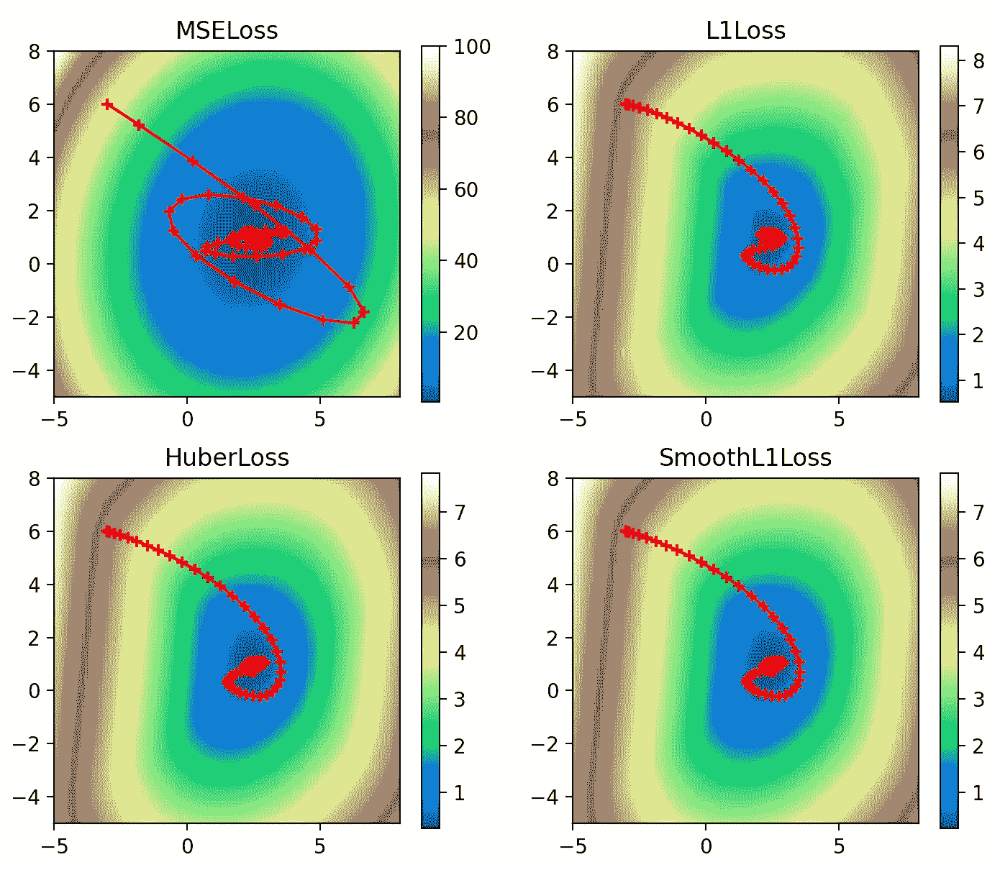

图 6\. 可视化的梯度下降过程，展示了所有损失函数在高动量下的表现。

由于极高的动量值，我们可以清楚地看到它对优化器的影响：它超过了全局最小值，必须不规则地转回。这种效应在 L2 损失中最为明显，其陡峭的梯度使得它越过了最小值，并且非常接近发散。

## Nesterov 动量

Nesterov 动量是对普通动量的一个有趣调整。普通动量将上一步的部分梯度加到当前步骤的梯度上，得到下面图 7(a)的情景。但如果我们已经知道上一步的梯度将带我们到哪里，那么 Nesterov 动量则通过预判我们将落在哪里来计算当前梯度，得到下面图 7(b)的情景：

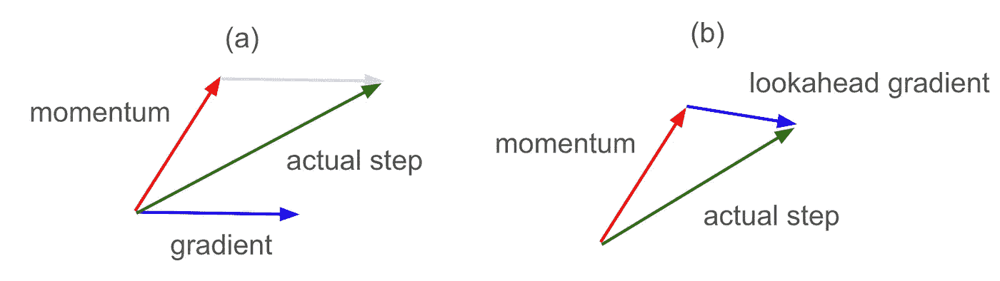

图 7\. (a) 普通动量与 (b) Nesterov 动量。

```py
multi_plot(lr=0.1, epochs=100, momentum=0.9, nesterov=True)
```

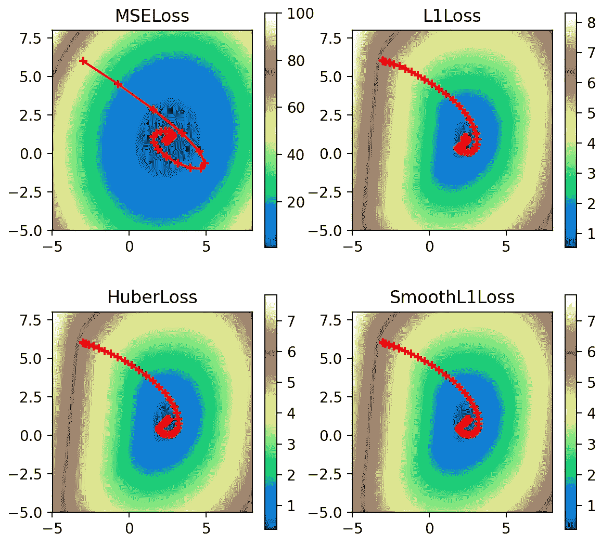

图 8\. 可视化的梯度下降过程，展示了所有损失函数在高 Nesterov 动量下的表现。

从图形上看，我们可以看到 Nesterov 动量减少了我们在普通动量下观察到的过冲现象。特别是在 L2 的情况下，由于我们的动量使得我们越过了全局最小值，使用 Nesterov 动量提前查看我们将要落点的位置，允许我们从目标函数的另一侧混合反向梯度，从而更早地进行修正。

## 权重衰减

接下来，权重衰减对参数值（我们线性网络的权重和偏置）施加了正则化的 L2 惩罚：

```py
multi_plot(lr=0.1, epochs=100, momentum=0.9, nesterov=True, weight_decay=2.0)
```

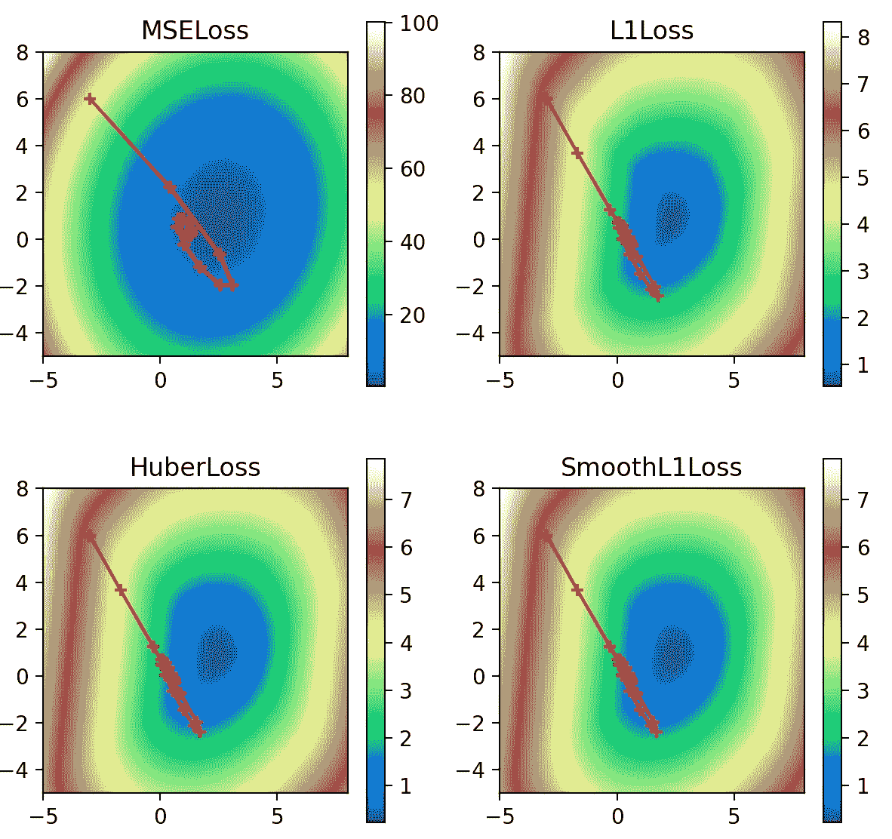

图 9\. 可视化的梯度下降过程，展示了所有损失函数在高 Nesterov 动量和权重衰减下的表现。

在所有情况下，正则化因子都将解拉离了它们应有的全局最小值，并将其拉近了原点（0，0）。然而，这种效应在 L2 损失下最不明显，因为损失值足够大，能够抵消对权重的 L2 惩罚。

## 阻尼

最后是阻尼，它通过阻尼因子来减少动量的影响。使用 0.8 的阻尼因子，我们可以看到它如何有效地调节动量路径通过损失函数。

```py
multi_plot(lr=0.1, epochs=100, momentum=0.9, dampening=0.8)
```

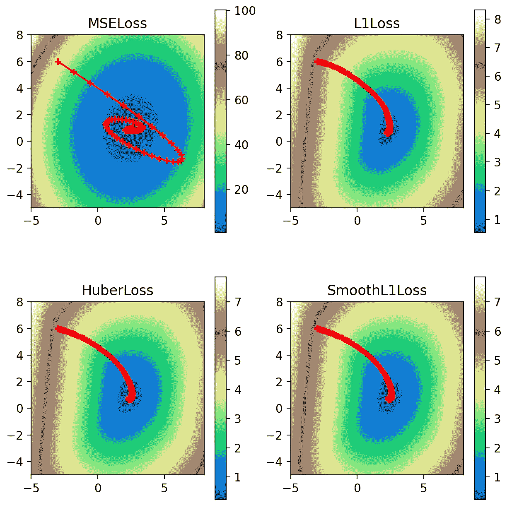

图 10\. 可视化的梯度下降，展示了在高动量和高阻尼下的所有损失函数。

除非另有说明，所有图片均由作者提供。

# 参考文献

+   [`pytorch.org/docs/stable/generated/torch.nn.MSELoss.html`](https://pytorch.org/docs/stable/generated/torch.nn.MSELoss.html)

+   [`pytorch.org/docs/stable/generated/torch.nn.L1Loss.html`](https://pytorch.org/docs/stable/generated/torch.nn.L1Loss.html)

+   [`pytorch.org/docs/stable/generated/torch.nn.HuberLoss.html`](https://pytorch.org/docs/stable/generated/torch.nn.HuberLoss.html)

+   [`pytorch.org/docs/stable/generated/torch.nn.SmoothL1Loss.html`](https://pytorch.org/docs/stable/generated/torch.nn.SmoothL1Loss.html)

+   [`pytorch.org/docs/stable/generated/torch.optim.SGD.html`](https://pytorch.org/docs/stable/generated/torch.optim.SGD.html)

## 另见

+   `towardsdatascience.com/extending-context-length-in-large-language-models-74e59201b51f`

+   代码可在以下地址找到：[`github.com/pbaumstarck/scaling-invention/blob/main/code/torch_loss.py`](https://github.com/pbaumstarck/scaling-invention/blob/main/code/torch_loss.py)

+   [`github.com/tomgoldstein/loss-landscape`](https://github.com/tomgoldstein/loss-landscape)

+   [`neptune.ai/blog/pytorch-loss-functions`](https://neptune.ai/blog/pytorch-loss-functions)
