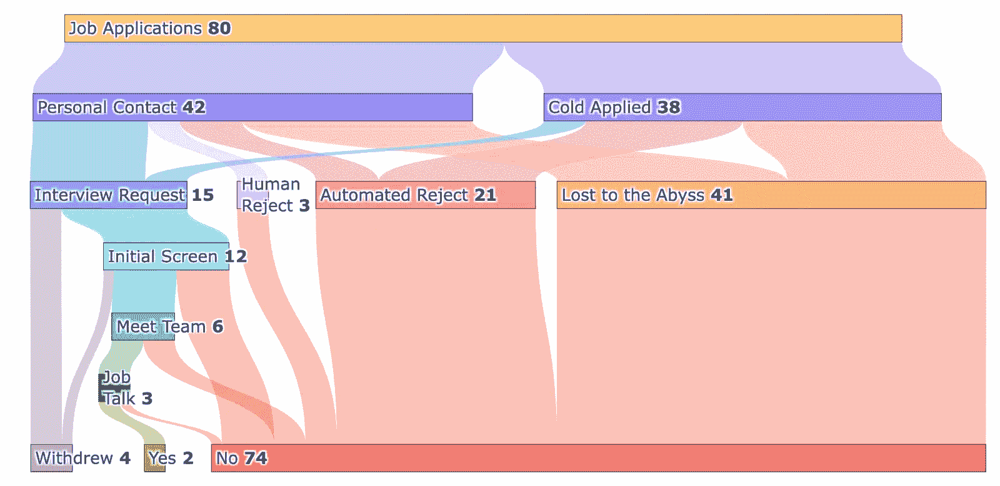
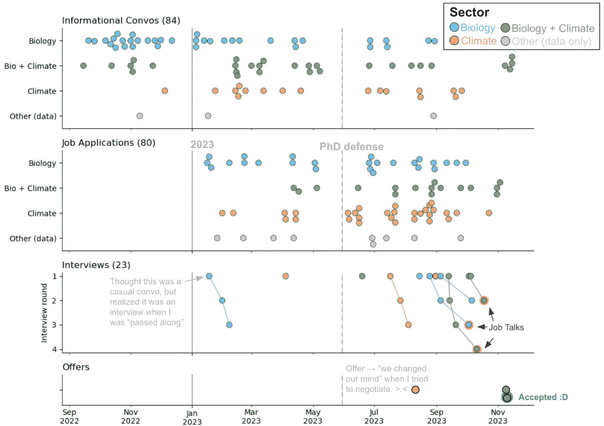
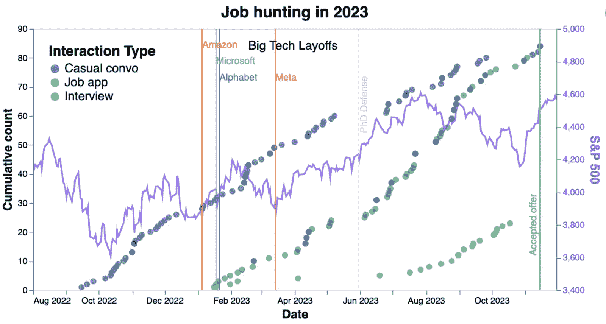
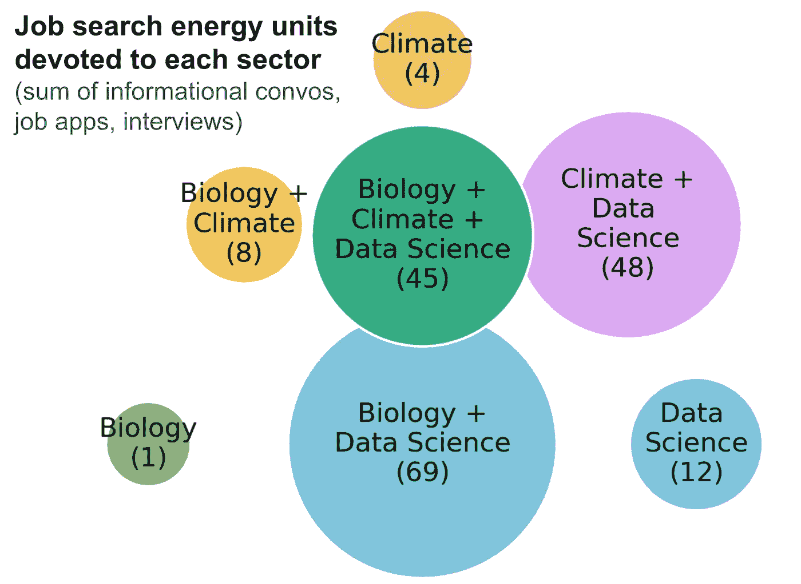

# 可视化我的数据科学求职过程

> 原文：[`towardsdatascience.com/visualizing-my-data-science-job-search-efa55c0f1499?source=collection_archive---------4-----------------------#2024-04-19`](https://towardsdatascience.com/visualizing-my-data-science-job-search-efa55c0f1499?source=collection_archive---------4-----------------------#2024-04-19)

## 来自一次谦逊求职旅程的反思，试图在 2023 年找到一份工作

 [Erin Wilson](https://erinhwilson.medium.com/?source=post_page---byline--efa55c0f1499--------------------------------)

·发表于 [Towards Data Science](https://towardsdatascience.com/?source=post_page---byline--efa55c0f1499--------------------------------) ·12 分钟阅读·2024 年 4 月 19 日

--

2023 年对许多求职者来说是一个动荡的一年。至少对我来说，感觉像是一次漫长的旅程。在 1 月到 11 月的这 11 个月里，我进行了 107 次与职业相关的对话，并申请了 80 个职位，最终收到了 2 个工作邀请（我在 5 月“休息”了一下，去答辩了我的博士学位 😅）。一些申请确实有些冒险，但许多职位我觉得自己非常合适——或者至少值得尝试一次对话！

我的努力常常被无声回应，这让我感到吃惊。我觉得我的大部分求职信都非常真诚，简历也有独特的经历，这让我开始怀疑自己的沟通能力。我的简历是不是不够清晰？求职信是不是太啰嗦了？我是不是在误导雇主关于我的技能？我真的不适合这些职位吗？？这确实是一个令人沮丧的时刻——就像是有一种冒名顶替综合症的幽灵在我心头游荡。

从学习的角度来看，拒绝信常常没有任何反馈，真是令人沮丧。我该如何改进，才能在下一次申请我认为自己绝对是强有力候选人的职位时，做得更好？许多好心人给出了有用的建议，我确实认为我的材料随着时间的推移有所改进，但很难说究竟是什么让我最终取得了不同的结果。也许是我经过几个月较弱的尝试后，终于开始提交更强、更具竞争力的申请？也许 2023 年特别艰难？也许我碰上了许多无法控制的因素，比如遇到了一些虚假的招聘广告，实际上只是为了“吸引”人们对公司产生兴趣，或者是那些注定要内部招聘的职位？

本着分享一些可能对其他求职者有用的经验（好吧，也许是通过可视化我经常激活泪腺的经历来尝试进行某种情感宣泄），这里是一些来自我 2023 年求职过程的数据支持反思。我最热衷寻找的是生物学、数据科学与气候解决方案交汇处的职位，地点要么是西雅图，要么是远程。

# 求职申请的路径

对于我的 80 个工作申请，它们从提交到最终的“是”或“否”经历了怎样的过程？图 1 是一个桑基图，旨在展示各个节点之间的流量。

在图 1 的第二行，我们可以看到，在那 80 个申请中，大约一半是我向某公司门户网站上传我的信息，但我并不认识那里的任何人，这种申请我称之为“冷申请”。对于另一半，我有一个“个人联系”——有时这是一个了解我并能推荐我的人，但更多时候是我曾经见过一次的人（喝咖啡、Zoom 聊天或在社交活动中见过）。他们不一定非常了解我的具体技能，但他们知道我是真实的人，希望他们觉得我友好/体贴，并且能将信息传递给另一个真实的人，至少能让对方在一堆申请中看到我的简历。

图 1\. 桑基图展示了各个阶段申请/面试过程中的申请量流动。图片由作者提供。

第三行展示了多少申请导致了面试请求或某种形式的拒绝/无回应。有些人坚持认为你*永远*不要申请那些你不认识公司内部人的职位——这只是浪费时间。

我的数据支持，拥有个人联系能提高我的面试请求率：42 个个人联系申请中有 11 个导致了面谈请求，面试率约为 25%，而 38 个冷申请中仅有 4 个导致了面试请求，面试率约为 10%。所以大约四分之一（4/15）的面试请求来自冷申请。我不会说*永远*不要申请没有个人联系的职位——对于合适的职位，这种申请可能会有成效——但绝对要投入精力建立个人联系。至少对我来说，这种申请路径在接触到有决策权的真实人类方面更为成功。

一些公司足够勤奋，当他们将你的申请移到“否”这一堆时，会发送自动拒绝通知（*n=21*）。非常少数情况下，有人从仅仅是申请阶段就告诉我“拒绝”（*n=3*）。超过一半的申请“失落在深渊”中（*n=41*），我既没有收到人类也没有收到机器的回复，只能假设一些深居不见的 AI 正在啃食我的求职信。

在有人请求面试的情况下，我通常会进入初步筛选环节，要么由人力资源部门，要么由招聘经理。如果这一步顺利，我会见到更多来自更大团队的成员，3 次面试中我被邀请做关于我的研究的工作报告。我的面试中没有包括正式的编码挑战——我申请的大多数职位更加侧重于科学/研究而非软件/基础设施——但我经常被要求提供我的个人 github 账号链接。

在底部一行，我们看到了最终的统计数据。在我获得 2 家公司的“是”之前，我得到了 74 个“否”的回答（它们几乎是同一天回复的，这在经历了 11 个月的求职后，简直是幸运到极点！）。在接受当前工作后，我撤回了其他正在进行的申请。

# 申请前的准备工作

一个重要提示：申请工作并不是我求职的第一步。在确定了 2023 年春季的博士答辩日期后，我从 2022 年底开始安排“信息性面谈”。许多早期的对话是与我感到舒适的同事、导师和同行进行的，他们信任我并愿意提供职业建议。这不仅帮助我 1）减少了我在这个让我焦虑的过程中开始时的压力，2）也让我能够向大家表明我已经正式“开始求职”，这样如果他们知道任何有趣的职位，就能通知我。开始这项工作时，绝对要依靠你的支持网络！

接下来，我开始与新认识的人安排会议——要么通过共同联系人的热情介绍，要么就是通过 LinkedIn 上突如其来的消息（一些冷 LinkedIn 消息没有得到回应，但也有一些得到了回复！大约有一半？）。这些请求通常表述为“我是即将毕业的博士生，正在探索[计算生物学/数据科学/气候]行业的职业发展路线——请问您能谈一谈您在[您目前的职位]的工作经验、您职业生涯的路径以及您对刚刚开始这一旅程的人的建议吗？”我还会简要个性化每条消息，以便让对方清楚我有兴趣与这个人特别交流，而不是在公司里乱发消息。

图 2. 从 2022 年末到 2023 年末的每次信息性对话、职位申请、面试和录用的总体时间线，按照与我所接触的公司/我申请的职位最相关的行业颜色进行标注。大多数职位申请是面向计算领域的职位，重点在生物学（蓝色）、气候（橙色）或生物学与气候的结合（绿色），少数是纯粹与数据科学相关的职位（粉色）。与同一公司的逐步面试通过线条连接。图像由作者提供。

图 2 的顶部面板显示，我保持了相对稳定的联系频率。尽管大多数对话并非关于开放职位，但这些对话并不觉得浪费时间。一些信息性访谈的关键好处：

1.  **由于我并不是立即在找工作（但很快就会），以“只是喝杯咖啡聊聊天”或“只是了解你的经历”这种轻松的方式框架，去除了很多压力。** 我更容易做回自己，练习解释我的兴趣和经历，而不需要不断担心我是否没有用最完美的方式说话来获得工作。也很棒能练习积极倾听并提问，向聪明人深入探讨技术/科学细节。

1.  **了解行业动态非常有帮助** —— 人们可以更坦率地告诉我，如果他们的公司在短期内不太可能招聘，或者如果他们的公司近期可能会有职位空缺。这帮助我更直接地将注意力集中到某些公司的招聘页面，同时对其他公司保持更随意的关注。而且，现在他们已经认识我了，这些新的联系人可能会在未来告诉我他们公司招聘状态的变化。

1.  **仅仅是和人见面，友好地和陌生人聊聊/喝杯咖啡就挺酷的。** 当然，有些对话稍显尴尬，有时我能感觉到对方有些想离开，但大多数人都非常鼓励和支持，愿意详细讲述他们自己的经历。遇到从事有趣工作的人的确让我保持了动力，而且他们通常会推荐我认识的其他人，认为他们可能会给我带来有用的视角，于是对话的列车继续前进。

1.  **和某人交谈后，如果我后来在他们公司看到相关的职位发布，我总是会告诉他们我已经申请了！** 他们可能还不够了解我，在一次对话后无法充分证明我的技能，但希望他们至少对我有个积极的印象。如果他们愿意，他们可能会将我的申请转交给一个真正的人，后者可能会阅读我的求职信，而不是让它被卡在 AI 筛选器中 🙃

图 2 中的第二个面板显示了求职申请的事件：我在 2023 年初提交了一些申请，在 5 月答辩日期附近暂停 😮‍💨，然后在夏末加大了申请力度。第三个面板显示了（终于！）一小部分面试邀请开始陆续到来！

在一次相当奇怪的经历中，我收到了一个公司的聘用通知，尝试礼貌地进行谈判，然后迅速收到了“实际上，我们改变了主意，不再提供录用通知”的邮件。这让我非常震惊。这是我第一次尝试谈判，作为一个寻找计算机科学职位的女性，我一直被*灌输*进脑海，即使这种做法感觉不自然/尴尬/不舒服，你也必须尝试！我当时假设最糟糕的结果是他们会说“没有，这是我们最大限度的报价，接受或拒绝。”我很确定我的要求并不无礼或不合理，但被撤回的聘用通知确实让我感到相当沮丧😖。我担心自己在为自己争取公平薪酬时犯了大错。几位导师向我保证，这是一个非常不寻常的结果，与你无关，而是公司内部发生了某些怪事。我希望这种情况不会经常发生在其他人身上，但它并非不可能（*n=1*）。

底部面板显示，在 11 月，我终于收到了两个正式的工作录用通知，从而结束了这场伟大的猎寻。

为了将这份求职时间线放在更广泛的经济环境中考虑，我将每种互动类型—休闲信息性对话（深蓝色）、职位申请（绿松石色）和正式面试（绿色）—进行了分组，并绘制了随时间变化的累计计数，同时叠加了标准普尔 500 指数（紫色）的趋势（图 3）。

图 3. 各种求职互动类型随时间变化的累计总和（左侧 y 轴），与标准普尔 500 指数的每日最高点（右侧 y 轴）以及几次大型科技公司裁员（超过 1 万人）叠加。图片来源：作者。

除了我在 5 月博士答辩期间的空档期外，我的休闲信息性对话率在这一年中相当稳定，而我的职位申请率在夏末有所增加，最终赶上了我的信息性对话总数。我并不擅长阅读股市趋势和波动，但如果我眯着眼看，它似乎是标准普尔 500 指数在 2022 年底的一些低点后开始上升，并大致与我职位申请的陡峭上升曲线重合（也许是因为更多职位开始发布？）以及随之而来的面试增加👀。值得注意的是，这一切发生在 2023 年初，大型科技公司进行了一系列裁员（超过 1 万人），恰好接近标准普尔 500 指数的局部最低点。

# 专注于求职能量

在研究生阶段，我知道我的“科学幸福之地”是做一个这样的项目：  

1.  思考生物学（因为基因学简直是最酷的！）

1.  做计算机科学（因为我喜欢编程工作的解谜性质）

1.  具有可持续性应用（因为气候变化亟需解决，形势极为紧迫）

激动人心的是，我进入了一个研究生院的实验室，在那里我使用计算方法分析甲烷吃菌的基因数据。我希望我的职业生涯同样能涵盖这三大科学幸福支柱的交集，即我的知识、技能和热情。

我曾经关注几家以气候为导向的合成生物学公司，但在 2023 年初，我得知几乎所有有计算团队的公司都在招聘冻结状态 🥶 也许在脆弱的经济环境下，期望同时实现这三大科学幸福支柱过于奢求，我可能不得不接受只具备其中 1 或 2 个特点的职位，尤其是如果我坚持要住在西雅图的话？

我的求职精力在一年中不断调整焦点，图 2 中彩色圆圈的密度反映了这一点。对话、申请和面试按公司重点分类（作为计算机科学学生，我申请的大多数职位至少涉及一些计算元素，较大的公司通常处理与生物学、气候或两者结合相关的问题）。尽管致力于气候解决方案是我内心的方向，但最初我说服自己，在积累经验和技能的过程中，即使从事与气候无关的工作也没关系。因此，在 2023 年初，我们看到我更多关注于“生物学 + 数据科学”（蓝色圆圈，通常是健康/制药领域的应用）的对话和申请，因为“生物学 + 气候 + 数据科学”职位相对稀缺。

经过几次存在主义危机后，我的思路发生了转变：我决定宁愿从事气候相关的工作，即使这意味着我的工作不会利用我多年在遗传学/微生物学方面的学习。2023 年晚些时候，我的求职努力反映了这一心态的转变，集中在“气候 + 数据科学”（橙色圆圈，气候工作无生物学元素）。虽然我最初对从事偏离生物学的职位感到紧张，但我很享受有机会学习相关领域的知识，并考虑如何将我的技能适应那些非生物学气候解决方案公司正在解决的问题。

图 4 大致总结了我在生物学、气候和数据科学交集领域投入的总能量，其中每次信息交流、职位申请和正式面试都计为一个能量单位。值得注意的是，我无法选择何时进行正式面试——那取决于其他人是否愿意与我交流——但我决定将这三种能量单位合并为~集中的焦虑/压力时刻~。这个总和没有包括其他类型的努力，比如阅读、研究和准备，但这些通常是分散在较长时间内进行的。

图 4\. 每个感兴趣的工作领域所投入的总能量。图片由作者提供。

幸运的是，2023 年秋季带来了对一些之前招聘冻结的解冻，几乎所有职位都出现在了那些*将计算机科学和生物学结合用于气候应用*的公司中（图 2 中的绿色圈，图 4 中深绿色的中心圈）。这些正是我希望找到的职位，因为它们与我的兴趣、技能和价值观高度契合！我急切地联系了所有之前在这些公司建立过联系的人，并表达了我对申请的极大热情！

终于，我找到了那个完美契合我的职业目标的工作：我正在 LanzaTech 担任数据科学家，LanzaTech 是一家生物技术公司，致力于工程化细菌，能够吃掉工业废气流中的碳排放并将其转化为可持续材料 🤓

# 结语——种下职业的“花园”

总结来说，我不完全确定我的求职过程中哪些方面导致我的申请收到了特别好的或差的反馈。过程感觉漫长且充满压力，来自大量*自动拒绝*和*消失在深渊中的申请*缺乏反馈，这使得很难进行有效的调整。

稍微猜测一下，我最大的建议是多与人交流！经常交流！我们都听说过~建立人脉~（拓展职业联系人等）的重要性。与陌生人不断发起对话可能会让人感到尴尬和疲惫。但如果每次对话都带着真诚的意图去建立联系、倾听和提问，这会非常有帮助！信息性访谈是低压力的场合，可以用来建立联系并分享自己的兴趣。

不是每一场对话都会直接带来工作机会，因此看起来可能像是一次没有直接结果的大量时间投资。但你永远不知道哪一次会为你打开一扇门。以我的经历为例：2016 年，我偶然在一次会议上与 LanzaTech 的一位员工同桌吃午餐，并通过邮件（每隔 1-3 年一次？）保持着随意的对话。到了 2023 年底（7 年后！），一家与我的技能匹配的职位空缺了，我便联系了那位人（以及几位最近在 LanzaTech 认识的其他人）。我告诉他们我对这个职位的真诚兴奋，或许这帮助我的申请引起了招聘岗位上真实人类的注意，从而继续了对话 :)

如果“职业人脉网络”让你感到害怕，不妨把你的人脉想象成一个花园——并不是每一颗种子都会结出果实，有些东西长得快，有些则慢。花园并不总是在你想要的时候繁荣（就像你研究生阶段的健康保险到期时，你*真的*希望能有一个西红柿突然长出来并为你提供一个新的医疗计划）。但是，花园只要定期打理，便会健康、稳步成长，并且在你需要支持时，往往能带来一阵清新的空气。

开始一个职业关系花园还不晚——它可以像向某个看起来很有趣的人发送一条真诚但专业的消息一样简单 🌱

祝各位求职者好运 💚

*感谢 Daniel 和 Matt 对我早期草稿的反馈！*
