# 使用 Python 在交互式地图上可视化路线：第一部分

> 原文：[`towardsdatascience.com/visualizing-routes-on-interactive-maps-with-python-part-1-44f8d25d0761?source=collection_archive---------2-----------------------#2024-01-16`](https://towardsdatascience.com/visualizing-routes-on-interactive-maps-with-python-part-1-44f8d25d0761?source=collection_archive---------2-----------------------#2024-01-16)

## 一本关于使用 Folium 解决交通问题的交互式数据可视化的实用指南

[](https://medium.com/@carlosjuribe?source=post_page---byline--44f8d25d0761--------------------------------)[](https://towardsdatascience.com/?source=post_page---byline--44f8d25d0761--------------------------------) [Carlos Jimenez Uribe](https://medium.com/@carlosjuribe?source=post_page---byline--44f8d25d0761--------------------------------)

·发表于 [Towards Data Science](https://towardsdatascience.com/?source=post_page---byline--44f8d25d0761--------------------------------) ·阅读时间：20 分钟·2024 年 1 月 16 日

--


由 DALL·E 3 根据作者的提示生成的图像：“巴黎的一个路线，位于交互式地图之上”

> 👁️ **这是系列文章中的第 6 篇，涵盖了项目“**[**Python 中的智能旅游决策支持系统**](https://medium.com/@carlosjuribe/list/an-intelligent-decision-support-system-for-tourism-in-python-b6ba165b4236)**”**。请注意，**本文是独立且自足的，不依赖于系列中的前几篇文章**，因此你可以直接阅读本文并跟随代码进行操作，而不必阅读之前的文章。遇到涉及前几篇文章的任何内容时，请忽略它们。

本文是两件事的结合：**一个使用** `**folium**` **显示路线的教程**，以及**一个增量式数据可视化的指南**，其优先顺序是（1）先有“可用的”东西，然后（2）有“有用的”东西，最后（3）才是“美观的”东西。因此，这份指南将是开发**通用路线应用**的宝贵工具，尤其是当目标是**快速得到一个原型**时。一个这样的路线应用是[**旅行计划优化**](https://medium.com/@carlosjuribe/plan-an-optimal-trip-for-your-next-holidays-with-the-help-of-operations-research-and-python-481b1ea38fef)，这是本系列文章的统一主题。如果你想了解如何从头开始设计和增量构建一个决策支持系统，我邀请你查看它。如果你只是想**以互动方式可视化路线，以更快地获得洞察**，那么本文将展示**一种快速但强大的方法**来做到这一点——因为我知道你需要先让它“完成”，然后再让它“做好”。第二部分将展示**一种较慢但更稳健的方法**来做同样的事。

# 目录

## 1\. 上一轮冲刺回顾

## 2\. 数据和依赖项设置

## 3\. 在地图上显示路线：务实的做法

+   3.1 显示 **站点**

+   3.2 显示 **路线**

+   3.3 使用 **互动信息** 丰富地图

+   3.4 处理封闭路线，即 **旅游路线**

+   3.5 **奖励：** 将 **KPI** 添加到地图上

## 4\. 结论（或为下一个冲刺做计划）

# 1\. 上一轮冲刺回顾

在上一篇文章中，我们创建了一个类似于 scikit-learn 的优化器类，通过一次简单的方法调用就能解决任意一组位置的旅行商问题（TSP）。简而言之，如果你有一个包含站点位置的数据框，**这个优化器可以被“拟合”到这些位置，从而自动提供最优的（最短距离）旅游路线**。更多细节请参见：

[](/a-classy-approach-to-solving-traveling-salesman-problems-effectively-dbb44e7d30b9?source=post_page-----44f8d25d0761--------------------------------) ## 一种优雅的解决旅行商问题的方法，使用 Python 有效解决

### 以类似 scikit-learn 的方式实现 TSP 模型，简化路线优化的构建和求解…

towardsdatascience.com

最后，我们得出结论，尽管**在****一行代码** **解决 TSP 问题非常方便**，但这种优化器的输出并不足以构成一个完整的原型。我们需要一种方法来快速可视化该输出，以便直观地验证并与他人分享。因此，这种需求促成了本次冲刺的目标，这是系列中的第六次：将优化器的输出，*即*，**以有序位置形式的路线，图形化地显示在地图上**。请注意，优化器的输出，即存储最佳路线的数据框，现已成为我们的输入，而我们需要制作的输出是显示在地图上的路线。输入是通用的：只是**一组有序的位置**，它可以表示任何类型的路线：公交车在某一天的停靠站，邮递员为了投递邮件而访问的一组地址，或者外卖员服务多个住宅的行驶路径。对我们来说，重要的是**“通用”路线的可视化**，我们将在本文中开发实现这一功能的方式。

# 2\. 数据和依赖项设置

## 2.1 安装依赖项

我们将使用美丽的[Folium 库](http://localhost:8888/files/TWDS/traveling_tourist_problem/link/to/pip?_xsrf=2%7C7eacd5cc%7Ca559055af22bb4f0efe1c6967f5f14f6%7C1704496168)来创建地图，该库在后台使用[Leaflet.js](http://localhost:8888/files/TWDS/traveling_tourist_problem/link/to/library?_xsrf=2%7C7eacd5cc%7Ca559055af22bb4f0efe1c6967f5f14f6%7C1704496168)库，使 Python 程序员能够轻松创建交互式地图。我们还需要[Geopy](https://geopy.readthedocs.io/en/stable/)，一个强大的地理编码库（如果你在系列文章开始时创建了[虚拟环境](https://medium.com/@carlosjuribe/plan-optimal-trips-automatically-with-python-and-operations-research-models-part-2-fc7ee8198b6c#:~:text=I%20recommend%20creating%20a%20separate%20virtual%20environment%20in%20which%20to%20install%20all%20the%20libraries%20needed%20to%20follow%20the%20articles%20in%20this%20series.%20Copy%20this%20text)，你应该已经安装了它）。这两个都是可以通过 `pip` 或 `conda` 安装的标准库。选择以下任一命令进行安装：

```py
conda install -y -c conda-forge geopy folium

pip install geopy folium

# In case of errors, use these specific versions (used for this article)
# folium              0.14.0
# geopy               2.3.0
# pandas              2.0.3
```

## 2.2 准备输入数据

在入门示例中，我们将以巴黎的一些著名景点为例。

```py
from typing import Tuple, List, Dict

import pandas as pd
import folium

pd.set_option('display.precision', 2)

df_sites = pd.DataFrame(
    [['hotel',              48.8527, 2.3542],
     ['Sacre Coeur',        48.8867, 2.3431],
     ['Louvre',             48.8607, 2.3376],
     ['Montmartre',         48.8872, 2.3388],
     ['Port de Suffren',    48.8577, 2.2902],
     ['Arc de Triomphe',    48.8739, 2.2950],
     ['Av. Champs Élysées', 48.8710, 2.3036],
     ['Notre Dame',         48.8531, 2.3498],
     ['Tour Eiffel',        48.8585, 2.2945]],
    columns=pd.Index(['site', 'latitude', 'longitude'], name='paris')
)

df_sites
```

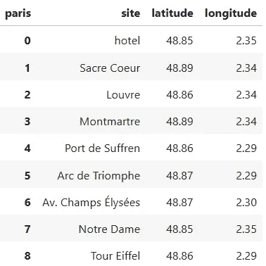

**注意：** 本文中的所有图片均由作者提供，除非另有说明。

让我们来看一种通过 `folium` 快速绘制这些地点在地图上的方法。

# 3\. 在地图上显示路线：一种务实的方法

如果你没有跟随这篇文章的系列内容，让我指出，我们正在采用**敏捷方法**来创建决策支持系统，因此我们是通过所谓的“冲刺”逐步构建它。这意味着我们首先希望完成**一个解决问题的工作原型**，这个问题是关于[***最小可行问题***](https://medium.com/@carlosjuribe/plan-an-optimal-trip-for-your-next-holidays-with-the-help-of-operations-research-and-python-481b1ea38fef#:~:text=a%20workable%20solution.-,2.2.%20Identifying%20the%20Minimum%20Valuable%20Problem,start%20designing%20a%20minimum%20viable%20product%20that%20will%20be%20also%20valuable.,-To%20plan%20the)的旅行规划系统。这个原型在我们没有实现最简化的可视化功能之前，不能被认为是完成的，因此才有了这篇文章。**一旦我们有了原型**，*即*，一旦系统的第一个版本在增加边际价值的方式下变得可用，我们就可以开始**完善它的实现，使其易于扩展**，这样我们就能*为系统添加更多现实的特性*，使其能够处理更广泛的、更加复杂的旅行规划问题。因此，我们现在关注的是*一种足够好的方法*——而不是*最终的*方法——来以某种有意义的方式在地图上显示一条路线。*更明确的方法*将在第二部分和第三部分中出现，我们将在那里重构这里创建的代码，使其遵循[面向对象设计](https://en.wikipedia.org/wiki/Object-oriented_programming)（自定义类型和类），从而更好地处理随着旅行规划问题加入更多细节和需求而不断增加的路线复杂性。但现在，这篇文章（第一部分）试图展示一种更务实、更快速的方式来用 Python 创建交互式路线。让我们看看如何实现。

## 3.1 显示站点

我们首先需要创建一个巴黎的地图。我们可以将地图中心设置为我们一组站点的平均位置：

```py
avg_location = df_sites[['latitude', 'longitude']].mean()
map_paris = folium.Map(location=avg_location, zoom_start=13)
```

然后，为了在其上显示这些站点，我们为每个站点创建一个标记，并将其添加到地图上。标记只需要一个位置，但为了快速识别每个标记上的站点，我们将站点名称传递给`tooltip`属性，这样当我们将鼠标悬停在标记上时，就会看到一个弹出窗口，显示站点的名称：

```py
for site in df_sites.itertuples():
    marker = folium.Marker(location=(site.latitude, site.longitude),
                           tooltip=site.site)
    marker.add_to(map_paris)

map_paris
```

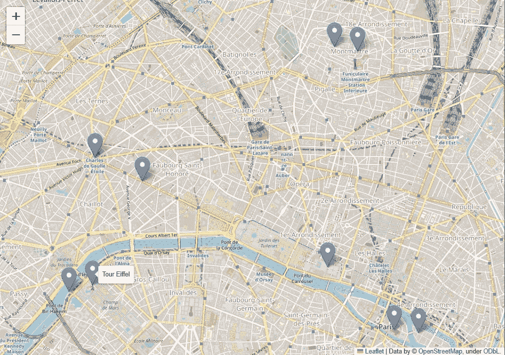

**图 6.1.** 地图上的站点标记

当然，如果需要，你可以放大和缩小并移动地图，使用左上角的`+ | -`按钮，或者通过点击和拖动。

# 3.2 显示路线

我们刚刚显示的站点实际上并没有按顺序排列，但我们可以假设它们是有顺序的。假设数据框中包含**城市中的一条路线**，其中索引中的数字表示这些站点的访问顺序：

```py
df_route = df_sites.copy()
df_route.index.name = 'visit_order'

df_route
```

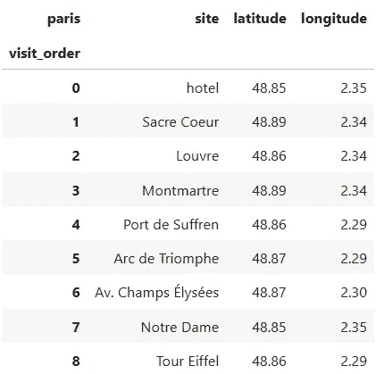

现在这些站点按照特定顺序（访问顺序）“连接”起来，因此我们也应该在地图上通过**添加连接连续停靠点的线路**来表示这一事实。这些线路，或者更准确地说，“段落”，是通过 `folium.PolyLine` 对象创建的。为了将它们一次性添加到地图上，我们在 `df_route` 中创建了更多的列，保存“下一个停靠点”的信息，因此每个停靠点都与其后续停靠点相对应，构成一个路线段。这样，**每一行都可以存储有关停靠点和路线段的信息**。

```py
df_route_segments = df_route.join(
    df_route.shift(-1),  # map each stop to its next stop
    rsuffix='_next'
).dropna()  # last stop has no "next one", so drop it

df_route_segments
```

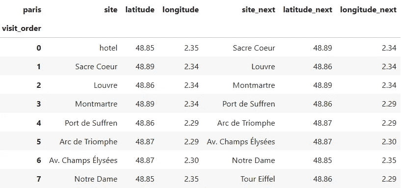

对于一个固定的行，前三列保存“当前”站点的信息，接下来的三列保存“下一个站点”在路线中的信息。这样，我们就可以在同一个 `for` 循环迭代中同时创建一个标记 *和* 一个段落：

```py
map_paris = folium.Map(location=avg_location, zoom_start=13)

for stop in df_route_segments.itertuples():
    # marker for current stop
    marker = folium.Marker(location=(stop.latitude, stop.longitude),
                           tooltip=stop.site)
    # line for the route segment connecting current to next stop
    line = folium.PolyLine(
        locations=[(stop.latitude, stop.longitude), 
                   (stop.latitude_next, stop.longitude_next)],
        tooltip=f"{stop.site} to {stop.site_next}",
    )
    # add elements to the map
    marker.add_to(map_paris)
    line.add_to(map_paris)

# maker for last stop wasn't added in for loop, so adding it now 
folium.Marker(location=(stop.latitude_next, stop.longitude_next),
              tooltip=stop.site_next).add_to(map_paris);

map_paris
```

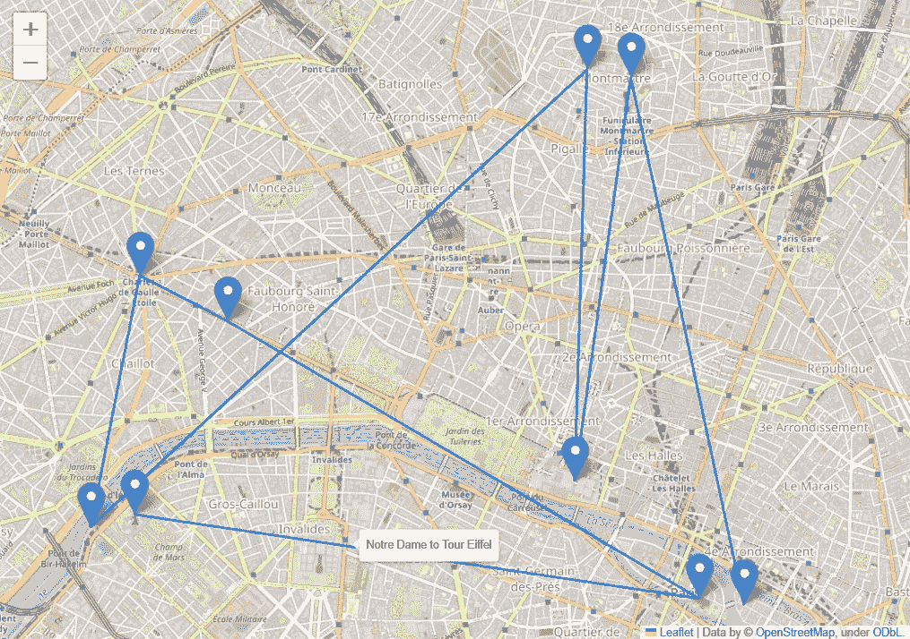

**图 6.2.** 通过线路连接的站点标记

现在，停靠点的访问顺序变得清晰，当你用鼠标悬停在每条线路上时，会看到该线路连接了哪两个站点。标记也一样，悬停时会显示它们所指向站点的名称。

## 3.3 丰富地图的交互信息

这些信息对于大致了解路线的外观已经足够，但我们可以通过**添加更多可以交互显示的信息**，用一点额外的努力让地图变得更加有用。首先，路线从哪里开始？通过当前的视图，并不直观地看到哪个站点是“起点”。有两个标记仅与一个段落连接，因此它们必须是其中之一，但我们得查看数据框才能区分“起点”和“终点”。更好的方式是**通过特殊图标标示起始站点**，这样我们一眼就能认出它。我们通过为每个标记添加一个 `folium.Icon` 对象来做到这一点，使得起始站点具有一个独特的图标：

```py
map_paris = folium.Map(location=avg_location, zoom_start=13)

for stop in df_route_segments.itertuples():
    initial_stop = stop.Index == 0
    # icon for current stop
    icon = folium.Icon(icon='home' if initial_stop else 'info-sign', 
                       color='cadetblue' if initial_stop else 'red')
    # marker for current stop
    marker = folium.Marker(location=(stop.latitude, stop.longitude),
                           icon=icon, tooltip=stop.site)
    # line for the route segment connecting current to next stop
    line = folium.PolyLine(
        locations=[(stop.latitude, stop.longitude), 
                   (stop.latitude_next, stop.longitude_next)],
        tooltip=f"{stop.site} to {stop.site_next}",
    )
    # add elements to the map
    marker.add_to(map_paris)
    line.add_to(map_paris)

# When for loop ends, the stop variable has the second-to-last 
# stop in the route, so the marker for the last stop is missing 
# We add it now using the "next" columns of the last row
folium.Marker(
    location=(stop.latitude_next, stop.longitude_next),
    tooltip=stop.site_next, 
    icon = folium.Icon(icon='info-sign', color='red')
).add_to(map_paris);

map_paris  # show map
```

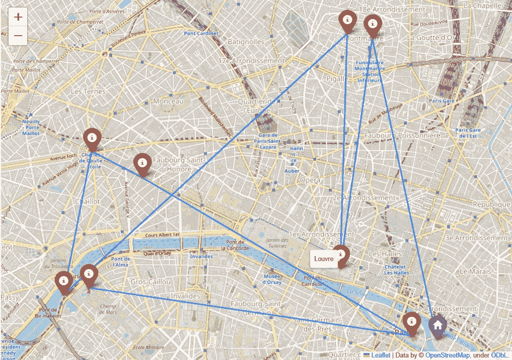

**图 6.3.** 按类型着色的带停靠标记的路线

一眼看去，现在显然路线是从带有“家”图标的标记开始的。让我们进一步利用交互性，通过在地图上显示一些有助于更好理解路线的更多信息来提高地图的可用性。我们将添加的基本信息是**停靠点之间的距离**和**每个停靠点的访问顺序号**。由于在 `df_route_segments` 的每一行中都有段落的起点和终点，我们可以轻松地添加一列，表示连续停靠点之间的距离。

> ***对于只对当前文章感兴趣的读者（*即*，不关心以前的文章）****，我在下面声明了函数* `*ellipsoidal_distance*` *。如果相反，您已经跟随整个系列的文章，您已经了解了* *那个函数**，因为我们在* *计算距离矩阵的文章**中开发了它（并为其辩护）。欢迎在此处重用该函数，以避免重复代码。要获得位置* `*loc1*` *和位置* `*loc2*` *之间的距离（单位：米），您只需要：*
> 
> `***from*** *geoutils* ***import*** *GeoAnalyzer*`
> 
> `*distance* ***=*** *GeoAnalyzer.****ellipsoidal_distance****(loc1, loc2)*`

```py
from geopy.distance import geodesic

_Location = Tuple[float, float]

def ellipsoidal_distance(point1: _Location, point2: _Location) -> float:
    """Calculate ellipsoidal distance (in meters) between point1 and 
    point2 where each point is represented as a tuple (lat, lon)"""
    return geodesic(point1, point2).meters
```

函数`ellipsoidal_distance`接受两个位置（两个坐标元组），并返回它们之间的[地理距离](https://en.wikipedia.org/wiki/Geodesic)，单位为米。有关地理距离的更深入解释和*论证*，请阅读我们创建该距离公式的文章：

[](/compute-the-distance-matrix-of-a-set-of-sites-from-their-coordinates-in-python-d5fc92a0ba9e?source=post_page-----44f8d25d0761--------------------------------) [## 计算一组站点的距离矩阵（基于其坐标）]

### 估算任意一对站点之间的距离，以其地理坐标为基础，作为解决问题的跳板……

towardsdatascience.com](/compute-the-distance-matrix-of-a-set-of-sites-from-their-coordinates-in-python-d5fc92a0ba9e?source=post_page-----44f8d25d0761--------------------------------)

我们可以添加新的列`'distance_seg'`，因为在每一行中我们都包含了段的两个端点：

```py
df_route_segments['distance_seg'] = df_route_segments.apply(
    lambda stop: ellipsoidal_distance(
        (stop.latitude, stop.longitude), 
        (stop.latitude_next, stop.longitude_next)), 
    axis=1
)

df_route_segments
```

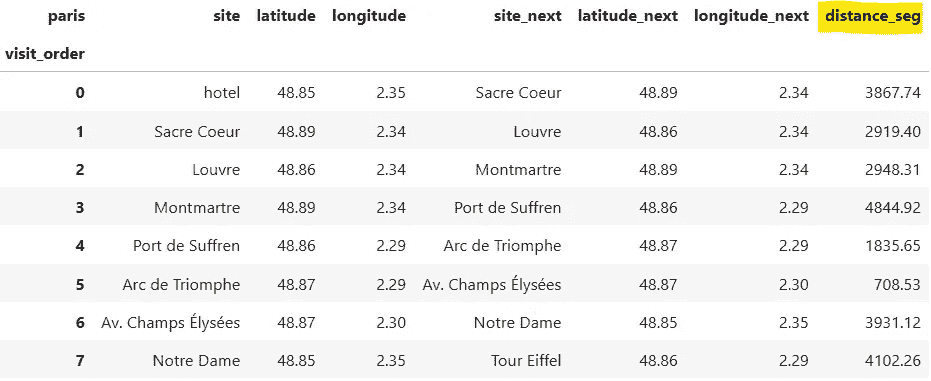

拥有了这一新列后，我们可以将其值纳入我们传递给`tooltip`的字符串中，在创建地图上的线路时，从而**使每个段的距离在光标指尖可见**。同时，我们还可以将“停靠点编号”添加到标记上，以便为每个标记提供更多的路线上下文：

```py
map_paris = folium.Map(location=avg_location, zoom_start=13)

for stop in df_route_segments.itertuples():
    initial_stop = stop.Index == 0
    # marker for current stop
    icon = folium.Icon(icon='home' if initial_stop else 'info-sign', 
                       color='cadetblue' if initial_stop else 'red')
    marker = folium.Marker(
        location=(stop.latitude, stop.longitude),
        icon=icon, 
        # display the name and stop number at each site's marker
        tooltip=f"<b>Name</b>: {stop.site} <br>" \
              + f"<b>Stop number</b>: {stop.Index} <br>"
    )
    # line for the route segment connecting current to next stop
    line = folium.PolyLine(
        locations=[(stop.latitude, stop.longitude), 
                   (stop.latitude_next, stop.longitude_next)],
        # display the start, end, and distance of each segment
        tooltip=f"<b>From</b>: {stop.site} <br>" \
              + f"<b>To</b>: {stop.site_next} <br>" \
              + f"<b>Distance</b>: {stop.distance_seg:.0f} m",
    )
    # add elements to the map
    marker.add_to(map_paris)
    line.add_to(map_paris)

# add route's last marker, as it wasn't included in for loop
folium.Marker(
    location=(stop.latitude_next, stop.longitude_next),
    tooltip=f"<b>Name</b>: {stop.site_next} <br>" \
          + f"<b>Stop number</b>: {stop.Index + 1} <br>", 
    icon = folium.Icon(icon='info-sign', color='red')
).add_to(map_paris);

map_paris  # show map
```

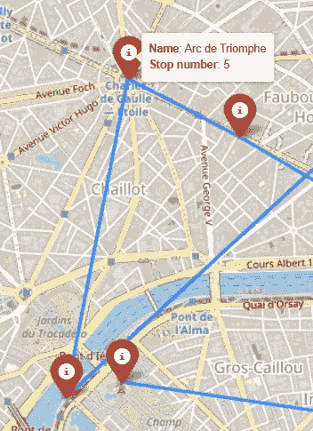

**图 6.4.** 鼠标悬停在标记上时显示的交互式信息

注意我们如何使用了一些 HTML 来更漂亮地呈现标记和线路上的“悬停文本”。

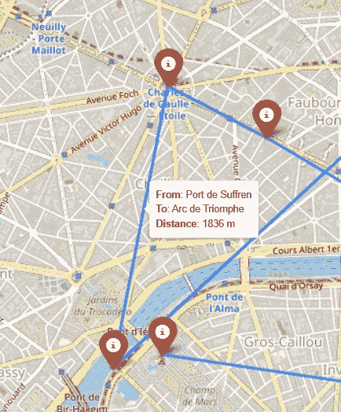

**图 6.5.** 鼠标悬停在路线段上时显示的交互式信息

当前的行为看起来足够通用，适合封装成一些辅助函数：

```py
def _make_route_segments_df(df_route: pd.DataFrame) -> pd.DataFrame:
    """Given a dataframe whose rows are ordered stops in a route, 
    and where the index has integers representing the visit order of those
    stops, return a dataframe having new columns with the information of 
    each stop's next site"""
    df_route_segments = df_route.join(
        df_route.shift(-1),  # map each stop to its next
        rsuffix='_next').dropna()

    df_route_segments['distance_seg'] = df_route_segments.apply(
        lambda stop: ellipsoidal_distance(
            (stop.latitude, stop.longitude), 
            (stop.latitude_next, stop.longitude_next)
        ), axis=1
    )
    return df_route_segments

def plot_route_on_map(df_route: pd.DataFrame) -> folium.Map:
    """Takes a dataframe of a route and displays it on a map, adding 
    a marker for each stop and a line for each pair of consecutive 
    stops"""
    df_route_segments = _make_route_segments_df(df_route)

    # create empty map
    avg_location = df_route[['latitude', 'longitude']].mean()
    map_route = folium.Map(location=avg_location, zoom_start=13)

    for stop in df_route_segments.itertuples():
        initial_stop = stop.Index == 0
        # marker for current stop
        icon = folium.Icon(icon='home' if initial_stop else 'info-sign', 
                           color='cadetblue' if initial_stop else 'red')
        marker = folium.Marker(
            location=(stop.latitude, stop.longitude),
            icon=icon, 
            tooltip=f"<b>Name</b>: {stop.site} <br>" \
                  + f"<b>Stop number</b>: {stop.Index} <br>"
        )
        # line for the route segment connecting current to next stop
        line = folium.PolyLine(
            locations=[(stop.latitude, stop.longitude), 
                       (stop.latitude_next, stop.longitude_next)],
            # add to each line its start, end, and distance
            tooltip=f"<b>From</b>: {stop.site} <br>" \
                  + f"<b>To</b>: {stop.site_next} <br>" \
                  + f"<b>Distance</b>: {stop.distance_seg:.0f} m",
        )
        # add elements to the map
        marker.add_to(map_route)
        line.add_to(map_route)

    # When for loop ends, the stop variable has the second-to-last stop in 
    # the route, so the marker for the last stop is missing, and we add it 
    # now using the "next" columns of the last row
    folium.Marker(
        location=(stop.latitude_next, stop.longitude_next),
        tooltip=f"<b>Name</b>: {stop.site_next} <br>" \
              + f"<b>Stop number</b>: {stop.Index + 1} <br>", 
        icon = folium.Icon(icon='info-sign', color='red')
    ).add_to(map_route)

    return map_route
```

## 3.4 处理封闭路线，亦即环形路线

如果我们有一个代表**闭合旅行**的 DataFrame`df_route`，*即*，一条起始点和终点相同的路线，会发生什么情况？地图会如何反映这一点？让我们构建这样的一个 DataFrame 并进行测试。我们以之前的`df_route`为例，它是一个开放的路线，并在末尾添加一行，内容与第一行相同，从而使得这条路线闭合：

```py
df_route_closed = pd.concat(
   [df_route, df_route.head(1)], ignore_index=True
)
df_route_closed.index.name = df_route.index.name

df_route_closed
```

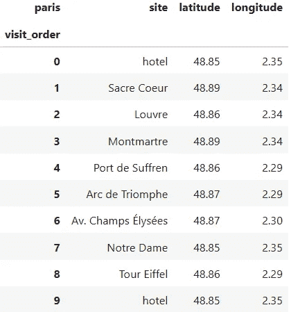

多亏了设置`ignore_index=True`，代表访问顺序的索引号已经自动增加了一个单位。现在我们照常继续，创建地图，但这次使用我们的新辅助函数`plot_route_on_map`：

```py
plot_route_on_map(df_route_closed)
```

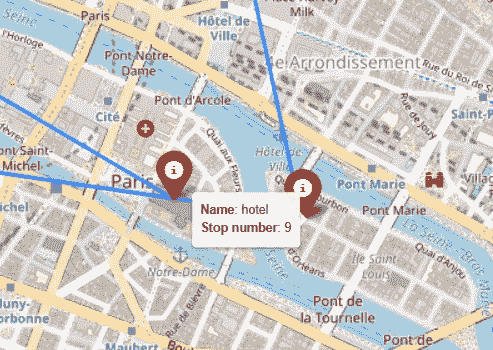

**图 6.6。** 蓝色标记（表示初始站点）被最终站点的红色标记遮挡

它*几乎完美*地工作，因为代表“闭合”段的新行如预期创建，但标记有问题：**一个新的红色标记被添加到初始站点上方，覆盖了先前添加的蓝色标记**。这就是 Folium 的工作方式，它会将新元素叠加在现有元素上（注意“酒店”的标记阴影比其他标记的阴影更深，这是一个微妙的提示，表明该位置有多个标记）。为了避免丢失指示路线起始站点的有用蓝色“主页”图标，我们需要跳过添加最后一个标记（当`for`循环结束后）*仅当最后一个站点与路线的起始站点重合时*。我们可以通过直接检查`df_route`中的条件来做到这一点，只有在**路线没有闭合**的情况下，才添加最后一个标记：

```py
# NOTE: trimmed down function for reference only, do not copy-paste.
def plot_route_on_map(df_route: pd.DataFrame) -> folium.Map:
    #----- map is created here -----
    # ...
    #----- markers are created here -----
    for stop in df_route_segments.itertuples():
        # ...
        # ( ఠ ͟ʖ ఠ)
        # ...
        # for loop ends!

    ### 𝗡𝗲𝘄 𝗰𝗼𝗻𝗱𝗶𝘁𝗶𝗼𝗻 𝗰𝗵𝗲𝗰𝗸𝗲𝗿 ###
    # check if first site's name and location coincide with last's?
    first_stop = df_route.iloc[0][['site', 'latitude', 'longitude']]
    last_stop = df_route.iloc[-1][['site', 'latitude', 'longitude']]
    is_closed_tour = (first_stop == last_stop).all()

    # When for loop ends, the marker for the last stop is missing 
    # (**unless the route is closed**). if the route is not closed, 
    # we add it now using the "next" columns of the last row
    if not is_closed_tour:
        folium.Marker(
            location=(stop.latitude_next, stop.longitude_next),
            tooltip=f"<b>Name</b>: {stop.site_next} <br>" \
                  + f"<b>Stop number</b>: {stop.Index + 1} <br>", 
            icon = folium.Icon(icon='info-sign', color='red')
        ).add_to(map_route)

    return map_route
```

在如上所述编辑`plot_route_on_map`之后，期望的行为已恢复，*即*，初始站点的“主页”图标不会被旅行中的最后一个站点覆盖：

```py
plot_route_on_map(df_route_closed)
```

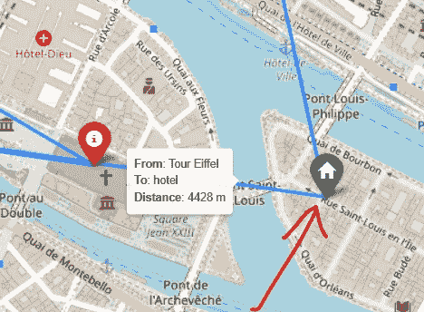

**图 6.7。** 标记显示初始站点再次可见

使用这种最终视图，*我们可以通过光标的一个简单操作轻松知道两个连续站点之间的距离*（以及它们所连接的站点）。此外，*我们只需将光标悬停在站点上，就能查看站点访问的时间顺序*。**这种互动性可以帮助我们评估所处理路线的质量，无论当前处理的是什么类型的路径问题。**

## 3.5 附加功能：在地图上添加关键绩效指标（KPI）

最后，让我们添加一个功能，使地图变得更加富有洞察力。

> 总是有一些信息，它们与路线中的任何站点或段落没有直接关联，而是与整个路线相关。这些信息也很重要，通常是全局属性，如 ID、名称，或与路线相关的重要指标。我们也可以通过一个简单的技巧将它们显示在 Folium 地图上。

如果我们想展示一些与任何单一标记或行无关，但与整个路线相关的信息，我们可以**将其作为文本块添加到 folium 地图中**。例如，在商业仪表盘中，这非常有用，因为通常我们想要显示像**路线的名称/ID 或各种试图在某种相关意义上总结它的指标**之类的信息。

举个例子，我会在左上角添加一个**地图的标题**，在右下角添加**两个非常基础的路线 KPI**：*停靠站的数量*和*它穿越的总距离*。我们定义了我们想要显示的不同文本的名称（在`TAG_`常量中），并从`df_route_segments`中提取它们各自的值，`df_route_segments`是包含所有“段数据”的数据框：

```py
TAG_ROUTE_NAME = "Name"
TAG_NUMBER_STOPS = "Num stops"
TAG_TOTAL_DISTANCE = "Distance"
_SPACE_HTML = "&nbsp"  # needed to add empty spaces between KPIs

# get summary info to display on map
name = df_route_segments.columns.name.capitalize()
n_stops = df_route_segments['site'].size
route_distance = df_route_segments['distance_seg'].sum().round(0)
```

对于每个我们想要添加的文本，我们需要将其转换为 HTML，并以特殊方式将其添加到地图中。包含文本 HTML 代码的字符串需要放入一个`folium.Element`中。步骤如下：(1) 创建一个*基本的*HTML 字符串来显示信息，(2) 使用更多 HTML 进行样式设置，(3) 将其添加到地图的根 HTML 元素中。我知道，谈论地图让我也会迷失，所以我们还是直接做吧。

> **💡小贴士：** 如果你正在使用 Jupyter Notebook 或 Lab，建议你使用`IPython.display.HTML`类来快速查看你的 HTML 代码反馈，像这样：

```py
from IPython.display import HTML, display
# show a hello world message in blue and bold 
display(HTML("<span style='color:steelblue'>Hello <b>world</b></span>"))
```

## 为地图添加标题

首先，创建标题的基本 HTML 字符串：

```py
_html_text_title = f"<b>{TAG_ROUTE_NAME}</b>: {name}"

display(HTML(_html_text_title))  # [Out]: 𝗡𝗮𝗺𝗲: Paris
```

第二，按你喜欢的样式来调整这个基本 HTML 字符串。在这里，我希望标题是黑色的，位于地图的左上角，并且**为了提高可读性，我希望文字有一些白色背景阴影：**

```py
STYLE_TITLE = (
    "position:absolute;z-index:100000;left:5vw;color:black;"
    "font-size:30px;text-shadow:-1px 0 white, 0 1px white, 0 1px white"
)
html_title = f'<h3 style="{STYLE_TITLE}">{_html_text_title}</h3>'

# let's see how that title looks like on the map (run all in same cell):
map_with_title = plot_route_on_map(df_route)

root_map = map_with_title.get_root()
root_map.html.add_child(folium.Element(html_title))

map_with_title
```

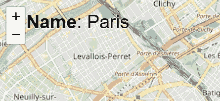

**图 6.8.** 地图的标题，不受缩放级别影响

看起来不错。现在，做同样的事情来显示 KPI：

**将 KPI 添加到地图中**

和之前一样，首先，我们为 KPI 创建基本的 HTML 字符串。对于这种情况，显示方式会有所不同，当然，也取决于个人口味：我喜欢我的 KPI 显示在地图的右下角，水平排列。可以随意更改样式参数，选择符合你审美偏好的样式。

```py
_html_text_summary = f"""
<b>{TAG_NUMBER_STOPS}</b> <b>{TAG_TOTAL_DISTANCE}</b>
<br>
{n_stops} {16 * _SPACE_HTML} {route_distance:.0f} m
"""

display(HTML(_html_text_summary))
# [Out]:
# 𝐍𝐮𝐦 𝐬𝐭𝐨𝐩𝐬  𝐃𝐢𝐬𝐭𝐚𝐧𝐜𝐞
# 8          25158 m
```

样式非常相似，唯一的变化是字体稍微小一点。我们保留白色背景阴影，因为它对展示 KPI 的清晰度至关重要：

```py
STYLE_SUMMARY = (
    "position:absolute;z-index:100000;font-size:20px;"
    "right:0;bottom:0;color:black;"
    "text-shadow:-1px 0 white, 0 1px white, 0 1px white"
)
html_summary = f'<h2 style="{STYLE_SUMMARY}">{_html_text_summary}</h2>'

# let's see how the KPIs look like (run all in same cell):
map_with_kpis = plot_route_on_map(df_route)

root_map = map_with_kpis.get_root()
root_map.html.add_child(folium.Element(html_summary))

map_with_kpis
```

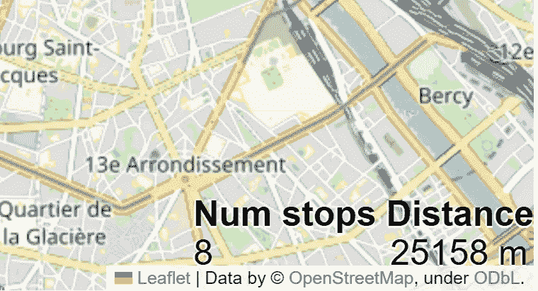

**图 6.9.** 地图上方的 KPI，不受缩放级别影响

好的，开始看起来很棒了！现在我们来将标题和 KPI 结合起来！

```py
my_map = plot_route_on_map(df_route)

root_map = my_map.get_root()
root_map.html.add_child(folium.Element(html_title))  # add title
root_map.html.add_child(folium.Element(html_summary))  # add summary KPIs
my_map  # check it out
```

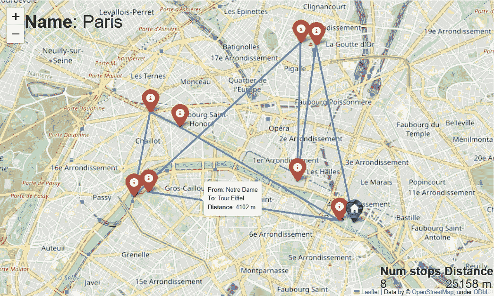

**图 6.10.** 路线的总结信息，标题在顶部，KPI 在底部，不受缩放级别影响

感谢我们添加的文本，地图现在传达了更多有用的路线信息（看起来也更专业了，不是吗？）。甚至不需要移动鼠标，**我们就能看到地图角落的有价值信息；而得益于互动性，通过快速悬停，我们可以看到不同景点的名称和参观顺序，以及任意两个停靠点之间的距离**。*让我们通过将其封装为帮助函数，使这个功能* ***可重用*** *，并创建一个新的、更通用的函数`display_route_on_map`，该函数将像`plot_route_on_map`一样创建地图，增加了将名称和 KPI 信息包含到地图上的选项。首先是获取 HTML 字符串的函数：*

```py
def _get_text_for_title(df_route_segments):
    """Given a dataframe representing a route, where the column index has 
    the name of the route, returns an HTML string with a nice display of 
    this name"""
    # 1) get the info to display
    name = df_route_segments.columns.name
    name = name.capitalize() if name else ''

    # 2) parse the info as HTML for addition to map
    _html_text_title = f"<b>{TAG_ROUTE_NAME}</b>: {name}"
    html_title = f'<h3 style="{STYLE_TITLE}">{_html_text_title}</h3>'
    return html_title

def _get_kpis_to_display_on_map(df_route_segments):
    """Given a dataframe representing a route, and having columns 'site' 
    and 'distance_seg', returns an HTML string with a nice display of 
    the number of sites and the total distance of the route"""
    # 1) get the info to display
    n_stops = df_route_segments['site'].size
    route_distance = df_route_segments['distance_seg'].sum().round(0)

    # 2) parse the info as HTML for addition to map
    _html_text_summary = f"""
    <b>{TAG_NUMBER_STOPS}</b> <b>{TAG_TOTAL_DISTANCE}</b>
    <br>
    {n_stops} {16 * _SPACE_HTML} {route_distance:.0f} m
    """
    html_summary = f'<h2 style="{STYLE_SUMMARY}">{_html_text_summary}</h2>'
    return html_summary
```

我们可以通过新函数的`include_kpis`属性来控制是否将标题和 KPI 添加到地图中：

```py
def display_route_on_map(df_route, include_kpis=True) -> folium.Map:
    """Given a dataframe representing a route, creates a folium map 
    and adds markers for the stops and lines for the route segments, 
    with the option to also add an automatic title and 2 KPIs: 
     - number of stops in the route
     - total distance of route

    Parameters
    ----------
    df_route : pd.DataFrame
      A dataframe representing a route, whereby each row contains
      information on a different stop of the route, and rows are sorted 
      by stop visiting order.
    include_kpis : bool (default=True)
      Whether to include the title and the 2 KPIs in the map

    Returns
    -------
    A folium map that can be displayed or re-used"""
    # 1) create empty map
    avg_location = df_route[['latitude', 'longitude']].mean()
    map_route = folium.Map(location=avg_location, zoom_start=13)

    # 2) create DF with segment information
    df_route_segments = _make_route_segments_df(df_route)

    # 3) add title and KPIs to the map
    if include_kpis:
        html_title = _get_text_for_title(df_route_segments)
        html_summary = _get_kpis_to_display_on_map(df_route_segments)
        root_map = map_route.get_root()
        root_map.html.add_child(folium.Element(html_title))  # add title
        root_map.html.add_child(folium.Element(html_summary))  # add KPIs

    # 4) add route to the map
    for stop in df_route_segments.itertuples():
        initial_stop = stop.Index == 0
        # marker for current stop
        icon = folium.Icon(icon='home' if initial_stop else 'info-sign', 
                           color='cadetblue' if initial_stop else 'red')
        marker = folium.Marker(
            location=(stop.latitude, stop.longitude),
            icon=icon, 
            tooltip=f"<b>Name</b>: {stop.site} <br>" \
                  + f"<b>Stop number</b>: {stop.Index} <br>"
        )
        # line for the route segment connecting current to next stop
        line = folium.PolyLine(
            locations=[(stop.latitude, stop.longitude), 
                       (stop.latitude_next, stop.longitude_next)],
            # add to each line its start, end, and distance
            tooltip=f"<b>From</b>: {stop.site} <br>" \
                  + f"<b>To</b>: {stop.site_next} <br>" \
                  + f"<b>Distance</b>: {stop.distance_seg:.0f} m",
        )
        # add elements to the map
        marker.add_to(map_route)
        line.add_to(map_route)

    # does the first site's name and location coincide with the last's?
    first_stop = df_route.iloc[0][['site', 'latitude', 'longitude']]
    last_stop = df_route.iloc[-1][['site', 'latitude', 'longitude']]
    is_closed_tour = (first_stop == last_stop).all()

    # When for loop ends, the stop variable has the second-to-last 
    # stop in the route, so the marker for the last stop is missing 
    # (**unless the route is closed**). We add it now using 
    # the "next" columns of the last row, if the route is open
    if not is_closed_tour:
        folium.Marker(
            location=(stop.latitude_next, stop.longitude_next),
            tooltip=f"<b>Name</b>: {stop.site_next} <br>" \
                  + f"<b>Stop number</b>: {stop.Index + 1} <br>", 
            icon = folium.Icon(icon='info-sign', color='red')
        ).add_to(map_route)

    return map_route
```

让我们用一个不同城市的旅游进行最终测试，**纽约**。下面的数据框包含了这座城市的一些标志性景点（和一家随机酒店），顺序没有特别规定：

```py
df_route_ny = pd.DataFrame(
    [['hotel',                  40.710400, -74.006670],
     ['One World Trade Center', 40.713658, -74.013285],
     ['Federal Hall',           40.708051, -74.010223],
     ['Tenement Museum',        40.718807, -73.990051],
     ['Flatiron Building',      40.739665, -73.989976],
     ['Chrysler Building',      40.750542, -73.975632],
     ['New York City Library',  40.752471, -73.982162],
     ['Empire State Building',  40.747814, -73.985289],
     ['Madison Square Garden',  40.749924, -73.993853],
     ['Chelsea Market',         40.742750, -74.006877]],
    columns=pd.Index(['site', 'latitude', 'longitude'], name='new york')
)
df_route_ny.index.name = 'visit_order'

df_route_ny
```

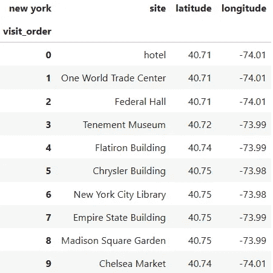

当路线的数据框准备好时，一个漂亮的可视化就只差调用一个函数：

```py
display_route_on_map(df_route_ny)
```

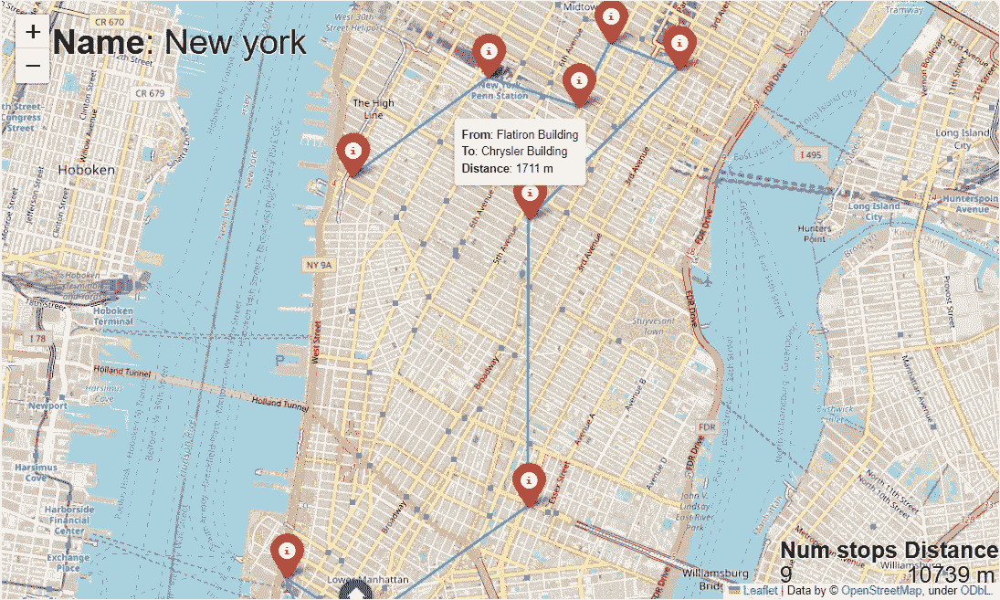

**图 6.11.** 纽约随机路线的互动地图

我们得到了曼哈顿路线的一个简单而强大的可视化。只需一眼，我们就能知道路线的覆盖距离，甚至不需要麻烦地数红色标记：因为“站点数量”KPI 已经告诉了我们。更具体地说，**所有标记和路线段都是互动的，当我们小心地将鼠标悬停在它们上面时，会弹出一些有用的信息**。任务完成！

# 4\. 结论（或下一个冲刺的计划）

在本文中，我们开发了一种务实的方法，利用数据框中存储的通用路线，并通过互动标记和段落将其显示在地图上，这有助于我们获得更多背景信息并获取更多数据。如果这正是你所需要的，我希望我能为你提供帮助，并且你能够在自己的项目中扩展这一点。

如果你是[“**Python 中的智能旅游决策支持系统**”文章系列](https://medium.com/@carlosjuribe/list/an-intelligent-decision-support-system-for-tourism-in-python-b6ba165b4236)的读者，并且希望通过构建旅行规划系统继续学习**应用性规范分析**，请继续阅读，因为在下一个冲刺中，**我们将把这个地图功能与之前冲刺中创建的旅行商优化器集成在一起**，以便我们可以轻松评估生成的最佳旅游路线。敬请关注，见证我们将共同构建的*壮丽成果*！


[卡洛斯·吉梅内斯·乌里贝](https://medium.com/@carlosjuribe?source=post_page-----44f8d25d0761--------------------------------)

## 使用 Python 开发的旅游智能决策支持系统

[查看列表](https://medium.com/@carlosjuribe/list/an-intelligent-decision-support-system-for-tourism-in-python-b6ba165b4236?source=post_page-----44f8d25d0761--------------------------------)6 篇故事

感谢阅读，我们下次再见！📈😊

随时欢迎关注我，向我提问，**给我反馈**，或通过[LinkedIn](https://www.linkedin.com/in/carlosjuribe/)与我联系。
