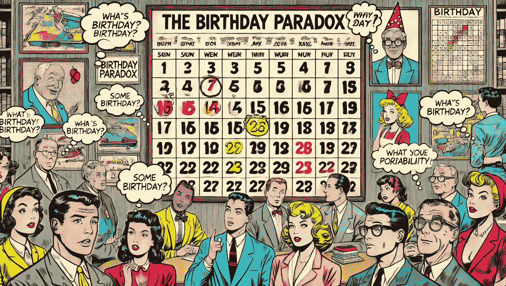

# 水冷器闲聊：生日悖论 🎂🎉

> 原文：[`towardsdatascience.com/water-cooler-small-talk-the-birthday-paradox-94ea294502c7?source=collection_archive---------3-----------------------#2024-09-25`](https://towardsdatascience.com/water-cooler-small-talk-the-birthday-paradox-94ea294502c7?source=collection_archive---------3-----------------------#2024-09-25)

## 数据科学 | 统计学

## 一窥共享生日的反直觉数学

 [Maria Mouschoutzi, PhD](https://medium.com/@m.mouschoutzi?source=post_page---byline--94ea294502c7--------------------------------)

·发表于[Towards Data Science](https://towardsdatascience.com/?source=post_page---byline--94ea294502c7--------------------------------) ·阅读时长：9 分钟·2024 年 9 月 25 日

--

由作者使用 GPT-4 创建的图像

水冷器闲聊是一种特殊的闲聊形式，通常出现在办公室的水冷器旁。员工们在这里经常分享各种公司八卦、神话传说、不准确的科学观点、不拘小节的个人轶事，甚至是完全的谎言。什么都能聊。所以，在我的水冷器闲聊文章中，我会讨论一些我在办公室里听到的奇怪且通常没有科学根据的观点，这些观点让我简直哑口无言。

这是今天文章的水冷器讨论：

> 我在一个有 60 多人的办公室楼层工作，上周有两个人在同一天过生日。得知他们的生日相同后，他们大概进行了如下对话：
> 
> - 我简直不敢相信我们竟然在同一天过生日！
> 
> - 是的，这概率有多小？
> 
> ..大家都评论说这太奇怪了。简直是一次疯狂的、业力的巧合……

🌌🥳

但说真的，这几率有多小？快速估算一下，你可能会认为这样的事件发生的几率应该非常低……
