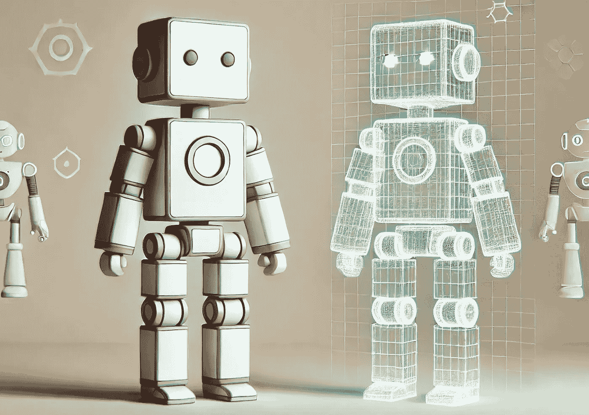

# 什么是数字双胞胎？

> 原文：[`towardsdatascience.com/what-are-digital-twins-artificial-intelligence-65844333e25a?source=collection_archive---------7-----------------------#2024-10-18`](https://towardsdatascience.com/what-are-digital-twins-artificial-intelligence-65844333e25a?source=collection_archive---------7-----------------------#2024-10-18)

## 桥接物理世界和数字世界

 [Andrea Valenzuela](https://medium.com/@andvalenzuela?source=post_page---byline--65844333e25a--------------------------------)

·发表于[数据科学前沿](https://towardsdatascience.com/?source=post_page---byline--65844333e25a--------------------------------) ·阅读时间：6 分钟·2024 年 10 月 18 日

--

AI 生成的图像，使用 DALL-E3。

你听说过“数字双胞胎”这个术语吗？还是我只是自从在一次会议全体报告中接触到它之后，就一直不断听到它的提法？

从本质上讲，**数字双胞胎是物理实体的虚拟模型**——一台机器、一座建筑，甚至是一个星球！得益于近年来计算能力的进步，这种虚拟复制品正在成为现实。

但*数字双胞胎到底是什么*，以及*为什么它被认为是技术创新的下一前沿*？

让我们在本文中一探究竟！

# 什么是数字双胞胎？

假设我们有一个双胞胎，但不是一个真实的人，而是**我们自己的数字版本**。这个数字双胞胎将像我们一样行动，但存在于计算机中。它可以显示我们身体的实时信息，例如压力水平或血压，甚至预测我们未来可能出现的症状。

尽管想象人体可能有些困难，但让我们来看一个更实际的例子。如果我们有一辆车的数字双胞胎，我们就可以跟踪发动机的运行情况，监控刹车磨损等，甚至可以得到何时进行维护的建议。**汽车的数字双胞胎可以通过**…
