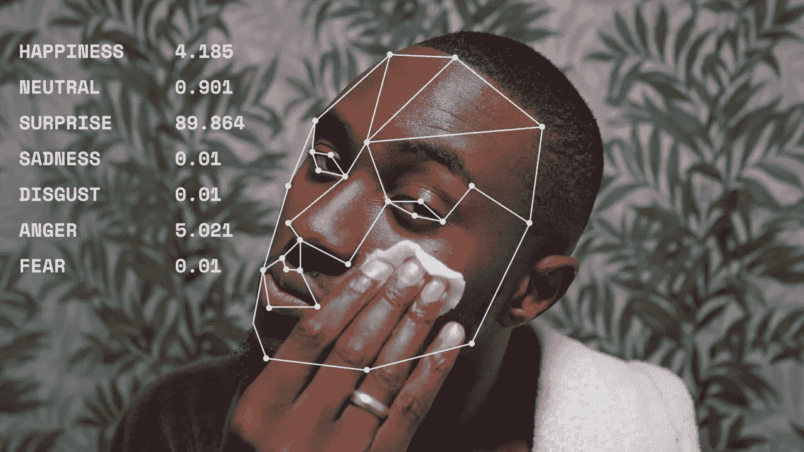

# 情绪在法律上的定义是什么？这真重要吗？

> 原文：[`towardsdatascience.com/what-are-emotions-legally-speaking-and-does-it-even-matter-4b5ebf8de058?source=collection_archive---------9-----------------------#2024-03-01`](https://towardsdatascience.com/what-are-emotions-legally-speaking-and-does-it-even-matter-4b5ebf8de058?source=collection_archive---------9-----------------------#2024-03-01)

## 情绪环路

## 探索情绪识别技术中的情绪法律框架

 [Tea Mustać](https://medium.com/@tea.mustac?source=post_page---byline--4b5ebf8de058--------------------------------)

·发表于[Towards Data Science](https://towardsdatascience.com/?source=post_page---byline--4b5ebf8de058--------------------------------) ·阅读时间 9 分钟·2024 年 3 月 1 日

--

图片由 Comuzi 提供 / © BBC / 更好的人工智能图片 / Mirror D / CC-BY 4.0

最近我开始写一系列名为《情绪环路》的文章，在首篇文章（“[分析（扫描版）简的生活](https://medium.com/towards-data-science/emotions-in-the-loop-1a68268a8823)”）中，我设想了一个终极个人助理，它与各种个人设备互联，并配备多种情绪识别系统。我写下第一篇文章，尽管它带有浓厚的科幻色彩，原因有以下几点：

1.  在我陷入分析这个相互关联系统的法律细节之前，先来点乐趣。

1.  提出一些我希望在这一系列中探讨的问题。

然而，在我们进入这两个问题之前，我认为有必要先关注一下在这个背景下，情绪究竟是什么，无论是在法律上还是在技术上。正如我们很快将看到的，这两种含义是密不可分的。为了不浪费太多时间和篇幅，我们现在就开始吧！

## 1\. 情绪的力量

> *“情绪控制着我们生活的杠杆，无论是内心的歌声，还是驱动我们科学探索的好奇心。康复顾问、牧师、父母，甚至在某种程度上，政治家都知道，影响人们最大的不是法律，而是他们所跟随的节奏。”*
> 
> R.W. Picard

情感一直是我们感兴趣的主题。从亚里士多德描述情感为“*那些如此改变人的感觉，以至于影响他们的判断*。”[ [1] ](#_ftn1) 到查尔斯·达尔文和威廉·詹姆斯，他们首次将情感与其身体表现及原因联系在一起。[ [2] ](#_ftn2) 一直到现代技术，比如我们可爱的扫描珍（Jane）所使用的技术，这些技术收集并解读这些身体表现，似乎比我们自己更了解我们。

这种迷恋促使我们不仅发现情感的力量，还发现如何影响情感的方法。这些方法既可以让我们自己和他人感觉更好，也可以用来欺骗和操控他人。现在，人工智能进入了这个领域，慷慨地提供了在大规模上识别和影响情感的可能性。然而，尽管我们似乎对情感及其对我们的影响深感兴趣，我们的法律仍然不足以保护我们免受恶意情感操控。造成这种情况的原因之一是，因为我们仍然不确定情感到底是什么，更不用说从法律角度定义它了。因此，让我们尝试看看是否至少能回答第二个问题，即使第一个问题依然难以捉摸。

## 2. 情感作为（个人）数据？

当我们从法律角度，特别是在人工智能的背景下思考情感时，可能会想到它们是一种数据。甚至可能是个人数据。毕竟，什么比情感更个人化呢？比你小心翼翼地保守的感觉更个人化的东西是什么？那么，让我们简要地考虑一下这个假设。

根据《GDPR》，个人数据被定义为“*任何与已识别或可识别的自然人相关的信息*。” 可识别的自然人是指那个（至少理论上）可以通过某些方式被识别的人，无论是直接还是间接。在这个背景下，情感略显问题的地方在于它们是普遍的。悲伤、快乐、愤怒或兴奋并不会告诉我任何能够让我识别出体验这些情感的主体的信息。但这种看法过于简单化了。

首先，情感数据从未存在于真空中。相反，它是通过处理大量（有时多，有时少，但总是）个人数据来推断的。通过分析我们的健康数据，如血压和心率，以及我们的生物特征数据，如眼动、面部扫描或声音扫描，来推断情感数据。而通过将所有这些数据点结合起来，实际上是可以识别一个人的。[ [3] ](#_ftn3) 甚至《通用数据保护条例》（GDPR）也证明了这一点，它在个人数据的定义中就已经解释了，通过引用“*与自然人的身体、心理、基因、精神、经济、文化或社会身份特征相关的一个或多个因素*”，可以实现间接识别。[ [4] ](#_ftn4)

最简单的例子当然是各种可穿戴设备和个人设备中的情感识别系统，比如简的设备，在这些系统中，数据与她的用户档案和社交媒体数据直接相关，使得识别变得更加简单。然而，即使我们不处理个人设备，仍然有可能间接识别个人。例如，一个站在智能广告牌前的人，根据他们的情感状态和其他显著特征，收到一则广告[[5]](#_ftn5)。为什么？因为身份识别是相对的，并且高度依赖于上下文。例如，如果我说“我看到一个看起来很难过的女孩”，和我说“看看街对面那个看起来很难过的女孩”并不相同。通过缩小上下文范围和可能涉及的其他人群体，身份识别变得非常有可能，即使我所使用的只是非常通用的信息[[6]](#_ftn6)。

此外，是否能*辨识*一个人也将大大取决于我们对这个词的定义。换句话说，我们可能指的是‘通过名字和/或其他公民数据来识别’。然而，这样的定义是荒谬的，因为这些数据是可变的，可能被伪造和操控，更不用说并非所有人都有这些数据了。（想想那些[通常没有任何官方身份证明](https://www.americanprogress.org/article/providing-identification-to-unauthorized-immigrants/)的非法移民。）没有身份证的人就无法被识别吗？我认为不是。或者，如果可以识别，那我们对身份识别的理解就有严重问题。这也成为了越来越多的作者将数据处理操作视为符合 GDPR 相关性的常见论点，许多人将身份识别广泛理解为‘个体化’[[7]](#_ftn7)，“区分”[[8]](#_ftn8)，甚至是‘定向’[[9]](#_ftn9)，这些都是这些系统设计之初的目标。

所以，看起来情感和情感数据很可能也在 GDPR 的范围内，无论处理这些数据的公司是否利用它来识别个人。然而，即使它们不被用于识别，推断情感的数据肯定总是个人数据。这反过来使 GDPR 适用。我们现在并不打算深入探讨这意味着什么，或者 GDPR 的条款在大多数（甚至所有？）情感识别技术提供商中如何被侵犯。毕竟，他们仍在忙于辩称情感数据本来就不是个人数据。

## 3\. 这真的重要吗？

我们都听过这句话：“你知道我的名字，却不知我的故事。”我们也都知道，这句话非常真实。我们的名字（以及其他明显的个人数据）所能透露的信息，比我们的情感少得多。我们的名字也不能用于相同的侵入性和削弱权力的目的，至少不会像识别我们的情感状态那样。也正因如此，在大多数情况下，这些系统的提供商并不会识别我们的身份。他们不关心你的名字是什么，他们关心的是你在乎什么，你关注什么，什么让你兴奋或困扰。

当然，其中一些销售健康设备，这些设备然后推测你的情感和心理状态以达到健康目的。就像扫描简（Jane）那样，很多人可能正是为了这个目的购买这些设备。然而，大多数（所有？）设备并不仅仅是这么做的。为什么要让这些宝贵的数据浪费掉呢？当它也可以被用来与其他商业实体合作，为你提供个性化的广告，甚至为你省去麻烦，直接为你下单。毕竟，他们所合作的实体，只不过是你（推测上）需要的东西的其中一个靠谱的选择。

最后，考虑到这些目的，特别是当涉及到其他非健康设备的情感识别系统时，识别特定情感的意义也变得越来越不重要。这使得关于是否‘*解读*’情感是科学还是伪科学的辩论在很大程度上变得无关紧要。以及之前讨论过的情感是什么的问题，因为那时我们必须进行同样的思维练习，去识别和使用任何他们最终能够识别的状态。例如，现如今，将你放在 PAD（愉悦-激动-支配）量表上的位置要更为重要。[ [10]](#_ftn10) 这足以评估你对特定信息、情况、广告或其他事物的整体态度。它是引发积极还是消极的感觉，它是否吸引了你的注意力，是否让你变得积极主动或是被动接收？而这些足以让你在恰当的时刻看到恰到好处的广告。如果你仍然在看到广告的话，而不是直接把东西送到你门口。

## 4\. 最后的思考

那么，情感是什么？它们是很多东西。它们是我们当前状态和环境的内在感知，是这些感知的外部表现形式，以及对这些表现形式的计算性读取。这个冗长的过程也使得它们成为一种数据。当与其他数据点结合，或在足够狭窄的背景下使用时，这些数据在某些情况下可能是个人的。而这无关情感在心理学意义上的定义。除非我们希望卷入对*注意力*和*兴奋*是什么的讨论，或者让系统提供商通过声称他们并不真正识别情感，而仅仅是在 PAD 量表上追踪用户反应，从而逃避 GDPR 的范畴。

这个结论使得任何单一实体识别和使用通过“*读取*”我们的面部表情和身体信号获得的数据时，也要对它所做的事情负责。其最低的义务位于数据收集目的的全面披露和提供一个易于访问的反对处理的可能性之间。当前，这远未成为普遍做法。

即使是在谈到简的那些过于聪明的设备时，仅仅在服务条款中提到数据是如何被收集、如何用于预测她的情绪状态，并基于这些状态做出决策，并不意味着透明度已经达标。那么，我们能从中得到的影响力又在哪呢？我们不断将数据流发射到我们设备处理的轨道中，如何才能对这些数据流产生任何影响？

最后，当考虑其他非个人设备时，情况当然变得更糟。无论是基于情绪的社交媒体算法，还是智能广告牌，它们都处理个人数据，以生成更多（如我们已确定的）个人数据，并用它来影响我们的行为。完全意识到在个人经过广告牌或浏览社交媒体时，透明度要求很难实现，但它们依然是要求，而非仅仅是有帮助的建议。设想实现有意义透明度的新方法是必须的。思考情绪和情感数据的健全方式也是必须的，避免心理学上的技巧和讨论。否则，我们可能很快就会失去所有剩余的决策权。

图片来自[Nik](https://unsplash.com/@helloimnik)于 Unsplash

[[1]](#_ftnref1) 亚里士多德，《修辞学》，公元前 350 年，由 W. Rhys Roberts 翻译，见[`classics.mit.edu/Aristotle/rhetoric.2.ii.html`](https://classics.mit.edu/Aristotle/rhetoric.2.ii.html)。

[[2]](#_ftnref2) P. Ekman，《达尔文对我们理解情绪表达的贡献》，《哲学会刊：伦敦皇家学会 B 卷生物学科学辑》，2009 年 12 月 12 日；364(1535)：3449–3451。doi: 10.1098/rstb.2009.0189，[`www.ncbi.nlm.nih.gov/pmc/articles/PMC2781895/`](https://www.ncbi.nlm.nih.gov/pmc/articles/PMC2781895/)。

[[3]](#_ftnref3) L. Sposini，《神经营销与眼动追踪技术在欧洲框架下：走向 GDPR 及其未来》，《消费者政策杂志》，[`doi.org/10.1007/s10603-023-09559-2`](https://doi.org/10.1007/s10603-023-09559-2)

[[4]](#_ftnref4) 第 29 工作组，关于个人数据概念的第 4/2007 号意见，01248/07/EN WP 136，[`www.clinicalstudydatarequest.com/Documents/Privacy-European-guidance.pdf`](https://www.clinicalstudydatarequest.com/Documents/Privacy-European-guidance.pdf%20p.32) 第 32 页，第 38 页；2016 年 10 月 19 日判决，C-582/14 Breyer，ECLI:EU:C:2016:779，第 32 段。

[[5]](#_ftnref5) J. Metcalfe，《一块会咳嗽并对吸烟者发起攻击的智能广告牌》，《彭博社》，2017 年 1 月 17 日，[`www.bloomberg.com/news/articles/2017-01-17/a-smart-billboard-that-detects-and-coughs-at-smokers?embedded-checkout=true`](https://www.bloomberg.com/news/articles/2017-01-17/a-smart-billboard-that-detects-and-coughs-at-smokers?embedded-checkout=true)

[[6]](#_ftnref6) 第 29 条工作组，《关于个人数据概念的意见 4/2007》，01248/07/EN WP 136，[`www.clinicalstudydatarequest.com/Documents/Privacy-European-guidance.pdf`](https://www.clinicalstudydatarequest.com/Documents/Privacy-European-guidance.pdf) 第 13 页。

[[7]](#_ftnref7) Vidal-Hall v Google, Inc. [2015] EWCA Civ 311

[[8]](#_ftnref8) P. Davis，《面部识别与智能广告牌：分析 GDPR 中“已识别”个人数据标准》（2020 年 1 月 21 日）。奥斯陆大学法学院研究论文№2020–01，SSRN 可获取：[`ssrn.com/abstract=3523109`](https://ssrn.com/abstract=3523109) 或 [`dx.doi.org/10.2139/ssrn.3523109`](http://dx.doi.org/10.2139/ssrn.3523109)

[[9]](#_ftnref9) N. Purtova，《从知名到定向：GDPR 下的身份识别意义》，《国际数据隐私法》，第 12 卷，第 3 期，2022 年 8 月，163–183 页，[`doi.org/10.1093/idpl/ipac013`](https://doi.org/10.1093/idpl/ipac013)

[[10]](#_ftnref10) Kalinin, A., Kolmogorova, A.（2019）。基于 Lövheim 情感模型的虚构书籍自动化原声带生成。在：Eismont, P., Mitrenina, O., Pereltsvaig, A.（编）《语言、音乐与计算》。LMAC 2017。计算机与信息科学通信，第 943 卷。Springer, Cham。[`doi.org/10.1007/978-3-030-05594-3_13`](https://doi.org/10.1007/978-3-030-05594-3_13)，B. J. Lance 和 S. Marsella，《凝视行为与情感归因的关系：一项实证研究》，2008 年 9 月，第 8 届国际智能虚拟代理大会论文集

[`www.researchgate.net/publication/225115460_The_Relation_between_Gaze_Behavior_and_the_Attribution_of_Emotion_An_Empirical_Study`](https://www.researchgate.net/publication/225115460_The_Relation_between_Gaze_Behavior_and_the_Attribution_of_Emotion_An_Empirical_Study)
