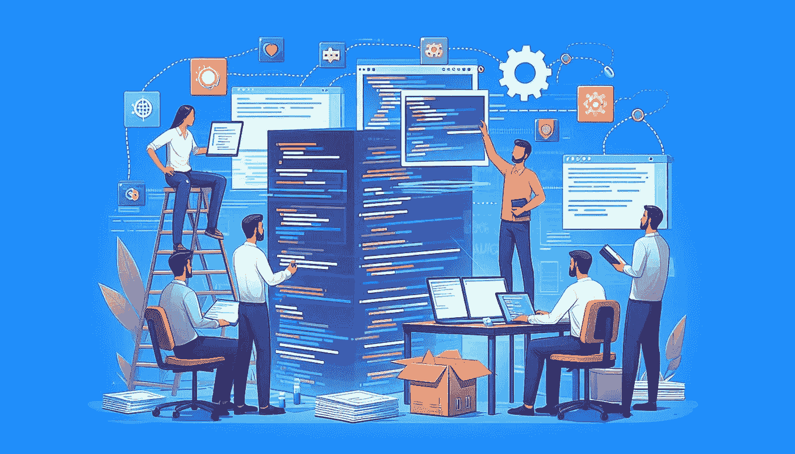

# 我从 2024 年构建 LLM 应用中学到了什么？——第一部分

> 原文：[`towardsdatascience.com/what-did-i-learn-from-building-llm-applications-in-2024-part-1-d299b638773b?source=collection_archive---------1-----------------------#2024-11-04`](https://towardsdatascience.com/what-did-i-learn-from-building-llm-applications-in-2024-part-1-d299b638773b?source=collection_archive---------1-----------------------#2024-11-04)

## 一位工程师构建 LLM 原生应用的历程

 [Satwiki De](https://medium.com/@cleancoder?source=post_page---byline--d299b638773b--------------------------------)

·发表于[Towards Data Science](https://towardsdatascience.com/?source=post_page---byline--d299b638773b--------------------------------) ·阅读时间：7 分钟·2024 年 11 月 4 日

--

大型语言模型（LLM）正在迅速改变我们对人工智能的理解，并且通过将 LLM 与 Web 应用结合的创新设计，已经显现出显著的变化。自 2022 年底以来，多个框架、SDK 和工具相继推出，展示了将 LLM 与 Web 应用或商业工具集成的简单原型。随着大量投资流入基于生成性 AI 的商业应用和工具，逐渐将这些原型推向生产阶段并创造商业价值变得至关重要。如果你打算投入时间和金钱来构建一个 LLM 原生工具，如何确保这笔投资能够在长期内获得回报？

为了实现这一目标，必须建立一套开发 LLM 应用的最佳实践。我在过去一年中开发 LLM 应用的经历非常激动人心，充满了学习的机会。凭借近十年的 Web 和云原生应用设计与构建经验，我意识到传统的产品开发规范往往无法满足 LLM 原生应用的需求。相反，持续的研究、实验和评估循环在创建优秀的 AI 驱动产品方面更为有效。

为了帮助你应对 LLM 应用开发中的挑战，我将在以下关键领域讨论最佳实践——*使用案例选择、团队心态、开发方法、负责任的 AI 和成本管理*。

# 创意生成：选择合适的使用案例

每个问题都需要 AI 来解决吗？答案是否定的。相反，你应该问自己，哪个业务场景最能从利用 LLM 中受益？企业在开始构建应用程序之前需要问这些问题。有时候，合适的用例就在我们面前，其他时候，与同事交谈或在组织内进行研究可能会引导你找到正确的方向。以下是一些可能帮助你做出决定的方面。

1.  **提议的解决方案有市场需求吗？** 对提议的用例进行市场调研，了解当前的市场情况。识别任何现有的解决方案，无论是否集成了 AI，分析它们的优缺点，以及你的 LLM 应用可以填补的空白。这涉及对竞争对手、行业趋势和客户反馈的分析。

1.  **它是否帮助了用户？** 如果你提议的解决方案旨在服务于组织内部的用户，一种常见的衡量用户期望的方式是检查该解决方案是否能够通过节省时间提高他们的生产力。一个常见的例子是 IT 或 HR 支持的聊天机器人，帮助员工解决关于组织日常问题的查询。此外，进行一项简短的调查，了解潜在用户的痛点，也有助于理解可以通过 AI 来解决的问题。

1.  **它是否加速了业务流程？** 另一类用例可能是解决业务流程改进，间接影响用户。例如包括对呼叫中心转录的情感分析、生成个性化推荐、总结法律和金融文档等。对于这种类型的用例，实现自动化可以成为将大语言模型（LLM）融入常规业务流程的关键因素。

1.  **我们有可用的数据吗？** 大多数基于 LLM 的应用程序使用 RAG（检索增强生成）原则，从特定的知识文档中生成有上下文且有根据的答案。任何基于 RAG 的解决方案的核心在于数据的可用性、类型和质量。如果你没有足够的知识库或高质量的数据，你的解决方案的最终结果可能无法达到预期。数据的可访问性也很重要，因为机密或敏感数据可能并不总是触手可得。

1.  **提议的解决方案可行吗？** 是否实施 AI 解决方案不仅取决于技术可行性，还涉及伦理、法律和财务等方面。如果涉及敏感数据，则在最终确定用例之前，还应考虑隐私和法规遵从性。

1.  **解决方案符合你的业务需求吗？** 思考你的 AI 解决方案可以服务的短期和长期业务目标。管理期望值也是至关重要的，因为过于雄心勃勃的短期目标可能不会有助于实现价值。从 AI 应用中获取收益通常是一个长期过程。

## 设置正确的期望值

在选择用例的同时，产品负责人还应考虑设定正确的期望值以及为团队设定短期且可达成的里程碑。每个里程碑应有明确的目标和时间表，并且得到团队的定义和一致同意，这样利益相关者才能定期审查结果。这对于做出有关如何推进所提议的基于 LLM 的解决方案、生产化策略、用户引导等方面的明智决策至关重要。

# 实验：采用正确的‘心态’

研究和实验是任何涉及 AI 的工作核心。构建 LLM 应用程序也不例外。与传统的 Web 应用程序不同，后者遵循一个预先决定的设计，变化极少或没有变化，而基于 AI 的设计则高度依赖实验，并且可能根据早期的结果发生变化。成功的关键在于在明确预期的基础上进行迭代实验，之后不断评估每次迭代的结果。在 LLM 原生开发中，成功标准通常是输出的质量，这意味着重点在于生成准确且高度相关的结果。这些结果可以是聊天机器人的回复、文本摘要、图像生成，甚至是 LLM 定义的一个动作（Agentic 方法）。要始终如一地生成高质量的结果，需要对底层语言模型有深入的理解，不断微调提示词，并进行严格的评估，以确保应用程序符合期望标准。

## 团队需要什么样的技术技能组合？

你可能会认为只有少数数据科学家的团队就足以为你构建一个 LLM 应用程序。但实际上，工程技能同样重要，甚至更为关键，因为 LLM 应用程序并不遵循传统的机器学习方法。无论是数据科学家还是软件工程师，都需要改变一些心态，以熟悉开发方法。我见过这两个角色都经历了这样的过程，例如，数据科学家开始熟悉云基础设施和应用程序部署，而工程师则开始了解模型使用的复杂性以及评估 LLM 输出的方式。最终，你需要团队中有*AI 从业者*，他们不仅仅是来‘编程’的，而是来研究、协作并改进 AI 的适用性。

## 既然我们要使用预训练的语言模型，真的需要‘实验’吗？

像 GPT-4o 这样流行的 LLM 已经在大量数据集上进行了训练，能够识别和生成文本、图像等，因此你无需“训练”这些类型的模型。很少有场景需要微调模型，但这也可以轻松实现，无需传统的机器学习方法。然而，我们不要将“实验”一词与用于预测性机器学习中的“模型训练”方法混淆。正如我在上面提到的，应用程序输出的质量很重要。设置实验迭代可以帮助我们达到目标质量。例如——如果你正在构建一个聊天机器人，并且你希望控制机器人的输出如何呈现给最终用户，那么通过在提示改进和超参数微调上的迭代和实验性方法，将帮助你找到生成最准确、一致输出的正确方法。

## 在项目初期尽早构建原型。

尽早构建一个只包含核心功能的原型（也称为最小可行产品 MVP），理想情况下是在 2-4 周内。如果你正在使用知识库进行 RAG 方法，使用数据子集来避免过多的数据预处理。

+   从目标用户子集获取快速反馈，帮助你了解解决方案是否满足他们的期望。

+   与利益相关者进行审查，不仅要展示好的结果，还要讨论团队在原型构建过程中发现的局限性和约束条件。这对于尽早减轻风险至关重要，也有助于在交付决策时做出知情判断。

+   团队可以最终确定技术栈、安全性和可扩展性要求，以便将原型转化为完全功能的产品并确定交付时间表。

## 确定你的原型是否已经准备好转变为“产品”。

多个以 AI 为重点的样本的可用性使得创建原型变得非常容易，且这些原型的初步测试通常会提供有前景的结果。当原型准备好时，团队可能会对成功标准、市场调研、目标用户群体、平台需求等有更深入的了解。在这一点上，考虑以下问题可以帮助决定产品发展的方向：

1.  原型中开发的功能是否满足最终用户或业务流程的主要需求？

1.  团队在原型开发过程中遇到了哪些挑战，这些挑战在生产过程中可能会再次出现？是否有方法可以减轻这些风险？

1.  原型是否存在违反负责任 AI 原则的风险？如果是，那么可以实施哪些保护措施来避免这些风险？ (*我们将在第二部分进一步讨论此点*)

1.  如果解决方案需要集成到现有产品中，可能会遇到哪些阻碍？

1.  如果解决方案涉及敏感数据，是否已经采取了有效的措施来处理数据隐私和安全问题？

1.  你是否需要为产品定义任何性能要求？原型结果在这一方面是否有前景，或者还能进一步改进？

1.  你的产品需要哪些安全要求？

1.  你的产品需要任何 UI 吗？（一个常见的基于 LLM 的用例是聊天机器人，因此 UI 需求需要尽早定义）

1.  你是否有关于 MVP 中 LLM 使用的成本估算？考虑到生产环境中的预计使用规模和你的预算，它看起来如何？

如果在初步审查后，你能对大多数问题得到令人满意的回答，并且你的原型有良好的结果，那么你可以继续进行产品开发。

敬请期待第二部分，我将在其中讨论***你应该采取什么样的产品开发方法，如何在产品中早期实现负责任的人工智能以及成本管理技巧。***

*如果你想阅读更多关于新兴和令人兴奋的技术的内容，请关注我。如果你有任何反馈，请留下评论。谢谢 :)*
