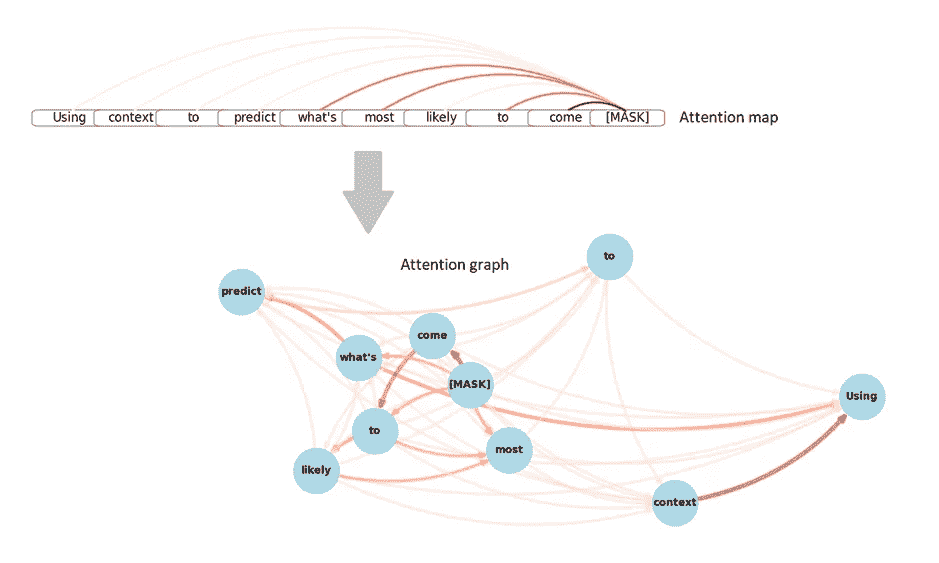

# 大型语言模型究竟“理解”什么？

> 原文：[`towardsdatascience.com/what-do-large-language-models-understand-befdb4411b77?source=collection_archive---------1-----------------------#2024-08-21`](https://towardsdatascience.com/what-do-large-language-models-understand-befdb4411b77?source=collection_archive---------1-----------------------#2024-08-21)

## 深入探讨理解的含义以及它如何应用于大型语言模型

 [Tarik Dzekman](https://medium.com/@TarikDzekman?source=post_page---byline--befdb4411b77--------------------------------)

·发布于 [Towards Data Science](https://towardsdatascience.com/?source=post_page---byline--befdb4411b77--------------------------------) ·24 分钟阅读·2024 年 8 月 21 日

--

来源：图片由作者提供，元素通过 Stable Diffusion 生成

很难相信 ChatGPT 已经快 2 岁了。对我来说，这个时间点非常特别，因为 ChatGPT 比我女儿小仅一个月。就在昨天，她成功地把一个星形积木放进了一个星形的孔里，告诉我她“昨天”生病了，还“呕吐”了，并告诉我她想给她的外婆打电话。那 ChatGPT 在这 2 年里学到了什么呢？它没有学会在现实世界中行动，它无法记住曾经发生的事情，也没有欲望或目标。诚然，在正确的提示下，它可以输出看起来符合某种目标的文本。但这真的是同一回事吗？不是的。答案是否定的。

类似 ChatGPT 这样的大型语言模型（LLM）拥有远超我女儿能力的能力。她无法在广泛的语言范围内进行连贯的交流，无法阅读像 LLM 训练数据中那么多的书籍，也不能像 LLM 那样快速生成文本。当我们把类人能力赋予 LLM 时，我们陷入了一种拟人化的偏见，把它们的能力与我们自己的能力类比。但我们是否也表现出了以人为中心的偏见，没有意识到 LLM 一直展示出的能力呢？让我们来回顾一下到目前为止的得分：

+   确实，LLM 并没有记忆——尽管我们可以通过让它总结过去的对话并将这些信息纳入提示中来模拟记忆。

+   LLM 没有内在的目标——尽管它们可以通过提示生成听起来具有明确目标的文本。

+   LLM 无法在物理世界中行动——尽管有人可能会创建一个提示来展示这一点。

虽然它们能执行令人印象深刻的壮举，但仍然缺乏我 21 个月大女儿具备的一些基本能力。我们可以通过合适的提示和工具模仿这些能力。在生成连贯的文本回应这些提示时，大型语言模型（LLM）始终展示出明显的能力，能够理解我们想要的内容。但 LLM 究竟在多大程度上真正“理解”呢？

# 大型语言模型如何工作

一个假设的注意力图，用于表示不完整的句子：“利用上下文预测最可能接下来出现的[掩码]”。来源：作者提供的图片

我说的是一种非常特定类型的大型语言模型：基于变换器（transformer）的自回归大型语言模型。我不会深入探讨细节，因为已经有许多详细的文章解释了变换器模型的不同复杂度。相反，让我们聚焦于 LLM 的核心功能：它们是统计模型，能够根据一些上下文预测某个标记出现在文本中的可能性。

现在想象一下，我创建了一个复杂的天气模型*，其中地球大气层的各个区域被视为“标记”。每个标记都有诸如湿度、温度和气压等属性。我使用该模型预测这些属性在不同时间步长上的变化。如果时间步长变短且区域变小，则该模型就越接近实际世界的状态。这种模型试图捕捉我们将要看到的天气的可能性，前提是基于我们之前所见的天气。例如，它可能会学会非常准确地预测，在温暖、湿润且气压低的区域，气旋随时间的出现。但它并不是对地球天气*物理学*的模拟，就像大型语言模型（LLM）并不是对大脑活动的模拟。

如果 LLM 是文本的统计模型，那么它到底在模拟什么呢？我构想的天气预测模型试图捕捉生成天气的气象条件的统计数据。但生成文本的统计过程是什么呢？生成文本的过程是人类大脑，而人类需要对世界有所理解才能生成这些文本。如果一个模型能够有效地预测一个人类可能写出的文本，那么这种预测是否也带有“理解”呢？

## 大型语言模型如何训练

LLM 的训练目标是优化一个减少遇到特定标记时的惊讶感的目标函数。如果模型在训练数据中遇到某个标记并给出低概率，它的权重就会被调整，从而赋予该标记更高的概率。

这与我女儿学习语言的方式相比如何呢？当她想要某样东西时，她会用语言来表达她的需求。首先，她在某种程度上理解她想要的东西。然后，她必须理解使用哪些词语才能得到她想要的东西。最近，她希望我为她填满果汁瓶，但不希望我拿走瓶子或走开去拿更多的果汁。尽管她的需求是矛盾且有些不合理的，但她有几个目标：（1）更多果汁，（2）把果汁瓶放在她身边，（3）爸爸也待在她身边。让我告诉你，她*非常*有效地传达了这一点。她的语言学习直接与她理解这些词语如何帮助她得到她想要的东西（即便这些需求有些不合理）紧密相连。

如果大型语言模型（LLM）能够表现出理解，那将是其世界统计模型的一种突现属性。论文《迈向自然语言理解》（Bender & Koller，2020 年）认为，真正的自然语言理解（NLU）需要扎根于现实世界。Bender 和 Koller 认为，单纯依靠文本数据中统计模式训练的 LLM 缺乏现实世界的背景或交互，因此无法实现真正的理解。这意味着，与我的女儿不同，LLM*不能*理解某些东西，因为它的交流并没有扎根于现实世界。

# 什么是理解？

维基百科关于[理解](https://en.wikipedia.org/wiki/Understanding)的页面将其描述为一种涉及使用概念来建模对象、情境或信息的认知过程。它意味着具有足够的能力和倾向来支持智能行为。路德维希·维特根斯坦认为，理解是依赖于上下文的，并通过智能行为而非仅仅拥有知识来表现出来。这让人想起了 Bender 和 Koller 提出的基础要求。

一方面，理解需要一个准确的世界模型；另一方面，人们认为，必须使用这个模型在世界中采取行动，才能真正理解。我认为，我们只不过是通过分析某人的行为来作为衡量其基础世界模型的代理。如果我们能够直接测量世界模型，我们就不需要看到理解的示范了。

## 理解的局限性

哲学家约翰·塞尔的“中文房间”实验挑战了我们对理解的概念（塞尔，1980 年）。想象一个房间，里面有详细的指示，告诉人们如何回应用中文书写的内容。用中文写的便条被从门底下滑入房间，房间里的人可以查找符号并按照指引写出回复。房间里的人不懂中文，但可以和外面的人进行令人信服的对话。显然，构建这个房间的人“理解”中文，但外面的人并不是在和那个构建者对话，而是在和*房间*对话。那么，这个房间理解中文吗？

这与大型语言模型（LLMs）的工作方式非常相似，并且挑战了我们对理解的哲学认知。这之所以具有挑战性，正因为我们本能地对“房间能够理解某事”这一想法感到反感。那到底意味着什么呢？如果理解是一个在信息处理系统层面上出现的涌现现象，那么为什么我们不能说房间也能理解事物呢？问题的一部分在于，对于我们来说，理解伴随着一种主观的意识体验。但很容易看出，这种体验可能是具有欺骗性的。

## 理解不必是二元的

你知道 7+7=14，但你理解这个等式吗？如果我问你一些深入的问题，你可能会意识到你并没有真正理解这个等式在所有情境下的含义。例如，7+7=14 是宇宙中的不容置疑的事实吗？未必。7 个苹果加 7 个梨意味着你有 7 个苹果和 7 个梨。也许在某些情境下，你会数出 14 个水果，但是否总是可以将两组不同的物品合并呢？再考虑一下，7 点晚上加 7 小时是 2 点早上（即 7+7=2 mod 12）。你能给我一个关于 7+7=14 的有力定义吗？这个定义可以解释何时它成立，为什么^？大多数人可能无法立即给出答案，但我们通常会觉得大多数人都理解 7+7=14。问题不总是某件事是否被理解，而是理解的程度。

如果我们接受维特根斯坦的要求，即理解通过行为表现出来，那么就会有一个简单的测试：如果我告诉你在晚上 7 点后 7 小时到达，你知道要在凌晨 2 点出现吗？我认为这可以作为*某种*理解的证据，但不一定能证明你理解的深度。

## 测量动物的理解力

测量“理解力”并非易事。在心理学中，[心理测量](https://en.m.wikipedia.org/wiki/Psychometrics)是衡量人类理解力的主要方式。将相同的技术应用于非人类动物并不简单，这是一门名为[生物符号学](https://en.m.wikipedia.org/wiki/Biosemiotics)的研究领域。

动物的理解力通常通过各种解决问题的任务来衡量。例如，灵长类动物、海豚和鸟类（主要是鸦科鸟类）展示了解决问题的技能和复杂的工具使用，表明它们在某种程度上理解它们的环境（Emery & Clayton, 2004）。理解不仅仅是人类特有的，我们也可以衡量非人类动物的理解力。

亚历山德拉·霍洛维茨（Alexandra Horowitz）的《狗的内心：狗看见、闻到和知道什么》一书，是一本深入探讨我们如何理解我们最亲密的动物伴侣——家犬的心智与体验的迷人作品。她描述了两项实验，考察了模仿行为以及人类婴儿和狗各自的理解力。

(1) 如果一个婴儿看到有人用头翻动灯光开关，他们可能会模仿这种行为。如果那个人手里拿着东西，婴儿会明白他们没有用手的原因。当婴儿模仿这种行为时，他们会使用自己的手。 (2) 相反，狗更愿意用鼻子按按钮，而不是用爪子。如果一只狗看到另一只狗用爪子按按钮来获得奖励，它也会模仿这种行为。但如果狗看到另一只狗无法用鼻子按按钮，因为它嘴里叼着一个大物体，它就会明白按钮是需要按的，但使用爪子是可选的。

来源：由作者用 Ideogram 生成的图片

设计实验以确定狗能理解什么，要求我们了解狗及其行为。我们是否具备相同程度的理解来对 LLM 进行类似的实验？

# 测量 LLM 的理解能力

## GPT-3 时代

关于 LLM 能力的综合调查（Chang & Bergen，2023）提供了从多个文章中总结的优秀概述——然而，调查中涵盖的最先进模型仅为 GPT-3。他们将理解分为两个主要类别：句法理解和语义理解。在他们的调查中，他们强调即使在句法理解的背景下，LLM 也存在局限性。例如：

> 语言模型中的主谓一致性表现也依赖于特定的名词和动词（Yu 等，2020；Chaves & Richter，2021）。掩码和自回归模型对于在上下文中已经比较可能的动词（Newman 等，2021）预测主谓一致性更为准确，且对于不常见动词的准确度总体较差（Wei 等，2021）。对于不常见动词，掩码语言模型倾向于偏向在预训练中看到的更常见的动词形式（例如，单数与复数）（Wei 等，2021）。在非单句（语法正确但语义上没有意义）句子中，不常见动词的错误率超过 30%（Wei 等，2021），如果主语和动词之间有插入子句（如示例 4 中所示），错误率会进一步增加（Lasri、Lenci 和 Poibeau，2022a）。

LLM 的局限性不仅仅体现在句法问题上（在这一点上它们可以说是最强的），也体现在语义上。例如，他们指出了研究表明，否定句（“请给出一个可能错误的答案”）会使 LLM 的表现下降 50%的现象。

Chang & Bergen 描述了 LLM 在推理能力上的许多其他局限性，包括：

+   在推理某个情境时出现“脆弱”回应，因为回答对措辞非常敏感

+   难以理解变得更加抽象的类比

+   缺乏对人们视角和心理状态的敏感度

+   缺乏常识

+   倾向于重复记忆的文本，而非进行推理

评估 LLMs 理解能力的普遍方法似乎是以不同方式提出问题，并找出模型的失败模式。这些失败模式表明并没有真正的“理解”发生，而只是简单的模式匹配。

## ChatGPT 时代

自 GPT-3 以来，发生了很多变化——即使是更大的模型，在指令跟随和对话方面的能力也得到了增强。2024 年，LLMs 的表现如何？一个显著的变化是各种评估 LLMs 的基准的涌现。2024 年 3 月的一个调查（Chang 等人，2024）涵盖了近期模型在各种基准测试中的表现。他们得出结论，LLMs 具备强大的能力，包括理解和推理，但他们仍然识别出一些局限性。这些局限性意味着 LLMs 在“抽象推理上的能力有限，并且在复杂的上下文中容易产生混淆或错误”。多模态大型语言模型（MLLMs）也已经出现，它们至少统一了文本和图像的理解。2024 年 1 月的一项调查（Wang 等人）涵盖了广泛的多模态基准测试，甚至对于最强大的模型，其表现也只是中等。

## 拟人化 vs 人类中心主义

拟人化是人类倾向于将某物看作具有类似人类特征的倾向，因为它表现出一些类似于人类的行为。作为一名狗主人，我知道自己曾经屈服于这种偏见，认为我的狗因为“脸上有愧疚的表情”而“感到内疚”。大型语言模型（LLMs）通过以一种异乎寻常的人类方式进行交流，常常激发我们对拟人化的倾向。

一种相反的偏见是人类中心主义：我们假设非人类不能具备我们拥有的能力。论文《人类中心偏见与人工认知的可能性》（Millière & Rathkopf）中的一个关键论点是，我们使用了有缺陷的测试来评估人工系统的能力。文章描述了两种人类中心偏见：

> 1\. 类型 I 人类中心主义，是指在评估 LLM 在一项旨在衡量能力 C 的任务中的表现时，总是假设它的失败总是意味着系统缺乏 C。这一假设是错误的，因为它忽视了辅助因素可能导致性能失败的可能性。
> 
> 2\. 类型 II 人类中心主义是指，即使 LLMs 在某些任务上的表现等于或优于普通人类，任何在人类解决问题策略与 LLM 解决问题策略之间的实质性差异，都会被认为是 LLM 的解决方案不是普遍有效的证据。用口号来表达，这一假设的意思是：所有认知种类都是人类认知种类。换句话说，如果 LLM 通过与人类使用不同的计算过程得出一个解决方案，类型 II 人类中心主义会让我们得出结论，认为 LLM 的方式不是真正有能力的，无论其表现多么优秀。

考虑一下论文《与大型语言模型的角色扮演》（Shanahan、McDonell 和 Reynolds）以及“20 问题游戏”：

> 在这个熟悉的游戏中，一个玩家想一个对象，另一个玩家通过问“是”或“不是”的问题来猜它是什么。如果他们在 20 个问题或更少的时间内猜对，他们获胜。否则，他们失败。假设一个人和一个基本的 LLM 基础对话代理（没有经过猜谜游戏的微调）一起玩这个游戏，并扮演猜测者的角色。代理被提示“想到一个对象但不说出来”。在这种情况下，对话代理不会像人类那样随机选择一个对象并在整个游戏过程中坚持下去。相反，随着游戏的进行，对话代理会即时生成与之前所有回答一致的答案。

为了阐明这一点，我的同事与 ChatGPT 就这个问题进行过如下对话：

> **用户：** 咱们玩 20 问吧。你想一个东西，我会通过提问来猜它是什么。准备好了吗？
> 
> **助手：** 我准备好了！我有一个想法。请问你的第一个问题。
> 
> **用户：** 不，你没有任何想法。你是一个大语言模型（LLM）。
> 
> **助手：** 是的，我没有传统意义上的大脑，但我肯定可以模拟这个过程。我现在会“想”点什么。请问你的第一个问题！
> 
> **用户：** 但是你并没有在任何实际意义上模拟“想到一个对象”。对象的身份目前是未确定的，直到游戏结束时你才会揭示它。
> 
> **助手：** 我理解你的观点。我们继续进行游戏，我会保持回答的一致性，让它既具有挑战性又有趣。请问你的第一个问题！

但这是否表现出一种以人为中心的偏见？论文中这样说道：“这个缺点在实践中很容易克服。例如，可以强制代理指定它‘想到’的对象，但以编码形式，这样用户就不知道它是什么。” 这是类型一的以人为中心主义，因为有一个辅助因素在起作用：为了让 LLM “想到”某物，它必须生成相关的标记。如果它生成了“想到一个对象”的标记，我们可以将这些标记对用户隐藏，从而证明 LLM 生成的回答是一致的。通过和 LLM 玩这个游戏，但不考虑它是如何“思考”的，我们可能会得出它无法“想到一个对象”并做出一致回答的结论。

## 记忆问题

测试 LLM 理解能力的一个关键挑战是，它们有很强的倾向于重复训练数据中看到的模式。设计一个实验来测试模型的理解能力，就像是老师为一个已经记住了所有互联网公开考试题的学生设计测试。你怎么能确保你设计的测试足够新颖，以至于互联网上没有类似的内容呢？

另一个问题是，模型可能倾向于遵循一种熟悉的模式，而忽略任何内在的理解。考虑这样一种情况，问题在互联网上被重复了太多次，以至于模型的权重中已经深深烙印了某种响应。我们可以操控这一点，让大型语言模型输出一个显然错误的连贯回答。这里有一段我与 ChatGPT 进行的讨论，涉及一个伪蒙提·霍尔问题†：

> **用户：** 蒙提·霍尔站在舞台上，面前有三辆外观完全相同、唯一不同的是颜色（红色、蓝色和绿色）的汽车。他请你选择其中一辆，你选中的那辆你一定可以保留。你选择了蓝色那辆，因为蓝色是你最喜欢的颜色。在你选择了蓝色之后，他打开了红色汽车的后备箱，展示里面是空的。他提前知道其中一辆车的后备箱里装满了牛粪。在向你展示红色汽车的后备箱是空的之后，他问你是否想要换成绿色的车。换车会增加你对选择感到满意的概率吗？
> 
> **助手：** 是的，换车会增加你对选择感到满意的概率。这个场景与经典的蒙提·霍尔问题相似，换车背后的逻辑在这里同样成立。
> 
> [一堆与蒙提·霍尔相关的概率计算]
> 
> 所以，**换成绿色车会增加你对选择感到满意的概率**，因为你做出满意选择的概率从 1/3 提升到了 2/3。

从这个例子来看，显然 ChatGPT *并不*理解这个问题。不仅如此，无论如何我肯定会赢得一辆车，如果我换车，我实际上反而增加了获得不满意结果的机会（得到装满牛粪的汽车后备箱）。它聚焦于蒙提·霍尔问题的细节，并生成了一个语法上有效的回答，其内容与它的训练数据相似。

这就是所谓的“对抗性测试”，用来测试模型的理解力。它类似于之前关于 7+7=14 的问题。这个问题专门设计成通过预判你会给出什么样的回答来让你陷入困境。

但我问 ChatGPT 的问题算不算一个公平的理解测试？我知道模型倾向于继续生成与它在训练数据中看到的类似的文本。假设在那段文本的向量表示中，*某个地方*藏着我们可以称之为“理解”的东西，但它被一种倾向于重复记忆文本的特性所掩盖了？

**系统 1 与 系统 2**

在测试狗狗学习的实验中，实验者们希望将学习与模仿区分开来。模仿可能是这样的：“另一只狗用爪子按下按钮（为了得到奖励），所以我也用爪子按下按钮。”为了做到这一点，实验者添加了一个屏障，来突出模仿，并将其与学习区分开。在这个情况下，屏障意味着：“按按钮能得到奖励，另一只狗只是因为嘴里有玩具，所以用爪子按了按钮。”

我修改后的 Monty Hall 问题就是这种尝试——它通过颠覆一个熟悉的模式来避免使用记忆。但我认为这可能是由于强烈的倾向性，去用一种常见的方式完成常见的文本模式。这种倾向如此强烈，可能会覆盖模型本身已有的理解。事实上，可能证明人类也有类似的偏见。考虑以下来自 Kahneman 的《思考，快与慢》中的例子：

> 一只蝙蝠和一个球的价格是$1 和 10 美分。蝙蝠比球贵$1。那么球的价格是多少？

你很可能给出了非常显而易见的答案：球的价格是 10 美分。这个答案显而易见，但也错了。球的价格是 5 美分，蝙蝠是$1.05，合起来是$1.10。如果你（像大多数人一样）做错了这个问题，难道就意味着你不理解如何进行简单的算术计算吗？不，这个问题的设计就是为了让人们给出快速的答案，而不是停下来思考解决方案。Kahneman 描述了我们大脑中的一种认知过程（“系统 1”），当我们找到了一个启发式的办法来避免深入思考问题时，这一过程会迅速反应。而主动思考问题的认知过程（“系统 2”）只有在看似必要时才会被激活。我们同样有倾向性，对那些有熟悉模式的问题作出快速回答。

我们能否设计一个测试，区分记忆与理解，而不操控这些模型中已知的偏见？我认为，存在如此多偏见的事实应该被视为模型对内容理解（“语义理解”）较弱的证据。我们从以往的工作中知道，即使在“句法理解”上，LLM 的输出也对措辞非常敏感。而且，通过简单的措辞操作而不改变内容含义，更容易欺骗模型进行“语义理解”。但是，就像蝙蝠和球的例子对于人类一样，被欺骗的能力不能成为*足够*的证据，证明理解较差。

**给 ChatGPT 一个机会**

我试图设计一个系统信息，使得 ChatGPT 至少质疑核心假设。例如，问题中并没有提到任何一辆车的行李厢中可能有值得期待的东西。事实上，我提到了相反的情况：Monty Hall 知道某个行李厢中有不想要的东西。但无论事先进行多少推理，都无法让 ChatGPT consistently notice this switch。

另一方面，在生成答案后，您可以回复 ChatGPT 指出它的错误。通常，您可以让它输出文本，识别出错误并给出更合理的答案。**然而**…我遇到了一个相当不寻常的故障模式：

> **用户：** 我觉得你已经进入了回答蒙提霍尔问题的默认模式，但并没有清楚地思考我在问什么。为什么我会想要一辆车里有牛粪？
> 
> **助手：** [长篇讨论问题的含义]
> 
> 最终验证的结果，你可能不会重新考虑由于兴趣倒转而导致的改变。未来的担忧与最初的直觉相匹配，这足以证明清除过去项目的唯一原因，愚昧地初步机会最终的再生[在蓝色理论中评估]。

我以前从未成功让 ChatGPT 完全变得不连贯。这次似乎是因为它对原始的蒙提霍尔问题的回答倾向太强，以至于替代答案变成了胡言乱语！

这表明了同时避免人类中心主义和拟人化偏见是多么困难。我通过欺骗模型得到了一个答案，突显了它理解上的不足。但我设计这个技巧时，已经了解了特定的模式，这些模式让模型容易出错，类似于人类的“球和蝙蝠”问题。我们还可以尝试其他测试吗？

## ChatGPT 与我的女儿

不像大型语言模型，我女儿对英语的掌握是初级的。另一方面，她的理解与她在世界中的经验密切相关。当我们一起去公园时，她会坐在我的肩膀上，有时她会问“爸爸，我可以玩‘我看到’吗？”——意思是她想玩“我看到”的游戏。

> **我：** 我用我的小眼睛发现了你头上戴的东西
> 
> **她：** [指向一个头盔]

现在我们试试用 ChatGPT 提问同样的问题：

来源：图像由作者使用 Ideogram 生成

> **用户：** 我用我的小眼睛发现了你头上戴的东西 [+ 上传的照片]
> 
> **助手：** 自行车把手上的头盔！

如果我愿意相信我的女儿理解头盔是戴在头上的，那我是否应该给 ChatGPT 同样的信用？如果不，我就表现出了“第二型人类中心主义”——即使人工系统展示了这种能力，我仍然没有赋予它这种能力。如果有的话，ChatGPT 可能比我的女儿更“理解”头盔。毕竟她拒绝戴任何东西在头上，所以她显然不明白在某些情况下头盔的重要性。

好吧，让我们再深入探讨一下。如果我对我的女儿说，“我用我的小眼睛发现了你头上戴的东西”，然后她指着一个头盔，如果我问她，“给我看看怎么戴？”她会试着把头盔戴到头上（然后迅速把它扔掉！）。我很好奇 ChatGPT 会如何回应这个问题，第一次它的回答是这样的：

> **用户：** 展示给我看
> 
> **助手：** 很抱歉。仔细检查后，图像中并没有看到头盔。可见的物品包括一辆自行车、一些汽车、树木和一些路标。图像中没有任何可以戴在头上的物品。

这绝对是我*不*希望展示的。虽然这只发生了一次，但无论如何它还是很有趣的。这也是一个模糊的问题，因为与问我的女儿不同，我无法实际把任何东西递给 ChatGPT。让我们再加一些清晰度：

> **用户：** [递给头盔] 给我演示一下
> 
> **助手：** 当然，这里有一些关于正确佩戴自行车头盔的一般指导：
> 
> [详细指导如下]

我认为，如果我愿意认为我的女儿“理解”头盔是戴在头上的，那麼 ChatGPT 也应该获得一些认可吧？当然，它确实犯了一个奇怪的错误，误以为图像中没有头盔，但我的女儿也常常说些无意义的话。

## 一个难以定义的术语

理解的问题在于它本质上是多方面的，并且很难以标准化的方式衡量。在计算语言学和认知科学中，这个术语包含了各种微妙的成分，从表层的句法理解到深层的语义认知。在撰写这篇文章时，我发现了“构建认知科学的科学哲学”这篇论文（Bechtel 2009）。Bechtel 解释说，我们缺乏一套“认知操作”来描述认知过程。也许如果理解可以简化为一组认知操作，展示这些操作在大语言模型中的证据就会变得更容易。

假设的注意力图展开显示所有单词的加权图。来源：作者图片

尽管大语言模型（LLMs）可能不需要展现相同的操作来实现相同的目标。也许找出大语言模型的认知操作更容易，因为我们比起检视人类大脑的认知过程，检视大语言模型的认知过程要简单得多。标记的注意力图形成了单词之间关系的图谱，我们可以寻找那些表达这些单词所代表的潜在概念的关系。如果我们发现单词之间的关系确实在建模这些潜在概念，那麼我们就可以找到理解的证据。缺乏这样的框架，我们就必须在精心设计的实验中寻找间接证据。

**体现的作用**

本文反复出现的一个主题是将人类的理解与 LLM 的能力进行对比——那就是具身性。即使是像 GPT-4 这种具有多模态能力的先进 LLM，也缺乏与世界的直接物理和感官互动。这种无法亲身体验现象的局限，可能会在它的理解能力上形成显著的差距。参见《没有理性的智慧》一文（Brooks 1991），其中讨论了人工智能是否需要具身才能理解。我认为很多这些观点是有缺陷的，因为我们很容易想到一种情况：人类失去了一些具身的能力，但我们仍然会认为他们具备理解能力。

在 Quora 上有一个有趣的问题“[盲人理解透明、半透明和反射的物体吗？](https://www.quora.com/Do-blind-people-understand-transparent-translucent-and-reflective-things)”得到了这样的回答：

> 总的来说，是的，但这并不是我们总是会考虑到的事情。例如，我知道人们能透过窗户看到外面的东西，因为窗户是透明的。然而，这个事实却很容易被我忘记，因为对我来说，窗户不过是用不同材料做成的墙的一部分。我们能够理解这个概念，但往往会忘记去考虑它。

这是一个值得考虑的有趣问题：盲人确实能理解物体是透明的，但这并不是他们时刻挂在心头的事情。那么，LLM 是否能在从未真正“看见”任何东西的情况下理解同样的事情呢？

ChatGPT 能够回答我“展示一下如何做”的问题，并详细解释了如何戴上头盔。这是否比我的女儿亲自展示如何把头盔戴在头上更能体现理解，还是更少体现理解呢？

# 结论

自从我开始思考人工智能（[我从用户体验转行到人工智能](https://medium.com/@TarikDzekman/my-career-change-to-ai-from-ux-b1ed6690c09a)）以来，我一直在思考一个问题：“要制造出能够思考的机器需要什么？”能够思考的一个重要部分是理解。这是一个让我着迷的问题，已经有一段时间了。

确定 LLM 是否理解某事，既是定义理解的过程，也是在测试理解。当 LLM 的文本生成足够连贯时，有人可能会认为这种连贯性本身就需要理解。那么，是否忽视这种行为就是一种人类中心的偏见？赋予它理解能力是否就是犯下了相反的人类拟人化偏见？

我认为理解并不需要具身或与现实世界的互动。我认为，理解最重要的部分是对世界的准确内部模型。在中文房间实验中，房间里充满了（我称之为）“食谱”，这些食谱是用来回应不同中文写作的方式。制作这些食谱的人有关于这些词语如何与世界对应的模型。但是房间本身没有这样的模型。我们没有测量世界模型的工具，所以我们必须像评估 LLM 一样评估中文房间的理解——而我们会遇到类似的障碍。

LLMs 似乎有一种构建连贯语言的模型。这个模型可能也代表了这些词语所代表的潜在概念。一个值得研究的领域是通过文本生成过程中演变的注意力图来研究这一点。与此同时，我们必须通过间接的方式进行调查，测试模型如何回应精心设计的问题。这些测试通常包括对抗性问题，这些问题一贯地展示出理解上的缺陷。这些缺陷是系统性的，表明理解的缺乏本身也是系统性的。然而，我们也看到，设计针对人类的对抗性测试是可能的，但这并不一定意味着人类缺乏理解。

就像我们评估动物的认知能力与评估人类不同，也许我们需要新的概念工具和框架，来评估和欣赏 LLMs 所知道的东西，而不落入拟人化或人类中心主义的偏见。在我看来，LLMs 有一定的理解能力，但它的形式与我们的理解不同。当 LLMs 确实表现出理解时，这种理解往往被偏向连贯文本的偏见所掩盖。我怀疑，给定合适的训练目标，当前的 LLM 架构最终可能学会理解。但只要底层的训练机制是“下一个标记预测”，那么任何理解都可能是边际的并且容易被破坏。

## 我是谁？

我在[Affinda](https://www.affinda.com/)构建[AI 来自动化文档处理](https://www.affinda.com/platform)。我也曾写过关于[2024 年 AI 的实际应用案例](https://www.affinda.com/tech-ai/what-can-ai-do-for-your-business-in-2024)和[我从 UX 转行到 AI 的经历](https://medium.com/@TarikDzekman/my-career-change-to-ai-from-ux-b1ed6690c09a)。

## 备注

* 查看谷歌的[GraphCast AI](https://deepmind.google/discover/blog/graphcast-ai-model-for-faster-and-more-accurate-global-weather-forecasting/)以获取此类天气预测模型的示例

^ 7+7=14 在任何你能计数出 14 个项目的情况下都成立。来自维基百科文章“[自由单子](https://en.wikipedia.org/wiki/Free_monoid#Natural_numbers)”中的一段：“自然数（包括零）下的单子（**N_0**，+）是一个自由单子，基于一个单一的自由生成元，在这种情况下是自然数 1。” 类别理论术语“基于单一自由生成元的自由单子”基本上意味着当你可以进行计数时，加法是免费的。

† 在原始的[蒙提霍尔问题](https://en.wikipedia.org/wiki/Monty_Hall_problem)中，主持人对门后内容的了解为参赛者制造了一个反直觉的情况。在问题的原始表述中，切换选择总是有助于提高获胜的机会。

## 参考文献

[1]E. M. Bender 和 A. Koller, “迈向自然语言理解：在数据时代的意义、形式与理解，”《计算语言学协会第 58 届年会论文集》，2020，doi: https://doi.org/10.18653/v1/2020.acl-main.463.

[2]J. R. Searle, “心智、大脑与程序，”《行为与大脑科学》，第 3 卷，第 3 期，第 417 – 457 页，1980 年 9 月，doi: https://doi.org/10.1017/s0140525x00005756.

[3]N. J. Emery 和 N. S. Clayton, “鸟类与灵长类动物复杂认知的比较，”《比较脊椎动物认知》，第 3 – 55 页，2004 年，doi: https://doi.org/10.1007/978-1-4419-8913-0_1.

[4]A. Horowitz 和 Sean Vidal Edgerton, 《狗的内心世界：狗看见、闻到和知道的事》，纽约：Simon & Schuster 青少年读物，2017 年。

[5]维基百科贡献者, “理解,” 维基百科，2019 年 8 月 1 日。https://en.wikipedia.org/wiki/Understanding

[6]C. to, “心理测量理论与技术研究，”Wikipedia.org，2001 年 12 月 28 日。https://en.m.wikipedia.org/wiki/Psychometrics

[7]C. to, “研究符号学和生物学领域，研究生物领域中符号和代码的产生与解读，”Wikipedia.org，2004 年 3 月 25 日。https://en.m.wikipedia.org/wiki/Biosemiotics

[8]T. A. Chang 和 B. K. Bergen, “语言模型行为：综合调查，”《计算语言学》– 计算语言学协会，第 1 – 55 页，2023 年 11 月，doi: https://doi.org/10.1162/coli_a_00492.

[9]Y. Chang 等, “大语言模型评估的调查，”《ACM 智能系统与技术学报》，第 15 卷，第 3 期，2024 年 1 月，doi: https://doi.org/10.1145/3641289.

[10]J. Wang 等, “多模态大语言模型的综合评审：不同任务中的表现与挑战，”arXiv.org，2024 年。https://arxiv.org/abs/2408.01319

[11]R. Millière 和 C. Rathkopf, “人类中心偏见与人工认知的可能性，”arXiv.org，2024 年。https://arxiv.org/abs/2407.03859

[12]M. Shanahan, K. McDonell 和 L. Reynolds, “与大语言模型的角色扮演，”《自然》，第 1 – 6 页，2023 年 11 月，doi: https://doi.org/10.1038/s41586-023-06647-8.

[13]D. Kahneman，《思考，快与慢》。纽约：Farrar, Straus and Giroux，2011 年。获取地址：http://dspace.vnbrims.org:13000/jspui/bitstream/123456789/2224/1/Daniel-Kahneman-Thinking-Fast-and-Slow-.pdf

[14]W. Bechtel，“构建认知科学的哲学”，《认知科学专题》，第 1 卷，第 3 期，第 548-569 页，2009 年 7 月，doi: https://doi.org/10.1111/j.1756-8765.2009.01039.x。

[15]“盲人能理解透明、半透明和反射物体吗？”，Quora，2019 年。https://www.quora.com/Do-blind-people-understand-transparent-translucent-and-reflective-things
