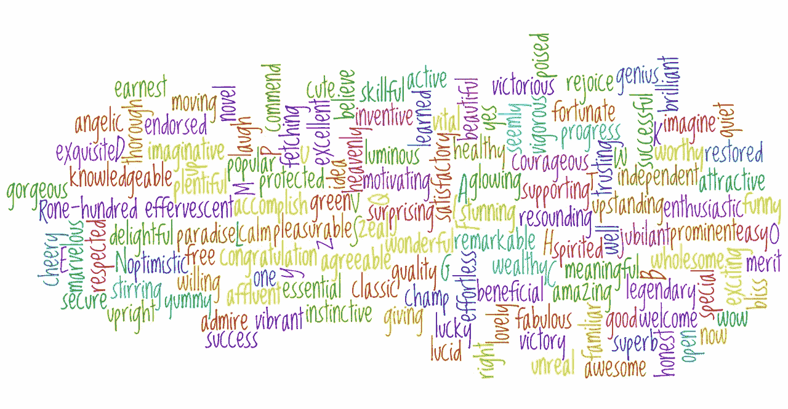

# Transformer 架构告诉我们什么？ 

> 原文：[`towardsdatascience.com/what-does-the-transformer-architecture-tell-us-cd3a4fd6a59d?source=collection_archive---------1-----------------------#2024-07-25`](https://towardsdatascience.com/what-does-the-transformer-architecture-tell-us-cd3a4fd6a59d?source=collection_archive---------1-----------------------#2024-07-25)

 [Stephanie Shen](https://jshen9889.medium.com/?source=post_page---byline--cd3a4fd6a59d--------------------------------)

·发布于 [Towards Data Science](https://towardsdatascience.com/?source=post_page---byline--cd3a4fd6a59d--------------------------------) ·14 分钟阅读·2024 年 7 月 25 日

--

图片由 [narciso1](https://pixabay.com/users/narciso1-608227/?utm_source=link-attribution&utm_medium=referral&utm_campaign=image&utm_content=639303) 提供，来源于 [Pixabay](https://pixabay.com//?utm_source=link-attribution&utm_medium=referral&utm_campaign=image&utm_content=639303)

大型语言模型（LLMs）如 ChatGPT 的卓越表现震惊了世界。突破性进展源于 Transformer 架构的发明，这一架构出乎意料地简单且可扩展。它仍然建立在深度学习神经网络的基础上，主要的新增特性是所谓的“注意力”机制，它为每个词语令牌提供上下文。此外，其前所未有的并行性赋予 LLMs 巨大的可扩展性，因此，在经过数十亿参数的训练后，它们的准确性令人印象深刻。

Transformer 架构所展现的简洁性，实际上可以与图灵机相媲美。不同之处在于，图灵机控制着机器在每一步能够做什么。而 Transformer 更像一个神奇的黑匣子，通过参数优化从海量输入数据中进行学习。研究人员和科学家们仍然对探索它的潜力及其对研究人类大脑的理论意义充满兴趣。

在本文中，我们将首先讨论 Transformer 架构的四个主要特征：词嵌入、注意力机制、单词预测以及如多模态扩展和迁移学习等泛化能力。我们的重点是探讨该架构为何如此有效，而非如何构建它（读者可以在许多资料中找到相关内容）。
