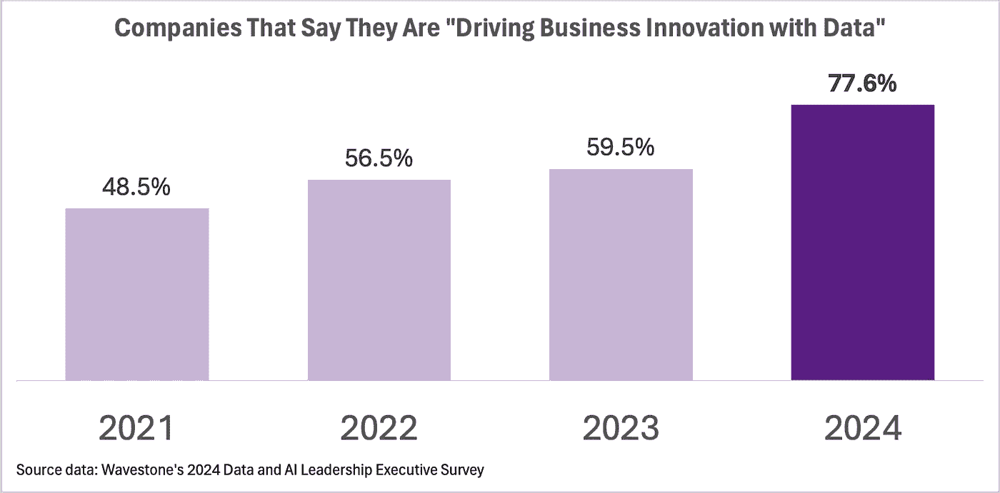

# “Dream Big”对 LinkedIn 数据科学创新的意义

> 原文：[`towardsdatascience.com/what-dream-big-meant-for-data-science-innovation-at-linkedin-ac4786aa546e?source=collection_archive---------4-----------------------#2024-06-09`](https://towardsdatascience.com/what-dream-big-meant-for-data-science-innovation-at-linkedin-ac4786aa546e?source=collection_archive---------4-----------------------#2024-06-09)

## 这里是如何激励和引领团队进行更大规模数据科学项目的方式

 [Jimmy Wong](https://medium.com/@aijimmy?source=post_page---byline--ac4786aa546e--------------------------------)

·发表于[Towards Data Science](https://towardsdatascience.com/?source=post_page---byline--ac4786aa546e--------------------------------) ·阅读时间 8 分钟·2024 年 6 月 9 日

--

作者提供的“Dream Big”活动中数据科学家的照片，已获得授权使用

“我感觉自己被困在维护仪表盘和分析 A/B 测试中”是我从 LinkedIn 及其他地方的许多数据科学家那里听到的感受。

这些活动对于运营业务至关重要。然而，数据科学家们也怀揣着宏大的梦想，希望通过机器学习（ML）和人工智能（AI）进行创新，从而创造更大的业务影响力，同时促进他们的职业发展。

好消息是，随着 AI 变得更加普及，企业越来越希望数据团队能够发挥作用，推动更多的创新。

在 Wavestone 的“[2024 年数据与 AI 领导力高管调查报告](https://wwa.wavestone.com/app/uploads/2023/12/DataAI-ExecutiveLeadershipSurveyFinalAsset.pdf)”结果中，我们看到 77.6%的组织表示他们正在“利用数据推动业务创新”——比前一年的 59.5%有所上升。然而，根据 78%的公司反馈，成为数据驱动型企业的主要挑战是“文化/人员/流程/组织”问题，而不是技术问题。

数据来源：Wavestone 的[2024 年数据与 AI 领导力高管调查报告](https://wwa.wavestone.com/app/uploads/2023/12/DataAI-ExecutiveLeadershipSurveyFinalAsset.pdf)

这些统计数据应该能帮助数据科学家们更加自信地承担起领导业务创新的责任，而不仅仅是维持现状……
