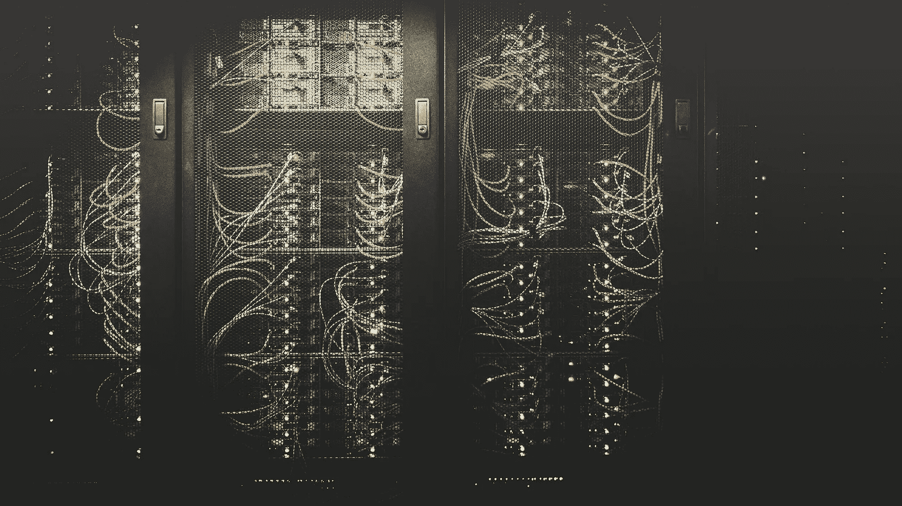
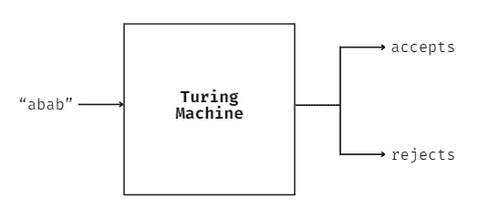
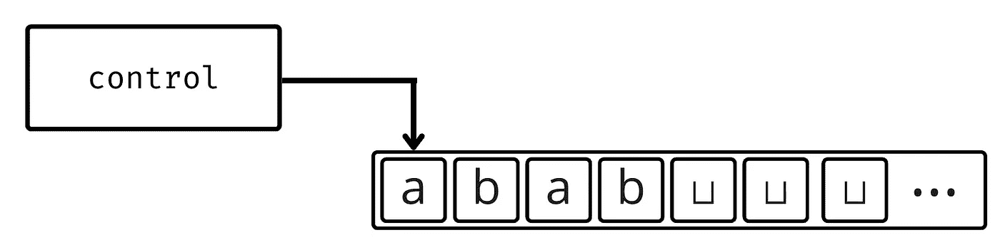
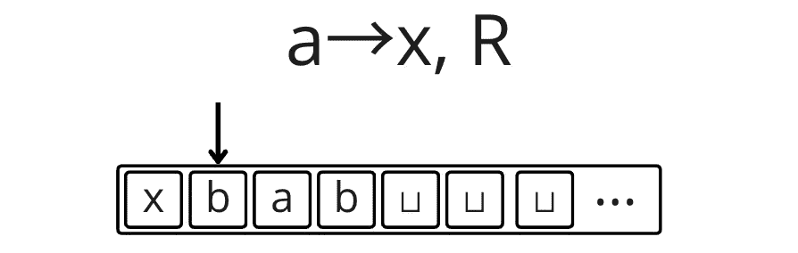
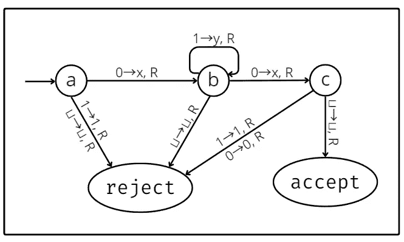
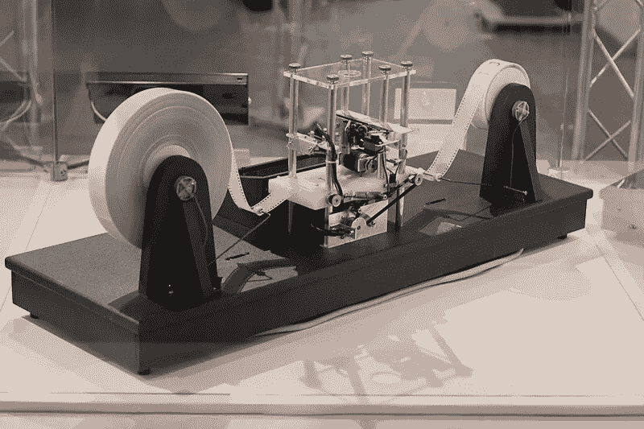
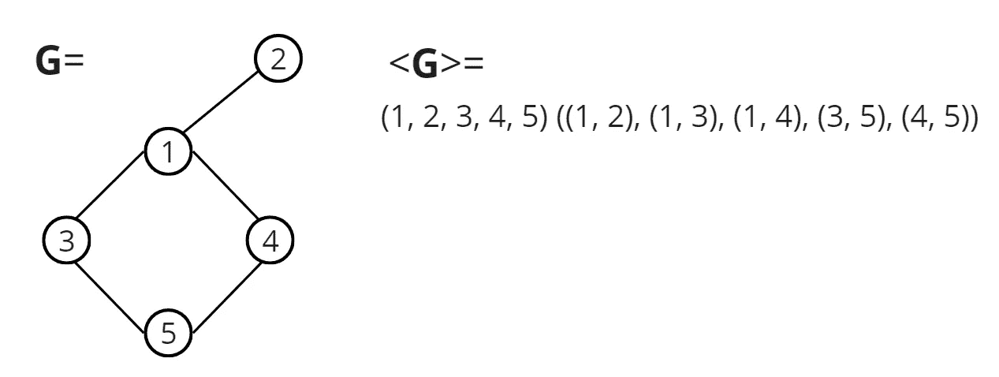

# 什么是算法？图灵机解释

> 原文：[`towardsdatascience.com/what-exactly-is-an-algorithm-turing-machines-explained-76a32fe71a37?source=collection_archive---------7-----------------------#2024-04-25`](https://towardsdatascience.com/what-exactly-is-an-algorithm-turing-machines-explained-76a32fe71a37?source=collection_archive---------7-----------------------#2024-04-25)

## 图灵机简明指南：它们是如何诞生的，以及它们如何帮助我们定义算法是什么

[](https://thiagofpmr.medium.com/?source=post_page---byline--76a32fe71a37--------------------------------)[](https://towardsdatascience.com/?source=post_page---byline--76a32fe71a37--------------------------------) [Thiago Rodrigues](https://thiagofpmr.medium.com/?source=post_page---byline--76a32fe71a37--------------------------------)

·发布于[Towards Data Science](https://towardsdatascience.com/?source=post_page---byline--76a32fe71a37--------------------------------) ·8 分钟阅读·2024 年 4 月 25 日

--



图片由[Taylor Vick](https://unsplash.com/@tvick?utm_content=creditCopyText&utm_medium=referral&utm_source=unsplash)提供，来源于[Unsplash](https://unsplash.com/photos/cable-network-M5tzZtFCOfs?utm_content=creditCopyText&utm_medium=referral&utm_source=unsplash)

# 介绍

当我们想到算法时，我们常常将其描述为类似于*食谱*：一系列我们遵循的步骤以完成某个任务。我们在编写代码时常常使用这个定义，将必须完成的任务分解成更小的步骤，并编写代码来执行这些步骤。

尽管这种直观的算法概念在大多数时候对我们来说足够用，但拥有一个正式的定义让我们能够做更多的事情。有了它，我们可以证明某些问题是根本无法解决的，找到一个比较和分析算法的共同基础，并开发新的算法。如今，图灵机通常填补了这一空缺。

# 图灵机的诞生

直到 20 世纪初，即便是数学家也没有对算法有一个正式的定义。和我们今天的做法类似，他们依赖于那个直观的概念：通过**有限**的步骤有效地计算一个函数。

这成为了上个世纪数学的一个限制性因素。1928 年，[大卫·希尔伯特](https://en.wikipedia.org/wiki/David_Hilbert)和[威廉·阿克曼](https://en.wikipedia.org/wiki/Wilhelm_Ackermann)提出了**决策问题**，即德语中的*Entscheidungsproblem*。问题内容如下：

> 是否存在一个算法，可以对任何数学陈述做出明确的“是”或“否”回答？

这个问题无法在没有*算法的恰当定义*的情况下得到解答。甚至在此之前，1900 年，希尔伯特就已提出了 23 个世纪挑战问题，其中一个问题就遇到了同样的问题。缺乏正式的定义已经困扰了数学家们一段时间。

大约在 1936 年，两个独立的解决方案针对*判定问题*相继发表。为了求解这个问题，他们分别提出了定义算法的方法。[艾伦·图灵](https://en.wikipedia.org/wiki/Alan_Turing)发明了**图灵机**，[阿隆佐·丘奇](https://en.wikipedia.org/wiki/Alonzo_Church)则发明了**λ-演算**（lambda 演算）。两者得出了相同的结论：*希尔伯特和阿克曼提出的算法无法存在*。

这两种描述在计算能力上是等效的。也就是说，任何可以通过图灵机描述的内容，也可以通过λ-演算来描述，反之亦然。我们在讨论计算机理论时倾向于采用图灵的定义，但通常假设两者都是描述算法的完全充分的方法。这就是**丘奇-图灵论题**。

> 只有当一个函数能够通过图灵机（或**λ-演算**）计算时，它才可以通过有效方法进行计算。

# 图灵机的工作原理

简单来说，可以将图灵机看作一个黑盒，它接收一串字符，以某种方式处理它，然后返回是否接受或拒绝该输入。



图灵机的黑盒图示。图像由作者提供。

这一现象一开始可能会显得很奇怪，但在像 C、C++甚至 bash 脚本等低级语言中是很常见的。在这些语言中编写代码时，我们通常在脚本的最后返回 0 以表示执行成功。如果发生一般错误，我们可能会让它返回 1。

```py
#include <stdio.h>

int main()
{
  printf("Hello World!");
  return 0;
}
```

这些值随后可以由操作系统或其他程序进行检查。编程语言也允许返回大于 1 的数字来指定某种错误类型，但总体思路还是相同的。至于机器接受或拒绝某一输入的含义，这完全取决于设计它的人。

在幕后，图灵机由*两个核心组件*构成：**控制块和磁带**。磁带是*无限的*，对应于模型的内存。控制块通过一个移动头部与磁带进行交互，*该头部既可以从磁带读取数据，也可以将数据写入磁带*。头部可以左右移动，向右可以无限延伸，但不能向左移动超出磁带的起始元素，因为磁带只在一侧无限扩展。



图灵机的简化图示。图像由作者提供。

起初，磁带是空的，仅充满空白符号（⊔）。当机器读取输入字符串时，它会将其放置在磁带的最左端。读写头也会移动到最左端，使得机器可以从那里开始读取输入序列。关于如何读取输入，是否覆盖它，以及其他实现细节，都在控制块中定义。

控制块由一组通过转变函数相互连接的状态组成。转变函数中定义的转变指定了根据从磁带读取的内容如何在状态之间移动，并且指定了要写入磁带的内容以及如何移动读写头。



图灵机中的一个单一转变及其结果磁带。读写头从磁带读取“a”，将“x”写入其位置并向右移动。图像由作者提供。

在上述转变中，第一个项表示从磁带上读取的内容。沿着箭头，接下来的项将被写入磁带。不仅磁带允许将输入中的任何字符写入其中，让读写头能够将“a”或“b”写入磁带，还允许使用空白符号和仅存在于磁带中的额外符号，如“x”或“y”，这些符号并不是输入字符串的一部分。逗号后面的最后一项是指示读写头移动的方向：**R**表示右移，**L**表示左移。

让我们看一个不同的例子：下图描述了一个接受任何长度至少为 2 并且以 0 开始和结束、中间有任意数量 1 的图灵机的内部工作原理。它的输入是由 1 和 0 组成的字符串。状态之间的转变通过箭头标出，箭头指向一个状态到另一个状态。每次机器从磁带读取一个字符时，它会检查所有从当前状态出发的转变。然后，它会沿着包含该符号的箭头转变到下一个状态。



接受 L = 01*0 的图灵机的状态图（*1**表示一系列**n**个 1，其中**n** ≥ 0）。图像由作者提供。

图灵机有*3 个特殊状态*：一个**起始**状态，一个**接受**状态，和一个**拒绝**状态。起始状态在图中由一个只在一端连接的箭头表示，顾名思义，这是机器开始时所处的状态。剩下的 2 个状态同样简单明了：如果机器进入接受状态，则接受输入；如果进入拒绝状态，则拒绝输入。注意，**它也可能永远循环下去，永远不会到达这两者中的任何一个**。

所用的图是一个确定性图灵机的示意图。这意味着每个状态都有一个对应的转移，针对它可能从磁带上读取的每一个符号。在非确定性图灵机中，情况并非如此。它是众多图灵机变种之一。有些可能采用多个磁带，有些可能附带一个“打印机”等等。需要记住的是，尽管模型有不同的变种，但它们在能力上是等价的。也就是说，任何一个图灵机变种能够计算的东西，确定性模型也能计算出来。

下图展示的是由 Mike Davey 制作的一个简单的图灵机物理模型。它有一个磁带，可以通过两个旋转的电机向左或向右移动，中心有一个电路可以读取和写入磁带，完美地捕捉了图灵的概念。



[Mike Davey 提供的图灵机模型](https://www.aturingmachine.com)。照片由 Rocky Acosta 提供 ([CC BY 3.0](https://creativecommons.org/licenses/by/3.0))。

# 与现代计算机的关系

尽管图灵机很简单，但它却非常强大。作为现代算法的定义，它具备计算任何现代计算机能够计算的东西的能力。毕竟，现代计算机基于的正是相同的原理。甚至可以称它们为图灵机的高度复杂的现实世界实现。

尽管如此，现代计算机所处理的问题及其使用的数据结构通常比我们讨论的要复杂得多。那么图灵机是如何解决这些问题的呢？其背后的关键是**编码**。无论多复杂，任何数据结构都可以表示为一串简单的字符。



无向图 G 及其编码 <G>。图像由作者提供。

在上面的例子中，我们将一个无向连通图表示为一个节点列表，后面跟着一个边列表。我们使用括号和逗号来隔离各个节点和边。只要图灵机所实现的算法考虑了这种表示方式，它就能够执行现代计算机所进行的任何图相关计算。

数据结构在真实计算机中的存储方式与此非常相似——仅仅是由零和一组成的字符串。最终，在最基础的层面，所有现代计算机所做的就是按照某种逻辑从内存中读取和写入一串串的比特。通过这样做，它们使我们能够解决从最简单到最复杂的各种问题。

# 结论

理解图灵机及其工作原理能帮助我们深入洞察计算机的能力和局限性。除了为我们提供了一个坚实的理论基础来理解复杂算法的底层原理外，它还使我们能够确定一个算法是否能够解决某个特定问题。

它们也是计算复杂性理论的核心，计算复杂性理论研究计算问题的难度，以及解决这些问题所需的资源，比如时间或内存。分析算法的复杂性是任何从事软件开发的人必备的技能。它不仅有助于开发更高效的模型和算法，优化现有算法，还能帮助选择最合适的算法来完成任务。

总之，深入理解图灵机不仅让我们深刻理解计算机的能力和局限性，还为我们提供了确保解决方案效率的基础和工具，推动创新向前发展。

# 参考文献

[](https://www.amazon.com/Introduction-Theory-Computation-Michael-Sipser-dp-113318779X/dp/113318779X/ref=dp_ob_image_bk?source=post_page-----76a32fe71a37--------------------------------) [## 计算理论导论

### 即使是最复杂、最具理论性的计算理论主题，也能以易于理解的方式获得清晰的理解……

[www.amazon.com](https://www.amazon.com/Introduction-Theory-Computation-Michael-Sipser-dp-113318779X/dp/113318779X/ref=dp_ob_image_bk?source=post_page-----76a32fe71a37--------------------------------)
