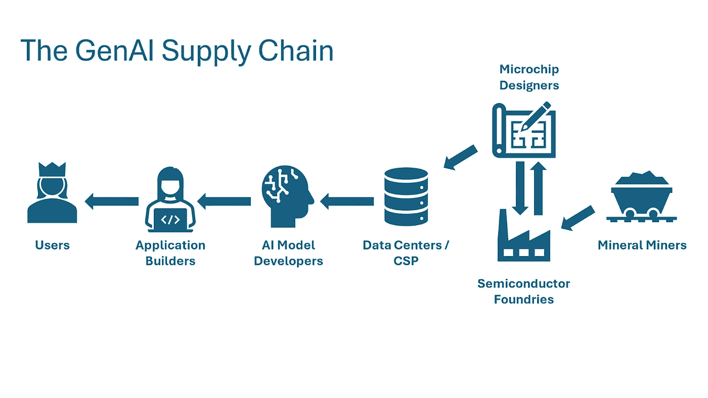
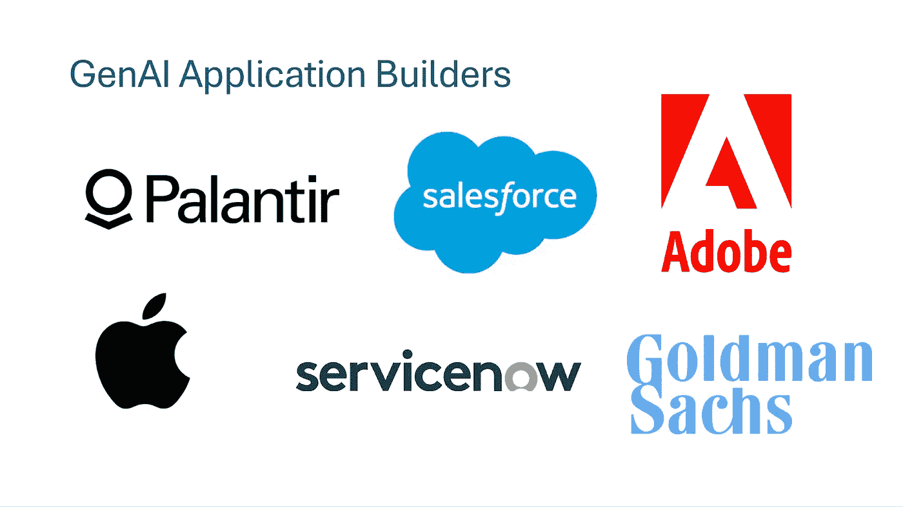
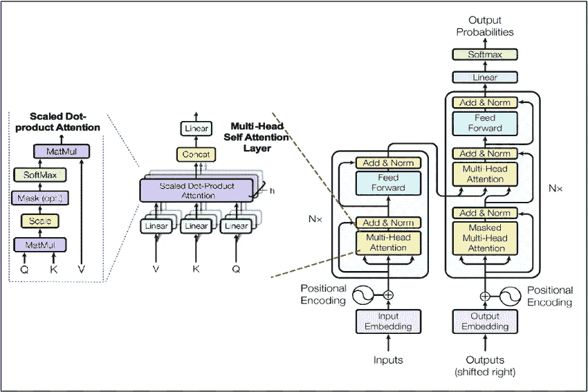
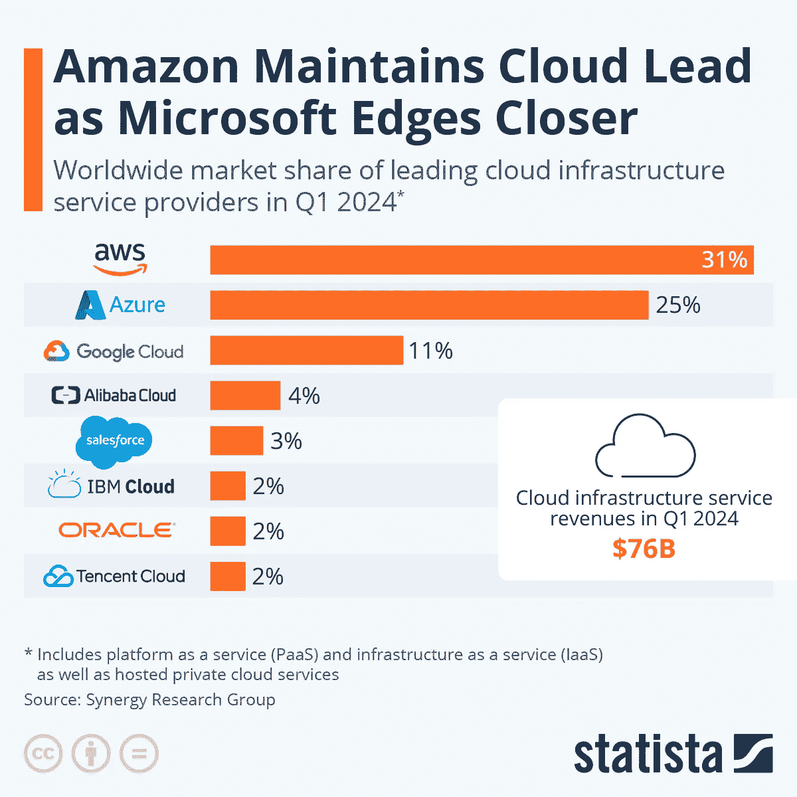
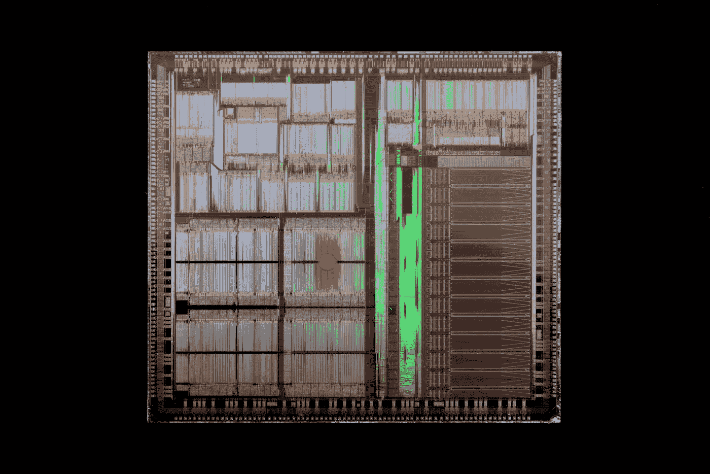
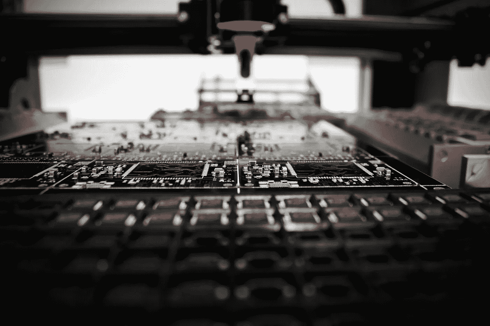
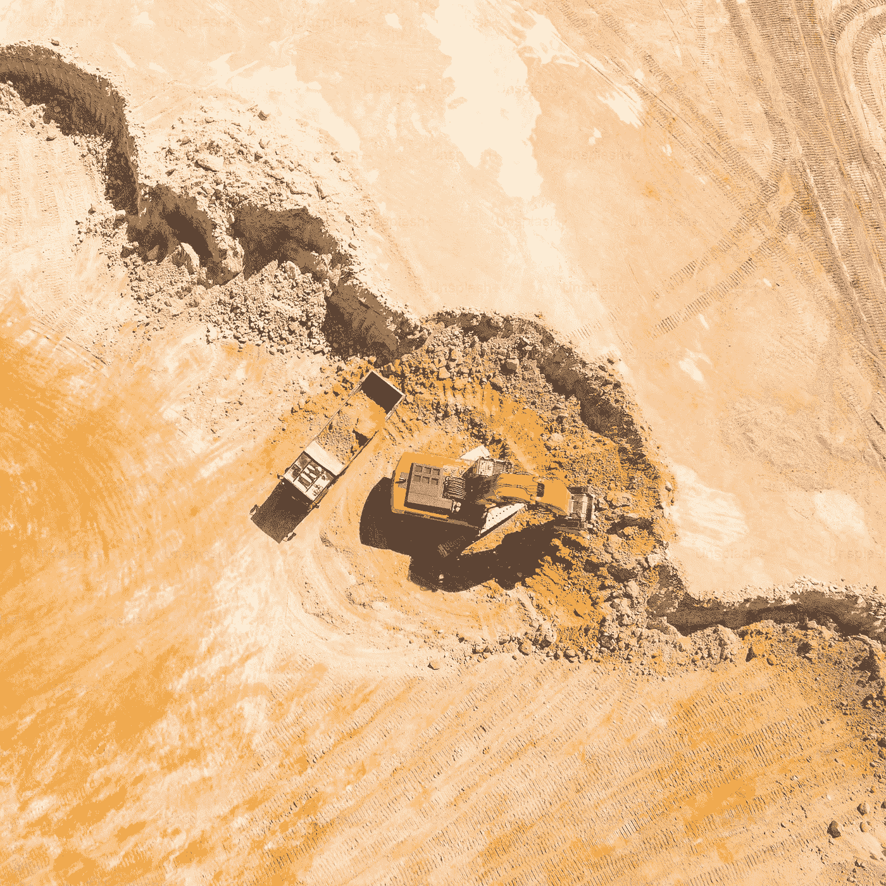

# 什么构成了 AI？探索 GenAI 技术栈

> 原文：[`towardsdatascience.com/what-goes-into-ai-exploring-the-genai-technology-stack-7147d147997b?source=collection_archive---------1-----------------------#2024-10-11`](https://towardsdatascience.com/what-goes-into-ai-exploring-the-genai-technology-stack-7147d147997b?source=collection_archive---------1-----------------------#2024-10-11)

## 你听说过 OpenAI 和 Nvidia，但你知道还有谁参与了 AI 浪潮以及它们是如何互相配合的吗？

 [Charles Ide](https://medium.com/@charles.ide?source=post_page---byline--7147d147997b--------------------------------)

·发表于[Towards Data Science](https://towardsdatascience.com/?source=post_page---byline--7147d147997b--------------------------------) ·阅读时长 16 分钟·2024 年 10 月 11 日

--

图片来源：作者

几个月前，我参观了纽约的 MoMA，并看到了 Kate Crawford 和 Vladan Joler 的[作品*《AI 系统的解剖》*](https://www.moma.org/collection/works/401279)。这件作品探讨了亚马逊 Alexa 的供应链，从原材料的提取到设备的处理。这让我开始思考当今生成性 AI（GenAI）应用的生产过程。通过深入挖掘这个问题，我开始理解构成 GenAI 应用的多层次物理和数字工程。

我写这篇文章是为了向读者介绍 GenAI 价值链的主要组成部分，每个环节扮演的角色，以及每个阶段的主要参与者。在此过程中，我希望能够展示推动 AI 增长的各种业务，技术如何互相依赖，以及在哪里存在脆弱性和瓶颈。从面向用户的应用开始，这些应用来自像 Google 这样的科技巨头和最新一批初创公司，我们将向后追溯整个价值链，直到计算机芯片所需的沙子和稀土金属。

# 最终应用构建者

从像 Palantir 这样的扩展型初创公司，到像 Apple 这样的科技巨头，再到像 Goldman Sachs 这样的非科技公司，每个人都在开发 AI 解决方案。图片来源：作者。

科技巨头、企业 IT 部门和大量新兴初创公司目前正处于实验 GenAI 潜在应用场景的初期阶段。这些应用程序可能是计算机应用中新范式的开端，其特点是人机交互系统的根本性创新以及理解和利用非结构化和此前未开发的数据源（如音频）的前所未有的能力。

计算机领域一些最具影响力的进步来自于人机交互（HCI）的发展。从图形用户界面（GUI）的开发到鼠标，再到触摸屏，这些进步大大扩展了用户从计算工具中获得的杠杆效应。GenAI 模型将进一步消除这一界面的摩擦，通过赋予计算机与人类语言相同的能力和灵活性，使用户能够像向可靠的人类助手发出指令一样向计算机发布指令和任务。以下是一些在人机交互领域创新的产品示例：

+   [**Siri**](https://www.apple.com/siri/) **（AI 语音助手）—** 增强了苹果移动助手的能力，可以理解更广泛的请求和问题

+   [**Palantir’s AIP**](https://www.palantir.com/platforms/aip/) **（自主代理）—** 通过一个聊天界面，简化了大型强大工具的复杂性，引导用户执行所需功能和操作

+   [**Lilac Labs**](https://www.ycombinator.com/companies/lilac-labs) **（客户服务自动化）—** 通过语音 AI 自动化驾车自取客户的点餐

GenAI 赋予计算机系统以前无法实现的自主性和灵活性，传统的计算机功能是由一组预编程的程序指导，并且其数据输入需要符合程序员设定的明确规则。这种灵活性使得应用程序能够执行更复杂和开放的知识任务，这些任务之前仅限于人类领域。一些利用这种灵活性的新的应用示例如下：

+   [**GitHub Copilot**](https://github.com/features/copilot) **（编码助手）—** 通过根据用户的意图和现有代码库实现代码，从而提高程序员的生产力

+   [**LenAI**](https://www.oliverwyman.com/our-expertise/insights/2023/sep/approaching-generative-ai-lenai.html) **（知识助手）—** 通过总结会议、提取讨论中的关键见解和草拟通信，节省知识工作者的时间

+   [**Perplexity**](https://www.perplexity.ai/) **（AI 搜索）—** 通过综合传统的互联网搜索和 AI 生成的互联网来源摘要，可靠地回答用户的问题并提供引用

一个多元化的玩家群体正在推动这些应用案例的发展。大量初创公司如雨后春笋般涌现，[其中 86 家来自 Y Combinator W24 批次专注于 AI 技术](https://techcrunch.com/2024/04/03/y-combinator-winter-2024-demo-day-ai-startups-standouts/)。像谷歌这样的主要科技公司也推出了生成式 AI 产品和功能。例如，谷歌正在利用其 Gemini 大语言模型在其核心搜索产品中总结结果。传统企业也在推出重要举措，旨在理解生成式 AI 如何补充他们的战略和运营。[摩根大通 CEO Jamie Dimon 表示](https://www.entrepreneur.com/business-news/ceo-jamie-dimon-how-jpmorgan-chase-uses-ai-in-the-workplace/477036)，AI 在“市场营销、风险管理、欺诈方面是不可思议的，它将帮助你更好地完成工作。”随着企业逐渐理解 AI 如何解决问题并创造价值，生成式 AI 的应用案例和需求将成倍增长。

# 人工智能模型构建者

变压器 AI 架构示意图。图片由[Sing 等人](https://www.researchgate.net/publication/342045332_NLP-Based_Approach_for_Predicting_HMI_State_Sequences_Towards_Monitoring_Operator_Situational_Awareness)提供，并根据 Creative Commons 4.0 许可证使用。

随着 OpenAI 的 ChatGPT（由 GPT-3.5 模型提供支持）在 2022 年底发布，生成式 AI[迅速进入了公众视野](https://www.nytimes.com/2023/02/03/technology/chatgpt-openai-artificial-intelligence.html)。如今，像 Claude（Anthropic）、Gemini（谷歌）和 Llama（Meta）这样的模型已挑战 GPT 的主导地位。模型提供商市场和开发格局仍处于初期阶段，许多未解之谜仍然存在，例如：

+   小型领域/任务特定的模型会大量涌现，还是大型模型将处理所有任务？

+   在当前的变压器架构下，模型的复杂性和能力能够发展到何种程度？

+   随着模型训练接近所有人类创作文本数据的极限，能力将如何发展？

+   哪些玩家将挑战当前 OpenAI 的主导地位？

虽然关于人工智能能力极限的猜测超出了本讨论的范围，但生成式 AI 模型的市场可能非常庞大（[许多知名投资者确实高度重视它](https://www.wsj.com/tech/ai/openai-nearly-doubles-valuation-to-157-billion-in-funding-round-ee220607)）。模型构建者做了什么来证明如此高的估值和如此巨大的兴奋？

像 OpenAI 这样的公司的研究团队负责做出架构选择、编制和预处理训练数据集、管理训练基础设施等工作。该领域的研究科学家非常稀缺且高度重视；[OpenAI 的平均工程师年薪超过 90 万美元](https://news.ycombinator.com/item?id=36460082)。并非许多公司能够吸引和留住拥有这种高度专业技能的人才来完成这些工作。

编译训练数据集涉及爬取、编译和处理所有可用的文本（或音频或视觉）数据，这些数据来自互联网和其他来源（例如数字化图书馆）。在编译这些原始数据集之后，工程师会加入相关的元数据（例如标记分类），将数据分割成适合模型处理的块，格式化数据为高效的训练文件格式，并实施质量控制措施。

尽管由人工智能模型驱动的产品和服务的市场[可能在十年内达到数万亿美元的规模](https://www.grandviewresearch.com/industry-analysis/artificial-intelligence-ai-market)，但许多进入壁垒使得除了资源雄厚的公司之外，几乎没有公司能够构建尖端模型。进入的最大壁垒是训练模型所需的数百万到数十亿美元的资本投资。为了训练最新的模型，公司必须自行建设数据中心，或者从云服务提供商那里进行大量采购，以利用他们的数据中心。尽管摩尔定律持续快速降低计算能力的价格，但这被模型规模和计算需求的迅速扩大所抵消。训练最新的尖端模型需要数十亿美元的数据中心投资（2024 年 3 月，媒体报道了[OpenAI 和微软计划投入 1000 亿美元建设数据中心，以训练下一代模型](https://www.reuters.com/technology/microsoft-openai-planning-100-billion-data-center-project-information-reports-2024-03-29/)）。很少有公司能够负担得起将数十亿美元用于训练 AI 模型（只有科技巨头或资金极为充足的初创公司如 Anthropic 和[Safe Superintelligence](https://www.reuters.com/technology/artificial-intelligence/openai-co-founder-sutskevers-new-safety-focused-ai-startup-ssi-raises-1-billion-2024-09-04/)）。

寻找合适的人才也非常困难。吸引这些专业人才不仅需要超过七位数的薪酬包，还需要与相关领域和学术社区建立联系，并提供有吸引力的价值主张以及对技术未来的愿景。现有企业在资金的高访问性和专门人才市场的主导地位，将使新进入者很难挑战其地位。

了解一点关于 AI 模型市场的历史，有助于我们理解当前的格局以及市场可能的发展趋势。当 ChatGPT 首次登场时，许多人觉得它是一次突破性的革命，但真的是这样吗？还是说它只是长期以来发展过程中不可见的（尽管令人印象深刻的）进步之一？开发 ChatGPT 的团队是在几十年的研究和来自工业界、学术界以及开源社区的公开工具基础上构建的。最显著的是变换器架构本身——这一关键的洞察力不仅推动了 ChatGPT，也推动了过去五年里大多数 AI 突破的发展。该架构最早由谷歌在 2017 年的论文《Attention is All You Need》中提出，[变换器架构](https://research.google/pubs/attention-is-all-you-need/)是如 Stable Diffusion、GPT-4 和 Midjourney 等模型的基础。那篇 2017 年论文的[作者们创办了一些最著名的 AI 初创公司](https://www.wired.com/story/eight-google-employees-invented-modern-ai-transformers-paper/)，例如 CharacterAI 和 Cohere。

鉴于常见的变换器架构，是什么因素使某些模型能“胜过”其他模型？诸如模型大小、输入数据的质量/数量以及专有研究等变量是区分不同模型的关键。研究表明，模型大小与性能的提升相关，资金最充足的参与者可能通过投入更多资金进行模型训练，进一步扩展其模型，从而实现差异化。专有数据源（如 Meta 基于其用户群体的数据和埃隆·马斯克的 xAI 基于特斯拉驾驶视频的数据）可以帮助某些模型学习其他模型无法访问的内容。生成性人工智能（GenAI）仍然是一个高度活跃的研究领域——拥有最佳人才的公司在研究突破方面将部分决定进展的速度。同时，目前尚不清楚策略和应用场景将如何为不同的参与者创造机会。也许，应用开发者会利用多个模型来降低依赖风险，或将模型的独特优势与特定应用场景对接（例如，研究、人际沟通）。

# 云服务提供商与数据中心运营商

云基础设施市场份额。图像来源：[Statistica](https://www.statista.com/chart/18819/worldwide-market-share-of-leading-cloud-infrastructure-service-providers/)，并根据创意共享许可使用。

我们讨论了模型提供商如何投资数十亿美元来建立或租赁计算资源以训练这些模型。这些支出都去哪了？其中大部分流向了像微软的 Azure（OpenAI 用于 GPT）和亚马逊云服务（Anthropic 用于 Claude）这样的云服务提供商。

云服务提供商（CSPs）在生成型 AI（GenAI）价值链中扮演着至关重要的角色，通过提供模型训练所需的基础设施（它们通常还为最终的应用程序构建者提供基础设施，但本节将重点讨论它们与模型构建者的互动）。主要的模型构建者通常不拥有和运营自己的计算设施（即数据中心）。相反，他们从超大规模 CSP（如 AWS、Azure 和 Google Cloud）以及其他提供商那里租用大量计算能力。

CSP 提供计算能力这一资源（通过向专门的微芯片输入电力来生产，数千个这样的微芯片组成一个数据中心）。为了训练他们的模型，工程师向由 CSP 运营的计算机提供指令，进行计算密集型的矩阵计算，以计算模型权重的数十亿个参数。这个模型训练阶段是投资高昂的前期成本的主要来源。一旦这些权重被计算出来（即模型被训练好），模型提供商就使用这些参数来响应用户查询（即对新的数据集进行预测）。这是一种计算消耗较低的过程，称为推理，仍然需要使用 CSP 的计算能力。

云服务提供商的角色是建设、维护和管理数据中心，在这些数据中心中，“计算能力”资源被模型构建者生产并使用。CSP 的活动包括从像 Nvidia 这样的供应商获取计算芯片，在专业设施中“架设和堆叠”服务器单元，以及进行定期的物理和数字维护。他们还开发整个软件堆栈来管理这些服务器，并为开发者提供接口，以访问计算能力并部署他们的应用程序。

数据中心的主要运营费用是电力，随着 AI 驱动的数据中心扩展，预计未来几十年电力使用量将大幅增加。为了提供一些背景信息，标准的 ChatGPT 查询消耗的能源是普通 Google 搜索的十倍。高盛预计，[AI 需求将使数据中心在全球电力使用中的份额到本世纪末翻倍](https://www.goldmansachs.com/insights/articles/AI-poised-to-drive-160-increase-in-power-demand)。正如必须对计算基础设施进行重大投资以支持 AI 一样，同样也必须对这些计算基础设施的电力供应进行类似的投资。

展望未来，云服务提供商及其模型构建伙伴正在竞相构建最大的、最强大的数据中心，以支持下一代模型的训练。未来的数据中心，例如微软与 OpenAI 的合作开发的那些，将需要成千上万甚至百万个新型尖端微芯片。云服务提供商在建设这些设施时的巨大资本支出，正推动着帮助制造这些微芯片的公司创下纪录的利润，尤其是英伟达（设计）和台积电（制造）。

# 微芯片设计师

图片来源：[Laura Ockel on Unsplash](https://unsplash.com/photos/brown-wooden-framed-glass-window-ziFuECDh8hc)

此时，大家可能都听说过英伟达及其由人工智能驱动的股市飙升。说科技巨头们陷入军备竞赛，而英伟达是唯一的供应商，这已经成了一个老生常谈的说法，但这是真的吗？目前来看，是的。英伟达设计了一种被称为[图形处理单元（GPU）](https://en.wikipedia.org/wiki/Microchip_Technology)的计算机微芯片，这对人工智能模型训练至关重要。那么，GPU 是什么，它为何对生成式人工智能如此关键？为什么人工智能芯片设计领域的大多数讨论都集中在英伟达，而不是其他微芯片设计公司，如英特尔、AMD 或高通？

图形处理单元（GPU）（顾名思义）最初用于服务计算机图形市场。像《侏罗纪公园》这样的 CGI 电影和《毁灭战士》这样的电子游戏需要昂贵的矩阵运算，但这些运算可以并行进行，而不是串行。标准计算机处理器（CPU）优化的是快速的串行计算（其中一个步骤的输入可能是前一步的输出），但它们无法并行处理大量计算。这种优化的“横向”并行计算而非加速的串行计算，正好适用于计算机图形，也最终成为了人工智能训练的理想选择。

给定 GPU 直到 90 年代末视频游戏的兴起才进入细分市场，它们是如何主导 AI 硬件市场的？GPU 制造商又是如何取代硅谷原有巨头，如英特尔的？2012 年，[AlexNet](https://en.wikipedia.org/wiki/AlexNet) 在 ImageNet 机器学习竞赛中获胜，通过使用 Nvidia 的 GPU 加速模型训练。它们展示了 GPU 的并行计算能力非常适合训练 ML 模型，因为像计算机图形一样，ML 模型训练依赖于高度并行的矩阵运算。今天的 LLMs 基于 AlexNet 的初步突破，进一步扩展，规模达到数万亿次算术运算和数十亿个模型参数。自 AlexNet 以来，随着并行计算需求的激增，Nvidia 通过大量前期投资和巧妙的锁定策略，将自己定位为机器学习和 AI 模型训练的唯一潜在芯片。

鉴于 GPU 设计中巨大的市场机会，合理的疑问是，为什么 Nvidia 没有面临重要的竞争者（截至本文撰写时，[Nvidia 占据了 70-95% 的 AI 芯片市场份额](https://www.cnbc.com/2024/06/02/nvidia-dominates-the-ai-chip-market-but-theres-rising-competition-.html)）。Nvidia 在 ChatGPT 之前，甚至在 AlexNet 之前对 ML 和 AI 市场的早期投资，是其领先其他芯片制造商（如 AMD）的关键因素。Nvidia 在科学计算（以后成为 ML 和 AI）市场领域进行了大量的研究与开发投资，当时还没有明确的商业用例。正因为这些早期的投资，Nvidia 在 AI 市场蓬勃发展时，已经建立了最佳的供应商和客户关系、工程人才和 GPU 技术。

也许 Nvidia 最重要的早期投资，也是目前它对抗竞争对手的最大护城河，是其 [CUDA 编程平台](https://developer.nvidia.com/cuda-toolkit)。CUDA 是一个低级软件工具，使工程师能够与 Nvidia 的芯片进行交互，并编写并行本地算法。许多模型，如 LlaMa，都利用基于这些基础 CUDA 工具构建的更高级的 Python 库。这些低级工具使得模型设计师能够专注于更高级的架构设计选择，而无需担心在 GPU 处理器核心级别执行计算的复杂性。通过 CUDA，Nvidia 构建了一种软件解决方案，战略性地补充了他们的硬件 GPU 产品，解决了 AI 开发者面临的许多软件挑战。

CUDA 不仅简化了在 Nvidia 芯片上构建并行化 AI 和机器学习模型的过程，还将开发者锁定在 Nvidia 系统上，为任何想要切换到 Nvidia 竞争对手的公司设立了重大的退出障碍。用 CUDA 编写的程序无法在竞争对手的芯片上运行，这意味着要从 Nvidia 芯片切换，企业不仅必须重建 CUDA 平台的功能，还必须重建任何依赖 CUDA 输出的技术栈的部分。鉴于过去十年中围绕 CUDA 构建的大量 AI 软件，任何想要转向竞争对手芯片的人都会面临相当高的转换成本。

# 微芯片制造商（晶圆厂）

图片由[Louis Reed 在 Unsplash](https://unsplash.com/photos/gray-industrial-machine-wSTCaQpiLtc)提供

像 Nvidia 和 AMD 这样的公司设计芯片，但它们并不制造芯片。相反，它们依赖于被称为晶圆厂的半导体制造专家。现代半导体制造是人类发明的最复杂的工程过程之一，这些晶圆厂与大多数人对传统工厂的印象相差甚远。举个例子，最新芯片上的晶体管仅有 12 个硅原子长，甚至比可见光的波长还短。现代微芯片将数万亿个这样的晶体管压缩到小小的硅晶圆上，并刻蚀成原子级的集成电路。

制造半导体的关键是一个叫做[光刻](https://www.youtube.com/watch?v=Bu52CE55BN0)的过程。光刻过程涉及在硅晶圆上刻蚀复杂的图案，硅晶圆是一种结晶形式的硅元素，作为微芯片的基础。该过程包括在晶圆上涂上一种称为光刻胶的光敏化学物质，然后通过包含所需电路的掩模将其暴露于紫外光中。暴露的光刻胶区域会被显影，留下可以刻蚀到晶圆上的图案。该过程最关键的机器由荷兰公司 ASML 开发，该公司生产[极紫外（EUV）光刻系统](https://www.youtube.com/watch?v=RmgkV83OhHA)，并在其 AI 价值链细分市场中拥有类似 Nvidia 的垄断地位。

正如 Nvidia 主导了 GPU 设计市场一样，其主要制造合作伙伴台湾半导体制造公司（TSMC）在最先进 AI 芯片的制造市场中也占有类似的份额。要理解 TSMC 在半导体制造领域中的地位，了解更广泛的晶圆厂格局是很有帮助的。

半导体制造商分为两种主要的铸造模式：纯铸造和集成式。像台积电和全球晶圆代工（GlobalFoundries）这样的纯铸造厂专注于为其他公司制造微芯片，而不设计自己的芯片（与无厂公司如英伟达和 AMD 相辅相成，后者设计但不制造芯片）。这些铸造厂专门提供制造服务，使无厂半导体公司能够设计微芯片，而无需在制造设施上进行大量资本支出。相比之下，像英特尔和三星这样的集成器件制造商（IDM）设计、制造并销售自己的芯片。集成模式对整个生产过程提供更大的控制，但需要在设计和制造能力方面进行大量投资。由于为无厂设计师提供的灵活性和资本效率，纯铸造模式在近年来越来越受欢迎，而集成模式仍然对那些具备设计和制造技术的公司具有优势。

讨论半导体制造时，无法忽视台湾的关键作用以及由此带来的地缘政治风险。在 20 世纪末，台湾从一个低利润、低技能的制造岛屿转变为半导体强国，这主要得益于政府的战略投资以及对高科技产业的关注。台积电的成立和发展在这一转型中起到了核心作用，使台湾处于全球技术供应链的中心，并促使许多小型公司涌现以支持制造业。然而，这种主导地位也使台湾成为持续地缘政治斗争中的关键焦点，中国将台湾视为一个分裂省份，并寻求更大的控制权。任何紧张局势的升级都可能扰乱全球半导体供应，给全球经济带来深远影响，尤其是在人工智能领域。

# 硅和金属矿商

图片来自 [Getty Images on Unsplash](https://unsplash.com/photos/aerial-view-of-a-excavator-loading-a-truck-in-the-mine-mining-from-above-industrial-background-with-drone-photography-nNatLdVBnjo)

从最基本的层面来看，所有制造物品都来自从地球中提取的原材料。用于训练人工智能模型的微芯片，其主要成分是硅和金属。这些原材料以及光刻过程中的化学品是铸造厂用于制造半导体的主要输入。尽管美国及其盟国已经主导了价值链的许多部分，但它的人工智能对手中国对原材料和其他输入的掌握更为牢固。

任何微芯片的主要成分是硅（因此有了“硅谷”这个名字）。硅是地壳中最丰富的矿物之一，通常以二氧化硅（即石英或硅砂）形式开采。生产硅晶圆的过程包括开采矿石石英岩、将其粉碎，然后提取和净化元素硅。接下来，像 Sumco 和新日铁化学等化学公司通过一种叫做 Czochralski 生长法的工艺将纯硅转化为晶圆，在该过程中，一个种晶被浸入熔融的高纯度硅中，并在旋转的同时缓慢向上拉取。这个过程制造出一个大型的单晶硅锭，随后被切割成薄晶圆，作为半导体制造的基底。

除了硅以外，计算机芯片还需要微量的稀土金属。半导体制造中的一个关键步骤是[掺杂](https://www.youtube.com/watch?v=k12GMjtN8aA)，其中通过向硅中加入杂质来控制其导电性。掺杂通常使用像锗、砷、镓和铜这样的稀土金属。中国主导着全球稀土金属的生产，[占全球矿产和加工量的 60%以上和 85%](https://www.forbes.com/sites/miltonezrati/2023/12/11/how-much-control-does-china-have-over-rare-earth-elements/)。其他重要的稀土金属生产国包括澳大利亚、美国、缅甸和刚果民主共和国。美国对中国稀土金属的高度依赖带来了重大的地缘政治风险，因为供应中断可能会严重影响半导体行业和其他高科技领域。这种依赖促使美国和其他国家努力多元化供应链并发展国内稀土生产能力，尽管由于环境问题和稀土加工的复杂性，进展缓慢。

# 结论

支撑 AI 发展所需的物理和数字技术堆栈以及价值链错综复杂，建立在数十年的学术和工业进展之上。这个价值链涵盖了最终应用构建者、AI 模型构建者、云服务提供商、芯片设计师、芯片制造商和原材料供应商等众多关键参与者。尽管大部分关注集中在 OpenAI、Nvidia 和台积电等主要玩家上，但在价值链的各个环节中，仍存在着重要的机会和瓶颈。成千上万的新公司将会应运而生，以解决这些问题。尽管像 Nvidia 和 OpenAI 这样的公司可能是这一代的英特尔和谷歌，但个人计算和互联网的繁荣曾创造出成千上万的独角兽企业，填补了利基市场并解决了发明新经济所带来的问题。转向 AI 所创造的机会需要数十年才能理解和实现，就像 70 年代和 80 年代的个人计算以及 90 年代和 00 年代的互联网一样。

尽管创业精神和巧妙的工程技术能够解决 AI 市场中的许多问题，但有些问题涉及到更为强大的力量。没有什么挑战比与中国的地缘政治紧张局势更为严峻，中国拥有（或声称拥有）大多数原材料和制造市场。这与美国及其盟友形成对比，后者控制着链条的大多数下游阶段，包括芯片设计和模型训练。争夺 AI 主导地位尤为重要，因为 AI 所带来的机会不仅是经济性的，还具有军事意义。利用 AI 能力的半自主武器系统和网络战争代理人可能在未来几十年的冲突中发挥决定性作用。像[Palantir](https://www.palantir.com/)和[Anduril](https://www.anduril.com/)这样的现代防务科技初创公司已经展示了 AI 能力如何扩展战场可视性并加速决策循环，从而获得潜在的决定性优势。考虑到 AI 对全球秩序的高潜力破坏性以及美国与中国之间微妙的权力平衡，两国必须努力保持合作关系，旨在共同发展 AI 技术，以促进全球繁荣。只有通过解决从科学到工业再到地缘政治的整个供应链问题，才能实现 AI 在增强人类能力方面的承诺。
