# 什么是缺失值的良好填补方法？

> 原文：[`towardsdatascience.com/what-is-a-good-imputation-for-missing-values-e9256d45851b?source=collection_archive---------5-----------------------#2024-06-08`](https://towardsdatascience.com/what-is-a-good-imputation-for-missing-values-e9256d45851b?source=collection_archive---------5-----------------------#2024-06-08)

## 我目前对缺失值填补的理解

[](https://medium.com/@jeffrey_85949?source=post_page---byline--e9256d45851b--------------------------------)[](https://towardsdatascience.com/?source=post_page---byline--e9256d45851b--------------------------------) [Jeffrey Näf](https://medium.com/@jeffrey_85949?source=post_page---byline--e9256d45851b--------------------------------)

·发表于[Towards Data Science](https://towardsdatascience.com/?source=post_page---byline--e9256d45851b--------------------------------) ·18 分钟阅读·2024 年 6 月 8 日

--

本文是我最新的[论文](https://hal.science/hal-04521894)的总结与讨论。我们研究的是表格数据集的通用填补方法。即，填补方法应以一种适用于许多不同任务的方式进行（有时称为“广泛填补”）。

在本文中，我将分享我在过去几年处理该问题时学到的三个经验教训。我对这篇论文特别感到兴奋，但也保持谨慎，因为缺失值问题有很多方面，且很难保证不会遗漏某些内容。所以，我邀请你自行判断我的经验教训是否对你有意义。

如果你不想深入讨论缺失值的问题，我将在文章最后总结我的建议。

***免责声明：*** *本文的目标是通过填补来重建原始数据分布。虽然我认为这是大多数研究者和实践者真正想要的目标，但这是一个困难的目标，并非在所有应用中都必要。例如，在进行（条件均值）预测时，有几篇近期的论文表明，即使是简单的填补方法对于大样本量来说也是足够的。*

本文中的所有图片均由作者创建。

## 前言

在继续之前，我们需要讨论一下我在本文中如何看待缺失值。

我们假设有一个潜在的分布*P**，从中抽取观察值*X**。此外，还有一个与*X**相同维度的 0/1 向量，它被抽取，我们称这个向量为*M*。实际观察到的数据向量*X*就是被*M*遮蔽后的*X**。因此，我们观察到 n 个独立同分布（i.i.d.）的联合向量*(X, M)*副本。如果我们将其写成数据矩阵，可能看起来是这样的：

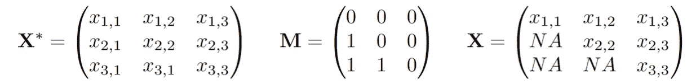

数据生成过程：X*和 M 被抽取，然后我们观察到 n 个独立同分布的(X, M)副本，其中 X 是 X*，但被 M 遮蔽。

通常小值*x, m*表示“已观察”，而大值则指随机变量。大家讨论的缺失机制就是对*(X*, M)*的关系或联合分布的假设：

**完全随机缺失（MCAR）：** 值缺失的概率是抛硬币的结果，独立于数据集中的任何变量。在这种情况下，缺失值仅仅是一个麻烦。你可以忽略它们，只关注数据集中完全观察到的部分，这样就不会产生偏差。在数学中，对于所有的*m*和*x*：

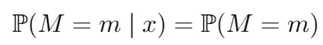

**随机缺失（MAR）：** 缺失的概率现在可以依赖于数据集中*观察到*的变量。一个典型的例子是两个变量，比如收入和年龄，其中年龄始终是观察到的，但收入可能在某些年龄值下缺失。这就是我们下面要研究的例子。这听起来很合理，但在这里可能会变得复杂。在数学中，对于所有的*m*和*x*：

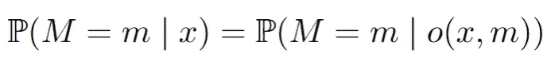

**非随机缺失（MNAR）：** 在这里一切皆有可能，我们不能就一般情况做出任何假设。

关键在于，对于插补，我们需要学习在一个模式*m’*中，给定观察到的值，缺失值的条件分布，然后将其插补到另一个模式*m*中。

实现这一目标的一个著名方法是通过链式方程进行多重插补（**MICE**）方法：首先用简单的插补方法填充数据，例如均值插补。然后对于每一次迭代*t*，对于每个变量*j*，将观察到的*X_j*回归到所有其他变量上（这些变量是插补的）。接着将这些变量的值输入到学习到的插补器中，插补所有未观察到的*X_j*。这一过程在[这篇文章](https://medium.com/@ofirdi/mice-is-nice-but-why-should-you-care-e66698f245a3)中有详细解释，并有一个很棒的插图，能让事情立刻变得清晰。在 R 语言中，这一过程方便地通过[mice R 包](https://cran.r-project.org/web/packages/mice/index.html)实现。正如我在下面将概述的那样，基于我看到的表现，我非常喜欢这种方法。实际上，能够重建某些 MICE 实例的底层分布（如 mice-cart）的能力非常精准。在本文中，我们关注一个只有一个变量缺失的非常简单的例子，因此我们可以手动编写代码，模拟 MICE 通常会做的迭代过程，以便更好地说明发生了什么。

> 第一个小课程是，MICE 是一系列方法；无论你选择哪种方法将*X_j*回归到其他变量上，都能得到不同的插补方法。因此，在 mice R 包中有无数的变种，例如 mice-cart、mice-rf、mice-pmm、mice-norm.nob、mice-norm.predict 等。这些方法的表现差异很大，下面我们会看到这一点。尽管如此，至少有一些论文（例如 NeurIPS 等顶级会议）自信地宣称他们将方法与“MICE”进行比较，却没有详细说明他们到底使用了什么方法。

## 示例

我们来看一个非常简单但具有说明性的例子：考虑一个包含两个联合正态变量的数据集，*X_1, X_2*。我们假设两个变量的方差都是 1，且它们之间的正相关系数为 0.5。为了提供一些背景，我们可以假设*X_1*是（收入的对数），*X_2*是年龄。（这仅用于说明，显然没有人会介于-3 岁到 3 岁之间）。此外，假设收入*X_1*的缺失机制是，当年龄“较高”时，*X_1*往往缺失。也就是说，我们设置：

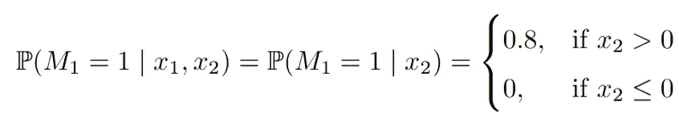

因此，当*X_2*（年龄）“较大”（即大于零）时，*X_1*（收入）以 0.8 的概率会缺失。由于我们假设*X_2*总是可观察的，这是一个典型的 MAR（缺失不完全随机）例子，包含两个模式，一个是所有变量都完全观察到的模式（*m1*），另一个是*X_1*缺失的模式（*m2*）。尽管这个例子很简单，但如果我们假设较高的年龄与较高的收入相关联，那么在从一个模式到另一个模式的转换中，*收入和年龄的分布会发生明显变化*。在模式*m2*中，收入缺失时，观察到的年龄和（未观察到的）收入的值通常较高。我们来看一下代码实现：

```py
library(MASS)
library(mice)

set.seed(10)
n<-3000

Xstar <- mvrnorm(n=n, mu=c(0,0), Sigma=matrix( c(1,0.7,0.7,1), nrow=2, byrow=T   ))

colnames(Xstar) <- paste0("X",1:2)

## Introduce missing mechanisms
M<-matrix(0, ncol=ncol(Xstar), nrow=nrow(Xstar))
M[Xstar[,2] > 0, 1]<- sample(c(0,1), size=sum(Xstar[,2] > 0), replace=T, prob = c(1-0.8,0.8) )

## This gives rise to the observed dataset by masking X^* with M:
X<-Xstar
X[M==1] <- NA

## Plot the distribution shift
par(mfrow=c(2,1))
plot(Xstar[!is.na(X[,1]),1:2], xlab="", main="", ylab="", cex=0.8, col="darkblue", xlim=c(-4,4), ylim=c(-3,3))
plot(Xstar[is.na(X[,1]),1:2], xlab="", main="", ylab="", cex=0.8, col="darkblue", xlim=c(-4,4), ylim=c(-3,3))
```

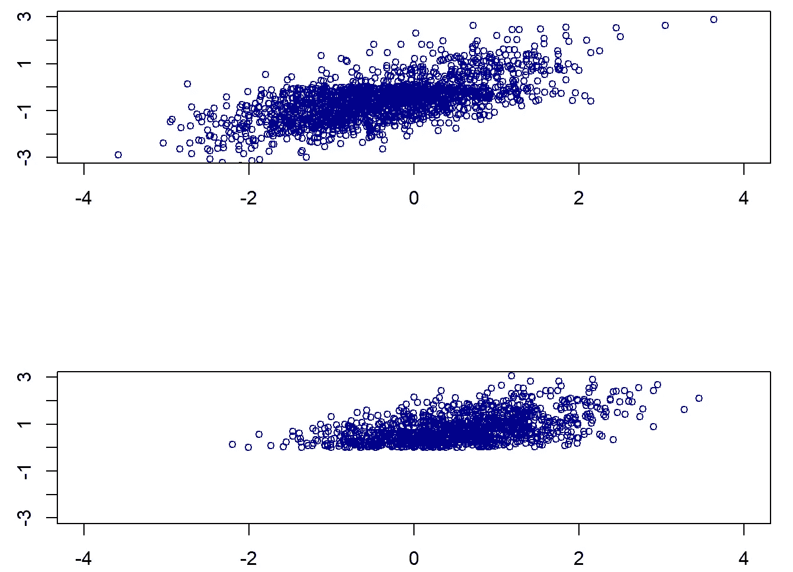

上图：在 X_1 已观察到的情况下，(X_1, X_2)的分布；下图：在 X_1 缺失的情况下，(X_1, X_2)的分布。

## 第 1 课：插补是一个分布预测问题

在我看来，（通用）插补的目标应该是尽可能地复制基础数据分布。为了说明这一点，我们再次考虑第一个例子，其中*p=0*，即只有*X_1*缺失。我们现在将尝试使用著名的[MICE](https://medium.com/@ofirdi/mice-is-nice-but-why-should-you-care-e66698f245a3)方法来插补这个例子。由于只有*X_1*缺失，我们可以手动实现这个过程。我们从*均值插补*开始，它仅仅是计算*X_1*在观察到的模式中的均值，然后将该均值填补到 NA 的位置。我们还使用*回归插补*，它稍微复杂一些：我们将*X_1*回归到*X_2*，在*X_1*被观察到的模式下，然后对于每一个缺失的*X_1*观测值，我们填入回归的预测值。因此，在这里，我们插补了给定*X_2*的条件均值。最后，对于*高斯插补*，我们从相同的*X_1*到*X_2*的回归开始，但接着通过从高斯分布中抽取值来插补每个缺失的*X_1*值。*换句话说，我们不是插补条件期望值（即只是条件分布的中心），而是从这个分布中抽样。*这导致了一种随机插补，起初可能有点反直觉，但实际上将会得到最佳结果：

```py
## (0) Mean Imputation: This would correspond to "mean" in the mice R package ##

# 1\. Estimate the mean
meanX<-mean(X[!is.na(X[,1]),1])

## 2\. Impute
meanimp<-X
meanimp[is.na(X[,1]),1] <-meanX

## (1) Regression Imputation: This would correspond to "norm.predict" in the mice R package ##

# 1\. Estimate Regression
lmodelX1X2<-lm(X1~X2, data=as.data.frame(X[!is.na(X[,1]),])   )

## 2\. Impute
impnormpredict<-X
impnormpredict[is.na(X[,1]),1] <-predict(lmodelX1X2, newdata= as.data.frame(X[is.na(X[,1]),])  )

## (2) Gaussian Imputation: This would correspond to "norm.nob" in the mice R package ##

# 1\. Estimate Regression
#lmodelX1X2<-lm(X1~X2, X=as.data.frame(X[!is.na(X[,1]),])   )
# (same as before)

## 2\. Impute
impnorm<-X
meanx<-predict(lmodelX1X2, newdata= as.data.frame(X[is.na(X[,1]),])  )
var <- var(lmodelX1X2$residuals)
impnorm[is.na(X[,1]),1] <-rnorm(n=length(meanx), mean = meanx, sd=sqrt(var) )

## Plot the different imputations

par(mfrow=c(2,2))

plot(meanimp[!is.na(X[,1]),c("X2","X1")], main=paste("Mean Imputation"), cex=0.8, col="darkblue", cex.main=1.5)
points(meanimp[is.na(X[,1]),c("X2","X1")], col="darkred", cex=0.8 )

plot(impnormpredict[!is.na(X[,1]),c("X2","X1")], main=paste("Regression Imputation"), cex=0.8, col="darkblue", cex.main=1.5)
points(impnormpredict[is.na(X[,1]),c("X2","X1")], col="darkred", cex=0.8 )

plot(impnorm[!is.na(X[,1]),c("X2","X1")], main=paste("Gaussian Imputation"), col="darkblue", cex.main=1.5)
points(impnorm[is.na(X[,1]),c("X2","X1")], col="darkred", cex=0.8 )

#plot(Xstar[,c("X2","X1")], main="Truth", col="darkblue", cex.main=1.5)
plot(Xstar[!is.na(X[,1]),c("X2","X1")], main="Truth", col="darkblue", cex.main=1.5)
points(Xstar[is.na(X[,1]),c("X2","X1")], col="darkgreen", cex=0.8 ) 
```

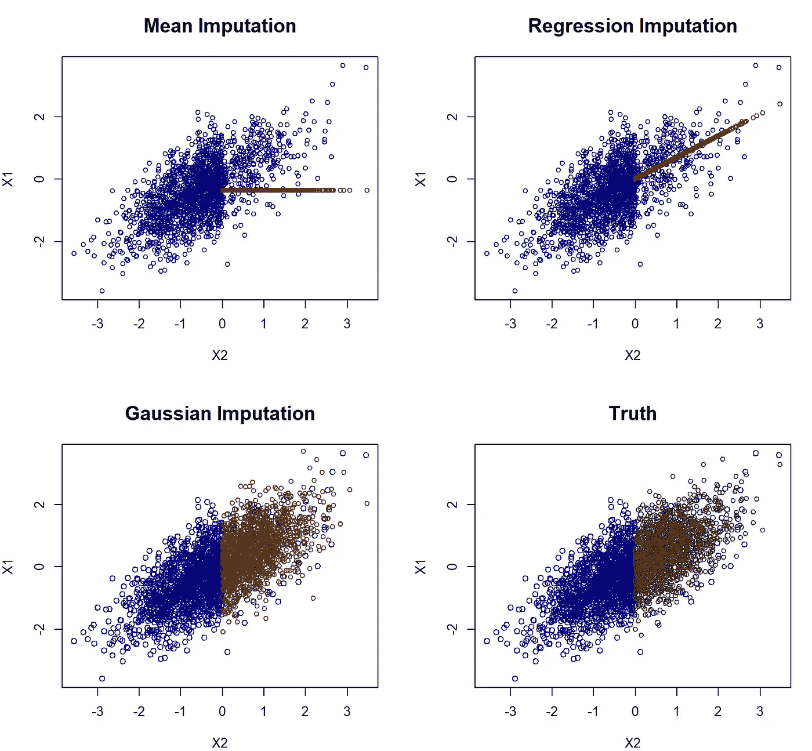

针对不同插补方法绘制的(X_1, X_2)的分布图。不同的插补方法（红点为插补的值）。

研究这张图表立即揭示出均值插补和回归插补可能不是理想的，因为它们完全无法重建原始数据分布。相比之下，高斯插补看起来相当不错，实际上，我认为它很难与真实数据区分开。这看起来可能只是一个技术性的概念，但它有着深远的影响。想象一下，如果你得到这些插补后的数据集，并且现在你想找到回归系数，当回归*X_2*与*X_1*时（这是我们在插补中做的事情的反向操作）。在这种情况下，真实的回归系数是*beta=cov(X_1, X_2)/var(X_1)=0.7*。

```py
## Regressing X_2 onto X_1

## mean imputation estimate
lm(X2~X1, data=data.frame(meanimp))$coefficients["X1"]
## beta= 0.61

## regression imputation estimate
round(lm(X2~X1, data=data.frame(impnormpredict))$coefficients["X1"],2)
## beta= 0.90

## Gaussian imputation estimate
round(lm(X2~X1, data=data.frame(impnorm))$coefficients["X1"],2)
## beta= 0.71

## Truth imputation estimate
round(lm(X2~X1, data=data.frame(Xstar))$coefficients["X1"],2)
## beta= 0.71
```

高斯插补接近 0.7（0.71），更重要的是，它非常接近使用完整（未观察到的）数据估算的结果！另一方面，均值插补低估了*beta*，而*回归插补则高估了 beta*。后者是自然的，因为条件均值插补人为地膨胀了变量之间的关系。这个效应特别重要，因为它会导致科学和（数据科学）实践中的效应被高估！！

回归插补看起来可能过于简单。然而，关键是，机器学习和其他领域中常用的插补方法正是这样工作的。例如，knn 插补和随机森林插补（即，[missForest](https://academic.oup.com/bioinformatics/article/28/1/112/219101)）。尤其是后者，在几篇基准论文中得到了好评并被广泛推荐，且应用非常广泛。然而，missForest 会在观测数据上拟合一个随机森林，然后通过条件均值简单插补。因此，在这个例子中使用它的结果看起来与回归插补非常相似，从而导致变量之间关系的人工增强和偏差估计！

> 许多常用的插补方法，如均值插补、knn 插补和 missForest，在复制分布方面失败。它们估计和近似的是（条件）均值，因此插补结果看起来像回归插补的结果（甚至对于均值插补来说更差）。相反，我们应该尝试通过从估计的（条件）分布中抽取样本来进行插补。

## 第二课：插补应该作为一个分布预测问题进行评估

与第一课的讨论相关，有一个双重问题。插补方法应该如何评估？

想象一下我们开发了一种新的插补方法，现在想将其与已有的如 missForest、MICE 或 [GAIN](https://arxiv.org/abs/1806.02920) 等方法进行基准测试。在这种情况下，我们人为地引入了缺失值，因此我们拥有的实际数据集与上面的一样。现在，我们想将这个真实的数据集与我们的插补结果进行比较。为了举例说明，假设上面的回归插补是我们的新方法，我们希望将其与均值插补和高斯插补进行比较。

即使在最有声望的会议中，这也是通过计算均方根误差（RMSE）来完成的：

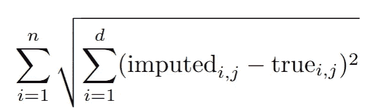

这里实现了这个：

```py
## Function to calculate the RMSE:
# impX is the imputed data set
# Xstar is the fully observed data set

RMSEcalc<-function(impX, Xstar){

  round(mean(apply(Xstar - impX,1,function(x) norm(as.matrix(x), type="F"  ) )),2)

}
```

这段讨论与如何正确评估预测的讨论相关。[在这篇文章中](https://medium.com/towards-data-science/how-to-evaluate-your-predictions-cef80d8f6a69)，我讨论了(R)MSE 是评估（条件）均值预测的正确分数。事实证明，这个相同的逻辑同样适用；像这样使用 RMSE 来评估我们的插补方法，会偏向于那些插补条件均值的方法，如回归插补、knn 插补和 missForest。

事实上，插补应该作为一个分布预测问题进行*评估*。我建议使用*完全观察数据与插补“分布”之间的能量距离*。详细信息可以在论文中找到，但在 R 中可以通过“energy” R 包轻松实现：

```py
library(energy)

## Function to calculate the energy distance:
# impX is the imputed data set
# Xstar is the fully observed data set

## Calculating the energy distance using the eqdist.e function of the energy package
energycalc <- function(impX, Xstar){

  # Note: eqdist.e calculates the energy statistics for a test, which is actually
  # = n²/(2n)*energydistance(impX,Xstar), but we we are only interested in relative values
  round(eqdist.e( rbind(Xstar,impX), c(nrow(Xstar), nrow(impX))  ),2)

}
```

我们现在将这两个分数应用于我们虚构的研究项目，试图弄清楚我们的回归插补是否比其他两个方法更好：

```py
par(mfrow=c(2,2))

## Same plots as before, but now with RMSE and energy distance 
## added

plot(meanimp[!is.na(X[,1]),c("X2","X1")], main=paste("Mean Imputation", "\nRMSE", RMSEcalc(meanimp, Xstar), "\nEnergy", energycalc(meanimp, Xstar)), cex=0.8, col="darkblue", cex.main=1.5)
points(meanimp[is.na(X[,1]),c("X2","X1")], col="darkred", cex=0.8 )

plot(impnormpredict[!is.na(X[,1]),c("X2","X1")], main=paste("Regression Imputation","\nRMSE", RMSEcalc(impnormpredict, Xstar), "\nEnergy", energycalc(impnormpredict, Xstar)), cex=0.8, col="darkblue", cex.main=1.5)
points(impnormpredict[is.na(X[,1]),c("X2","X1")], col="darkred", cex=0.8 )

plot(impnorm[!is.na(X[,1]),c("X2","X1")], main=paste("Gaussian Imputation","\nRMSE", RMSEcalc(impnorm, Xstar), "\nEnergy", energycalc(impnorm, Xstar)), col="darkblue", cex.main=1.5)
points(impnorm[is.na(X[,1]),c("X2","X1")], col="darkred", cex=0.8 )

plot(Xstar[!is.na(X[,1]),c("X2","X1")], main="Truth", col="darkblue", cex.main=1.5)
points(Xstar[is.na(X[,1]),c("X2","X1")], col="darkgreen", cex=0.8 ) 
```

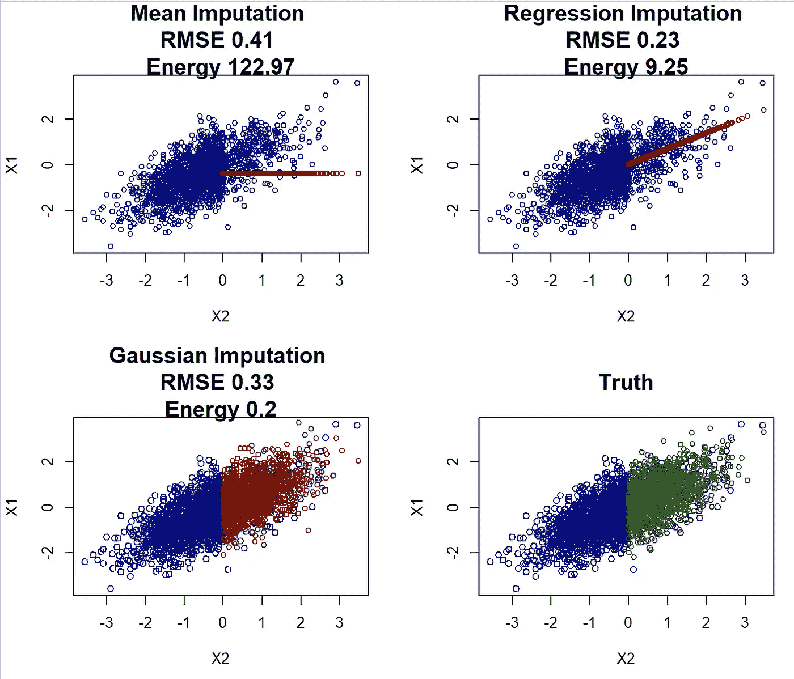

如果我们看 RMSE，那么回归插补看起来非常好！它优于均值插补和高斯插补。然而，这与上述分析冲突，选择回归插补方法可能会导致高度偏倚的结果。另一方面，（缩放后的）能量距离正确地识别出高斯插补是最佳方法，与视觉直觉和更好的参数估计结果一致。

> 在评估插补方法时（当真实数据可用时），应避免使用 RMSE 和 MAE 等度量方法。相反，应将问题视为一个分布预测问题来评估，使用分布度量方法，如能量距离。RMSE 作为评估工具的过度使用，对该领域的研究有一些严重的影响。

这并不令人惊讶，识别最佳均值预测是 RMSE 的作用。令人惊讶的是，它在研究中被如此一致地用于评估插补方法。以我个人的观点来看，这至少对一些近期论文的建议提出了疑问，关于使用哪些插补方法。此外，随着新插补方法的开发，它们通常会与其他方法在 RMSE 上进行比较，因此可能无法正确地重现分布。因此，我们必须质疑近年来开发的众多插补方法中，至少一些方法的实际价值。

当**基础观察数据不可得时**，评估问题变得更加困难。在本文中，我们开发了一种评分方法，可以在这种情况下对插补方法进行排名！（这是这篇文章中提出的思路的改进）。详细内容将在另一篇 Medium 文章中说明，但我们可以尝试在这个示例中使用它。`Iscore.R` 函数可以在[Github](https://github.com/JeffNaef/MARimputation/tree/c1f5a1e48e8a60db95c727876086db5b7305f614/Useable)上找到，或者在本文末尾查看。

```py
 library(mice)
source("Iscore.R")

methods<-c("mean",       #mice-mean
           "norm.predict",   #mice-sample
           "norm.nob") # Gaussian Imputation

## We first define functions that allow for imputation of the three methods:

imputationfuncs<-list()

imputationfuncs[["mean"]] <- function(X,m){ 
# 1\. Estimate the mean
  meanX<-mean(X[!is.na(X[,1]),1])
## 2\. Impute
  meanimp<-X
  meanimp[is.na(X[,1]),1] <-meanX

  res<-list()

  for (l in 1:m){
    res[[l]] <- meanimp
  }

  return(res)

}

imputationfuncs[["norm.predict"]] <- function(X,m){ 
 # 1\. Estimate Regression
  lmodelX1X2<-lm(X1~., data=as.data.frame(X[!is.na(X[,1]),])   )
 ## 2\. Impute
  impnormpredict<-X
  impnormpredict[is.na(X[,1]),1] <-predict(lmodelX1X2, newdata= as.data.frame(X[is.na(X[,1]),])  )

res<-list()

for (l in 1:m){
  res[[l]] <- impnormpredict
}

return(res)

  }

imputationfuncs[["norm.nob"]] <- function(X,m){ 
 # 1\. Estimate Regression
  lmodelX1X2<-lm(X1~., data=as.data.frame(X[!is.na(X[,1]),])   )
 ## 2\. Impute
  impnorm<-X
  meanx<-predict(lmodelX1X2, newdata= as.data.frame(X[is.na(X[,1]),])  )
  var <- var(lmodelX1X2$residuals)

  res<-list()

  for (l in 1:m){
    impnorm[is.na(X[,1]),1] <-rnorm(n=length(meanx), mean = meanx, sd=sqrt(var) )
    res[[l]] <- impnorm
  }

  return(res)

}

scoreslist <- Iscores_new(X,imputations=NULL, imputationfuncs=imputationfuncs, N=30)  

scores<-do.call(cbind,lapply(scoreslist, function(x) x$score ))
names(scores)<-methods
scores[order(scores)]

#    mean       norm.predict     norm.nob 
#  -0.7455304   -0.5702136   -0.4220387 
```

因此，*即使从未看到缺失数据的值*，我们的评分方法也能识别出 norm.nob 是最佳方法！这在数据维度超过两个时尤其有用。我将在下一篇文章中详细说明如何使用该评分方法以及它是如何工作的。

## 第 3 课：MAR 比你想象的更奇怪

在阅读关于缺失值插补的文献时，人们很容易产生一种感觉：MAR 已经是一个解决过的问题，所有的问题都来自于是否能够假设它成立。虽然在标准程序下，如最大似然估计，这可能是对的，但如果想要找到一个好的（非参数）插补方法，情况并非如此。

我们的论文讨论了在 MAR（缺失完全随机）情况下，如何在从完全观察的模式转变为想要插补的模式时，可能发生复杂的分布变化。在这里，我们将重点讨论观察变量中可能发生的分布变化。为此，我们回到上面的例子，其中我们将*X_1*视为收入，*X_2*视为年龄。正如我们在第一幅图中所看到的，分布看起来差异很大。然而，*X_1 | X_2*的条件分布保持不变！这从理论上使我们能够识别出正确的插补分布。

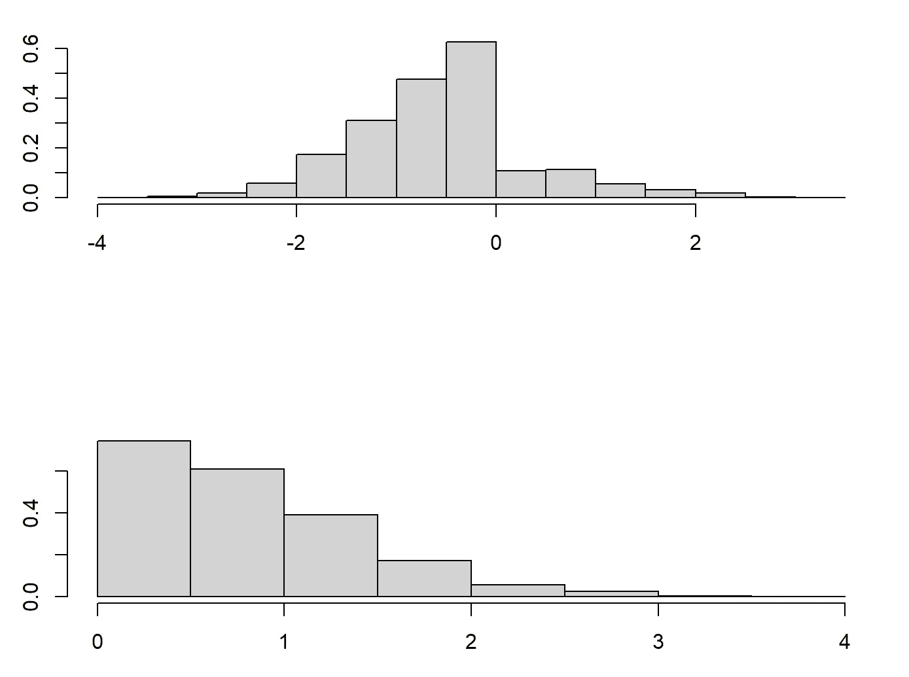

在*X_1*已观察的模式下，*X_2*的分布。底部：在*X_1*缺失的模式下，*(X_1, X_2)*的分布。

问题在于，即使我们能够非参数估计*X_1*缺失模式下的条件分布，我们仍然需要将其外推到*X_2*缺失模式下的分布。为了说明这一点，我将介绍两种非常重要的非参数 MICE 方法。一种是旧的（*mice-cart*），一种是新的（*mice-DRF*）。前者使用一棵树来回归*X_j*与其他所有变量，然后通过从该树中抽样来进行插补。因此，与 missForest 使用树/森林的条件期望预测不同，它是通过从叶节点抽样来近似从条件分布中抽样。相比之下，mice-DRF 使用[分布随机森林](https://medium.com/towards-data-science/drf-a-random-forest-for-almost-everything-625fa5c3bcb8)，这是一种设计用来估计分布并从这些预测中抽样的森林方法。这两种方法都非常有效，正如我下面所阐述的！

```py
library(drf)

## mice-DRF ##
par(mfrow=c(2,2))

#Fit DRF
DRF <- drf(X=X[!is.na(X[,1]),2, drop=F], Y=X[!is.na(X[,1]),1, drop=F], num.trees=100)
impDRF<-X
# Predict weights for unobserved points
wx<-predict(DRF, newdata= X[is.na(X[,1]),2, drop=F]  )$weights
impDRF[is.na(X[,1]),1] <-apply(wx,1,function(wxi) sample(X[!is.na(X[,1]),1, drop=F], size=1, replace=T, prob=wxi))

plot(impDRF[!is.na(X[,1]),c("X2","X1")], main=paste("DRF Imputation", "\nRMSE", RMSEcalc(impDRF, Xstar), "\nEnergy", energycalc(impDRF, Xstar)), cex=0.8, col="darkblue", cex.main=1.5)
points(impDRF[is.na(X[,1]),c("X2","X1")], col="darkred", cex=0.8 )

## mice-cart##
impcart<-X
impcart[is.na(X[,1]),1] <-mice.impute.cart(X[,1], ry=!is.na(X[,1]), X[,2, drop=F], wy = NULL)

plot(impDRF[!is.na(X[,1]),c("X2","X1")], main=paste("cart Imputation", "\nRMSE", RMSEcalc(impcart, Xstar), "\nEnergy", energycalc(impcart, Xstar)), cex=0.8, col="darkblue", cex.main=1.5)
points(impDRF[is.na(X[,1]),c("X2","X1")], col="darkred", cex=0.8 )

plot(impnorm[!is.na(X[,1]),c("X2","X1")], main=paste("Gaussian Imputation","\nRMSE", RMSEcalc(impnorm, Xstar), "\nEnergy", energycalc(impnorm, Xstar)), col="darkblue", cex.main=1.5)
points(impnorm[is.na(X[,1]),c("X2","X1")], col="darkred", cex=0.8 )
```

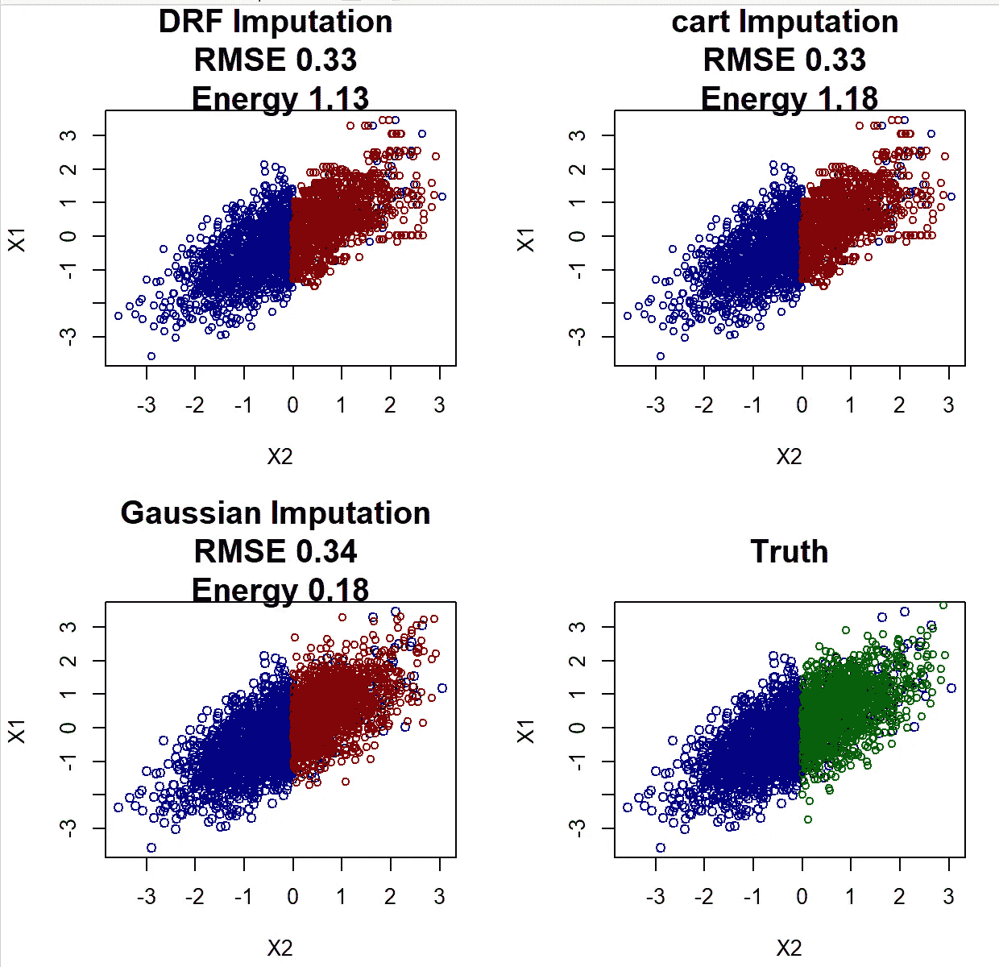

尽管 mice-cart 和 mice-DRF 都表现得很好，但它们仍然不如高斯插补效果好。这并不令人惊讶，因为高斯插补在这种情况下是理想的插补方法（因为*(X_1, X_2)*确实是高斯分布的）。然而，*X_2*中的分布变化可能是导致 mice-cart 和 mice-DRF 即使对于 3000 个观测值也难以恢复分布的原因（这些方法通常非常非常有效）。请注意，这种外推问题对于高斯插补来说并不存在。

论文还讨论了一个相似的，但更极端的例子，其中包含两个变量*(X_1, X_2)*。在这个例子中，分布变化更加明显，基于森林的方法因此也表现得较差：

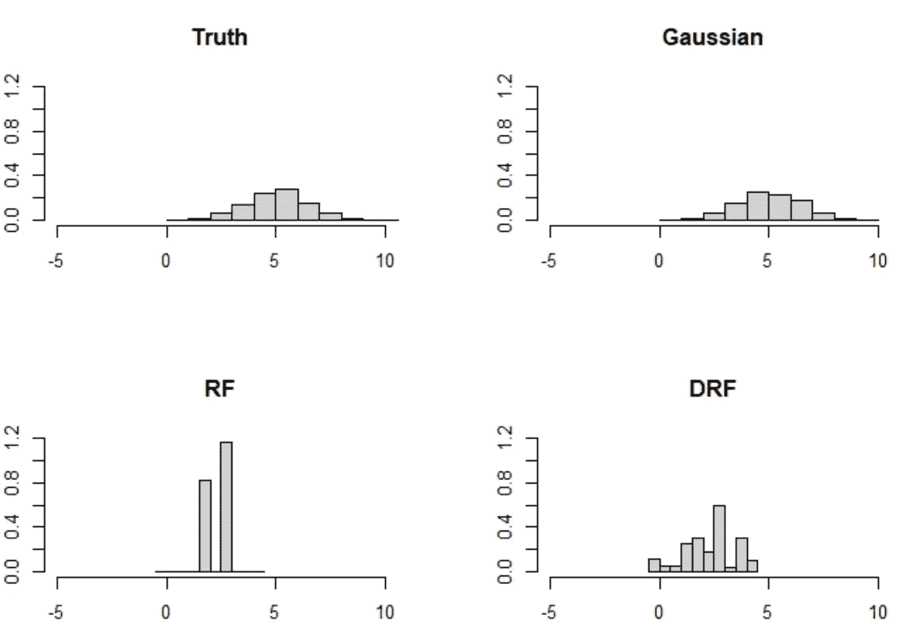

论文中的一个更极端的分布变化示例。虽然高斯插补几乎完美，但 mice-RF 和 mice-DRF 未能正确外推。

问题在于，这类极端分布偏移在 MAR 下是可能的，而基于森林的方法在数据集外推时很困难（神经网络也是如此）。实际上，你能想到一种方法吗，能够（1）非参数化地学习分布，并且（2）从上分布的*X_2* 推断出从下分布抽取的*X_2* 吗？目前，我无法想到。

> 插补是一个复杂的问题，即使可以假设为 MAR，寻找可靠的插补方法仍然没有结束。

## 结论：我目前的建议

缺失值是一个棘手的问题。事实上，处理缺失值的最佳方法就是根本不出现缺失值。因此，第 3 课表明，即使仅考虑 MAR，插补方法的探索也尚未结束。我们仍然缺乏一种方法，能够（1）进行非参数分布预测，并且（2）适应 MAR 下可能出现的分布偏移。话虽如此，我有时也觉得人们把问题弄得比实际更复杂；一些 MICE 方法表现得非常好，可能已经足够应对许多缺失值问题了。

我首先想提到一些非常先进的机器学习方法，如[GAIN](https://arxiv.org/abs/1806.02920)及其变种，这些方法尝试通过神经网络来插补数据。我喜欢这些方法，因为它们遵循了正确的思路：插补缺失值的条件分布，给定已观察到的数据。然而，在使用这些方法后，我对它们的表现感到有些失望，尤其是与 MICE 方法相比。

因此，如果我遇到缺失值问题，首先会尝试的是*mice-cart*（在 mice R 包中实现）或我们在论文中开发的新方法*mice-DRF*（代码见[Github](https://github.com/JeffNaef/MARimputation/tree/c1f5a1e48e8a60db95c727876086db5b7305f614/Useable)）。我已经在不少实例中尝试了这两种方法，它们重建数据的能力非常出色。然而请注意，我的这些观察并非基于大规模、系统性的基准测试，应该谨慎看待。此外，这至少需要一个中等样本量，比如 200 或 300 以上。插补并不容易，如果样本量太小，完全非参数化的方法会受到影响。如果样本量少于 200 个观测值，我会选择更简单的方法，比如高斯插补（R 包中的*mice-norm.nob*）。如果你想在这些方法中找出最佳的，我建议尝试我们在论文中开发的评分方法，正如第 2 课中所做的那样（尽管实现可能并非最佳）。

最后，请注意这些方法都无法有效地处理**插补不确定性**！从某种意义上讲，我们在本文中只讨论了单次插补。（正确的）多次插补需要考虑插补方法本身的不确定性，这通常是通过贝叶斯方法来实现的。对于我们在这里讨论的频率学派方法，这似乎仍然是一个未解决的问题。

## 附录 1：m-I-Score

文件“Iscore.R”，也可以在[Github](https://github.com/JeffNaef/MARimputation/tree/c1f5a1e48e8a60db95c727876086db5b7305f614/Useable)上找到。

```py
Iscores_new<-function(X, N=50,  imputationfuncs=NULL, imputations=NULL, maxlength=NULL,...){

  ## X: Data with NAs
  ## N: Number of samples from imputation distribution H
  ## imputationfuncs: A list of functions, whereby each imputationfuncs[[method]] is a function that takes the arguments
  ## X,m and imputes X m times using method: imputations= imputationfuncs[[method]](X,m).
  ## imputations: Either NULL or a list of imputations for the methods considered, each imputed X saved as 
  ##              imputations[[method]], whereby method is a string
  ## maxlength: Maximum number of variables X_j to consider, can speed up the code

  require(Matrix)
  require(scoringRules)

  numberofmissingbyj<-sapply(1:ncol(X), function(j)  sum(is.na(X[,j]))  )
  print("Number of missing values per dimension:")
  print(paste0(numberofmissingbyj, collapse=",")  )

  methods<-names(imputationfuncs)

  score_all<-list()

  for (method in methods) {
    print(paste0("Evaluating method ", method))

    # }
    if (is.null(imputations)){
      # If there is no prior imputation
      tmp<-Iscores_new_perimp(X, Ximp=NULL, N=N, imputationfunc=imputationfuncs[[method]], maxlength=maxlength,...)
      score_all[[method]] <- tmp  

    }else{

      tmp<-Iscores_new_perimp(X, Ximp=imputations[[method]][[1]], N=N, imputationfunc=imputationfuncs[[method]], maxlength=maxlength, ...)
      score_all[[method]] <- tmp  

    }

  }

  return(score_all)

}

Iscores_new_perimp <- function(X, Ximp, N=50, imputationfunc, maxlength=NULL,...){

  if (is.null(Ximp)){
    # Impute, maxit should not be 1 here!
    Ximp<-imputationfunc(X=X  , m=1)[[1]]
  }

  colnames(X) <- colnames(Ximp) <- paste0("X", 1:ncol(X))

  args<-list(...)

  X<-as.matrix(X)
  Ximp<-as.matrix(Ximp)

  n<-nrow(X)
  p<-ncol(X)

  ##Step 1: Reoder the data according to the number of missing values
  ## (least missing first)
  numberofmissingbyj<-sapply(1:p, function(j)  sum(is.na(X[,j]))  )

  ## Done in the function
  M<-1*is.na(X)
  colnames(M) <- colnames(X)

  indexfull<-colnames(X)

  # Order first according to most missing values

  # Get dimensions with missing values (all other are not important)
  dimwithNA<-(colSums(M) > 0)
  dimwithNA <- dimwithNA[order(numberofmissingbyj, decreasing=T)]
  dimwithNA<-dimwithNA[dimwithNA==TRUE]

  if (is.null(maxlength)){maxlength<-sum(dimwithNA) }

  if (sum(dimwithNA) < maxlength){
    warning("maxlength was set smaller than sum(dimwithNA)")
    maxlength<-sum(dimwithNA)
  }

  index<-1:ncol(X)
  scorej<-matrix(NA, nrow= min(sum(dimwithNA), maxlength), ncol=1)
  weight<-matrix(NA, nrow= min(sum(dimwithNA), maxlength), ncol=1)
  i<-0

  for (j in names(dimwithNA)[1:maxlength]){

    i<-i+1

    print( paste0("Dimension ", i, " out of ", maxlength )   ) 

    # H for all missing values of X_j
    Ximp1<-Ximp[M[,j]==1, ]

    # H for all observed values of X_j
    Ximp0<-Ximp[M[,j]==0, ]

    X0 <-X[M[,j]==0, ]

    n1<-nrow(Ximp1)
    n0<-nrow(Ximp0)

    if (n1 < 10){
      scorej[i]<-NA

      warning('Sample size of missing and nonmissing too small for nonparametric distributional regression, setting to NA')

    }else{

      # Evaluate on observed data
      Xtest <- Ximp0[,!(colnames(Ximp0) %in% j) &  (colnames(Ximp0) %in% indexfull), drop=F]
      Oj<-apply(X0[,!(colnames(Ximp0) %in% j) &  (colnames(Ximp0) %in% indexfull), drop=F],2,function(x) !any(is.na(x)) )
      # Only take those that are fully observed
      Xtest<-Xtest[,Oj, drop=F]

      Ytest <-Ximp0[,j, drop=F]

      if (is.null(Xtest)){
        scorej[i]<-NA
        #weighted
        weight[i]<-(n1/n)*(n0/n)
        warning("Oj was empty")
        next
      }

      ###Test 1:
      # Train DRF on imputed data
      Xtrain<-Ximp1[,!(colnames(Ximp1) %in% j) & (colnames(Ximp1) %in% indexfull), drop=F]
      # Only take those that are fully observed
      Xtrain<-Xtrain[,Oj, drop=F]

      Ytrain<-Ximp1[,j, drop=F]

      Xartificial<-cbind(c(rep(NA,nrow(Ytest)),c(Ytrain)),rbind(Xtest, Xtrain)   )
      colnames(Xartificial)<-c(colnames(Ytrain), colnames(Xtrain))

      Imputationlist<-imputationfunc(X=Xartificial  , m=N)

      Ymatrix<-do.call(cbind, lapply(Imputationlist, function(x)  x[1:nrow(Ytest),1]  ))

      scorej[i] <- -mean(sapply(1:nrow(Ytest), function(l)  { crps_sample(y = Ytest[l,], dat = Ymatrix[l,]) }))

    }

    #weighted
    weight[i]<-(n1/n)*(n0/n)

  }

  scorelist<-c(scorej)
  names(scorelist) <- names(dimwithNA)[1:maxlength]
  weightlist<-c(weight)
  names(weightlist) <- names(dimwithNA)[1:maxlength]

  weightedscore<-scorej*weight/(sum(weight, na.rm=T))

  ## Weight the score according to n0/n * n1/n!!
  return( list(score= sum(weightedscore, na.rm=T), scorelist=scorelist, weightlist=weightlist)  )
}
```
