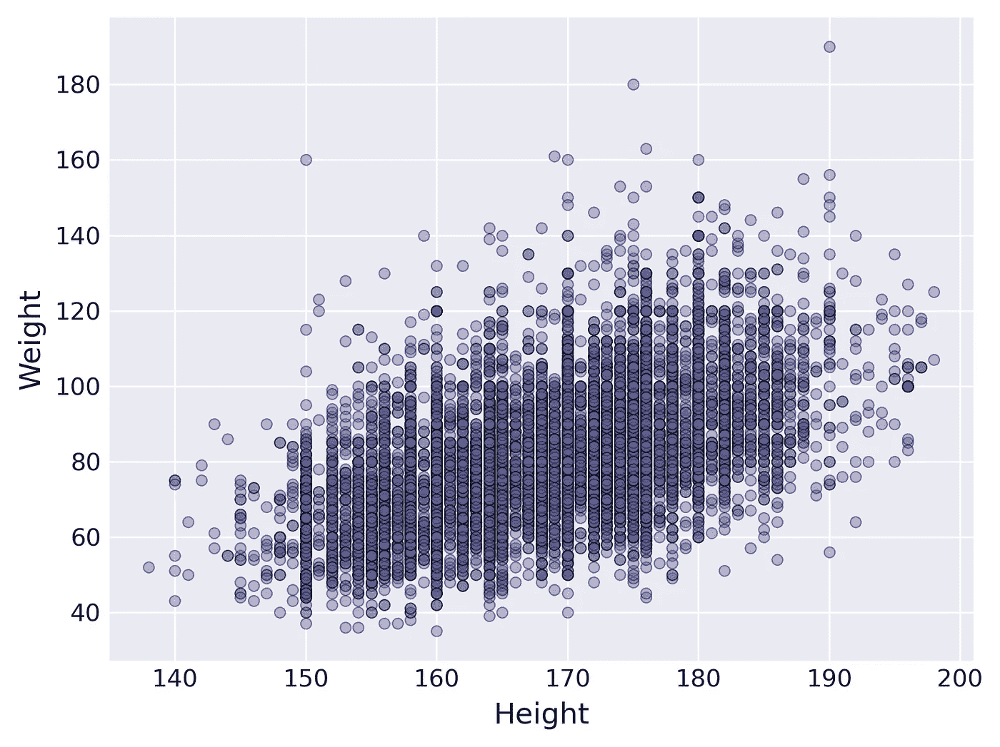
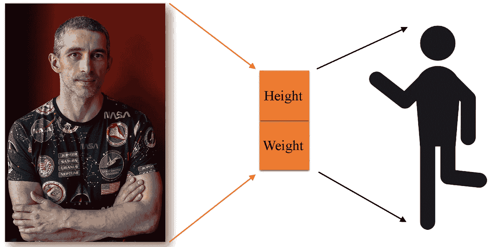
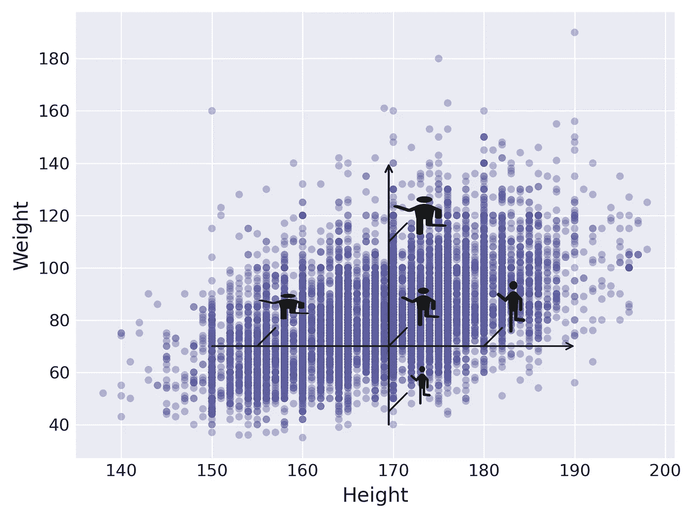
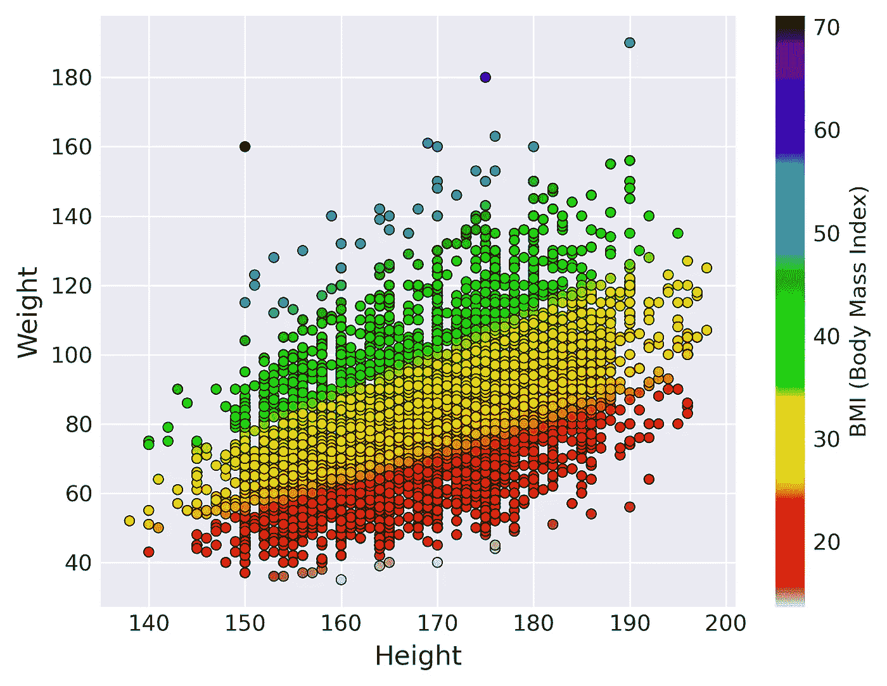
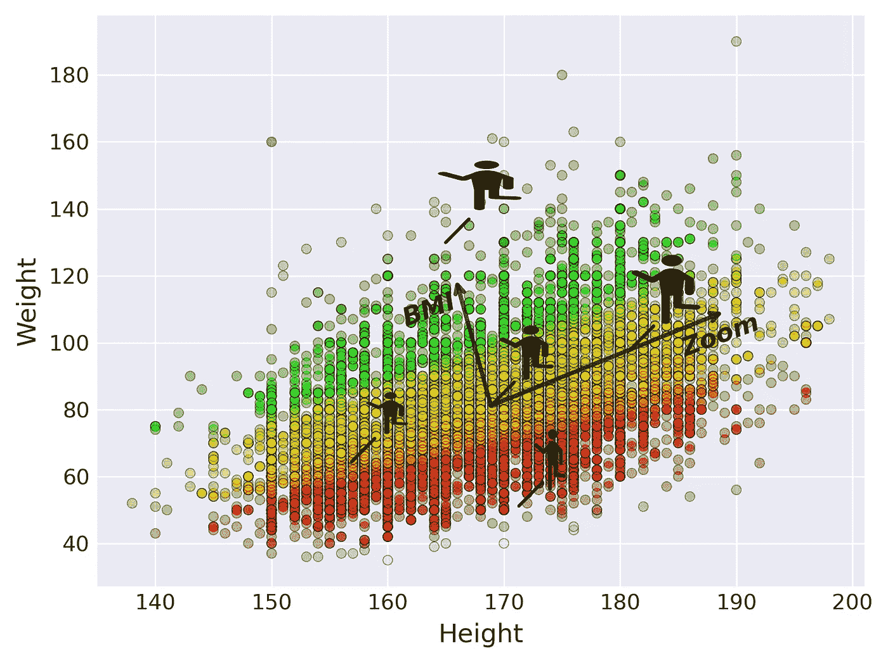
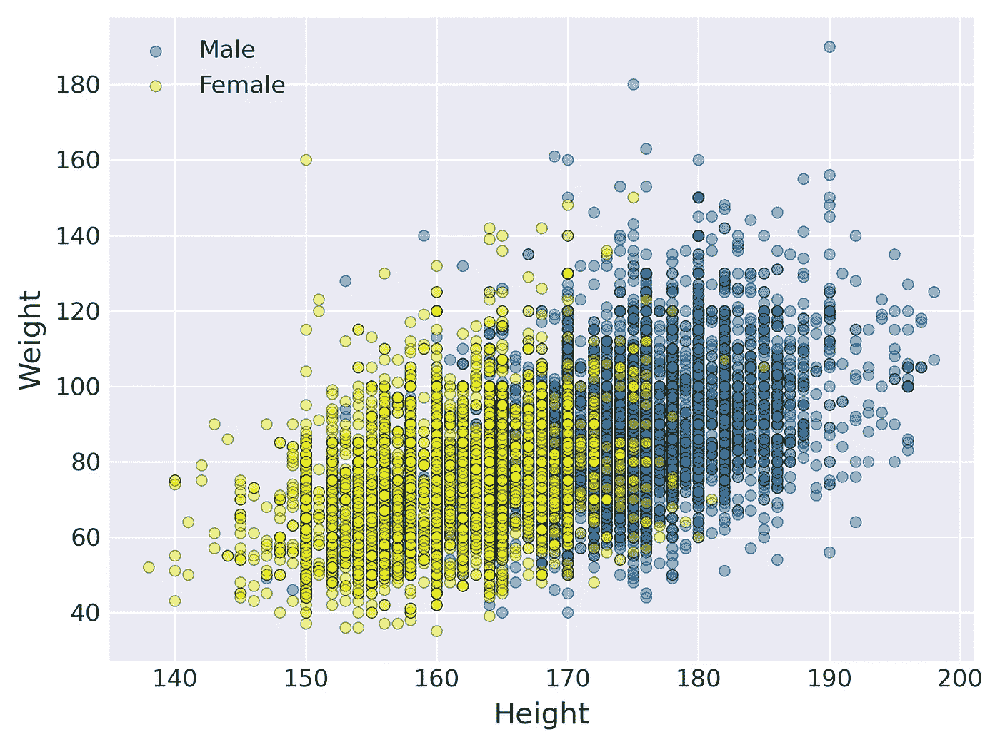
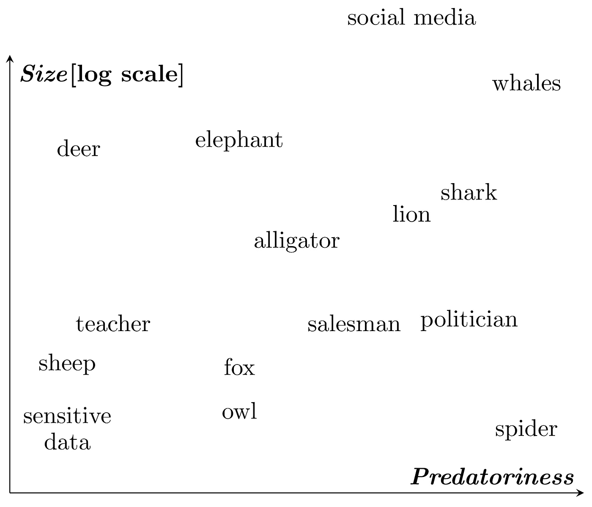
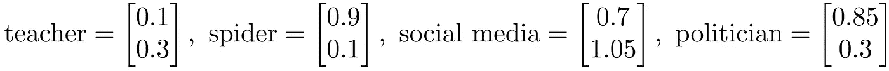

# 什么是潜在空间？

> 原文：[`towardsdatascience.com/what-is-a-latent-space-065eb8e3f859?source=collection_archive---------8-----------------------#2024-05-08`](https://towardsdatascience.com/what-is-a-latent-space-065eb8e3f859?source=collection_archive---------8-----------------------#2024-05-08)

## 给普通读者的简明解释

 [Jaroslaw Drapala](https://medium.com/@jaroslaw.drapala?source=post_page---byline--065eb8e3f859--------------------------------)

·发表于 [Towards Data Science](https://towardsdatascience.com/?source=post_page---byline--065eb8e3f859--------------------------------) ·7 分钟阅读·2024 年 5 月 8 日

--

图片由 [Lennon Cheng](https://unsplash.com/@lennonzf?utm_source=medium&utm_medium=referral) 提供，来源于 [Unsplash](https://unsplash.com/?utm_source=medium&utm_medium=referral)

你有没有想过**生成式 AI**是如何完成工作的？它是如何创建图像、处理文本并执行其他任务的？

你真正需要理解的关键概念是**潜在空间**。理解潜在空间是什么，为理解生成式 AI 铺平了道路。

让我通过几个例子来向你解释潜在空间的本质。

## **示例 1.** *寻找更好的方式来表示身高和体重数据。*

在我众多的医学数据研究项目中，我收集了大量关于患者*体重*和*身高*的测量数据。下面的图显示了这些测量数据的分布情况。

11808 名心脏病患者的身高和体重测量数据。

你可以把每个点看作是关于一个真实人物的信息的压缩版。所有细节，如面部特征、发型、肤色和性别等都不再可用，只留下*体重*和*身高*值。

是否可以仅通过这两个值重建原始数据？当然可以，前提是你的期望不要过高。你只需要用一个标准的模板对象来替换所有丢弃的信息，以填补空白。模板对象是根据保留的信息定制的，在这种情况下只包括*身高*和*体重*。

`[作者的照片，由 [Kamil Winiarz](http://linkedin.com/in/kamilwiniarz) 拍摄]`

让我们深入探讨由*身高*和*体重*轴定义的空间。考虑一个坐标为身高 170 厘米、体重 70 公斤的点。让这个点作为参考图形，并将其放置在坐标轴的原点。

水平移动保持你的*体重*恒定，同时改变你的*身高*。同样，垂直移动保持你的*身高*不变，但会改变你的*体重*。

这可能看起来有些棘手，因为当你朝一个方向移动时，你必须同时考虑两件事。有没有什么方法可以改进这个问题？

看看同一数据集按*BMI*着色的效果。

颜色几乎与线条对齐。这表明我们可以考虑其他可能更方便的轴，以便生成更符合需求的人物。

我们可能会将其中一条轴命名为‘*缩放*’，因为它保持恒定的*BMI*，唯一变化的是图形的比例。同样，第二条轴可以标为*BMI*。

新的轴提供了**更便捷的数据视角**，使得数据探索变得更加容易。你可以指定一个目标 BMI 值，然后只需沿着‘*缩放*’轴调整图形的大小。

想为你的图形增加更多细节和真实感吗？可以考虑加入更多特征，比如*性别*。但从现在开始，由于缺乏维度，我无法提供涵盖所有数据方面的类似可视化。我只能展示三项选定特征的分布：两个特征通过点在坐标轴上的位置来表示，第三个特征则通过颜色来指示。

为了改进之前的人物生成器，你可以为男性和女性创建单独的模板。然后，在黄色主导的区域生成女性，在蓝色占主导的区域生成男性。

随着更多特征的考虑，生成的人物变得越来越逼真。还要注意，即使是数据集中没有的点，也能生成相应的人物。

这就是我所称的*自上而下的方法*来生成合成的人类图形。它包括选择可衡量的特征，并识别用于探索数据空间的最佳轴（方向）。在机器学习领域，第一个过程称为**特征选择**，第二个过程则称为**特征提取**。特征提取可以通过使用专门的算法来进行，例如 PCA¹（***主成分分析*，*P*riniciple *C*omponent *A*nalysis），它有助于识别那些更自然地表示数据的方向。

我们生成合成对象的数学空间被称为**潜在空间**，原因有二。首先，这个空间中的点（向量）仅仅是原始对象的压缩、不完美的数值**表示**，就像阴影一样。其次，定义潜在空间的轴通常与原始测量特征几乎没有相似性。第二个原因将在接下来的示例中得到更好的展示。

## **示例 2.** *人脸的衰老。*

当今的生成式 AI 采用*自下而上的方法*，在这种方法中，特征选择和提取是从原始数据中自动进行的。考虑一个包含面部图像的大型数据集，其中原始特征是每张图像中所有像素的颜色，表示为从 0 到 255 的数字。像 GAN² 这样的生成模型（***G****enerative* ***A****dversarial* ***N****etwork*）可以识别（学习）一组低维特征，在这些特征中，我们可以找到最感兴趣的方向。

假设你想开发一个应用程序，上传你的图像并展示你更年轻或更年长的版本。为了实现这一目标，你需要根据年龄对所有图像的潜在空间表示（潜在空间向量）进行排序。然后，对于每个年龄组，你需要确定平均向量。

如果一切顺利，平均向量将沿着一条曲线排列，你可以将这条曲线视为年龄值轴的近似。

现在，你可以确定图像的潜在空间表示（**编码**步骤），然后按照你想要的方式沿着年龄方向移动它。最后，你可以**解码**它，以生成一个合成图像，展现你更年长（或更年轻）版本的样子。这里的**解码**步骤的思路类似于我在示例 1 中展示的内容，但在理论和计算上更为先进。

潜在空间允许探索其他有趣的维度，例如*发长*、*笑容*、*性别*等。

## 示例 3. 根据词语和短语的含义进行排序。

假设你正在进行一项关于自然界和社会中捕食行为的研究，并且你有大量的文本材料需要分析。为了自动筛选相关的文章，你可以将词语和短语编码到潜在空间中。采用自上而下的方法，假设这个潜在空间基于两个维度：*捕食性*和*大小*。在实际情况下，你可能需要更多的维度。我这里只取了两个，方便你自己看到潜在空间的样子。

在下面，你可以看到一些词语和短语在引入的潜在空间中的表示（嵌入）。用物理学的类比来理解：你可以把每个词语或短语看作带有两种电荷：*捕食性*和*大小*。具有相似电荷的词语/短语会在潜在空间中靠得很近。

每个词语/短语在潜在空间中都有一个数值坐标。

这些向量是**潜在空间表示**的单词/短语，通常被称为**嵌入**。嵌入的一个优点是你可以对它们进行代数运算。例如，如果你将代表“羊”和“蜘蛛”的向量相加，你会得到一个接近代表“政治家”的向量。这就证明了下面这个优雅的代数表达式：

你认为这个方程有意义吗？

尝试一下 ChatGPT 使用的潜在空间表示方法。这可能会非常有趣。

## 结语

潜在空间以一种突出当前任务所需属性的方式表示数据。许多 AI 方法，特别是生成模型和深度神经网络，都在数据的潜在空间表示上进行操作。

一个 AI 模型从数据中学习潜在空间，将原始数据投射到这个空间中（编码步骤），在其中进行操作，最后将结果重构成原始数据格式（解码步骤）。

我的目的是帮助你理解潜在空间的概念。为了更深入地探讨这一主题，我建议你阅读一些更具数学深度的资料。如果你具备良好的数学基础，我推荐你关注[Jakub Tomczak 的博客](https://jmtomczak.github.io/)，他在博客中讨论了生成式人工智能领域的热门话题，并且对**生成模型**进行了详细的讲解。

*除非另有说明，所有图片均为作者提供。*

# 参考文献

[1] Deisenroth, Marc Peter, A. Aldo Faisal, Cheng Soon Ong. [机器学习数学](https://www.google.com/url?sa=t&rct=j&opi=89978449&url=https%3A%2F%2Fmml-book.github.io%2Fbook%2Fmml-book.pdf&ved=2ahUKEwjy8PaJ7PiFAxUHLRAIHXMpCWMQFnoECBUQAQ&usg=AOvVaw17xiHCSrqWJgf-0E-XLdOq). 剑桥大学出版社, 2020。

[2] Jakub M. Tomczak. [深度生成建模](https://link.springer.com/book/10.1007/978-3-030-93158-2). 施普林格出版社, 2022。
