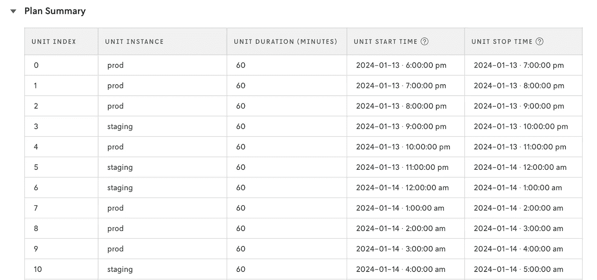
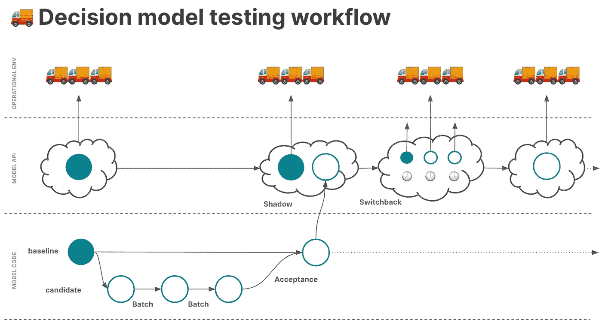

# 什么是决策模型的 Switchback 测试？

> 原文：[`towardsdatascience.com/what-is-switchback-testing-for-decision-models-e26d2007325a?source=collection_archive---------4-----------------------#2024-01-26`](https://towardsdatascience.com/what-is-switchback-testing-for-decision-models-e26d2007325a?source=collection_archive---------4-----------------------#2024-01-26)

## 决策模型的 A/B 测试

 [Tiffany Bogich](https://medium.com/@tiffanybogich?source=post_page---byline--e26d2007325a--------------------------------)

·发表于 [Towards Data Science](https://towardsdatascience.com/?source=post_page---byline--e26d2007325a--------------------------------) ·阅读时间：6 分钟·2024 年 1 月 26 日

--

决策模型的 Switchback 测试允许算法团队在真实的生产环境中将候选模型与基准模型进行比较，在这个环境中，两个模型都在为操作做出真实世界的决策。通过这种形式的测试，团队可以随机化应用于时间段和/或地点的模型，以减轻可能影响结果的干扰效应（如假期、重大事件等），这些效应在进行前后发布测试时可能会产生影响。

Switchback 测试可以有多个名称（例如，时间分割实验），通常也被称为 A/B 测试。虽然这种比较对理解很有帮助，但需要认识到，Switchback 测试和 A/B 测试是相似的，但并不相同。由于网络效应，决策模型不能像网页测试那样进行 A/B 测试。Switchback 测试可以考虑到这些网络效应，而 A/B 测试则不能。

例如，当你通过向用户展示不同的内容来进行网页的 A/B 测试时，用户在页面 A 上的体验不会影响另一个用户在页面 B 上的体验。然而，如果你尝试对配送司机的配送任务进行 A/B 测试——你根本无法做到。你不能将同一个订单分配给两个不同的司机进行对比测试。使用传统的 A/B 测试，无法在同一时间段或地点内隔离实验组和控制组。这就是 Switchback 测试的作用所在。

用兔子形状表示的模型 A 和 B 的反向测试示意图。图片来源：N. Misek 和 T. Bogich，[什么是决策模型的反向测试？](https://www.nextmv.io/blog/what-is-switchback-testing-for-optimization-models-and-decision-algorithms)（2023），Nextmv。经许可转载。

让我们进一步探索这种测试方法。

# 反向测试的一个例子是什么？

假设你在一家农场共享公司工作，该公司将来自当地农场的新鲜农产品（胡萝卜、洋葱、甜菜、苹果）和乳制品（奶酪、冰淇淋、牛奶）送到顾客的家中。你的公司最近投资升级了整个车队，使其具备冷链运输能力。由于所有车辆都能够运输温度敏感的物品，因此该公司准备移除与之前混合车队相关的业务逻辑。

在车队升级之前，你的农场共享公司采用后进先出（LIFO）方式处理温度敏感物品。这意味着如果取货的是冰淇淋等冷藏物品，司机必须立即将冰淇淋送到目的地，以避免融化成一团混乱的悲惨场面。这种 LIFO 逻辑有助于产品的完整性和顾客满意度，但也在路线变化和回溯时引入了低效。

在车队升级之后，团队希望移除这一约束，因为所有车辆都能通过冷藏设备更长时间地运输冷藏物品。之前通过历史数据进行的测试，如[批量实验](https://www.nextmv.io/blog/what-are-batch-experiments-for-optimization-models)（用于将一个或多个模型与离线或历史输入进行对比的临时测试 [1]）和[验收测试](https://www.nextmv.io/blog/what-is-acceptance-testing-for-optimization-models)（通过预定义的通过/失败标准，将当前模型与候选模型进行比较，以离线或历史输入为基础，在“接受”新模型之前进行的测试 [2]），显示候选模型相比于具有 LIFO 约束的生产模型，车辆在道路上的时间和未分配停靠点减少。你已经运行了一个[影子测试](https://www.nextmv.io/blog/what-is-shadow-testing-for-optimization-models-and-decision-algorithms)（一种在线测试，多个候选模型与当前生产模型并行运行，但“在阴影中”，不影响决策 [3]），以确保在生产条件下模型的稳定性。现在，你希望让候选模型在生产系统中进行决策，并将其结果与生产模型进行对比。

在这个测试中，你决定在两个城市：丹佛和纽约市基于时间（每 1 小时）进行随机化。以下是其中一个城市的实验单元及其应用的处理方法示例。

[Nextmv](http://cloud.nextmv.io) 上的反向测试样本计划总结。图片来源：[Nextmv.io Cloud Console](https://cloud.nextmv.io/)（2024）。经许可转载。

在进行 4 周的测试后，你发现候选模型的表现优于生产模型，因为它在道路上的时间更短、未分配的停靠点更少，而且司机们也更高兴，因为他们不需要为了适应 LIFO 约束在城镇中穿梭。基于这些结果，你和团队一起将新模型（没有 LIFO 约束）完全推广到两个地区。

# 为什么要进行回滚测试？

回滚测试有助于在存在网络效应的情况下建立对模型变更行为影响的理解和信心。由于它们以统计学上可靠的方式使用在线数据和生产环境，回滚测试能够深入了解新模型的决策如何在现实世界中产生影响，而不仅仅是“推向生产环境”然后期望最好的结果。回滚测试是理解候选模型在现实世界中如何表现的最稳健的测试方式。

这种理解是你无法通过影子测试获得的。例如，如果你运行一个在影子模式下改变目标函数的候选模型，所有的关键绩效指标（KPI）可能看起来都很好。但如果你以回滚测试的方式运行同一个模型，你可能会发现，相比于基线模型，配送司机拒绝订单的比例更高。有些行为和结果，你只有在以生产环境的方式运行候选模型，并观察它如何做出操作决策时，才能预见到。

此外，回滚测试对于路由空间中的供需问题尤其相关，例如最后一公里配送和调度。如前所述，标准的 A/B 测试技术在这些情况下并不适用，因为它们无法考虑网络效应。

# 你什么时候需要回滚测试？

引用自[混沌工程原则](https://principlesofchaos.org/)：“混沌更倾向于直接在生产流量上进行实验”[4]。回滚测试（和影子测试）就是为了应对这种类型的混沌。如前所述：当你需要观察一个候选模型如何做出影响实际操作的决策时，就是需要回滚测试的时候。

也就是说，第一轮测试不应是回滚测试。你应该先进行一系列历史测试，如批量测试、场景测试和验收测试，然后逐步进行生产数据上的影子测试。回滚测试通常是在决定是否将候选模型完全替代现有生产模型之前的最后一道关卡。

这是一个包含回滚测试的测试工作流程示意图，用于在部署新模型之前进行测试。图片由[Haley Eshagh](https://www.nextmv.io/author/haley-eshagh)提供。

# 回滚测试通常是如何进行的？

为了进行回溯测试（switchback tests），团队通常需要从零开始构建基础设施、随机化框架和分析工具。尽管回溯测试的好处显著，但其实现和维护的成本可能较高，通常需要专门的数据科学和数据工程支持。因此，这种测试在决策科学领域并不常见。

一旦基础设施搭建完成，回溯测试上线，接下来就是数据整理的工作，需要将各种信息拼凑在一起，弄清楚何时应用了什么处理，并将所有数据进行对账，以便对结果进行更正式的分析。

一些不错的参考资料包括关于[DoorDash 的相关话题博客文章，如这篇](https://doordash.engineering/2019/02/20/experiment-rigor-for-switchback-experiment-analysis/)（他们写了很多相关内容）[5]，以及 Databricks 解决方案工程师撰写的这篇 Towards Data Science 文章 [6]，该文提到了一篇来自[麻省理工学院和哈佛大学](https://arxiv.org/abs/2009.00148)的有用研究论文[7]，值得一读。

# 结论

决策模型的回溯测试类似于 A/B 测试，但允许团队考虑网络效应。回溯测试是 DecisionOps 工作流中的关键环节，因为它使用带有现实世界效应的生产数据运行候选模型。我们正在继续完善[Nextmv 的测试体验](https://www.nextmv.io/test) — 也希望能听到[你的反馈](https://discuss.nextmv.io/)。

> *如果你对决策模型测试和其他 DecisionOps 主题的更多内容感兴趣，订阅* [*Nextmv 博客*](https://www.nextmv.io/blog)*。*

# 披露

该[作者](https://www.nextmv.io/author/tiffany-bogich)在 Nextmv 担任产品负责人。

# 参考文献

[1] R. Gough, [优化模型的批量实验是什么？](https://www.nextmv.io/blog/what-are-batch-experiments-for-optimization-models) (2023)，Nextmv

[2] T. Bogich, [接受测试的未来是什么？](https://www.nextmv.io/blog/what-is-acceptance-testing-for-optimization-models) (2023)，Nextmv

[3] T. Bogich, [优化模型和决策算法的影子测试是什么？](https://www.nextmv.io/blog/what-is-shadow-testing-for-optimization-models-and-decision-algorithms) (2023)，Nextmv

[4] [混沌工程原理](https://principlesofchaos.org/) (2019)，混沌工程原理

[5] C. Sneider, Y. Tang, [回溯实验分析的实验严格性](https://doordash.engineering/2019/02/20/experiment-rigor-for-switchback-experiment-analysis/) (2019)，DoorDash Engineering

[6] M. Berk, 如何优化你的回溯 A/B 测试配置 (2021)，Towards Data Science

[7] I. Bojinov, D. Simchi-Levi, J. Zhao, [回溯实验的设计与分析](https://arxiv.org/abs/2009.00148) (2020)，arXiv
