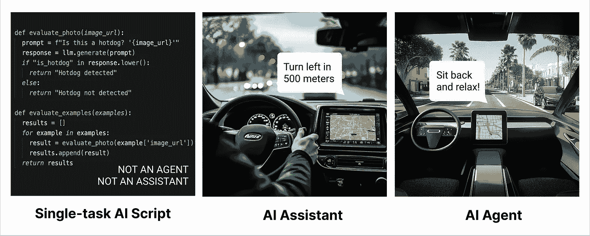
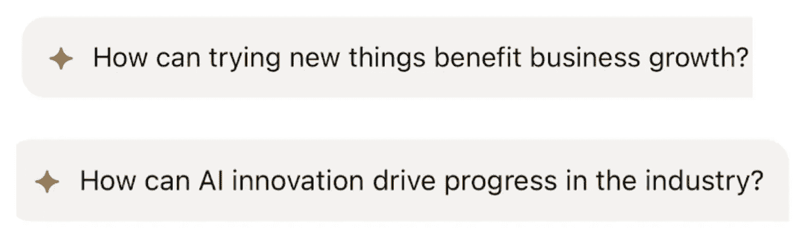

# 什么才是一个真正的 AI 代理？重新思考自主性的追求

> 原文：[`towardsdatascience.com/what-makes-a-true-ai-agent-rethinking-the-pursuit-of-autonomy-547ab54f4995?source=collection_archive---------0-----------------------#2024-10-02`](https://towardsdatascience.com/what-makes-a-true-ai-agent-rethinking-the-pursuit-of-autonomy-547ab54f4995?source=collection_archive---------0-----------------------#2024-10-02)

## 解构 AI 代理的六大核心特征，以及为什么基础更重要而非时髦词汇

 [Julia Winn](https://medium.com/@4thewinn?source=post_page---byline--547ab54f4995--------------------------------)

·发表于 [Towards Data Science](https://towardsdatascience.com/?source=post_page---byline--547ab54f4995--------------------------------) ·11 分钟阅读·2024 年 10 月 2 日

--

图片由作者使用 Midjourney 制作

科技界痴迷于 AI 代理。从销售代理到自主系统，像[Salesforce](https://www.salesforce.com/agentforce/)和[Hubspot](https://www.hubspot.com/products/sales/ai-prospecting-agent)这样的公司声称提供改变游戏规则的 AI 代理。然而，我至今没有看到一个由大规模语言模型（LLM）构建的真正有代理特征的令人信服的体验。市场上充斥着[机器人废话](https://www.businessinsider.com/ai-chatbots-bad-customer-service-botshit-inaccurate-information-airlines-accountability-2024-7)，如果 Salesforce 能做的只是说他们的新代理比[出版公司之前的聊天机器人](https://imgur.com/a/RNcOOpX)表现更好，那也实在是令人失望。

这是一个没人问过的最重要的问题：即便我们能够构建完全自主的 AI 代理，它们在多大程度上能成为用户最需要的东西？

让我们通过代理和助手的视角，使用旅行规划的案例。这一具体案例有助于阐明代理行为的每个组成部分带来的影响，以及你如何提出正确的问题来分辨炒作与现实的区别。希望到最后，你能自己决定，真正的 AI 自主性是否是值得投资的战略选择，还是这十年最具成本的分心。

**目录**

+   代理行为的谱系：一个实用框架

+   代理行为的构建模块 — 感知 — 互动性 — 持续性 — 反应性 — 主动性 — 自主性

+   未来前沿：主动自治

+   代理与助手

+   闪光之前的基础：数据在 AI 感知中的关键作用

+   从问题开始：为什么以用户为中心的 AI 更胜一筹

+   前进的道路：对齐数据、系统与用户需求

# 代理行为的光谱：一个实用框架

在学术界和工业界，对于什么构成真正的“代理”没有共识。我建议企业采用一个光谱框架，从[AI 学术文献](https://www.cs.cmu.edu/~motionplanning/papers/sbp_papers/integrated1/woodridge_intelligent_agents.pdf)中借用六个属性。基于“代理”或“非代理”的二元分类在当前的 AI 领域常常没有帮助，原因有以下几点：

1.  它没有捕捉到不同系统的细微能力差异。

1.  它可能导致不切实际的期望或低估系统的潜力。

1.  它与 AI 在实际应用中的渐进式发展不符。

通过采用基于光谱的方法，企业能够更好地理解、评估和传达 AI 系统不断发展的能力和需求。这种方法对任何参与 AI 集成、功能开发和战略决策的人都尤为宝贵。

通过旅行“代理”的例子，我们将看到现实世界中的实现如何在不同属性的代理行为光谱上有所体现。大多数现实世界的应用将位于每个属性的“基本”和“高级”之间。这种理解将帮助你在 AI 集成项目中做出更明智的决策，并与技术团队和最终用户进行更有效的沟通。到最后，你将能够：

1.  当有人声称他们构建了一个“AI 代理”时，识别出其中的虚假。

1.  理解在开发 AI 系统时什么才是真正重要的。

1.  在不被炒作迷惑的情况下指导你组织的 AI 战略。

# **代理行为的构建块**

## 1. 感知

*感知和解释其环境或相关数据流的能力。*

**基本**：理解关于旅行偏好的文本输入并访问基本的旅行数据库。

**高级**：集成并解释多种数据流，包括过去的旅行历史、实时航班数据、天气预报、当地活动安排、社交媒体趋势和全球新闻动态。

一个具有先进感知能力的代理可能会识别你过去旅行决策中的模式，例如偏好不需要驾车的目的地。这些洞察可以用来指导未来的建议。

## 2. 互动性

*与其操作环境有效互动的能力，包括用户、其他 AI 系统以及外部数据源或服务。*

**基本**：以问答形式参与旅行选项的交流，理解并回应用户查询。

**高级**：保持对话界面，要求澄清，提供建议的解释，并根据用户的偏好和上下文调整沟通风格。

像 ChatGPT、Claude 和 Gemini 这样的 LLM 聊天机器人设定了高度的互动标准。你可能已经注意到，大多数客户支持聊天机器人在这一方面有所不足。这是因为客户服务聊天机器人需要提供准确的公司特定信息，并且通常需要与复杂的后台系统进行集成。它们无法像 ChatGPT 那样在创造性和泛化方面进行过多的发挥，因为 ChatGPT 更注重互动回应而非准确性。

## 3\. 持久性

*能够创建、维护和更新有关用户及其关键互动的长期记忆。*

**基础**：保存基本的用户偏好，并能够在未来的会话中调用它们。

**高级**：随着时间推移，建立用户的旅行习惯和偏好综合档案，不断完善对其的理解。

AI 中的真正持久性需要同时具备读取和写入用户数据的能力。这意味着在每次互动后写入新的见解，并从这个扩展的知识库中读取信息以指导未来的行动。想想看，一个优秀的人类旅行代理会记得你喜欢靠过道的座位，或你倾向于将商务旅行延长为小型度假。一个具有强大持久性的 AI 会做同样的事情，不断构建并参考对你的理解。

ChatGPT 引入了[选择性持久性元素](https://openai.com/index/memory-and-new-controls-for-chatgpt/)，但大多数对话实际上是在“空白”状态下进行的。要实现真正的持久系统，你需要建立自己的长期记忆，包括每次提示的相关上下文。

## 4\. 反应性

*能够及时响应环境变化或接收数据的能力。做到这一点很好，严重依赖于强大的感知能力。*

**基础**：当用户手动输入新的货币汇率时，更新旅行费用估算。

**高级**：持续监控和分析多个数据流，以主动调整旅行行程和费用估算。

最好的 AI 旅行助手会注意到因重大事件而导致的目的地酒店价格突然上涨。它可以主动建议替代的日期或附近的地点来帮你节省费用。

一个真正的响应系统需要大量的实时数据流，以确保强大的感知能力。例如，我们的高级旅行助手能够根据政治暴动重新规划行程，这不仅仅是快速反应的问题。它还需要：

+   获取实时新闻和政府咨询信息流（感知）

+   理解这些信息对旅行的影响（解释）

+   能够迅速根据这些信息调整建议计划的能力（反应）

感知与反应之间的这种相互联系突显了为何开发真正的反应性 AI 系统是复杂且资源密集型的。这不仅仅是关于快速响应，更是关于创建一种全面的环境意识，从而能够做出有意义且及时的反应。

## 5\. 前瞻性

*预测需求或潜在问题的能力，并在没有明确提示的情况下提供相关建议或信息，同时仍然将最终决策交给用户。*

**基础**：建议在选定目的地的受欢迎景点。

**高级**：预测潜在需求并提供未经请求但相关的建议。

一个真正前瞻性的系统会提前标出护照即将过期的日期，建议由于预期的道路封闭而选择地铁而不是汽车，或者在受欢迎的餐厅一有空位立即建议设定日历提醒来进行预定。

真正的前瞻性要求系统具备全面的持久性、感知力，同时还要具备反应能力，才能做出相关、及时且具有情境感知的建议。

## 6\. 自主性

*在定义的参数范围内独立操作并做出决策的能力。*

自主性水平可以通过以下几个方面来表征：

1.  资源控制：AI 可以分配或管理的资源的价值和重要性。

1.  影响范围：AI 决策对整体系统或组织的广度和重要性。

1.  操作边界：AI 在没有人工干预的情况下做出决策的范围。

**基础**：对低价值资源的控制有限，做出的决策对系统的整体影响较小，并且操作在狭窄、预定义的边界内。例子：一个智能灌溉系统，根据土壤湿度和天气预报决定何时给花园中的不同区域浇水。

**中等**：控制中等价值的资源，做出的决策对系统部分产生显著影响，并在预定义的操作边界内具有一定灵活性。例子：一个零售连锁的 AI 驱动库存管理系统，决定库存水平和在多个门店之间的分配。

**高级**：控制高价值或关键资源，做出的决策对系统有显著的影响，并且操作具有广泛的操作边界。例子：一个科技公司的 AI 系统，优化整个 AI 流水线，包括模型评估和价值 1 亿美元的 GPU 的分配。

最先进的系统将对“什么”（例如：在何处部署哪些模型）和“如何”（资源分配、质量检查）做出重要决策，在做出正确的权衡以实现既定目标的同时，确保效果。

需要注意的是，“什么”和“如何”决策之间的区别可能会变得模糊，尤其是在任务范围扩大时。例如，选择部署一个需要大量资源的大型模型，涉及到两者的决策。复杂性范围中的关键区分点是代理被赋予管理的资源和风险的自主性水平。

这种框架有助于更细致地理解 AI 系统中的自主性。真正的自主性不仅仅是独立操作——它还关乎决策的范围和影响。错误的风险越大，就越需要确保采取适当的保障措施。查看我的文章[什么是“Eval”以及为什么产品经理需要关注它](https://medium.com/towards-data-science/what-exactly-is-an-eval-and-why-should-product-managers-care-b596dca275a7)，了解如何为 AI 产品构建有效的测试流程。

# 未来的前沿：主动自主性

*不仅能够在定义的参数内做出决策，还能在认为必要时主动修改这些参数或目标，以更好地实现整体目标。*

虽然它为真正适应性和创新的 AI 系统提供了潜力，但也带来了更大的复杂性和风险。目前，这种自主性水平在很大程度上是理论性的，并且引发了重要的伦理考量。

不出所料，大多数科幻作品中的坏 AI 都是已经突破了主动自主性界限的系统或代理，包括复仇者联盟中的乌尔特隆、《黑客帝国》中的机器、《2001 太空漫游》中的 HAL 9000，以及《机器人总动员》中的 AUTO 等。

主动自主性仍然是 AI 发展的前沿，承诺带来巨大的好处，但也需要深思熟虑、负责任的实施。事实上，大多数公司需要多年的基础性工作才能使其变得可行——你可以把关于机器人霸主的猜测留到周末去谈。

# 代理与助手

在考虑这六个属性时，我想提出一个有用的区分，称之为‘AI 助手’和‘AI 代理’。

**一个 AI 代理：**

+   展示至少五个六个属性（可能不包括主动性）

+   在其定义的领域内展现出显著的自主性，决定执行哪些行动以完成任务，而无需人类监督

**一个 AI 助手**

+   在感知、交互性和持久性方面表现出色

+   可能具备也可能不具备一定程度的反应性

+   缺乏或没有自主性或主动性

+   主要响应人类请求，并需要人类批准才能执行操作

尽管行业尚未就官方定义达成共识，但这种框架可以帮助你思考这些系统的实际影响。无论是代理还是助手，都需要具备感知、基本交互性和持久性等基础，以便发挥作用。

作者使用 Midjourney 创建的图像

按照这个定义，Roomba 吸尘器更接近一个真正的*智能体*，尽管它是一个基础版本。它不是主动的，但它确实在一个定义好的空间内行使自主性，自己制定路线，反应障碍物和脏污程度，并在没有持续人类输入的情况下自行返回充电座。

[GitHub Copilot](https://github.com/features/copilot) 是一个非常有能力的*助手*。它通过提供上下文相关的代码建议、解释复杂的代码片段，甚至根据注释草拟整个函数，极大地增强了开发者的能力。然而，它仍然依赖开发者来决定在哪里寻求帮助，并且最终的代码实现、架构和功能决策仍由人类做出。

代码编辑器[Cursor](https://www.cursor.com/)正在通过其主动标记潜在问题的实时方法，逐步进入智能体领域。Cursor 今天能够[根据你的描述创建整个应用程序](https://www.builder.io/blog/cursor-vs-github-copilot)，也更接近一个真正的智能体。

虽然这个框架有助于区分真正的智能体和助手，但现实世界的情况要复杂得多。许多公司急于将他们的 AI 产品标榜为“智能体”，但它们是否关注了正确的优先事项？理解为什么如此多的企业未能准确把握重点，以及为什么优先考虑那些不那么引人注目的基础工作是至关重要的。

# 基础先于闪光：数据在 AI 感知中的关键角色

像 Cursor 这样的开发者工具通过推动智能行为取得了巨大成功，但如今大多数公司却没能获得令人满意的结果。

编程任务有一个明确的问题空间，并且有清晰的成功标准（代码完成、通过测试）来进行评估。还有大量的高质量训练和评估数据以开源代码库的形式随时可用。

大多数试图引入自动化的公司，根本没有接近建立在正确数据基础上的条件。领导层往往低估了客户支持代理或客户经理所做的许多工作，依赖于未成文的信息。例如，如何处理错误消息，或者新库存何时可能到货等问题。这些都属于此类信息。正确评估一个用户可以询问任何问题的聊天机器人可能需要几个月时间。缺乏感知基础和测试捷径是导致垃圾机器人的主要原因之一。

# 从问题开始：为什么以用户为中心的 AI 更胜一筹

在将资源投入到智能体或助手之前，公司应该问自己：用户真正需要什么，他们的知识管理系统今天能够支持什么。大多数公司还没有准备好支持智能体的功能，许多公司还需要在感知和持久性方面做大量工作，才能为有用的助手提供动力。

一些最近的半成品人工智能功能回撤的例子包括[Meta 的明星聊天机器人，没人愿意和它们聊天](https://www.theverge.com/2024/7/30/24209918/meta-celebrity-lookalike-ai-chatbots-moves-on)和[LinkedIn 最近的失败实验](https://www.fastcompany.com/91196335/linkedin-ai-powered-prompt-questions-under-posts-feeds-premium-removed)，该实验涉及基于 AI 的内容建议。

*LinkedIn 的 AI 辅助提示：就像你那个过于热情的实习生，想要贡献，但根本不知道会议的内容是什么，或者你到底在哪个行业工作。[图片：LinkedIn]*

Waymo 和 Roomba 通过使用人工智能简化现有活动，解决了真实的用户问题。然而，它们的开发并非一蹴而就——两者都需要超过十年的研发才能推向市场。今天的技术已经进步，这可能使得像营销和销售这样的低风险领域能够更快地实现自主性。然而，创建卓越质量的人工智能系统仍然需要大量的时间和资源。

# 前进的路径：对齐数据、系统和用户需求

最终，人工智能系统的价值不在于它是否是一个“真正的”代理，而在于它能多有效地为用户或客户解决问题。

在决定在哪里投资人工智能时：

+   定义你想要解决的具体用户问题。

+   确定提供价值所需的最小代理行为支柱（感知、互动、持久性等）和每个支柱的复杂程度。

+   评估你今天所拥有的数据，以及这些数据是否可以提供给正确的系统。

+   现实地评估完成从当前状态到实现目标所需的能力之间的差距所需的工作量。

通过清楚了解现有数据、系统和用户需求，你可以专注于提供即时价值的解决方案。完全自主的人工智能代理具有强大的吸引力，但不要被炒作所迷惑。通过专注于正确的基础支柱，如感知和持久性，即使是有限的系统也能在效率和用户满意度上带来有意义的改进。

最终，尽管 HubSpot 和 Salesforce 可能都没有提供完全代理的解决方案，但任何在感知和持久性等基础设施上的投资仍然能够解决即时的用户问题。

记住，没有人会对洗衣机的“自主性”感到惊讶，但它可靠地解决了问题并改善了日常生活。优先考虑解决实际问题的人工智能功能，即使它们不是完全自主或具备代理能力的，也会提供即时价值，并为未来更复杂的能力奠定基础。

通过利用你的优势、弥补差距并将解决方案与真实用户问题对接，你将能为创建具有重要意义的人工智能系统做好准备——无论它们是代理、助手，还是不可或缺的工具。
