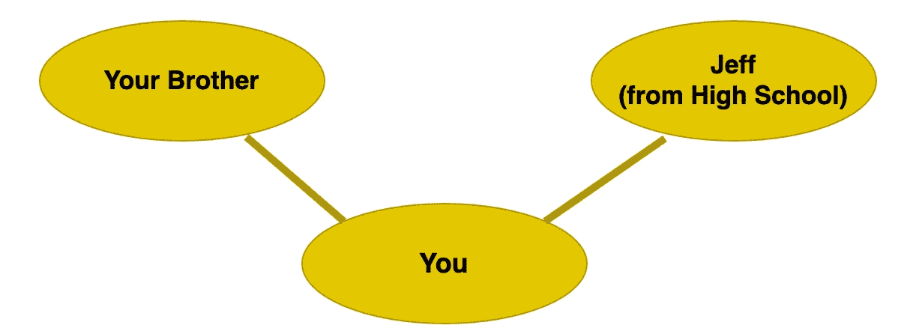
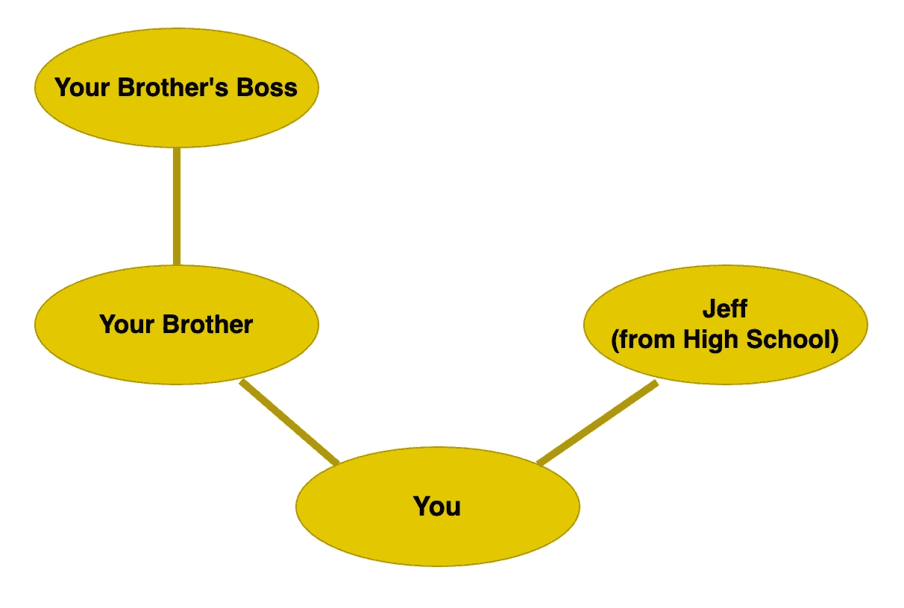
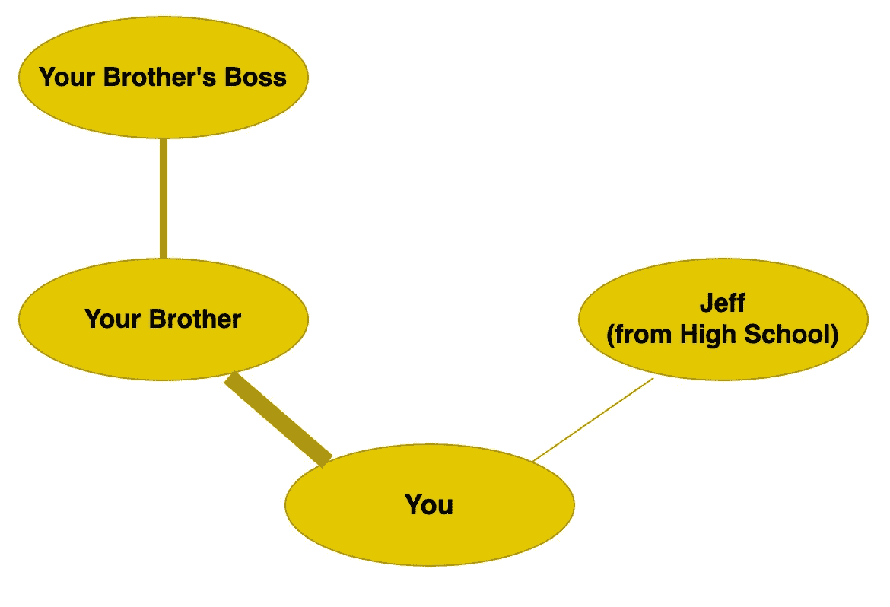
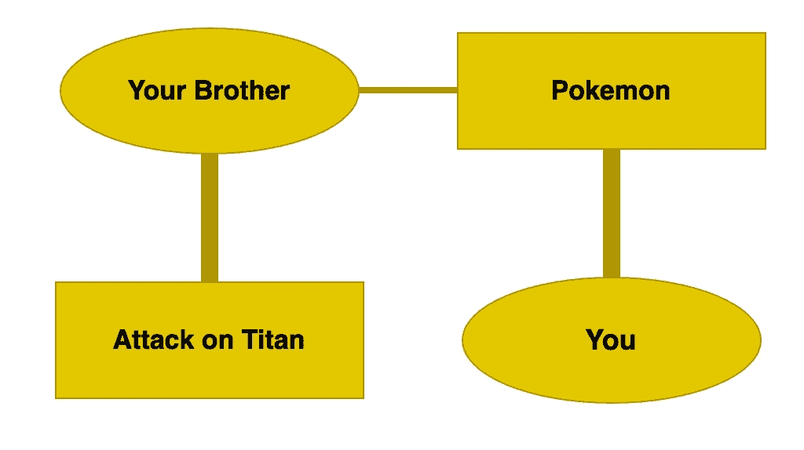
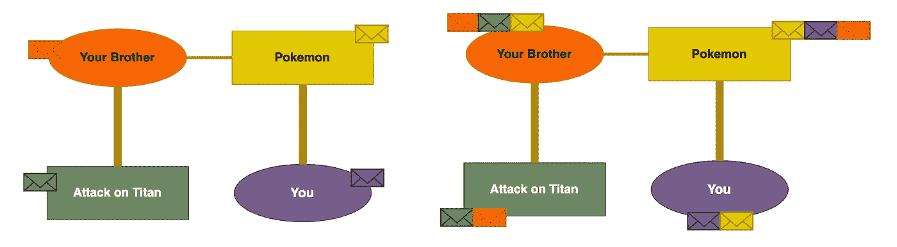
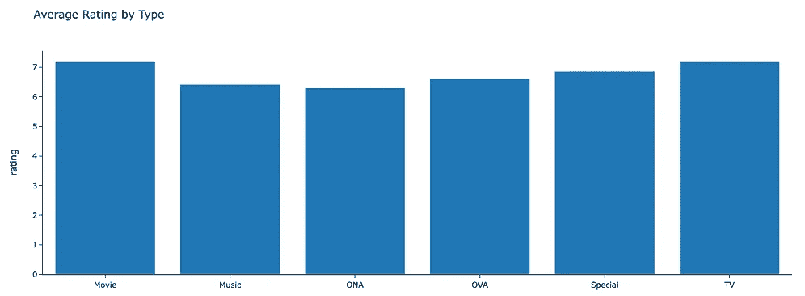
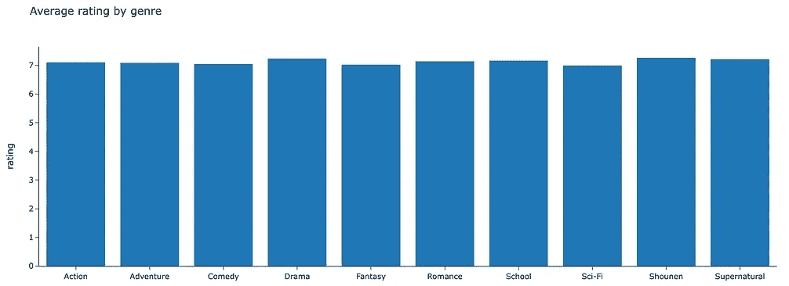
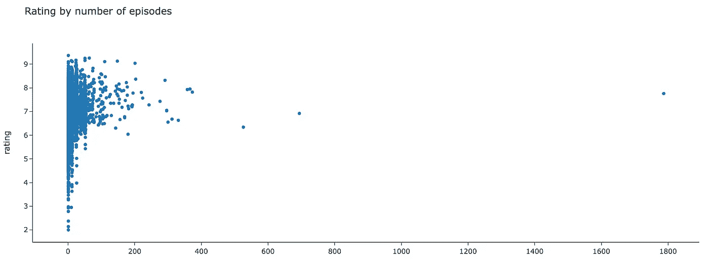
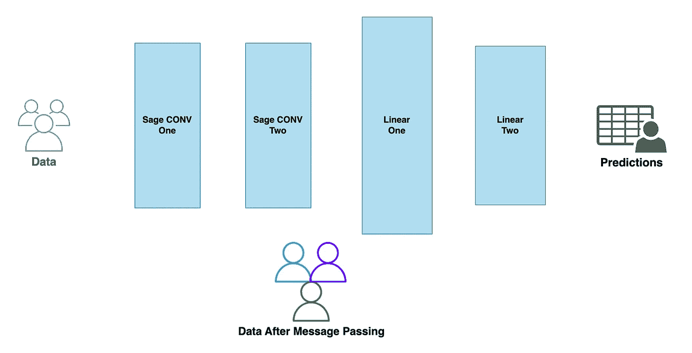
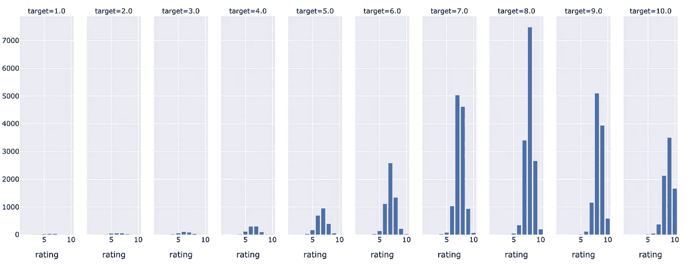

# 接下来做什么？探索图神经网络推荐引擎

> 原文：[`towardsdatascience.com/what-next-exploring-graph-neural-network-recommendation-engines-67d6a39d8817?source=collection_archive---------7-----------------------#2024-01-04`](https://towardsdatascience.com/what-next-exploring-graph-neural-network-recommendation-engines-67d6a39d8817?source=collection_archive---------7-----------------------#2024-01-04)

## 选择接下来要看的内容实在太难了。让我们构建一个 AI 算法来为我们做这件事吧！

 [Joseph George Lewis](https://medium.com/@josephgeorgelewis2000?source=post_page---byline--67d6a39d8817--------------------------------)

·发表于[Towards Data Science](https://towardsdatascience.com/?source=post_page---byline--67d6a39d8817--------------------------------) ·阅读时间约 11 分钟·2024 年 1 月 4 日

--

图片由[Dex Ezekiel](https://unsplash.com/es/@dexezekiel?utm_source=medium&utm_medium=referral)提供，来源于[Unsplash](https://unsplash.com/?utm_source=medium&utm_medium=referral)

内容推荐是机器学习和人工智能的常见应用。本文将回顾一种基于**图神经网络**的内容推荐方法，采用**链接回归**。其目标是构建一个内容推荐引擎，**根据用户对已观看内容的评分，预测用户对未观看内容的评分**。

我们将从图神经网络（GNN）的概念回顾开始，并介绍**PyTorch Geometric (PyG)**，这是一个 Python 中的 GNN 包。然后，我们将这些概念应用到我们自己的推荐引擎中，获取 AI 驱动的内容推荐。

感谢你花时间阅读，像往常一样，代码和有用链接将在文章末尾的参考资料中提供。

**概念回顾**

让我们从概念回顾开始；在我们使用图神经网络之前，理解其所有的关键部分是非常重要的。在开始理解 GNN 之前，最重要的是先了解图！所以让我们回顾一下在这个语境中我们所说的图的含义。

**图数据结构**

当我在图神经网络（GNN）的上下文中谈论图时，我指的是**图数据结构**。这与用于可视化数据的图表或图形不同，虽然有时你可能会从“图”这个词中期望看到的是图表或图形。

在社交网络的背景下考虑图数据结构可能会更有用。这类似于社交媒体网站如何存储数据。想象一下你的 Facebook 个人资料。你可能与兄弟和高中时的老朋友有联系，那么图数据结构就像这样：

来源：图片由作者提供

每个人都是一个**节点**，这只是意味着我们表示中的一个点。我们的节点具有诸如它们代表的人的名字这样的特征。每个连接都是一条**边**，它们代表两个节点之间的联系（友谊）。

现在，我们扩展这个网络也不难。你的兄弟可能与他的老板有联系。现在我们引入了一个重要的概念和想法。这就是**分离度**的概念。我们可以（相对安全地）假设你的观点和偏好与你的兄弟比与你的兄弟的老板更为接近。这是因为你与你的兄弟是直接连接的，而你必须通过跳跃才能到达他的老板：

来源：图片由作者提供

现在，让我们重新回顾一下高中时的老朋友。我们已经知道我们的节点可以有像名字和年龄这样的特征。现在，让我们在此基础上，为我们的边添加特征！假设你给朋友发消息的次数为边的特征。我们将其称为**边的权重**。在我们的例子中，这看起来可能像这样，其中边的权重通过边的粗细来表示；发的消息越多，线条越粗：

来源：图片由作者提供

现在我们知道了边的权重，我们也可以在构建我们对偏好和观点的理解时使用这一点。你经常联系的人，更有可能喜欢和你一样的东西；这就是你们成为朋友的原因！因此，从这个例子中，我们不仅可以说你的兄弟比与你有更远联系的人更像你，还可以说你们之间有更多的共同点，而不是那些与你直接连接的人。

我们可以添加的最后一个复杂性是使我们的图变得**异构**。这只是一个华丽的说法，意味着有两种类型的节点。让我们将这个例子应用到我们的项目中，假设我们有“人”和“动漫”：

来源：图片由作者提供

这个最终的图形非常接近本项目中使用的实际数据。我们可以看到你和你的兄弟都喜欢《宝可梦》。你的兄弟也非常喜欢《进击的巨人》。因此，在这个简单的图形中，我们已经可以看到一个算法如何向你推荐《进击的巨人》！

随着我们展开这个思路，我们可以开始看到如何利用庞大的数据图来为数百万用户做出判断和建议，因此，Netflix 知道你想看《办公室》第千次也就不足为奇了。不过没关系……我们都一样！现在让我们来看看这些图数据集是如何被神经网络使用的。

**图神经网络**

图神经网络（GNNs）是神经网络的扩展，它们使用图数据结构或**几何**数据，而不是传统神经网络使用的典型表格数据结构。这意味着从基础上讲，它们非常相似，都是由输入层、隐藏层和输出层组成。两者还共享多种类型的层，包括本文探讨的卷积层和线性层。主要的区别在于数据在训练过程之前和过程中如何被处理。

在这个项目中，使用了 Graph SAGE，这是神经网络中的一层。Graph SAGE 在其他可能的选项中负责**信息传递**。这也有时被称为**编码**。信息传递过程就是基于节点和边的邻居来构建对每个节点和边的理解：

来源：作者提供的图片

每个节点将信息传递给其邻居节点。这使得网络能够理解观看该动漫的用户类型，并且还能够理解这个用户喜欢什么类型的动漫！关于这一点，应用部分有一个特别相关的说明。

SAGE 层是一种**卷积层**。我们可以将其与用于图像识别的卷积神经网络中的卷积层进行比较。与基于相邻像素构建图像理解不同，这里我们是基于相邻节点来进行理解！为了更好地理解这一过程，本文最后推荐了一个精彩的 YouTube 系列。

我们网络的最后一部分仅仅是使用**线性**层来预测评分！线性层的工作方式与其他神经网络非常相似。它通过回归来预测评分，回归是基于网络所给定的特征进行的。我们可以在网络的末尾使用多个线性层，输出一组代表我们预测的神经元。这就完成了概念回顾！

## 使用 PyTorch Geometric 的 GNN 应用

该项目的实际应用跟随 PyTorch Geometric 示例进行链接回归，并将其应用于动漫数据集。文章末尾提供了 PyTorch Geometric 代码的链接。

图片由[Akin Cakiner](https://unsplash.com/@akin?utm_source=medium&utm_medium=referral)提供，来源于[Unsplash](https://unsplash.com/?utm_source=medium&utm_medium=referral)

现在让我们停止闲坐，开始构建吧！

项目所使用的数据来自 Kaggle，基于用户对各种动漫的评分。数据集采样了 6,000 个独特的用户及其对不同动漫的评分。由于训练资源有限，数据集已进行采样，这可能会影响模型的准确性。未来的工作可能会增加更多的资源来训练该模型。

以下是一些可视化图示，帮助快速理解数据集以及可能影响用户评分的某些动漫特征：

来源：图片由作者提供

来源：图片由作者提供

散点图提供了一种对比感，展示了我们处理的内容数量有多庞大！

**特征工程**

上面提到的几个似乎最能影响平均评分的特征是动漫的类型（电影、系列等）和类型（动作、喜剧等）。这些特征将作为网络中的节点特征。以下给出了这一步骤的代码。特征被转换为张量，然后沿相同的轴进行拼接，以便每个节点都有与其类型和类型相关的特征：

这些节点特征将很有用，但我们还可以提取一个额外的特征——动漫的标题。为此，使用了一个**句子变换器**来生成标题的嵌入。这个嵌入也作为一个特征使用：

基于动漫标题的嵌入可能是一个有用的特征，因为网络可能会识别出用户根据标题对内容进行相似评分。例如，喜欢《宝可梦：X 和 Y》的用户可能也会喜欢《宝可梦：钻石与珍珠》。这两者的嵌入也将会是相似的。

**构建图数据集**

上述选择的特征将使网络能够学习用户如何与不同类型、种类和标题的动漫互动。网络可以利用这些特征做出更好的预测。虽然也可以使用用户特征，但为了简便起见，我们仅使用动漫特征。值得注意的是，用户和动漫都将作为节点出现在我们的图数据集中。构建该对象的代码相对复杂；第一步是构建一个用户和动漫的 ID 序列，并将这些 ID 映射回原始数据。下面的代码展示了下一步，即使用这些映射来构建 PyTorch 数据对象：

*注意：在构建我们的图数据集时，我们将其设置为无向图。所以每个用户给动漫打上评分标签，但每个动漫也会用相同的标签给用户打分。这样做是为了让消息传递步骤能够使每个节点了解自己以及它与其他节点的连接。这种做法并不适用于所有应用场景，但在这里，它使得图能够更好地理解观看该动漫的用户类型以及这些用户喜欢的动漫类型。*

**构建图神经网络**

对于熟悉 PyTorch 的人来说，几何等效物看起来会非常相似。这个应用程序使用了三种不同的对象：

+   GNN 编码器 — 使用 SageConv 层通过消息传递来编码图形特征。

+   边解码器 — 使用线性层解码边缘并预测评分。

+   模型类 — 结合了上述两个对象，并定义了编码/解码的整体训练过程。

每个编码器和解码器对象仅实现了两个函数：

+   一个初始化函数 — 定义了层的结构。

+   一个前向函数 — 定义了输入到各层之间的转换。

我们网络的图示可能长这样：

来源：图片由作者提供

这是一个很好的机会来回顾为什么 GNN 对图形数据结构如此有效：

+   输入层（Sage CONV）没有固定的输入大小，因此可以使用任何大小的图来构建该嵌入。

+   一旦通过消息传递层（Graph SAGE One 和 Two）构建了图的嵌入，便可以使用更传统的层，如线性层。

在代码中，这是：

最后的步骤是构建训练过程。在这个示例中，我选择使用 RMSE 作为损失的衡量标准。这段代码对于在 PyTorch 中训练神经网络来说是相当标准的，因此如果你对更详细的文章感兴趣，可以查看文档或留言。

一旦训练过程定义完毕，我们就开始训练模型。

**评估模型**

在评估模型之前，重要的是要强调数据集的一个缺点。也就是，所提供的评分实际上是绝对值的序数值，即 0、1、2 等，因此严格来说，回归分析并不是最合适的决策。在实际场景中，这可能是一个问题，但对于这个项目，我们将坚持使用回归方法，并在最后对值进行四舍五入。

在评估之前，重要的是我们使用未见过的测试数据来对模型做出最终判断。在这种情况下，确保我们的预测被限定在 0 到 10 之间是很重要的，因为这是用户评分动漫的有效范围：

在评估模型时，我们使用了预测的均方根误差（RMSE）。在评估模型时，我们可以看到整体的 RMSE（在未见过的测试数据上）为 1.23。

我们可以通过下面的图表回顾每个实际评分在不同情况下的表现：

来源：图片由作者提供

很少有动漫评分低于五分，因此由于训练样本较少，模型在预测低评分时遇到困难。尽管如此，高评分通常能被正确预测。特别是在目标评分为 8 附近时，模型似乎能预测出最准确的评分。

在已部署的产品中，模型会进行估算，然后将这些原始分数返回给用户，或者在某些情况下，我们可以看到设置了阈值。例如，如果模型预测你会对内容打 7 分或更高，那么算法会推荐你观看该动漫。

对于像这样的项目，还有一些未来的推荐。例如，探索使用链接预测代替链接回归，甚至是链接分类。还有一种建议是可以使用更多的训练数据、超参数调优或其他增强学习方法，但这些超出了我的资源限制！在此之前，我有许多优秀的新内容推荐可以继续进行，感谢我的图神经网络！

这结束了作为推荐引擎的图神经网络探索。在这个项目中，我学到了很多关于图数据结构和 GNN 的知识。还有很多需要学习的内容，请继续关注未来的文章，在那里我将使用此代码库和 Captum Python 包探索可解释的 AI。

## 参考文献

代码：

 [## GitHub - josephlewisjgl/GNNRecommender: 来自 PyTorch Geometric 的自举教程。使用动漫…

### 来自 PyTorch Geometric 的自举教程。使用动漫数据集构建推荐系统。 - GitHub …

github.com](https://github.com/josephlewisjgl/GNNRecommender?source=post_page-----67d6a39d8817--------------------------------)

数据集（公共领域许可，CC0 [`creativecommons.org/publicdomain/zero/1.0/`](https://creativecommons.org/publicdomain/zero/1.0/)）：

 [## 动漫推荐数据库

### 来自 myanimelist.net 的 76,000 用户的推荐数据

[www.kaggle.com](https://www.kaggle.com/datasets/CooperUnion/anime-recommendations-database?source=post_page-----67d6a39d8817--------------------------------)

关于 GNN 的 YouTube 讲解系列：[`www.youtube.com/watch?v=fOctJB4kVlM`](https://www.youtube.com/watch?v=fOctJB4kVlM)

PyTorch Geometric 文档：

[## PyG 文档 - pytorch_geometric 文档

### 它包含了多种用于图形和其他不规则结构的深度学习方法，也被称为几何深度学习…

pytorch-geometric.readthedocs.io](https://pytorch-geometric.readthedocs.io/en/latest/index.html?source=post_page-----67d6a39d8817--------------------------------)

PyTorch Geometric 链接回归示例：

 [## Google Colaboratory

### 编辑描述

colab.research.google.com](https://colab.research.google.com/drive/1N3LvAO0AXV4kBPbTMX866OwJM9YS6Ji2?usp=sharing&source=post_page-----67d6a39d8817--------------------------------)

来自[Sahil Sheikh](https://medium.com/u/e1ffb7719884?source=post_page---user_mention--67d6a39d8817--------------------------------)的 Sage Conv Medium 文章：

 [## 探索 SageConv：一个强大的图神经网络架构

### 图神经网络（GNNs）是一类深度学习模型，旨在处理图结构数据…

medium.com](https://medium.com/@sheikh.sahil12299/exploring-sageconv-a-powerful-graph-neural-network-architecture-44b7974b1fe0?source=post_page-----67d6a39d8817--------------------------------)
