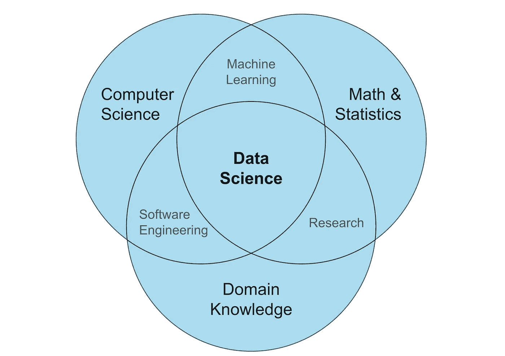

# 教授 AI 让我对数据技能与人性的理解

> 原文：[`towardsdatascience.com/what-teaching-ai-taught-me-about-data-skills-people-8accfe28c262?source=collection_archive---------1-----------------------#2024-12-04`](https://towardsdatascience.com/what-teaching-ai-taught-me-about-data-skills-people-8accfe28c262?source=collection_archive---------1-----------------------#2024-12-04)

## 作为企业 AI 教育者的旅程中学到的三大关键教训

 [Max Hilsdorf](https://medium.com/@maxhilsdorf?source=post_page---byline--8accfe28c262--------------------------------)

·发表于[Towards Data Science](https://towardsdatascience.com/?source=post_page---byline--8accfe28c262--------------------------------) ·阅读时长 8 分钟·2024 年 12 月 4 日

--

图片由[Mikhail Nilov](https://www.pexels.com/de-de/foto/buro-arbeiten-manner-geschaft-9301741/)提供。

作为一名 AI 教育者，我的工作是为企业团队提供他们需要的相关数据和 AI 技能，以帮助他们茁壮成长。但回顾过去，我意识到**我从他们身上学到了比他们从我身上学到的还要多**。

这里是我在教授 2000 多名员工和 10 多家大型企业中学到的关于数据技能、人性和学习艺术的内容。

# 1\. 数据科学的含义比你想的要多 —— 这些含义每天都在变化

## 定义模糊，技能要求也是如此

定义数据科学的方式有很多种。最流行的一种似乎是，数据科学位于计算机科学、数学与统计学和领域知识的交叉点上。

数据科学维恩图：图片由作者提供。

批评上面常用的维恩图总是很容易。然而，记住，它们是故意被简化过的，因此自然存在缺陷。就我个人而言，我认为它是一个有用的方式来概念化数据科学。如果你的工作涉及**计算机科学**（编程、数据库、云基础设施）、**数学与统计学**（统计学、随机过程、机器学习）和**领域知识**，并且程度不容忽视，**那么你可能是在做数据科学**。

## **数据科学家在实践中做的事情差异很大**

问题在于，这一定义过于笼统。我遇到过一些数据科学家，他们…

+   **无法**使用基本的编程工具或技术进行分析

+   **从未**训练过机器学习模型

+   与真实业务**隔离**，主要关注数据管道或性能优化

另一方面，我遇到过…

+   训练机器学习模型的**软件工程师**

+   使用 Python 构建复杂数据管道的**数据分析师**

+   使用高级统计模型但从未将其视为人工智能的**业务分析师**

在现实世界中，数据科学相关的工作角色可能会令人困惑，因为…

1.  类似角色之间存在显著的技能重叠（数据分析师、数据工程师、数据科学家、机器学习工程师、人工智能工程师）

1.  公司根据其行业和规模不同对这些工作角色进行不同定义

1.  人们承担新的责任，但仍留在同一职位，从未更改工作头衔

1.  相同角色的工作要求迅速变化

如果您能够使用 SQL 从数据仓库提取数据，并使用 Python 可视化统计洞察力，这在**10 年前的数据科学家**职位上将为您赢得一份好工作。如今，您在传统组织（如大型保险公司）仍有机会。但是，如果您试图作为数据科学家**加入独角兽科技初创公司**，最好知道如何训练 ML 模型，将其部署到云端，并设置监控和重新训练机制，包括数据、模型和代码版本控制。如果您有使用 ChatGPT 超过 10 年的经验，那将是另一个加分项。

## 找到您的个人发展路径

我认为从这些观察中得出的关键见解是，您应该**将个人技能发展集中在为业务带来价值的方面**，而不是被当前工作头衔的任意定义所要求的内容。

如果您正在解决相关的业务问题，享受您的工作，并且得到了很好的报酬，**不要担心其他人认为市场对您的需求是什么。**

当然，您应该努力扩展自己的技能，并且在当今世界，在同一家公司的同一职位上工作 10 年对长期技能发展来说很少是最佳选择。但是，如果您找到了一个您的个人技能集受到高度重视的业务领域，您可以确信**其他公司也存在同样的问题**。您的工作是确保您能够解决这个问题，现在和将来。

将自己与他人进行比较可能是有用的，但也会分散注意力。他人有不同的个性和兴趣，可能从事完全不同于您的工作。编程、机器学习、云平台等只是工具。**学习您真正需要精通以解决特定业务问题的工具。**

# 2\. 非技术数据和人工智能角色应该被接受，而不是被嘲笑

照片由[Bram Naus](https://unsplash.com/@bramnaus?utm_source=medium&utm_medium=referral)拍摄，来自[Unsplash](https://unsplash.com/?utm_source=medium&utm_medium=referral)

## 非技术数据和人工智能角色的示例

自从 GenAI 出现以来，**成千上万的 AI 专家**出现在职场（以及商业影响力）市场上。我们很容易对这一发展进行嘲笑，当然，我们都忍不住笑看那些像上面这样有趣的网络迷因。然而，在这一部分，我想为非技术性数据与 AI 角色**辩护**。

大多数数据与 AI 角色传统上是有一定技术性的，例如数据科学家、数据工程师或数据分析师，通常涉及编程和数学的专业化。通过我的工作，我遇到了许多非技术性的数据与 AI 角色。以下是一些例子：

+   **AI 战略顾问：** 帮助公司建立数据与 AI 战略的商业专业人士。

+   **AI 转型经理：** 领导 AI 项目，如 AI 企业、AI 战略或新的 AI 商业模式

+   **数据文化经理：** 建立数据治理，通过学习计划促进数据素养，并推动跨职能协作

+   **数据管理员：** 在组织内管理并确保数据的质量、一致性和安全性

此外，我还遇到过来自非技术领域的专业人士，他们专注于数据与 AI。以下是一些例子：

+   一位**学术研究顾问**，专门研究 AI 工具在研究中的应用

+   一位**法学教授**，专门研究欧洲 AI 法规

+   一位**动态设计师**，专门使用 AI 工具进行视觉艺术创作

所有这些专业人士都可以称自己为数据专家或 AI 专家——他们完全有理由这么做。他们在一个日益增长的领域中拥有**宝贵的专业知识**，并在他们的组织中发挥着重要作用。如果某人具备相关的数据/AI 技能，并且这些技能具有相关性且不易被替代，我乐意接受他们称自己为专家。

## 为什么非技术专家很重要

事实上，AI 领域目前的发展在技术成熟的过程中是正常的。为了驾驶第一辆汽车——奔驰专利汽车（1885 年），你必须非常精通技术，更不用说发明和制造这辆车的复杂性了。

现在，**许多汽车专家是非技术性的**，例如汽车销售员（= AI 销售）、驾驶教练（AI 教育者）或安全检查员（AI 合规官）。他们对汽车经济至关重要——就像非技术性的 AI 专家对 AI 经济至关重要一样。

在我的工作中，我发现这些专家非常**充实和谦逊**，让我从不同的角度看待问题，同时也提醒我，尽管我是技术专家，但在 AI 和 AI 业务方面我仍然有许多未知之处。

让我们**欢迎新进场的人**，与他们分享我们的知识，并从他们独特的专业知识中受益。

# 3. 教育是免费的——但你的时间不是

图片由[Aron Visuals](https://unsplash.com/@aronvisuals?utm_source=medium&utm_medium=referral)提供，来源于[Unsplash](https://unsplash.com/?utm_source=medium&utm_medium=referral)

## 在工作中学习的挑战

在数据科学领域，有**持续的压力保持更新**和学习新技能。毕竟，如果你不能随时为同事提供关于昨天晚上 10 点发布的新 LLM 的即席意见，那么你在团队中的目的是什么？

大多数数据人员都热衷于学习新技术，只要有机会。而如今，我们比以往任何时候都有更多的学习机会。几乎所有相关知识都可以免费在互联网上以文本、播客和视频形式获得。但如果是这样，那么**为什么感觉你从未有时间学习呢？**为了获得你需要满足同行、老板、就业市场和自己过高期望的技能？

残酷的事实是，你不是因为你的知识而被付费，而是因为你为公司带来的商业价值。如果你希望雇主支持你的学习之旅，向他们解释为什么这对他们是值得的。

## 如何说服雇主投资于你的技能

你的处境并不像你想象的那么糟糕。你可以提出几个令人信服的论点：

1.  “我们长期以来一直受到 X 问题的困扰。如果我学习 Y 技术，这可能会让我们更接近**彻底解决这个问题**。”

1.  “我最近在播客中听说了 X 技术。有了它，我们可能可以**使 Y 流程更高效**，每个月节省 Z 小时。我想有些时间来探索这个选项。”

1.  “我知道我们目前在公司没有 X 技术的用例。我想改变这一点，**充当这项技术的内部大使**，这在行业中变得越来越重要。”

要获得学习新技能的时间最简单的方法是提供一个具有清晰可信的路线图，指向实际业务成果的**用例示例**。然而，这并**不总是可能**。在这些情况下，我的建议是提出大使论点（第 3 点）。大多数公司都不愿意投入大量资源到新兴技术中。一个更便宜的解决方案是投资于那些**充当大使并推动组织内技术实验**的个人的教育，这可能会在最小资源投入下产生强大的用例。

## 免费午餐：选择一个鼓舞人心的工作环境

作为一名 AI 培训师，我教过各种机构的员工——从充满活力的 IT 公司到保守的银行。在我举办的每次培训中，至少有一个人让我惊讶于他们对数据和 AI 的**学习热情**。然而，他们表达兴趣的方式可能有根本的不同。

在一家科学公司中，最积极的参与者可能会就他们正在进行的 LLM 爱好项目寻求提示工程方面的建议。在一家大型金融机构中，一位高度积极的参与者可能会带着他们的 STATA 脚本打印稿参加培训，并用文本标记突出相关部分，请我帮忙将代码迁移到 Python。

这告诉我们，如果我们想要快速学习并处于技术进步的前沿，**仅有动机是不够的**（尽管它是一个前提）。理想情况下，我们希望选择一个工作环境，在那里我们**被志同道合的人围绕**。与其他技术爱好者一起工作，会改变你对技术可能性的看法，激励你每天变得稍微少一些无能。

这使得你的工作环境成为一个**“免费午餐”**。在无需额外时间投入的情况下，你的学习进度得到了加速。不要低估这一效应在长期中的威力！

# 结论

在这篇文章中，我分享了自己在大公司教授 AI 时学到的三点关键经验：

+   **1\. 数据科学的含义比你想象的更多 —— 这些含义每天都在变化**

+   **2\. 非技术性的数据与 AI 职位应当被接纳，而非嘲笑**

+   **3\. 教育是免费的 —— 但你的时间不是**

希望你觉得这篇文章有意义并且喜欢阅读！

我定期撰写关于 AI 的文章，专注于**AI 与音乐的交集**。以下是一些你可能也会喜欢的文章：

1.  🖼️ 声音与图像：使用 AI 创造惊艳的视听艺术

1.  💻 AI 如何去除难以察觉的水印

1.  🎶 音乐发现的未来：搜索 vs. 创作

关注我在[LinkedIn](https://www.linkedin.com/in/max-hilsdorf/)上，获取关于 AI 和音乐领域发展的定期更新。
